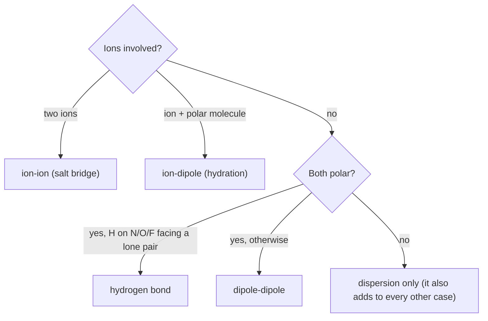

---
aliases:
  - Intermolecular Forces
  - IMF
  - Noncovalent Interaction
  - Van der Waals Forces
  - Forces intermoléculaires
tags:
  - type/concept
  - domain/chemistry
  - domain/biology
  - domain/physics
  - level/L1
  - level/L2
mastery: 0
prerequisites:
  - "[[Chemical Bond]]"
  - "[[Electronegativity]]"
  - "[[Covalent Bond]]"
  - "[[Ionic Bond]]"
  - "[[Molecular Geometry]]"
related:
  - "[[Hydrogen Bond]]"
  - "[[Water]]"
  - "[[Hydrophobic Effect]]"
  - "[[Coulomb's Law]]"
  - "[[Dielectric Constant]]"
  - "[[Lennard-Jones Potential]]"
  - "[[Protein Structure]]"
  - "[[Ligand Binding]]"
projects: []
sources:
  - "[[Chemistry 2e (OpenStax)]]"
  - "[[Molecular Biology of the Cell (Alberts)]]"
  - "[[Biochemistry (Berg)]]"
  - "[[Intermolecular and Surface Forces (Israelachvili)]]"
  - "[[University Physics (OpenStax)]]"
  - "[[Yakovchuk 2006 - Base-Stacking and Base-Pairing Contributions into Thermal Stability of the DNA Double Helix]]"
---

# Intermolecular Force

> [!abstract]
> Molecules attract each other without bonding: through full charges, permanent dipoles and fleeting dipoles. Each such contact is weak and fades quickly with distance, so a folded protein or a protein complex is held by many of them at once, and can still move and come apart.

## Definition

An **intermolecular force** (IMF) is an attraction between molecules, or between an ion and a molecule, that involves no sharing or transfer of electrons: **dispersion forces**, **dipole-dipole attractions** and **hydrogen bonds** between molecules,[^c2e101] and **ion-dipole attractions** between ions and polar molecules.[^c2e112] They are much weaker than the bonds inside molecules and set physical properties such as boiling points.[^c2e101] In biochemistry the same forces act between parts of one large molecule that are not covalently bonded; they are called **noncovalent interactions** (electrostatic interactions, hydrogen bonds, van der Waals interactions).[^berg]

## Why it matters

- **Structure is noncovalent.** Secondary, tertiary and quaternary protein structure, the double helix and every protein-ligand complex are held by these forces, helped by the [[Hydrophobic Effect]] ([[Protein Structure]], [[DNA]]).[^berg]
- **Binding is reversible.** Because each contact is weak, complexes form and dissociate at body temperature; a dissociation constant measures that balance ([[Ligand Binding]], [[Molar Concentration]]).
- **Structure files are read with distance laws.** Classifying a contact in a PDB file as a salt bridge, a [[Hydrogen Bond]] or a packing contact is a question of atom types and distances; [[Molecular Docking]] and [[Molecular Dynamics Simulation]] evaluate the energy functions of the Mathematical representation for many atom pairs ([[Force Field]]).

## Core (L1)

**Which forces act?** Dispersion acts between all atoms and molecules; the others need charges or dipoles ([[Electronegativity]], [[Molecular Geometry]]).[^c2e101][^c2e112]



| Interaction | Origin | Example in biology |
|---|---|---|
| ion-ion | full charges attract ([[Ionic Bond]]) | salt bridge between Lys and Asp side chains |
| ion-dipole | an ion orients the partial charges of polar molecules | water shell around Na⁺ and Cl⁻ ([[Water]])[^c2e112] |
| hydrogen bond | H bonded to N, O or F attracted by a lone pair of N, O or F | base pairs, helices and sheets ([[Hydrogen Bond]])[^c2e101] |
| dipole-dipole | permanent partial charges of polar molecules attract | polar C=O groups |
| dispersion (London) | an instantaneous dipole induces a dipole in a neighbour | packing of nonpolar side chains in a protein core |

**Strength.** Per contact and at similar distance, the order is ion-ion > ion-dipole > hydrogen bond > dipole-dipole > dispersion: full charges beat partial charges, and hydrogen bonds are the strongest dipole-dipole attractions.[^c2e101][^israel] Dispersion grows with the number of electrons, so it is not negligible for large molecules: the boiling points of the halogens rise from F₂ to I₂.[^c2e101] All are weak next to a covalent bond (about 377 kJ/mol): in water, Alberts lists 12.6 kJ/mol for an ionic interaction, 4.2 for a hydrogen bond and 0.4 per atom for a van der Waals attraction, near the thermal energy $RT \approx 2.6$ kJ/mol at 37 °C ([[Chemical Bond#Strong bonds and weak interactions]]).[^alberts] A single contact breaks and re-forms constantly; a structure is stable because many act together.[^alberts]

**Range.** The energy falls as a power of distance, $1/r^n$: $n = 1$ for two ions, 2 for an ion and a dipole, 3 for two fixed dipoles, 6 for dispersion.[^israel] Doubling the distance halves an ion-ion energy but divides a dispersion energy by 64: dispersion only counts between atoms in contact, which is why tight packing matters.

**Bio: what holds a folded protein and a complex.** The [[Hydrophobic Effect]] buries nonpolar side chains; hydrogen bonds between backbone groups form helices and sheets; salt bridges and van der Waals contacts between packed side chains complete the fold, and the same interactions join subunits ([[Protein Structure]]).[^berg] In DNA, hydrogen bonds pair the bases, and stacking of the flat base pairs ([[Orbital Hybridization]]) contributes most of the stability.[^yakovchuk]

## Deeper (L2)

**Water screens charges.** In a medium, Coulomb's law is divided by the dielectric constant $\varepsilon_r$, about 80 for water ([[Coulomb's Law]], [[Dielectric Constant]]).[^uphys] A salt bridge that is strong in vacuum is weak at the surface of a protein in water (computed below), and stronger when buried in the low-polarity protein interior. This is the same trend as Alberts' ionic interaction, 335 kJ/mol in vacuum but 12.6 in water.[^alberts] Dissolved salt screens further ([[Debye Length]]).

**Exchange, not creation.** A polar group in water already interacts with water. Folding or binding replaces those contacts with internal ones, so the net gain of each hydrogen bond or salt bridge is small; these interactions decide *which* structure forms more than *whether* it forms ([[Protein Structure]], [[Hydrophobic Effect]]).[^berg]

**Repulsion.** Atoms pushed closer than contact repel strongly as their electron clouds overlap. A common model adds a steep $r^{-12}$ repulsion to the $r^{-6}$ attraction: the [[Lennard-Jones Potential]], with a minimum at the contact distance.[^israel] Atoms behave as soft spheres, which is the basis of van der Waals radii and of shape complementarity at interfaces.

## Mathematical representation

With $k = 1/(4\pi\varepsilon_0) = 8.99 \times 10^9$ N m² C⁻²,[^uphys] charges $q$, dipole moments $\mu = \delta d$ (partial charges $\pm\delta$ separated by $d$), relative permittivity $\varepsilon_r$ and distance $r \gg d$:

$$U_{\text{ion-ion}} = \frac{k\,q_1 q_2}{\varepsilon_r\, r}, \qquad U_{\text{ion-dipole}} \approx -\frac{k\,q\,\mu}{\varepsilon_r\, r^2}, \qquad U_{\text{dipole-dipole}} \approx -\frac{2k\,\mu_1 \mu_2}{\varepsilon_r\, r^3}.$$

The last two are the best orientations (dipole pointing at the ion; two dipoles aligned head to tail). **Derivation of the ion-dipole law**: the ion sees $-\delta$ at $r - d/2$ and $+\delta$ at $r + d/2$, so $U = kq\delta\left(\frac{1}{r + d/2} - \frac{1}{r - d/2}\right) = -\frac{kq\delta d}{r^2 - d^2/4} \approx -\frac{kq\mu}{r^2}$.

Dispersion with contact repulsion (Lennard-Jones, depth $\epsilon$, minimum at $r_m$):[^israel]

$$U_{\text{LJ}}(r) = \epsilon\left[\left(\frac{r_m}{r}\right)^{12} - 2\left(\frac{r_m}{r}\right)^{6}\right], \qquad U_{\text{LJ}}(r_m) = -\epsilon \quad \left(\tfrac{dU}{dr} = 0 \iff r = r_m\right).$$

## Computational representation

The script places point charges on a line (toy dipole: $\pm 0.4\,e$ separated by 1 Å, invented), sums Coulomb energies in kJ/mol, and recovers each exponent as $n = -\log_2[U(2r)/U(r)]$, since $U \propto r^{-n}$ gives $U(2r)/U(r) = 2^{-n}$. The Lennard-Jones parameters (contact 3.5 Å, depth 0.4 kJ/mol) are set to Alberts' per-atom van der Waals values.[^alberts] Constants: $e$[^c2e23] and $N_A$.[^c2e31]

```python
import math

K_COULOMB = 8.99e9      # N m^2 C^-2, Coulomb constant
E_CHARGE = 1.602e-19    # C, elementary charge
N_A = 6.022e23          # mol^-1, Avogadro constant
KE2 = K_COULOMB * E_CHARGE**2 * N_A / 1e-10 / 1000   # kJ mol^-1 Å for two unit charges


def coulomb(z1: float, z2: float, r: float, eps_r: float = 1.0) -> float:
    """Energy (kJ/mol) of charges z1*e and z2*e, r Å apart, in a medium of relative permittivity eps_r."""
    return KE2 * z1 * z2 / (eps_r * r)

def energy(group_a, group_b, eps_r: float = 1.0) -> float:
    """Sum of pairwise Coulomb energies between two groups of (charge, position in Å) on one axis."""
    return sum(coulomb(za, zb, abs(xa - xb), eps_r) for za, xa in group_a for zb, xb in group_b)

def dipole(center: float, q: float = 0.4, d: float = 1.0):
    """Toy dipole: -q at center - d/2, +q at center + d/2 (mu = q*d, in e*Å)."""
    return [(-q, center - d / 2), (+q, center + d / 2)]

def lennard_jones(r: float, depth: float = 0.4, r_min: float = 3.5) -> float:
    """Dispersion attraction plus contact repulsion (kJ/mol), minimum -depth at r_min Å."""
    return depth * ((r_min / r) ** 12 - 2 * (r_min / r) ** 6)

cases = {
    "ion-ion":       lambda r: energy([(+1, 0.0)], [(-1, r)]),
    "ion-dipole":    lambda r: energy([(+1, 0.0)], dipole(r)),
    "dipole-dipole": lambda r: energy(dipole(0.0), dipole(r)),
    "dispersion":    lambda r: lennard_jones(r),
}
print(f"{'interaction':14s} {'E(4 Å)':>9s} {'E(8 Å)':>9s} {'E(16 Å)':>9s}  n_eff(8->16)")
for name, f in cases.items():
    e4, e8, e16 = f(4.0), f(8.0), f(16.0)
    print(f"{name:14s} {e4:9.3f} {e8:9.3f} {e16:9.4f}  {-math.log(e16 / e8, 2):5.2f}")

for eps in (1, 4, 80):   # vacuum, protein-like interior (assumed 4), water
    print(f"salt bridge at 4 Å, eps_r = {eps:2d}: {coulomb(+1, -1, 4.0, eps):8.1f} kJ/mol")
```

```text
interaction       E(4 Å)    E(8 Å)   E(16 Å)  n_eff(8->16)
ion-ion         -347.349  -173.674  -86.8371   1.00
ion-dipole       -35.286    -8.718   -2.1731   2.00
dipole-dipole     -7.410    -0.882   -0.1090   3.02
dispersion        -0.278    -0.006   -0.0001   6.00
salt bridge at 4 Å, eps_r =  1:   -347.3 kJ/mol
salt bridge at 4 Å, eps_r =  4:    -86.8 kJ/mol
salt bridge at 4 Å, eps_r = 80:     -4.3 kJ/mol
```

The exponents come out as 1, 2, 3 and 6. These are trends, not real interaction energies: force fields put partial charges on every atom, and $\varepsilon_r$ is not uniform.

## Worked example

> [!example] Forces at a protein-ligand interface
> A toy pocket (invented): a Lys side chain ($-\mathrm{NH_3^+}$), a Ser hydroxyl and a Leu side chain face a ligand carrying a carboxylate ($-\mathrm{COO^-}$), an amide N–H and a phenyl ring.
> 1. **Lys⁺ with COO⁻**: two ions, a salt bridge; also a hydrogen bond if an N–H points at an oxygen.
> 2. **Ser O–H with the ligand's C=O or COO⁻**: H on O facing a lone pair of O: hydrogen bond (Ser can also accept from the amide N–H).
> 3. **Leu with the phenyl ring**: both nonpolar, dispersion only; the gain comes mostly from the [[Hydrophobic Effect]] when both leave water.
> 4. **Range check**: move the ligand 1 Å away. From 4 to 5 Å the salt bridge keeps $4/5 = 80\%$ of its energy, the dispersion contacts only $(4/5)^6 \approx 26\%$: a poor fit loses most of the van der Waals energy, and in water the salt bridge is screened anyway, so affinity is a sum of many weak terms.[^alberts]

## Common misconceptions

> [!warning] "Boiling water breaks its O–H bonds"
> Boiling separates molecules: it overcomes intermolecular forces, and the covalent bonds inside each molecule stay intact.[^c2e101] Steam is still H₂O.

> [!warning] "Dispersion forces are always negligible"
> One contact is weak, but dispersion acts between every pair of atoms in contact and grows with molecular size;[^c2e101] summed over a tightly packed protein core or a large interface it is substantial.

## Exercises

> [!question] Exercise 1 (L1)
> List every intermolecular force between: (a) two CH₄; (b) two HCl; (c) two H₂O; (d) K⁺ and H₂O; (e) CH₃OH and H₂O.

> [!success]- Solution
> (a) Dispersion only (nonpolar). (b) Dipole-dipole and dispersion (H on Cl is not a hydrogen-bond donor by the N, O, F rule). (c) Hydrogen bonds, plus dispersion. (d) Ion-dipole: the oxygen side of water faces K⁺; plus dispersion. (e) Hydrogen bonds in both directions (the O–H of methanol donates to water's O and accepts from water's H), plus dispersion.

> [!question] Exercise 2 (L2, Python)
> With `KE2` and `lennard_jones` from the code: (a) at what distance does a +1/−1 ion pair have $|U| = RT$ at 310 K ($R = 8.314$ J mol⁻¹ K⁻¹[^gas]), in vacuum and in water? (b) Locate the Lennard-Jones minimum on a 0.001 Å grid and give $U$ at 3.0 Å.

> [!success]- Solution
> ```python
> RT = 8.314 * 310 / 1000
> print(f"{KE2 / RT:.0f} Å vacuum, {KE2 / (80 * RT):.2f} Å water")
> r_best = min((3.0 + 0.001 * i for i in range(3001)), key=lennard_jones)
> print(f"{r_best:.3f} {lennard_jones(r_best):.3f} {lennard_jones(3.0):+.2f}")
> ```
> Output: `539 Å vacuum, 6.74 Å water`, then `3.500 -0.400 +0.53`. (a) In water, beyond about 7 Å two charges interact more weakly than thermal motion: electrostatics in cells is short-ranged, and salt shortens it further ([[Debye Length]]). (b) Only 0.5 Å inside contact, the energy is already positive: repulsion dominates.

## Mastery checklist

- [ ] 1 Recognized: I can name dispersion, dipole-dipole, hydrogen bond and ion-dipole interactions and give an example of each.
- [ ] 2 Understood: I can decide which forces act between two species and rank them by strength and by range ($1/r^n$).
- [ ] 3 Practiced: I can derive the ion-dipole law, compute screened Coulomb energies and Lennard-Jones curves in code.
- [ ] 4 Applied: I classified the contacts at a real protein-ligand interface from structure coordinates.
- [ ] 5 Explained: I can explain why many weak, short-range interactions make structures both stable and dynamic, and why water weakens charges.

## References

[^c2e101]: [[Chemistry 2e (OpenStax)]], ch. 10, §10.1 "Intermolecular Forces" (dispersion forces, dipole-dipole attractions, hydrogen bonding; IMFs much weaker than bonds and overcome in phase changes; halogen boiling points).
[^c2e112]: [[Chemistry 2e (OpenStax)]], ch. 11, §11.2 "Electrolytes" (ion-dipole attractions; water orients around K⁺ and Cl⁻ when KCl dissolves).
[^c2e23]: [[Chemistry 2e (OpenStax)]], ch. 2, §2.3 "Atomic Structure and Symbolism" (Table 2.1, charge of the electron and proton).
[^c2e31]: [[Chemistry 2e (OpenStax)]], ch. 3, §3.1 "Formula Mass and the Mole Concept" (Avogadro's number).
[^alberts]: [[Molecular Biology of the Cell (Alberts)]], 4th ed. (2002), treatment of cell chemistry: table of covalent and noncovalent bonds (length, strength in vacuum and in water), many weak bonds acting together.
[^berg]: [[Biochemistry (Berg)]], 5th ed. (2002), §1.3 "Chemical Bonds in Biochemistry" (electrostatic interactions, hydrogen bonds, van der Waals interactions) and treatment of protein structure and folding.
[^israel]: [[Intermolecular and Surface Forces (Israelachvili)]], 3rd ed. (2011): distance dependence of charge, dipole and dispersion interactions; Lennard-Jones potential.
[^uphys]: [[University Physics (OpenStax)]], Volume 2: Coulomb's law and dielectrics (dielectric constant, representative values).
[^gas]: [[Chemistry 2e (OpenStax)]], treatment of the ideal gas law (gas constant $R$).
[^yakovchuk]: [[Yakovchuk 2006 - Base-Stacking and Base-Pairing Contributions into Thermal Stability of the DNA Double Helix]], *Nucleic Acids Research*.
