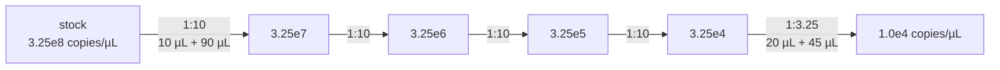

---
aliases:
  - Molarity
  - Concentration
  - mol/L
  - Dilution
  - C1V1 = C2V2
  - Concentration molaire
tags:
  - type/concept
  - domain/chemistry
  - domain/biology
  - level/L1
  - level/L2
mastery: 0
prerequisites:
  - "[[Mole]]"
  - "[[Water]]"
  - "[[Logarithm]]"
related:
  - "[[Stoichiometry]]"
  - "[[Aqueous Solution]]"
  - "[[Ligand Binding]]"
  - "[[Binding Free Energy]]"
  - "[[pH]]"
  - "[[Buffer Solution]]"
  - "[[Polymerase Chain Reaction]]"
projects: []
sources:
  - "[[Chemistry 2e (OpenStax)]]"
  - "[[Lehninger Principles of Biochemistry (Nelson)]]"
  - "[[Physical Biology of the Cell (Phillips)]]"
---

# Molar Concentration

> [!abstract]
> Molar concentration counts how many moles of a substance are dissolved per litre of solution. Every recipe, every dilution and every binding constant in biology is written in these units, from molar salt down to nanomolar drugs.

## Definition

The **molar concentration** (molarity) $c$ of a solute is its amount in moles divided by the volume of the **solution** in litres: unit mol/L, written M.[^c2e33] Diluting a solution adds solvent but not solute, so the amount $C \times V$ is conserved: $C_1 V_1 = C_2 V_2$.[^c2e33] Biological concentrations are usually given with SI prefixes:[^c2e1] 1 mM = 10⁻³ M, 1 µM = 10⁻⁶ M, 1 nM = 10⁻⁹ M, 1 pM = 10⁻¹² M.

## Why it matters

- **Reading methods.** Buffers (mM), primers (µM), enzymes and antibodies (nM): a methods section is a list of molar concentrations and dilutions ([[Polymerase Chain Reaction]], [[Buffer Solution]]).
- **Affinities are concentrations.** A dissociation constant $K_d$ is in M; comparing two drugs or two transcription factor sites means comparing $K_d$ values over many orders of magnitude ([[Ligand Binding]], [[Binding Free Energy]]).
- **From measurement to counts.** Absorbance gives a concentration ([[Beer-Lambert Law]]); concentration times volume gives moles and molecules ([[Mole]]), the input of any quantitative model of a cell ([[Cell]]).

## Core (L1)

**Computing a molarity.** $c = n/V$ with $n = m/M$ ([[Mole]]). To make 500 mL of 150 mM NaCl ($M = 22.990 + 35.45 = 58.44$ g/mol[^c2eaw]): $n = 0.150 \times 0.500 = 0.075$ mol, $m = 0.075 \times 58.44 = 4.38$ g, dissolved and brought to 500 mL of **solution**.[^c2e33]

**The unit ladder.** Each step is a factor 1000: 0.25 mM = 250 µM = 250,000 nM. A tenfold dilution of 1 mM gives 100 µM, not 10 µM.

**Dilution.** $C_1 V_1 = C_2 V_2$, with any volume unit as long as both sides use the same.[^c2e33] For 1 mL of a 10 µM primer working solution from a 100 µM stock: $V_1 = 10 \times 1000 / 100 = 100$ µL of stock plus 900 µL of water. Adding 1 µL of it to a 25 µL reaction gives $10 \times 1/25 = 0.4$ µM = 400 nM.

**Serial dilution.** Large factors are reached in steps, because no pipette measures 0.2 nL accurately. From a plasmid standard at $3.25 \times 10^8$ copies/µL ([[Mole#Worked example]]) to $10^4$ copies/µL:



**Bio: dissociation constants.** For a protein P binding a ligand L, $K_d = [\mathrm{P}][\mathrm{L}]/[\mathrm{PL}]$, a concentration; when the free ligand concentration equals $K_d$, half of the binding sites are occupied.[^lehninger] A 1 nM binder is half-bound at a thousand times lower ligand concentration than a 1 µM binder ([[Ligand Binding]]).

**Bio: how much is a nanomolar?** In a bacterium such as *E. coli*, 1 nM corresponds to about one molecule per cell:[^pboc] a "nanomolar" transcription factor may be present in only a handful of copies ([[Cell#Mathematical representation]]).

## Deeper (L2)

**Mixing several stocks.** In a reaction mix each component is diluted by its own factor $V_i/V_{\text{total}}$: $c_i^{\text{final}} = c_i^{\text{stock}} V_i / V_{\text{total}}$, and water fills the remaining volume (Exercise 3). "10×" buffers are stocks made to be used at a 1:10 dilution.

**Logarithmic thinking.** Concentrations met in biology span from 55.5 M for water itself ([[Water#Deeper (L2)]]) down to nanomolar and picomolar binding constants; ratios matter more than differences. Using $\mathrm{p}X = -\log_{10} X$, as for [[pH]], a $K_d$ of 10 nM is $\mathrm{p}K_d = 8$, and each unit is a factor of ten in affinity ([[Logarithm]]).

**Molarity is not the only concentration.** Mass concentration (ng/µL, mg/mL) is what a spectrophotometer or a balance reports; converting it to molarity needs the molar mass: $c = \rho_m / M$. At 50 ng/µL, a 300 bp PCR product has ten times the molarity of a 3 kb plasmid ([[Mole#Common misconceptions]]).

## Mathematical representation

- $c = n/V$; units mol L⁻¹ = M. Dilution: $n = C_1 V_1 = C_2 V_2$, so $C_2 = C_1 V_1/V_2$ and the **dilution factor** is $V_2/V_1$.
- **Serial dilution** with $k$ steps of factor $d$: $c_k = c_0\, d^{-k}$; the number of steps to go from $c_0$ to $c^\ast$ is $k = \log_d (c_0/c^\ast)$.
- **Mixture**: $c_i = c_i^{\text{stock}} V_i / \sum_j V_j$.
- **Molecules**: $N = c\,V\,N_A$ ($V$ in litres).
- **Occupancy** with ligand in excess: $\theta = [\mathrm{L}]/(K_d + [\mathrm{L}])$, which follows from $K_d$ and $[\mathrm{P}] + [\mathrm{PL}] = P_{\text{total}}$; $\theta = 1/2$ at $[\mathrm{L}] = K_d$.[^lehninger]

## Computational representation

```python
import math
import re

N_A = 6.022e23                                                   # mol^-1
PREFIX = {"": 1.0, "m": 1e-3, "u": 1e-6, "µ": 1e-6, "n": 1e-9, "p": 1e-12}

def to_molar(text: str) -> float:
    """'50 mM' -> 0.05 (mol/L). Accepts M, mM, uM/µM, nM, pM."""
    value, prefix = re.fullmatch(r"\s*([\d.eE+-]+)\s*([mµunp]?)M\s*", text).groups()
    return float(value) * PREFIX[prefix]

def pretty(c: float) -> str:
    """Express a molar concentration with the prefix that gives a number from 1 to 1000."""
    for prefix in ("", "m", "µ", "n", "p"):
        if c >= PREFIX[prefix] or prefix == "p":
            return f"{c / PREFIX[prefix]:.3g} {prefix}M"

def dilution(c1=None, v1=None, c2=None, v2=None) -> float:
    """Solve C1 V1 = C2 V2 for the one argument left as None (any consistent units)."""
    if c1 is None: return c2 * v2 / v1
    if v1 is None: return c2 * v2 / c1
    if c2 is None: return c1 * v1 / v2
    return c1 * v1 / c2

def serial_steps(start: float, target: float, fold: float = 10.0) -> tuple[int, float]:
    """Number of full fold-dilutions, then the final factor needed to reach target."""
    n = math.floor(math.log(start / target, fold))
    return n, start / target / fold ** n

def fraction_bound(ligand: float, kd: float) -> float:
    """Fraction of binding sites occupied, ligand in excess: [L] / (Kd + [L])."""
    return ligand / (kd + ligand)

print([pretty(to_molar(t)) for t in ("0.15 M", "50 mM", "2500 nM", "0.04 uM")])
print("V1 =", dilution(c1=100e-6, c2=10e-6, v2=1000), "µL of 100 µM stock, to 1000 µL")
print("primer in a 25 µL PCR:", pretty(dilution(c1=10e-6, v1=1, v2=25)))
print("serial dilution 3.25e8 -> 1e4 copies/µL:", serial_steps(3.25e8, 1e4))
print(f"NaCl for 500 mL of 150 mM: {0.150 * 0.500 * (22.990 + 35.45):.2f} g")
print(f"molecules at 1 nM in 1 µm^3 = 1e-15 L: {1e-9 * 1e-15 * N_A:.2f}")
print([round(fraction_bound(L, 10e-9), 2) for L in (1e-9, 10e-9, 100e-9)])
```

```text
['150 mM', '50 mM', '2.5 µM', '40 nM']
V1 = 100.0 µL of 100 µM stock, to 1000 µL
primer in a 25 µL PCR: 400 nM
serial dilution 3.25e8 -> 1e4 copies/µL: (4, 3.25)
NaCl for 500 mL of 150 mM: 4.38 g
molecules at 1 nM in 1 µm^3 = 1e-15 L: 0.60
[0.09, 0.5, 0.91]
```

Storing concentrations in one base unit (M) and converting only for display avoids the most common error, a slipped factor of 1000. The 1 µm³ volume is a toy bacterial cell.

## Worked example

> [!example] From stock tube to reaction
> A primer arrives at 100 µM. The protocol asks for 400 nM final in a 25 µL PCR.
> 1. **Units first**: 100 µM = 100,000 nM; target 400 nM: overall dilution factor 250.
> 2. **Directly**: $V_1 = 400 \times 25 / 100{,}000 = 0.1$ µL, too small to pipette accurately.
> 3. **Via a working solution**: dilute 1:10 to 10 µM (100 µL stock + 900 µL water), then add $V_1 = 400 \times 25 / 10{,}000 = 1$ µL per reaction (code output: 400 nM). Check: $10 \times 25 = 250$, as required.

## Common misconceptions

> [!warning] "Molarity is moles per litre of solvent"
> It is per litre of **solution**: dissolve the solute, then bring the volume to the mark.[^c2e33]

> [!warning] "A tenfold dilution of 1 mM gives 10 µM"
> 1 mM / 10 = 0.1 mM = 100 µM. Convert to one unit before dividing; a 1000-fold dilution gives 1 µM.

## Exercises

> [!question] Exercise 1 (L1)
> Convert 3,500 nM to µM. Then: how do you make 200 mL of 50 mM NaCl from a 5 M stock? And from solid NaCl?

> [!success]- Solution
> 3,500 nM = 3.5 µM. From the stock: $V_1 = 0.050 \times 200 / 5 = 2$ mL of stock, made up to 200 mL. From the solid: $0.050 \times 0.200 = 0.010$ mol, $\times 58.44 = 0.584$ g, dissolved and brought to 200 mL.

> [!question] Exercise 2 (L2)
> A protein binds its ligand with $K_d = 10$ nM. What fraction of sites is occupied at 1, 10 and 100 nM free ligand? Which concentration gives 90 % occupancy?

> [!success]- Solution
> $\theta = L/(K_d + L)$: 0.09, 0.50, 0.91 (code output). $\theta = 0.9 \iff L = 9 K_d = 90$ nM. Going from 10 % to 90 % occupancy takes an 81-fold change in concentration: binding curves are read on a log scale.

> [!question] Exercise 3 (L2, Python)
> Toy PCR recipe (invented), 25 µL total: 2.5 µL of 10× buffer, 0.5 µL of 10 mM dNTPs, 1 µL of each 10 µM primer, 1.5 µL of 25 mM MgCl₂, water to volume. Write `final_concentrations` and compute every final concentration and the water volume.

> [!success]- Solution
> ```python
> def final_concentrations(components: dict, total: float) -> dict:
>     """components: name -> (stock concentration, volume added); returns final concentrations."""
>     return {name: c * v / total for name, (c, v) in components.items()}
>
> recipe = {"dNTPs": (10e-3, 0.5), "primer F": (10e-6, 1.0), "primer R": (10e-6, 1.0), "MgCl2": (25e-3, 1.5)}
> for name, c in final_concentrations(recipe, 25.0).items():
>     print(f"{name:9s} {pretty(c)}")
> print("buffer 10x, 2.5 µL ->", 10 * 2.5 / 25, "x; water:", 25.0 - 2.5 - sum(v for _, v in recipe.values()), "µL")
> ```
> Output: dNTPs 200 µM, each primer 400 nM, MgCl₂ 1.5 mM, buffer 1.0×, water 18.5 µL. A master mix for $n$ reactions multiplies every volume by $n$ and leaves every final concentration unchanged.

## Mastery checklist

- [ ] 1 Recognized: I can define molarity and convert between M, mM, µM, nM and pM.
- [ ] 2 Understood: I can explain why $C_1 V_1 = C_2 V_2$ holds and why $K_d$ is a concentration.
- [ ] 3 Practiced: I can plan single, serial and multi-component dilutions by hand and in code.
- [ ] 4 Applied: I recomputed the final concentrations of a real protocol and converted a measured ng/µL into molarity and copies.
- [ ] 5 Explained: I can explain what a nanomolar concentration means in molecules per cell and why affinities are compared on a log scale.

## References

[^c2e33]: [[Chemistry 2e (OpenStax)]], ch. 3, §3.3 "Molarity" (moles of solute per litre of solution; dilution, $C_1 V_1 = C_2 V_2$).
[^c2e1]: [[Chemistry 2e (OpenStax)]], treatment of SI units and decimal prefixes (milli-, micro-, nano-, pico-).
[^c2eaw]: [[Chemistry 2e (OpenStax)]], standard atomic weights (Na 22.990, Cl 35.45).
[^lehninger]: [[Lehninger Principles of Biochemistry (Nelson)]], 8th ed. (2021), treatment of protein-ligand binding (dissociation constant $K_d$, half of the sites occupied when $[\mathrm{L}] = K_d$, fractional saturation).
[^pboc]: [[Physical Biology of the Cell (Phillips)]], 2nd ed., ch. 1 "Why: Biology by the Numbers" (1 nM is about one molecule in an *E. coli* cell).
