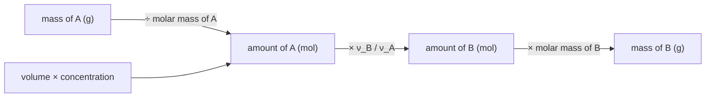

---
aliases:
  - Reaction Stoichiometry
  - Balancing Chemical Equations
  - Limiting Reactant
  - Limiting Reagent
  - Percent Yield
  - Stœchiométrie
tags:
  - type/concept
  - domain/chemistry
  - domain/mathematics
  - domain/biology
  - level/L1
  - level/L2
  - level/L3
mastery: 0
prerequisites:
  - "[[Mole]]"
  - "[[Molar Concentration]]"
  - "[[Molecule]]"
related:
  - "[[Stoichiometric Matrix]]"
  - "[[System of Linear Equations]]"
  - "[[Matrix]]"
  - "[[Gaussian Elimination]]"
  - "[[Redox Reaction]]"
  - "[[Aqueous Solution]]"
  - "[[Metabolism]]"
  - "[[Flux Balance Analysis]]"
  - "[[Polymerase Chain Reaction]]"
projects: []
sources:
  - "[[Chemistry 2e (OpenStax)]]"
  - "[[Biochemistry (Berg)]]"
  - "[[Orth 2010 - What Is Flux Balance Analysis]]"
---

# Stoichiometry

> [!abstract]
> Stoichiometry is the bookkeeping of chemical reactions: atoms are neither created nor destroyed, so a balanced equation fixes the mole ratios in which substances react, which reactant runs out first and how much product can form.

## Definition

**Stoichiometry** is the study of the quantitative relationships between the amounts of reactants and products in a chemical reaction. A **balanced equation** has the same number of atoms of each element, and the same total charge, on both sides; its coefficients give the ratios, in moles, in which species react and form.[^chem4] The **limiting reactant** is used up first and sets the **theoretical yield**; the amount actually obtained (**actual yield**) is usually smaller, and their ratio is the **percent yield**.[^chem4]

## Why it matters

- **Protocols.** Every reaction mix (PCR, ligation, labeling) is a stoichiometry problem: converting concentrations and volumes into moles ([[Mole]], [[Molar Concentration]]) tells which component runs out first (Worked example).
- **Metabolic models.** A genome-scale model is a list of balanced reactions stored as the [[Stoichiometric Matrix]] $S$; the steady-state condition $Sv = 0$ is stoichiometry applied to a whole network.[^orth] An unbalanced reaction creates or destroys atoms, which an optimizer can exploit, so element balance must be checked when a model is built (Exercise 5).
- **Yields in biotechnology.** The maximal amount of product per unit of substrate is a stoichiometric bound against which measured yields are compared (Advanced).

## Core (L1)

**Conservation.** A reaction rearranges atoms without changing their number. Balancing chooses whole-number coefficients so that each element appears equally on both sides; the formulas themselves never change.[^chem4] Aerobic oxidation of glucose and alcoholic fermentation:[^berg]

$$\mathrm{C_6H_{12}O_6 + 6\,O_2 \to 6\,CO_2 + 6\,H_2O} \qquad\qquad \mathrm{C_6H_{12}O_6 \to 2\,C_2H_5OH + 2\,CO_2}$$

By inspection: balance C first (6 CO₂), then H (6 H₂O), then O, which appears in every species, last: the right side has $6 \times 2 + 6 = 18$ O, glucose brings 6, so 6 O₂. With ions, charge must balance too ([[Redox Reaction]]).

**Coefficients are mole ratios.** One mole of glucose consumes 6 mol O₂ and gives 6 mol CO₂. Mass is conserved in total, not species by species: convert grams to moles with the molar mass before using the ratios.[^chem4]



**Limiting reactant and yield.** Divide the amount of each reactant by its coefficient: the smallest quotient is the number of moles of reaction that can occur, and that reactant limits; the others are in excess.[^chem4] Percent yield $= 100 \times$ actual / theoretical.[^chem4]

## Deeper (L2)

### Balancing is a linear system

Give each species an unknown coefficient and require, for every element, atoms in = atoms out. For $x_1\,\mathrm{C_6H_{12}O_6} + x_2\,\mathrm{O_2} \to x_3\,\mathrm{CO_2} + x_4\,\mathrm{H_2O}$:

$$\text{C: } 6x_1 - x_3 = 0, \qquad \text{H: } 12x_1 - 2x_4 = 0, \qquad \text{O: } 6x_1 + 2x_2 - 2x_3 - x_4 = 0.$$

This is a homogeneous [[System of Linear Equations]] $Ax = 0$: column $j$ of the [[Matrix]] $A$ lists the atoms of species $j$, negated for products. The solutions form the null space of $A$; here it is one-dimensional, spanned by $(1, 6, 6, 6)$, and the balanced equation is its smallest positive integer vector. [[Gaussian Elimination]] with exact fractions finds it mechanically (Computational representation).

| Dimension of the null space | Meaning |
|---|---|
| 0 | No balance possible: a species is missing or a formula is wrong |
| 1 | One balanced equation, up to scaling |
| 2 or more | Several independent reactions hide in the species list; chemistry, not algebra, decides (Exercise 4) |

For ions, add one row for charge, $\sum_j q_j x_j = 0$ with $q_j$ the charge of species $j$ (negated for products). The half-reaction method of [[Redox Reaction]] is the hand version of the same system.

## Advanced (L3)

**From one reaction to a network.** In a metabolic model each column of the [[Stoichiometric Matrix]] $S$ is the signed coefficient vector of one reaction and each row one metabolite; with flux vector $v$, steady state is $Sv = 0$.[^orth] Two matrices must not be confused:

- the **composition matrix** $E$ (elements × metabolites), used above to balance one reaction;
- the **stoichiometric matrix** $S$ (metabolites × reactions) of the network.

All reactions are element-balanced exactly when $ES = 0$: every column of $S$ lies in the null space of $E$. Computing $ES$ is the mass-balance check of model curation (Exercise 5). Charge needs extra care, because each metabolite is written in one protonation state and protons are added to close the books ([[Acid-Base Reaction]]).

**Yield bounds.** Fermentation gives at most 2 mol ethanol per mol glucose, $2 \times 46.07 / 180.16 = 0.511$ g per g (molar masses from standard atomic weights[^chemaw]). [[Flux Balance Analysis]] computes such bounds for whole networks by optimizing over the solutions of $Sv = 0$.[^orth]

## Mathematical representation

- A reaction is $\sum_{j=1}^{n} \nu_j X_j = 0$, with species $X_j$ and signed coefficients $\nu_j$ (negative for reactants, positive for products).
- Composition $a_{ej}$: atoms of element $e$ in $X_j$; charge $q_j$. Balance: $\sum_j a_{ej} \nu_j = 0$ for every $e$, and $\sum_j q_j \nu_j = 0$.
- From starting amounts $n_j^0$, the **extent** $\xi$ (mol of reaction) gives $n_j = n_j^0 + \nu_j \xi$. The reaction stops when a reactant reaches zero: $\xi_{\max} = \min_{j:\, \nu_j < 0} n_j^0 / |\nu_j|$. The minimizing $j$ is the limiting reactant, and the theoretical yield of product $p$ is $\nu_p\, \xi_{\max}$.

## Computational representation

Formulas parse into element counts, the composition matrix is reduced exactly with `fractions.Fraction`, and the null-space vector is scaled to integers:

```python
import re
from fractions import Fraction
from math import lcm

AVOGADRO = 6.02214076e23
ATOMIC_WEIGHT = {"H": 1.008, "C": 12.011, "O": 15.999}   # standard atomic weights


def parse_formula(formula: str) -> dict[str, int]:
    """Element counts of a formula without parentheses, e.g. 'C6H12O6'."""
    counts: dict[str, int] = {}
    for element, number in re.findall(r"([A-Z][a-z]?)(\d*)", formula):
        counts[element] = counts.get(element, 0) + int(number or 1)
    return counts


def molar_mass(formula: str) -> float:
    return sum(ATOMIC_WEIGHT[e] * n for e, n in parse_formula(formula).items())


def null_space_1d(rows: list[list[int]]) -> list[Fraction]:
    """The single null-space direction of an integer matrix (exact Gauss-Jordan)."""
    m = [[Fraction(x) for x in row] for row in rows]
    n_cols, pivots, r = len(m[0]), [], 0
    for c in range(n_cols):
        p = next((i for i in range(r, len(m)) if m[i][c] != 0), None)
        if p is None:
            continue
        m[r], m[p] = m[p], m[r]
        m[r] = [x / m[r][c] for x in m[r]]
        for i in range(len(m)):
            if i != r and m[i][c] != 0:
                m[i] = [a - m[i][c] * b for a, b in zip(m[i], m[r])]
        pivots.append(c)
        r += 1
    free = [c for c in range(n_cols) if c not in pivots]
    if len(free) != 1:
        raise ValueError(f"{len(free)} free coefficients: no unique balanced equation")
    x = [Fraction(0)] * n_cols
    x[free[0]] = Fraction(1)
    for i, c in enumerate(pivots):
        x[c] = -m[i][free[0]]
    return x


def balance(reactants: list, products: list) -> str:
    """Smallest whole-number coefficients. A species is 'formula' or ('formula', charge)."""
    species = [(s, 0) if isinstance(s, str) else s for s in reactants + products]
    sign = [1] * len(reactants) + [-1] * len(products)      # products on the other side
    parsed = [parse_formula(f) for f, _ in species]
    elements = sorted({e for p in parsed for e in p})
    rows = [[sg * p.get(e, 0) for p, sg in zip(parsed, sign)] for e in elements]
    rows.append([sg * q for (_, q), sg in zip(species, sign)])          # charge row
    x = null_space_1d(rows)
    coeffs = [int(v * lcm(*(w.denominator for w in x))) for v in x]
    if coeffs[0] < 0:
        coeffs = [-c for c in coeffs]
    if any(c <= 0 for c in coeffs):
        raise ValueError(f"no all-positive solution: {coeffs}")

    def show(c, s):
        q = s[1]
        charge = "" if q == 0 else (str(abs(q)) if abs(q) > 1 else "") + ("+" if q > 0 else "-")
        return (f"{c} " if c > 1 else "") + s[0] + charge
    k = len(reactants)
    left = " + ".join(show(c, s) for c, s in zip(coeffs[:k], species[:k]))
    right = " + ".join(show(c, s) for c, s in zip(coeffs[k:], species[k:]))
    return f"{left} -> {right}"


def limiting_reagent(coefficients: dict[str, int], moles: dict[str, float]):
    """Extent (mol of reaction events) each reactant allows; the smallest one limits."""
    extent = {s: moles[s] / coefficients[s] for s in coefficients}
    return min(extent, key=extent.get), extent


print(balance(["C6H12O6", "O2"], ["CO2", "H2O"]))
print(balance(["C6H12O6"], ["C2H6O", "CO2"]))
print(balance([("MnO4", -1), ("Fe", 2), ("H", 1)], [("Mn", 2), ("Fe", 3), "H2O"]))
for f in ("C6H12O6", "C2H6O"):
    print(f, round(molar_mass(f), 2))

# PCR mix (illustrative values): 50 uL, 200 uM each dNTP, 0.5 uM each primer;
# one 500-bp product with 50 % GC uses about 250 of each dNTP and one of each primer.
volume = 50e-6
moles = {"dATP": 200e-6 * volume, "fwd": 0.5e-6 * volume, "rev": 0.5e-6 * volume}
needs = {"dATP": 250, "fwd": 1, "rev": 1}
which, extent = limiting_reagent(needs, moles)
print(which, {s: f"{x:.1e}" for s, x in extent.items()}, f"{extent[which] * AVOGADRO:.2e} copies")
```

```text
C6H12O6 + 6 O2 -> 6 CO2 + 6 H2O
C6H12O6 -> 2 C2H6O + 2 CO2
MnO4- + 5 Fe2+ + 8 H+ -> Mn2+ + 5 Fe3+ + 4 H2O
C6H12O6 180.16
C2H6O 46.07
fwd {'dATP': '4.0e-11', 'fwd': '2.5e-11', 'rev': '2.5e-11'} 1.51e+13 copies
```

The parser ignores parentheses and hydrates (write `Ca3P2O8`, not `Ca3(PO4)2`). The charge row is what balances the permanganate equation, also solved by hand in [[Redox Reaction]].

## Worked example

> [!example] Which component of a PCR runs out first? (illustrative concentrations)
> A 50 µL PCR contains 200 µM of each dNTP and 0.5 µM of each primer, and amplifies a 500-bp product with 50 % GC ([[Polymerase Chain Reaction]]).
> 1. **Moles**, $n = cV$: each dNTP $200 \times 10^{-6} \times 50 \times 10^{-6} = 1.0 \times 10^{-8}$ mol; each primer $2.5 \times 10^{-11}$ mol.
> 2. **Coefficients per product duplex**: 250 A·T and 250 G·C pairs use about 250 of each dNTP (ignoring the nucleotides supplied by the primers), and one molecule of each primer is built into each duplex.
> 3. **Extents**: dATP $1.0 \times 10^{-8} / 250 = 4.0 \times 10^{-11}$ mol; each primer $2.5 \times 10^{-11} / 1$ mol. The primers limit: dATP is 400 times more abundant, but each duplex consumes 250 of it.
> 4. **Theoretical yield**: $2.5 \times 10^{-11} \times N_A \approx 1.5 \times 10^{13}$ duplexes. Starting from $10^4$ template copies, that is $\log_2(1.5 \times 10^{9}) \approx 30.5$ doublings at most: a stoichiometric ceiling on the [[Exponential Growth]] of the product, not a prediction of when the plateau starts.

## Common misconceptions

> [!warning] "Change the subscripts to balance"
> Subscripts define the substance: H₂O₂ is not H₂O. Only coefficients may change.

> [!warning] "Coefficients are mass ratios"
> They count moles. One mole of glucose (180 g) reacts with 6 mol O₂ (192 g), not with 6 g of O₂.

> [!warning] "The reactant present in the smallest amount limits"
> Compare amounts divided by coefficients. In Exercise 2, there are 0.125 mol O₂ against 0.028 mol glucose, yet O₂ limits, because each glucose needs 6 O₂.

> [!warning] "A balanced equation describes what happens"
> It records the net change only. Cells reach the overall glucose equation through dozens of enzymatic steps and carriers ([[Metabolism]]).

## Exercises

> [!question] Exercise 1 (L1)
> Balance the overall equation of photosynthesis: CO₂ + H₂O → C₆H₁₂O₆ + O₂.

> [!success]- Solution
> C first: 6 CO₂. H: 6 H₂O. O: the left has $12 + 6 = 18$, glucose takes 6, so 12 O atoms remain, 6 O₂: $\mathrm{6\,CO_2 + 6\,H_2O \to C_6H_{12}O_6 + 6\,O_2}$, the reverse of glucose oxidation. `balance(["CO2", "H2O"], ["C6H12O6", "O2"])` returns the same.

> [!question] Exercise 2 (L1)
> 5.0 g of glucose burns with 4.0 g of O₂. Which reactant limits, and what mass of CO₂ forms (CO₂ = 44.01 g/mol)?

> [!success]- Solution
> Glucose: $5.0 / 180.16 = 0.0278$ mol; O₂: $4.0 / 32.00 = 0.125$ mol. Divided by coefficients: $0.0278 / 1$ against $0.125 / 6 = 0.0208$: O₂ limits. CO₂ $= 6 \times 0.0208 = 0.125$ mol, i.e. 5.50 g. About 1.25 g of glucose is left over.

> [!question] Exercise 3 (L2)
> A yeast culture ferments 50.0 g of glucose and 20.0 g of ethanol is recovered. Compute the theoretical and percent yields.

> [!success]- Solution
> $50.0 / 180.16 = 0.2775$ mol glucose gives at most $2 \times 0.2775 = 0.555$ mol ethanol, $0.555 \times 46.07 = 25.57$ g. Percent yield $= 100 \times 20.0 / 25.57 = 78.2$ %. The rest of the glucose was either not consumed or went to cell mass and other products, which the single overall equation ignores.

> [!question] Exercise 4 (L2, Python)
> Run `balance(["H2", "O2"], ["H2O", "H2O2"])`. Explain the result with the dimension of the null space.

> [!success]- Solution
> It raises `ValueError: 2 free coefficients: no unique balanced equation`. Two elements give at most 2 independent equations for 4 unknowns, so the null space is 2-dimensional: every combination of $\mathrm{2\,H_2 + O_2 \to 2\,H_2O}$ and $\mathrm{H_2 + O_2 \to H_2O_2}$ balances. Algebra cannot say how much of each product forms; that is a question of mechanism and conditions.

> [!question] Exercise 5 (L3, Python)
> An invented lumped model of fermentation has R1: glucose → 2 pyruvate, R2: pyruvate → acetaldehyde + CO₂, R3: acetaldehyde → ethanol (formulas C₆H₁₂O₆, C₃H₄O₃, C₂H₄O, CO₂, C₂H₆O, acids written uncharged). Compute the atoms each reaction creates or destroys, and say what is missing.

> [!success]- Solution
> ```python
> def imbalance(reaction: dict[str, int]) -> dict[str, int]:
>     """Atoms created (+) or destroyed (-) by a reaction {formula: signed coefficient}."""
>     net: dict[str, int] = {}
>     for formula, coeff in reaction.items():
>         for e, n in parse_formula(formula).items():
>             net[e] = net.get(e, 0) + coeff * n
>     return {e: n for e, n in net.items() if n}
>
> toy_model = {"R1": {"C6H12O6": -1, "C3H4O3": 2},
>              "R2": {"C3H4O3": -1, "C2H4O": 1, "CO2": 1},
>              "R3": {"C2H4O": -1, "C2H6O": 1}}
> for name, rxn in toy_model.items():
>     print(name, imbalance(rxn))
> # R1 {'H': -4}
> # R2 {}
> # R3 {'H': 2}
> ```
> R1 destroys 4 H and R3 creates 2 H: the electron carrier is missing. Glycolysis reduces 2 NAD⁺ to 2 NADH per glucose, and the last step of alcoholic fermentation reoxidizes NADH to NAD⁺.[^berg] Adding NAD⁺/NADH and H⁺ to R1 and R3 balances every column, $ES = 0$, and the carrier pool is conserved over the pathway ([[Metabolism]], [[Redox Reaction]]).

## Mastery checklist

- [ ] 1 Recognized: I can say what a balanced equation, a limiting reactant and a percent yield are.
- [ ] 2 Understood: I can explain why coefficients are mole ratios and why the smallest amount does not necessarily limit.
- [ ] 3 Practiced: I can balance equations by inspection and as $Ax = 0$, and solve limiting-reactant and yield problems, by hand and in Python.
- [ ] 4 Applied: I checked the element balance of the reactions of a real metabolic model with $ES$, or the limiting component of a real protocol.
- [ ] 5 Explained: I can teach the link between balancing, null spaces and the stoichiometric matrix, including what a null space of dimension 0 or 2 means.

## References

[^chem4]: [[Chemistry 2e (OpenStax)]], ch. 4 "Stoichiometry of Chemical Reactions", sections 4.1 "Writing and Balancing Chemical Equations", 4.3 "Reaction Stoichiometry" and 4.4 "Reaction Yields" (balanced equations, mole ratios, limiting reactant, theoretical, actual and percent yield).
[^chemaw]: [[Chemistry 2e (OpenStax)]], standard atomic weights (H 1.008, C 12.011, O 15.999).
[^berg]: [[Biochemistry (Berg)]], 5th ed. (2002), treatment of glycolysis (2 NADH per glucose), alcoholic fermentation (regeneration of NAD⁺) and the complete oxidation of glucose to CO₂ and H₂O.
[^orth]: [[Orth 2010 - What Is Flux Balance Analysis]], *Nature Biotechnology* (stoichiometric matrix, steady-state mass balance $Sv = 0$, optimization of an objective).
