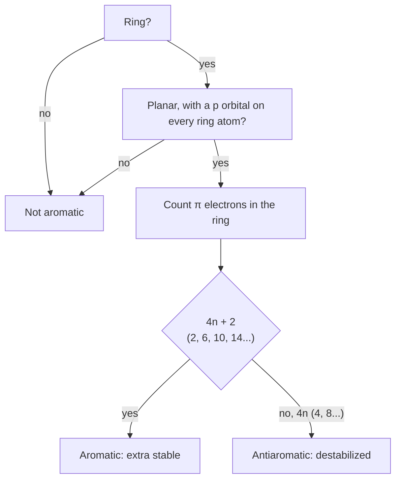

---
aliases:
  - Aromatic Compound
  - Hückel's Rule
  - 4n+2 Rule
  - Aromaticité
tags:
  - type/concept
  - domain/chemistry
  - domain/biology
  - level/L1
  - level/L2
mastery: 0
prerequisites:
  - "[[Orbital Hybridization]]"
  - "[[Resonance (Chemistry)]]"
  - "[[Skeletal Formula]]"
  - "[[Functional Group]]"
related:
  - "[[Heterocyclic Compound]]"
  - "[[Molecular Orbital Theory]]"
  - "[[Nucleotide]]"
  - "[[Amino Acid]]"
  - "[[DNA]]"
  - "[[Base Pairing]]"
projects: []
sources:
  - "[[Organic Chemistry (OpenStax)]]"
  - "[[MIT 5.12 - Organic Chemistry I]]"
  - "[[Biochemistry (Berg)]]"
  - "[[Lehninger Principles of Biochemistry (Nelson)]]"
  - "[[Yakovchuk 2006 - Base-Stacking and Base-Pairing Contributions into Thermal Stability of the DNA Double Helix]]"
---

# Aromaticity

> [!abstract]
> Some flat rings share their π electrons all around the ring; when the count is 2, 6, 10, ... electrons, the ring is unusually stable and stays flat. This is why nucleobases stack in DNA and why four amino acids have rigid, UV-absorbing side chains.

## Definition

A compound is **aromatic** when it is cyclic, planar and fully conjugated (a p orbital on every ring atom) and its ring holds $4n + 2$ π electrons, with $n = 0, 1, 2, \dots$ (**Hückel's rule**). A ring that satisfies the first three conditions with $4n$ π electrons is **antiaromatic**, destabilized rather than stabilized.[^os153][^512] Aromatic rings are markedly more stable than their alternating single and double bonds would predict.[^os152]

## Why it matters

- **Nucleic acids.** The bases A, G, C, T and U are flat aromatic heterocycles; flatness lets neighbouring base pairs stack, and stacking contributes most of the stability of the double helix ([[DNA]], [[Nucleotide]]).[^os28][^yakovchuk]
- **Proteins.** Phe, Tyr and Trp carry aromatic side chains, and His an aromatic imidazole ring that gains and loses a proton near pH 7 ([[Amino Acid]]).[^lehninger][^berg]
- **Measurements.** Aromatic rings absorb ultraviolet light: Trp and Tyr near 280 nm, which is used to estimate protein concentration, and nucleic acids near 260 nm ([[Spectroscopy]], [[Beer-Lambert Law]]).[^lehninger]
- **Sequence-dependent stability.** Because stacking energies differ between neighbouring base pairs, duplex stability depends on dinucleotide steps, not just on base counts ([[GC Content]]).[^yakovchuk]

## Core (L1)

**Benzene, the reference.** Benzene (C₆H₆) is a planar hexagon of sp² carbons. Its six C–C bonds all measure 139 pm, between a C–C single bond (154 pm) and a C=C double bond (134 pm): the π electrons are spread evenly around the ring, which two resonance structures only approximate ([[Resonance (Chemistry)]]).[^os152]

**Extra stability, measured.** Hydrogenating cyclohexene (one C=C) releases 118 kJ/mol; three independent double bonds would release about 3 × 118 = 354 kJ/mol, but benzene releases only 206 kJ/mol. Benzene is about 150 kJ/mol more stable than a ring of three isolated double bonds.[^os152]

**Applying Hückel's rule.**



**Counting π electrons.** Each C of a ring C=C contributes 1; a ring carbocation 0; a ring carbanion 2. A pyridine-like N (in a C=N bond) contributes 1, its lone pair staying in the ring plane; a pyrrole-like N (bearing H) contributes its lone pair, 2.[^os155] An sp³ ring atom (a CH₂) breaks the conjugation: the ring cannot be aromatic.

| Ring | π electrons | Verdict |
|---|---:|---|
| benzene | 6 ($n = 1$) | aromatic[^os152] |
| cyclobutadiene | 4 | antiaromatic, highly reactive[^os153] |
| cyclooctatetraene | 8 | non-aromatic: tub-shaped, not planar, reacts like an alkene[^os153] |
| pyridine | 6 | aromatic; lone pair available, so basic[^os155] |
| pyrrole | 6 | aromatic; lone pair used in the ring, so N is not basic[^os155] |

**The biological aromatic rings.**

| Molecule | Ring | Role |
|---|---|---|
| Phe | benzene (phenyl) | hydrophobic core residue[^lehninger] |
| Tyr | phenol | absorbs at 280 nm; OH can be phosphorylated[^lehninger] |
| Trp | indole (benzene fused to pyrrole) | main 280 nm absorber[^lehninger] |
| His | imidazole | acid-base catalyst, pKa near 6[^berg] |
| A, G | purine (pyrimidine fused to imidazole) | stacked, paired bases[^os28] |
| C, T, U | pyrimidine | stacked, paired bases[^os28] |

## Deeper (L2)

**Where Hückel's rule stops.** The $4n + 2$ rule is strictly a statement about monocyclic rings; fused systems such as naphthalene, indole or purine are aromatic by extension of the concept.[^os156] Counting the π electrons of the whole fused system still helps: indole and purine have 10.

**Planarity is the price of aromaticity.** Every ring atom must contribute a parallel p orbital, so aromatic rings are flat and rigid, the sp² geometry of [[Orbital Hybridization]]. Flat rings stack face to face: in the DNA double helix, neighbouring base pairs pile up along the axis, and measurements on DNA with single nicks and gaps show that stacking, which depends on the dinucleotide step, contributes more to duplex stability than base-pair hydrogen bonding.[^yakovchuk] The stacked bases sit inside the helix, away from water ([[DNA#Deeper (L2)]]).

**Which nitrogen is basic.** A heterocycle's basicity depends on whether the nitrogen's lone pair is in the π system. In imidazole (the His side chain), one N is pyridine-like (lone pair free, basic) and the other pyrrole-like (lone pair in the ring); protonating the first gives the imidazolium cation, which keeps 6 π electrons and stays aromatic. The ring's pKa near 6 lets His accept and give back protons at physiological pH ([[Nucleophile]], [[Heterocyclic Compound]]).[^berg][^os155]

## Mathematical representation

**Hückel molecular orbitals for a ring.** Model the π system of a planar ring of $N$ identical atoms with one p orbital each. Let $\alpha$ be the energy of an electron in an isolated p orbital and $\beta < 0$ the interaction between neighbouring orbitals (zero for non-neighbours). The Hamiltonian is the circulant matrix with $\alpha$ on the diagonal and $\beta$ between ring neighbours $j$ and $j \pm 1 \pmod N$. Its eigenvectors are $c_j = e^{2\pi i jk/N}/\sqrt{N}$ and its eigenvalues

$$E_k = \alpha + 2\beta \cos\frac{2\pi k}{N}, \qquad k = 0, 1, \dots, N-1.$$

Since $\cos(2\pi k/N) = \cos(2\pi (N-k)/N)$, there is one lowest level ($k = 0$, $E = \alpha + 2\beta$) and then **degenerate pairs**. Two electrons fill the lowest level and each further pair needs four: a closed shell takes $2 + 4n$ electrons, which is Hückel's rule. With $4n$ electrons the last pair is half-filled: antiaromatic.

**Delocalization energy.** Benzene ($N = 6$) has levels $\alpha + 2\beta$, $\alpha + \beta$ (×2), $\alpha - \beta$ (×2), $\alpha - 2\beta$. Six electrons give $E_\pi = 6\alpha + 8\beta$; three isolated C=C bonds give $3 \times 2(\alpha + \beta) = 6\alpha + 6\beta$. The difference, $2\beta$, is the model's measure of aromatic stabilization (negative, since $\beta < 0$). The model ignores σ bonds and electron repulsion; it explains the pattern, not the 150 kJ/mol. See [[Molecular Orbital Theory]].

## Computational representation

The levels, the filling and the 4n+2 check, in units of $\beta$ (level $x$ means $E = \alpha + x\beta$):

```python
import math


def huckel_levels(n_atoms: int) -> list[float]:
    """x_k = 2 cos(2 pi k / N) for a planar ring of N p orbitals; E_k = alpha + x_k beta.
    beta < 0, so a larger x means a lower (more bonding) level."""
    return sorted((2 * math.cos(2 * math.pi * k / n_atoms) for k in range(n_atoms)), reverse=True)


def fill(n_atoms: int, n_pi: int):
    """Fill the levels two electrons at a time; report closed shell and pi energy (in beta)."""
    shells = []                                   # groups of degenerate levels
    for x in huckel_levels(n_atoms):
        if shells and abs(shells[-1][0] - x) < 1e-9:
            shells[-1].append(x)
        else:
            shells.append([x])
    left, energy, closed = n_pi, 0.0, False
    for shell in shells:
        take = min(left, 2 * len(shell))
        energy += take * shell[0]
        left -= take
        if left == 0:
            closed = take == 2 * len(shell) and shell[0] > 0   # full shell, all bonding
            break
    return closed, energy


def huckel_rule(n_pi: int) -> bool:
    return n_pi >= 2 and (n_pi - 2) % 4 == 0


rings = [("cyclopropenyl cation", 3, 2), ("cyclobutadiene", 4, 4),
         ("cyclopentadienyl anion", 5, 6), ("benzene", 6, 6),
         ("tropylium cation", 7, 6), ("planar cyclooctatetraene", 8, 8)]
print(f"{'ring':26}{'N':>3}{'pi e':>6}{'4n+2':>7}{'closed':>8}{'E_pi/beta':>11}")
for name, n, e in rings:
    closed, energy = fill(n, e)
    print(f"{name:26}{n:>3}{e:>6}{str(huckel_rule(e)):>7}{str(closed):>8}{energy:>11.3f}")

closed, e_benzene = fill(6, 6)
print("benzene levels:", [round(x, 3) for x in huckel_levels(6)])
print("delocalization energy of benzene:", round(e_benzene - 3 * 2 * 1.0, 3), "beta")
```

```text
ring                        N  pi e   4n+2  closed  E_pi/beta
cyclopropenyl cation        3     2   True    True      4.000
cyclobutadiene              4     4  False   False      4.000
cyclopentadienyl anion      5     6   True    True      6.472
benzene                     6     6   True    True      8.000
tropylium cation            7     6   True    True      8.988
planar cyclooctatetraene    8     8  False   False      9.657
benzene levels: [2.0, 1.0, 1.0, -1.0, -1.0, -2.0]
delocalization energy of benzene: 2.0 beta
```

The closed-shell test and the $4n + 2$ test agree on every ring, as the derivation predicts. Real cyclooctatetraene escapes its open shell by folding into a tub, losing planarity.[^os153]

## Worked example

> [!example] Is the histidine ring aromatic, and which nitrogen takes the proton?
> Imidazole: five ring atoms, N1(H), C2, N3, C4, C5, all sp², with C2=N3 and C4=C5 double bonds.
> 1. **Ring, planar, conjugated?** Yes: every ring atom has a p orbital.
> 2. **Count.** C2, C4, C5: 1 each (3). N3 is in a C=N bond: 1, its lone pair stays in the plane. N1 carries H: its lone pair is in the ring, 2. Total $3 + 1 + 2 = 6 = 4(1) + 2$: **aromatic**.[^os155]
> 3. **Basic site.** Only N3's lone pair is free; N1's is part of the aromatic sextet. Protonation at N3 gives imidazolium, still 6 π electrons, still aromatic.
> 4. **Biology.** With a pKa near 6, about 9% of His side chains are protonated at pH 7 ([[Amino Acid]]), so the ring can both accept and return a proton during catalysis.[^berg]

## Common misconceptions

> [!warning] "Any ring of alternating double bonds is aromatic"
> Cyclobutadiene (4 π electrons) is antiaromatic and cyclooctatetraene (8) is tub-shaped and reacts like an ordinary alkene.[^os153] The electron count and planarity decide, not the drawing.

> [!warning] "Every nitrogen in an aromatic ring is basic"
> Pyrrole-like nitrogens (N–H in the ring) have committed their lone pair to the π sextet; only pyridine-like nitrogens are basic.[^os155] This decides which atoms of His, Trp or a nucleobase can be protonated or act as hydrogen-bond acceptors.

## Exercises

> [!question] Exercise 1 (L1)
> Aromatic, antiaromatic or non-aromatic: cyclopentadiene (C₅H₆, one CH₂ in the ring), the cyclopentadienyl anion, pyridine, cyclooctatetraene?

> [!success]- Solution
> Cyclopentadiene: non-aromatic, the sp³ CH₂ breaks the conjugation. Its anion: the CH carries a lone pair in a p orbital, 6 π electrons, aromatic. Pyridine: 6 π electrons, aromatic. Cyclooctatetraene: 8 π electrons but not planar, non-aromatic.[^os153][^os155]

> [!question] Exercise 2 (L1)
> Name the four amino acids with aromatic side chains and the two that dominate protein absorbance at 280 nm.

> [!success]- Solution
> Phe, Tyr, Trp and His (imidazole). Trp and Tyr absorb most strongly near 280 nm.[^lehninger] His is often classified with the positively charged residues rather than the aromatic ones, but its ring satisfies Hückel's rule (Worked example).

> [!question] Exercise 3 (L2)
> Count the π electrons of the purine ring system of adenine (N1, C2, N3, C4, C5, C6, N7, C8, N9–H) and check the 4n+2 form.

> [!success]- Solution
> Pyridine-like N1, N3, N7: 1 each (3). Pyrrole-like N9 (bonded to H, or to the sugar in a nucleotide): 2. Carbons C2, C4, C5, C6, C8: 1 each (5). Total 10 = 4(2) + 2. The exocyclic amino group is not counted in the ring. For a fused system this is an extension of Hückel's rule, consistent with purine's aromaticity.[^os156]

> [!question] Exercise 4 (L2, Python)
> Predict with `fill` and `huckel_rule` whether the cyclopropenyl anion (3 atoms, 4 π electrons) and the cycloheptatrienyl anion (7 atoms, 8 π electrons) are aromatic.

> [!success]- Solution
> ```python
> for name, n, e in [("cyclopropenyl anion", 3, 4), ("cycloheptatrienyl anion", 7, 8)]:
>     closed, energy = fill(n, e)
>     print(name, huckel_rule(e), closed, round(energy, 3))
> ```
> Output: `cyclopropenyl anion False False 2.0` and `cycloheptatrienyl anion False False 8.098`. Both have $4n$ electrons; the extra pair half-fills a degenerate antibonding pair: antiaromatic if planar, unlike the aromatic cyclopropenyl and tropylium **cations**.

## Mastery checklist

- [ ] 1 Recognized: I can state the four conditions of aromaticity.
- [ ] 2 Understood: I can explain benzene's equal bond lengths and its 150 kJ/mol extra stability, and the difference between pyridine-like and pyrrole-like nitrogen.
- [ ] 3 Practiced: I can count π electrons in Phe, Trp, His and the nucleobases, and derive the 4n+2 rule from the Hückel levels in code.
- [ ] 4 Applied: I used aromatic absorbance (A260, A280) or stacking-dependent stability (primer or probe design) on real data.
- [ ] 5 Explained: I can explain how ring planarity connects Hückel's rule to base stacking and to the catalytic role of histidine.

## References

[^os152]: [[Organic Chemistry (OpenStax)]], sec. 15.2 "Structure and Stability of Benzene".
[^os153]: [[Organic Chemistry (OpenStax)]], sec. 15.3 "Aromaticity and the Hückel 4n + 2 Rule".
[^os155]: [[Organic Chemistry (OpenStax)]], sec. 15.5 "Aromatic Heterocycles: Pyridine and Pyrrole".
[^os156]: [[Organic Chemistry (OpenStax)]], sec. 15.6 "Polycyclic Aromatic Compounds".
[^os28]: [[Organic Chemistry (OpenStax)]], ch. 28 "Biomolecules: Nucleic Acids".
[^512]: [[MIT 5.12 - Organic Chemistry I]], Spring 2005, lecture handout on aromaticity.
[^berg]: [[Biochemistry (Berg)]], 5th ed. (2002).
[^lehninger]: [[Lehninger Principles of Biochemistry (Nelson)]], 8th ed. (2021).
[^yakovchuk]: [[Yakovchuk 2006 - Base-Stacking and Base-Pairing Contributions into Thermal Stability of the DNA Double Helix]], *Nucleic Acids Research*.
