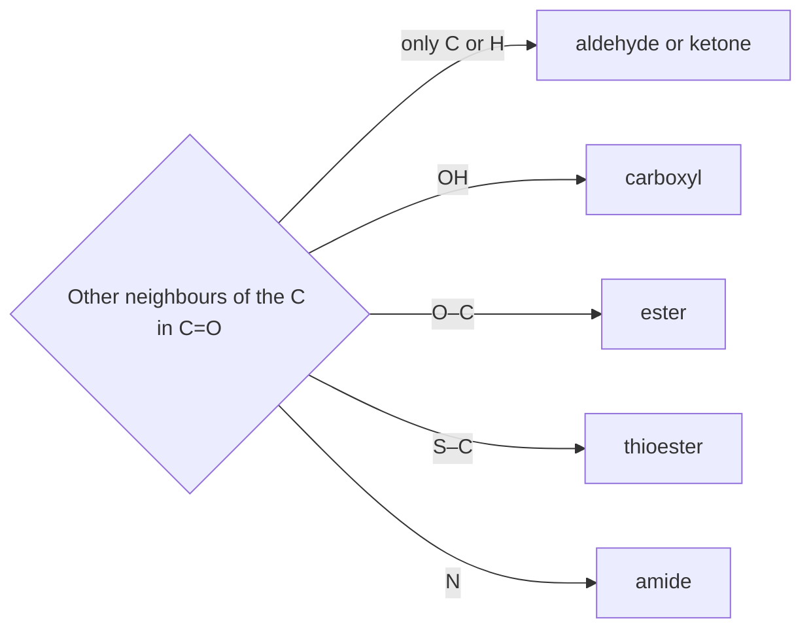

---
aliases:
  - Functional Groups
  - Chemical Group
  - Groupe fonctionnel
tags:
  - type/concept
  - domain/chemistry
  - domain/biology
  - domain/bioinformatics
  - level/L1
  - level/L2
  - level/L3
mastery: 0
prerequisites:
  - "[[Skeletal Formula]]"
  - "[[Electronegativity]]"
  - "[[Covalent Bond]]"
  - "[[Acid-Base Equilibrium]]"
related:
  - "[[Amino Acid]]"
  - "[[Carbohydrate]]"
  - "[[Nucleotide]]"
  - "[[Lipid]]"
  - "[[Peptide Bond]]"
  - "[[Phosphate Ester]]"
projects: []
sources:
  - "[[Organic Chemistry (OpenStax)]]"
  - "[[Chemistry 2e (OpenStax)]]"
  - "[[Biochemistry (Berg)]]"
  - "[[MIT 5.12 - Organic Chemistry I]]"
  - "[[Kyte 1982 - A Simple Method for Displaying the Hydropathic Character of a Protein]]"
  - "[[Lipinski 1997 - Experimental and Computational Approaches to Estimate Solubility and Permeability]]"
---

# Functional Group

> [!abstract]
> A functional group is a small arrangement of atoms (an OH, a C=O, an NH₂, a phosphate) that behaves the same way in every molecule that carries it: learn about ten of them and you can predict how most biomolecules dissolve, bond, ionize and react.

## Definition

A **functional group** is a group of atoms within a molecule that has a characteristic chemical behavior, largely the same in every molecule where it occurs; the chemistry of an organic molecule is therefore determined mainly by its functional groups.[^os3][^chem20] The carbon-hydrogen framework that carries them is comparatively inert, which is why organic chemistry courses are organized group by group.[^512]

## Why it matters

- **Biomolecules are defined by their groups.** An [[Amino Acid]] is an amino group and a carboxyl group on the same carbon; a sugar is a carbonyl with hydroxyls ([[Carbohydrate]]); a nucleic acid strand is a chain of phosphodiesters ([[Nucleotide]]); a fat is a set of esters ([[Lipid]]).[^berg]
- **Charge at pH 7 comes from a few groups.** Carboxyls, amines, the imidazole of His and phosphates decide a protein's net charge, its [[Isoelectric Point]] and how DNA migrates in [[Gel Electrophoresis]].[^berg]
- **Metabolism is group chemistry.** Reaction types ([[Hydrolysis]], acyl transfer, phosphoryl transfer, redox) are described by the groups they transform.[^os29]

## Core (L1)

### The ten groups of biochemistry

| Group | Structure | Where in biology | Polarity, H-bonds | At pH 7 |
|---|---|---|---|---|
| Hydroxyl (alcohol) | R–OH | Ser, Thr; every sugar | polar; donor and acceptor | neutral (not ionized)[^berg] |
| Carbonyl: aldehyde, ketone | R–CHO, R–CO–R′ | open-chain glucose (aldehyde), fructose (ketone) | polar C=O; acceptor only | neutral |
| Carboxyl | R–COOH | Asp, Glu, C-terminus, fatty acids | very polar | ionized, –COO⁻ (pKa ≈ 4)[^berg] |
| Amino | R–NH₂ | Lys, N-terminus | polar; donor and acceptor | protonated, –NH₃⁺ (pKa 8 to 11)[^berg] |
| Amide | R–CO–NR′₂ | every peptide bond; Asn, Gln | polar; N–H donor, C=O acceptor | neutral[^berg] |
| Ester | R–CO–O–R′ | fats, membrane lipids | polar; acceptor only | neutral |
| Thioester | R–CO–S–R′ | acetyl-CoA | acceptor; reactive acyl donor | neutral[^berg] |
| Thiol | R–SH | Cys | weakly polar; forms S–S bridges | mostly –SH (pKa ≈ 8.3)[^berg] |
| Ether | R–O–R′ | ring and glycosidic C–O–C of sugars | weakly polar; acceptor only | neutral |
| Phosphate (mono-, diester) | R–O–PO₃²⁻, R–O–PO₂⁻–O–R′ | phosphoproteins, sugar phosphates, the DNA and RNA backbone, phospholipids | very polar | negatively charged[^berg] |

R and R′ stand for carbon-based remainders of the molecule. Five of the groups contain a C=O and are told apart by what sits on the other side of the carbonyl carbon; the other five are recognized at the O, N, S or P atom itself (C–OH, C–O–C, C–N, S–H, P with four O).



### Predicting polarity

A bond is polar when its two atoms differ in [[Electronegativity]]. With Pauling values O 3.5, N 3.0, C 2.5, S 2.5, H 2.1, the O–H, N–H, C=O and C–O bonds are polar, while C–H, C–S and S–H are nearly nonpolar.[^chem7] Hence:

- a group is a hydrogen-bond **donor** when it carries H on O or N (hydroxyl, carboxyl, amino, amide N–H) and an **acceptor** when it has an O or N with a lone pair ([[Hydrogen Bond]]); ethers, esters and ketones accept but cannot donate;
- a thiol is far less polar than a hydroxyl: on the Kyte-Doolittle hydropathy scale Cys scores +2.5, on the hydrophobic side, while Ser scores −0.8 ([[Amino Acid]]).[^kyte]

**Predicting acidity.** At pH 7 a group with pKa well below 7 has lost its proton and one well above 7 keeps it ([[Acid-Base Equilibrium]]). With the pKa values of protein groups: carboxyls (≈ 3 to 4) are –COO⁻, amines (8 to 11) are –NH₃⁺, the thiol of Cys (8.3) is mostly neutral, and His (6.0) is mostly neutral but close enough to switch.[^berg] Alcohol, ether, ester and amide groups are neither acids nor bases at pH 7.[^berg]

## Deeper (L2)

**Why the carboxyl is acidic and the alcohol is not.** Both lose a proton from O–H. In a carboxylate the negative charge is shared over two equivalent oxygens by resonance, which stabilizes the base and makes the acid stronger; an alkoxide has its charge on one oxygen ([[Resonance (Chemistry)]]).[^os]

**Why the amide is not basic.** The nitrogen lone pair is delocalized into the C=O: the C–N bond gains partial double-bond character, the amide is planar and the nitrogen does not take up a proton at pH 7. This is the planarity of the [[Peptide Bond]].[^os26][^berg]

**Reactivity of acyl groups.** Thioesters, esters and amides are all hydrolyzed in water ([[Hydrolysis]]) but at very different rates. Acetyl-CoA is an activated carrier because its thioester transfers the acyl group readily, while the amide of the peptide bond is kinetically very stable.[^berg] The ranking thioester > ester > amide is the subject of [[Nucleophilic Acyl Substitution]].

**Phosphates carry the charge of nucleic acids.** Each phosphodiester of the backbone keeps one negative charge at pH 7, so DNA's charge is proportional to its length, the basis of size separation by electrophoresis.[^berg] Phosphoanhydride bonds, as in ATP, are the group-transfer currency of metabolism ([[Phosphate Ester]], [[ATP]]).[^os29]

## Advanced (L3)

- **Context shifts pKa.** Tabulated values hold for groups in water; in a folded protein, neighbouring charges or a buried position shift them, which is how active sites tune a Cys or a His ([[Enzyme Catalysis]]).[^berg]
- **Groups as features.** A molecule can be described by the substructures it contains, from functional groups to longer paths, as the bits of a [[Molecular Fingerprint]]. Lipinski's drug-likeness rules count hydrogen-bond donors (OH and NH groups) and acceptors (N and O atoms), two direct functional-group counts ([[Drug Discovery]]).[^lipinski]

## Mathematical representation

**Pattern matching.** With a molecule written as a labelled graph $G = (V, E, \ell, b)$ (elements $\ell(v)$, bond orders $b(e)$, implicit hydrogens $h(v)$; see [[Skeletal Formula#Mathematical representation]]), a functional group is a small labelled graph $P$, and it occurs in $G$ when an injective map $\phi: V(P) \to V(G)$ preserves labels and bond orders (a subgraph isomorphism, a [[Graph]] problem; the code below replaces it with local rules). A carbonyl carbon is a vertex $c$ with $\ell(c) = \mathrm{C}$ and a neighbour $o$ with $\ell(o) = \mathrm{O}$, $b(c, o) = 2$.

**Ionization.** For a group of acid constant $pK_a$, the [[Henderson-Hasselbalch Equation]] gives the fraction in the deprotonated (base) form at a given pH:

$$f_{\mathrm{base}} = \frac{1}{1 + 10^{\,pK_a - \mathrm{pH}}}.$$

A carboxyl ($pK_a = 4.1$) at pH 7.4 has $f_{\mathrm{base}} = 1/(1 + 10^{-3.3}) \approx 0.9995$.

## Computational representation

Molecules are written here as hydrogen-suppressed bond lists, `C1-C2 C2=O3` (element and atom number, `-` single and `=` double bonds). Implicit hydrogens come from valences, then local rules apply the classification above.

```python
import re
from collections import Counter

VALENCE = {"C": 4, "N": 3, "O": 2, "S": 2, "P": 5}

def build(spec: str):
    """'C1-C2 C2=O3' -> (element per atom, {atom: {neighbour: bond order}}, implicit H per atom)."""
    el, adj = {}, {}
    for e1, i, b, e2, j in re.findall(r"([A-Z])(\d+)([-=])([A-Z])(\d+)", spec):
        el[i], el[j] = e1, e2
        adj.setdefault(i, {})[j] = adj.setdefault(j, {})[i] = 1 if b == "-" else 2
    return el, adj, {a: VALENCE[el[a]] - sum(adj[a].values()) for a in el}

def functional_groups(spec: str) -> Counter:
    el, adj, h = build(spec)
    groups = Counter()
    acyl = {a for a in el if el[a] == "C" and any(el[n] == "O" and o == 2 for n, o in adj[a].items())}
    for c in acyl:                            # what sits on the other side of the C=O?
        het = [n for n, o in adj[c].items() if el[n] != "C" and not (el[n] == "O" and o == 2)]
        x = het[0] if het else None
        groups["aldehyde/ketone" if x is None else "amide" if el[x] == "N" else
               "thioester" if el[x] == "S" else "carboxyl" if h[x] == 1 else "ester"] += 1
    for a, nbrs in adj.items():               # groups without a C=O
        if any(n in acyl for n in nbrs):
            continue
        carbons = [n for n in nbrs if el[n] == "C"]
        if el[a] == "O" and h[a] == 1 and carbons:
            groups["hydroxyl"] += 1
        elif el[a] == "O" and len(carbons) == 2:
            groups["ether"] += 1
        elif el[a] == "N":
            groups["amino"] += 1
        elif el[a] == "S" and h[a] == 1:
            groups["thiol"] += 1
        elif el[a] == "P":
            esters = sum(any(el[x] == "C" for x in adj[o]) for o in nbrs)
            groups[["phosphate", "phosphomonoester", "phosphodiester"][min(esters, 2)]] += 1
    return groups

MOLECULES = {   # hydrogen-suppressed graphs of real molecules, uncharged forms
    "serine": "N1-C2 C2-C3 C3-O4 C2-C5 C5=O6 C5-O7",
    "N-methylacetamide": "C1-C2 C2=O3 C2-N4 N4-C5",
    "methyl acetate": "C1-C2 C2=O3 C2-O4 O4-C5",
    "S-methyl thioacetate": "C1-C2 C2=O3 C2-S4 S4-C5",
    "diethyl ether": "C1-C2 C2-O3 O3-C4 C4-C5",
    "glycerol 3-phosphate": "O1-C2 C2-C3 C3-O4 C3-C5 C5-O6 O6-P7 P7=O8 P7-O9 P7-O10",
}
for name, spec in MOLECULES.items():
    print(f"{name:21}", dict(functional_groups(spec)))
```

```text
serine                {'carboxyl': 1, 'amino': 1, 'hydroxyl': 1}
N-methylacetamide     {'amide': 1}
methyl acetate        {'ester': 1}
S-methyl thioacetate  {'thioester': 1}
diethyl ether         {'ether': 1}
glycerol 3-phosphate  {'hydroxyl': 2, 'phosphomonoester': 1}
```

N-methylacetamide models the peptide bond and S-methyl thioacetate the reactive end of acetyl-CoA. The OH groups on phosphorus are correctly not counted as alcohols. The rules are deliberately local: they would call a phenol a hydroxyl and ignore charges (Exercise 4).

## Worked example

> [!example] Groups and charge of the dipeptide Ser-Cys at pH 7
> 1. **Backbone.** N-terminal amino group (pKa ≈ 8.0 → –NH₃⁺), one amide (the peptide bond, neutral), C-terminal carboxyl (pKa ≈ 3.1 → –COO⁻).[^berg]
> 2. **Side chains.** Ser: hydroxyl, neutral. Cys: thiol, pKa 8.3, so $f_{\mathrm{base}} = 1/(1 + 10^{1.3}) \approx 0.05$ at pH 7: about 5 % thiolate.
> 3. **Net charge.** $+1 - 1 + 0 - 0.05 \approx 0$: a zwitterion, with a slightly negative fringe from the thiol.
> 4. **After phosphorylation of Ser.** The neutral hydroxyl becomes a phosphomonoester carrying negative charge, and the peptide becomes clearly anionic.[^berg]
> 5. **After oxidation of two such peptides.** Two thiols join into a disulfide (–S–S–), and the thiol group disappears.[^berg] Both modifications change the molecular formula, hence the mass, which is how proteomics detects them ([[Mass Spectrometry]]).

## Common misconceptions

> [!warning] "Every OH is an alcohol and is acidic"
> The OH of a carboxyl is acidic (pKa ≈ 4) because the carboxylate is resonance-stabilized; the OH of an alcohol such as Ser is not ionized at pH 7; the OH groups on a phosphate are acidic again. Classify the OH by what it is attached to.[^berg][^os]

> [!warning] "Amides are amines"
> Both contain N, but the amide nitrogen is bonded to a C=O and its lone pair is delocalized: amides are neutral and planar, amines are basic and protonated at pH 7. Asn and Gln are therefore polar but not basic.[^os26][^berg]

> [!warning] "Polar means charged"
> Hydroxyls and amides are polar but neutral. Charge requires an ionizable group on the right side of its pKa; polarity only requires an electronegativity difference.

## Exercises

> [!question] Exercise 1 (L1)
> Name the functional group of the side chain of Ser, Asp, Lys, Cys, Asn and Met (Met: –CH₂–CH₂–S–CH₃). Which can donate a hydrogen bond, and which carry a charge at pH 7?

> [!success]- Solution
> Ser: hydroxyl (donor, neutral). Asp: carboxyl (–COO⁻, negative; accepts). Lys: amino (–NH₃⁺, positive, donor). Cys: thiol (mostly neutral, a weak donor). Asn: amide (N–H donor, C=O acceptor, neutral). Met: C–S–C, the sulfur analogue of an ether (a thioether), neutral, no donor. Only Asp and Lys are charged.[^berg]

> [!question] Exercise 2 (L2, Python)
> Using $f_{\mathrm{base}}$ and the pKa values Asp/Glu 4.1, His 6.0, Cys 8.3, Lys 10.8 and Tyr 10.9, compute the fraction of each group in its base form at pH 7.4. Which side chains are essentially always charged, and which can switch?

> [!success]- Solution
> ```python
> for name, pka in [("Asp/Glu carboxyl", 4.1), ("His", 6.0), ("Cys thiol", 8.3),
>                   ("Lys amine", 10.8), ("Tyr phenol", 10.9)]:
>     print(name, round(1 / (1 + 10 ** (pka - 7.4)), 4))
> ```
> Output: Asp/Glu 0.9995, His 0.9617, Cys 0.1118, Lys 0.0004, Tyr 0.0003. Carboxyls are always –COO⁻ and Lys always –NH₃⁺ (base fraction 0.04 %). His is 4 % protonated and Cys 11 % thiolate: these two are within reach of a switch when the protein environment shifts their pKa, which is why they are common catalytic residues.[^berg]

> [!question] Exercise 3 (L2, Python)
> Run `functional_groups` on dimethyl phosphate, `C1-O2 O2-P3 P3=O4 P3-O5 P3-O6 O6-C7`, a model of one link of the nucleic acid backbone. Then write `disulfides(spec)` that counts S–S bonds, and test it on `C1-S2 S2-S3 S3-C4`.

> [!success]- Solution
> ```python
> print(dict(functional_groups("C1-O2 O2-P3 P3=O4 P3-O5 P3-O6 O6-C7")))
>
> def disulfides(spec: str) -> int:
>     el, adj, h = build(spec)
>     return sum(1 for a in el for b in adj[a] if el[a] == el[b] == "S" and a < b)
>
> print(disulfides("C1-S2 S2-S3 S3-C4"), disulfides("N1-C2 C2-C3 C3-S4 C2-C5 C5=O6 C5-O7"))
> ```
> Output: `{'phosphodiester': 1}`, then `1 0`. The phosphorus has two O–C esters, like each backbone phosphate between two sugars. The cystine fragment has one disulfide and cysteine none (its S has a hydrogen, so the detector calls it a thiol).

> [!question] Exercise 4 (L3)
> Give three molecules or situations for which the local rules above give a wrong or incomplete answer, and say what information a better annotator would need.

> [!success]- Solution
> (1) **Phenol** (Tyr): an OH on an aromatic carbon is called a hydroxyl, but it is far more acidic than an alcohol (pKa 10.9 versus not ionizable) and behaves differently; the annotator needs aromaticity ([[Aromaticity]]). (2) **Charged forms**: a carboxylate –COO⁻ or an ammonium –NH₃⁺ written with explicit charges break the valence-based hydrogen count; it needs formal charges. (3) **Acetals and hemiacetals** of sugars: the ring C–O–C next to a carbon bearing another O is reported as ether plus hydroxyl, while chemically the pair is one reactive unit ([[Nucleophilic Addition]]); it needs patterns larger than one atom and its neighbours. Each fix enlarges the pattern being matched, which is why real tools use a pattern language over the whole graph.

## Mastery checklist

- [ ] 1 Recognized: I can name the ten groups of the table on a drawn structure.
- [ ] 2 Understood: I can predict polarity, hydrogen bonding and charge at pH 7 of each group, and explain the carboxyl-alcohol and amide-amine differences.
- [ ] 3 Practiced: I can annotate a molecule's groups by hand and with the graph detector, and compute ionized fractions.
- [ ] 4 Applied: I annotated the side chains and modifications of a real protein or the groups of a real metabolite from a database record.
- [ ] 5 Explained: I can explain why context shifts pKa, why thioesters are activated and amides are stable, and where rule-based group detection fails.

## References

[^os3]: [[Organic Chemistry (OpenStax)]], ch. 3 "Organic Compounds: Alkanes and Their Stereochemistry" (functional groups).
[^os]: [[Organic Chemistry (OpenStax)]].
[^os26]: [[Organic Chemistry (OpenStax)]], ch. 26 "Biomolecules: Amino Acids, Peptides, and Proteins" (peptides as amides, amide resonance).
[^os29]: [[Organic Chemistry (OpenStax)]], ch. 29 "The Organic Chemistry of Metabolic Pathways".
[^chem20]: [[Chemistry 2e (OpenStax)]], ch. 20 "Organic Chemistry" (hydrocarbons, alcohols and ethers, aldehydes, ketones, carboxylic acids and esters, amines and amides).
[^chem7]: [[Chemistry 2e (OpenStax)]], ch. 7 "Chemical Bonding and Molecular Geometry", §7.2 "Covalent Bonding" (electronegativity, Pauling values, bond polarity).
[^512]: [[MIT 5.12 - Organic Chemistry I]], Spring 2005, lecture handouts organized by functional group (alcohols, alkenes and alkynes, aromatic compounds, carbonyl compounds).
[^kyte]: [[Kyte 1982 - A Simple Method for Displaying the Hydropathic Character of a Protein]], *Journal of Molecular Biology* 157:105-132, the hydropathy scale.
[^lipinski]: [[Lipinski 1997 - Experimental and Computational Approaches to Estimate Solubility and Permeability]], the "rule of 5" (counts of H-bond donors and acceptors).
[^berg]: [[Biochemistry (Berg)]], 5th ed. (2002), treatment of amino acids and proteins (side-chain groups, typical pKa values in proteins, the uncharged planar peptide bond, disulfides, phosphorylation), of acetyl-CoA as an activated acyl carrier, of nucleic acids (negatively charged phosphodiester backbone) and of carbohydrates.
