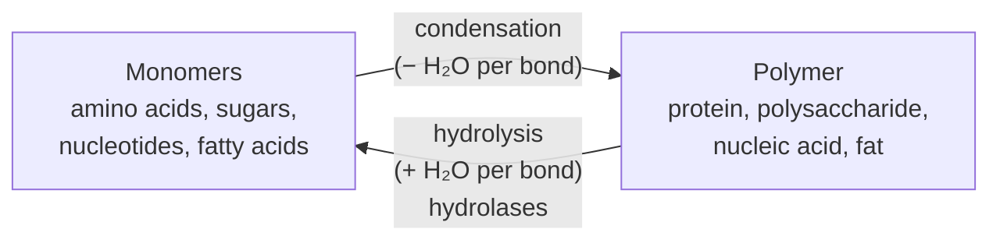

---
aliases:
  - Hydrolytic Cleavage
  - Condensation Reaction
  - Dehydration Synthesis
  - Hydrolyse
tags:
  - type/concept
  - domain/chemistry
  - domain/biology
  - level/L1
  - level/L2
  - level/L3
mastery: 0
prerequisites:
  - "[[Water]]"
  - "[[Nucleophile]]"
  - "[[Electrophile]]"
  - "[[Reaction Mechanism]]"
  - "[[Functional Group]]"
related:
  - "[[Peptide Bond]]"
  - "[[Carbohydrate]]"
  - "[[Lipid]]"
  - "[[Nucleotide]]"
  - "[[ATP]]"
  - "[[Phosphate Ester]]"
  - "[[Nucleophilic Acyl Substitution]]"
projects: []
sources:
  - "[[Organic Chemistry (OpenStax)]]"
  - "[[Lehninger Principles of Biochemistry (Nelson)]]"
  - "[[Biochemistry (Berg)]]"
  - "[[Molecular Biology of the Cell (Alberts)]]"
  - "[[ExplorEnz]]"
  - "[[Steen 2004 - The ABC's and XYZ's of Peptide Sequencing]]"
  - "[[NIST Atomic Weights and Isotopic Compositions]]"
---

# Hydrolysis

> [!abstract]
> Hydrolysis is cutting a bond with water: one piece takes the –OH, the other the –H. Run backwards on paper, it is condensation, the loss of water that links monomers into every biopolymer.

## Definition

**Hydrolysis** is a reaction in which water cleaves a covalent bond, adding –OH to one fragment and –H to the other: $\mathrm{A{-}B + H_2O \to A{-}OH + H{-}B}$. **Condensation** is the reverse bookkeeping: two molecules join and release a water molecule.[^lehninger] Proteins, polysaccharides, nucleic acids and fats are, formally, condensation polymers of their monomers, and hydrolysis degrades them back to those monomers.[^lehninger][^berg]

## Why it matters

- **Mass bookkeeping.** Every bond made by condensation removes 18.011 u (one H₂O, monoisotopic) from the sum of the monomers; every bond hydrolyzed adds it back. Peptide and glycan mass calculations rest on this ([[Mass Spectrometry]], [[Carbohydrate]]).[^nist]
- **Proteomics starts with a hydrolysis.** Bottom-up proteomics digests proteins into peptides before mass spectrometry; predicting those peptides from sequences means applying the protease's rule to each protein, an *in silico* hydrolysis (Advanced).[^steen][^berg]
- **Enzyme annotation.** Hydrolases form one of the seven top-level EC classes (EC 3), which gathers proteases, nucleases, glycosidases, lipases and phosphatases ([[Enzyme]]).[^explorenz]
- **Spontaneous DNA damage.** Water slowly hydrolyzes bonds in DNA itself, a constant source of lesions that repair systems must remove ([[DNA Repair]]).[^alberts]

## Core (L1)



**The five bonds.**[^lehninger][^berg]

| Bond | Joins | Found in | Hydrolysis products | Enzymes |
|---|---|---|---|---|
| Carboxylic ester | acid + alcohol | triacylglycerols, phospholipids ([[Lipid]]) | fatty acid + glycerol | lipases, esterases |
| Amide (peptide) | carboxyl + amino | proteins ([[Peptide Bond]]) | amino acids, peptides | proteases |
| Glycosidic | anomeric C + OH | polysaccharides ([[Carbohydrate]]) | monosaccharides | glycosidases (amylases) |
| Phosphodiester | phosphate + two OH | DNA and RNA backbones ([[Nucleotide]]) | nucleotides | nucleases |
| Phosphoanhydride | phosphate + phosphate | ATP, GTP ([[ATP]]) | ADP + Pi | ATPases |

**How water attacks.** In each case the oxygen of water (or of hydroxide, or of an activated group) is the [[Nucleophile]] and the atom that loses the bond is the [[Electrophile]]: the carbonyl carbon of an ester or amide, the phosphorus of a phosphate, the anomeric carbon of a glycoside. For esters, hydroxide adds to the carbonyl, the tetrahedral intermediate expels the alkoxide, and the acid formed is deprotonated (saponification, see [[Reaction Mechanism#Worked example]]); acid also catalyzes ester hydrolysis.[^os216] Amides resist: their hydrolysis needs heating in aqueous acid or base.[^os217]

**Favorable but slow.** In water, the equilibrium of these reactions lies on the side of hydrolysis, yet without a catalyst they can be extremely slow: the lifetime of a peptide bond in water approaches 1000 years.[^berg] Biopolymers are kinetically stable, and hydrolases decide when and where they are cut.

## Deeper (L2)

**Cells do not run hydrolysis backwards.** Because direct condensation in water is uphill, cells make biopolymers from **activated** monomers, and the overall reaction releases a phosphate-containing leaving group instead of water:[^berg][^lehninger]

| Polymer | Activated monomer | Released |
|---|---|---|
| Protein | aminoacyl-tRNA | tRNA (the aminoacyl ester was made using ATP) |
| DNA, RNA | (deoxy)nucleoside triphosphate | pyrophosphate (PPi) |
| Glycogen | UDP-glucose | UDP |

The *net* change in the polymer is still "monomer minus water", which is why the mass bookkeeping holds, but the mechanism is a transfer, not a dehydration.

**Covalent catalysis.** Many hydrolases cut in two steps. A serine protease first transfers the acyl part of the substrate to Ser 195, releasing the amine half (acyl-enzyme, an ester); water then hydrolyzes that ester, freeing the acid half and regenerating the enzyme.[^berg] An amide hydrolysis is thus split into two easier reactions ([[Nucleophile]]).

**Why RNA is less stable than DNA.** In RNA, the 2'-OH next to each phosphodiester can act as an internal nucleophile on the phosphorus, especially in alkali, cleaving the chain through a 2',3'-cyclic phosphate. DNA lacks the 2'-OH and resists alkaline hydrolysis, one reason it suits long-term storage of information.[^berg][^lehninger]

**Energetics.** Hydrolysis of ATP to ADP + Pi has $\Delta G^{\circ\prime} = -30.5$ kJ/mol; the details and the reasons are in [[ATP]].[^berg] Water's concentration (55.5 M) is essentially constant in dilute solution, so it is folded into the equilibrium constant rather than written in the mass-action ratio.[^lehninger]

## Advanced (L3)

**Spontaneous hydrolysis of DNA.** Even inside the cell, water attacks DNA. The N-glycosidic bonds between purines and deoxyribose hydrolyze (**depurination**), and cytosine loses its amino group by hydrolytic **deamination**, becoming uracil. Alberts estimates about 5000 purines lost and about 100 cytosine deaminations per human cell per day, all of which must be repaired ([[DNA Repair]], [[Nucleotide]]).[^alberts]

**In silico digestion.** Trypsin hydrolyzes peptide bonds on the carboxyl side of Lys and Arg.[^berg] Bottom-up proteomics digests proteins into such peptides because peptides are easier to handle, sequence and detect than whole proteins.[^steen] Identifying them involves comparing measured masses with masses predicted from protein sequences: the prediction is a simulated hydrolysis, and its mass bookkeeping is the subject of the code below ([[Bottom-Up Proteomics]], [[Monoisotopic Mass]]).

## Mathematical representation

For a linear polymer $P$ of $n$ monomers $M_1, \dots, M_n$ joined by $n - 1$ condensations, with $f(\cdot)$ the elemental formula (a vector of atom counts) and $m(\cdot)$ the mass,

$$f(P) = \sum_{i=1}^{n} f(M_i) - (n-1)\, f(\mathrm{H_2O}), \qquad m(P) = \sum_{i=1}^{n} m(M_i) - (n-1)\, m(\mathrm{H_2O}).$$

Hydrolyzing $k$ bonds of $P$ gives $k + 1$ fragments $F_j$ with $\sum_j m(F_j) = m(P) + k\, m(\mathrm{H_2O})$: mass is conserved once the water is counted. Thermodynamically, for $\mathrm{A{-}B + H_2O \rightleftharpoons A{-}OH + H{-}B}$, $\Delta G = \Delta G^{\circ\prime} + RT \ln \dfrac{[\mathrm{A{-}OH}][\mathrm{H{-}B}]}{[\mathrm{A{-}B}]}$, with water absorbed into $\Delta G^{\circ\prime}$ ([[Gibbs Free Energy]]).

## Computational representation

Formulas as `Counter` objects, condensation as subtraction of water, and a toy trypsin rule (cut after every K or R) applied to an invented sequence:

```python
import re
from collections import Counter

MONO = {"C": 12.0, "H": 1.00782503223, "N": 14.00307400443, "O": 15.99491461957}  # NIST, u
FREE_AA = {"G": "C2H5NO2", "A": "C3H7NO2", "S": "C3H7NO3", "V": "C5H11NO2", "L": "C6H13NO2",
           "E": "C5H9NO4", "F": "C9H11NO2", "K": "C6H14N2O2", "R": "C6H14N4O2"}
WATER = Counter({"H": 2, "O": 1})


def formula(text: str) -> Counter:
    return Counter({el: int(n or 1) for el, n in re.findall(r"([A-Z][a-z]?)(\d*)", text)})


def condense(units: list[Counter]) -> Counter:
    """n units joined by n - 1 condensations: each bond releases one H2O."""
    total = sum(units, Counter())
    for _ in range(len(units) - 1):
        total.subtract(WATER)
    return total


def mass(f: Counter) -> float:
    return sum(MONO[el] * n for el, n in f.items())


def peptide(seq: str) -> Counter:
    return condense([formula(FREE_AA[aa]) for aa in seq])


def trypsin(seq: str) -> list[str]:
    """Toy rule: hydrolyze the peptide bond after every K or R."""
    return [p for p in re.split(r"(?<=[KR])", seq) if p]


protein = "GASKVLREFGK"                     # invented sequence
pieces = trypsin(protein)
for p in pieces:
    print(f"{p:6} {mass(peptide(p)):10.4f}")
intact = mass(peptide(protein))
print(f"intact {intact:10.4f}")
gain = sum(mass(peptide(p)) for p in pieces) - intact
print(f"sum of pieces - intact = {gain:.4f} = {len(pieces) - 1} x H2O ({mass(WATER):.4f})")
```

```text
GASK     361.1961
VLR      386.2642
EFGK     479.2380
intact  1190.6772
sum of pieces - intact = 36.0211 = 2 x H2O (18.0106)
```

The free amino acid formulas come from the amino acid structures ([[Amino Acid]]); the monoisotopic masses of ¹H, ¹²C, ¹⁴N and ¹⁶O are from NIST ([[Isotope]]).[^nist] The toy rule ignores any exception to the cleavage pattern.

## Worked example

> [!example] Making DNA without "removing water"
> DNA polymerase adds one nucleotide per step:
> 1. **Polymerization.** $(\mathrm{DNA})_n + \mathrm{dNTP} \to (\mathrm{DNA})_{n+1} + \mathrm{PP_i}$. The 3'-OH of the chain attacks the innermost (α) phosphorus of the incoming dNTP; pyrophosphate leaves.[^berg]
> 2. **Pull.** $\mathrm{PP_i + H_2O \to 2\,P_i}$, catalyzed by pyrophosphatase, is strongly favorable and removes a product, driving step 1 forward.[^berg]
> 3. **Net.** $(\mathrm{DNA})_n + \mathrm{dNTP} + \mathrm{H_2O} \to (\mathrm{DNA})_{n+1} + 2\,\mathrm{P_i}$. Counting only the nucleotide units, the chain grows by "dNMP minus H₂O", the condensation bookkeeping, while the energy comes from breaking two phosphoanhydride bonds.
> 4. **Reverse.** A nuclease hydrolyzes a phosphodiester bond with one water, the simple reverse of the bookkeeping, and releases energy rather than consuming it.

## Common misconceptions

> [!warning] "Cells build polymers by condensation, so they release water at each step"
> The bookkeeping is condensation, but the chemistry is transfer from an activated monomer: the leaving group is pyrophosphate, UDP or tRNA, not water.[^berg][^lehninger]

> [!warning] "Favorable means fast"
> Peptide bond hydrolysis is thermodynamically favorable yet takes centuries without a catalyst.[^berg] Thermodynamics says where the equilibrium lies; enzymes decide when it is reached.

## Exercises

> [!question] Exercise 1 (L1)
> Give the hydrolysis products of: ethyl acetate (an ester), the dipeptide Gly-Ala, maltose (Glc α1→4 Glc), ATP.

> [!success]- Solution
> Acetic acid + ethanol; glycine + alanine; two glucose; ADP + Pi. Each consumes one water.[^lehninger][^os216]

> [!question] Exercise 2 (L1)
> How many water molecules are formally released when 10 glucose units form a linear chain, and when a 300-residue protein is made? How many are consumed when that protein is completely hydrolyzed?

> [!success]- Solution
> 9 and 299: one per bond, $n - 1$ for $n$ units. Complete hydrolysis consumes the same 299 waters.

> [!question] Exercise 3 (L2)
> Why does DNA polymerase use dNTPs rather than condensing dNMPs directly onto the chain?

> [!success]- Solution
> Direct condensation in water is uphill: the equilibrium favors hydrolysis. A triphosphate carries an activated phosphorus with pyrophosphate as leaving group, and hydrolysis of the released PPi pulls the reaction forward (Worked example).[^berg]

> [!question] Exercise 4 (L3, Python)
> Apply `trypsin` to the invented sequence `AGKLLSRVEK`, print the peptides and their monoisotopic masses, and verify mass conservation. What is the formula of the peptide GASK?

> [!success]- Solution
> ```python
> toy = "AGKLLSRVEK"
> pieces = trypsin(toy)
> print(pieces, [round(mass(peptide(p)), 4) for p in pieces])
> print(round(sum(mass(peptide(p)) for p in pieces) - mass(peptide(toy)), 4), len(pieces) - 1)
> print(dict(peptide("GASK")))
> ```
> Output: `['AGK', 'LLSR', 'VEK'] [274.1641, 487.3118, 374.2165]`, then `36.0211 2` (two bonds hydrolyzed, two waters added), then `{'C': 14, 'H': 27, 'N': 5, 'O': 6}`: four free amino acids (C₁₄H₃₃N₅O₉ in total) minus three H₂O.

> [!question] Exercise 5 (L3)
> With about 5000 depurinations per human cell per day,[^alberts] how many bases would be lost from one cell's DNA over 70 years without repair? What does this say about repair?

> [!success]- Solution
> $5000 \times 365 \times 70 \approx 1.3 \times 10^8$ missing bases in a single cell. Spontaneous hydrolysis alone would riddle the genome with gaps in its sequence; continuous repair is not optional ([[DNA Repair]]).

## Mastery checklist

- [ ] 1 Recognized: I can name the bond cut in proteins, polysaccharides, nucleic acids, fats and ATP, and say what water adds.
- [ ] 2 Understood: I can explain which atom water attacks in each case, why hydrolysis is favorable but slow, and why cells polymerize activated monomers.
- [ ] 3 Practiced: I can compute polymer formulas and masses by condensation bookkeeping and simulate a protease digest in code.
- [ ] 4 Applied: I predicted tryptic peptides of a real protein from UniProt and compared their masses with a proteomics result.
- [ ] 5 Explained: I can explain RNA versus DNA stability, spontaneous DNA hydrolysis, and covalent catalysis by hydrolases.

## References

[^lehninger]: [[Lehninger Principles of Biochemistry (Nelson)]], 8th ed. (2021).
[^berg]: [[Biochemistry (Berg)]], 5th ed. (2002).
[^os216]: [[Organic Chemistry (OpenStax)]], sec. 21.6 "Chemistry of Esters".
[^os217]: [[Organic Chemistry (OpenStax)]], sec. 21.7 "Chemistry of Amides".
[^alberts]: [[Molecular Biology of the Cell (Alberts)]], 4th ed. (2002), DNA repair: spontaneous depurination and deamination.
[^explorenz]: [[ExplorEnz]], the IUBMB enzyme list (EC classes).
[^steen]: [[Steen 2004 - The ABC's and XYZ's of Peptide Sequencing]], *Nature Reviews Molecular Cell Biology*.
[^nist]: [[NIST Atomic Weights and Isotopic Compositions]], isotopic masses of ¹H, ¹²C, ¹⁴N, ¹⁶O.
