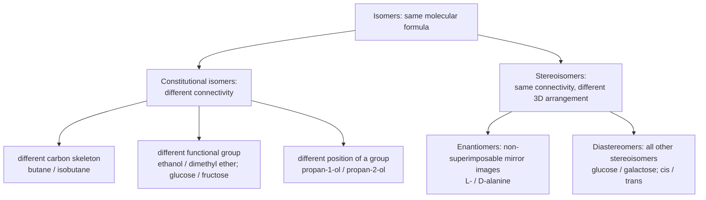

---
aliases:
  - Isomers
  - Isomerism
  - Constitutional Isomer
  - Structural Isomer
  - Isomère
tags:
  - type/concept
  - domain/chemistry
  - domain/biology
  - domain/computer-science
  - level/L1
  - level/L2
  - level/L3
mastery: 0
prerequisites:
  - "[[Skeletal Formula]]"
  - "[[Functional Group]]"
related:
  - "[[Stereochemistry]]"
  - "[[Chirality]]"
  - "[[Cis-Trans Isomerism]]"
  - "[[Diastereomer]]"
  - "[[Tautomer]]"
  - "[[Carbohydrate]]"
  - "[[Tree (Graph Theory)]]"
projects: []
sources:
  - "[[Organic Chemistry (OpenStax)]]"
  - "[[Biochemistry (Berg)]]"
  - "[[ExplorEnz]]"
---

# Isomer

> [!abstract]
> Isomers are different molecules made of exactly the same atoms: same molecular formula, different structure. Either the atoms are connected differently (constitutional isomers) or they are connected the same way but arranged differently in space (stereoisomers).

## Definition

**Isomers** are compounds that have the same molecular formula but different structures.[^os32] **Constitutional isomers** differ in how their atoms are connected; **stereoisomers** have the same connections but a different three-dimensional orientation of their atoms.[^os32][^os5]

## Why it matters

- **A formula is not an identity.** Glucose and fructose are both C₆H₁₂O₆; leucine and isoleucine are both C₆H₁₃NO₂.[^berg] A database keyed on formula or mass merges different compounds; compound identity needs the structure ([[Skeletal Formula]]).
- **Mass spectrometry is blind to isomerism.** Isomers have identical masses, so a peptide containing Leu cannot be told from the same peptide with Ile by mass alone, and isomeric metabolites need extra evidence ([[Mass Spectrometry]]).
- **Cells interconvert isomers on purpose.** Glycolysis turns glucose 6-phosphate into fructose 6-phosphate, an aldose into a ketose, with phosphoglucose isomerase.[^berg] Isomerases are one of the seven top-level enzyme classes, EC 5.[^explorenz]

## Core (L1)



**Constitutional isomers** come in three kinds: different carbon skeletons, different functional groups, or the same functional group at a different position.[^os32] They are different compounds with different properties: ethanol is an alcohol (a hydrogen-bond donor), dimethyl ether an ether (acceptor only) ([[Functional Group]]).

**Stereoisomers** need the 3D picture: [[Chirality|enantiomers]] are mirror images that cannot be superimposed, and every other pair of stereoisomers is a pair of [[Diastereomer|diastereomers]], which includes [[Cis-Trans Isomerism|cis-trans isomers]].[^os5] [[Stereochemistry]] covers this branch.

**Not isomers.** Conformations, such as the anti and gauche forms of butane, are shapes of the same molecule that interconvert by rotation about single bonds, without breaking any bond ([[Conformational Analysis]]); converting one stereoisomer into another requires breaking bonds.[^os3]

**Bio: one formula, several sugars.** Glucose is an aldohexose and fructose a ketohexose: functional-group isomers of C₆H₁₂O₆. Glucose and galactose have the same connectivity and differ only in the configuration at C4: they are stereoisomers, more precisely diastereomers ([[Carbohydrate]]).[^berg]

## Deeper (L2)

**Counting constitutional isomers.** The number of isomers grows explosively with size: C₄H₁₀ has 2, C₁₀H₂₂ has 75 and C₂₀H₄₂ has 366,319.[^os32] For alkanes, the count is a pure graph problem: rings + π bonds $= (2n + 2 - (2n + 2))/2 = 0$ ([[Skeletal Formula#Mathematical representation]]), so every C$_n$H$_{2n+2}$ is a tree of $n$ carbons in which no vertex has more than 4 neighbours, and isomers are the non-isomorphic such trees ([[Tree (Graph Theory)]]).

**Counting stereoisomers.** A molecule with $k$ stereocenters has at most $2^k$ stereoisomers; symmetry (meso compounds) can lower the count ([[Diastereomer]]). An open-chain aldohexose has 4 stereocenters, hence 16 stereoisomers, of which D-glucose is one ([[Carbohydrate]]).

## Advanced (L3)

- **Isomers and identifiers.** Because a formula does not determine a structure, compound databases identify a molecule by a canonical form of its graph (canonical SMILES, InChI), with or without its stereo layer. Whether two records are "the same compound" depends on which level is compared: formula, constitution, or full configuration ([[Molecular Representation]]).
- **Structure elucidation is isomer search.** An accurate mass gives a formula; the candidate structures are all its isomers, and spectra or databases must narrow them down. The combinatorial explosion above is why this step is hard for metabolomics ([[Metabolomics]]).

## Mathematical representation

Write a molecule as a labelled graph $G$ ([[Skeletal Formula#Mathematical representation]]) and let $F(G)$ be its formula, the multiset of element labels (hydrogens included). Three equivalence relations, each finer than the previous: (1) **same formula**, $F(G_1) = F(G_2)$; (2) **same constitution**, $G_1 \cong G_2$, a bijection of atoms preserving elements and bonds (labelled graph isomorphism); (3) **same configuration**, same constitution and same 3D arrangement up to rotation and conformational change ([[Stereochemistry#Mathematical representation]]). Constitutional isomers satisfy (1) but not (2); stereoisomers satisfy (2) but not (3).

**Alkane count.** Let $a_n$ be the number of unlabelled trees on $n$ vertices with maximum degree 4. Then $a_n$ is the number of constitutional isomers of C$_n$H$_{2n+2}$: $a_1, \dots, a_{12} = 1, 1, 1, 2, 3, 5, 9, 18, 35, 75, 159, 355$ (computed below; $a_{10} = 75$ matches the textbook table[^os32]).

## Computational representation

Enumeration by **growth and canonical deduplication**: every carbon tree of $n$ atoms is obtained by adding one leaf to a tree of $n - 1$ atoms (remove any leaf to go back), so adding a leaf everywhere generates them all; many additions give the same isomer, so each new tree is reduced to a **canonical string** (encoded from its center, children sorted) and kept once. Without that step the count would be the number of construction paths, not of isomers. `alkane_skeletons(14)` gives 802 and 1858 for C₁₃ and C₁₄ in well under a second.

```python
def encode(adj, v, parent=-1) -> str:
    """Canonical string of the subtree rooted at v (children sorted, AHU encoding)."""
    return "(" + "".join(sorted(encode(adj, u, v) for u in adj[v] if u != parent)) + ")"

def canonical(adj) -> str:
    """Canonical form of an unrooted tree: its encoding from the center (best of two centers)."""
    deg, alive = [len(a) for a in adj], len(adj)
    layer = [v for v in range(len(adj)) if deg[v] <= 1]
    while alive > 2:                           # peel leaves until 1 or 2 centers remain
        alive -= len(layer)
        nxt = []
        for v in layer:
            for u in adj[v]:
                deg[u] -= 1
                if deg[u] == 1:
                    nxt.append(u)
        layer = nxt
    return min(encode(adj, c) for c in layer)

def alkane_skeletons(n_max: int) -> list[dict]:
    """levels[n - 1]: canonical form -> adjacency list, for every carbon tree of n atoms."""
    levels = [{"()": [[]]}]
    for n in range(2, n_max + 1):
        nxt = {}
        for adj in levels[-1].values():
            for v in range(n - 1):
                if len(adj[v]) < 4:            # tetravalent carbon: at most 4 C neighbours
                    new = [list(a) for a in adj] + [[v]]
                    new[v].append(n - 1)
                    nxt.setdefault(canonical(new), new)   # keep one tree per isomer
        levels.append(nxt)
    return levels

def height(adj, v, parent=-1) -> int:
    return 1 + max((height(adj, u, v) for u in adj[v] if u != parent), default=0)

def smiles(adj, v=None, parent=-1) -> str:
    """SMILES from one end of a longest chain, longest branch written last."""
    if v is None:
        v = max(range(len(adj)), key=lambda x: height(adj, x))
    kids = sorted((u for u in adj[v] if u != parent), key=lambda u: height(adj, u, v))
    parts = [smiles(adj, u, v) for u in kids]
    return "C" + "".join(f"({p})" for p in parts[:-1]) + (parts[-1] if parts else "")

levels = alkane_skeletons(12)
print([len(level) for level in levels])
print(sorted(smiles(adj) for adj in levels[4].values()))
print(sorted(smiles(adj) for adj in levels[5].values()))
```

```text
[1, 1, 1, 2, 3, 5, 9, 18, 35, 75, 159, 355]
['CC(C)(C)C', 'CC(C)CC', 'CCCCC']
['CC(C)(C)CC', 'CC(C)C(C)C', 'CC(C)CCC', 'CCC(C)CC', 'CCCCCC']
```

The three pentanes are pentane, 2-methylbutane and 2,2-dimethylpropane; the five hexanes follow. The canonical string plays the role of canonical SMILES: two trees are the same isomer exactly when their strings are equal.

## Worked example

> [!example] All isomers of C₂H₆O, and a sugar pair
> 1. **Unsaturation.** $(2 \cdot 2 + 2 - 6)/2 = 0$: no ring, no double bond, so the three heavy atoms (C, C, O) form a tree, which on 3 vertices is a path.
> 2. **Place the oxygen.** At an end of the path: C–C–O, ethanol (CH₃CH₂OH). In the middle: C–O–C, dimethyl ether (CH₃OCH₃). These are all the possibilities: exactly two constitutional isomers, of the functional-group kind, and neither has a carbon with four different groups, hence no stereoisomers ([[Chirality]]).
> 3. **Glucose and fructose.** Same formula; glucose has C=O at C1 (aldehyde), fructose at C2 (ketone): different connectivity, constitutional isomers. Phosphoglucose isomerase converts one phosphorylated form into the other in glycolysis.[^berg]

## Common misconceptions

> [!warning] "Same formula, same molecule"
> C₂H₆O is both ethanol and dimethyl ether; C₆H₁₂O₆ covers glucose, fructose, galactose and many more. Molecular formula and mass are necessary, not sufficient, for identity.

> [!warning] "Stereoisomers are always mirror images"
> Only enantiomers are. Glucose and galactose are stereoisomers but not mirror images: they are diastereomers ([[Diastereomer]]).

## Exercises

> [!question] Exercise 1 (L1)
> Classify each pair as constitutional isomers, enantiomers, diastereomers or not isomers: (a) butane and isobutane; (b) propan-1-ol and propan-2-ol; (c) glucose and fructose; (d) glucose and galactose; (e) L- and D-alanine; (f) anti and gauche butane.

> [!success]- Solution
> (a) Constitutional (skeleton). (b) Constitutional (position of the OH). (c) Constitutional (aldehyde versus ketone). (d) Diastereomers (C4 epimers). (e) Enantiomers. (f) Not isomers: two conformations of one molecule.

> [!question] Exercise 2 (L2)
> List all constitutional isomers of C₄H₁₀O. Which of them has stereoisomers?

> [!success]- Solution
> Unsaturation 0, so trees of 4 C and 1 O. **Alcohols** (O at a leaf bonded to C): butan-1-ol, butan-2-ol, 2-methylpropan-1-ol, 2-methylpropan-2-ol. **Ethers** (O between two carbons): diethyl ether, methyl propyl ether, methyl isopropyl ether. Seven constitutional isomers. Only butan-2-ol has a carbon with four different groups (H, OH, CH₃, C₂H₅): it exists as two enantiomers, so there are 8 stereoisomers in total.

> [!question] Exercise 3 (L3, Python)
> A carbon of an alkane is a stereocenter when its four substituents (carbon branches plus implicit H) are pairwise different. Using `encode`, count for C₇ to C₁₀ how many constitutional isomers are chiral, and name the C₇ ones.

> [!success]- Solution
> ```python
> def stereocenters(adj) -> list[int]:
>     """Carbons whose four substituents (C branches plus implicit H) are pairwise different."""
>     return [v for v in range(len(adj))
>             if len({encode(adj, u, v) for u in adj[v]} | ({"H"} if len(adj[v]) == 3 else set())) == 4]
>
> levels = alkane_skeletons(10)
> for n in range(7, 11):
>     chiral = [smiles(a) for a in levels[n - 1].values() if stereocenters(a)]
>     print(n, len(levels[n - 1]), len(chiral), sorted(chiral) if n == 7 else "")
> ```
> Output: `7 9 2 ['CC(C)C(C)CC', 'CCC(C)CCC']`, `8 18 5`, `9 35 15`, `10 75 40`. The C₇ ones are 2,3-dimethylpentane and 3-methylhexane. Comparing rooted encodings is exactly the test "are two substituents identical?". From C₁₀ on, a quaternary carbon can also be a stereocenter (methyl, ethyl, propyl and isopropyl on one carbon), which the degree-4 case catches. A count of "isomers" must therefore say whether enantiomers are counted separately.

> [!question] Exercise 4 (L3)
> A proteomics search engine reports the peptide `LSGK` and notes that `ISGK` fits the spectrum equally well. Explain why, and name two independent kinds of data that could decide.

> [!success]- Solution
> Leu and Ile are constitutional isomers (C₆H₁₃NO₂), so every precursor and fragment containing the residue has the same mass: mass alone cannot decide. Data that depend on connectivity can: fragmentation that breaks the side chain itself, or chromatographic behavior compared with synthetic standards. Data outside chemistry can too: the gene or transcript encoding the protein, since Leu and Ile codons differ ([[Genetic Code]]).

## Mastery checklist

- [ ] 1 Recognized: I can define isomers and tell constitutional isomers from stereoisomers.
- [ ] 2 Understood: I can classify any pair (skeleton, position, functional group, enantiomer, diastereomer, conformation) and explain the glucose-fructose-galactose relations.
- [ ] 3 Practiced: I can enumerate small isomer sets by hand and with the canonical-tree generator.
- [ ] 4 Applied: I checked whether compound or peptide identifications in a real dataset are ambiguous between isomers.
- [ ] 5 Explained: I can explain why formula and mass do not determine identity, how canonical forms solve deduplication and why counts depend on the level of identity chosen.

## References

[^os32]: [[Organic Chemistry (OpenStax)]], ch. 3 "Organic Compounds: Alkanes and Their Stereochemistry", section 3.2 "Alkanes and Alkane Isomers" (definition, kinds of constitutional isomers, table of the number of alkane isomers).
[^os3]: [[Organic Chemistry (OpenStax)]], ch. 3 "Organic Compounds: Alkanes and Their Stereochemistry" (conformations).
[^os5]: [[Organic Chemistry (OpenStax)]], ch. 5 "Stereochemistry at Tetrahedral Centers".
[^berg]: [[Biochemistry (Berg)]], 5th ed. (2002), treatment of amino acids (Leu and Ile side chains), carbohydrates (aldoses and ketoses, glucose and galactose) and glycolysis (phosphoglucose isomerase).
[^explorenz]: [[ExplorEnz]], the IUBMB enzyme list (class EC 5, isomerases).
