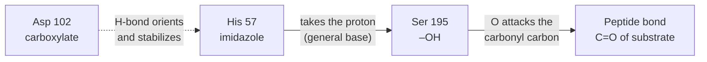

---
aliases:
  - Nucleophilicity
  - Nucleophilic Center
  - Nucléophile
tags:
  - type/concept
  - domain/chemistry
  - domain/biology
  - level/L1
  - level/L2
mastery: 0
prerequisites:
  - "[[Reaction Mechanism]]"
  - "[[Electronegativity]]"
  - "[[Lewis Structure]]"
  - "[[Acid-Base Reaction]]"
related:
  - "[[Electrophile]]"
  - "[[Hydrolysis]]"
  - "[[Nucleophilic Substitution]]"
  - "[[Nucleophilic Addition]]"
  - "[[Nucleophilic Acyl Substitution]]"
  - "[[Enzyme Catalysis]]"
  - "[[Amino Acid]]"
  - "[[Water]]"
projects: []
sources:
  - "[[Organic Chemistry (OpenStax)]]"
  - "[[Biochemistry (Berg)]]"
---

# Nucleophile

> [!abstract]
> A nucleophile is the electron-rich partner of a polar reaction: it brings a pair of electrons and uses it to make a new bond to an electron-poor atom.

## Definition

A **nucleophile** ("nucleus-loving") is a species with an electron-rich atom that forms a bond by donating an electron pair to an electron-poor atom, the [[Electrophile]]. Nucleophiles can be neutral or negatively charged; the pair comes from a lone pair or from a π bond.[^os63] In curved-arrow notation, the nucleophile is where the arrow starts ([[Reaction Mechanism]]).[^os65] Because they donate electron pairs, nucleophiles are Lewis bases.[^os63]

**Nucleophilicity** is a kinetic property: how fast a species attacks an electrophilic atom, usually measured as relative rates of reaction with the same carbon substrate.[^os113]

## Why it matters

- **Classifying enzymes by their nucleophile.** Proteases are grouped by the group that attacks the peptide bond: serine, cysteine, aspartyl and metalloproteases (the last two use an activated water molecule).[^berg] The same logic holds for many hydrolases and transferases ([[Enzyme Catalysis]]).
- **Reactive residues are drug targets.** Reagents and drugs that bond covalently to an active-site nucleophile inactivate the enzyme: diisopropylphosphofluoridate labels the reactive serine of chymotrypsin, and penicillin acylates a serine of the bacterial transpeptidase.[^berg]
- **Water is everywhere.** Every [[Hydrolysis]] in the cell uses water, a weak nucleophile, which is why hydrolysis is slow without enzymes that activate it.[^os113][^berg]

## Core (L1)

**Spotting nucleophiles.** Look for an atom with a lone pair (N, O, S, halide ions), a negative charge, or a π bond.[^os63]

**Ranking nucleophilicity.** Three rules of thumb, in water or alcohols:[^os113]

1. **Charge.** An anion is more nucleophilic than its neutral conjugate acid: HO⁻ > H₂O, RS⁻ > RSH.
2. **Same atom, follow basicity.** For nucleophiles attacking with the same element, nucleophilicity roughly parallels basicity: hydroxide, a strong base, is far more nucleophilic than acetate, a weak base.
3. **Down a group, more nucleophilic.** Larger, more polarizable atoms react faster: HS⁻ > HO⁻, I⁻ > Br⁻ > Cl⁻.

Relative rates of SN2 reaction with the same alkyl substrate:[^os113]

| Nucleophile | H₂O | NH₃ | Cl⁻ | HO⁻ | CH₃O⁻ | I⁻ | CN⁻ | HS⁻ |
|---|---:|---:|---:|---:|---:|---:|---:|---:|
| Relative rate | 1 | 700 | 1,000 | 10,000 | 25,000 | 100,000 | 125,000 | 125,000 |

**The nucleophiles of biology.**

| Group | Typical pKa in proteins | Nucleophilic form | Role |
|---|---:|---|---|
| Ser –OH | (an alcohol, far above 7) | O after its proton is taken | serine proteases, esterases; needs a base to activate it[^berg] |
| Cys –SH | 8.3 | thiolate S⁻ | cysteine proteases; strong, polarizable[^berg] |
| His imidazole | 6.0 | neutral ring N | general base and acid, proton shuttle[^berg] |
| Lys –NH₃⁺ | 10.8 | neutral –NH₂ | attacks carbonyls to form Schiff bases ([[Nucleophilic Addition]])[^berg] |
| Water | (not ionized at pH 7) | H₂O, or HO⁻ when activated | every hydrolysis[^berg] |

## Deeper (L2)

**Nucleophilicity is not basicity.** Basicity is an equilibrium, the affinity for a proton; nucleophilicity is a rate, usually toward carbon. They track each other only among nucleophiles with the same attacking atom. Polarizable atoms (S, I) are better nucleophiles than their basicity suggests, and in water small anions are surrounded by hydrogen-bonded solvent, which blunts their reactivity.[^os113]

**Only the right protonation state reacts.** A protonated amine (–NH₃⁺) or a neutral thiol has no available pair, or a poor one; the reactive form is the conjugate base. The fraction present depends on pKa and pH (code below). Active sites shift pKa values: the environment of a folded protein can stabilize the reactive form.[^berg]

**How enzymes make strong nucleophiles from weak ones.**



- **General base.** In the catalytic triad of chymotrypsin, His 57 accepts the proton of Ser 195 as the serine oxygen attacks; Asp 102 holds His in the right orientation.[^berg]
- **Metal ions.** In carbonic anhydrase, Zn²⁺ binds water and lowers its pKa to about 7, so a zinc-bound hydroxide is available at neutral pH; metalloproteases activate water the same way.[^berg]

## Mathematical representation

For a group with acid dissociation constant $K_a$ ($pK_a = -\log_{10} K_a$), the fraction in the deprotonated, nucleophilic form at a given pH is, from the Henderson-Hasselbalch relation ([[Acid-Base Equilibrium]]),

$$f_{\text{base}} = \frac{1}{1 + 10^{\,pK_a - \mathrm{pH}}}.$$

If only the base form reacts, with intrinsic rate constant $k$, the observed rate at nucleophile concentration $[\mathrm{Nu}]_{\text{tot}}$ is proportional to $k\, f_{\text{base}}\, [\mathrm{Nu}]_{\text{tot}}$: reactivity times availability. Two nucleophiles compete according to the product of their concentrations and rate constants.

## Computational representation

```python
# Typical side-chain pKa values in proteins (Berg); the nucleophilic form is the base form.
PKA = {"Cys thiol -> thiolate S-": 8.3, "His imidazolium -> neutral imidazole": 6.0,
       "Lys ammonium -> neutral amine": 10.8, "Tyr phenol -> phenolate": 10.9}


def base_fraction(pka: float, ph: float) -> float:
    """Fraction in the deprotonated (lone-pair-bearing) form: 1 / (1 + 10^(pKa - pH))."""
    return 1 / (1 + 10 ** (pka - ph))


for group, pka in PKA.items():
    print(f"{group:38} pKa {pka:4}  pH 7: {base_fraction(pka, 7.0):.4f}  pH 8: {base_fraction(pka, 8.0):.4f}")

# Concentration times reactivity: water versus hydroxide at pH 7, using relative SN2 rates
# toward the same alkyl halide (H2O = 1, HO- = 10,000; OpenStax table). Illustration only.
water, hydroxide = 55.5, 10 ** (7.0 - 14.0)          # mol/L
ratio = (hydroxide * 10_000) / (water * 1)
print(f"rate(HO-) / rate(H2O) at pH 7 ≈ {ratio:.1e}")
```

```text
Cys thiol -> thiolate S-               pKa  8.3  pH 7: 0.0477  pH 8: 0.3339
His imidazolium -> neutral imidazole   pKa  6.0  pH 7: 0.9091  pH 8: 0.9901
Lys ammonium -> neutral amine          pKa 10.8  pH 7: 0.0002  pH 8: 0.0016
Tyr phenol -> phenolate                pKa 10.9  pH 7: 0.0001  pH 8: 0.0013
rate(HO-) / rate(H2O) at pH 7 ≈ 1.8e-05
```

## Worked example

> [!example] Water or hydroxide: which one attacks at pH 7?
> 1. **Reactivity.** On the SN2 scale, HO⁻ reacts 10,000 times faster than H₂O.[^os113]
> 2. **Availability.** Pure water is 55.5 M; at pH 7, $[\mathrm{HO^-}] = 10^{-7}$ M.
> 3. **Product.** $(10^{-7} \times 10^4) / (55.5 \times 1) \approx 1.8 \times 10^{-5}$ (code output): on this scale, almost all attacks at pH 7 come from water molecules.
> 4. **Limit of the estimate.** The factor of $10^4$ is specific to SN2 at carbon; for another electrophile (a carbonyl, a phosphorus) the ratio of rate constants differs, so the comparison must be redone with rate constants measured for that reaction. The method, concentration × rate constant, is general.

## Common misconceptions

> [!warning] "The strongest base is always the best nucleophile"
> Only for the same attacking atom. Across a group the order can reverse: I⁻, the conjugate base of a strong acid, reacts ten times faster than HO⁻ in the table, because iodine is larger and more polarizable.[^os113]

> [!warning] "A residue's nucleophilicity is fixed by its chemistry"
> Its protonation state decides first. At pH 7, a typical Cys is about 5% thiolate and a Lys about 0.02% neutral amine (code output); an active site that shifts the pKa changes the picture.[^berg]

> [!warning] "Nucleophiles must be negatively charged"
> Neutral molecules with lone pairs (H₂O, NH₃, a neutral His ring) and π bonds are nucleophiles too; the charge only changes how fast they react.[^os63]

## Exercises

> [!question] Exercise 1 (L1)
> Which are nucleophiles: NH₃, CH₃S⁻, H₂O, CH₂=CH₂, BF₃, CH₃⁺, Cl⁻? Point to the electron pair used.

> [!success]- Solution
> NH₃ (N lone pair), CH₃S⁻ (S lone pairs), H₂O (O lone pairs), CH₂=CH₂ (π bond), Cl⁻ (lone pairs). BF₃ and CH₃⁺ have an empty orbital and no pair to give: they are electrophiles.[^os63]

> [!question] Exercise 2 (L1)
> Rank HS⁻, H₂O, HO⁻, Cl⁻ and NH₃ by nucleophilicity and justify with the three rules.

> [!success]- Solution
> HS⁻ > HO⁻ > Cl⁻ > NH₃ > H₂O (relative rates 125,000; 10,000; 1,000; 700; 1).[^os113] HO⁻ > H₂O by charge; HS⁻ ≥ HO⁻ by polarizability down the group.

> [!question] Exercise 3 (L2, Python)
> Suppose an active-site cysteine has its pKa lowered from 8.3 to 4.0 by its environment (toy value). How much more thiolate is present at pH 7?

> [!success]- Solution
> `base_fraction(4.0, 7.0)` = 0.999 against `base_fraction(8.3, 7.0)` = 0.0477, a factor of 20.9: essentially all of the residue is in the reactive thiolate form.

> [!question] Exercise 4 (L2)
> In chymotrypsin, what does His 57 do for Ser 195, and why does replacing His 57 by Ala cripple the enzyme even though His never bonds to the substrate?

> [!success]- Solution
> His 57 acts as a general base: it takes the proton of the Ser 195 hydroxyl as the oxygen attacks the carbonyl carbon, turning a weak alcohol nucleophile into an alkoxide-like one, and later gives the proton back to the leaving group.[^berg] Without His, Ser 195 remains a poor nucleophile at pH 7 and the attack step becomes very slow.

## Mastery checklist

- [ ] 1 Recognized: I can point to the electron pair a nucleophile uses.
- [ ] 2 Understood: I can apply the charge, basicity and polarizability rules and explain nucleophilicity versus basicity.
- [ ] 3 Practiced: I can compute the reactive fraction of an ionizable group and compare nucleophiles by concentration × rate.
- [ ] 4 Applied: I identified the nucleophilic residue of a real enzyme from its structure or mechanism, and checked its conservation in an alignment.
- [ ] 5 Explained: I can explain how active sites turn weak nucleophiles (Ser, water) into strong ones.

## References

[^os63]: [[Organic Chemistry (OpenStax)]], sec. 6.3 "Polar Reactions".
[^os65]: [[Organic Chemistry (OpenStax)]], sec. 6.5 "Using Curved Arrows in Polar Reaction Mechanisms".
[^os113]: [[Organic Chemistry (OpenStax)]], sec. 11.3 "Characteristics of the SN2 Reaction" (nucleophiles, relative reactivity table).
[^berg]: [[Biochemistry (Berg)]], 5th ed. (2002).
