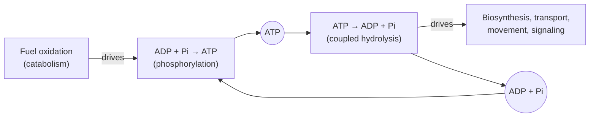

---
aliases:
  - Adenosine Triphosphate
  - Adenosine 5'-Triphosphate
  - ATP Hydrolysis
  - Energy Currency
  - Phosphoanhydride Bond
  - Adénosine triphosphate
tags:
  - type/concept
  - domain/chemistry
  - domain/biology
  - level/L1
  - level/L2
  - level/L3
mastery: 0
prerequisites:
  - "[[Nucleotide]]"
  - "[[Gibbs Free Energy]]"
  - "[[Chemical Equilibrium]]"
  - "[[Hydrolysis]]"
  - "[[Enzyme]]"
related:
  - "[[Metabolism]]"
  - "[[Mitochondrion]]"
  - "[[Oxidative Phosphorylation]]"
  - "[[Glycolysis]]"
  - "[[Phosphate Ester]]"
  - "[[Membrane Transport]]"
  - "[[Molecular Motor]]"
  - "[[Cofactor]]"
  - "[[Flux Balance Analysis]]"
projects: []
sources:
  - "[[Biology 2e (OpenStax)]]"
  - "[[Biochemistry (Berg)]]"
  - "[[Lehninger Principles of Biochemistry (Nelson)]]"
  - "[[Molecular Biology of the Cell (Alberts)]]"
  - "[[MIT 5.07SC - Biological Chemistry I]]"
  - "[[ExplorEnz]]"
  - "[[Orth 2010 - What Is Flux Balance Analysis]]"
---

# ATP

> [!abstract]
> ATP is the cell's energy currency: a nucleotide carrying a chain of three phosphates. Cutting off the last phosphate releases free energy, and enzymes spend that energy to drive reactions that would not run on their own; burning food recharges ADP back to ATP.

## Definition

**Adenosine triphosphate (ATP)** is a [[Nucleotide]] made of adenine, ribose and a chain of three phosphate groups (α, β, γ, starting from the ribose). The phosphates are linked by two **phosphoanhydride bonds**; hydrolysis of the terminal one gives ADP and inorganic phosphate (Pi) and releases a large amount of free energy, which cells use to drive energy-requiring processes by **coupling**.[^os64][^berg] In cells ATP is mostly bound to Mg²⁺, and the Mg²⁺-ATP complex is the form most enzymes use.[^berg][^lehninger]

## Why it matters

- **Energy bookkeeping in models.** In a metabolic model every compound obeys a steady-state mass balance, production equals consumption;[^orth] ATP is one of these compounds, so a model can make biomass only if its pathways regenerate the ATP they spend ([[Flux Balance Analysis]], [[Stoichiometric Matrix]]).
- **ATP use defines enzyme classes.** Kinases transfer ATP's terminal phosphoryl group (EC 2.7), ligases join molecules at the expense of ATP (EC 6), and many translocases (EC 7) pump ions with it ([[Enzyme]]).[^explorenz]
- **Pathway yields.** "Net 2 ATP per glucose" for [[Glycolysis]] or the ATP yield of [[Oxidative Phosphorylation]] are the energetic summaries of [[Metabolism]] that every pathway map implies.
- **Reagents.** Deoxynucleoside triphosphates, the DNA cousins of ATP, carry the energy for chain growth in [[Polymerase Chain Reaction|PCR]] and sequencing ([[Nucleotide#Why it matters]]).

## Core (L1)

### Structure

ATP is the triphosphate nucleotide of adenine; removing one phosphate gives ADP, two gives AMP ([[Nucleotide#Core (L1)]]). The α phosphate is attached to the ribose by a phosphoester bond ([[Phosphate Ester]]); the α-β and β-γ links are phosphoanhydride bonds.[^berg][^os64]

### Hydrolysis releases free energy

$$\mathrm{ATP + H_2O \longrightarrow ADP + P_i} \qquad \Delta G^{\circ\prime} = -30.5 \text{ kJ/mol} \; (-7.3 \text{ kcal/mol})$$

Under the standard conditions of biochemistry ($\Delta G^{\circ\prime}$: pH 7, 1 M reactants and products), hydrolysis releases 30.5 kJ/mol; in a living cell, where ATP is kept far above its equilibrium concentration, the free-energy change is almost double, about −57 kJ/mol (−14 kcal/mol).[^os64][^berg] The exact value depends on concentrations (Deeper (L2)).

Why so negative? Three structural reasons, all comparing ATP with its products:[^berg][^lehninger]

1. **Electrostatic repulsion.** At pH 7 the triphosphate carries about four negative charges close together; hydrolysis separates them.
2. **Resonance stabilization.** Free phosphate has more resonance forms than the terminal phosphate bound in ATP.
3. **Hydration.** Water binds ADP and Pi better than it binds the γ-phosphate of ATP.

The energy is therefore not "stored in the bond" (breaking any bond costs energy): it is the free-energy difference between ATP + water and the more stable ADP + Pi.

### The ATP cycle



ATP is a **currency**, not a store: each molecule is spent and regenerated continuously. A resting human consumes about 40 kg of ATP per day, a quantity possible only because the same small pool is recycled many times.[^berg] Cells make ATP by **substrate-level phosphorylation** (a phosphoryl group transferred directly from a high-energy metabolite to ADP, as in glycolysis) and by **oxidative phosphorylation**, in which ATP synthase uses a proton gradient across the inner membrane of the [[Mitochondrion]].[^os-resp][^berg]

### Coupling: how ATP drives unfavorable reactions

Free-energy changes add when reactions share an intermediate. Joining glucose and phosphate is unfavorable, but transferring the phosphate from ATP is favorable ([[Gibbs Free Energy]]):[^berg]

| Reaction | $\Delta G^{\circ\prime}$ (kJ/mol) |
|---|---:|
| glucose + Pi → glucose 6-phosphate + H₂O | +13.8 |
| ATP + H₂O → ADP + Pi | −30.5 |
| **glucose + ATP → glucose 6-phosphate + ADP** (hexokinase) | **−16.7** |

Coupling is **chemical**, not a transfer of heat: the enzyme moves the phosphoryl group from ATP to the substrate (a phosphorylated substrate), to itself (a phosphorylated enzyme, as in the sodium-potassium pump), or uses ATP binding and hydrolysis to change shape (motor proteins). Without such a shared intermediate, hydrolyzing ATP next to an unfavorable reaction would only warm the cell.[^os64][^alberts]

## Deeper (L2)

**The actual free-energy change.** For $\mathrm{ATP + H_2O \to ADP + P_i}$, $\Delta G = \Delta G^{\circ\prime} + RT \ln \frac{[\mathrm{ADP}][\mathrm{P_i}]}{[\mathrm{ATP}]}$. Cells keep $[\mathrm{ATP}]$ high relative to $[\mathrm{ADP}][\mathrm{P_i}]$, so the logarithm is strongly negative and $\Delta G$ in vivo is far more negative than $\Delta G^{\circ\prime}$.[^berg][^lehninger] Coupling one ATP hydrolysis to a reaction multiplies its equilibrium ratio of products to reactants by $e^{-\Delta G_{\mathrm{ATP}}/RT}$, about $10^8$ under cellular conditions.[^berg] Exercise 6 computes it.

**Phosphoryl-transfer potential.** Ranking phosphorylated compounds by their standard free energy of hydrolysis shows why ATP is a good intermediary: it sits in the middle.[^berg][^lehninger]

| Compound | $\Delta G^{\circ\prime}$ of hydrolysis (kJ/mol)[^berg] |
|---|---:|
| Phosphoenolpyruvate | −61.9 |
| 1,3-Bisphosphoglycerate | −49.4 |
| Creatine phosphate | −43.1 |
| **ATP (to ADP)** | **−30.5** |
| Glucose 6-phosphate | −13.8 |
| Glycerol 3-phosphate | −9.2 |

Compounds above ATP can phosphorylate ADP (substrate-level phosphorylation in [[Glycolysis]] uses phosphoenolpyruvate and 1,3-bisphosphoglycerate; creatine phosphate buffers ATP in muscle); ATP in turn phosphorylates the compounds below it.[^berg]

**Two phosphoanhydride bonds.** ATP can also be cleaved to AMP and pyrophosphate (PPi), $\Delta G^{\circ\prime} = -45.6$ kJ/mol; hydrolysis of PPi by pyrophosphatase then makes the overall reaction effectively irreversible.[^berg] Activations that must not run backward use this route: amino acid activation by aminoacyl-tRNA synthetases, fatty acid activation, and nucleic acid synthesis, where the incoming nucleoside triphosphate releases PPi ([[Nucleotide#Deeper (L2)]]).[^berg]

**Kinetic stability.** ATP hydrolysis is strongly favorable but slow without a catalyst. This lets the cell decide where its energy goes: only enzymes that bind ATP release its free energy, and only in coupled form.[^berg][^alberts]

**Other triphosphates.** GTP, UTP and CTP serve as energy donors in specific processes (GTP in protein synthesis and signaling, UTP in polysaccharide synthesis, CTP in lipid synthesis); nucleoside diphosphate kinase exchanges phosphoryl groups among them and ATP.[^berg]

## Advanced (L3)

- **Energy charge.** Atkinson's energy charge, $\mathrm{EC} = \dfrac{[\mathrm{ATP}] + \frac{1}{2}[\mathrm{ADP}]}{[\mathrm{ATP}] + [\mathrm{ADP}] + [\mathrm{AMP}]}$, ranges from 0 (all AMP) to 1 (all ATP); most cells hold it between about 0.80 and 0.95. ATP-generating pathways are inhibited by a high charge and ATP-consuming pathways stimulated by it, which buffers the charge ([[Metabolic Regulation]]).[^berg]
- **ATP as a signal.** Because ATP, ADP and AMP levels report the cell's energy state, allosteric enzymes of the major pathways sense them: ATP inhibits and AMP activates key regulated steps such as phosphofructokinase in glycolysis ([[Allosteric Regulation]], [[Metabolic Pathway]]).[^berg]
- **ATP yield is an estimate.** The ATP yield of glucose oxidation depends on how many protons ATP synthesis and transport consume and on how cytosolic NADH enters the mitochondrion; Berg gives about 30 ATP per glucose ([[Oxidative Phosphorylation]]).[^berg] In genome-scale models it appears as stoichiometric coefficients that set how much biomass a substrate can support ([[Genome-Scale Metabolic Model]]).
- **Coupling by shape change.** Motor proteins such as myosin and kinesin convert cycles of ATP binding and hydrolysis into movement, and ATP synthase can run backward as an ATP-driven proton pump: coupling through conformational change rather than a phosphorylated substrate ([[Molecular Motor]]).[^alberts]

## Mathematical representation

**Free energy of a reaction.** For a reaction with reaction quotient $Q$ (product of product concentrations over product of reactant concentrations, in mol/L, water omitted),

$$\Delta G = \Delta G^{\circ\prime} + RT\ln Q, \qquad K'_{\mathrm{eq}} = e^{-\Delta G^{\circ\prime}/RT},$$

with $R = 8.314 \times 10^{-3}$ kJ mol⁻¹ K⁻¹ and $T$ in kelvin. At 37 °C, $RT = 2.58$ kJ/mol.[^berg]

**Coupling is addition.** If reaction 1 ($\Delta G_1 > 0$) and ATP hydrolysis ($\Delta G_{\mathrm{ATP}} < 0$) are combined through a shared intermediate, the overall reaction has $\Delta G = \Delta G_1 + \Delta G_{\mathrm{ATP}}$ and runs forward if this sum is negative. Since $K' = e^{-\Delta G^{\circ\prime}/RT}$, adding free energies multiplies equilibrium constants:

$$K'_{\text{coupled}} = K'_1 \cdot K'_{\mathrm{ATP}}.$$

**Phosphoryl transfer from tabulated values.** For $\mathrm{X{-}P + Y \to X + Y{-}P}$, $\Delta G^{\circ\prime} = \Delta G^{\circ\prime}_{\text{hyd}}(\mathrm{X{-}P}) - \Delta G^{\circ\prime}_{\text{hyd}}(\mathrm{Y{-}P})$: the transfer is favorable when the donor is higher in the table than the acceptor.

## Computational representation

Tabulated $\Delta G^{\circ\prime}$ values combine by addition. The concentrations below are invented but of a realistic millimolar order; standard values (defined at 25 °C) are used at 37 °C, a common approximation.

```python
import math

R = 8.314e-3          # gas constant, kJ/(mol K)
T = 310.15            # 37 degrees C, in K

# standard free energies of hydrolysis, kJ/mol (Berg)
DG0_HYDROLYSIS = {
    "phosphoenolpyruvate": -61.9,
    "1,3-bisphosphoglycerate": -49.4,
    "creatine phosphate": -43.1,
    "ATP (to ADP)": -30.5,
    "glucose 6-phosphate": -13.8,
    "glycerol 3-phosphate": -9.2,
}


def delta_g(dg0: float, q: float, temp_k: float = T) -> float:
    """Actual free-energy change: dG = dG0' + RT ln Q."""
    return dg0 + R * temp_k * math.log(q)


def transfer_dg0(donor: str, acceptor: str) -> float:
    """dG0' for donor-P + acceptor -> donor + acceptor-P (sum of two hydrolysis half-reactions)."""
    return DG0_HYDROLYSIS[donor] - DG0_HYDROLYSIS[acceptor]


# illustrative (invented) cellular concentrations, mol/L
atp, adp, pi = 3e-3, 0.3e-3, 3e-3
q = adp * pi / atp
print(f"Q = {q:.1e}, dG = {delta_g(-30.5, q):.1f} kJ/mol")
print("glucose + ATP -> G6P + ADP:", round(transfer_dg0("ATP (to ADP)", "glucose 6-phosphate"), 1))
print("PEP + ADP -> pyruvate + ATP:", round(transfer_dg0("phosphoenolpyruvate", "ATP (to ADP)"), 1))
```

```text
Q = 3.0e-04, dG = -51.4 kJ/mol
glucose + ATP -> G6P + ADP: -16.7
PEP + ADP -> pyruvate + ATP: -31.4
```

With these toy concentrations, hydrolysis releases about 51 kJ/mol, the same order as the about 57 kJ/mol quoted for cells.[^os64]

## Worked example

> [!example] Paying for glucose phosphorylation
> Cells trap glucose by phosphorylating it. Is the direct reaction possible, and what does ATP change?
> 1. **Direct route.** glucose + Pi → glucose 6-phosphate + H₂O has $\Delta G^{\circ\prime} = +13.8$ kJ/mol (the reverse of glucose 6-phosphate hydrolysis). $K' = e^{-13.8/2.58} \approx 5 \times 10^{-3}$: at equilibrium almost no product.
> 2. **Coupled route.** Hexokinase transfers the γ-phosphoryl group of ATP: $\Delta G^{\circ\prime} = 13.8 - 30.5 = -16.7$ kJ/mol, $K' = e^{16.7/2.58} \approx 6 \times 10^{2}$.
> 3. **Factor gained.** $K'_{\text{coupled}}/K'_{\text{direct}} = e^{30.5/2.58} \approx 1.4 \times 10^5$ under standard conditions, and about $4.6 \times 10^8$ with the cellular $\Delta G$ of −51.4 kJ/mol (code above): ATP shifts the equilibrium by about eight orders of magnitude.
> 4. **Mechanism.** The two half-reactions never occur separately: glucose's 6-OH attacks the γ-phosphorus of Mg²⁺-ATP in the hexokinase active site, so no free Pi is ever formed ([[Enzyme]], EC 2.7.1.1).

## Common misconceptions

> [!warning] "Energy is stored in the high-energy phosphate bond"
> Breaking a bond always costs energy. The free energy released by hydrolysis comes from the products (ADP + Pi, separated charges, more resonance, better hydration) being more stable than ATP + water.[^berg] "High-energy bond" is shorthand for "high phosphoryl-transfer potential".

> [!warning] "ATP hydrolysis heats up the reaction it drives"
> Coupling requires a shared intermediate (phosphorylated substrate or enzyme, or a conformational change). Hydrolysis that is not coupled only dissipates heat.[^os64]

> [!warning] "ATP is an energy store"
> ATP is a short-term carrier, turned over constantly; the stores are fat, glycogen and, in muscle, creatine phosphate.[^berg]

> [!warning] "$\Delta G^{\circ\prime} = -30.5$ kJ/mol is the energy available in cells"
> That is the standard value. In vivo, $\Delta G$ depends on concentrations and is about twice as negative.[^os64]

## Exercises

> [!question] Exercise 1 (L1)
> Name the three parts of ATP, the two kinds of bond in its phosphate chain, and the products of its hydrolysis to ADP. Which bond is broken?

> [!success]- Solution
> Adenine, ribose, three phosphates. The α phosphate is linked to ribose by a phosphoester bond; α-β and β-γ are phosphoanhydride bonds. Hydrolysis to ADP + Pi breaks the β-γ phosphoanhydride bond (the terminal one).

> [!question] Exercise 2 (L1)
> Glycerol + Pi → glycerol 3-phosphate + H₂O has $\Delta G^{\circ\prime} = +9.2$ kJ/mol. Is it favorable? Write the ATP-coupled reaction and its $\Delta G^{\circ\prime}$.

> [!success]- Solution
> No, $\Delta G^{\circ\prime} > 0$. Coupled: glycerol + ATP → glycerol 3-phosphate + ADP, $\Delta G^{\circ\prime} = 9.2 - 30.5 = -21.3$ kJ/mol, favorable (glycerol kinase).

> [!question] Exercise 3 (L2)
> Using the phosphoryl-transfer table, which of phosphoenolpyruvate, creatine phosphate and glucose 6-phosphate can phosphorylate ADP under standard conditions? Give each $\Delta G^{\circ\prime}$.

> [!success]- Solution
> $\Delta G^{\circ\prime} = \Delta G^{\circ\prime}_{\text{hyd}}(\text{donor}) + 30.5$. PEP: $-61.9 + 30.5 = -31.4$ (yes). Creatine phosphate: $-43.1 + 30.5 = -12.6$ (yes: this is how it buffers ATP in muscle). Glucose 6-phosphate: $-13.8 + 30.5 = +16.7$ (no: it is below ATP in the table).

> [!question] Exercise 4 (L2, Python)
> With `delta_g` from the Computational representation, compute $\Delta G$ of ATP hydrolysis for the baseline toy concentrations (3 mM ATP, 0.3 mM ADP, 3 mM Pi), then with ADP doubled, then with ATP and ADP both 1.65 mM. What does the cell gain by keeping ATP/ADP high?

> [!success]- Solution
> ```python
> for name, conc in [("baseline", (3e-3, 0.3e-3, 3e-3)), ("ADP x2", (3e-3, 0.6e-3, 3e-3)),
>                    ("ATP/ADP = 1", (1.65e-3, 1.65e-3, 3e-3))]:
>     a, d, p = conc
>     print(f"{name:12s} {delta_g(-30.5, d * p / a):.1f}")
> ```
> ```text
> baseline     -51.4
> ADP x2       -49.6
> ATP/ADP = 1  -45.5
> ```
> Each tenfold change in the ratio shifts $\Delta G$ by $RT \ln 10 = 5.9$ kJ/mol at 37 °C. A high ATP/ADP ratio keeps the energy released per ATP high, and therefore keeps coupled reactions far from equilibrium.

> [!question] Exercise 5 (L3, Python)
> Compute the energy charge for two invented states, "rested" (ATP 3.0, ADP 0.3, AMP 0.03 mM) and "exhausted" (1.0, 1.0, 1.0 mM). Why does the regulation described in Advanced (L3) keep real cells near the first?

> [!success]- Solution
> ```python
> def energy_charge(atp: float, adp: float, amp: float) -> float:
>     return (atp + 0.5 * adp) / (atp + adp + amp)
>
> for label, c in [("rested", (3.0, 0.3, 0.03)), ("exhausted", (1.0, 1.0, 1.0))]:
>     print(label, round(energy_charge(*c), 3))
> ```
> ```text
> rested 0.946
> exhausted 0.5
> ```
> When the charge falls, ATP-generating pathways are released from inhibition and ATP-consuming ones slow down, pushing the charge back up; this negative feedback holds it in the 0.80 to 0.95 band.[^berg]

> [!question] Exercise 6 (L3, Python)
> Compute the factor by which coupling to one ATP hydrolysis multiplies an equilibrium ratio, under standard conditions and with the toy cellular $\Delta G$; then, for every compound of `DG0_HYDROLYSIS`, $\Delta G^{\circ\prime}$ for transferring its phosphoryl group to ADP.

> [!success]- Solution
> ```python
> for label, dg in [("standard", -30.5), ("cellular", delta_g(-30.5, q))]:
>     print(f"{label:9s} factor = {math.exp(-dg / (R * T)):.1e}")
> for donor in DG0_HYDROLYSIS:
>     print(f"{donor:24s} {transfer_dg0(donor, 'ATP (to ADP)'):+.1f}")
> ```
> ```text
> standard  factor = 1.4e+05
> cellular  factor = 4.6e+08
> phosphoenolpyruvate      -31.4
> 1,3-bisphosphoglycerate  -18.9
> creatine phosphate       -12.6
> ATP (to ADP)             +0.0
> glucose 6-phosphate      +16.7
> glycerol 3-phosphate     +21.3
> ```
> The cellular factor, about $10^8$, matches the textbook order of magnitude.[^berg] Only donors above ATP regenerate it: the table is a map of which phosphoryl transfers metabolism can run.

## Mastery checklist

- [ ] 1 Recognized: I can draw ATP schematically, name its bonds and write its hydrolysis with $\Delta G^{\circ\prime}$.
- [ ] 2 Understood: I can explain why hydrolysis is favorable, why ATP is a currency rather than a store, and how coupling works through a shared intermediate.
- [ ] 3 Practiced: I can add free energies of coupled reactions, compute $\Delta G$ from concentrations and the energy charge.
- [ ] 4 Applied: I traced ATP production and consumption through a real pathway map or metabolic model and checked that the ATP balance closes.
- [ ] 5 Explained: I can teach phosphoryl-transfer potential, the difference between $\Delta G^{\circ\prime}$ and $\Delta G$, the AMP + PPi route, and why ATP yields per glucose are estimates.

## References

[^os64]: [[Biology 2e (OpenStax)]], section 6.4 "ATP: Adenosine Triphosphate" (structure, phosphoanhydride bonds, $\Delta G$ of hydrolysis −7.3 kcal/mol (−30.5 kJ/mol) under standard conditions and about −14 kcal/mol (−57 kJ/mol) in a living cell, energy coupling through phosphorylation, the sodium-potassium pump).
[^os-resp]: [[Biology 2e (OpenStax)]], chapter "Cellular Respiration" (substrate-level and oxidative phosphorylation, ATP synthase).
[^berg]: [[Biochemistry (Berg)]], 5th ed. (2002), treatment of metabolism basic concepts (ATP as the free-energy currency, $\Delta G^{\circ\prime}$ of ATP hydrolysis to ADP and to AMP + PPi, structural basis of the phosphoryl-transfer potential, standard free energies of hydrolysis of phosphorylated compounds, coupling and the about $10^8$ shift of equilibrium, ATP turnover in humans, kinetic stability, Mg²⁺-ATP, other nucleoside triphosphates, energy charge) and of oxidative phosphorylation and glycolysis regulation.
[^lehninger]: [[Lehninger Principles of Biochemistry (Nelson)]], 8th ed. (2021), treatment of bioenergetics (phosphoryl group transfers and ATP, actual versus standard free-energy changes, Mg²⁺-ATP) (chapter number not verified).
[^alberts]: [[Molecular Biology of the Cell (Alberts)]], 4th ed. (2002), treatment of cell chemistry, of the cytoskeleton and of energy conversion (activated carriers and coupled reactions, motor proteins driven by ATP hydrolysis, reversibility of ATP synthase).
[^explorenz]: [[ExplorEnz]], IUBMB Enzyme List: definitions of transferases (EC 2.7 phosphotransferases), ligases (EC 6) and translocases (EC 7).
[^orth]: [[Orth 2010 - What Is Flux Balance Analysis]], *Nature Biotechnology* (steady-state mass balance $Sv = 0$).
