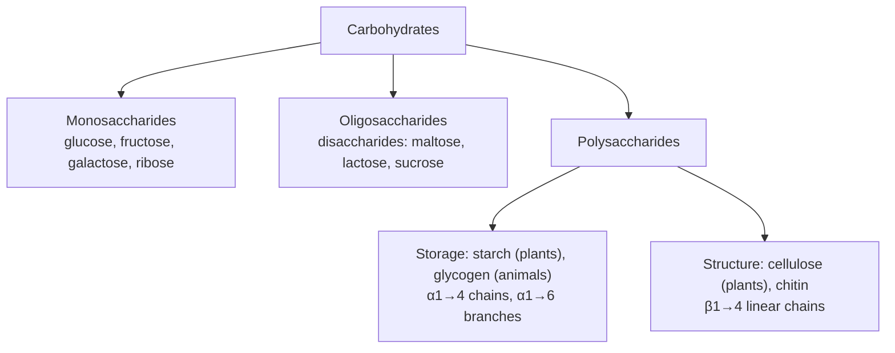

---
aliases:
  - Carbohydrates
  - Saccharide
  - Sugar
  - Glycan
  - Glucide
tags:
  - type/concept
  - domain/chemistry
  - domain/biology
  - level/L1
  - level/L2
  - level/L3
mastery: 0
prerequisites:
  - "[[Functional Group]]"
  - "[[Isomer]]"
  - "[[Chirality]]"
  - "[[Fischer Projection]]"
  - "[[Hydrolysis]]"
related:
  - "[[Nucleotide]]"
  - "[[Diastereomer]]"
  - "[[Nucleophilic Addition]]"
  - "[[Glycolysis]]"
  - "[[Metabolism]]"
  - "[[Lipid]]"
  - "[[Post-Translational Modification]]"
  - "[[Protein]]"
  - "[[Sequence Motif]]"
  - "[[Regular Expression]]"
  - "[[Tree (Data Structure)]]"
projects: []
sources:
  - "[[Lehninger Principles of Biochemistry (Nelson)]]"
  - "[[Biochemistry (Berg)]]"
  - "[[Biology 2e (OpenStax)]]"
  - "[[Organic Chemistry (OpenStax)]]"
  - "[[Molecular Biology of the Cell (Alberts)]]"
  - "[[Chemistry 2e (OpenStax)]]"
---

# Carbohydrate

> [!abstract]
> Carbohydrates are sugars and their polymers: small rings of carbon carrying many hydroxyl groups, linked into chains that store energy (starch, glycogen), build walls (cellulose), form the backbone of DNA and RNA, and decorate proteins.

## Definition

**Carbohydrates** are polyhydroxy aldehydes or ketones, or substances that yield them on hydrolysis; many have the empirical formula $(\mathrm{CH_2O})_n$.[^lehninger] They are classed by size: **monosaccharides** (single sugar units), **oligosaccharides** (a few units, e.g. disaccharides) and **polysaccharides** (long chains, linear or branched).[^lehninger][^os3]

## Why it matters

- **Nucleic acids.** Ribose (RNA) and deoxyribose (DNA, which lacks the 2'-OH) form the sugar-phosphate backbone of every sequence a bioinformatician reads ([[Nucleotide]]).[^berg]
- **Energy metabolism starts with glucose** ([[Glycolysis]], [[Metabolism]]); glycogen and starch are its storage forms.[^berg]
- **Glycosylation.** Many proteins carry sugar chains, attached at sites that can be partly read from sequence: the N-glycosylation motif Asn-X-Ser/Thr is a classic [[Sequence Motif]] ([[Post-Translational Modification]]).[^berg] Glycans change protein masses and peptides in [[Proteomics]] data.
- **Branched data.** Polysaccharides and glycans are trees, not strings: they need other representations than FASTA ([[Tree (Data Structure)]]).

## Core (L1)



**Monosaccharides.** An **aldose** has an aldehyde group at C1, a **ketose** a ketone, usually at C2. They are named by their number of carbons: trioses (glyceraldehyde, an aldose; dihydroxyacetone, a ketose), pentoses (ribose), hexoses (glucose and galactose are aldohexoses, fructose a ketohexose).[^lehninger][^berg]

**D and L.** All monosaccharides except dihydroxyacetone have stereocenters. The **D** or **L** label refers to the configuration of the stereocenter farthest from the carbonyl carbon, compared with glyceraldehyde ([[Fischer Projection]]); most sugars in organisms are D.[^lehninger]

**Ring forms.** In water, pentoses and hexoses exist mainly as rings: the carbonyl reacts with a hydroxyl of the same molecule to form a hemiacetal (aldoses) or hemiketal (ketoses) ([[Nucleophilic Addition]]). In glucose, C1 reacts with the C5 hydroxyl and gives a six-membered **pyranose** ring; fructose can close a five-membered **furanose** ring (C2 with the C5 hydroxyl), the form found in sucrose.[^berg][^lehninger] Ribose and deoxyribose are furanoses in nucleic acids.[^berg]

**Anomers.** Ring closure creates a new stereocenter at the former carbonyl carbon, the **anomeric carbon**, so each ring exists as two **anomers**, α and β. They interconvert in solution through the open chain (mutarotation): at equilibrium, D-glucose is about one-third α and two-thirds β.[^lehninger]

**Glycosidic bonds.** The anomeric carbon of one sugar condenses with a hydroxyl of another, releasing water and forming an **O-glycosidic bond**; hydrolysis reverses it ([[Hydrolysis]]). The bond is named by the anomer and the carbons joined.[^lehninger][^os3]

| Disaccharide | Composition and bond | Note |
|---|---|---|
| Maltose | Glc(α1→4)Glc | from starch digestion |
| Lactose | Gal(β1→4)Glc | milk sugar |
| Sucrose | Glc(α1↔2β)Fru | table sugar; both anomeric carbons used[^lehninger][^berg] |

**Polysaccharides.**[^berg][^lehninger][^os3]

| Polysaccharide | Monomer and bonds | Shape | Role |
|---|---|---|---|
| Amylose (starch) | glucose, α1→4, unbranched | helical chain | plant energy store |
| Amylopectin (starch) | glucose, α1→4 with α1→6 branches, about one per 30 residues | branched | plant energy store |
| Glycogen | glucose, α1→4 with α1→6 branches, about one per 10 residues | highly branched, compact | animal energy store (liver, muscle) |
| Cellulose | glucose, β1→4, unbranched | straight chains packed into fibrils by hydrogen bonds | plant cell walls |
| Chitin | N-acetylglucosamine, β1→4 | straight chains | arthropod exoskeletons, fungal walls |

The only difference between starch and cellulose is the anomer of the bond, yet mammals digest starch and cannot hydrolyze cellulose, because they lack enzymes (cellulases) for β1→4 bonds.[^berg]

## Deeper (L2)

**Reducing and non-reducing ends.** A sugar whose anomeric carbon is free (not in a glycosidic bond) can open to its aldehyde form and act as a reducing agent: it is a **reducing sugar**. Sucrose, whose two anomeric carbons are both in the bond, is not. A polysaccharide chain has one reducing end and, at the other end, a non-reducing end; a branched molecule with $n$ branches has $n + 1$ non-reducing ends.[^lehninger]

**Why branching.** Enzymes that release glucose from glycogen, and those that add it, act at non-reducing ends. Many branches mean many ends worked on at once, so glucose can be stored and mobilized quickly; branching also makes glycogen more soluble.[^lehninger][^berg]

**Shape follows linkage.** α1→4 bonds give a chain that coils into a helix (amylose), suited to compact storage. β1→4 bonds give straight, extended chains whose hydroxyls form hydrogen bonds with neighbouring chains, packing into strong fibers (cellulose).[^berg][^lehninger]

**Stereoisomers.** An open-chain aldohexose has 4 stereocenters (C2 to C5), hence $2^4 = 16$ stereoisomers, 8 D and 8 L; glucose, galactose and mannose are among the D forms. Sugars that differ at a single stereocenter are **epimers** (glucose and galactose differ at C4) ([[Diastereomer]]).[^lehninger][^mcmurry]

**Glycoproteins.** Oligosaccharides are attached to proteins in two main ways: **N-linked**, to the side-chain nitrogen of Asn within the sequence Asn-X-Ser or Asn-X-Thr (X any residue except Pro), and **O-linked**, to the hydroxyl of Ser or Thr.[^berg] N-linked glycosylation starts in the endoplasmic reticulum, and the sugar chains are then trimmed and extended in the Golgi apparatus.[^alberts]

## Advanced (L3)

**No template for glycans.** Proteins and nucleic acids are copied from templates; oligosaccharides are not. Their structure is decided by which glycosyltransferases (adding sugars) and glycosidases (trimming them) act on the chain, in the endoplasmic reticulum and Golgi, so the same protein can carry different glycans in different cells.[^berg][^alberts] A genome sequence therefore predicts where glycans *may* attach, not which glycans are there.

**Sequence motifs are candidates.** A protein sequence can contain many Asn-X-Ser/Thr sequons. The motif is the textbook requirement for N-linked attachment, but a match says nothing about whether the site is used: occupancy is an experimental question (glycoproteomics) or a statistical prediction ([[Sequence Motif]], Exercise 3).

**Combinatorial richness.** Two identical amino acids can form one dipeptide; two glucose residues can be linked in 11 different ways (Exercise 4), and branching multiplies the possibilities. This is why glycans need tree-shaped data structures and their own nomenclature, such as the condensed notation `Glc(α1-4)Glc` used above.

## Mathematical representation

- **Composition.** A glucan of $n$ glucose residues has $n - 1$ glycosidic bonds, so its molar mass is $M = n\, M_{\text{Glc}} - (n-1)\, M_{\text{H}_2\text{O}}$, with $M_{\text{Glc}}$ computed from $\mathrm{C_6H_{12}O_6}$ and standard atomic weights.[^chem2e]
- **Stereoisomers.** $k$ stereocenters give $2^k$ stereoisomers: $2^4 = 16$ open-chain aldohexoses; ring closure adds the anomeric center, $2^5 = 32$ pyranose forms.
- **Trees.** A branched polysaccharide is a rooted tree $T = (V, E)$: vertices are residues, the root is the reducing end, each edge is a glycosidic bond labelled by its linkage (e.g. α1→4, α1→6). With $|V| = n$ residues, $|E| = n - 1$. In glycogen each residue has at most two children (at O4 and at O6), and the number of leaves (non-reducing ends) equals the number of branch points plus one: in a tree whose internal vertices have one or two children, $\#\text{leaves} = \#\{\text{vertices with 2 children}\} + 1$.
- **Sequon.** As a regular expression over the amino acid alphabet: `N[^P][ST]`, searched with overlaps allowed ([[Regular Expression]]).

## Computational representation

A glycan is a tree of residues with labelled links; a sequon is a regular expression. The sketch builds an invented glycogen-like molecule, counts its ends and mass, and finds sequons in a toy protein.

```python
import re

ATOMIC_MASS = {"C": 12.011, "H": 1.008, "O": 15.999}      # standard atomic weights, g/mol
GLUCOSE = 6 * ATOMIC_MASS["C"] + 12 * ATOMIC_MASS["H"] + 6 * ATOMIC_MASS["O"]   # C6H12O6
WATER = 2 * ATOMIC_MASS["H"] + ATOMIC_MASS["O"]


class Glycan:
    """A branched glucose polymer as a tree: residue -> list of (linkage, child residue)."""

    def __init__(self) -> None:
        self.children: dict[int, list[tuple[str, int]]] = {0: []}   # residue 0 = reducing end

    def chain(self, start: int, linkage: str, length: int) -> list[int]:
        """Attach `length` residues to `start`: the first by `linkage`, the rest by α1→4."""
        ids, parent = [], start
        for k in range(length):
            new = len(self.children)
            self.children[new] = []
            self.children[parent].append((linkage if k == 0 else "a1-4", new))
            ids.append(new)
            parent = new
        return ids

    def count(self, n_children: int) -> int:
        """Residues with 0 children (non-reducing ends) or 2 children (branch points)."""
        return sum(1 for kids in self.children.values() if len(kids) == n_children)

    def mass(self) -> float:
        n = len(self.children)
        return n * GLUCOSE - (n - 1) * WATER        # one water released per glycosidic bond


g = Glycan()                                        # invented, glycogen-like toy
main = [0] + g.chain(0, "a1-4", 29)                 # 30-residue backbone
b1 = g.chain(main[9], "a1-6", 8)                    # branch on residue 10
g.chain(main[19], "a1-6", 8)                        # branch on residue 20
g.chain(b1[3], "a1-6", 5)                           # branch on a branch
print(len(g.children), "residues,", g.count(2), "branch points,",
      g.count(0), "non-reducing ends, 1 reducing end")
print(f"glucose {GLUCOSE:.2f}, glycan {g.mass():.1f} g/mol")

SEQUON = re.compile(r"(?=(N[^P][ST]))")             # lookahead: overlapping matches allowed


def sequons(protein: str) -> list[tuple[int, str]]:
    """1-based positions of N-glycosylation sequons Asn-X-Ser/Thr, X not Pro."""
    return [(m.start() + 1, m.group(1)) for m in SEQUON.finditer(protein)]


print(sequons("MKNVSAANPTGNGSNSTWL"))                # invented sequence
```

```text
51 residues, 3 branch points, 4 non-reducing ends, 1 reducing end
glucose 180.16, glycan 8287.2 g/mol
[(3, 'NVS'), (12, 'NGS'), (15, 'NST')]
```

The ends match the rule $n + 1$ (3 branch points, 4 non-reducing ends). `NPT` at position 8 is not reported: Pro is excluded at the middle position.

## Worked example

> [!example] From glucose to glycogen
> 1. **Ring.** D-glucose closes its C1 aldehyde onto the C5 hydroxyl: a pyranose with a new stereocenter at C1, present as α or β.[^lehninger]
> 2. **First bond.** The α-anomeric C1 of one glucose condenses with the C4 hydroxyl of another: maltose, Glc(α1→4)Glc, plus one water. The second glucose keeps a free anomeric carbon, so maltose is a reducing sugar.[^lehninger]
> 3. **Chain and branches.** Repeating α1→4 bonds gives a chain; an α1→6 bond starts a branch, about every 10 residues in glycogen.[^berg]
> 4. **Counting.** For the toy molecule of the code: 51 residues, 50 glycosidic bonds (50 waters released), 3 branch points, 4 non-reducing ends where enzymes can add or remove glucose, and a single reducing end.

## Common misconceptions

> [!warning] "Starch and cellulose differ in their monomer"
> Both are polymers of D-glucose. They differ in the anomer of the glycosidic bond (α versus β), which changes the shape of the chain and which enzymes can cut it.[^berg]

> [!warning] "An Asn-X-Ser/Thr sequon is a glycosylation site"
> It is a potential site. The motif is required for N-linked attachment, but whether a given sequon carries a glycan, and which one, depends on the cell and must be measured.[^berg][^alberts]

## Exercises

> [!question] Exercise 1 (L1)
> Classify glucose, fructose, ribose and glyceraldehyde as aldose or ketose, and by number of carbons.

> [!success]- Solution
> Glucose: aldohexose. Fructose: ketohexose. Ribose: aldopentose. Glyceraldehyde: aldotriose.[^lehninger]

> [!question] Exercise 2 (L1)
> Humans digest starch but not cellulose, although both are made of glucose. Explain.

> [!success]- Solution
> Starch has α1→4 (and α1→6) bonds, which human amylases hydrolyze. Cellulose has β1→4 bonds, and mammals have no enzyme for them; the β chains also pack into tight hydrogen-bonded fibers.[^berg]

> [!question] Exercise 3 (L2, Python)
> Use `sequons` on the invented sequence `MNGTANPSLNKTWNSSQN`. List the sequons and explain each excluded Asn.

> [!success]- Solution
> ```python
> print(sequons("MNGTANPSLNKTWNSSQN"))   # [(2, 'NGT'), (10, 'NKT'), (14, 'NSS')]
> ```
> Asn 6 is followed by Pro (`NPS`), forbidden at the middle position; Asn 18 is the last residue, with no X-Ser/Thr after it. Three potential sites, whose use must be checked experimentally.

> [!question] Exercise 4 (L3, Python)
> Count the distinct disaccharides that two D-glucopyranose units can form. The donor's anomeric carbon (α or β) can link to the hydroxyl at C2, C3, C4 or C6 of the acceptor, or to its anomeric carbon C1 (then both anomers are fixed, and the bond is symmetric). Enumerate in Python.

> [!success]- Solution
> ```python
> links = set()
> for a in "ab":                       # anomer of the donor
>     for pos in (2, 3, 4, 6):         # acceptor keeps a free anomeric carbon
>         links.add((a, pos))
>     for b in "ab":                   # 1<->1 bonds: unordered pair of anomers
>         links.add(("1-1",) + tuple(sorted((a, b))))
> print(len(links))                    # 11
> ```
> 8 reducing disaccharides (2 anomers × 4 positions; maltose is α1→4) plus 3 non-reducing 1↔1 ones (αα, αβ, ββ). Two identical amino acids give one dipeptide: sugars encode far more structures per residue, which is why glycans need their own notations.

> [!question] Exercise 5 (L3)
> Prove that in a glycogen-like tree, where each residue has at most two children, the number of non-reducing ends equals the number of branch points plus one. Then estimate the number of non-reducing ends of a glycogen molecule of 10,000 residues with one branch every 10 residues.

> [!success]- Solution
> Count edges two ways. With $n_0$ leaves, $n_1$ residues with one child and $n_2$ with two, $|V| = n_0 + n_1 + n_2$ and $|E| = n_1 + 2n_2$; a tree has $|E| = |V| - 1$, hence $n_1 + 2n_2 = n_0 + n_1 + n_2 - 1$, so $n_0 = n_2 + 1$. With one branch per 10 residues, about 1,000 branch points, so about 1,001 non-reducing ends, against one reducing end: a thousand sites where glucose can be released at once.

## Mastery checklist

- [ ] 1 Recognized: I can identify aldoses, ketoses, pyranoses, furanoses and the main disaccharides and polysaccharides.
- [ ] 2 Understood: I can explain ring formation, anomers, glycosidic bonds, reducing ends, and why α versus β linkage changes function.
- [ ] 3 Practiced: I can count stereoisomers and ends, compute glucan masses, represent a glycan as a tree and search sequons in Python.
- [ ] 4 Applied: I scanned real protein sequences for N-glycosylation sequons and compared them with annotated glycosylation sites in UniProt.
- [ ] 5 Explained: I can teach why glycans are not template-encoded, why sequons are only candidates, and how glycans complicate proteomics data.

## References

[^lehninger]: [[Lehninger Principles of Biochemistry (Nelson)]], 8th ed. (2021), treatment of carbohydrates: definition and classes, aldoses and ketoses, D and L, ring forms and anomers (glucose equilibrium), glycosidic bonds, reducing sugars, homopolysaccharides and their ends, chitin.
[^berg]: [[Biochemistry (Berg)]], 5th ed. (2002), treatment of carbohydrates: ring formation, disaccharides, starch, glycogen and cellulose (branching frequencies, lack of cellulases in mammals), N- and O-linked glycoproteins and the Asn-X-Ser/Thr sequence, glycosyltransferases, the role of glycogen branching (solubility, number of ends); ribose and deoxyribose in nucleic acids.
[^os3]: [[Biology 2e (OpenStax)]], Unit 1, chapter "Biological Macromolecules", section on carbohydrates.
[^mcmurry]: [[Organic Chemistry (OpenStax)]], biomolecules chapter on carbohydrates (stereochemistry of monosaccharides, epimers).
[^alberts]: [[Molecular Biology of the Cell (Alberts)]], 4th ed. (2002), treatment of protein glycosylation in the endoplasmic reticulum and Golgi apparatus.
[^chem2e]: [[Chemistry 2e (OpenStax)]], standard atomic masses used to compute molar masses.
