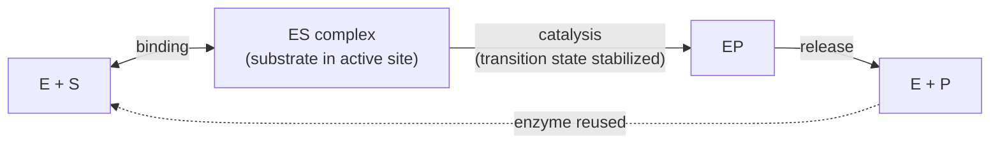
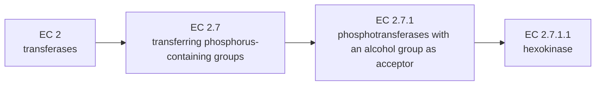

---
aliases:
  - Enzymes
  - EC Number
  - Enzyme Commission Number
  - EC Classification
  - Active Site
  - Biocatalyst
tags:
  - type/concept
  - domain/chemistry
  - domain/biology
  - domain/bioinformatics
  - level/L1
  - level/L2
  - level/L3
mastery: 0
prerequisites:
  - "[[Protein]]"
  - "[[Protein Structure]]"
  - "[[Catalysis]]"
  - "[[Activation Energy]]"
  - "[[Gibbs Free Energy]]"
related:
  - "[[Enzyme Catalysis]]"
  - "[[Michaelis-Menten Kinetics]]"
  - "[[Enzyme Inhibition]]"
  - "[[Allosteric Regulation]]"
  - "[[Cofactor]]"
  - "[[ATP]]"
  - "[[Metabolic Pathway]]"
  - "[[Functional Annotation]]"
  - "[[Transition State Theory]]"
  - "[[Ribosome]]"
  - "[[Restriction Enzyme]]"
projects: []
sources:
  - "[[Biology 2e (OpenStax)]]"
  - "[[Biochemistry (Berg)]]"
  - "[[Lehninger Principles of Biochemistry (Nelson)]]"
  - "[[Molecular Biology of the Cell (Alberts)]]"
  - "[[MIT 5.07SC - Biological Chemistry I]]"
  - "[[ExplorEnz]]"
  - "[[KEGG]]"
  - "[[Beadle 1941 - Genetic Control of Biochemical Reactions in Neurospora]]"
  - "[[Nissen 2000 - The Structural Basis of Ribosome Activity in Peptide Bond Synthesis]]"
---

# Enzyme

> [!abstract]
> An enzyme is a biological catalyst: a folded molecule, almost always a protein, that grabs specific molecules in a small pocket called the active site and makes one particular reaction go millions of times faster, without being used up.

## Definition

An **enzyme** is a biological catalyst: it accelerates a chemical reaction by lowering its activation energy, is regenerated unchanged at the end of each cycle, and does not change the reaction's free-energy change or equilibrium.[^os6][^berg][^lehninger] It binds its reactants (**substrates**) in an **active site** whose shape and chemistry select them, which makes enzymes highly **specific**.[^os6][^berg] Nearly all enzymes are [[Protein|proteins]]; some are RNA molecules (ribozymes), such as the catalytic core of the [[Ribosome]].[^nissen] Enzymes are classified by the reaction they catalyse into seven classes, each enzyme receiving an **EC number**.[^explorenz]

## Why it matters

- **EC numbers are the function vocabulary of genomes.** Annotating a gene as "EC 2.7.1.1" links it to a reaction; [[KEGG]] builds organism-specific pathway maps from such annotations, originally through EC numbers and now through orthology identifiers (KO) mapped to them.[^kegg] This is how a genome becomes a [[Metabolic Pathway|metabolic reconstruction]] ([[Functional Annotation]], [[Gene Annotation]]).
- **Genes act through enzymes.** Beadle and Tatum's *Neurospora* mutants each lost one enzymatic step, the origin of "one gene, one enzyme";[^beadle] a [[Missense Mutation]] in an active site is still the textbook loss-of-function variant.
- **Drugs and tools.** Most drugs inhibit enzymes ([[Enzyme Inhibition]], [[Drug Discovery]]); the molecular biology toolkit is made of enzymes (polymerases for [[Polymerase Chain Reaction|PCR]], [[Restriction Enzyme|restriction enzymes]], ligases).
- **Models.** Enzyme rate laws ([[Michaelis-Menten Kinetics]]) are the building blocks of [[Biochemical Kinetic Model|kinetic models]] of metabolism and signaling.

## Core (L1)

### A catalyst, not a power source

An enzyme speeds a reaction by lowering the free energy of its **transition state** (the activation barrier, $\Delta G^\ddagger$); it leaves the free energies of reactants and products, hence $\Delta G$ and the equilibrium constant, unchanged ([[Gibbs Free Energy]], [[Chemical Equilibrium]]). It therefore speeds the forward and reverse reactions by the same factor and reaches the same equilibrium sooner.[^berg][^lehninger] Rate enhancements range from about $10^5$ to $10^{17}$-fold;[^lehninger] a single molecule of carbonic anhydrase hydrates about $10^6$ CO₂ molecules per second.[^berg] An unfavorable reaction ($\Delta G > 0$) is not made possible by an enzyme alone: it must be coupled to a favorable one, typically [[ATP]] hydrolysis.



### The active site

The active site is a three-dimensional cleft or pocket, a small part of the enzyme's volume, formed by residues that are often far apart in the sequence and brought together by folding ([[Protein Structure]]). Substrates are held by multiple weak interactions (hydrogen bonds, electrostatic and van der Waals contacts, the [[Hydrophobic Effect]]), and specificity comes from the precise arrangement of these groups.[^berg] Two classic pictures: **lock and key** (the site is preformed to fit the substrate) and **induced fit** (the site changes shape on binding to fit snugly).[^berg][^os6] Specificity can be sharp: trypsin cuts proteins on the carboxyl side of lysine and arginine, chymotrypsin after large hydrophobic or aromatic residues.[^berg]

Many enzymes need a non-protein partner, a **cofactor**: a metal ion or an organic **coenzyme**, often derived from a vitamin ([[Cofactor]]).[^os6][^berg]

### The seven EC classes

The IUBMB Enzyme List classifies enzymes by the **reaction** they catalyse.[^explorenz]

| EC class | Name | Reaction type | Example (EC number) |
|---|---|---|---|
| 1 | Oxidoreductases | Oxidation-reduction: transfer of electrons or hydrogen ([[Redox Reaction]]) | alcohol dehydrogenase (1.1.1.1) |
| 2 | Transferases | Transfer of a group (methyl, phosphate, glycosyl...) from a donor to an acceptor | hexokinase (2.7.1.1) |
| 3 | Hydrolases | Cleavage of a bond by water ([[Hydrolysis]]) | trypsin (3.4.21.4) |
| 4 | Lyases | Cleavage of a bond by elimination, leaving a double bond or ring, or addition to a double bond | fructose-bisphosphate aldolase (4.1.2.13) |
| 5 | Isomerases | Rearrangement within one molecule | triose-phosphate isomerase (5.3.1.1) |
| 6 | Ligases | Joining of two molecules coupled to hydrolysis of ATP (or a similar triphosphate) | DNA ligase (ATP) (6.5.1.1) |
| 7 | Translocases | Movement of ions or molecules across a membrane | H⁺-transporting two-sector ATPase, i.e. ATP synthase (7.1.2.2) |

Six classes date from the first Enzyme List (1961); translocases were added in 2018 for membrane transporters, several of which had been filed as ATPases among the hydrolases.[^explorenz]

### Reading an EC number

An EC number has four fields: **class . subclass . sub-subclass . serial number**.[^explorenz]



Each entry also has an **accepted name** (hexokinase) and a **systematic name** that states the reaction (ATP:D-hexose 6-phosphotransferase).[^explorenz] A dash replaces unknown levels: `3.4.21.-` means "some serine endopeptidase", a common form in automatic annotations.

## Deeper (L2)

**How much stabilization buys how much speed.** By transition state theory the rate constant varies as $e^{-\Delta G^\ddagger/RT}$, so every 5.7 kJ/mol of transition-state stabilization at 25 °C multiplies the rate by 10 (Mathematical representation).[^berg] The chemical strategies that achieve it (acid-base, covalent and metal-ion catalysis, the serine protease catalytic triad) are the subject of [[Enzyme Catalysis]] ([[Transition State Theory]]).[^507]

**Rate versus substrate concentration (preview).** At low substrate concentration the initial rate rises proportionally to $[S]$; at high $[S]$ the active sites are saturated and the rate levels off at $V_{max}$. Many enzymes follow the Michaelis-Menten equation[^berg]

$$v_0 = \frac{V_{max}\,[S]}{K_M + [S]},$$

where $K_M$ is the substrate concentration giving half the maximal rate. Its derivation, the meaning of $k_{cat}$ and $k_{cat}/K_M$, and fitting to data are in [[Michaelis-Menten Kinetics]]; inhibitors that change $K_M$ or $V_{max}$ are in [[Enzyme Inhibition]].

**Regulation.** Cells tune enzyme activity by allosteric control ([[Allosteric Regulation]]), multiple forms of an enzyme (isozymes) with different properties, reversible covalent modification such as phosphorylation, proteolytic activation of an inactive precursor (trypsinogen to trypsin), and by changing the amount of enzyme made.[^berg] End products often inhibit the first committed enzyme of their own pathway (feedback inhibition, [[Metabolic Pathway]]).[^os6]

**Enzymes and their genes.** One EC number can correspond to several genes (isozymes, or subunits of one complex) and one gene to several EC numbers (multifunctional proteins). ATP synthase, EC 7.1.2.2, is a multi-subunit machine whose subunits in animals are encoded partly in mitochondrial DNA and partly in the nucleus ([[Mitochondrion]]).[^alberts14]

## Advanced (L3)

- **A classification of reactions, not of proteins.** Because EC numbers describe reactions,[^explorenz] they say nothing about sequence or structure. Unrelated proteins that catalyse the same reaction share a number; homologous proteins can carry different numbers. Sequence-based tools therefore predict EC numbers indirectly, by transferring them from characterized homologs, a step that is safest between orthologs and riskiest for distant [[Paralog|paralogs]] whose specificity may have diverged ([[Orthology Inference]], [[Protein Family]]).
- **Annotations age.** Entries are created, transferred and deleted (all the ATPases moved to EC 7 in 2018); an annotation file made with an older list can carry obsolete numbers, so pipelines should check them against the current list.[^explorenz]
- **From EC numbers to pathways.** KEGG generates organism-specific maps by intersecting manually drawn reference maps with a genome's annotated genes; a reaction whose enzyme is missing in a genome is a "pathway hole": a true absence, an unannotated gene, or an unrelated enzyme doing the same job (Exercise 6).[^kegg]
- **RNA catalysts.** In the ribosome's large subunit, only RNA surrounds the site where peptide bonds form: the ribosome is a ribozyme.[^nissen] Catalysis is a property of folded polymers, not of proteins alone.

## Mathematical representation

**Rate enhancement.** Write the rate constant as $k = A\,e^{-\Delta G^\ddagger/RT}$, where $\Delta G^\ddagger$ is the activation free energy, $R = 8.314$ J mol⁻¹ K⁻¹ the gas constant, $T$ the absolute temperature and $A$ a factor taken equal with and without enzyme ($k_BT/h$ in transition state theory).[^berg] Lowering the barrier by $\Delta\Delta G^\ddagger$ gives

$$\frac{k_{\text{enz}}}{k_{\text{uncat}}} = e^{\Delta\Delta G^\ddagger/RT}, \qquad \Delta\Delta G^\ddagger_{\times 10} = RT\ln 10 \approx 5.71 \text{ kJ/mol at } 298 \text{ K}.$$

**Equilibrium is untouched.** The forward and reverse reactions pass through the same transition state, so both barriers drop by the same $\Delta\Delta G^\ddagger$ and both rate constants are multiplied by the same factor $f$: $K = k_f/k_r = (f k_f)/(f k_r)$.

**EC numbers as a tree.** An EC number is a 4-tuple $(c, s, ss, n)$ with $c \in \{1, \dots, 7\}$; a partial number replaces trailing fields with "−". The Enzyme List is a rooted tree of depth 4 ([[Tree (Graph Theory)]]), and "EC $x$ falls under pattern $p$" is a prefix relation: the defined fields of $p$ equal the first fields of $x$.

## Computational representation

EC numbers are strings in annotation files (UniProt entries, GFF attributes, KEGG records). Parse them into tuples, never compare them as floats ("2.7.1.10" is not "2.7.1.1").

```python
import math

EC_CLASSES = {1: "oxidoreductases", 2: "transferases", 3: "hydrolases", 4: "lyases",
              5: "isomerases", 6: "ligases", 7: "translocases"}


def parse_ec(ec: str) -> tuple:
    """'2.7.1.1' -> (2, 7, 1, 1); '2.7.1.-' -> (2, 7, 1, None)."""
    parts = ec.removeprefix("EC ").split(".")
    if len(parts) != 4:
        raise ValueError(f"an EC number has four fields: {ec}")
    fields = tuple(None if p == "-" else int(p) for p in parts)
    if fields[0] not in EC_CLASSES:
        raise ValueError(f"unknown class: {ec}")
    return fields


def ec_matches(pattern: str, ec: str) -> bool:
    """True if ec falls under pattern; '-' in the pattern is a wildcard for that level and below."""
    for p, e in zip(parse_ec(pattern), parse_ec(ec)):
        if p is None:
            return True
        if p != e:
            return False
    return True


def rate_enhancement(ddg_kj: float, temp_k: float = 298.15) -> float:
    """Factor by which lowering the activation free energy by ddg_kj speeds a reaction."""
    R = 8.314e-3   # kJ / (mol K)
    return math.exp(ddg_kj / (R * temp_k))


print(parse_ec("EC 2.7.1.1"), EC_CLASSES[parse_ec("3.4.21.4")[0]])
print(ec_matches("3.4.21.-", "3.4.21.4"), ec_matches("3.4.21.-", "3.4.22.1"))
print(round(8.314e-3 * 298.15 * math.log(10), 2), "kJ/mol per factor of 10")
print(f"{rate_enhancement(40):.2e}")
```

```text
(2, 7, 1, 1) hydrolases
True False
5.71 kJ/mol per factor of 10
1.02e+07
```

Lowering the barrier by 40 kJ/mol, the energy of a few hydrogen bonds, already speeds a reaction ten-million-fold.

## Worked example

> [!example] Classifying the first steps of glycolysis
> Ask, in order: are electrons moved (1)? Is a group moved between two molecules (2)? Does water break a bond (3)? Is a bond broken or a double bond attacked without water or redox (4)? Does one molecule rearrange (5)? Are two molecules joined at the expense of ATP (6)? Does something cross a membrane (7)?
> 1. Glucose + ATP → glucose 6-phosphate + ADP: a phosphoryl group moves from ATP to glucose: **transferase**, hexokinase, EC 2.7.1.1.[^explorenz]
> 2. Glucose 6-phosphate ⇌ fructose 6-phosphate: same atoms, rearranged: **isomerase**, glucose-6-phosphate isomerase, EC 5.3.1.9.[^explorenz]
> 3. Fructose 1,6-bisphosphate → dihydroxyacetone phosphate + glyceraldehyde 3-phosphate: a C-C bond broken without water: **lyase**, aldolase, EC 4.1.2.13.[^explorenz]
> 4. Glyceraldehyde 3-phosphate + NAD⁺ + Pi → 1,3-bisphosphoglycerate + NADH + H⁺: the aldehyde is oxidized and NAD⁺ reduced: **oxidoreductase**, glyceraldehyde-3-phosphate dehydrogenase (phosphorylating), EC 1.2.1.12.[^explorenz]
>
> Step 1 uses ATP but is not a ligase reaction: ATP is the donor of the transferred group, not the energy source for joining two molecules. The whole pathway is in [[Glycolysis]].

## Common misconceptions

> [!warning] "Enzymes make unfavorable reactions happen"
> An enzyme changes how fast equilibrium is reached, not where it lies. A reaction with $\Delta G > 0$ is driven only by coupling it to a favorable one, usually [[ATP]] hydrolysis, through a shared intermediate.[^berg][^lehninger]

> [!warning] "An EC number identifies a gene or a protein"
> It identifies a reaction.[^explorenz] Isozymes share a number, a multifunctional protein has several, and unrelated proteins can share one. Counting EC numbers is not counting genes.

> [!warning] "Kinases are ligases because they use ATP"
> Kinases transfer a phosphoryl group from ATP to an acceptor: they are transferases (EC 2.7). Ligases (EC 6) join two molecules and use ATP hydrolysis to pay for the new bond.[^explorenz]

> [!warning] "All enzymes are proteins"
> Most are, but RNA can catalyse reactions: peptide bonds are formed by the ribosomal RNA.[^nissen]

## Exercises

> [!question] Exercise 1 (L1)
> Assign each reaction to an EC class: (a) lactate + NAD⁺ → pyruvate + NADH + H⁺; (b) acetylcholine + H₂O → choline + acetate; (c) CO₂ + H₂O ⇌ HCO₃⁻ + H⁺; (d) pyruvate + HCO₃⁻ + ATP → oxaloacetate + ADP + Pi; (e) ATP-driven export of 3 Na⁺ and import of 2 K⁺ across the plasma membrane; (f) dihydroxyacetone phosphate ⇌ glyceraldehyde 3-phosphate.

> [!success]- Solution
> (a) 1, oxidoreductase (lactate is oxidized, NAD⁺ reduced). (b) 3, hydrolase (water splits an ester bond). (c) 4, lyase: water is **added across a C=O double bond**, nothing is split by it, so this is not a hydrolysis (carbonic anhydrase is EC 4.2.1.1). (d) 6, ligase (two molecules joined, ATP hydrolyzed). (e) 7, translocase (the Na⁺/K⁺ pump, EC 7.2.2.13). (f) 5, isomerase (triose-phosphate isomerase).[^explorenz]

> [!question] Exercise 2 (L1)
> Which of these does an enzyme change: (a) $\Delta G$ of the reaction; (b) $\Delta G^\ddagger$; (c) the equilibrium constant; (d) the forward rate; (e) the reverse rate; (f) the time needed to reach equilibrium?

> [!success]- Solution
> It changes (b), (d), (e) and (f), and not (a) or (c). Lowering the shared transition state speeds both directions by the same factor, so the ratio $k_f/k_r = K$ is unchanged and equilibrium is reached sooner.

> [!question] Exercise 3 (L2)
> How much transition-state stabilization, in kJ/mol, does a $10^6$-fold rate enhancement require at 37 °C? And the $10^{17}$-fold upper end of known enhancements, at 25 °C?

> [!success]- Solution
> $\Delta\Delta G^\ddagger = RT \ln(\text{factor})$. At 310.15 K: $8.314 \times 10^{-3} \times 310.15 \times \ln 10^6 = 35.6$ kJ/mol. At 298.15 K: $8.314 \times 10^{-3} \times 298.15 \times \ln 10^{17} = 97.0$ kJ/mol. Modest energies, of the order of a few noncovalent interactions, explain huge accelerations because the dependence is exponential.

> [!question] Exercise 4 (L2)
> Read EC 3.4.21.4 level by level. Which of 3.4.21.4, 3.4.22.1, 3.1.1.7 and 3.4.21.5 match the pattern `3.4.-.-`, and which match `3.4.21.-`?

> [!success]- Solution
> Class 3, hydrolases; subclass 3.4, acting on peptide bonds (peptidases); sub-subclass 3.4.21, serine endopeptidases; serial 4, trypsin.[^explorenz] `3.4.-.-` matches 3.4.21.4, 3.4.22.1 and 3.4.21.5 (all peptidases), not 3.1.1.7 (an esterase). `3.4.21.-` matches only 3.4.21.4 and 3.4.21.5.

> [!question] Exercise 5 (L3, Python)
> With `parse_ec`, `ec_matches` and `EC_CLASSES` from the Computational representation, and the invented annotation table below, count genes per EC class, list the genes under `2.7.1.-`, the EC numbers carried by several genes, the genes carrying several EC numbers, and the genes with an incomplete number.
> ```python
> annotation = [          # invented gene IDs and annotations
>     ("geneA", "2.7.1.1"), ("geneB", "2.7.1.1"), ("geneC", "5.3.1.9"),
>     ("geneD", "2.7.1.11"), ("geneE", "4.1.2.13"), ("geneF", "1.2.1.12"),
>     ("geneG", "3.4.21.-"), ("geneH", "2.7.1.105"), ("geneH", "3.1.3.46"),
>     ("geneI", "7.1.2.2"),
> ]
> ```

> [!success]- Solution
> ```python
> from collections import Counter, defaultdict
>
> by_class = Counter(EC_CLASSES[parse_ec(ec)[0]] for _, ec in annotation)
> print(dict(sorted(by_class.items())))
> print(sorted({g for g, ec in annotation if ec_matches("2.7.1.-", ec)}))
> genes_per_ec, ecs_per_gene = defaultdict(set), defaultdict(set)
> for g, ec in annotation:
>     genes_per_ec[ec].add(g)
>     ecs_per_gene[g].add(ec)
> print({ec: sorted(gs) for ec, gs in genes_per_ec.items() if len(gs) > 1})
> print({g: sorted(es) for g, es in ecs_per_gene.items() if len(es) > 1})
> print([g for g, ec in annotation if None in parse_ec(ec)])
> ```
> ```text
> {'hydrolases': 2, 'isomerases': 1, 'lyases': 1, 'oxidoreductases': 1, 'transferases': 4, 'translocases': 1}
> ['geneA', 'geneB', 'geneD', 'geneH']
> {'2.7.1.1': ['geneA', 'geneB']}
> {'geneH': ['2.7.1.105', '3.1.3.46']}
> ['geneG']
> ```
> geneA and geneB look like isozymes (two hexokinase genes). geneH mimics the bifunctional 6-phosphofructo-2-kinase/fructose-2,6-bisphosphatase, one protein with a kinase and a phosphatase activity:[^berg] counting it once per class counts 10 annotations for 9 genes. geneG's partial number cannot be placed in a specific pathway step.

> [!question] Exercise 6 (L3)
> A new bacterial genome is annotated, and its KEGG glycolysis map shows nine of the ten steps with a gene; the phosphoglycerate mutase box is empty. Give three explanations and how you would test each.

> [!success]- Solution
> (1) **Missed annotation**: the gene exists but is too divergent for the similarity search; test with a more sensitive profile search ([[Hidden Markov Model]]) or by inspecting unannotated ORFs. (2) **Unrelated enzyme, same reaction**: EC numbers classify reactions, so a non-homologous protein may do the job (phosphoglycerate mutase in fact has two entries in the Enzyme List, EC 5.4.2.11 and 5.4.2.12, the 2,3-bisphosphoglycerate-dependent and -independent enzymes);[^explorenz] search for the other family. (3) **True absence**: the organism bypasses the step or does not run glycolysis that way; test by growth on glucose, metabolite measurements or gene knockouts. A pathway hole is a hypothesis generator, not a conclusion.

## Mastery checklist

- [ ] 1 Recognized: I can define an enzyme, an active site and a substrate, and name the seven EC classes.
- [ ] 2 Understood: I can explain why an enzyme changes rates but not equilibria, how specificity arises (lock and key, induced fit), and what each field of an EC number means.
- [ ] 3 Practiced: I can classify reactions into EC classes, compute rate enhancements from $\Delta\Delta G^\ddagger$, and parse and match EC numbers in Python.
- [ ] 4 Applied: I extracted EC numbers from a real annotation (UniProt or a genome GFF), mapped them to KEGG pathways and checked them against the current Enzyme List.
- [ ] 5 Explained: I can teach why EC numbers classify reactions rather than proteins, and what this implies for annotation transfer, isozymes, multifunctional enzymes and pathway holes.

## References

[^os6]: [[Biology 2e (OpenStax)]], ch. 6 "Metabolism" (activation energy, enzymes, active site and substrate specificity, induced fit, cofactors and coenzymes, feedback inhibition).
[^berg]: [[Biochemistry (Berg)]], 5th ed. (2002), treatment of enzymes (catalytic power and specificity, carbonic anhydrase, cofactors, free energy and the transition state, common features of active sites, lock and key and induced fit, protease specificity, regulatory strategies, the Michaelis-Menten model) and of glycolysis regulation (the bifunctional enzyme controlling fructose 2,6-bisphosphate).
[^lehninger]: [[Lehninger Principles of Biochemistry (Nelson)]], 8th ed. (2021), treatment of enzymes (rate enhancements from about $10^5$ to $10^{17}$, enzymes do not affect equilibria) (chapter number not verified).
[^alberts14]: [[Molecular Biology of the Cell (Alberts)]], 4th ed. (2002), ch. 14 "Energy Conversion: Mitochondria and Chloroplasts" (ATP synthase; mitochondrial and nuclear genes of respiratory complexes).
[^507]: [[MIT 5.07SC - Biological Chemistry I]], module on catalysis (principles of catalysis; organic and inorganic cofactors).
[^explorenz]: [[ExplorEnz]], the IUBMB Enzyme List: class definitions, EC number structure, accepted and systematic names, individual entries cited here, and the creation of EC 7 (translocases) in 2018.
[^kegg]: [[KEGG]], organism-specific pathway maps generated from reference maps and annotated genes (EC numbers, then KO identifiers); metabolic reconstruction.
[^beadle]: [[Beadle 1941 - Genetic Control of Biochemical Reactions in Neurospora]], *PNAS* 27(11):499-506.
[^nissen]: [[Nissen 2000 - The Structural Basis of Ribosome Activity in Peptide Bond Synthesis]], *Science* 289:920-930.
