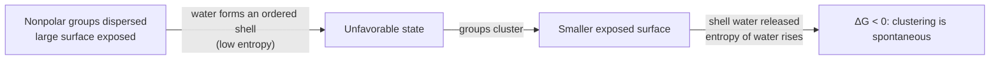

---
aliases:
  - Hydrophobic Interaction
  - Hydrophobic Bond
  - Hydrophobicity
  - Effet hydrophobe
tags:
  - type/concept
  - domain/chemistry
  - domain/biology
  - domain/physics
  - level/L1
  - level/L2
  - level/L3
mastery: 0
prerequisites:
  - "[[Water]]"
  - "[[Hydrogen Bond]]"
  - "[[Intermolecular Force]]"
  - "[[Gibbs Free Energy]]"
  - "[[Thermodynamic Entropy]]"
related:
  - "[[Amino Acid]]"
  - "[[Protein Structure]]"
  - "[[Protein Folding]]"
  - "[[Lipid]]"
  - "[[Cell Membrane]]"
  - "[[Ligand Binding]]"
  - "[[Partition Coefficient]]"
  - "[[Hydropathy Plot]]"
  - "[[Solvent Accessible Surface Area]]"
  - "[[Boltzmann Entropy]]"
projects: []
sources:
  - "[[Biochemistry (Berg)]]"
  - "[[Lehninger Principles of Biochemistry (Nelson)]]"
  - "[[Molecular Biology of the Cell (Alberts)]]"
  - "[[Kyte 1982 - A Simple Method for Displaying the Hydropathic Character of a Protein]]"
  - "[[Chothia 1974 - Hydrophobic Bonding and Accessible Surface Area in Proteins]]"
  - "[[Chandler 2005 - Interfaces and the Driving Force of Hydrophobic Assembly]]"
---

# Hydrophobic Effect

> [!abstract]
> Oil and water separate not because oil molecules attract each other, but because water is "happier" (has more entropy) when the nonpolar surface it must line up against is as small as possible.

## Definition

The **hydrophobic effect** is the tendency of nonpolar molecules or groups to cluster together in water, which minimizes their contact with water. At room temperature its driving force is mainly the **increase in entropy of water**: water molecules ordered around exposed nonpolar surfaces are released when those surfaces come together. It is a property of the solvent, not an attraction between the nonpolar groups.[^berg][^lehninger]

## Why it matters

- **Folding.** It is a major driving force of protein folding: nonpolar side chains are buried in the core, polar and charged ones stay on the surface.[^berg] Structure validation and design programs check exactly this pattern ([[Protein Structure]], [[Solvent Accessible Surface Area]]).
- **Sequence-based prediction.** Hydropathy scales give each [[Amino Acid]] a number, from 4.5 for isoleucine to −4.5 for arginine in the Kyte-Doolittle scale; averaging them along a sequence flags candidate membrane-spanning segments ([[Hydropathy Plot]], [[Cell Membrane#Computational representation]]).[^kyte]
- **Membranes and binding.** Amphipathic lipids assemble into bilayers ([[Lipid]], [[Cell Membrane]]), and the release of ordered water helps a substrate or a drug bind a nonpolar pocket ([[Ligand Binding]], [[Drug Discovery]]).[^lehninger][^alberts]
- **Variant effect.** A [[Missense Mutation]] that puts a charged residue into a buried core, or a hydrophobic one on the surface, can destabilize a protein or create a sticky surface patch, as in sickle-cell hemoglobin ([[Protein Structure#Worked example]]).[^berg]

## Core (L1)

**Water is a network.** Each [[Water]] molecule can donate and accept [[Hydrogen Bond|hydrogen bonds]], so liquid water is a constantly rearranging network of them. Polar and charged solutes join the network; nonpolar ones (hydrocarbon chains, the side chains of Leu, Ile, Phe) cannot.[^lehninger]

**The cost of a nonpolar surface.** To keep their hydrogen bonds, the water molecules next to a nonpolar surface adopt a restricted set of orientations: a more ordered, cage-like shell. Ordering means lower entropy, so dissolving a nonpolar substance in water is unfavorable.[^lehninger][^berg]

**Why clustering pays.** When nonpolar molecules come together, part of their surface is hidden from water, fewer water molecules are ordered, and the entropy of the water rises. In $\Delta G = \Delta H - T\Delta S$, the large positive $\Delta S$ of the water makes $\Delta G$ negative: clustering is spontaneous ([[Gibbs Free Energy]]).[^lehninger][^berg]



**Where it acts in the cell:**

| System | What clusters | Result |
|---|---|---|
| Globular protein | nonpolar side chains | hydrophobic core, polar surface[^berg] |
| Membrane | fatty-acid tails of phospholipids | lipid bilayer with an oily interior[^alberts][^lehninger] |
| Binding site | nonpolar parts of ligand and pocket | ordered water released on binding[^lehninger] |

## Deeper (L2)

**The thermodynamic signature.** For small nonpolar molecules at room temperature, the unfavorable free energy of transfer into water is dominated by the entropy term, not by the enthalpy.[^lehninger] Van der Waals attractions between nonpolar groups exist, but they are weak: they are not what drives clustering ([[Intermolecular Force]]).[^berg]

**Measuring hydrophobicity: partitioning.** Shake a solute with water and a nonpolar solvent; at equilibrium the ratio $K = c_\text{oil}/c_\text{water}$ is its [[Partition Coefficient]]. From [[Chemical Equilibrium]], the standard free energy of transfer from water to oil is $\Delta G^\circ_{w\to o} = -RT \ln K$: each factor of 10 in $K$ is worth $RT \ln 10 \approx 5.7$ kJ/mol at 25 °C (Computational representation).

**Hydropathy scales.** A scale assigns one hydrophobicity number per amino acid side chain. Kyte and Doolittle's scale (1982) runs from isoleucine (4.5) to arginine (−4.5); their moving-window average along a sequence remains the textbook first predictor of transmembrane segments.[^kyte] The full scale is tabulated in [[Amino Acid#Core (L1)]].

**From thermodynamics to geometry.** Kauzmann called the free-energy gain of moving nonpolar residues from water into the protein interior the "hydrophobic bond"; Chothia related this free energy to the **accessible surface area** that folding buries.[^chothia] The hydrophobic contribution then becomes something computable from coordinates: roughly proportional to the nonpolar area hidden from water ([[Solvent Accessible Surface Area]], Mathematical representation).

## Advanced (L3)

**Size matters.** The ordered-shell picture describes small solutes. Chandler's review distinguishes two regimes: a small nonpolar molecule is hydrated individually, the hydrogen-bond network bending around it with a cost that grows with its volume and is largely entropic; around a large nonpolar surface (beyond roughly 1 nm) the network cannot wrap, water gives up hydrogen bonds and forms an interface, and the cost grows with area and becomes largely enthalpic.[^chandler] The assembly of proteins and membranes, which buries large surfaces, therefore follows interface physics rather than a sum of small-solute terms.

**Temperature.** Because the driving term is $-T\Delta S$, the free energy of hydrophobic association depends on temperature even when $\Delta H$ and $\Delta S$ are fixed; in reality both change with temperature too, so the strength of the effect is temperature-dependent (Exercise 6). This is one reason protein stability is a narrow balance of large opposing terms ([[Protein Folding]], [[Free Energy Landscape]]).

**In bioinformatics.** Since nonpolar side chains are buried and polar ones exposed,[^berg] a core position can trade one hydrophobic residue for another far more easily than for a charged one: this is the kind of preference that [[Substitution Matrix|substitution matrices]] average over many proteins, and that variant predictors refine with structure ([[Solvent Accessible Surface Area]]). Periodic hydrophobicity is another signal: an α helix has 3.6 residues per turn,[^berg] so a helix with one hydrophobic face (an **amphipathic** helix) shows a hydropathy pattern repeating every 3.6 residues, detected by the hydrophobic moment (Exercise 5).

## Mathematical representation

- **Free energy of transfer** of a solute from water to a nonpolar phase, with $R$ the gas constant, $T$ the absolute temperature and $K$ the partition coefficient:
$$\Delta G^\circ_{w\to o} = -RT\ln K = \Delta H^\circ - T\Delta S^\circ .$$
- **Area model.** With $A_\text{np}$ the nonpolar surface area exposed to water and $\gamma > 0$ an empirical coefficient (energy per unit area), the hydrophobic free energy is modeled as $G_\text{hyd} \approx \gamma A_\text{np}$, so a process that buries $\Delta A$ of nonpolar area gains $\Delta G_\text{hyd} \approx -\gamma\, \Delta A$.[^chothia]
- **Why clustering buries area.** $n$ droplets of volume $v$ have total area $n \cdot a(v)$, with $a(v) = (36\pi)^{1/3} v^{2/3}$ for a sphere. One droplet of volume $nv$ has area $a(nv) = n^{2/3} a(v)$. The exposed fraction after merging is $n^{2/3}/n = n^{-1/3}$, which falls as $n$ grows.
- **A counting picture of the entropy.** In a toy model where a shell water molecule can adopt $W_s$ hydrogen-bond-preserving orientations instead of $W_b > W_s$ in bulk, ordering $N$ shell molecules changes the entropy by ([[Boltzmann Entropy]])
$$\Delta S = N k_B \ln \frac{W_s}{W_b} < 0, \qquad N \propto A_\text{np},$$
so the entropy cost is proportional to the exposed area, which connects the counting argument to the area model.

## Computational representation

Hydrophobicity enters code as numbers: per-residue scales ([[Amino Acid#Computational representation]]), partition coefficients, and surface areas computed from structures. The sketch below turns partition coefficients into transfer free energies and shows how merging droplets hides area.

```python
import math

R = 8.314e-3          # gas constant, kJ/(mol K)


def transfer_free_energy(K: float, T: float = 298.15) -> float:
    """Standard free energy (kJ/mol) of moving a solute from water into oil, K = c_oil / c_water."""
    return -R * T * math.log(K)


def sphere_area(volume: float) -> float:
    """Surface of a sphere of the given volume."""
    r = (3 * volume / (4 * math.pi)) ** (1 / 3)
    return 4 * math.pi * r ** 2


def exposed_area(n: int, volume: float) -> tuple[float, float]:
    """Area of n separate nonpolar droplets, and of one droplet with the same total volume."""
    return n * sphere_area(volume), sphere_area(n * volume)


GAMMA = 0.1   # kJ/(mol Å^2): toy coefficient, for illustration only

for K in (10, 1000):
    print(f"K = {K:>4}: dG(water -> oil) = {transfer_free_energy(K):6.2f} kJ/mol")
v = 4 / 3 * math.pi * 3.0 ** 3            # toy nonpolar droplet of radius 3 Å
for n in (2, 10, 100):
    separate, merged = exposed_area(n, v)
    print(f"n = {n:>3}: {separate:7.0f} -> {merged:6.0f} Å^2 "
          f"({1 - merged / separate:.0%} hidden), dG = {-GAMMA * (separate - merged):7.1f} kJ/mol")
```

```text
K =   10: dG(water -> oil) =  -5.71 kJ/mol
K = 1000: dG(water -> oil) = -17.12 kJ/mol
n =   2:     226 ->    180 Å^2 (21% hidden), dG =    -4.7 kJ/mol
n =  10:    1131 ->    525 Å^2 (54% hidden), dG =   -60.6 kJ/mol
n = 100:   11310 ->   2437 Å^2 (78% hidden), dG =  -887.3 kJ/mol
```

The hidden fraction $1 - n^{-1/3}$ grows with the size of the cluster, which is why many nonpolar groups end up in one core or one bilayer rather than in many small clusters. Real programs replace the spheres by the accessible surface of atomic structures ([[Solvent Accessible Surface Area]]).

## Worked example

> [!example] Two nonpolar droplets merge (toy numbers)
> Two nonpolar droplets of radius 3 Å, and a toy coefficient $\gamma = 0.1$ kJ mol⁻¹ Å⁻², chosen only for illustration.
> 1. **Area before.** Each sphere: $4\pi (3)^2 = 113.1$ Ų; together 226.2 Ų.
> 2. **Area after.** Volume doubles, so the radius becomes $3 \times 2^{1/3} = 3.78$ Šand the area $179.5$ Ų. Hidden: $46.7$ Ų, a fraction $1 - 2^{-1/3} = 20.6$ %.
> 3. **Free energy.** $\Delta G \approx -\gamma \Delta A = -4.7$ kJ/mol.
> 4. **Meaning.** $RT = 2.48$ kJ/mol at 25 °C, so the merged state is favored by a factor $e^{4.67/2.48} \approx 6.6$. Nothing attracts the two droplets in this model: the whole gain comes from the water surface that disappears.

## Common misconceptions

> [!warning] "Nonpolar molecules attract each other strongly"
> Their mutual van der Waals attraction is weak. The clustering is driven by water, whose entropy rises when less nonpolar surface is exposed.[^berg][^lehninger]

> [!warning] "Hydrogen bonds inside the protein are what make it fold"
> An unfolded chain already makes hydrogen bonds with water; folding mostly exchanges them for internal ones. The hydrophobic effect is the major driving force; internal hydrogen bonds and salt bridges fix *which* structure forms ([[Protein Structure]]).[^berg]

> [!warning] "The hydrophobic effect is always an entropy effect"
> For small solutes at room temperature, yes. For large nonpolar surfaces the cost becomes mostly enthalpic (broken hydrogen bonds at an interface), and the balance shifts with temperature.[^chandler]

## Exercises

> [!question] Exercise 1 (L1)
> Shake olive oil with water: the droplets coalesce into one layer. Explain why in terms of the water, without invoking an attraction between oil molecules.

> [!success]- Solution
> Every oil-water contact forces the adjacent water molecules into restricted orientations that preserve their hydrogen bonds: low entropy. Coalescence reduces the total oil-water interface, releases those water molecules into the bulk, and raises the entropy of the system, so $\Delta G < 0$. The oil molecules are bystanders.

> [!question] Exercise 2 (L1)
> Using the sign of the Kyte-Doolittle hydropathy ([[Amino Acid#Core (L1)]]), predict which of Leu, Lys, Phe, Asp, Val, Ser are more likely to be buried in the core of a soluble protein.

> [!success]- Solution
> Leu (3.8), Phe (2.8) and Val (4.2) are positive: hydrophobic, likely buried. Lys (−3.9), Asp (−3.5) and Ser (−0.8) are negative: likely on the surface. Ser is only mildly hydrophilic and is found in both places; the rule is a tendency, not a law.

> [!question] Exercise 3 (L2)
> A solute has $K = 100$ between octanol and water at 298.15 K. Compute $\Delta G^\circ_{w\to o}$, and the change in $\Delta G^\circ$ when a modification makes $K$ ten times larger.

> [!success]- Solution
> $\Delta G^\circ = -RT\ln 100 = -(8.314 \times 10^{-3})(298.15)(4.605) = -11.42$ kJ/mol. Multiplying $K$ by 10 adds $-RT\ln 10 = -5.71$ kJ/mol. Free energies add when partition coefficients multiply, which is why hydrophobicity is reported on a log scale ([[Partition Coefficient]]).

> [!question] Exercise 4 (L2)
> Show that when two identical spherical droplets merge, the fraction of surface hidden from water is $1 - 2^{-1/3}$, independent of their size. What happens for $n$ droplets?

> [!success]- Solution
> Area scales as $v^{2/3}$. Before: $2a(v)$. After: $a(2v) = 2^{2/3}a(v)$. Remaining fraction $2^{2/3}/2 = 2^{-1/3} = 0.794$, hidden $0.206$, whatever $v$. For $n$ droplets the remaining fraction is $n^{-1/3}$: 0.46 for 10, 0.22 for 100, so large clusters (a protein core, a bilayer) are increasingly efficient at hiding nonpolar surface.

> [!question] Exercise 5 (L3, Python)
> In an α helix, consecutive residues point 100° apart around the axis (3.6 residues per turn). Define the hydrophobic moment of a segment as $\mu = \frac{1}{n}\left|\sum_{k} h(a_k)\, e^{\,i k \delta}\right|$ with $\delta = 100°$ and $h$ the Kyte-Doolittle scale. Compare an invented amphipathic 18-residue helix (Leu on one face, Lys on the other) with a scrambled sequence of the same composition.

> [!success]- Solution
> ```python
> import cmath, math, random
>
> KD = {"I": 4.5, "V": 4.2, "L": 3.8, "F": 2.8, "C": 2.5, "M": 1.9, "A": 1.8,
>       "G": -0.4, "T": -0.7, "S": -0.8, "W": -0.9, "Y": -1.3, "P": -1.6,
>       "H": -3.2, "E": -3.5, "Q": -3.5, "D": -3.5, "N": -3.5, "K": -3.9, "R": -4.5}
>
>
> def hydrophobic_moment(seq: str, step_deg: float = 100.0) -> float:
>     """Length of the mean hydropathy vector when residue k points at angle k * step."""
>     step = math.radians(step_deg)
>     return abs(sum(KD[a] * cmath.exp(1j * k * step) for k, a in enumerate(seq))) / len(seq)
>
>
> helix = "".join("L" if (100 * k) % 360 < 180 else "K" for k in range(18))  # invented
> scrambled = "".join(random.Random(1).sample(helix, len(helix)))
> for name, s in (("amphipathic", helix), ("scrambled", scrambled)):
>     mean = sum(KD[a] for a in s) / len(s)
>     print(f"{name:12} {s}  mean {mean:+.2f}  moment {hydrophobic_moment(s):.2f}")
> ```
> ```text
> amphipathic  LLKKLLKKLKKLLKKLLK  mean -0.05  moment 2.46
> scrambled    LKLLKLKLKKKLLKKLLK  mean -0.05  moment 0.72
> ```
> Same composition, so the same mean hydropathy, but the amphipathic helix has a moment more than three times larger: its hydrophobic residues all face one side. A mean-hydropathy window ([[Hydropathy Plot]]) cannot see this. Such a helix can hide one face (against a membrane surface or the rest of a protein) while the other stays in water.

> [!question] Exercise 6 (L3)
> Assume hydrophobic association has $\Delta H \approx 0$ and $\Delta S > 0$, both independent of temperature. How does $\Delta G$ change between 5 °C and 40 °C? Then give one physical reason why this simple model fails for large nonpolar surfaces.

> [!success]- Solution
> $\Delta G = -T\Delta S$ becomes more negative as $T$ rises: in this model the association strengthens from 278 K to 313 K by a factor $313/278 \approx 1.13$ in $\Delta G$. The model fails because $\Delta H$ and $\Delta S$ themselves depend on temperature, and because for large surfaces the cost is dominated by broken hydrogen bonds at an interface (an enthalpy), not by an ordered shell (an entropy).[^chandler]

## Mastery checklist

- [ ] 1 Recognized: I can state that nonpolar groups cluster in water and that the driving force comes from the water.
- [ ] 2 Understood: I can explain the ordered water shell, the sign of $\Delta S$, and why the effect folds proteins and builds membranes.
- [ ] 3 Practiced: I can compute transfer free energies from partition coefficients, area changes on clustering, and a hydrophobic moment in Python.
- [ ] 4 Applied: I used a hydropathy scale on real protein sequences and checked buried and exposed residues in a structure from the PDB.
- [ ] 5 Explained: I can teach the limits of the textbook picture (size and temperature dependence) and the pitfalls of hydropathy-based predictions.

## References

[^berg]: [[Biochemistry (Berg)]], 5th ed. (2002), treatment of hydrophobic interactions among the bonds of biochemistry and of protein folding (nonpolar side chains buried, polar ones on the surface).
[^lehninger]: [[Lehninger Principles of Biochemistry (Nelson)]], 8th ed. (2021), treatment of water and hydrophobic interactions (ordered water around nonpolar solutes, entropy of release, amphipathic compounds, release of ordered water on substrate binding).
[^alberts]: [[Molecular Biology of the Cell (Alberts)]], 4th ed. (2002), treatment of noncovalent interactions in cell chemistry and of lipid bilayer self-assembly.
[^kyte]: [[Kyte 1982 - A Simple Method for Displaying the Hydropathic Character of a Protein]], *Journal of Molecular Biology* 157:105-132.
[^chothia]: [[Chothia 1974 - Hydrophobic Bonding and Accessible Surface Area in Proteins]], *Nature* 248:338-339.
[^chandler]: [[Chandler 2005 - Interfaces and the Driving Force of Hydrophobic Assembly]], *Nature* 437:640-647.
