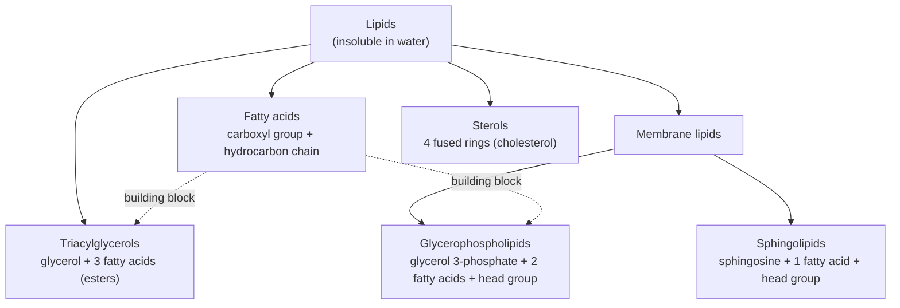

---
aliases:
  - Lipids
  - Fatty Acid
  - Triacylglycerol
  - Triglyceride
  - Phospholipid
  - Sterol
  - Lipide
tags:
  - type/concept
  - domain/chemistry
  - domain/biology
  - level/L1
  - level/L2
  - level/L3
mastery: 0
prerequisites:
  - "[[Functional Group]]"
  - "[[Hydrolysis]]"
  - "[[Cis-Trans Isomerism]]"
  - "[[Hydrophobic Effect]]"
related:
  - "[[Cell Membrane]]"
  - "[[Lipid Bilayer]]"
  - "[[Carbohydrate]]"
  - "[[Protein]]"
  - "[[Fatty Acid Metabolism]]"
  - "[[Metabolism]]"
  - "[[Cell Signaling]]"
  - "[[Membrane Protein]]"
  - "[[Metabolomics]]"
projects: []
sources:
  - "[[Biology 2e (OpenStax)]]"
  - "[[Biochemistry (Berg)]]"
  - "[[Lehninger Principles of Biochemistry (Nelson)]]"
  - "[[Molecular Biology of the Cell (Alberts)]]"
  - "[[MIT 5.07SC - Biological Chemistry I]]"
  - "[[Chemistry 2e (OpenStax)]]"
  - "[[Patti 2012 - Metabolomics - The Apogee of the Omics Trilogy]]"
---

# Lipid

> [!abstract]
> Lipids are the oily molecules of the cell: fatty acids, fats, phospholipids and sterols. They share no common skeleton, only a dislike of water, and that dislike makes them store energy compactly and assemble on their own into membranes.

## Definition

**Lipids** are a chemically diverse group of biomolecules defined by a common property rather than a common structure: they are largely nonpolar, hence insoluble in water and soluble in nonpolar solvents.[^os-u1][^lehninger] The main classes are **fatty acids**, **triacylglycerols** (fats and oils), **membrane lipids** (phospholipids and sphingolipids) and **sterols** such as cholesterol.[^berg][^lehninger]

## Why it matters

- **Membranes set the rules of protein sequences.** The hydrophobic core of the bilayer is why transmembrane segments are runs of hydrophobic residues, the signal that hydropathy-based topology prediction reads ([[Cell Membrane]], [[Membrane Protein]], [[Hydropathy Plot]]).
- **Lipids are invisible to sequencing.** No template encodes them: a cell's lipid composition is the output of the enzymes of [[Fatty Acid Metabolism]] and related pathways, so genomics sees lipids only through those genes and their [[Metabolic Pathway|pathways]]. Measuring the lipids themselves is a [[Mass Spectrometry]] problem, as for other metabolites ([[Metabolomics]]).[^patti]
- **Signaling and drugs.** Lipid-derived messengers (inositol phosphates, diacylglycerol, eicosanoids, steroid hormones) are drug targets and pathway nodes ([[Cell Signaling]]).[^alberts][^berg]
- **Notation is data.** Lipid species are written in a compact shorthand (`18:1(9Z)`) that code must parse; the Computational representation does it.

## Core (L1)



### Fatty acids

A fatty acid is a hydrocarbon chain ending in a carboxyl group ([[Functional Group]]); at cellular pH the carboxyl is ionized, so the chain is written as a carboxylate (palmitate, oleate).[^berg] Biological fatty acids usually have an even number of carbons, typically 14 to 24, with 16 and 18 the most common.[^berg] A **saturated** chain has only single bonds; an **unsaturated** chain has one or more C=C double bonds, almost always *cis* in natural fatty acids ([[Cis-Trans Isomerism]]).[^lehninger] A *cis* double bond kinks the chain, so unsaturated chains pack less tightly and melt at lower temperature:[^lehninger][^os-u1]

| Fatty acid | Shorthand | Melting point (°C)[^lehninger] |
|---|---|---:|
| Palmitic | 16:0 | 63.1 |
| Stearic | 18:0 | 69.6 |
| Oleic | 18:1(9Z) | 13.4 |
| Linoleic | 18:2(9Z,12Z) | 1 to 5 |
| α-Linolenic | 18:3(9Z,12Z,15Z) | −11 |

**Shorthand.** `18:1(9Z)` means 18 carbons, 1 double bond, starting at carbon 9 counted from the carboxyl carbon (C1), *cis* (Z). Biochemists also write cis-Δ⁹. Counting instead from the methyl end gives the **ω (omega)** class: oleate is ω-9, linoleate ω-6, α-linolenate ω-3.[^berg]

### Triacylglycerols: energy storage

A **triacylglycerol** (triglyceride) is glycerol whose three hydroxyl groups are esterified to three fatty acids; lipases release the fatty acids by [[Hydrolysis]].[^berg][^os-u1] With no charged group left, it is fully nonpolar and is stored as anhydrous droplets in fat cells.[^berg] Complete oxidation yields about 38 kJ/g, versus about 17 kJ/g for carbohydrates and proteins; because glycogen is stored hydrated, a gram of nearly anhydrous fat stores more than six times as much energy as a gram of hydrated glycogen.[^berg]

### Phospholipids and sphingolipids: membrane fabric

A **glycerophospholipid** is glycerol 3-phosphate with fatty acids esterified at carbons 1 and 2 and the phosphate esterified to a polar alcohol (choline, ethanolamine, serine, inositol): phosphatidylcholine, phosphatidylethanolamine, and so on.[^berg] A **sphingolipid** uses sphingosine instead of glycerol, with one fatty acid in amide linkage; sphingomyelin carries a phosphocholine head.[^berg] Both are **amphipathic**: a polar head and two nonpolar tails ([[Phosphate Ester]]).

### Sterols

Sterols have four fused rings (three six-membered, one five-membered). **Cholesterol** adds a hydroxyl group at one end (a tiny polar head) and a hydrocarbon tail at the other; it sits among phospholipids in animal membranes and is the precursor of steroid hormones, bile salts and vitamin D.[^berg][^lehninger][^os-u1]

### Amphipathic self-assembly

![[lipid-self-assembly-micelle-bilayer.svg]]

In water, amphipathic lipids aggregate spontaneously so that their tails escape contact with water while their heads stay hydrated; the driving force is the [[Hydrophobic Effect]], an entropy gain of the solvent, not an attraction between tails.[^berg] Shape decides the structure:[^berg]

- **One tail** (salts of fatty acids, detergents): cone-shaped molecules pack into a sphere with the tails inside, a **micelle**.
- **Two tails** (phospholipids, sphingolipids): the pair of chains is too bulky for a micelle interior, and the molecules form a **bilayer**, two sheets with tails facing each other.

A bilayer edge would expose tails to water, so bilayers close on themselves into sealed compartments (vesicles, liposomes) and reseal when torn.[^berg] This is the physical basis of every [[Cell Membrane]] and of [[Lipid Bilayer]] physics.

## Deeper (L2)

**Fluidity is chemistry.** Shorter and more unsaturated chains lower the melting temperature of a bilayer as they do for free fatty acids; cholesterol buffers fluidity. The cell-level consequences are in [[Cell Membrane#Deeper (L2)]].

**Essential fatty acids.** Mammals cannot introduce double bonds beyond carbon 9, so linoleate (ω-6) and α-linolenate (ω-3) must come from the diet; longer polyunsaturated chains such as arachidonate, 20:4(5Z,8Z,11Z,14Z), are made from them.[^berg][^lehninger]

**Lipids as signals.**[^alberts][^berg][^lehninger]

| Signal | Origin | Action |
|---|---|---|
| Inositol 1,4,5-trisphosphate (IP3) and diacylglycerol (DAG) | Phospholipase C cleaves phosphatidylinositol 4,5-bisphosphate in the membrane | IP3 releases Ca²⁺ from internal stores; DAG stays in the membrane and activates protein kinase C |
| Eicosanoids (prostaglandins and others) | Arachidonate, released from membrane phospholipids | Local hormones (inflammation, pain); aspirin blocks their synthesis by inhibiting cyclooxygenase |
| Steroid hormones | Cholesterol | Hydrophobic enough to cross membranes; bind intracellular receptors that regulate transcription |

**Lipid anchors.** Some proteins are attached to membranes by a covalently linked lipid (a fatty acyl or prenyl group, or a glycosylphosphatidylinositol anchor), a kind of [[Post-Translational Modification]].[^alberts]

**Metabolism.** Fatty acids are degraded two carbons at a time (β-oxidation) and synthesized by a separate pathway; the comparison is the subject of [[Fatty Acid Metabolism]].[^507]

## Advanced (L3)

- **Why fat is the long-term store.** Fatty-acid carbons are more reduced than sugar carbons (average oxidation state about −1.75 in palmitate versus 0 in glucose, computed in [[Metabolism#Computational representation]]), so each carbon delivers more electrons to the respiratory chain; storing them without water multiplies the advantage (Exercise 4).
- **Shape beyond two cases.** The geometric model of the Mathematical representation predicts that single-tailed lipids, such as lysophospholipids, behave like detergents and that small-headed lipids favor curved, non-bilayer structures; real membranes mix shapes, which matters for membrane curvature, fusion and protein insertion ([[Lipid Bilayer]]).
- **Lipid data.** A mass fixes only the total carbons and double bonds of a lipid's chains, so names in mass spectrometry results come at several levels of detail: a sum composition such as `PC 34:1` (a phosphatidylcholine whose two chains total 34 carbons and one double bond) or the exact chains, `PC 16:0/18:1`, when fragmentation resolves them ([[Metabolomics]], [[Tandem Mass Spectrometry]]). Parsing and normalizing such names comes before any analysis (Exercise 6).
- **Simulation.** Bilayers are a standard system for [[Molecular Dynamics Simulation]], and membrane proteins are simulated embedded in them ([[Membrane Protein]]).

## Mathematical representation

**Fatty acid composition.** A fatty acid with $n$ carbons and $d$ C=C double bonds at positions $\Delta = \{\delta_1 < \dots < \delta_d\}$ (counted from the carboxyl carbon, C1) has, in its acid form,

$$\text{formula} = \mathrm{C}_n\mathrm{H}_{2n-2d}\mathrm{O}_2, \qquad \omega = n - \delta_d,$$

since a saturated acid is $\mathrm{C}_n\mathrm{H}_{2n}\mathrm{O}_2$ and each double bond removes two hydrogens. A triacylglycerol is a triple condensation (each ester bond releases one H₂O):

$$\mathrm{TAG} = \mathrm{C_3H_8O_3} + \mathrm{FA}_1 + \mathrm{FA}_2 + \mathrm{FA}_3 - 3\,\mathrm{H_2O}.$$

**A geometric model of self-assembly** (a simplification for intuition). Let a lipid have tail volume $v$, tail length $l$ and head area $a_0$ at the aggregate surface, and define the shape ratio $s = v/(a_0 l)$. For $N$ molecules filling an aggregate of radius (or half-thickness) $R \le l$:

| Aggregate | Volume / surface | Condition |
|---|---|---|
| Sphere | $Nv = \tfrac{4}{3}\pi R^3$, $Na_0 = 4\pi R^2$ ⇒ $v/a_0 = R/3$ | $s \le 1/3$ |
| Cylinder (length $L$) | $Nv = \pi R^2 L$, $Na_0 = 2\pi R L$ ⇒ $v/a_0 = R/2$ | $s \le 1/2$ |
| Bilayer leaflet (area $A$) | $Nv = A\,l$, $Na_0 = A$ ⇒ $v/a_0 = l$ | $s = 1$ |

A second tail doubles $v$ at similar $a_0$ and $l$, doubling $s$: a cone that fits a micelle becomes a cylinder that only fits a bilayer.

**Energy per stored gram.** If a fuel yields $e$ kJ per dry gram and is stored with $w$ grams of water per gram, the yield per stored gram is $e/(1+w)$.

## Computational representation

Fatty acids are strings in shorthand; a regular expression ([[Regular Expression]]) turns them into counts from which formula, mass and ω class follow. Atomic weights: C 12.011, H 1.008, O 15.999.[^chem2e]

```python
import re

MASS = {"C": 12.011, "H": 1.008, "O": 15.999}   # standard atomic weights, g/mol


def parse_fatty_acid(shorthand: str) -> dict:
    """Parse '18:2(9Z,12Z)': carbons, double bonds, Delta positions, omega class."""
    m = re.fullmatch(r"(\d+):(\d+)(?:\(([\dZE,]+)\))?", shorthand)
    if not m:
        raise ValueError(f"bad shorthand: {shorthand}")
    n, d = int(m.group(1)), int(m.group(2))
    deltas = [int(x[:-1]) for x in m.group(3).split(",")] if m.group(3) else []
    if len(deltas) != d:
        raise ValueError("number of positions differs from number of double bonds")
    omega = n - max(deltas) if deltas else None     # first double bond from the methyl end
    return {"C": n, "db": d, "delta": deltas, "omega": omega,
            "formula": {"C": n, "H": 2 * n - 2 * d, "O": 2}}


def triacylglycerol(*fatty_acids: dict) -> dict:
    """Glycerol (C3H8O3) + 3 fatty acids - 3 H2O (three ester bonds)."""
    f = {"C": 3, "H": 8, "O": 3}
    for fa in fatty_acids:
        for el, k in fa["formula"].items():
            f[el] += k
    f["H"] -= 6
    f["O"] -= 3
    return f


def molar_mass(formula: dict) -> float:
    return sum(MASS[el] * k for el, k in formula.items())


def fmt(formula: dict) -> str:
    return "".join(f"{el}{formula[el]}" for el in "CHO")


for name, s in [("palmitic acid", "16:0"), ("oleic acid", "18:1(9Z)"),
                ("linoleic acid", "18:2(9Z,12Z)"), ("alpha-linolenic acid", "18:3(9Z,12Z,15Z)")]:
    fa = parse_fatty_acid(s)
    omega = f"omega-{fa['omega']}" if fa["omega"] else "saturated"
    print(f"{name:21s} {fmt(fa['formula']):9s} {molar_mass(fa['formula']):7.2f}  {omega}")

pal = parse_fatty_acid("16:0")
tag = triacylglycerol(pal, pal, pal)
print("tripalmitin", fmt(tag), round(molar_mass(tag), 2))
```

```text
palmitic acid         C16H32O2   256.43  saturated
oleic acid            C18H34O2   282.47  omega-9
linoleic acid         C18H32O2   280.45  omega-6
alpha-linolenic acid  C18H30O2   278.44  omega-3
tripalmitin C51H98O6 807.34
```

The parser rejects inconsistent names (two double bonds but one position) instead of guessing: lipid names from different tools vary, so validate before computing.

## Worked example

> [!example] Building and breaking a fat
> Tripalmitin is glycerol esterified with three palmitic acids (16:0).
> 1. **Formula by bookkeeping.** Glycerol C₃H₈O₃ plus 3 × C₁₆H₃₂O₂ gives C₅₁H₁₀₄O₉; forming three ester bonds removes 3 H₂O: **C₅₁H₉₈O₆**, 807.34 g/mol (code above).
> 2. **Polarity.** All three hydroxyls of glycerol and all three carboxyls are consumed in esters: no charged or strongly polar group remains, so the molecule is fully nonpolar and cannot form a bilayer; it forms droplets.
> 3. **Hydrolysis.** A lipase adds water back across the ester bonds: tripalmitin + 3 H₂O → glycerol + 3 palmitate (plus 3 H⁺ at cellular pH). The released fatty acids are one-tailed amphiphiles: their salts form micelles.[^berg]
> 4. **Compare with a phospholipid.** Replace one palmitate by a phosphocholine group: the molecule now has a charged head and two tails, the shape of a bilayer former.

## Common misconceptions

> [!warning] "Lipids are defined by a shared structure, like proteins"
> Lipids are defined by insolubility in water. Fatty acids, triacylglycerols and cholesterol have very different skeletons; they are grouped because they are nonpolar.[^lehninger]

> [!warning] "Lipid tails attract each other, which holds the bilayer together"
> The main driving force is the [[Hydrophobic Effect]]: water molecules around exposed tails lose freedom, and burying the tails releases them. Van der Waals contacts between packed tails add to stability, but they would not assemble the bilayer on their own.

> [!warning] "All fats are triacylglycerols, and all lipids store energy"
> Triacylglycerols are the storage form. Phospholipids and sterols are structural, and several lipids are signals. Cholesterol is not a fuel: mammals cannot break down its ring system.[^lehninger]

> [!warning] "ω-3 means three double bonds"
> ω-3 means the first double bond counted from the methyl end is at carbon 3. Docosahexaenoic acid, 22:6, has six double bonds and is ω-3 (Exercise 6).[^lehninger]

## Exercises

> [!question] Exercise 1 (L1)
> Give the class of each molecule and say whether it is amphipathic: (a) tristearin; (b) phosphatidylcholine; (c) cholesterol; (d) sodium palmitate. Which ones form micelles, which bilayers, which neither?

> [!success]- Solution
> (a) Triacylglycerol, not amphipathic: droplets. (b) Glycerophospholipid, amphipathic with two tails: bilayer. (c) Sterol, weakly amphipathic (one OH): inserts into bilayers but does not form them alone. (d) Fatty acid salt, amphipathic with one tail: micelles. The rule is shape: one tail → micelle, two tails → bilayer, no head → droplet.

> [!question] Exercise 2 (L1)
> Stearic acid (18:0) and oleic acid (18:1(9Z)) have the same number of carbons. Using the melting-point table, explain the difference, and predict which one is liquid at room temperature.

> [!success]- Solution
> Stearic acid melts at 69.6 °C, oleic acid at 13.4 °C. The *cis* double bond of oleic acid kinks the chain, so chains cannot pack in a regular array and fewer van der Waals contacts must be broken to melt. At about 20 °C oleic acid is liquid, stearic acid solid.

> [!question] Exercise 3 (L2)
> Write α-linolenic acid in shorthand, list its Δ positions and its ω class. Why must humans eat it?

> [!success]- Solution
> `18:3(9Z,12Z,15Z)`: double bonds at C9, C12, C15 from the carboxyl carbon; $\omega = 18 - 15 = 3$. Mammals cannot introduce double bonds beyond C9, so the double bonds at 12 and 15 cannot be made: the fatty acid is essential.[^berg]

> [!question] Exercise 4 (L2)
> Fat yields about 38 kJ/g and glycogen about 17 kJ/g dry. Berg states that anhydrous fat stores more than six times more energy per gram than hydrated glycogen. How many grams of water per gram of glycogen does this imply?

> [!success]- Solution
> Per stored gram, glycogen yields $17/(1+w)$ kJ. Setting $38 / (17/(1+w)) = 6$ gives $1 + w = 6 \times 17/38 = 2.68$, so $w \approx 1.7$ g of water per gram of glycogen. "More than six times" means at least this much water. The dry-weight ratio alone is only $38/17 \approx 2.2$: hydration is most of the advantage.

> [!question] Exercise 5 (L3)
> Using the geometric model, show that a molecule with $s = 0.6$ cannot fill a spherical or cylindrical micelle, and predict what happens to a phospholipid that loses one of its two chains (a lysophospholipid), assuming $a_0$ and $l$ unchanged.

> [!success]- Solution
> A sphere requires $s \le 1/3$ and a cylinder $s \le 1/2$, because the radius cannot exceed the tail length ($R \le l$): with $s = 0.6$, filling either shape would need $R > l$, leaving a vacuum or water in the core. Only the bilayer ($s$ up to 1) works. Removing one chain halves $v$: $s = 0.3 \le 1/3$, so the lysophospholipid fits a micelle and acts as a detergent. The model is crude (heads and tails are not rigid), but it captures why chain number decides the assembly.

> [!question] Exercise 6 (L3, Python)
> With `parse_fatty_acid`, `triacylglycerol`, `molar_mass` and `fmt` from the Computational representation, print the ω class of `16:0`, `18:0`, `18:1(9Z)`, `18:2(9Z,12Z)`, `20:4(5Z,8Z,11Z,14Z)` and `22:6(4Z,7Z,10Z,13Z,16Z,19Z)`, then compute the formula and molar mass of a triacylglycerol carrying 16:0, 18:1(9Z) and 18:2(9Z,12Z).

> [!success]- Solution
> ```python
> fats = ["16:0", "18:0", "18:1(9Z)", "18:2(9Z,12Z)", "20:4(5Z,8Z,11Z,14Z)", "22:6(4Z,7Z,10Z,13Z,16Z,19Z)"]
> for s in fats:
>     fa = parse_fatty_acid(s)
>     print(f"{s:28s} omega-{fa['omega']}" if fa["omega"] else f"{s:28s} saturated")
> mixed = triacylglycerol(parse_fatty_acid("16:0"), parse_fatty_acid("18:1(9Z)"), parse_fatty_acid("18:2(9Z,12Z)"))
> print(fmt(mixed), round(molar_mass(mixed), 2))
> ```
> ```text
> 16:0                         saturated
> 18:0                         saturated
> 18:1(9Z)                     omega-9
> 18:2(9Z,12Z)                 omega-6
> 20:4(5Z,8Z,11Z,14Z)          omega-6
> 22:6(4Z,7Z,10Z,13Z,16Z,19Z)  omega-3
> C55H100O6 857.4
> ```
> Arachidonate keeps the ω-6 class of linoleate, its precursor: elongation and desaturation add carbons and double bonds on the carboxyl side, leaving the methyl end unchanged. The formula alone does not say which chain sits on which glycerol carbon: three different molecules share C₅₅H₁₀₀O₆, the reason lipid names come at several levels of detail.

## Mastery checklist

- [ ] 1 Recognized: I can name the four lipid classes and draw a fatty acid, a triacylglycerol, a phospholipid and cholesterol schematically.
- [ ] 2 Understood: I can explain amphipathic self-assembly (micelle versus bilayer) from molecular shape and the hydrophobic effect, and why fat is the long-term energy store.
- [ ] 3 Practiced: I can read and write fatty acid shorthand, compute formulas and ω classes, and derive the geometric self-assembly conditions.
- [ ] 4 Applied: I parsed lipid names or fatty acid compositions from a real dataset or database and checked them for consistency.
- [ ] 5 Explained: I can teach how lipid structure connects membranes, energy storage and signaling, and what genomics can and cannot say about a cell's lipids.

## References

[^os-u1]: [[Biology 2e (OpenStax)]], Unit 1 "The Chemistry of Life" (lipids: fats and oils, saturated and unsaturated fatty acids, phospholipids, steroids).
[^berg]: [[Biochemistry (Berg)]], 5th ed. (2002), treatment of membrane lipids and fatty acid metabolism (fatty acid structure and nomenclature, essential fatty acids, triacylglycerols as energy stores, glycerophospholipids and sphingolipids, cholesterol and its derivatives, micelles, bilayers and their self-sealing, eicosanoids and aspirin).
[^lehninger]: [[Lehninger Principles of Biochemistry (Nelson)]], 8th ed. (2021), treatment of lipids (definition by insolubility, fatty acids and their melting points, cis double bonds, storage and membrane lipids, lipids as signals) (chapter number not verified).
[^alberts]: [[Molecular Biology of the Cell (Alberts)]], 4th ed. (2002), treatment of membrane structure (lipid anchors of membrane proteins) and of cell communication (inositol phospholipid signaling, steroid hormone receptors).
[^507]: [[MIT 5.07SC - Biological Chemistry I]], module on fatty acid synthesis and degradation.
[^chem2e]: [[Chemistry 2e (OpenStax)]], standard atomic weights.
[^patti]: [[Patti 2012 - Metabolomics - The Apogee of the Omics Trilogy]], *Nature Reviews Molecular Cell Biology* 13:263-269 (mass spectrometry measures thousands of metabolites).
