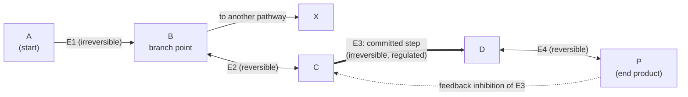

---
aliases:
  - Biochemical Pathway
  - Committed Step
  - Rate-Limiting Step
  - Feedback Inhibition
  - KEGG Map
  - Voie métabolique
tags:
  - type/concept
  - domain/chemistry
  - domain/biology
  - domain/bioinformatics
  - level/L1
  - level/L2
  - level/L3
mastery: 0
prerequisites:
  - "[[Enzyme]]"
  - "[[Metabolism]]"
  - "[[Gibbs Free Energy]]"
  - "[[ATP]]"
related:
  - "[[Glycolysis]]"
  - "[[Gluconeogenesis]]"
  - "[[Citric Acid Cycle]]"
  - "[[Allosteric Regulation]]"
  - "[[Metabolic Regulation]]"
  - "[[Metabolic Network]]"
  - "[[Biological Pathway]]"
  - "[[Over-Representation Analysis]]"
  - "[[Gene Set Enrichment Analysis]]"
  - "[[Functional Annotation]]"
  - "[[Directed Graph]]"
  - "[[Genome-Scale Metabolic Model]]"
projects: []
sources:
  - "[[Biology 2e (OpenStax)]]"
  - "[[Biochemistry (Berg)]]"
  - "[[Lehninger Principles of Biochemistry (Nelson)]]"
  - "[[MIT 5.07SC - Biological Chemistry I]]"
  - "[[KEGG]]"
  - "[[ExplorEnz]]"
  - "[[Beadle 1941 - Genetic Control of Biochemical Reactions in Neurospora]]"
  - "[[Orth 2010 - What Is Flux Balance Analysis]]"
---

# Metabolic Pathway

> [!abstract]
> A metabolic pathway is an assembly line of enzymes: each one changes the molecule a little and hands it to the next. A few steps are one-way and act as the line's valves; the first one-way step that commits material to the final product is where the cell usually controls the flow.

## Definition

A **metabolic pathway** is a series of consecutive enzyme-catalysed reactions in which the product of one reaction is the substrate of the next, converting a starting molecule into a final product through defined **intermediates**.[^os6][^berg] Pathways can be linear, branched or cyclic (the [[Citric Acid Cycle]]).[^lehninger] Within a pathway, the **committed step** is the first irreversible reaction unique to that pathway, and it is usually a **regulated step**.[^berg]

## Why it matters

- **KEGG maps are pathway diagrams wired to genomes.** Each enzyme box of a reference map is linked to the genes encoding it in every sequenced organism; organism-specific maps colour the boxes for which a gene was found.[^kegg] Reading these maps is a basic skill of genome and omics interpretation.
- **Pathway enrichment.** A list of differentially expressed genes or changed metabolites is summarized by asking which pathways it hits more than chance would predict ([[Over-Representation Analysis]], [[Gene Set Enrichment Analysis]]).
- **Genome annotation and its holes.** Metabolic reconstruction checks whether each step of a pathway has an annotated enzyme ([[Enzyme]] EC numbers);[^kegg] missing steps point to annotation errors or to unknown enzymes ([[Functional Annotation]]).
- **Genetics.** Beadle and Tatum showed that single mutations block single steps of biosynthetic pathways,[^beadle] the logic behind genetic screens that order a pathway (Exercise 3) and behind many inborn errors of metabolism ([[Amino Acid Metabolism]]).

## Core (L1)

### An assembly line of enzymes



Each arrow is one reaction catalysed by one enzyme; each node is an intermediate (a toy pathway, used again in the code below). The overall reaction is the sum of the steps, and the overall free-energy change is the sum of the steps' $\Delta G$, which must be negative for net flow ([[Gibbs Free Energy]]).[^berg]

### Reversible and irreversible steps

Most steps of a pathway operate close to equilibrium ($\Delta G \approx 0$ in the cell) and can run in either direction depending on concentrations. A few steps are far from equilibrium (large negative $\Delta G$): they are effectively irreversible, set the direction of the whole pathway, and are where flux is controlled.[^berg][^lehninger] In [[Glycolysis]], the three irreversible steps are those of hexokinase, phosphofructokinase and pyruvate kinase; [[Gluconeogenesis]] bypasses exactly these three with different enzymes.[^berg]

### The committed step

An irreversible step is not enough: its product must have no other fate. Glucose 6-phosphate, made by hexokinase, can also enter glycogen synthesis or the [[Pentose Phosphate Pathway]], so hexokinase does not commit glucose to glycolysis. Fructose 1,6-bisphosphate, made by **phosphofructokinase**, has no other use: phosphofructokinase catalyses the committed step of glycolysis and is its main control point.[^berg]

### Feedback inhibition

The end product of a pathway often inhibits the enzyme of an early, usually committed, step: when the product accumulates, its own synthesis slows.[^os6] Classic case: CTP, end product of pyrimidine synthesis, allosterically inhibits aspartate transcarbamoylase, which catalyses the committed step of that pathway ([[Allosteric Regulation]]).[^berg] Controlling the committed step avoids both wasting the starting material and accumulating intermediates.

### Reading a KEGG map

Pathway map identifiers combine a prefix and five digits: `map00010` is the manually drawn **reference** map of glycolysis and gluconeogenesis; `hsa00010` (human) and `eco00010` (*E. coli*) are **organism-specific** versions generated by computer from the reference map and each genome's annotated genes.[^kegg]

| Element | Meaning[^kegg] |
|---|---|
| Box (EC number, gene or KO name) | enzyme catalysing a reaction ([[Enzyme]]) |
| Small circle | compound (metabolite) |
| Arrow between circles | reaction, oriented from substrate to product |
| Rounded box with a map name | link to a neighbouring pathway map |
| Green box (organism map) | a gene for this enzyme was found in the organism's genome |
| White box (organism map) | no gene annotated for this function in that genome |

A reference map is a union over all organisms: a box drawn on `map00010` says the reaction exists somewhere, not that your organism performs it.[^kegg]

## Deeper (L2)

**Thermodynamic profile of a pathway.** Plotting cumulative $\Delta G$ along a pathway gives a staircase: long flat stretches of near-equilibrium steps and a few big drops at the irreversible ones. The drops act as valves: they fix the direction of flow and are the natural targets of regulation, and committed steps are typically controlled by allosteric effectors, covalent modification or the amount of enzyme.[^berg][^lehninger] How strongly each enzyme controls flux is a quantitative question treated in [[Metabolic Regulation]].

**Opposing pathways.** A synthesis pathway and its degradation counterpart share the near-equilibrium steps but use different enzymes for the irreversible ones; if both ran at once they would form a futile cycle that only hydrolyzes ATP, so the cell regulates the two sets of bypass enzymes reciprocally.[^berg][^507]

**Branch points.** Intermediates such as glucose 6-phosphate, pyruvate and acetyl-CoA sit at branch points where several pathways meet; the distribution of flux among branches depends on the regulated enzymes on each branch.[^berg][^lehninger]

**Pathway order from mutants.** If mutants each block one step,[^beadle] a mutant blocked at step $j$ grows when given any intermediate made after step $j$ but not before. Comparing which intermediates rescue which mutants orders both the intermediates and the blocked steps (Exercise 3).

## Advanced (L3)

- **A pathway is a subgraph.** Metabolism as a whole is a network; a pathway is a human-defined subgraph of it, and different databases draw its boundaries differently ([[Biological Pathway]], [[Metabolic Network]]). The natural graph is **bipartite** (compounds and reactions as two kinds of nodes, [[Bipartite Graph]]); for path finding, "currency" compounds such as ATP, NAD⁺ or water, which take part in hundreds of reactions, must be set aside or every compound looks two steps from every other.
- **Stoichiometry and steady state.** In a model, a pathway is a column vector combination of reactions; at steady state its intermediates are balanced, $Sv = 0$ ([[Stoichiometric Matrix]], [[Genome-Scale Metabolic Model]]).[^orth]
- **Pathway completeness and holes.** Scoring how many steps of each reference pathway have an annotated enzyme in a genome is the core of metabolic reconstruction.[^kegg] A hole is a hypothesis: missed gene, unrelated enzyme with the same EC number, or genuine absence ([[Enzyme#Advanced (L3)]], Exercise 5).
- **Enrichment statistics.** Over-representation tests treat a pathway as a gene set, which ignores order, direction and committed steps; topology-aware methods weight genes by their position in the pathway graph. Either way the result depends on the pathway definitions chosen ([[Over-Representation Analysis]], Exercise 6).
- **Programmatic access.** KEGG content can be retrieved by scripts, but terms of use for automated download differ from web browsing: read the licence before building it into a pipeline ([[Programmatic Database Access]]).[^kegg]

## Mathematical representation

**Pathway as a path.** Let $G = (V, E)$ be a [[Directed Graph]] whose vertices are metabolites and whose edges $e = (u \to w)$ are reactions labelled with an enzyme and a free-energy change $\Delta G_e$. A pathway from $m_0$ to $m_k$ is a path $m_0 \to m_1 \to \dots \to m_k$, and

$$\Delta G_{\text{path}} = \sum_{i=1}^{k} \Delta G_{(m_{i-1} \to m_i)} < 0$$

is required for net flux. With a threshold $\theta < 0$ (a modeling choice), step $i$ is **irreversible** if $\Delta G_i < \theta$. Writing $d^+(m)$ for the number of reactions consuming $m$, step $i$ is the **committed step** if it is the first irreversible step such that $d^+(m_j) = 1$ for every intermediate $m_j$, $i \le j < k$: after it, the material has nowhere else to go.

**Over-representation.** With $N$ genes in total, $K$ of them in the pathway, and a list of $n$ genes containing $k$ pathway genes, the number of hits under random sampling is hypergeometric:

$$P(X \ge k) = \sum_{i=k}^{\min(n, K)} \frac{\binom{K}{i}\binom{N-K}{n-i}}{\binom{N}{n}}, \qquad \mathbb{E}[X] = \frac{nK}{N}.$$

## Computational representation

A pathway is an adjacency list of reactions; a breadth-first search ([[Graph Traversal]]) recovers the chain, and the definitions above become two short functions. The pathway is the invented one of the diagram, with invented $\Delta G$ values.

```python
from collections import deque, defaultdict

# toy pathway (invented): (substrate, product, enzyme, dG in kJ/mol under cellular conditions)
STEPS = [("A", "B", "E1", -20.0), ("B", "C", "E2", -1.0), ("B", "X", "F1", -5.0),
         ("C", "D", "E3", -25.0), ("D", "P", "E4", -2.0)]
IRREVERSIBLE = -10.0   # toy threshold: steps with dG below it are treated as irreversible

OUT = defaultdict(list)
for step in STEPS:
    OUT[step[0]].append(step)


def find_path(start: str, end: str) -> list:
    """Breadth-first search for a chain of steps from start to end."""
    queue, seen = deque([(start, [])]), {start}
    while queue:
        node, path = queue.popleft()
        if node == end:
            return path
        for step in OUT[node]:
            if step[1] not in seen:
                seen.add(step[1])
                queue.append((step[1], path + [step]))
    return []


def committed_step(path: list):
    """First irreversible step after which no intermediate of the path has another consumer."""
    for i, (s, p, enzyme, dg) in enumerate(path):
        downstream = [step[1] for step in path[i:-1]]     # intermediates after this step
        if dg < IRREVERSIBLE and all(len(OUT[m]) == 1 for m in downstream):
            return enzyme
    return None


path = find_path("A", "P")
print(" -> ".join([path[0][0]] + [p for _, p, _, _ in path]))
print("net dG:", sum(dg for *_, dg in path), "kJ/mol")
print("irreversible:", [e for _, _, e, dg in path if dg < IRREVERSIBLE])
print("committed step:", committed_step(path))
```

```text
A -> B -> C -> D -> P
net dG: -48.0 kJ/mol
irreversible: ['E1', 'E3']
committed step: E3
```

E1 is irreversible but not committed, because its product B also feeds X: the same reasoning that makes phosphofructokinase, not hexokinase, the committed step of glycolysis.

## Worked example

> [!example] Reading the top of a KEGG glycolysis map
> Open `map00010` (reference) and `hsa00010` (human).[^kegg]
> 1. **Find the entry.** Locate the circle for D-glucose and follow the arrow to glucose 6-phosphate. The box on that arrow carries EC 2.7.1.1 (hexokinase) on the reference map, and also EC 2.7.1.2 (glucokinase), an alternative enzyme for the same reaction.[^explorenz]
> 2. **Check the organism.** On `hsa00010` the box is green: human genes are annotated for this function, and clicking the box lists them.
> 3. **Spot the branch.** Glucose 6-phosphate also has arrows leading to other maps, drawn as rounded boxes (for example the pentose phosphate pathway): it is a branch point, so this step is not committed.[^berg]
> 4. **Find the committed step.** Follow fructose 6-phosphate to fructose 1,6-bisphosphate: EC 2.7.1.11, 6-phosphofructokinase, the committed and main regulated step of glycolysis.[^berg][^explorenz] On the same map, the reverse arrow with EC 3.1.3.11 (fructose-bisphosphatase) is the gluconeogenic bypass: map00010 draws both pathways together.
> 5. **Conclude.** The map shows which reactions and enzymes exist; it does not show which direction runs, how fast, or how it is regulated. Those come from biochemistry (this note) and from data.

## Common misconceptions

> [!warning] "The rate-limiting step is simply the slowest enzyme"
> Control lies mostly at the irreversible, far-from-equilibrium steps, and it can be shared among several enzymes; a slow but near-equilibrium enzyme does not control flux the same way.[^berg][^lehninger]

> [!warning] "The first irreversible step is the committed step"
> Only if its product has no other fate. Hexokinase is irreversible, but glucose 6-phosphate is a branch point; phosphofructokinase is the committed step of glycolysis.[^berg]

> [!warning] "A pathway on a KEGG map runs in my organism"
> A reference map is drawn across all organisms. Only the organism-specific map shows which enzymes are annotated, and even a green box means a gene is predicted, not that the enzyme is expressed or active.[^kegg]

> [!warning] "Gluconeogenesis is glycolysis run backward"
> They share the reversible steps, but the three irreversible steps of glycolysis are bypassed by different enzymes ([[Gluconeogenesis]]).[^berg]

## Exercises

> [!question] Exercise 1 (L1)
> In the toy pathway of the diagram, which steps are irreversible, which is the committed step, and which enzyme would you expect the end product P to inhibit? Explain why inhibiting E1 instead would be a poor design.

> [!success]- Solution
> Irreversible: E1 and E3. Committed: E3, the first irreversible step whose product (D) has no other fate. P should inhibit E3. Inhibiting E1 would also starve the branch toward X, which may be needed when P is abundant: regulation at the committed step affects only the pathway that makes P.

> [!question] Exercise 2 (L1)
> What is the difference between `map00010`, `hsa00010` and `eco00010`? On `eco00010`, what does a white box mean, and what does it not mean?

> [!success]- Solution
> `map00010` is the manually drawn reference map of glycolysis and gluconeogenesis; the two others are computer-generated versions for human and *E. coli*.[^kegg] A white box means no gene in the *E. coli* annotation is assigned to that function. It does not prove the reaction is absent: the gene may be unannotated, or another enzyme may catalyse it.

> [!question] Exercise 3 (L2)
> Three mutants (m1, m2, m3) cannot make compound P. Each is tested on medium supplemented with one intermediate (+ = growth). m1: grows on C and P only. m2: grows on A, C and P. m3: grows on P only. The intermediates are A, C and P. Order the intermediates and place each block.

> [!success]- Solution
> A mutant grows on intermediates **after** its block. m3 grows only on P: blocked at the last step, C → P. m1 grows on C and P but not A: blocked between A and C. m2 grows on A, C and P: blocked before A. Order: (precursor) → A → C → P, with m2 before A, m1 at A → C, m3 at C → P. This is the logic of Beadle and Tatum's mutant analysis, where each mutation blocked one step.[^beadle]

> [!question] Exercise 4 (L2)
> A three-step pathway has $\Delta G^{\circ\prime}$ values +8, −3 and −20 kJ/mol. Can it run forward under standard conditions? Which step would you predict to be regulated, and why can the first step still run forward in the cell?

> [!success]- Solution
> Sum: $8 - 3 - 20 = -15$ kJ/mol: yes. The third step, strongly negative, is the candidate valve. The first step is unfavorable under standard conditions but runs forward in vivo if the downstream steps keep its product scarce: $\Delta G = \Delta G^{\circ\prime} + RT \ln Q$ becomes negative when $Q$ is small enough (at 37 °C, $Q$ below $e^{-8/2.58} \approx 0.045$).

> [!question] Exercise 5 (L3, Python)
> Using the glycolysis EC list below (two alternative EC numbers for hexokinase and for phosphoglycerate mutase)[^explorenz] and two invented genomes, compute each genome's pathway completeness and list its holes.
> ```python
> GLYCOLYSIS = [   # (step, EC numbers that can catalyse it)
>     ("hexokinase", {"2.7.1.1", "2.7.1.2"}),
>     ("glucose-6-phosphate isomerase", {"5.3.1.9"}),
>     ("6-phosphofructokinase", {"2.7.1.11"}),
>     ("fructose-bisphosphate aldolase", {"4.1.2.13"}),
>     ("triose-phosphate isomerase", {"5.3.1.1"}),
>     ("glyceraldehyde-3-phosphate dehydrogenase", {"1.2.1.12"}),
>     ("phosphoglycerate kinase", {"2.7.2.3"}),
>     ("phosphoglycerate mutase", {"5.4.2.11", "5.4.2.12"}),
>     ("enolase", {"4.2.1.11"}),
>     ("pyruvate kinase", {"2.7.1.40"}),
> ]
> genome_1 = {"2.7.1.2", "5.3.1.9", "2.7.1.11", "4.1.2.13", "5.3.1.1", "1.2.1.12",
>             "2.7.2.3", "5.4.2.12", "4.2.1.11", "2.7.1.40", "3.4.21.4"}        # invented
> genome_2 = {"2.7.1.1", "5.3.1.9", "4.1.2.13", "5.3.1.1", "1.2.1.12",
>             "2.7.2.3", "4.2.1.11", "2.7.1.40"}                                 # invented
> ```

> [!success]- Solution
> ```python
> def coverage(pathway: list, genome_ecs: set) -> tuple:
>     missing = [step for step, ecs in pathway if not ecs & genome_ecs]
>     return 1 - len(missing) / len(pathway), missing
>
>
> for name, g in [("genome_1", genome_1), ("genome_2", genome_2)]:
>     frac, missing = coverage(GLYCOLYSIS, g)
>     print(name, round(frac, 2), missing)
> ```
> ```text
> genome_1 1.0 []
> genome_2 0.8 ['6-phosphofructokinase', 'phosphoglycerate mutase']
> ```
> genome_1 is complete only because steps are matched by **sets** of EC numbers: comparing against a single number per step would have reported false holes for its glucokinase and its cofactor-independent mutase. genome_2 lacks the committed step: either glycolysis is incomplete in this organism, or its phosphofructokinase is unannotated or of an unrelated kind. Each hole is a question for the [[Enzyme#Exercises|Enzyme Exercise 6]] checklist.

> [!question] Exercise 6 (L3, Python)
> An experiment yields 400 differentially expressed genes out of 20,000. A pathway has 60 genes, 8 of which are in the list. Compute the expected number of hits and the over-representation p-value; then the p-value for 3 hits. (Numbers invented.)

> [!success]- Solution
> ```python
> from math import comb
>
>
> def overrep_pvalue(N: int, K: int, n: int, k: int) -> float:
>     """P(X >= k) for X ~ Hypergeometric(N genes, K in pathway, n in the list)."""
>     return sum(comb(K, i) * comb(N - K, n - i) for i in range(k, min(K, n) + 1)) / comb(N, n)
>
>
> N, K, n, k = 20000, 60, 400, 8
> print("expected:", n * K / N)
> print(f"p = {overrep_pvalue(N, K, n, k):.2e}")
> print(f"p (k=3) = {overrep_pvalue(N, K, n, 3):.3f}")
> ```
> ```text
> expected: 1.2
> p = 2.46e-05
> p (k=3) = 0.118
> ```
> 8 hits against 1.2 expected is strong evidence of enrichment; 3 hits is compatible with chance. With hundreds of pathways tested, p-values must be corrected for multiple testing ([[False Discovery Rate]]), and the test ignores everything this note is about: which steps are committed and regulated.

## Mastery checklist

- [ ] 1 Recognized: I can define a metabolic pathway, an intermediate, an irreversible step and the committed step.
- [ ] 2 Understood: I can explain why control sits at irreversible steps, why the committed step is the usual feedback target, and how opposing pathways avoid futile cycles.
- [ ] 3 Practiced: I can identify committed steps from a pathway with $\Delta G$ values, order a pathway from mutant data, and compute pathway completeness and an over-representation p-value in code.
- [ ] 4 Applied: I read a real KEGG reference map and its organism-specific version for a genome I work with, and interpreted its green and white boxes.
- [ ] 5 Explained: I can teach what pathway maps show and do not show (direction, flux, regulation, presence of a gene versus activity), and the limits of gene-set enrichment.

## References

[^os6]: [[Biology 2e (OpenStax)]], ch. 6 "Metabolism" (metabolic pathways as series of reactions; feedback inhibition by end products).
[^berg]: [[Biochemistry (Berg)]], 5th ed. (2002), treatment of metabolism basic concepts (pathways, additivity of free-energy changes, control at irreversible steps), glycolysis and gluconeogenesis (irreversible steps of glycolysis, phosphofructokinase as committed step, bypass enzymes, reciprocal regulation and futile cycles, glucose 6-phosphate as a branch point), and allosteric regulation (aspartate transcarbamoylase inhibited by CTP).
[^lehninger]: [[Lehninger Principles of Biochemistry (Nelson)]], 8th ed. (2021), treatment of metabolic pathways and their regulation (linear, branched and cyclic pathways, near-equilibrium versus far-from-equilibrium reactions, control at branch points) (chapter number not verified).
[^507]: [[MIT 5.07SC - Biological Chemistry I]], modules on carbohydrate metabolism (glycolysis and gluconeogenesis) and on regulation.
[^kegg]: [[KEGG]], pathway maps: map identifiers (prefix "map" for manually drawn reference maps, organism codes for computer-generated maps), organism-specific maps made by a set operation between reference maps and annotated genes, green boxes for genes present, map elements; metabolic reconstruction; terms of use for automated access.
[^explorenz]: [[ExplorEnz]], IUBMB Enzyme List entries cited here (hexokinase, glucokinase, 6-phosphofructokinase, fructose-bisphosphatase, and the two phosphoglycerate mutases, EC 5.4.2.11 and 5.4.2.12).
[^beadle]: [[Beadle 1941 - Genetic Control of Biochemical Reactions in Neurospora]], *PNAS* 27(11):499-506.
[^orth]: [[Orth 2010 - What Is Flux Balance Analysis]], *Nature Biotechnology* (steady-state mass balance).
