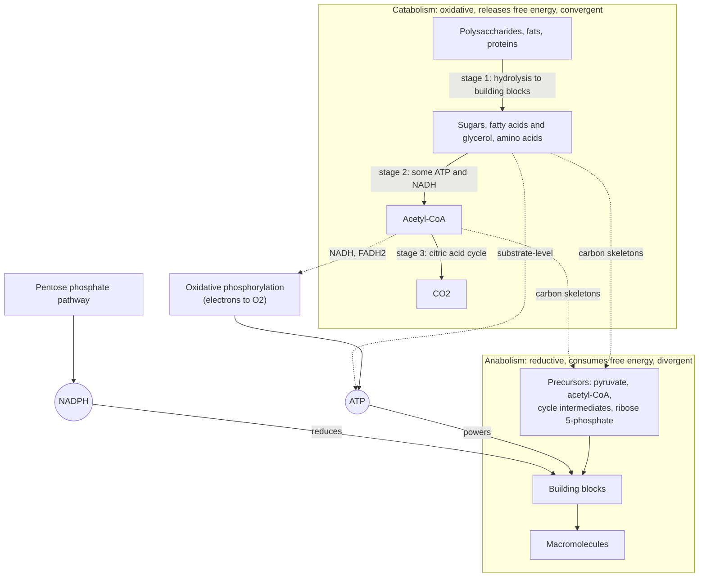

---
aliases:
  - Cellular Metabolism
  - Catabolism
  - Anabolism
  - Intermediary Metabolism
  - Métabolisme
tags:
  - type/concept
  - domain/chemistry
  - domain/biology
  - domain/bioinformatics
  - level/L1
  - level/L2
  - level/L3
mastery: 0
prerequisites:
  - "[[Enzyme]]"
  - "[[ATP]]"
  - "[[Redox Reaction]]"
  - "[[Gibbs Free Energy]]"
  - "[[Carbohydrate]]"
  - "[[Lipid]]"
related:
  - "[[Metabolic Pathway]]"
  - "[[Mitochondrion]]"
  - "[[Glycolysis]]"
  - "[[Citric Acid Cycle]]"
  - "[[Oxidative Phosphorylation]]"
  - "[[Pentose Phosphate Pathway]]"
  - "[[Fatty Acid Metabolism]]"
  - "[[Metabolic Regulation]]"
  - "[[Metabolic Network]]"
  - "[[Stoichiometric Matrix]]"
  - "[[Flux Balance Analysis]]"
  - "[[Metabolomics]]"
projects: []
sources:
  - "[[Biology 2e (OpenStax)]]"
  - "[[Biochemistry (Berg)]]"
  - "[[Lehninger Principles of Biochemistry (Nelson)]]"
  - "[[MIT 5.07SC - Biological Chemistry I]]"
  - "[[Chemistry 2e (OpenStax)]]"
  - "[[KEGG]]"
  - "[[Orth 2010 - What Is Flux Balance Analysis]]"
  - "[[Patti 2012 - Metabolomics - The Apogee of the Omics Trilogy]]"
---

# Metabolism

> [!abstract]
> Metabolism is the full set of chemical reactions in a cell. Catabolism breaks food molecules down and captures their energy as ATP and their electrons on carriers (NADH, NADPH); anabolism spends that ATP and those electrons to build the cell's own molecules from small carbon skeletons.

## Definition

**Metabolism** is the totality of the chemical reactions of a cell or organism, organized into enzyme-catalysed [[Metabolic Pathway|pathways]].[^os6][^berg] It has two complementary halves:[^os6][^berg][^lehninger]

- **Catabolism**: degradative pathways that break down nutrients and cell constituents into smaller molecules; they are mostly **oxidations** and **release** free energy, captured as [[ATP]] and as reduced electron carriers (NADH, FADH₂, NADPH).
- **Anabolism** (biosynthesis): pathways that build complex molecules from simple precursors; they **require** free energy (ATP) and, being mostly **reductions**, electrons (NADPH).

## Why it matters

- **Pathway databases are maps of metabolism.** [[KEGG]] draws metabolism as reference maps whose enzymes link to the genes of each sequenced organism, so a genome annotation becomes a metabolic reconstruction.[^kegg] Reading such maps requires knowing what flows through them: carbon, energy and electrons.
- **Models are bookkeeping.** In constraint-based models every metabolite is balanced at steady state ($Sv = 0$), including ATP and the NAD⁺/NADH pair;[^orth] a model that cannot regenerate NAD⁺ cannot run glycolysis, exactly as a cell cannot ([[Stoichiometric Matrix]], [[Flux Balance Analysis]], [[Genome-Scale Metabolic Model]]).
- **Metabolites are a data layer.** Metabolomics measures the small molecules that metabolism transforms, the most direct readout of what cells are doing ([[Metabolomics]]).[^patti]
- **Disease and microbes.** Inborn errors such as phenylketonuria are defects of these pathways ([[Amino Acid Metabolism]]); in [[Metagenomics]], a community's genes are read as a catalogue of metabolic capacities ([[Microbial Metabolism]]).

## Core (L1)

### Catabolism and anabolism

| | Catabolism[^berg][^lehninger] | Anabolism[^os6] |
|---|---|---|
| Direction | large → small molecules | small → large molecules |
| Free energy | released (captured as ATP) | consumed (ATP spent) |
| Redox | oxidations: electrons go to NAD⁺ and FAD | reductions: electrons come from NADPH |
| Shape | **convergent**: many fuels → few intermediates (acetyl-CoA) | **divergent**: few precursors → many products |
| Examples | [[Glycolysis]], [[Citric Acid Cycle]], β-oxidation | gluconeogenesis, fatty acid, amino acid and nucleotide synthesis |

The two halves are linked by shared intermediates and by the carriers ATP and NAD(P)H.



The three stages of catabolism follow Hans Krebs's description: large molecules are hydrolyzed to building blocks (no useful energy), building blocks are degraded to a few simple units, chiefly acetyl-CoA (a little ATP), and acetyl units are oxidized to CO₂ in the citric acid cycle, whose electrons drive most ATP synthesis by oxidative phosphorylation in the [[Mitochondrion]].[^berg]

### Follow three currencies

1. **Carbon.** Carbon skeletons are rearranged, cut and joined; fully oxidized carbon leaves as CO₂. The same intermediates (pyruvate, acetyl-CoA, citric acid cycle intermediates) feed both breakdown and biosynthesis, which is why the citric acid cycle is called **amphibolic**.[^lehninger][^berg]
2. **Energy.** Free energy released by catabolism is captured mainly as ATP and spent by anabolism, transport and movement through coupled reactions ([[ATP]]).
3. **Electrons.** Oxidizing a fuel removes electrons (as hydride ions plus protons). Catabolism loads them onto **NAD⁺ → NADH** and **FAD → FADH₂**, which deliver them to O₂ through the electron transport chain to make ATP. Biosynthesis takes electrons from **NADPH**, produced mainly by the [[Pentose Phosphate Pathway]].[^berg][^os-resp]

**Activated carriers** of metabolism:[^berg]

| Carrier | Carries | Main use |
|---|---|---|
| ATP | phosphoryl group | energy currency |
| NADH, FADH₂ | electrons | oxidative phosphorylation (ATP production) |
| NADPH | electrons | reductive biosynthesis (fatty acids, cholesterol, deoxyribonucleotides) and defense against oxidants |
| Coenzyme A (acetyl-CoA) | acyl groups (two-carbon acetyl units) | feeding the citric acid cycle and fatty acid synthesis |

NADH and NADPH carry electrons with the same chemistry; NADPH has one extra phosphate that lets enzymes tell them apart, so the cell can keep two separate pools: NAD⁺ mostly oxidized (ready to accept electrons in catabolism) and NADPH mostly reduced (ready to donate them in biosynthesis).[^berg][^lehninger]

## Deeper (L2)

**Synthesis is not degradation run backward.** Paired anabolic and catabolic pathways differ in at least one step, often several, and are often in different compartments (fatty acid oxidation in mitochondria, synthesis in the cytosol). Each direction can then be thermodynamically favorable and regulated independently ([[Gluconeogenesis]], [[Fatty Acid Metabolism]]).[^berg][^lehninger]

**Compartments.** In eukaryotes, glycolysis runs in the cytosol, the citric acid cycle in the mitochondrial matrix, and the electron transport chain in the inner mitochondrial membrane ([[Mitochondrion#Core (L1)]]).[^os-resp]

**Without oxygen.** NADH can transfer its electrons to O₂ only through respiration. Without oxygen, cells regenerate NAD⁺ by reducing pyruvate to lactate (muscle, many bacteria) or to ethanol and CO₂ (yeast): **fermentation**. Glycolysis then continues with its small ATP yield, because its NADH is recycled.[^os-resp][^berg] The toy model of the Computational representation shows why this step is compulsory.

**Regulation.** Fluxes are controlled by the amount of each enzyme (gene expression), its catalytic activity (allosteric effectors, covalent modification) and the accessibility of substrates (compartments, transport); [[Metabolic Regulation]] integrates these across tissues and states.[^berg][^507]

## Advanced (L3)

- **Metabolism as linear algebra.** A network of $n$ reactions among $m$ metabolites is a stoichiometric matrix $S$; at steady state, production equals consumption for every compound, $Sv = 0$, and flux balance analysis picks one flux vector $v$ by optimizing an objective within bounds.[^orth] Conservation of carbon, of electrons (NAD⁺ + NADH constant) and of the adenine nucleotide pool appear as structure in $S$.
- **Oxidation state predicts fuel value.** The average oxidation state of carbon ranges from −4 (CH₄) to +4 (CO₂); the more reduced a fuel, the more electrons each carbon gives to O₂. Fatty acids (about −1.75) carry far more electrons per gram than sugars (0), which together with anhydrous storage makes fat the long-term store ([[Lipid]]; Exercise 5).
- **Metabolomics closes the loop.** Measured metabolite levels test what genome-based reconstructions predict; untargeted metabolomics links unexpected metabolites back to pathways ([[Metabolomics]], [[Multi-Omics Integration]]).[^patti]
- **Diversity.** Animal cells pass respiratory electrons to O₂, but some prokaryotes respire anaerobically with inorganic acceptors such as sulfate or nitrate;[^os-resp] a metagenome's catalogue of pathways is a hypothesis about which chemistry its community runs ([[Microbial Metabolism]]).

## Mathematical representation

**Average oxidation state of carbon.** With the usual assignments H = +1, O = −2, N = −3 and the sum of oxidation states equal to the molecule's charge $z$,[^chem2e] a molecule with $n_C, n_H, n_O, n_N$ atoms has

$$\bar{x}_C = \frac{z - n_H + 2n_O + 3n_N}{n_C}.$$

Oxidizing every carbon to CO₂ ($x = +4$), with N kept at −3, releases $e = n_C\,(4 - \bar{x}_C)$ electrons. For glucose, C₆H₁₂O₆: $\bar{x}_C = (0 - 12 + 12)/6 = 0$, so $e = 24$, consistent with $\mathrm{C_6H_{12}O_6 + 6\,O_2 \to 6\,CO_2 + 6\,H_2O}$, since each O₂ accepts 4 electrons.

**Stoichiometric matrix.** For metabolites $i = 1..m$ and reactions $j = 1..n$, $S_{ij}$ is the coefficient of metabolite $i$ in reaction $j$ (negative if consumed, positive if produced). With flux vector $v \in \mathbb{R}^n$ and concentrations $c \in \mathbb{R}^m$,[^orth]

$$\frac{dc}{dt} = S\,v, \qquad \text{steady state: } S\,v = 0.$$

A conserved pool is a vector $\ell$ with $\ell^{\top} S = 0$: for example $\ell_{\mathrm{NAD^+}} = \ell_{\mathrm{NADH}} = 1$ (all other entries 0), because every reaction that consumes one makes the other.

## Computational representation

Two standard-library tools: an oxidation-state calculator for formulas, and a stoichiometric matrix with a steady-state check.

```python
import re


def parse_formula(formula: str) -> dict:
    """'C6H12O6' -> {'C': 6, 'H': 12, 'O': 6} (no parentheses)."""
    counts = {}
    for el, k in re.findall(r"([A-Z][a-z]?)(\d*)", formula):
        counts[el] = counts.get(el, 0) + (int(k) if k else 1)
    return counts


def carbon_oxidation_state(formula: str, charge: int = 0) -> float:
    """Average oxidation state of C, with H = +1, O = -2, N = -3."""
    f = parse_formula(formula)
    return (charge - f.get("H", 0) + 2 * f.get("O", 0) + 3 * f.get("N", 0)) / f["C"]


def electrons_to_co2(formula: str, charge: int = 0) -> float:
    """Electrons released when every carbon is oxidized to CO2 (oxidation state +4)."""
    f = parse_formula(formula)
    return f["C"] * (4 - carbon_oxidation_state(formula, charge))


for name, formula in [("methane", "CH4"), ("palmitic acid", "C16H32O2"), ("ethanol", "C2H6O"),
                      ("glucose", "C6H12O6"), ("pyruvic acid", "C3H4O3"), ("CO2", "CO2")]:
    print(f"{name:14s} {carbon_oxidation_state(formula):+.2f}  {electrons_to_co2(formula):5.1f} e-")
```

```text
methane        -4.00    8.0 e-
palmitic acid  -1.75   92.0 e-
ethanol        -2.00   12.0 e-
glucose        +0.00   24.0 e-
pyruvic acid   +0.67   10.0 e-
CO2            +4.00    0.0 e-
```

The stoichiometric matrix of a toy network (invented and simplified: glycolysis is lumped into one reaction, H⁺ and H₂O are omitted) that turns glucose into lactate without oxygen:

```python
REACTIONS = {
    "uptake":    {"glc": 1},
    "glycolysis": {"glc": -1, "ADP": -2, "Pi": -2, "NAD+": -2, "pyr": 2, "ATP": 2, "NADH": 2},
    "LDH":       {"pyr": -1, "NADH": -1, "lac": 1, "NAD+": 1},
    "ATPase":    {"ATP": -1, "ADP": 1, "Pi": 1},
    "export":    {"lac": -1},
}
METABOLITES = sorted({m for r in REACTIONS.values() for m in r})


def stoichiometric_matrix(reactions: dict) -> list[list[int]]:
    return [[reactions[r].get(m, 0) for r in reactions] for m in METABOLITES]


def net_production(S: list[list[int]], v: list[float]) -> dict:
    """S v: net rate of change of each metabolite for the flux vector v."""
    return {m: sum(s * x for s, x in zip(row, v)) for m, row in zip(METABOLITES, S)}


S = stoichiometric_matrix(REACTIONS)
v = [1, 1, 2, 2, 2]          # fluxes in the order of REACTIONS
print(METABOLITES)
print(net_production(S, v))
```

```text
['ADP', 'ATP', 'NAD+', 'NADH', 'Pi', 'glc', 'lac', 'pyr']
{'ADP': 0, 'ATP': 0, 'NAD+': 0, 'NADH': 0, 'Pi': 0, 'glc': 0, 'lac': 0, 'pyr': 0}
```

Every internal metabolite is balanced: one glucose in, two lactates out, two ATP made and spent, two NADH made and reoxidized. Real models store $S$ as a [[Sparse Matrix]] with thousands of rows and use linear programming to choose $v$.

## Worked example

> [!example] Following one glucose through aerobic oxidation
> Per glucose, from the standard yields of each stage:[^berg][^os-resp]
>
> | Stage (compartment) | Carbon | ATP (or GTP) | Electrons |
> |---|---|---|---|
> | Glycolysis (cytosol) | glucose → 2 pyruvate | 2 (net) | 2 NADH |
> | Pyruvate dehydrogenase (matrix) | 2 pyruvate → 2 acetyl-CoA + **2 CO₂** | 0 | 2 NADH |
> | Citric acid cycle (matrix) | 2 acetyl → **4 CO₂** | 2 | 6 NADH + 2 FADH₂ |
> | **Total** | **6 CO₂** | **4** | **10 NADH + 2 FADH₂** |
>
> 1. **Carbon** balances: 6 carbons in, 6 CO₂ out.
> 2. **Electrons** balance: each NADH and FADH₂ carries 2 electrons, so $12 \times 2 = 24$, exactly the 24 electrons predicted from glucose's oxidation state of 0 (Mathematical representation). They reach O₂ through the electron transport chain: $6\,\mathrm{O_2} \times 4 = 24$.
> 3. **Energy**: only 4 ATP are made directly; most of the ATP comes later, when oxidative phosphorylation converts the energy of those 24 electrons ([[Oxidative Phosphorylation]]).
> 4. **Lesson**: catabolism is first an electron-harvesting machine; ATP synthesis is the payoff of where the electrons go.

## Common misconceptions

> [!warning] "Anabolism is catabolism in reverse"
> Paired pathways share many reversible steps but differ at the irreversible ones, which are bypassed by different enzymes, often in different compartments. Otherwise both directions could not be favorable and could not be regulated separately.[^berg][^lehninger]

> [!warning] "NADH and NADPH are interchangeable"
> They carry electrons the same way, but enzymes distinguish them, and the cell keeps NAD⁺ mostly oxidized and NADPH mostly reduced. NADH feeds ATP production; NADPH feeds biosynthesis.[^berg][^lehninger]

> [!warning] "Fermentation is a way to make more ATP without oxygen"
> Fermentation makes **no** additional ATP: its job is to regenerate NAD⁺ so that glycolysis, with its 2 ATP per glucose, can continue.[^os-resp]

## Exercises

> [!question] Exercise 1 (L1)
> Classify as catabolic or anabolic: (a) glycogen breakdown; (b) protein synthesis; (c) fatty acid synthesis; (d) glycolysis; (e) DNA replication; (f) β-oxidation of fatty acids. For each, say whether it consumes or produces ATP overall.

> [!success]- Solution
> Catabolic, net ATP producers: (a), (d), (f). Anabolic, ATP consumers: (b), (c), (e). Glycogen breakdown releases glucose units for glycolysis; fatty acid synthesis also consumes NADPH; replication consumes nucleoside triphosphates.

> [!question] Exercise 2 (L2)
> Compute the average oxidation state of carbon in ethanol (C₂H₆O), acetic acid (C₂H₄O₂), lactic acid (C₃H₆O₃) and glycerol (C₃H₈O₃). Then show that yeast fermentation, glucose → 2 ethanol + 2 CO₂, involves no net oxidation.

> [!success]- Solution
> Ethanol −2, acetic acid 0, lactic acid 0, glycerol −0.67 (the code's `carbon_oxidation_state` gives the same). Fermentation: glucose's 6 carbons at 0 become 4 carbons at −2 (ethanol) and 2 at +4 (CO₂): $4(-2) + 2(+4) = 0$. Electrons are only moved inside the molecule (some carbons oxidized, others reduced), not given to an external acceptor, which is why so little energy is released compared with respiration.

> [!question] Exercise 3 (L2)
> In the toy network, the lumped glycolysis reaction produces 2 NADH per glucose. The total NAD⁺ + NADH in a cell is constant and small. Explain why, without oxygen, the LDH reaction (pyruvate + NADH → lactate + NAD⁺) is indispensable.

> [!success]- Solution
> NAD⁺ is a carrier, not a fuel: glycolysis consumes it as fast as it makes NADH. With a fixed pool, NAD⁺ would run out after a number of glucose molecules equal to half the pool, and glycolysis would stop. Without O₂, reducing pyruvate to lactate is the way to return NADH to NAD⁺: the electrons taken from glucose end up on lactate.

> [!question] Exercise 4 (L3, Python)
> Remove the LDH reaction from `REACTIONS` and compute $Sv$ for the fluxes uptake = 1, glycolysis = 1, ATPase = 2, export = 0. Which metabolites are unbalanced, and what does this mean for a flux balance model?

> [!success]- Solution
> ```python
> no_ldh = {k: r for k, r in REACTIONS.items() if k != "LDH"}
> S2 = stoichiometric_matrix(no_ldh)
> print({m: x for m, x in net_production(S2, [1, 1, 2, 0]).items() if x != 0})
> ```
> ```text
> {'NAD+': -2, 'NADH': 2, 'pyr': 2}
> ```
> NAD⁺ is depleted, NADH and pyruvate accumulate: no steady state exists with glycolysis running. A flux balance model would force the glycolysis flux to 0 (the only solution of $Sv = 0$ with these reactions), the formal version of Exercise 3. Missing reactions in a reconstruction show up exactly like this, as blocked fluxes.

> [!question] Exercise 5 (L3, Python)
> With `parse_formula` and `electrons_to_co2`, compute the moles of electrons released per gram on complete oxidation of glucose and of palmitic acid (atomic weights C 12.011, H 1.008, O 15.999),[^chem2e] and compare the ratio with the ratio of energy yields of fat and carbohydrate (about 38 and 17 kJ/g, see [[Lipid]]).

> [!success]- Solution
> ```python
> MASS = {"C": 12.011, "H": 1.008, "O": 15.999, "N": 14.007}
> per_gram = {}
> for name, formula in [("glucose", "C6H12O6"), ("palmitic acid", "C16H32O2")]:
>     f = parse_formula(formula)
>     mass = sum(MASS[el] * k for el, k in f.items())
>     per_gram[name] = electrons_to_co2(formula) / mass
>     print(f"{name:14s} {per_gram[name]:.3f} mol e- per g")
> print(round(per_gram["palmitic acid"] / per_gram["glucose"], 2))
> ```
> ```text
> glucose        0.133 mol e- per g
> palmitic acid  0.359 mol e- per g
> 2.69
> ```
> Palmitic acid releases 2.7 times more electrons per gram; the measured energy ratio is $38/17 \approx 2.2$. Same direction and order of magnitude: counting electrons is a good first estimate of fuel value, though the free energy per electron is not exactly the same for every bond.

## Mastery checklist

- [ ] 1 Recognized: I can define metabolism, catabolism and anabolism and name the carriers ATP, NADH, NADPH and acetyl-CoA.
- [ ] 2 Understood: I can follow carbon, energy and electrons through the three stages of catabolism and explain why NADH and NADPH are kept separate.
- [ ] 3 Practiced: I can compute oxidation states and electron counts, balance a pathway's carbon and electrons, and check $Sv = 0$ in code.
- [ ] 4 Applied: I traced a real organism's central metabolism on a KEGG map or in a genome-scale model and checked its ATP and redox balances.
- [ ] 5 Explained: I can teach why synthesis and degradation use different routes, why fermentation exists, and how conservation laws become constraints in metabolic models.

## References

[^os6]: [[Biology 2e (OpenStax)]], ch. 6 "Metabolism" (metabolic pathways; anabolic and catabolic pathways).
[^os-resp]: [[Biology 2e (OpenStax)]], chapter "Cellular Respiration" (glycolysis, oxidation of pyruvate, citric acid cycle and their yields of ATP, NADH and FADH₂; electron transport to O₂ in the inner mitochondrial membrane; fermentation regenerating NAD⁺; anaerobic respiration with other inorganic acceptors in prokaryotes).
[^berg]: [[Biochemistry (Berg)]], 5th ed. (2002), treatment of metabolism basic concepts (catabolism and anabolism, the three stages of catabolism, activated carriers ATP, NADH, FADH₂, NADPH and coenzyme A, NADPH in reductive biosynthesis, distinct pathways for synthesis and degradation, control by enzyme amount, activity and substrate accessibility) and of glycolysis, fermentation, the citric acid cycle and the pentose phosphate pathway.
[^lehninger]: [[Lehninger Principles of Biochemistry (Nelson)]], 8th ed. (2021), treatment of bioenergetics and metabolism (convergent catabolism and divergent anabolism, paired pathways that differ in at least one step, amphibolic intermediates, NAD⁺/NADH and NADPH/NADP⁺ ratios) (chapter number not verified).
[^507]: [[MIT 5.07SC - Biological Chemistry I]], modules on carbohydrate, fatty acid and energy metabolism and on regulation.
[^chem2e]: [[Chemistry 2e (OpenStax)]], oxidation numbers and standard atomic weights.
[^kegg]: [[KEGG]], pathway maps linking enzymes to genes per organism; metabolic reconstruction.
[^orth]: [[Orth 2010 - What Is Flux Balance Analysis]], *Nature Biotechnology* (stoichiometric matrix, steady-state mass balance $Sv = 0$, optimization of an objective).
[^patti]: [[Patti 2012 - Metabolomics - The Apogee of the Omics Trilogy]], *Nature Reviews Molecular Cell Biology* 13:263-269.
