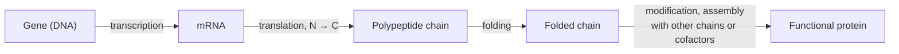

---
aliases:
  - Proteins
  - Polypeptide
  - Protéine
tags:
  - type/concept
  - domain/chemistry
  - domain/biology
  - domain/bioinformatics
  - level/L1
  - level/L2
  - level/L3
mastery: 0
prerequisites:
  - "[[Amino Acid]]"
  - "[[Peptide Bond]]"
  - "[[Central Dogma]]"
  - "[[Translation]]"
related:
  - "[[Protein Structure]]"
  - "[[Protein Folding]]"
  - "[[Enzyme]]"
  - "[[Membrane Protein]]"
  - "[[Protein Domain]]"
  - "[[Post-Translational Modification]]"
  - "[[Proteome]]"
  - "[[Proteomics]]"
  - "[[Gene]]"
  - "[[Alternative Splicing]]"
  - "[[Isoelectric Point]]"
  - "[[Missense Mutation]]"
  - "[[Cell Signaling]]"
  - "[[Transcription Factor]]"
projects:
  - "[[06-mutation-lab]]"
  - "[[bio-core]]"
sources:
  - "[[Biochemistry (Berg)]]"
  - "[[Lehninger Principles of Biochemistry (Nelson)]]"
  - "[[Molecular Biology of the Cell (Alberts)]]"
  - "[[Biology 2e (OpenStax)]]"
  - "[[NCBI BLAST]]"
  - "[[UniProt]]"
  - "[[RCSB Protein Data Bank]]"
  - "[[AlphaFold Protein Structure Database]]"
  - "[[IHGSC 2004 - Finishing the Euchromatic Sequence of the Human Genome]]"
  - "[[Schwanhäusser 2011 - Global Quantification of Mammalian Gene Expression Control]]"
  - "[[Li 2014 - System Wide Analyses Have Underestimated Protein Abundances]]"
---

# Protein

> [!abstract]
> A protein is a chain of amino acids that folds into a precise 3D shape; that shape lets it do almost every job in the cell: speed up reactions, build structures, carry molecules, pass on signals and switch genes on and off.

## Definition

A **protein** is a macromolecule made of one or more **polypeptide chains**, each a linear sequence of [[Amino Acid|amino acids]] joined by [[Peptide Bond|peptide bonds]] and folded into a specific three-dimensional structure on which its function depends.[^berg][^alberts][^os3] The amino acid sequence is encoded by a gene and fixed during [[Translation]]; the structure, and therefore the function, follow from that sequence.[^berg]

## Why it matters

- **Most annotated genes are protein-coding.** The finished human genome was estimated to contain 20,000 to 25,000 protein-coding genes,[^ihgsc] and annotating a genome largely means predicting their proteins and functions ([[Gene]], [[Gene Annotation]]).
- **Protein databases.** [[UniProt]] describes proteins as biological objects (sequence, function, cross-references); its Swiss-Prot section is manually reviewed, its TrEMBL section computationally annotated, a distinction to check before trusting a function.[^uniprot]
- **Structures.** The PDB archives experimentally determined structures, and the AlphaFold Protein Structure Database provides predicted models for over 214 million sequences ([[Protein Structure]]).[^pdb][^afdb]
- **Variants act through proteins.** A [[Missense Mutation]] matters through what it does to a protein ([[06-mutation-lab]]).
- **Typed objects.** In [[bio-core]], a protein is a value object built from a sequence, with derived properties such as length and mass.

## Core (L1)

**From gene to working protein.**



**Polypeptide or protein.** Most natural polypeptide chains contain between 50 and 2000 residues; with an average residue mass of about 110 g/mol, their masses lie roughly between 5,500 and 220,000 g/mol (5.5 to 220 kDa).[^berg] Short chains are called **peptides**. A protein may be one chain or several (**subunits**): hemoglobin has four, two α chains of 141 residues and two β chains of 146.[^berg]

**Sequence determines structure.** A denatured (unfolded) protein can refold spontaneously into its active form: the information for the 3D structure is in the sequence (Anfinsen's experiments on ribonuclease; [[Protein Folding]]).[^berg]

**What proteins do.** Almost every cellular process uses proteins.[^os3][^alberts]

| Function | What the protein does | Examples |
|---|---|---|
| **Catalysis** | speeds up a specific reaction ([[Enzyme]]) | digestive enzymes: amylase, pepsin, trypsin[^os3] |
| **Structure** | gives cells and tissues shape and strength | actin, tubulin, keratin[^os3] |
| **Transport** | carries molecules in the blood or across membranes | hemoglobin (O₂), albumin;[^os3] membrane transporters and channels ([[Membrane Protein]])[^alberts] |
| **Signaling** | carries or receives messages between cells | hormones such as insulin;[^os3] receptors on the cell surface ([[Cell Signaling]])[^alberts] |
| **Regulation** | controls when genes are expressed and proteins act | [[Transcription Factor\|transcription factors]][^alberts] |
| **Defense** | recognizes foreign molecules | antibodies (immunoglobulins)[^os3] |
| **Movement** | produces force and motion | actin and myosin in muscle[^os3] |
| **Storage** | stores amino acids or other nutrients | egg-white albumin, seed storage proteins[^os3] |

**Shapes follow function.** **Fibrous** proteins (collagen, keratin) are long, often insoluble filaments with structural roles; **globular** proteins (most enzymes and regulatory proteins) are compact and soluble; **membrane proteins** sit in lipid bilayers.[^lehninger]

## Deeper (L2)

**Function is binding.** What a protein does depends on how it binds other molecules: a substrate, a ligand, a DNA sequence, another protein. Binding is specific because a folded surface presents a precise arrangement of side chains complementary to its partner ([[Ligand Binding]]).[^alberts]

**More than amino acids.** Many proteins carry non-amino-acid parts, such as the heme group of hemoglobin, called prosthetic groups; such proteins are **conjugated** proteins.[^lehninger] Many are also modified after translation (phosphorylated, glycosylated, cleaved), which changes their activity, location or lifetime ([[Post-Translational Modification]]).[^alberts]

**Modules.** Larger proteins are often built from **domains**, compact units that fold independently and recur in different proteins ([[Protein Domain]], [[Protein Structure]]).[^berg]

**One gene, several proteins.** Alternative splicing joins different exons of one gene into different mRNAs, hence different proteins ([[Alternative Splicing]]).[^alberts] Together with modifications, this makes the set of proteins of a cell, the [[Proteome]], larger and more varied than its gene list.

**Charge and mass are sequence properties.** A protein's net charge at a given pH and its [[Isoelectric Point]] follow from its ionizable groups ([[Amino Acid#Mathematical representation]]); its mass from its residues ([[Monoisotopic Mass]]). Both are used to separate proteins in the laboratory ([[Protein Purification]]).[^berg]

## Advanced (L3)

**mRNA is not protein.** Measuring both in the same cells, Schwanhäusser and colleagues found that mRNA levels explained only part of the variation of protein levels across genes (coefficient of determination about 0.41), and that protein abundance was predominantly controlled at the level of translation.[^schwan] Their absolute protein numbers were later corrected (a scaling error, corrigendum 2013), and a reanalysis of the same data argued that measurement error pulls the correlation down, with mRNA levels explaining at least 56 % of the differences in protein abundance, possibly about 81 %.[^schwan][^li2014] The robust lesson for data analysis: [[RNA Sequencing|RNA-seq]] is not [[Proteomics]], and the gap between the two is partly biology, partly noise.

**What is known versus predicted.** For most proteins in databases, nobody has measured the function or the structure: sequences come from genome annotation, functions from homology, structures from prediction. UniProt flags unreviewed entries as automatic annotation, and an AlphaFold model is a prediction whose low-confidence regions must be read as unknown.[^uniprot][^afdb] A protein note in a pipeline should always carry its evidence level.

**A protein is a population.** In a cell, one "protein" is many molecules, in different modification and binding states, continuously made and degraded (each with its own half-life).[^schwan] When the copy number is small, chance decides how many molecules a given cell has (Exercise 5, [[Stochastic Gene Expression]]).

## Mathematical representation

- **A protein species** is a multiset of chains $P = \{(s_k, n_k)\}_k$, with $s_k \in \mathcal{A}^{L_k}$ a sequence of length $L_k$ over the amino acid alphabet $\mathcal{A}$ and $n_k$ its copy number in the assembly (hemoglobin: $\{(\alpha, 2), (\beta, 2)\}$).
- **Mass estimate.** With $\bar r \approx 110$ Da the average residue mass,[^berg] $M(s) \approx \bar r L + 18$ Da and $M(P) \approx \sum_k n_k M(s_k)$, cofactors excluded. The exact mass uses each residue's mass ([[Monoisotopic Mass]]).
- **Copy number.** At molar concentration $c$ in a volume $V$, the number of molecules is $N = c\,V N_A$, with $N_A = 6.022 \times 10^{23}$ mol⁻¹ ([[Mole]]).
- **Steady state of synthesis and degradation.** If a protein is made at rate $k_s$ per mRNA molecule from $m$ mRNAs and degraded with first-order rate constant $k_d$,
$$\frac{dP}{dt} = k_s m - k_d P \quad\Rightarrow\quad P^* = \frac{k_s\, m}{k_d}, \qquad t_{1/2} = \frac{\ln 2}{k_d}.$$
Two proteins with equal $m$ differ in abundance whenever $k_s$ or $k_d$ differ, which is why mRNA predicts protein only partly ([[Ordinary Differential Equation]]).

## Computational representation

A protein enters code as a FASTA record: a header (identifier and description) and a one-letter sequence written N → C ([[FASTA Format]]), possibly with extra symbols such as `X` (unknown), `U` (selenocysteine) or a trailing `*` (stop).[^ncbi] Structures come as coordinate files ([[PDB Format]]), functions as annotations ([[Gene Ontology Annotation]]). An immutable object keeps the sequence and derives the rest ([[Value Object]]).

```python
from collections import Counter
from dataclasses import dataclass

AVG_RESIDUE_DA = 110            # average mass of a residue in a protein (rough, see text)
WATER_DA = 18
STANDARD = set("ACDEFGHIKLMNPQRSTVWY")


@dataclass(frozen=True)
class Protein:
    accession: str
    description: str
    sequence: str               # one-letter codes, N- to C-terminus

    @property
    def length(self) -> int:
        return len(self.sequence.rstrip("*"))      # a trailing stop symbol is not a residue

    def mass_kda(self) -> float:
        """Rough mass estimate from length alone."""
        return (self.length * AVG_RESIDUE_DA + WATER_DA) / 1000

    def nonstandard(self) -> Counter:
        return Counter(c for c in self.sequence.rstrip("*") if c not in STANDARD)


def parse_fasta(text: str) -> list[Protein]:
    """Minimal multi-FASTA reader: first word of the header = accession."""
    records, header, chunks = [], None, []
    for line in text.splitlines() + [">"]:          # sentinel header flushes the last record
        line = line.strip()
        if line.startswith(">"):
            if header:
                accession, _, description = header.partition(" ")
                records.append(Protein(accession, description, "".join(chunks).upper()))
            header, chunks = line[1:], []
        elif line:
            chunks.append(line)
    return records


def complex_mass_kda(stoichiometry: dict[Protein, int]) -> float:
    """Mass of an assembly: sum over subunits of copies x mass (cofactors ignored)."""
    return sum(n * p.mass_kda() for p, n in stoichiometry.items())


FASTA = """\
>toyA subunit alpha (invented)
MSKLLEAGHDKAVLLEKGSWRDEAKTLLEAGHNKA
VLLEKGSWRDE
>toyB subunit beta (invented), ends with a stop
MTEPKKVLAAGWLRSDEKVXU*
"""
proteins = parse_fasta(FASTA)
for p in proteins:
    print(p.accession, p.length, f"{p.mass_kda():.1f} kDa", dict(p.nonstandard()))
alpha, beta = proteins
print(f"alpha2beta2 assembly: {complex_mass_kda({alpha: 2, beta: 2}):.1f} kDa")
```

```text
toyA 46 5.1 kDa {}
toyB 21 2.3 kDa {'X': 1, 'U': 1}
alpha2beta2 assembly: 14.8 kDa
```

The frozen dataclass is hashable, so proteins can be dictionary keys (here, subunits with their copy numbers). The 110 Da rule is an estimate: real residue masses range from glycine to tryptophan, and modifications add mass.

## Worked example

> [!example] Hemoglobin, from sequence to assembly
> 1. **Chains.** Two α chains of 141 residues and two β chains of 146 residues.[^berg]
> 2. **Residues in the assembly.** $2 \times 141 + 2 \times 146 = 574$.
> 3. **Mass estimate.** $574 \times 110 \approx 63{,}000$ Da, about 63 kDa, before adding the four heme groups (the prosthetic groups that bind O₂), which this estimate ignores.[^lehninger]
> 4. **Function.** Transport: hemoglobin carries O₂ in the blood.[^os3]
> 5. **Data.** α and β are products of different genes, so a sequence database describes them as separate chains, while a structure of hemoglobin contains the whole α₂β₂ assembly ([[Protein Quaternary Structure]]).

## Common misconceptions

> [!warning] "One gene, one protein"
> Alternative splicing, alternative start sites and modifications produce several protein forms from one gene, and many functional proteins are assemblies of products of several genes.[^alberts]

> [!warning] "A protein is its sequence"
> The sequence determines the structure, but function needs the folded, often modified and assembled molecule. The same sequence misfolded can be inactive or harmful ([[Protein Folding]]).[^berg]

> [!warning] "More mRNA means proportionally more protein"
> Protein levels also depend on translation and degradation rates, which differ between genes; mRNA explains only part of the variation in protein levels.[^schwan][^li2014]

## Exercises

> [!question] Exercise 1 (L1)
> Assign a main function to each protein: trypsin, keratin, hemoglobin, insulin, an antibody, a transcription factor, myosin.

> [!success]- Solution
> Trypsin: catalysis (digestive enzyme). Keratin: structure. Hemoglobin: transport (O₂). Insulin: signaling (hormone). Antibody: defense. Transcription factor: regulation of gene expression. Myosin: movement (with actin).[^os3][^alberts]

> [!question] Exercise 2 (L1)
> Estimate the mass of a 300-residue protein, and the length of a protein that runs as 55 kDa on a gel.

> [!success]- Solution
> $300 \times 110 + 18 = 33{,}018$ Da, about 33 kDa. $55{,}000 / 110 = 500$ residues. Both are rough: composition and modifications shift the true mass.

> [!question] Exercise 3 (L2)
> A proteomics experiment finds a protein whose measured mass and peptides do not match the translation of its gene in the database. List three biological reasons before suspecting an error.

> [!success]- Solution
> (1) A different isoform from alternative splicing; (2) proteolytic processing (part of the chain removed after translation); (3) covalent modifications (phosphate, sugars) adding mass and changing peptides.[^alberts] Then check the technical side: wrong database entry, or an unreviewed annotation ([[Proteomics]]).

> [!question] Exercise 4 (L2, Python)
> With the code above, list the three most common residues of `toyA` and the accessions of records containing non-standard symbols.

> [!success]- Solution
> ```python
> from collections import Counter
>
> alpha = proteins[0]
> print(Counter(alpha.sequence).most_common(3))       # [('L', 8), ('K', 6), ('E', 6)]
> print([p.accession for p in proteins if p.nonstandard()])   # ['toyB']
> ```
> A pipeline that computes masses or charges must decide what to do with `X` and `U` instead of failing on them (or silently ignoring them).

> [!question] Exercise 5 (L3)
> Using $N = cVN_A$, how many molecules of a protein are present at 1 nM and at 1 µM in a volume of 1 fL ($10^{-15}$ L, a toy volume about the size of a small bacterium)? What does the first answer mean?

> [!success]- Solution
> $10^{-9} \times 10^{-15} \times 6.022 \times 10^{23} = 0.6$ molecules; at 1 µM, 602 molecules. A "concentration" of 1 nM in such a small volume means zero or one molecule: averages hide the discreteness, and cell-to-cell variation becomes large ([[Stochastic Gene Expression]]).

> [!question] Exercise 6 (L3)
> In the steady-state model $P^* = k_s m / k_d$, compare a protein with $k_s = 1$, $k_d = 0.1$ h⁻¹ and $m = 10$ with (a) a protein translated twice as efficiently and (b) one degraded twice as fast. What is the half-life in the base case? Relate to an $R^2$ of 0.41 between mRNA and protein levels.

> [!success]- Solution
> Base: $P^* = 1 \times 10 / 0.1 = 100$; (a) 200; (b) 50; half-life $\ln 2 / 0.1 = 6.9$ h. Same mRNA, fourfold range in protein. An $R^2$ of 0.41 means that about 59 % of the variance of protein levels is not explained by mRNA levels in a linear model: differences in $k_s$ and $k_d$ between genes, plus measurement noise, fill that gap; the reanalysis that corrects for noise raises the explained share to at least 56 %.[^schwan][^li2014]

## Mastery checklist

- [ ] 1 Recognized: I can define a protein as folded polypeptide chains and name its main functions with an example each.
- [ ] 2 Understood: I can explain why function depends on structure and binding, and why one gene can give several proteins.
- [ ] 3 Practiced: I can parse protein FASTA, estimate masses of chains and assemblies, and compute copy numbers and steady states in Python.
- [ ] 4 Applied: I modeled proteins as typed objects in [[bio-core]] and followed a variant to its protein in [[06-mutation-lab]], checking the UniProt entry and a PDB structure.
- [ ] 5 Explained: I can teach the gap between sequence, structure and function, between mRNA and protein levels, and between reviewed and predicted annotations.

## References

[^berg]: [[Biochemistry (Berg)]], 5th ed. (2002), treatment of protein composition and structure (polypeptide length and mass, average residue mass, Anfinsen's refolding experiments, domains), of hemoglobin, and of protein separation by charge and mass.
[^alberts]: [[Molecular Biology of the Cell (Alberts)]], 4th ed. (2002), treatment of protein structure and function (binding specificity, modification), alternative splicing, membrane transport proteins, receptors and gene regulatory proteins.
[^os3]: [[Biology 2e (OpenStax)]], Unit 1, chapter "Biological Macromolecules", section on proteins (types and functions of proteins, with examples).
[^lehninger]: [[Lehninger Principles of Biochemistry (Nelson)]], 8th ed. (2021), treatment of proteins: fibrous, globular and membrane proteins; conjugated proteins and prosthetic groups (heme).
[^uniprot]: [[UniProt]], "UniProt: the Universal Protein Knowledgebase in 2025", *Nucleic Acids Research* 53:D609-D617; Swiss-Prot (reviewed) and TrEMBL (unreviewed) sections.
[^pdb]: [[RCSB Protein Data Bank]], archive of experimentally determined macromolecular structures, shown alongside computed structure models.
[^afdb]: [[AlphaFold Protein Structure Database]], Varadi M et al., *Nucleic Acids Research* 52:D368-D375 (2024): structure coverage for over 214 million protein sequences.
[^ihgsc]: [[IHGSC 2004 - Finishing the Euchromatic Sequence of the Human Genome]], *Nature* 431:931-945: 20,000 to 25,000 protein-coding genes.
[^schwan]: [[Schwanhäusser 2011 - Global Quantification of Mammalian Gene Expression Control]], *Nature* 473:337-342, and its 2013 corrigendum.
[^li2014]: [[Li 2014 - System Wide Analyses Have Underestimated Protein Abundances]], *PeerJ* 2:e270, reanalysis of the mRNA-protein relationship (at least 56 %, possibly about 81 %, of protein variation explained by mRNA).
[^ncbi]: [[NCBI BLAST]], BLAST documentation "Query Input and database selection", FASTA format description: accepted amino acid codes (including X, U and `*`).
