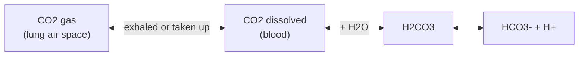

---
aliases:
  - Buffer
  - pH Buffer
  - Buffer Capacity
  - Solution tampon
tags:
  - type/concept
  - domain/chemistry
  - domain/biology
  - level/L1
  - level/L2
mastery: 0
prerequisites:
  - "[[pH]]"
  - "[[Acid-Base Equilibrium]]"
  - "[[Henderson-Hasselbalch Equation]]"
related:
  - "[[Le Chatelier's Principle]]"
  - "[[Blood]]"
  - "[[Homeostasis]]"
  - "[[Amino Acid]]"
  - "[[Protein Purification]]"
projects: []
sources:
  - "[[Chemistry 2e (OpenStax)]]"
  - "[[Lehninger Principles of Biochemistry (Nelson)]]"
  - "[[Good 1966 - Hydrogen Ion Buffers for Biological Research]]"
---

# Buffer Solution

> [!abstract]
> A buffer is a mixture of a weak acid and its conjugate base that soaks up added acid or base, so the pH barely moves; you pick one whose pKa is close to the pH you want and make it concentrated enough for the load it must absorb.

## Definition

A **buffer solution** contains a weak acid and its conjugate base (or a weak base and its conjugate acid) in comparable amounts; it resists changes in pH when small amounts of strong acid or base are added.[^chem14] Its **buffer capacity** is the amount of strong acid or base it can absorb before its pH changes significantly; capacity grows with the buffer's concentration and is largest when acid and base forms are equal, that is when $\mathrm{pH} = \mathrm{p}K_a$.[^chem14]

## Why it matters

- **Every wet-lab dataset was buffered.** Enzyme assays, cell culture media, protein purification and sequencing library preparation all fix pH with a buffer; the buffer name, concentration and pH are metadata worth recording, because they change activities and stabilities ([[Protein Purification]]).
- **Physiology is buffered.** Blood and cytosol pH are held in narrow ranges by phosphate, bicarbonate and protein buffers ([[Blood]], [[Homeostasis]]).[^leh][^chem14]
- **It is the [[Henderson-Hasselbalch Equation]] in practice**: choosing a buffer and computing its recipe or its capacity are one-line calculations that are easy to script.

## Core (L1)

**How a buffer works.** Added $\mathrm{H^+}$ is consumed by the base form ($\mathrm{A^- + H^+ \to HA}$); added $\mathrm{OH^-}$ is consumed by the acid form ($\mathrm{HA + OH^- \to A^- + H_2O}$). Either way the strong acid or base is converted into the weak partner, and only the ratio $[\mathrm{A^-}]/[\mathrm{HA}]$, inside a logarithm, changes:[^chem14]

$$\mathrm{pH} = \mathrm{p}K_a + \log_{10}\frac{[\mathrm{A^-}]}{[\mathrm{HA}]}.$$

**Choosing a buffer.** Pick a weak acid whose pKa is close to the target pH; a buffer works best within about one pH unit of its pKa.[^chem14][^leh] Then choose the concentration from the load it must absorb (capacity, below).

| Buffer pair | pKa | Typical use |
|---|---:|---|
| acetic acid / acetate | 4.74 (from $K_a = 1.8 \times 10^{-5}$)[^chem14] | acidic pH |
| $\mathrm{CO_2}$ + $\mathrm{H_2CO_3}$ / $\mathrm{HCO_3^-}$ | 6.1 at body temperature[^chem14] | blood plasma |
| $\mathrm{H_2PO_4^-}$ / $\mathrm{HPO_4^{2-}}$ | 6.86[^leh] | cytosol; lab buffers |
| HEPES | about 7.5 at 20 °C[^good] | cell culture, enzyme assays |

**Bio: phosphate inside cells, bicarbonate in blood.** The $\mathrm{H_2PO_4^-}/\mathrm{HPO_4^{2-}}$ pair buffers the cytoplasm.[^leh] Blood plasma is buffered mainly by bicarbonate: with $[\mathrm{H_2CO_3}] \approx 0.0012$ M, $[\mathrm{HCO_3^-}] \approx 0.024$ M and pKa 6.1 at body temperature, $\mathrm{pH} = 6.1 + \log_{10}(0.024/0.0012) = 7.4$.[^chem14] The pKa is far from 7.4, yet the system works because it is **open**: dissolved $\mathrm{CO_2}$ exchanges with $\mathrm{CO_2}$ gas in the lungs, so breathing adjusts the acid form.[^leh]



**Bio: Tris and HEPES in the lab.** Biochemists need buffers near pH 7 that do not interfere with the system studied. Good and colleagues set the criteria: a pKa between 6 and 8, high solubility in water, low permeability through membranes, little effect of salts and temperature on dissociation, weak binding of metal ions, chemical stability and low absorbance in the visible and ultraviolet; HEPES is one of the buffers they introduced to meet them.[^good] Tris, the other common laboratory buffer, is an amine; this note gives no pKa for it because none of its sources was verified for the value, so take it from the supplier's data at your working temperature, since temperature dependence is one of Good's criteria.[^good]

## Deeper (L2)

**Capacity in numbers.** Write $C$ for the total buffer concentration and $\alpha = [\mathrm{A^-}]/C$ for the base fraction. Adding strong base $b$ converts acid into base, so $\alpha$ rises by $b/C$. Differentiating $\alpha = 1/(1 + 10^{\mathrm{p}K_a - \mathrm{pH}})$ gives $d\alpha/d\mathrm{pH} = \ln 10\, \alpha(1-\alpha)$, hence the buffer capacity

$$\beta = \frac{db}{d\mathrm{pH}} = \ln 10 \; C \,\alpha(1 - \alpha),$$

maximal at $\mathrm{pH} = \mathrm{p}K_a$ ($\beta_{\max} = 0.576\, C$), and at one unit from the pKa already down to $\ln 10 \cdot C \cdot 0.083 = 0.19\, C$ (one third of the maximum). The expression ignores water's own contribution, which matters only near pH 2 or 12.

**Dilution keeps the pH, not the capacity.** Diluting a buffer leaves the ratio $[\mathrm{A^-}]/[\mathrm{HA}]$, hence the pH, unchanged, but divides $C$ and $\beta$ by the dilution factor (Worked example).

**Closed versus open systems.** In a closed bottle, acid added to bicarbonate raises $[\mathrm{H_2CO_3}]$ and the pH falls; in the body, exhaling the extra $\mathrm{CO_2}$ keeps the acid form nearly constant, and the pH falls much less (Exercise 3). This is [[Le Chatelier's Principle]] put to work.

**Polyprotic buffers.** Phosphoric acid loses three protons with three pKa values; only the middle pair ($\mathrm{H_2PO_4^-}/\mathrm{HPO_4^{2-}}$, pKa 6.86) buffers near neutrality.[^leh] Each dissociation step has its own buffering window.

## Mathematical representation

For a buffer of total concentration $C$ and acid dissociation constant $K_a$:

- base fraction $\alpha(\mathrm{pH}) = \dfrac{1}{1 + 10^{\,\mathrm{p}K_a - \mathrm{pH}}}$; recipe $[\mathrm{A^-}] = \alpha C$, $[\mathrm{HA}] = (1 - \alpha) C$;
- after adding strong acid $h$ (same volume units, $h < [\mathrm{A^-}]$): $\mathrm{pH}' = \mathrm{p}K_a + \log_{10}\dfrac{[\mathrm{A^-}] - h}{[\mathrm{HA}] + h}$;
- capacity $\beta = \ln 10\; C \alpha (1-\alpha)$, and for a mixture of independent buffers $\beta = \sum_i \ln 10\; C_i \alpha_i (1 - \alpha_i)$;
- small additions: $\Delta \mathrm{pH} \approx -h/\beta$.

## Computational representation

```python
import math

LN10 = math.log(10)
PKA = {"acetate": 4.74, "bicarbonate (37 °C)": 6.1, "phosphate": 6.86, "HEPES (20 °C)": 7.5}

def base_fraction(pH: float, pKa: float) -> float:
    """Fraction of the buffer in its conjugate-base form (Henderson-Hasselbalch)."""
    return 1 / (1 + 10 ** (pKa - pH))

def recipe(pH: float, pKa: float, total_mM: float) -> tuple[float, float]:
    """Concentrations (acid form, base form) giving the target pH."""
    a = base_fraction(pH, pKa)
    return total_mM * (1 - a), total_mM * a

def capacity(pH: float, pKa: float, total_mM: float) -> float:
    """Buffer capacity beta = d(strong base added)/d(pH), in mM per pH unit (water ignored)."""
    a = base_fraction(pH, pKa)
    return LN10 * total_mM * a * (1 - a)

def after_strong_acid(acid: float, base: float, added: float, pKa: float) -> float:
    """pH after adding `added` mM of strong acid, which converts base form into acid form."""
    return pKa + math.log10((base - added) / (acid + added))

def choose(target: float) -> list[tuple[str, float]]:
    """Candidate buffers ranked by |pKa - target|; useful range about pKa +/- 1."""
    return sorted(((n, p) for n, p in PKA.items() if abs(p - target) <= 1), key=lambda np: abs(np[1] - target))

acid, base = recipe(7.4, PKA["phosphate"], 100)
print(f"100 mM phosphate, pH 7.4: acid {acid:.1f} mM, base {base:.1f} mM")
print(f"capacity {capacity(7.4, 6.86, 100):.1f} mM/pH; max {capacity(6.86, 6.86, 100):.1f} at pH = pKa")
print(f"+5 mM HCl: pH {after_strong_acid(acid, base, 5, 6.86):.2f}")
print(f"same buffer diluted to 10 mM, +5 mM HCl: pH {after_strong_acid(acid/10, base/10, 5, 6.86):.2f}")
print(f"5 mM HCl in pure water: pH {-math.log10(0.005):.2f}")
print("choices for pH 7.2:", choose(7.2))
```

```text
100 mM phosphate, pH 7.4: acid 22.4 mM, base 77.6 mM
capacity 40.0 mM/pH; max 57.6 at pH = pKa
+5 mM HCl: pH 7.28
same buffer diluted to 10 mM, +5 mM HCl: pH 6.44
5 mM HCl in pure water: pH 2.30
choices for pH 7.2: [('HEPES (20 °C)', 7.5), ('phosphate', 6.86)]
```

## Worked example

> [!example] A 100 mM phosphate buffer at pH 7.4, and what dilution does to it
> 1. **Recipe.** $\alpha = 1/(1 + 10^{6.86 - 7.4}) = 0.776$: 77.6 mM $\mathrm{HPO_4^{2-}}$ and 22.4 mM $\mathrm{H_2PO_4^-}$.
> 2. **Capacity.** $\beta = 2.303 \times 100 \times 0.776 \times 0.224 = 40.0$ mM per pH unit, so 5 mM of strong acid should lower the pH by about $5/40 = 0.125$.
> 3. **Exact check.** Acid converts base into acid form: $\mathrm{pH} = 6.86 + \log_{10}(72.6/27.4) = 7.28$, a drop of 0.12. The same 5 mM of HCl in pure water would give pH 2.30.
> 4. **Dilute tenfold.** The 10 mM buffer still reads pH 7.4, but its capacity is 4.0 mM per pH unit: the same 5 mM of acid now uses up most of the base form and the pH falls to 6.44.
> 5. **Conclusion.** pH is set by the ratio; resistance is set by the concentration.

## Common misconceptions

> [!warning] "A buffer keeps the pH constant"
> It slows pH change, within its capacity. Add more acid than it has base form and it fails like water.

> [!warning] "Any buffer will do if you adjust it to the right pH"
> A phosphate buffer titrated to pH 8.5 is mostly in its base form, with little capacity against base: choose a pKa within about one unit of the target.[^chem14]

> [!warning] "Bicarbonate is a poor blood buffer because its pKa is 6.1"
> As a closed system it would be weak at pH 7.4; in the body, exchange of $\mathrm{CO_2}$ with lung air makes it effective.[^leh]

> [!warning] "Diluting a buffer changes its pH"
> To first order it does not: the ratio is unchanged. It loses capacity in proportion to the dilution.

## Exercises

> [!question] Exercise 1 (L1)
> From the table (acetate 4.74, phosphate 6.86, HEPES 7.5), choose a buffer for pH 5.0, 7.0 and 7.8, and say which target is badly served.

> [!success]- Solution
> pH 5.0: acetate (|Δ| = 0.26). pH 7.0: phosphate (0.14), HEPES also possible (0.5). pH 7.8: HEPES (0.3). None of the three is near pH 6.0 (phosphate is 0.86 away, at the edge of its range); a buffer with a pKa near 6 would be needed there.

> [!question] Exercise 2 (L1)
> Give the concentrations of the acid and base forms in 50 mM HEPES at pH 7.0 (pKa 7.5).

> [!success]- Solution
> $\alpha = 1/(1 + 10^{7.5 - 7.0}) = 0.240$: 12.0 mM base form, 38.0 mM acid form. Below its pKa, HEPES is mostly in the acid form, so it buffers better against added base than against added acid.

> [!question] Exercise 3 (L2)
> Blood has $[\mathrm{HCO_3^-}] = 24$ mM and $[\mathrm{H_2CO_3}] = 1.2$ mM (pKa 6.1). (a) What ratio gives pH 7.4? (b) Add 2 mM strong acid in a closed system. (c) Same, but the extra $\mathrm{CO_2}$ is exhaled so $[\mathrm{H_2CO_3}]$ stays 1.2 mM. (d) What pH results if bicarbonate falls to 12 mM at constant $[\mathrm{H_2CO_3}]$?

> [!success]- Solution
> (a) $10^{7.4 - 6.1} = 20$: 20 bicarbonate per carbonic acid. (b) $6.1 + \log_{10}(22/3.2) = 6.94$. (c) $6.1 + \log_{10}(22/1.2) = 7.36$. (d) $6.1 + \log_{10}(12/1.2) = 7.1$. Breathing out $\mathrm{CO_2}$ turns a 0.46-unit drop into a 0.04-unit drop: the open system is what makes bicarbonate effective.[^leh]

> [!question] Exercise 4 (L2, Python)
> Using `capacity`, tabulate the capacity of 50 mM phosphate, 50 mM HEPES and their mixture from pH 6.0 to 8.5. Where does the mixture beat each single buffer, and where is it strongest?

> [!success]- Solution
> ```python
> for pH in (6.0, 6.5, 7.0, 7.5, 8.0, 8.5):
>     p, h = capacity(pH, 6.86, 50), capacity(pH, 7.5, 50)
>     print(pH, round(p, 1), round(h, 1), round(p + h, 1))
> # 6.0 12.3 3.4 15.7
> # 6.5 24.4 9.5 33.9
> # 7.0 28.0 21.0 49.1
> # 7.5 17.5 28.8 46.2
> # 8.0 7.3 21.0 28.3
> # 8.5 2.5 9.5 12.0
> ```
>
> Capacities add, so the mixture beats each 50 mM buffer at every pH. Its maximum, about 50 mM per pH unit near pH 7.2, lies between the two pKa values, and it stays above 40 from about pH 6.7 to 7.7. With pKa values 0.64 apart the two humps merge into one; buffers with pKa values about one unit apart chain their humps into a wide-range buffer. The price is more components that may interact with the system studied.

## Mastery checklist

- [ ] 1 Recognized: I can define a buffer and buffer capacity and name the main buffers of blood, cytosol and the lab.
- [ ] 2 Understood: I can explain why the pKa should be near the target pH and why bicarbonate works in blood.
- [ ] 3 Practiced: I can compute a recipe, a capacity and the pH after adding acid, by hand and in Python.
- [ ] 4 Applied: I can choose and justify a buffer for an assay, including temperature and concentration, and record it as metadata.
- [ ] 5 Explained: I can teach capacity as a derivative, the closed versus open system distinction and the criteria for biological buffers.

## References

[^chem14]: [[Chemistry 2e (OpenStax)]], ch. 14 "Acid-Base Equilibria" (buffers, buffer capacity and effective range, the acetic acid ionization constant, and the carbonic acid-bicarbonate buffer of blood).
[^leh]: [[Lehninger Principles of Biochemistry (Nelson)]], 8th ed. (2021), treatment of water and buffers (buffering region of about one pH unit on each side of the pKa, the phosphate system in the cytoplasm with pKa 6.86, the bicarbonate system of blood plasma and its exchange with gaseous CO2 in the lungs) (chapter number not verified).
[^good]: [[Good 1966 - Hydrogen Ion Buffers for Biological Research]], *Biochemistry* 5(2):467-477 (criteria for biological buffers; HEPES).
