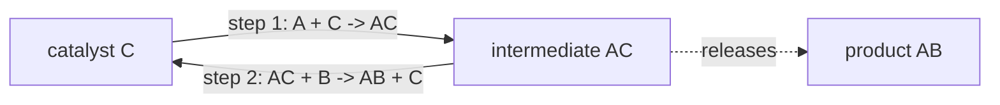

---
aliases:
  - Catalyst
  - Homogeneous Catalysis
  - Heterogeneous Catalysis
  - Catalyse
tags:
  - type/concept
  - domain/chemistry
  - domain/biology
  - level/L1
  - level/L2
mastery: 0
prerequisites:
  - "[[Activation Energy]]"
  - "[[Reaction Kinetics]]"
  - "[[Gibbs Free Energy]]"
  - "[[Chemical Equilibrium]]"
related:
  - "[[Enzyme]]"
  - "[[Enzyme Catalysis]]"
  - "[[Reaction Mechanism]]"
  - "[[Transition State Theory]]"
  - "[[Michaelis-Menten Kinetics]]"
  - "[[Ribosome]]"
projects: []
sources:
  - "[[Chemistry 2e (OpenStax)]]"
  - "[[Biochemistry (Berg)]]"
  - "[[Nissen 2000 - The Structural Basis of Ribosome Activity in Peptide Bond Synthesis]]"
  - "[[MIT 5.111SC - Principles of Chemical Science]]"
---

# Catalysis

> [!abstract]
> A catalyst speeds a reaction by offering it an easier path over a lower energy barrier, comes out unchanged at the end, and never changes where the reaction is heading: only how fast it gets there.

## Definition

A **catalyst** is a substance that increases the rate of a reaction without being consumed by it; it takes part in the mechanism but is regenerated, so it does not appear in the overall equation.[^chem12][^5111] It works by providing an alternative mechanism with a lower activation energy, and it does not change the reaction's free-energy change or its equilibrium constant: it speeds the forward and reverse reactions alike, so equilibrium is reached sooner but at the same composition.[^chem12] **Homogeneous** catalysts are in the same phase as the reactants; **heterogeneous** catalysts are in a different phase, typically a solid surface on which reacting molecules adsorb.[^chem12]

## Why it matters

- **Biology runs on catalysts.** Enzymes are biological catalysts; without them most metabolic reactions would be far too slow at body temperature ([[Enzyme]]).[^berg][^chem12]
- **Direction comes from thermodynamics, speed from catalysts.** Metabolic models take reaction directions from free energies and let enzyme levels set rates ([[Gibbs Free Energy]], [[Metabolic Network]]).
- **Annotation is about catalysis.** EC numbers, a standard functional annotation of protein sequences, classify the reactions enzymes catalyse ([[Enzyme]]).
- **Inhibitors block catalysts.** An enzyme inhibitor slows a reaction by acting on the catalyst, not on the reaction's thermodynamics, which is the logic of many drug-target analyses ([[Enzyme Inhibition]]).

## Core (L1)

**A different path, not a push.** The catalysed reaction follows another mechanism, often with more steps but with every barrier lower than the uncatalysed one. Reactants and products, hence their free energies, are the same on both paths.[^chem12]

![[catalysis-energy-profile.svg]]

**The catalytic cycle.** A catalyst C is consumed in an early step and regenerated in a later one; the species formed in between is an **intermediate**:



Adding the steps cancels C and AC: the overall reaction is $\mathrm{A} + \mathrm{B} \to \mathrm{AB}$. A catalyst appears as a reactant in one step and a product in a later one; an intermediate the reverse.

**Why ΔG and K cannot change.** Free energy is a state function: $\Delta G$ depends only on reactants and products, not on the path ([[Gibbs Free Energy]]). For a reversible step, $K = k_f/k_r$ ([[Chemical Equilibrium]]); the forward and reverse reactions cross the same transition state, so lowering it multiplies $k_f$ and $k_r$ by the same factor and leaves $K$ unchanged.[^chem12] A catalyst that favoured one direction only would shift an equilibrium without spending energy, which thermodynamics forbids.

**Homogeneous or heterogeneous.** A catalyst dissolved with the reactants is homogeneous; a metal surface on which gas or dissolved molecules adsorb, react and desorb is heterogeneous.[^chem12] Enzymes are dissolved (or membrane-bound) macromolecules whose **active site** plays the role of the surface: substrates bind, react and leave ([[Enzyme]]).[^berg]

**Bio: not only proteins.** Most enzymes are proteins, but RNA can catalyse too: the peptidyl-transferase centre of the [[Ribosome]], where peptide bonds form, is made of RNA.[^nissen]

## Deeper (L2)

**How much speed per kJ.** If the frequency factor is unchanged, lowering the barrier by $\Delta E$ multiplies the rate constant by $e^{\Delta E/RT}$ ([[Activation Energy]]). At 37 °C, every $RT \ln 10 = 5.94$ kJ/mol buys a factor 10: 10, 20 and 40 kJ/mol give factors of about 48, 2,300 and 5.5 million.

**Turnover number.** A catalyst is reused many times; the turnover number $k_{\mathrm{cat}}$ of an enzyme is the number of substrate molecules one active site converts per unit time when fully saturated with substrate.[^berg] Saturation is also why enzyme kinetics are not simply first order in substrate ([[Michaelis-Menten Kinetics]]).

**How enzymes lower barriers.** Common strategies are acid-base catalysis (a group, often histidine, gives or takes a proton; see [[Henderson-Hasselbalch Equation]]), covalent catalysis (a transient covalent bond to the substrate) and metal-ion catalysis; underlying them all is binding the transition state more tightly than the substrate.[^berg] Details belong to [[Enzyme Catalysis]] and [[Transition State Theory]].

**Selectivity.** A catalyst speeds only the reactions whose path it lowers. This is how an enzyme picks one reaction among the many a substrate could undergo, and why the same molecules can follow different pathways in different cells.

## Mathematical representation

For $\mathrm{A} \rightleftharpoons \mathrm{B}$ with first-order rate constants $k_f$ and $k_r$, starting from pure A, the fraction of B is

$$b(t) = b_{eq}\left(1 - e^{-(k_f + k_r)t}\right), \qquad b_{eq} = \frac{k_f}{k_f + k_r} = \frac{K}{1 + K}.$$

A catalyst multiplies both constants by $f = e^{\Delta E/RT}$: $b_{eq}$ and $K$ are unchanged, and the relaxation time $1/(k_f + k_r)$ is divided by $f$. Symbols: $K$ equilibrium constant, $\Delta E$ barrier lowering, $R$ gas constant, $T$ temperature.

## Computational representation

```python
import math

R = 8.314  # J mol^-1 K^-1

def speedup(delta_ea_kj: float, t_c: float = 37.0) -> float:
    """Factor by which lowering the barrier by delta_ea_kj multiplies a rate constant (same A)."""
    return math.exp(delta_ea_kj * 1000 / (R * (t_c + 273.15)))

def relax(kf: float, kr: float, t: float, b0: float = 0.0) -> float:
    """Fraction in form B for A <-> B (first order both ways), starting from B fraction b0."""
    b_eq = kf / (kf + kr)
    return b_eq + (b0 - b_eq) * math.exp(-(kf + kr) * t)

for d in (10, 20, 40):
    print(f"barrier lowered by {d} kJ/mol at 37 C: x{speedup(d):.3g}")

kf, kr = 0.02, 0.01                # invented rate constants (per s), K = 2
for factor in (1, 1000):           # without and with a catalyst that lowers both barriers equally
    f, r = kf * factor, kr * factor
    t90 = math.log(10) / (f + r)   # time to cover 90 % of the way to equilibrium
    print(f"x{factor}: K = {f / r:.1f}, B at equilibrium = {relax(f, r, 1e9):.3f}, t90 = {t90:.3g} s")
```

```text
barrier lowered by 10 kJ/mol at 37 C: x48.3
barrier lowered by 20 kJ/mol at 37 C: x2.34e+03
barrier lowered by 40 kJ/mol at 37 C: x5.46e+06
x1: K = 2.0, B at equilibrium = 0.667, t90 = 76.8 s
x1000: K = 2.0, B at equilibrium = 0.667, t90 = 0.0768 s
```

## Worked example

> [!example] Same destination, faster journey (invented rate constants)
> $\mathrm{A} \rightleftharpoons \mathrm{B}$ with $k_f = 0.02$ s⁻¹ and $k_r = 0.01$ s⁻¹.
> 1. Equilibrium: $K = k_f/k_r = 2$, so two thirds of the molecules end as B.
> 2. Without catalyst: 90 % of the way to equilibrium takes $\ln 10/(k_f + k_r) = 76.8$ s.
> 3. A catalyst lowers the shared transition state by $RT \ln 1000 = 17.8$ kJ/mol at 37 °C, multiplying both constants by 1000.
> 4. With catalyst: $K = 20/10 = 2$, still two thirds B, reached 90 % of the way in 0.0768 s.
> 5. Conclusion: the catalyst changed the time scale by a factor 1000 and the outcome not at all.

## Common misconceptions

> [!warning] "A catalyst increases the yield"
> It cannot shift an equilibrium. A higher yield at a given time, before equilibrium, only reflects a faster approach; the final composition is the same.[^chem12]

> [!warning] "A catalyst does not take part in the reaction"
> It does, in the mechanism: it is consumed in one step and regenerated in another. It is absent only from the overall equation.

> [!warning] "An enzyme makes an unfavourable reaction happen"
> Not alone: a reaction with $\Delta G > 0$ stays unfavourable with or without the catalyst. Cells couple such reactions to favourable ones, such as ATP hydrolysis ([[Enzyme]]).

## Exercises

> [!question] Exercise 1 (L1)
> A mechanism has two steps: $\mathrm{H_2O_2} + \mathrm{I^-} \to \mathrm{H_2O} + \mathrm{IO^-}$, then $\mathrm{H_2O_2} + \mathrm{IO^-} \to \mathrm{H_2O} + \mathrm{O_2} + \mathrm{I^-}$. Write the overall reaction and identify the catalyst and the intermediate.

> [!success]- Solution
> Adding the steps and cancelling: $2\,\mathrm{H_2O_2} \to 2\,\mathrm{H_2O} + \mathrm{O_2}$. $\mathrm{I^-}$ is consumed in step 1 and regenerated in step 2: catalyst. $\mathrm{IO^-}$ is formed in step 1 and consumed in step 2: intermediate. Both are in the same solution, so this is homogeneous catalysis.

> [!question] Exercise 2 (L1)
> Which of these does a catalyst change: (a) $\Delta G$, (b) $K$, (c) $E_a$, (d) $k_f$, (e) $k_r$, (f) the time to reach equilibrium, (g) the equilibrium composition?

> [!success]- Solution
> It changes (c), (d), (e) and (f). It leaves (a), (b) and (g) unchanged: both rate constants grow by the same factor, so $K = k_f/k_r$ and the composition it fixes stay the same.

> [!question] Exercise 3 (L2)
> By how much must an enzyme lower an activation barrier at 37 °C to speed a reaction a million-fold, if the frequency factor is unchanged? And at 25 °C?

> [!success]- Solution
> $\Delta E = RT \ln 10^6$: at 310.15 K, $8.314 \times 310.15 \times 13.82 = 35.6$ kJ/mol; at 298.15 K, 34.2 kJ/mol. The energy cost per factor of 10 is proportional to $T$ (5.94 kJ/mol at 37 °C), a modest amount compared with a single covalent bond.

> [!question] Exercise 4 (L2, Python)
> With `relax`, start the invented reaction from pure B ($b_0 = 1$) with and without the 1000-fold catalyst. Show that both runs end at the same composition, and explain why this rules out a catalyst that would speed only the forward reaction.

> [!success]- Solution
> ```python
> for factor in (1, 1000):
>     f, r = 0.02 * factor, 0.01 * factor
>     print(factor, round(relax(f, r, 1e9, b0=1.0), 3), round(relax(f, r, 1.0, b0=1.0), 3))
> # 1 0.667 0.99
> # 1000 0.667 0.667
> ```
>
> From pure B, both runs relax to the same two thirds of B; after 1 s the uncatalysed run has barely moved (0.99) while the catalysed run is already at equilibrium. If a catalyst sped only the forward reaction, the catalysed mixture would end with more B than the uncatalysed one: removing or adding the catalyst would then shift an equilibrium back and forth at no energy cost, which is impossible ([[Laws of Thermodynamics]]).

## Mastery checklist

- [ ] 1 Recognized: I can define a catalyst and tell homogeneous from heterogeneous catalysis.
- [ ] 2 Understood: I can explain with an energy profile why a catalyst changes $E_a$ but not $\Delta G$ or $K$.
- [ ] 3 Practiced: I can identify catalysts and intermediates in a mechanism and compute rate enhancements from barrier changes, by hand and in Python.
- [ ] 4 Applied: I can reason about enzymes in a pathway model as setting rates while thermodynamics sets directions.
- [ ] 5 Explained: I can teach why a catalyst must speed both directions equally and how enzymes lower barriers.

## References

[^chem12]: [[Chemistry 2e (OpenStax)]], ch. 12 "Kinetics" (catalysts and alternative mechanisms with lower activation energy, catalysts do not change equilibrium, homogeneous and heterogeneous catalysis, enzymes as biological catalysts).
[^berg]: [[Biochemistry (Berg)]], 5th ed. (2002), treatment of enzymes (catalytic power, turnover number $k_{\mathrm{cat}}$, active sites, catalytic strategies: acid-base, covalent and metal-ion catalysis, transition-state binding).
[^nissen]: [[Nissen 2000 - The Structural Basis of Ribosome Activity in Peptide Bond Synthesis]], *Science* 289:920-930.
[^5111]: [[MIT 5.111SC - Principles of Chemical Science]], course description (chemical kinetics and catalysis).
