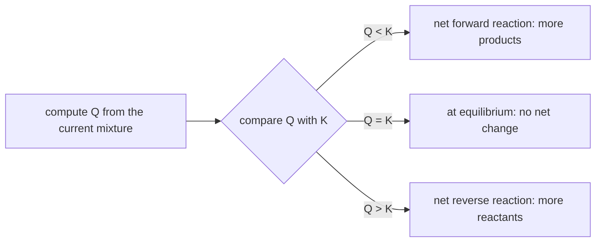

---
aliases:
  - Equilibrium Constant
  - Law of Mass Action
  - Reaction Quotient
  - K
  - Équilibre chimique
tags:
  - type/concept
  - domain/chemistry
  - domain/biology
  - domain/physics
  - level/L1
  - level/L2
  - level/L3
mastery: 0
prerequisites:
  - "[[Gibbs Free Energy]]"
  - "[[Molar Concentration]]"
  - "[[Stoichiometry]]"
  - "[[Logarithm]]"
  - "[[Exponential Function]]"
related:
  - "[[Le Chatelier's Principle]]"
  - "[[Acid-Base Equilibrium]]"
  - "[[Ligand Binding]]"
  - "[[Van 't Hoff Equation]]"
  - "[[Chemical Potential]]"
  - "[[Reaction Kinetics]]"
  - "[[Metabolism]]"
  - "[[Partition Function]]"
projects: []
sources:
  - "[[Chemistry 2e (OpenStax)]]"
  - "[[MIT 5.111SC - Principles of Chemical Science]]"
  - "[[NIST Reference on Constants, Units, and Uncertainty]]"
  - "[[Biochemistry (Berg)]]"
  - "[[Lehninger Principles of Biochemistry (Nelson)]]"
  - "[[Physical Biology of the Cell (Phillips)]]"
---

# Chemical Equilibrium

> [!abstract]
> A reversible reaction reaches equilibrium when it runs forward and backward at the same rate; the equilibrium constant K summarizes where that balance lies, and comparing the current reaction quotient Q with K tells which way a mixture will go.

## Definition

A reversible reaction is at **chemical equilibrium** when its forward and reverse reactions proceed at equal rates, so that the concentrations of reactants and products no longer change. For $a\mathrm{A} + b\mathrm{B} \rightleftharpoons c\mathrm{C} + d\mathrm{D}$, the **reaction quotient** $Q = [\mathrm{C}]^c[\mathrm{D}]^d / [\mathrm{A}]^a[\mathrm{B}]^b$ takes, at equilibrium, a value that depends only on temperature: the **equilibrium constant** $K$ (law of mass action).[^chem13][^5111]

## Why it matters

- **Every affinity is an equilibrium constant.** A dissociation constant $K_d$ (drug and target, transcription factor and DNA, antibody and antigen) is the $K$ of an unbinding reaction ([[Ligand Binding]]). Ranking hits in [[Drug Discovery]] or reading a binding assay means reading $K$ values on a log scale.
- **Free energies are measured through K.** $\Delta G^\circ = -RT\ln K$ turns a measured ratio of concentrations into a free energy, and back ([[Gibbs Free Energy]]): stability and affinity databases report one or the other.
- **Charge is an equilibrium.** Protonation of side chains and of buffers is a set of acid-base equilibria ([[Acid-Base Equilibrium]], [[Henderson-Hasselbalch Equation]]).
- **Metabolic models.** Comparing the measured mass-action ratio of a metabolic reaction with its $K'$ tells whether it runs near equilibrium or far from it, and far-from-equilibrium steps are typical control points.[^lehninger] Metabolomics data make that comparison possible pathway-wide ([[Metabolism]]).

## Core (L1)

### Dynamic, not static

At equilibrium nothing stops: molecules keep reacting in both directions, at equal rates.[^chem13] The same equilibrium is reached from either side, starting from pure reactants or from pure products.[^chem13]

### Writing K

For $a\mathrm{A} + b\mathrm{B} \rightleftharpoons c\mathrm{C} + d\mathrm{D}$ in solution:[^chem13]

$$K_c = \frac{[\mathrm{C}]^c_{\text{eq}}\,[\mathrm{D}]^d_{\text{eq}}}{[\mathrm{A}]^a_{\text{eq}}\,[\mathrm{B}]^b_{\text{eq}}}$$

Rules:[^chem13]

1. Products over reactants, each raised to its stoichiometric coefficient.
2. Pure solids and pure liquids (including the solvent water in dilute solution) do not appear.
3. For gases, partial pressures give $K_P$; $K_P = K_c (RT)^{\Delta n}$, with $\Delta n$ the change in moles of gas.
4. Reverse the reaction: $K \to 1/K$. Multiply the coefficients by $n$: $K \to K^n$. Add two reactions: multiply their $K$.
5. Strictly, $K$ is written with activities (concentrations divided by the standard 1 M, pressures by 1 bar), so it has no units.

| Reaction | Equilibrium constant |
|---|---|
| $\mathrm{2\,SO_2(g) + O_2(g) \rightleftharpoons 2\,SO_3(g)}$ | $K_P = p_{\mathrm{SO_3}}^2 / (p_{\mathrm{SO_2}}^2\, p_{\mathrm{O_2}})$ |
| $\mathrm{CH_3COOH + H_2O \rightleftharpoons H_3O^+ + CH_3COO^-}$ | $K_a = [\mathrm{H_3O^+}][\mathrm{CH_3COO^-}]/[\mathrm{CH_3COOH}]$ (no water) |
| $\mathrm{PL \rightleftharpoons P + L}$ (unbinding) | $K_d = [\mathrm{P}][\mathrm{L}]/[\mathrm{PL}]$ |

### Reading the size of K

$K \gg 1$: at equilibrium products dominate; $K \ll 1$: reactants dominate; $K \approx 1$: comparable amounts.[^chem13] Because $K$ values span dozens of orders of magnitude, they are compared on a log scale ([[Logarithm]]), as in pKa and $\log K_d$.

### Q versus K

For any mixture, compute $Q$ with the current concentrations and compare:[^chem13]



### From ΔG° to K

At equilibrium $\Delta G = 0$ and $Q = K$, so[^chem16]

$$\Delta G^\circ = -RT\ln K \qquad \Longleftrightarrow \qquad K = e^{-\Delta G^\circ/RT},$$

with $R = 8.314\,462\,618$ J mol⁻¹ K⁻¹[^nist] and $T$ in kelvin. A negative $\Delta G^\circ$ means $K > 1$. At 25 °C, each 5.71 kJ/mol of $\Delta G^\circ$ is a factor of 10 in $K$ (computed below):

| $\Delta G^\circ$ (kJ/mol) | −40 | −20 | −5.71 | 0 | +5.71 | +20 | +40 |
|---|---:|---:|---:|---:|---:|---:|---:|
| $K$ at 25 °C | $1.0 \times 10^{7}$ | $3.2 \times 10^{3}$ | 10 | 1 | 0.10 | $3.1 \times 10^{-4}$ | $9.8 \times 10^{-8}$ |

## Deeper (L2)

### Equilibrium calculations

To find the equilibrium composition from initial concentrations, write each concentration as a function of one unknown, the **extent** $x$ (mol/L converted), then solve $Q(x) = K$: the ICE table (Initial, Change, Equilibrium).[^chem13] For $\mathrm{A \rightleftharpoons B + C}$ starting from $[\mathrm{A}]_0$: $x^2/([\mathrm{A}]_0 - x) = K$, a quadratic. When $K$ is small, $x \ll [\mathrm{A}]_0$ and $x \approx \sqrt{K[\mathrm{A}]_0}$, an approximation to check afterward (Exercise 4).[^chem13]

### Biochemical constants

Biochemistry uses $K'$ (or $K'_{\text{eq}}$), defined at pH 7 with water omitted, and related to $\Delta G^{\circ\prime}$ by the same formula.[^berg][^lehninger] For triose phosphate isomerase, $\Delta G^{\circ\prime} = +7.5$ kJ/mol,[^berg] so $K' = 0.0485$: at equilibrium about 95 % of the triose phosphate is DHAP (Worked example).

### Binding constants and free energies

For unbinding $\mathrm{PL \rightleftharpoons P + L}$, $K_d$ has units of concentration and equals the free ligand concentration at which half the protein is bound ([[Ligand Binding]]). With the 1 M standard state, the binding free energy is $\Delta G^\circ_{\text{bind}} = RT\ln K_d$ (binding is the reverse reaction, so $K = 1/K_d$). A 1 µM binder has $\Delta G^\circ_{\text{bind}} = -34.2$ kJ/mol at 25 °C, a 1 nM binder −51.4 kJ/mol: three orders of magnitude of affinity are worth 17 kJ/mol (Exercise 6).

### Coupled equilibria

When two reactions share a species, the overall $K$ is the product of the individual ones (rule 4) and the overall $\Delta G^\circ$ the sum. This is the arithmetic of coupling in [[Metabolism]] and of competitive binding: a ligand that must displace another sees an apparent constant combining both.

### Temperature

$K$ changes only with temperature (concentration, pressure and catalysts do not change it).[^chem13] Its temperature dependence is governed by $\Delta H^\circ$: the [[Van 't Hoff Equation]]. How a mixture responds to disturbances at fixed $K$ is [[Le Chatelier's Principle]].

## Advanced (L3)

- **K from rates.** For an elementary reaction $\mathrm{A \rightleftharpoons B}$ with rate constants $k_f$ and $k_r$, equal rates at equilibrium give $k_f[\mathrm{A}] = k_r[\mathrm{B}]$, so $K = k_f/k_r$. A catalyst speeds both directions by the same factor and leaves $K$ unchanged ([[Catalysis]], [[Reaction Kinetics]]). In a network, equilibrium requires every elementary step to balance separately (detailed balance), which constrains the rate constants around any cycle: their product forward equals their product backward.
- **Cells are not at equilibrium.** A living cell is an open system that takes in nutrients and exports waste; its metabolite levels are a **steady state**, not an equilibrium.[^lehninger] Lehninger distinguishes reactions whose mass-action ratio $Q$ is close to $K'$ (near equilibrium, reversible, direction set by small concentration changes) from those with $Q \ll K'$ (far from equilibrium, effectively irreversible), the latter being typical sites of regulation.[^lehninger] With metabolomics data, $Q/K'$ can be computed for each step ($\Delta G = RT\ln(Q/K')$), and reaction directions in constraint-based models can be fixed thermodynamically ([[Flux Balance Analysis]]).
- **K from molecules.** Statistical physics computes $K$ from the energies and multiplicities of microscopic states, as a ratio of [[Partition Function|partition functions]]; for two conformations it reduces to a ratio of Boltzmann weights ([[Boltzmann Distribution]]).[^pbocsm]

## Mathematical representation

- Reaction $\sum_i \nu_i X_i = 0$ (signed coefficients $\nu_i$, positive for products). Activities $a_i$: $[X_i]/c^\circ$ with $c^\circ = 1$ M for solutes, $p_i/p^\circ$ with $p^\circ = 1$ bar for gases, 1 for pure condensed phases and solvent.
- $Q = \prod_i a_i^{\nu_i}$; $K = Q_{\text{eq}}$; $\Delta G = RT\ln(Q/K)$, $\Delta G^\circ = -RT\ln K$ ([[Gibbs Free Energy#Mathematical representation]]).
- Composition from an initial state: $c_i(x) = c_i^0 + \nu_i x$. Then
$$\frac{d}{dx}\ln Q(x) = \sum_i \frac{\nu_i^2}{c_i^0 + \nu_i x} > 0,$$
so $\ln Q$ is strictly increasing on the interval where all $c_i \ge 0$, and $Q(x) = K$ has exactly one solution there: the equilibrium is unique, and bisection finds it.
- Combination rules: reaction $r_1 + r_2$ has $K = K_1 K_2$; $n \cdot r$ has $K^n$; $-r$ has $1/K$ (because $\ln K = -\Delta G^\circ/RT$ is linear in the reaction).

## Computational representation

A reaction is a map `{species: coefficient}`; the calculator converts $\Delta G^\circ \leftrightarrow K$ with the CODATA gas constant[^nist] and solves for the equilibrium composition with the monotonic function above:

```python
import math

R = 8.314462618e-3   # molar gas constant, kJ/(mol K), CODATA (exact)


def k_from_dg0(dg0: float, t: float = 298.15) -> float:
    return math.exp(-dg0 / (R * t))


def dg0_from_k(k: float, t: float = 298.15) -> float:
    return -R * t * math.log(k)


def quotient(conc: dict, nu: dict) -> float:
    """Q = prod c_i ** nu_i, concentrations in M (standard state 1 M)."""
    return math.prod(conc[s] ** n for s, n in nu.items())


def equilibrium(c0: dict, nu: dict, k: float) -> dict:
    """Equilibrium concentrations c_i = c0_i + nu_i * x, solving Q(x) = K by bisection.

    ln Q(x) increases with x, so the root inside the allowed interval is unique.
    """
    lo = max((-c0[s] / n for s, n in nu.items() if n > 0), default=-1e9)
    hi = min((c0[s] / -n for s, n in nu.items() if n < 0), default=1e9)
    f = lambda x: sum(n * math.log(c0[s] + n * x) for s, n in nu.items()) - math.log(k)
    a, b = lo + 1e-15 * (hi - lo), hi - 1e-15 * (hi - lo)
    for _ in range(200):
        m = (a + b) / 2
        if f(m) > 0:
            b = m
        else:
            a = m
    x = (a + b) / 2
    return {s: c0[s] + n * x for s, n in nu.items()}


print("dG0 (kJ/mol) -> K at 25 C")
for dg0 in (-40, -20, -5.71, 0, 5.71, 20, 40):
    print(f"{dg0:7.2f}  {k_from_dg0(dg0):.2e}")

# Protein-ligand binding P + L <-> PL, Kd = 1 uM (invented), so K = 1/Kd = 1e6
nu = {"P": -1, "L": -1, "PL": 1}
eq = equilibrium({"P": 1e-6, "L": 2e-6, "PL": 0.0}, nu, 1e6)
print({s: f"{c:.3e}" for s, c in eq.items()}, f"Q = {quotient(eq, nu):.3e}")
print(f"dG0 of binding = {dg0_from_k(1e6):.1f} kJ/mol")
```

```text
dG0 (kJ/mol) -> K at 25 C
 -40.00  1.02e+07
 -20.00  3.19e+03
  -5.71  1.00e+01
   0.00  1.00e+00
   5.71  9.99e-02
  20.00  3.13e-04
  40.00  9.82e-08
{'P': '4.142e-07', 'L': '1.414e-06', 'PL': '5.858e-07'} Q = 1.000e+06
dG0 of binding = -34.2 kJ/mol
```

The solver handles any stoichiometry without deriving a polynomial by hand; the final $Q$ check confirms the answer. Concentrations must be in the units of the standard state (M here), or $K$ must be converted.

## Worked example

> [!example] Triose phosphate isomerase at equilibrium
> Start with 2.0 mM DHAP and no GAP; $\Delta G^{\circ\prime} = +7.5$ kJ/mol at 25 °C.[^berg]
> 1. **K**: $K' = e^{-7.5/(8.314 \times 10^{-3} \times 298.15)} = e^{-3.026} = 0.0485$.
> 2. **ICE**: DHAP $2.0 - x$, GAP $x$ (mM). Equilibrium: $x/(2.0 - x) = 0.0485$.
> 3. **Solve**: $x = 2.0 \times 0.0485/1.0485 = 0.0926$ mM GAP, 1.9074 mM DHAP (`equilibrium` gives the same).
> 4. **Read it**: only 4.6 % GAP at equilibrium. In glycolysis the reaction still runs toward GAP because GAP is consumed, keeping $Q < K'$ ([[Gibbs Free Energy#Worked example]]).

## Common misconceptions

> [!warning] "At equilibrium, reactants and products are present in equal amounts"
> Equilibrium means equal **rates**, not equal amounts. With $K = 0.0485$, DHAP outnumbers GAP 20 to 1 at equilibrium.[^chem13]

> [!warning] "Adding reactant changes K"
> $K$ depends only on temperature. Adding reactant changes $Q$; the system then reacts until $Q$ is back to the same $K$ ([[Le Chatelier's Principle]]).[^chem13]

> [!warning] "A catalyst or an enzyme shifts the equilibrium toward products"
> A catalyst accelerates forward and reverse reactions equally and only shortens the time to reach the same equilibrium ([[Catalysis]]).[^chem13]

> [!warning] "Metabolites in a cell are at equilibrium"
> Cells maintain steady states far from equilibrium for many reactions; that is what lets them do work.[^lehninger]

## Exercises

> [!question] Exercise 1 (L1)
> Write the equilibrium constant of: (a) $\mathrm{N_2(g) + 3\,H_2(g) \rightleftharpoons 2\,NH_3(g)}$ as $K_P$; (b) $\mathrm{CaCO_3(s) \rightleftharpoons CaO(s) + CO_2(g)}$; (c) $\mathrm{NH_3 + H_2O \rightleftharpoons NH_4^+ + OH^-}$ in water.

> [!success]- Solution
> (a) $K_P = p_{\mathrm{NH_3}}^2/(p_{\mathrm{N_2}}\, p_{\mathrm{H_2}}^3)$. (b) $K_P = p_{\mathrm{CO_2}}$: the solids are omitted. (c) $K_b = [\mathrm{NH_4^+}][\mathrm{OH^-}]/[\mathrm{NH_3}]$: water, the solvent, is omitted ([[Acid-Base Equilibrium]]).

> [!question] Exercise 2 (L1)
> For DHAP ⇌ GAP ($K' = 0.0485$), a mixture contains 1.0 mM DHAP and 0.10 mM GAP. Compute $Q$ and predict the direction of net reaction.

> [!success]- Solution
> $Q = 0.10/1.0 = 0.10 > K'$: too much GAP for equilibrium, so the net reaction runs backward, GAP → DHAP, until $Q = 0.0485$.

> [!question] Exercise 3 (L2)
> A reaction $\mathrm{A \rightleftharpoons B}$ has $K_1 = 50$ and $\mathrm{B \rightleftharpoons C}$ has $K_2 = 0.004$ (invented). Give $K$ for $\mathrm{A \rightleftharpoons C}$, for $\mathrm{C \rightleftharpoons A}$ and for $\mathrm{2\,A \rightleftharpoons 2\,B}$, and the $\Delta G^\circ$ of $\mathrm{A \rightleftharpoons C}$ at 25 °C.

> [!success]- Solution
> $K_{A\to C} = 50 \times 0.004 = 0.2$; $K_{C \to A} = 1/0.2 = 5$; $K_{2A \to 2B} = 50^2 = 2500$. $\Delta G^\circ_{A\to C} = -RT\ln 0.2 = -2.479 \times (-1.609) = +3.99$ kJ/mol, which is also $\Delta G^\circ_1 + \Delta G^\circ_2 = -9.70 + 13.69$.

> [!question] Exercise 4 (L2)
> $\mathrm{A \rightleftharpoons B + C}$ with $K = 1.0 \times 10^{-3}$ (invented), starting from 0.10 M A. Find the equilibrium concentrations exactly and with the small-$x$ approximation. Is the approximation acceptable?

> [!success]- Solution
> $x^2/(0.10 - x) = 10^{-3}$, so $x^2 + 10^{-3}x - 10^{-4} = 0$ and $x = (-10^{-3} + \sqrt{10^{-6} + 4 \times 10^{-4}})/2 = 0.00951$ M. Approximation: $x \approx \sqrt{10^{-3} \times 0.10} = 0.0100$ M, 5 % too high, which is the usual limit of acceptability. `equilibrium({"A": 0.10, "B": 0.0, "C": 0.0}, {"A": -1, "B": 1, "C": 1}, 1e-3)` returns A 0.09049, B and C 0.00951.

> [!question] Exercise 5 (L3, Python)
> A protein at 1 µM binds a ligand with $K_d = 1$ µM (invented). The textbook formula for the bound fraction, $\theta = [\mathrm{L}]/(K_d + [\mathrm{L}])$, uses the **free** ligand concentration. Compare the exact bound fraction (from `equilibrium`) with the naive one that plugs in total ligand, for total ligand 0.1, 1 and 10 µM. When is the naive formula wrong?

> [!success]- Solution
> ```python
> kd, p0 = 1e-6, 1e-6
> for l0 in (0.1e-6, 1e-6, 10e-6):
>     eq = equilibrium({"P": p0, "L": l0, "PL": 0.0}, nu, 1 / kd)
>     exact = eq["PL"] / p0
>     naive = l0 / (kd + l0)          # assumes free ligand = total ligand
>     print(f"L0 = {l0 * 1e6:4.1f} uM  bound fraction exact {exact:.3f}  naive {naive:.3f}")
> ```
> ```text
> L0 =  0.1 uM  bound fraction exact 0.049  naive 0.091
> L0 =  1.0 uM  bound fraction exact 0.382  naive 0.500
> L0 = 10.0 uM  bound fraction exact 0.901  naive 0.909
> ```
> When protein and ligand concentrations are comparable to $K_d$, binding depletes the free ligand and the naive formula overestimates binding (0.500 against 0.382). It is accurate only when ligand is in large excess. Assays of tight binders, where $K_d$ is below the protein concentration, must use the exact (quadratic) solution ([[Ligand Binding]]).

> [!question] Exercise 6 (L3)
> A missense mutation raises the $K_d$ of a drug from 1 nM to 100 nM. Compute $\Delta G^\circ_{\text{bind}}$ before and after at 25 °C, and $\Delta\Delta G$. Why do medicinal chemists speak of "a 1.4 kcal/mol per log unit" rule?

> [!success]- Solution
> $\Delta G^\circ_{\text{bind}} = RT\ln K_d$: −51.4 kJ/mol at 1 nM and −40.0 kJ/mol at 100 nM; $\Delta\Delta G = RT\ln 100 = +11.4$ kJ/mol of lost binding free energy. One log unit of $K_d$ is $RT\ln 10 = 5.71$ kJ/mol, which is $5.71/4.184 = 1.36$ kcal/mol: the "1.4 kcal/mol per factor of 10" rule is just $RT\ln 10$ at room temperature.

## Mastery checklist

- [ ] 1 Recognized: I can write $K$ for a reaction and say what a large or small $K$ means.
- [ ] 2 Understood: I can explain dynamic equilibrium, why solids and solvent are omitted, and why $K$ changes only with temperature.
- [ ] 3 Practiced: I can compare $Q$ with $K$, solve an ICE problem, and convert $\Delta G^\circ \leftrightarrow K$ in Python with a cited $R$.
- [ ] 4 Applied: I can turn reported $K_d$, $K'$ or $\Delta G$ values from a paper or database into each other and judge whether a metabolic step is near equilibrium.
- [ ] 5 Explained: I can teach the difference between equilibrium and steady state, ligand depletion, and how $K$ connects to rates and to Boltzmann statistics.

## References

[^chem13]: [[Chemistry 2e (OpenStax)]], ch. 13 "Fundamental Equilibrium Concepts" (dynamic equilibrium, reaction quotient and equilibrium constant, $K_c$ and $K_P$, omission of solids and liquids, manipulating $K$, Le Châtelier's principle, equilibrium calculations with ICE tables and the small-$x$ approximation).
[^chem16]: [[Chemistry 2e (OpenStax)]], ch. 16 "Thermodynamics", §16.4 "Free Energy" ($\Delta G^\circ = -RT\ln K$).
[^5111]: [[MIT 5.111SC - Principles of Chemical Science]], course description (acid-base and redox equilibria among the course topics).
[^nist]: [[NIST Reference on Constants, Units, and Uncertainty]], CODATA recommended value of the molar gas constant, $R = 8.314\,462\,618\ldots$ J mol⁻¹ K⁻¹ (exact).
[^berg]: [[Biochemistry (Berg)]], 5th ed. (2002), treatment of free energy and equilibrium constants in biochemistry ($\Delta G^{\circ\prime}$ and $K'_{\text{eq}}$, the DHAP to GAP isomerization).
[^lehninger]: [[Lehninger Principles of Biochemistry (Nelson)]], 8th ed. (2021), treatment of bioenergetics and metabolic regulation ($K'_{\text{eq}}$ and $\Delta G'^\circ$; living organisms as open systems in a dynamic steady state; mass-action ratio; reactions near and far from equilibrium in cells, the latter as regulation points) (chapter numbers not verified).
[^pbocsm]: [[Physical Biology of the Cell (Phillips)]], 2nd ed., treatment of statistical mechanics (Boltzmann distribution, equilibrium constants from statistical weights).
