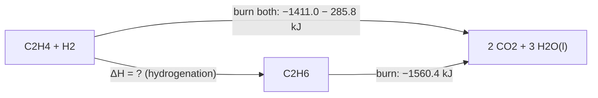

---
aliases:
  - ΔH
  - Enthalpy Change
  - Heat of Reaction
  - Reaction Enthalpy
  - Enthalpie
tags:
  - type/concept
  - domain/chemistry
  - domain/physics
  - level/L1
  - level/L2
  - level/L3
mastery: 0
prerequisites:
  - "[[Laws of Thermodynamics]]"
  - "[[Heat]]"
  - "[[Internal Energy]]"
  - "[[Chemical Bond]]"
  - "[[Stoichiometry]]"
related:
  - "[[Gibbs Free Energy]]"
  - "[[Thermodynamic Entropy]]"
  - "[[Heat Capacity]]"
  - "[[Calorimetry]]"
  - "[[Van 't Hoff Equation]]"
  - "[[Covalent Bond]]"
  - "[[Metabolism]]"
projects: []
sources:
  - "[[Chemistry 2e (OpenStax)]]"
  - "[[MIT 5.111SC - Principles of Chemical Science]]"
  - "[[Yakovchuk 2006 - Base-Stacking and Base-Pairing Contributions into Thermal Stability of the DNA Double Helix]]"
  - "[[Untergasser 2012 - Primer3 New Capabilities and Interfaces]]"
  - "[[NIST Reference on Constants, Units, and Uncertainty]]"
---

# Enthalpy

> [!abstract]
> The enthalpy change ΔH of a reaction is the heat it exchanges with its surroundings at constant pressure, the condition of almost every reaction in a tube or a cell: negative when heat is released (exothermic), positive when heat is absorbed (endothermic).

## Definition

**Enthalpy** is the state function $H = U + PV$, where $U$ is the [[Internal Energy|internal energy]] of the system, $P$ its pressure and $V$ its volume. For a process at constant pressure in which the only work is expansion work, the enthalpy change equals the heat absorbed by the system: $\Delta H = q_p$. A process with $\Delta H < 0$ releases heat (**exothermic**); one with $\Delta H > 0$ absorbs heat (**endothermic**).[^chem5] Enthalpy opens the thermodynamics part of a general chemistry course, before entropy and free energy.[^5111]

## Why it matters

- **Half of free energy.** Whether a reaction, a binding event or a fold is favorable is decided by $\Delta G = \Delta H - T\Delta S$ ([[Gibbs Free Energy]]); $\Delta H$ alone also sets how an equilibrium constant moves with temperature ([[Van 't Hoff Equation]]).
- **Melting temperatures.** The stability of a DNA duplex depends on stacking between neighboring base pairs, whose strength depends on the dinucleotide step.[^yakovchuk] Primer-design software predicts melting temperatures and hairpins with such thermodynamic models,[^primer3] which are tables of $\Delta H$ and $\Delta S$ per step ([[Polymerase Chain Reaction]]).
- **Measured, not only computed.** A calorimeter measures the heat of a process directly;[^chem5] [[Calorimetry]] applied to proteins gives the enthalpy of unfolding and binding that structural and affinity datasets report.
- **Energy bookkeeping of the cell.** The energy content of food is the heat released by its oxidation;[^chem5] [[Metabolism]] releases the same overall $\Delta H$ in steps.

## Core (L1)

### Heat at constant pressure

Split the world into the **system** (the reacting mixture) and the **surroundings**. With the sign convention of chemistry, heat absorbed by the system is positive.[^chem5] An open tube or a cell stays at atmospheric pressure, so the heat it exchanges during a reaction is $\Delta H$.

| | Exothermic | Endothermic |
|---|---|---|
| Sign of $\Delta H$ | negative | positive |
| Heat flows | system → surroundings | surroundings → system |
| Surroundings | warm up | cool down |
| Examples | combustion, freezing of water | melting of ice, evaporation of water |

### Thermochemical equations

A $\Delta H$ belongs to a reaction **as written**, in kJ per mole of reaction:[^chem5]

$$\mathrm{C_2H_6(g) + \tfrac{7}{2}\,O_2(g) \longrightarrow 2\,CO_2(g) + 3\,H_2O(l)} \qquad \Delta H^\circ = -1560.4 \text{ kJ/mol}$$

(computed below from tabulated data). Doubling every coefficient doubles $\Delta H$; writing the reaction backward changes its sign; physical states must be stated, because $\mathrm{H_2O(l)}$ and $\mathrm{H_2O(g)}$ differ by the enthalpy of vaporization.[^chem5]

### Hess's law

Because $H$ is a state function, $\Delta H$ depends only on the initial and final states, not on the path: if a reaction is the sum of several steps, its $\Delta H$ is the sum of theirs (**Hess's law**).[^chem5]



Going from the reactants to the combustion products, then back up to ethane: $\Delta H = -1411.0 - 285.8 + 1560.4 = -136.4$ kJ/mol.

The practical form uses **standard enthalpies of formation** $\Delta H_f^\circ$: the enthalpy change for forming one mole of a compound from its elements in their standard states (1 bar, usually 25 °C). An element in its standard state has $\Delta H_f^\circ = 0$.[^chem5] Then

$$\Delta H^\circ_{\text{rxn}} = \sum_{\text{products}} n\,\Delta H_f^\circ - \sum_{\text{reactants}} n\,\Delta H_f^\circ .$$

### Bond enthalpies

Breaking a bond always costs energy; forming one releases it ([[Chemical Bond]]). With average **bond energies** $D$ (gas phase), a reaction enthalpy can be estimated as[^chem7]

$$\Delta H \approx \sum D(\text{bonds broken}) - \sum D(\text{bonds formed}).$$

| Bond | H–H | C–H | C–C | C=C | C=O | O–H | O=O |
|---|---:|---:|---:|---:|---:|---:|---:|
| $D$ (kJ/mol)[^chem7] | 436 | 415 | 345 | 611 | 741 | 464 | 498 |

A reaction is exothermic when the bonds formed are, in total, stronger than the bonds broken. The values are averages over many molecules, so the estimate is approximate.[^chem7]

## Deeper (L2)

**Enthalpy versus internal energy.** From $H = U + PV$ at constant pressure, $\Delta H = \Delta U + P\Delta V$. Only gases change volume much: for ideal gases at constant $T$ and $P$, $P\Delta V = \Delta n_{\text{gas}} RT$ ([[Ideal Gas Law]]), so $\Delta H = \Delta U + \Delta n_{\text{gas}} RT$, with $RT = 2.48$ kJ/mol at 25 °C.[^nist] For reactions in solution, such as those of biochemistry, $\Delta V$ is tiny and $\Delta H \approx \Delta U$ (Exercise 4).

**Temperature dependence.** Since $(\partial H/\partial T)_P = C_P$, the [[Heat Capacity|heat capacity]] at constant pressure, a reaction enthalpy changes with temperature as $\Delta H(T_2) = \Delta H(T_1) + \Delta C_P\,(T_2 - T_1)$ when $\Delta C_P$, the heat capacity of products minus reactants, is constant. When $\Delta C_P$ is small it is neglected; when it is large, $\Delta H$ depends strongly on temperature and must be reported with the temperature at which it was measured ([[Calorimetry]] measures $\Delta C_P$ directly).

**When bond energies mislead.** A tabulated bond energy is an average over many compounds; one bond's energy depends on the rest of its molecule.[^chem7] Estimates are good to a few percent when the changing bonds are ordinary ones (Worked example) and poor when a product is unusually stabilized, as $\mathrm{CO_2}$ is (Exercise 5). Formation enthalpies, measured for each compound, do not have this problem.

## Advanced (L3)

- **Two ways to measure ΔH.** A calorimeter measures heat directly; the [[Van 't Hoff Equation]] infers $\Delta H$ from how $K$ changes with temperature, assuming a two-state equilibrium. The two numbers agree only if the two-state assumption holds, so comparing them is a test for intermediates in unfolding or melting.
- **Nearest-neighbor thermodynamics is Hess's law.** Duplex stability parameters are tabulated per dinucleotide step,[^yakovchuk] and the $\Delta H$ of a duplex is taken as the sum over its steps plus end corrections: an additive state-function bookkeeping, exactly as in a Hess cycle. The same additivity underlies the energy models of RNA folding ([[RNA Secondary Structure Prediction]]).
- **The cell and the calorimeter.** Oxidizing glucose to $\mathrm{CO_2}$ and $\mathrm{H_2O}$ in a calorimeter or through [[Metabolism]] has the same overall $\Delta H$, since the end states are identical. The pathway changes how the energy is partitioned: part is captured as [[ATP]], the rest is released as heat.
- **Enthalpy is not enough.** Many favorable biological processes are driven by entropy, the [[Hydrophobic Effect]] being the main example; $\Delta H$ must always be read together with $T\Delta S$ ([[Gibbs Free Energy]]).

## Mathematical representation

- $H = U + PV$; differentiating, $dH = dU + P\,dV + V\,dP$. With the first law $dU = \delta q - P\,dV$ (expansion work only) at constant pressure ($dP = 0$): $dH = \delta q_p$, hence $\Delta H = q_p$.
- For a reaction $\sum_i \nu_i X_i = 0$ with signed stoichiometric coefficients $\nu_i$ (positive for products, negative for reactants): $\Delta H^\circ_{\text{rxn}} = \sum_i \nu_i\, \Delta H_f^\circ(X_i)$. Hess's law is the linearity of this sum: adding reactions adds their $\nu$ vectors and therefore their $\Delta H$.
- Bond estimate: $\Delta H \approx \sum_{b} m_b^{\text{broken}} D_b - \sum_{b} m_b^{\text{formed}} D_b$, where $m_b$ counts bonds of type $b$ and $D_b$ is its average bond energy.
- Kirchhoff: $\Delta H(T_2) = \Delta H(T_1) + \int_{T_1}^{T_2} \Delta C_P(T)\, dT$.

## Computational representation

Store data in dictionaries and a reaction as `{species: coefficient}` maps. Hess's law becomes a weighted sum:

```python
# Average bond energies, kJ/mol (Chemistry 2e, Table 7.2)
BOND = {"H-H": 436, "C-H": 415, "C-C": 345, "C=C": 611, "C=O": 741, "O-H": 464, "O=O": 498}
# Standard enthalpies of formation at 298.15 K, kJ/mol (Chemistry 2e, Appendix G)
DHF = {"C2H4(g)": 52.4, "C2H6(g)": -84.0, "H2(g)": 0.0, "O2(g)": 0.0,
       "CO2(g)": -393.5, "H2O(l)": -285.8, "H2O(g)": -241.8}


def dh_bonds(broken: dict, formed: dict) -> float:
    """Estimate: energy to break bonds minus energy released by forming bonds."""
    return (sum(n * BOND[b] for b, n in broken.items())
            - sum(n * BOND[b] for b, n in formed.items()))


def dh_formation(reactants: dict, products: dict) -> float:
    """Hess's law: sum of n * dHf over products minus over reactants."""
    return (sum(n * DHF[s] for s, n in products.items())
            - sum(n * DHF[s] for s, n in reactants.items()))


# C2H4 + H2 -> C2H6
est = dh_bonds({"C=C": 1, "C-H": 4, "H-H": 1}, {"C-C": 1, "C-H": 6})
ref = dh_formation({"C2H4(g)": 1, "H2(g)": 1}, {"C2H6(g)": 1})
print(f"bond energies: {est} kJ/mol, formation enthalpies: {ref:.1f} kJ/mol")

# Same reaction through a cycle of combustions (Hess's law)
comb = {
    "C2H4": dh_formation({"C2H4(g)": 1, "O2(g)": 3}, {"CO2(g)": 2, "H2O(l)": 2}),
    "H2": dh_formation({"H2(g)": 1, "O2(g)": 0.5}, {"H2O(l)": 1}),
    "C2H6": dh_formation({"C2H6(g)": 1, "O2(g)": 3.5}, {"CO2(g)": 2, "H2O(l)": 3}),
}
print({k: round(v, 1) for k, v in comb.items()})
print(f"via combustions: {comb['C2H4'] + comb['H2'] - comb['C2H6']:.1f} kJ/mol")
```

```text
bond energies: -128 kJ/mol, formation enthalpies: -136.4 kJ/mol
{'C2H4': -1411.0, 'H2': -285.8, 'C2H6': -1560.4}
via combustions: -136.4 kJ/mol
```

The two Hess routes agree exactly, as they must for a state function; the bond-energy estimate is off by 6 %.

## Worked example

> [!example] Hydrogenation of ethene, $\mathrm{C_2H_4 + H_2 \to C_2H_6}$
> 1. **Bonds broken**: one C=C (611), one H–H (436), and the four C–H of ethene (4 × 415). **Bonds formed**: one C–C (345) and six C–H (6 × 415). The four C–H bonds present on both sides cancel.
> 2. **Estimate**: $\Delta H \approx (611 + 436) - (345 + 2 \times 415) = 1047 - 1175 = -128$ kJ/mol. Two new C–H bonds and a C–C single bond are stronger, together, than the π part of C=C plus H–H.
> 3. **From formation enthalpies**: $\Delta H^\circ = -84.0 - (52.4 + 0) = -136.4$ kJ/mol.[^appg]
> 4. **Read it**: exothermic, and the bond estimate is within 9 kJ/mol. The sign tells you heat is released; it does not tell you whether the reaction happens without a catalyst ([[Gibbs Free Energy]], [[Catalysis]]).

## Common misconceptions

> [!warning] "Breaking a bond releases energy"
> Breaking a bond always costs energy; energy is released only when the products form stronger bonds than those broken ([[Chemical Bond]]). The "energy-rich bond" of [[ATP]] is shorthand for a favorable overall reaction, not for energy stored in one bond.

> [!warning] "Exothermic means spontaneous"
> Ice melts spontaneously above 0 °C although melting is endothermic: the entropy gain wins. Spontaneity at constant $T$ and $P$ is decided by $\Delta G$, not by $\Delta H$ alone.[^chem16]

> [!warning] "ΔH is the heat of any process"
> $\Delta H = q$ only at constant pressure with expansion work as the only work. At constant volume the heat is $\Delta U$; the two differ by $\Delta n_{\text{gas}}RT$, negligible in solution but not for reactions that make or consume gas.

## Exercises

> [!question] Exercise 1 (L1)
> Classify as exothermic or endothermic, and give the sign of $\Delta H$: (a) water freezing; (b) burning ethane; (c) the reverse of a combustion, $\mathrm{2\,CO_2 + 3\,H_2O(l) \to C_2H_6 + \tfrac{7}{2}O_2}$.

> [!success]- Solution
> (a) Exothermic, $\Delta H < 0$: freezing releases the heat that melting absorbs. (b) Exothermic, $\Delta H = -1560.4$ kJ/mol. (c) Endothermic, $\Delta H = +1560.4$ kJ/mol: reversing a reaction flips the sign.

> [!question] Exercise 2 (L1)
> A diet provides 2000 kcal per day; express it in kJ (1 cal = 4.184 J).[^chem5] How much heat does burning 3.0 g of ethane (molar mass 30.07 g/mol) release?

> [!success]- Solution
> $2000 \times 4.184 = 8368$ kJ. Ethane: $3.0/30.07 = 0.0998$ mol, so $q = 0.0998 \times 1560.4 = 155.7$ kJ released ($\Delta H$ scales with the amount that reacts).

> [!question] Exercise 3 (L2)
> Given $\mathrm{C(s) + O_2 \to CO_2}$, $\Delta H^\circ = -393.5$ kJ/mol, and $\mathrm{CO + \tfrac12 O_2 \to CO_2}$, $\Delta H^\circ = -283.0$ kJ/mol, find $\Delta H^\circ$ for $\mathrm{C(s) + \tfrac12 O_2 \to CO}$, a reaction that cannot be run cleanly in a calorimeter (some $\mathrm{CO_2}$ always forms).

> [!success]- Solution
> Take the first reaction and add the reverse of the second: $\mathrm{C + O_2 + CO_2 \to CO_2 + CO + \tfrac12 O_2}$, i.e. $\mathrm{C + \tfrac12 O_2 \to CO}$. $\Delta H^\circ = -393.5 + 283.0 = -110.5$ kJ/mol, which is $\Delta H_f^\circ(\mathrm{CO})$. Hess's law gives enthalpies of reactions you cannot measure.

> [!question] Exercise 4 (L2)
> For the combustion of ethane with liquid water at 298.15 K, compute $\Delta n_{\text{gas}}$ and $\Delta U$ from $\Delta H = -1560.4$ kJ/mol. Is the difference important?

> [!success]- Solution
> $\Delta n_{\text{gas}} = 2 - (1 + 3.5) = -2.5$. $\Delta U = \Delta H - \Delta n_{\text{gas}}RT = -1560.4 + 2.5 \times 8.314 \times 10^{-3} \times 298.15 = -1554.2$ kJ/mol. A 0.4 % difference: the gas shrinks, the surroundings do work on the system, so slightly more heat leaves at constant pressure than at constant volume.

> [!question] Exercise 5 (L3, Python)
> With `dh_bonds` and `dh_formation`, estimate $\Delta H$ for $\mathrm{C_2H_6 + \tfrac72 O_2 \to 2\,CO_2 + 3\,H_2O(g)}$ from bond energies and compare with formation enthalpies. Assuming the other bond energies are right, what C=O bond energy in $\mathrm{CO_2}$ would make the two agree?

> [!success]- Solution
> ```python
> est = dh_bonds({"C-C": 1, "C-H": 6, "O=O": 3.5}, {"C=O": 4, "O-H": 6})
> ref = dh_formation({"C2H6(g)": 1, "O2(g)": 3.5}, {"CO2(g)": 2, "H2O(g)": 3})
> print(f"estimate {est:.0f}, formation data {ref:.1f}, error {est - ref:.0f} kJ/mol")
> broken = 345 + 6 * 415 + 3.5 * 498
> c_o = (broken - ref - 6 * 464) / 4
> print(f"C=O energy implied in CO2: {c_o:.0f} kJ/mol")
> ```
> Output: `estimate -1170, formation data -1428.4, error 258 kJ/mol`, then `C=O energy implied in CO2: 806 kJ/mol`. The average C=O value (741) comes mostly from aldehydes, ketones and acids; the two C=O bonds of $\mathrm{CO_2}$ are about 65 kJ/mol stronger each, and four of them accumulate a 258 kJ/mol error. Use formation enthalpies whenever they exist.

## Mastery checklist

- [ ] 1 Recognized: I can define $\Delta H$ as heat at constant pressure and tell exothermic from endothermic by its sign.
- [ ] 2 Understood: I can explain why $H$ is a state function and why that makes Hess's law work.
- [ ] 3 Practiced: I can compute $\Delta H$ from formation enthalpies, from a Hess cycle and from bond energies, by hand and in Python.
- [ ] 4 Applied: I can read the $\Delta H$ and $\Delta S$ parameters of a melting-temperature or calorimetry output and say what they mean for stability.
- [ ] 5 Explained: I can teach the limits of bond-energy estimates, the difference between $\Delta H$ and $\Delta U$, and why $\Delta H$ alone does not decide spontaneity.

## References

[^chem5]: [[Chemistry 2e (OpenStax)]], ch. 5 "Thermochemistry" (energy, heat and the calorie, calorimetry and nutritional calories, enthalpy as heat at constant pressure, exothermic and endothermic processes, thermochemical equations, Hess's law, standard enthalpies of formation).
[^chem7]: [[Chemistry 2e (OpenStax)]], ch. 7 "Chemical Bonding and Molecular Geometry", §7.5 "Strengths of Ionic and Covalent Bonds" (average bond energies, Table 7.2; estimating $\Delta H$ from bonds broken and formed).
[^appg]: [[Chemistry 2e (OpenStax)]], Appendix G "Standard Thermodynamic Properties for Selected Substances" ($\Delta H_f^\circ$ of $\mathrm{C_2H_4}$, $\mathrm{C_2H_6}$, $\mathrm{CO_2}$, $\mathrm{H_2O}$).
[^chem16]: [[Chemistry 2e (OpenStax)]], ch. 16 "Thermodynamics", §16.4 "Free Energy".
[^5111]: [[MIT 5.111SC - Principles of Chemical Science]], course description (thermodynamics among the course topics).
[^nist]: [[NIST Reference on Constants, Units, and Uncertainty]], CODATA recommended value of the molar gas constant $R$.
[^yakovchuk]: [[Yakovchuk 2006 - Base-Stacking and Base-Pairing Contributions into Thermal Stability of the DNA Double Helix]], *Nucleic Acids Research*.
[^primer3]: [[Untergasser 2012 - Primer3 New Capabilities and Interfaces]], *Nucleic Acids Research* (thermodynamic models for melting temperature and secondary structure).
