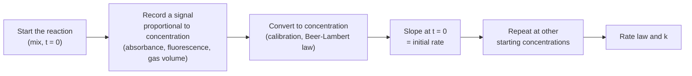

---
aliases:
  - Chemical Kinetics
  - Reaction Rate
  - Rate Constant
  - Molecularity
  - Cinétique chimique
tags:
  - type/concept
  - domain/chemistry
  - domain/biology
  - level/L1
  - level/L2
mastery: 0
prerequisites:
  - "[[Molar Concentration]]"
  - "[[Stoichiometry]]"
  - "[[Derivative]]"
related:
  - "[[Rate Law]]"
  - "[[Activation Energy]]"
  - "[[Catalysis]]"
  - "[[Chemical Equilibrium]]"
  - "[[Reaction Mechanism]]"
  - "[[Michaelis-Menten Kinetics]]"
  - "[[Ordinary Differential Equation]]"
  - "[[Biochemical Kinetic Model]]"
projects: []
sources:
  - "[[Chemistry 2e (OpenStax)]]"
  - "[[Biochemistry (Berg)]]"
  - "[[MIT 5.111SC - Principles of Chemical Science]]"
---

# Reaction Kinetics

> [!abstract]
> Kinetics measures how fast a reaction goes: how quickly reactant concentrations fall and product concentrations rise, and which molecular collisions set that speed.

## Definition

**Reaction kinetics** (chemical kinetics) is the study of reaction rates and of the factors and mechanisms that determine them.[^chem12][^5111] For $a\mathrm{A} + b\mathrm{B} \to c\mathrm{C} + d\mathrm{D}$, the **rate of reaction** is the change of concentration per unit time, divided by the stoichiometric coefficient so that it is the same whichever species is followed:[^chem12]

$$v = -\frac{1}{a}\frac{d[\mathrm{A}]}{dt} = -\frac{1}{b}\frac{d[\mathrm{B}]}{dt} = \frac{1}{c}\frac{d[\mathrm{C}]}{dt} = \frac{1}{d}\frac{d[\mathrm{D}]}{dt}.$$

The **rate constant** $k$ is the proportionality constant that links the rate to concentrations in a [[Rate Law]]; it depends on the reaction and the temperature, not on the concentrations.[^chem12] The **molecularity** of an elementary reaction (a single molecular event) is the number of reactant species that take part in it: unimolecular, bimolecular, rarely termolecular.[^chem12]

## Why it matters

- **Models of the cell are kinetics.** Each arrow in a pathway model is a rate expression, and the model is a system of [[Ordinary Differential Equation|ODEs]] built from them ([[Biochemical Kinetic Model]], [[Systems Biology]]).
- **Enzyme assays measure rates.** Michaelis-Menten parameters are fitted to initial rates measured at several substrate concentrations ([[Michaelis-Menten Kinetics]]).[^berg]
- **Turnover sets abundance.** mRNA and protein levels are the balance of synthesis and decay rates, which genome-scale studies estimate gene by gene ([[Gene Expression]], [[Rate Law]]).
- **Time-course data.** Estimating a slope from noisy concentration-time points is a data-analysis problem: finite differences, curve fitting, choice of the time window.

## Core (L1)

**Rates and stoichiometry.** In $2\,\mathrm{H_2O_2} \to 2\,\mathrm{H_2O} + \mathrm{O_2}$, hydrogen peroxide disappears twice as fast as oxygen appears; dividing by the coefficients gives one rate for the reaction. Rates have units of concentration per time, such as M s⁻¹ or mM min⁻¹.

**Average, instantaneous and initial rates.** The average rate over an interval is $-\Delta[\mathrm{A}]/\Delta t$; the instantaneous rate is the slope of the tangent to the concentration curve at one time, a [[Derivative]]; the **initial rate** is that slope at $t = 0$, before products accumulate and reactants are depleted.[^chem12]

**Rate law and rate constant.** Experiments give a rate law such as $v = k[\mathrm{A}]^m[\mathrm{B}]^n$ ([[Rate Law]]). Its rate constant $k$ has units that depend on the overall order $m + n$:

| Overall order | Rate law (example) | Units of $k$ |
|---:|---|---|
| 0 | $v = k$ | M s⁻¹ |
| 1 | $v = k[\mathrm{A}]$ | s⁻¹ |
| 2 | $v = k[\mathrm{A}][\mathrm{B}]$ | M⁻¹ s⁻¹ |

**Molecularity belongs to elementary steps.** Most reactions proceed through a sequence of elementary steps, the [[Reaction Mechanism]]. For an elementary step, the rate law follows from its molecularity: unimolecular $\mathrm{A} \to$ products has $v = k[\mathrm{A}]$; bimolecular $\mathrm{A} + \mathrm{B} \to$ products has $v = k[\mathrm{A}][\mathrm{B}]$. Termolecular steps are rare because three particles seldom collide at once.[^chem12] For an overall reaction, the rate law must be measured: the coefficients of the balanced equation do not give it.[^chem12]

**Measuring a rate.** Follow the concentration of one species, or any property proportional to it, over time:



Absorbance is the usual signal for coloured or UV-absorbing species ([[Beer-Lambert Law]]). **Bio:** an enzyme assay measures the initial velocity $V_0$ of product formation at fixed enzyme and varied substrate concentrations.[^berg]

## Deeper (L2)

**What changes a rate.** The chemical nature of the reactants, their physical state and surface area, temperature, concentrations and the presence of a catalyst.[^chem12] Temperature acts through the [[Activation Energy]] barrier, catalysts by opening a lower path ([[Catalysis]]).

**Bimolecular rate constants and their ceiling.** Two molecules cannot react faster than they meet by diffusion. For enzymes, the ratio $k_{\mathrm{cat}}/K_M$ of the most efficient ones approaches this diffusion-controlled limit, about $10^8$ to $10^9$ M⁻¹ s⁻¹.[^berg] When one partner is in large excess, its concentration is effectively constant and the bimolecular step behaves as first order with $k' = k[\mathrm{B}]$ (pseudo-first-order; [[Diffusion-Limited Reaction]], Exercise 5).

**Fast is not the same as favourable.** Kinetics says how fast equilibrium is approached; thermodynamics says where equilibrium lies ([[Gibbs Free Energy]], [[Chemical Equilibrium]]). For a reversible elementary step $\mathrm{A} \rightleftharpoons \mathrm{B}$, equal forward and reverse rates at equilibrium give $k_f[\mathrm{A}]_{eq} = k_r[\mathrm{B}]_{eq}$, so $K = k_f/k_r$: a reaction can have a huge $K$ and a negligible rate.

**Mechanism and the slow step.** When one step of a mechanism is much slower than the others, it limits the overall rate (the rate-determining step), and the overall rate law reflects that step.[^chem12] When no step dominates, the [[Steady-State Approximation]] derives the rate law.

## Mathematical representation

For a reaction with stoichiometric coefficients $\nu_i$ (negative for reactants, positive for products), the rate $v$ links every species: $\dfrac{d[X_i]}{dt} = \nu_i\, v$. For several reactions $j$ with rates $v_j$, this becomes a vector equation

$$\frac{d\mathbf{c}}{dt} = S\,\mathbf{v}(\mathbf{c}),$$

where $\mathbf{c}$ is the vector of concentrations, $S$ the [[Stoichiometric Matrix]] (rows = species, columns = reactions) and $\mathbf{v}$ the vector of rate laws. For elementary steps, mass action gives $v_j = k_j \prod_i [X_i]^{m_{ij}}$, with $m_{ij}$ the number of molecules of species $i$ consumed by step $j$. This is the general form of a kinetic model of a pathway.

## Computational representation

Rates are estimated from sampled concentrations by finite differences. A two-point slope from the first interval underestimates the initial rate when the curve bends; a three-point formula corrects for curvature.

```python
def average_rates(t: list[float], c: list[float]) -> list[float]:
    """Average rate of disappearance, -(delta c)/(delta t), over each interval."""
    return [-(c[i + 1] - c[i]) / (t[i + 1] - t[i]) for i in range(len(t) - 1)]

def initial_rate(t: list[float], c: list[float]) -> float:
    """Slope of the tangent at t[0] by a three-point forward difference (equal spacing)."""
    h = t[1] - t[0]
    return -(-3 * c[0] + 4 * c[1] - c[2]) / (2 * h)

# invented data: [H2O2] in mM for 2 H2O2 -> 2 H2O + O2
t = [0, 2, 4, 6, 8, 10]                      # min
c = [100.0, 81.9, 67.0, 54.9, 44.9, 36.8]    # mM
print("average rates:", [round(r, 2) for r in average_rates(t, c)])
r0 = initial_rate(t, c)
print("initial rate of H2O2 loss:", round(r0, 2), "mM/min")
print("rate of reaction:", round(r0 / 2, 2), "mM/min; O2 formed at", round(r0 / 2, 2), "mM/min")
```

```text
average rates: [9.05, 7.45, 6.05, 5.0, 4.05]
initial rate of H2O2 loss: 9.85 mM/min
rate of reaction: 4.92 mM/min; O2 formed at 4.92 mM/min
```

The invented data follow a first-order decay with an exact initial slope of 10 mM/min: the three-point estimate (9.85) is much closer than the first average rate (9.05).

## Worked example

> [!example] Reading rates from a concentration table (invented data above)
> 1. **Average rates** fall from 9.05 to 4.05 mM/min: the reaction slows as $\mathrm{H_2O_2}$ is used up, so the rate depends on concentration.
> 2. **Initial rate**: the tangent at $t = 0$, estimated at 9.85 mM/min of $\mathrm{H_2O_2}$ lost.
> 3. **Rate of reaction**: divide by the coefficient 2: $v_0 = 4.92$ mM/min. Oxygen forms at $1 \times v_0 = 4.92$ mM/min and water at $2 \times v_0$.
> 4. **Next step**: repeating the experiment at 50 mM starting peroxide and comparing initial rates gives the order ([[Rate Law]]).

## Common misconceptions

> [!warning] "The rate law can be read from the balanced equation"
> Only for an elementary step. The overall equation hides the mechanism; orders must be measured.[^chem12]

> [!warning] "The rate constant is the rate"
> $k$ is the rate per unit of concentration factors. The rate falls as reactants are consumed; $k$ does not, at constant temperature.

> [!warning] "A reaction with a large equilibrium constant is fast"
> $K$ fixes where the reaction ends, not how fast it gets there. Kinetics and thermodynamics answer different questions.

## Exercises

> [!question] Exercise 1 (L1)
> In $\mathrm{N_2} + 3\,\mathrm{H_2} \to 2\,\mathrm{NH_3}$, $\mathrm{N_2}$ is consumed at 0.10 M s⁻¹. Give the rates of $\mathrm{H_2}$ consumption, $\mathrm{NH_3}$ formation and the rate of reaction.

> [!success]- Solution
> $\mathrm{H_2}$: $3 \times 0.10 = 0.30$ M s⁻¹ consumed. $\mathrm{NH_3}$: $2 \times 0.10 = 0.20$ M s⁻¹ formed. Rate of reaction: $-d[\mathrm{N_2}]/dt / 1 = 0.10$ M s⁻¹, the same whichever species is used after dividing by its coefficient.

> [!question] Exercise 2 (L1)
> Give the molecularity and rate law of the elementary steps (a) $\mathrm{NO_2} + \mathrm{NO_2} \to \mathrm{NO_3} + \mathrm{NO}$ and (b) a protein conformational change $\mathrm{P} \to \mathrm{P^*}$. Can you write the rate law of the overall reaction $2\,\mathrm{NO} + \mathrm{O_2} \to 2\,\mathrm{NO_2}$ from its equation?

> [!success]- Solution
> (a) Bimolecular, $v = k[\mathrm{NO_2}]^2$. (b) Unimolecular, $v = k[\mathrm{P}]$. The third is an overall equation: its rate law depends on its mechanism and must be determined experimentally.

> [!question] Exercise 3 (L2)
> For an elementary step $\mathrm{A} + \mathrm{B} \to \mathrm{C}$, the initial rate is $2.0 \times 10^{-4}$ M s⁻¹ when $[\mathrm{A}] = 0.010$ M and $[\mathrm{B}] = 0.020$ M. Find $k$ with its units, and the initial rate when both concentrations are doubled.

> [!success]- Solution
> $k = v/([\mathrm{A}][\mathrm{B}]) = 2.0 \times 10^{-4}/(0.010 \times 0.020) = 1.0$ M⁻¹ s⁻¹. Doubling both multiplies the rate by $2 \times 2 = 4$: $8.0 \times 10^{-4}$ M s⁻¹.

> [!question] Exercise 4 (L2, Python)
> With `average_rates` and `initial_rate`, explain why the first average rate (9.05) underestimates the initial rate of the invented data, and what sampling choice would reduce the bias of a two-point estimate.

> [!success]- Solution
> The concentration curve is convex (it flattens with time), so the secant over $[0, 2]$ min is less steep than the tangent at $t = 0$. The bias shrinks with the interval: sampling more densely at the start, or fitting a curve through the first points (the three-point formula is the simplest case), approaches the tangent. In practice, initial rates are taken while less than a small fraction of substrate has been consumed, where the curve is nearly straight.

> [!question] Exercise 5 (L2)
> A protein binds its partner with a bimolecular rate constant $k = 10^8$ M⁻¹ s⁻¹, near the diffusion limit. The partner is present at 1 µM, in large excess. Give the pseudo-first-order rate constant and the mean waiting time before binding.

> [!success]- Solution
> $k' = k[\mathrm{B}] = 10^8 \times 10^{-6} = 100$ s⁻¹; the mean waiting time is $1/k' = 0.01$ s = 10 ms. Binding in cells is fast but not instantaneous; at 1 nM partner it would take 10 s, so concentration matters as much as the rate constant.

## Mastery checklist

- [ ] 1 Recognized: I can define reaction rate, rate constant and molecularity.
- [ ] 2 Understood: I can relate the rates of different species through stoichiometry and explain why overall equations do not give rate laws.
- [ ] 3 Practiced: I can estimate average and initial rates from data and give the units of $k$ for each order, by hand and in Python.
- [ ] 4 Applied: I can design a rate measurement (signal, calibration, sampling) and write the ODEs of a small reaction network.
- [ ] 5 Explained: I can teach the difference between kinetics and thermodynamics, the role of the slow step and the diffusion limit.

## References

[^chem12]: [[Chemistry 2e (OpenStax)]], ch. 12 "Kinetics" (chemical reaction rates and their relation to stoichiometry, average, instantaneous and initial rates, factors affecting rates, rate laws and rate constants, elementary reactions and molecularity, rate-determining steps).
[^berg]: [[Biochemistry (Berg)]], 5th ed. (2002), treatment of enzyme kinetics (initial velocity measurements, $k_{\mathrm{cat}}/K_M$ and the diffusion-controlled limit of about $10^8$ to $10^9$ M⁻¹ s⁻¹).
[^5111]: [[MIT 5.111SC - Principles of Chemical Science]], course description (chemical kinetics and catalysis).
