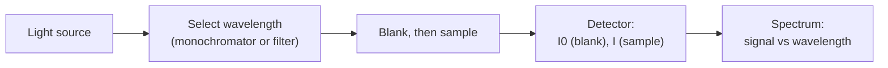

---
aliases:
  - Absorption Spectroscopy
  - Emission Spectroscopy
  - Spectrum
  - Spectroscopie
tags:
  - type/technique
  - domain/chemistry
  - domain/physics
  - domain/biology
  - level/L1
  - level/L2
mastery: 0
prerequisites:
  - "[[Photon]]"
  - "[[Electromagnetic Spectrum]]"
  - "[[Atomic Orbital]]"
  - "[[Electron Configuration]]"
related:
  - "[[Beer-Lambert Law]]"
  - "[[Fluorescence]]"
  - "[[Circular Dichroism]]"
  - "[[Nuclear Magnetic Resonance Spectroscopy]]"
  - "[[Mass Spectrometry]]"
  - "[[Boltzmann Distribution]]"
  - "[[Molecular Orbital Theory]]"
projects: []
sources:
  - "[[Chemistry 2e (OpenStax)]]"
  - "[[University Physics (OpenStax)]]"
  - "[[Organic Chemistry (OpenStax)]]"
  - "[[Biochemistry (Berg)]]"
  - "[[Steen 2004 - The ABC's and XYZ's of Peptide Sequencing]]"
---

# Spectroscopy

> [!abstract]
> Spectroscopy shines light on molecules and records which energies they absorb or emit; because each kind of molecular motion has its own ladder of allowed energies, the spectrum tells you what is there, how much, and in what state.

## Purpose

Spectroscopy measures how matter absorbs, emits or otherwise interacts with electromagnetic radiation as a function of wavelength or frequency.[^chem][^up] In biology it answers three questions: **how much** (concentration of DNA, protein or a cofactor, [[Beer-Lambert Law]]), **what** (which chemical groups are present) and **in what state** (folded or unfolded, bound or free, its 3D structure).[^berg]

## Why it matters

- **Every sample is quantified by spectroscopy first.** Nucleic acid and protein concentrations from UV absorbance gate library preparation and assays ([[Beer-Lambert Law]]).
- **Sequencing, qPCR and imaging read light.** Their raw signals are fluorescence spectra filtered into channels ([[Fluorescence]], [[Quantitative Polymerase Chain Reaction]]).
- **Structures from spectra.** NMR spectroscopy determines protein structures in solution, a source of entries in structure databases ([[Nuclear Magnetic Resonance Spectroscopy]]).[^berg]
- **Spectra are data.** A spectrum is a vector of intensities over a wavelength grid: baseline correction, peak finding, deconvolution and calibration are signal-processing tasks.

## Principle

**Light comes in photons.** A photon of frequency $\nu$ and wavelength $\lambda$ carries energy $E = h\nu = hc/\lambda$, where $h$ is Planck's constant and $c$ the speed of light: shorter wavelength means higher energy ([[Photon]]).[^chem][^up]

**Matter has quantized energy levels.** An atom or molecule can exist only in certain energy states. It **absorbs** a photon only when the photon energy matches the gap between two of its levels, $h\nu = \Delta E$, and **emits** a photon of that energy when it falls back down.[^chem][^up] A spectrum is therefore a map of energy gaps.

**Each kind of motion has its own ladder.** In molecules, electronic levels are widely spaced, vibrational levels less so, rotational levels closer still; in a strong magnetic field, nuclear spin states split by tiny energies. Each ladder is probed by its own spectral region.[^up][^orgchem]

![[spectral-regions-transitions.svg]]

| Region | Typical photon energy | Transition probed | Technique and biological use |
|---|---|---|---|
| ultraviolet, visible | a few eV | electronic (valence electrons, conjugated systems) | UV-vis absorption: A260 of nucleic acids, A280 of proteins[^berg][^orgchem] |
| infrared | about 0.1 eV | molecular vibrations (bond stretching and bending) | IR spectroscopy: functional groups[^orgchem] |
| microwave | about $10^{-4}$ eV | molecular rotations | rotational spectroscopy of gases[^up] |
| radio (in a magnet) | about $10^{-6}$ eV | nuclear spin orientation | NMR: structure and dynamics of molecules[^orgchem][^berg] |

## Protocol overview



An absorption measurement compares the light reaching the detector through the sample with the light through a blank of solvent alone, wavelength by wavelength; an emission measurement excites the sample and records the light it gives off, usually at an angle to the excitation beam.

## Core (L1)

**Photon energies across the spectrum.** Computed below and compared with the thermal energy $RT \approx 2.58$ kJ/mol at 37 °C: 460 kJ/mol for a 260 nm UV photon, 239 for visible light at 500 nm, 12 for an infrared photon at 10 µm, 0.012 for a 1 cm microwave and $2.4 \times 10^{-4}$ for a 600 MHz radio photon. A UV photon carries nearly 180 times the thermal energy, a radio photon about a ten-thousandth of it. Band positions identify transitions; band intensities scale with the number of molecules, which is what makes quantification possible ([[Beer-Lambert Law]], [[Fluorescence]]).

## Deeper (L2)

**Quantization, seen in hydrogen.** Heated hydrogen emits light only at specific wavelengths. Bohr's model (1913) explained them by quantized electron energies; the Rydberg equation $1/\lambda = R_H(1/n_1^2 - 1/n_2^2)$ predicts the lines, with $n_1 = 2$ for the visible Balmer series (656, 486, 434 and 410 nm, computed below).[^chem]

**Molecules give bands, not lines.** Each electronic level of a molecule carries its own vibrational and rotational sublevels, so an electronic transition is a family of slightly different gaps; in solution, collisions blur them further into broad bands.[^up] UV-vis spectra of biomolecules are therefore smooth curves with a few maxima, good for quantification but poor for identification.

**Populations matter.** Absorption needs molecules in the lower level. By the [[Boltzmann Distribution]], the ratio of upper to lower populations is $e^{-\Delta E/k_BT}$: essentially zero for UV-vis gaps, but 0.99991 for a 600 MHz nuclear-spin gap at 37 °C (code below). Net NMR absorption comes from that tiny excess in the lower level, which is why NMR needs concentrated samples and strong magnets.

## Data produced

A spectrum is a list of (x, signal) pairs: wavelength in nm for UV-vis, wavenumber in cm⁻¹ ($\tilde\nu = 1/\lambda$) for IR, chemical shift in ppm for NMR; the signal is absorbance, transmittance or emitted intensity. Instruments export text tables such as CSV; plate readers export one value per well and wavelength. Noise, a sloping baseline (scattering, cuvette, solvent) and detector saturation at high signal are the usual errors.

## Analysis

Subtract the blank (solvent, cuvette), then a smooth baseline; find peaks, whose positions identify transitions and whose shoulders hint at overlapping species; quantify from peak height or area with a calibration or the [[Beer-Lambert Law]]; flag contaminants with ratios at two wavelengths; decompose mixtures as sums of reference spectra (a least-squares problem).

## Mathematical representation

$$E = h\nu = \frac{hc}{\lambda} = hc\,\tilde{\nu}, \qquad E_{\text{molar}} = N_A E, \qquad \frac{N_{\text{upper}}}{N_{\text{lower}}} = e^{-\Delta E / k_B T},$$

with $h = 6.626 \times 10^{-34}$ J s, $c = 2.998 \times 10^8$ m/s, $N_A$ Avogadro's number, $k_B$ Boltzmann's constant, $\tilde\nu$ wavenumber, $T$ temperature.[^chem] Absorption occurs when $E = \Delta E$ between two allowed levels. For hydrogen, $1/\lambda = R_H(1/n_1^2 - 1/n_2^2)$ with $R_H = 1.097 \times 10^7$ m⁻¹.[^chem]

## Computational representation

```python
import math

H, C, NA, KB, EV = 6.62607015e-34, 2.99792458e8, 6.02214076e23, 1.380649e-23, 1.602176634e-19
RYDBERG = 1.097e7  # m^-1, hydrogen

def photon(wavelength_m: float) -> tuple[float, float]:
    """Energy of one photon in eV and of one mole of photons in kJ/mol."""
    e = H * C / wavelength_m
    return e / EV, e * NA / 1000

def upper_over_lower(wavelength_m: float, t_k: float = 310.15) -> float:
    """Boltzmann population ratio of two levels separated by the photon energy."""
    return math.exp(-H * C / wavelength_m / (KB * t_k))

def balmer(n: int) -> float:
    """Wavelength (nm) of the hydrogen line from level n down to level 2."""
    return 1e9 / (RYDBERG * (1 / 2**2 - 1 / n**2))

examples = {"UV 260 nm": 260e-9, "visible 500 nm": 500e-9, "IR 10 um": 10e-6,
            "microwave 1 cm": 1e-2, "radio 600 MHz": C / 600e6}
for name, lam in examples.items():
    ev, kj = photon(lam)
    print(f"{name:15s} {ev:9.3g} eV {kj:9.3g} kJ/mol  upper/lower at 37 C = {upper_over_lower(lam):.5g}")
print("RT at 37 C =", round(8.314 * 310.15 / 1000, 2), "kJ/mol")
print("Balmer lines (nm):", [round(balmer(n)) for n in (3, 4, 5, 6)])
```

```text
UV 260 nm            4.77 eV       460 kJ/mol  upper/lower at 37 C = 3.2533e-78
visible 500 nm       2.48 eV       239 kJ/mol  upper/lower at 37 C = 5.0864e-41
IR 10 um            0.124 eV        12 kJ/mol  upper/lower at 37 C = 0.0096676
microwave 1 cm   0.000124 eV     0.012 kJ/mol  upper/lower at 37 C = 0.99537
radio 600 MHz    2.48e-06 eV  0.000239 kJ/mol  upper/lower at 37 C = 0.99991
RT at 37 C = 2.58 kJ/mol
Balmer lines (nm): [656, 486, 434, 410]
```

## Worked example

> [!example] Which transition does a 280 nm photon drive?
> 1. $E = hc/\lambda = (6.626 \times 10^{-34} \times 2.998 \times 10^8)/(280 \times 10^{-9}) = 7.09 \times 10^{-19}$ J per photon.
> 2. Per mole: $\times N_A = 427$ kJ/mol, or 4.43 eV.
> 3. Compare with the ladders: far above vibrational gaps (about 10 kJ/mol) and thermal energy (2.6 kJ/mol), in the range of electronic transitions.
> 4. Conclusion: absorption at 280 nm excites electrons of aromatic rings, which is why it reports aromatic amino acids and serves to quantify proteins ([[Beer-Lambert Law]]).[^berg]

## Limitations and biases

> [!warning]
> - **Overlap and scattering.** Broad UV-vis bands of different molecules overlap, so contaminants add to the signal; particles and aggregates deflect light, which the detector counts as absorbance.
> - **Range.** Very weak and very strong absorbances are both unreliable: little light is removed, or too little reaches the detector.
> - **Sensitivity and environment.** Small energy gaps mean small population differences (NMR needs high concentrations); band positions and intensities shift with solvent, pH and binding, which informs but also biases calibrations.

## Common misconceptions

> [!warning] "Mass spectrometry is a kind of spectroscopy"
> Despite the name, it absorbs no photons: a mass spectrometer measures the masses (mass-to-charge ratios) of ions ([[Mass Spectrometry]]).[^steen]

> [!warning] "A molecule absorbs any photon with enough energy"
> Absorption needs a match between the photon energy and an allowed gap; a photon between two gaps passes through. Excess energy is not simply "used up".

## History and variants

The hydrogen line spectrum and Bohr's 1913 model introduced quantized energy levels.[^chem] **Absorption (UV-vis, IR)**, **emission ([[Fluorescence]], [[Förster Resonance Energy Transfer]])**, **[[Circular Dichroism]]** and **[[Nuclear Magnetic Resonance Spectroscopy]]** are the variants used most in molecular biology; [[X-ray Crystallography]] relies on diffraction instead.

## Exercises

> [!question] Exercise 1 (L1)
> Assign each photon to the transition it probes: (a) 260 nm, (b) an IR band at 1650 cm⁻¹, (c) radio waves in a 14 T magnet.

> [!success]- Solution
> (a) Electronic transition (UV): bases of nucleic acids. (b) $\lambda = 1/\tilde\nu = 6.06$ µm, infrared: a bond vibration (about 19.7 kJ/mol). (c) Nuclear spin transition: NMR.

> [!question] Exercise 2 (L2)
> A dye (invented values) absorbs at 488 nm and emits at 509 nm. How much energy per mole of photons is not re-emitted, and where does it go?

> [!success]- Solution
> $E = hcN_A/\lambda$: 245.1 kJ/mol absorbed, 235.0 kJ/mol emitted, 10.1 kJ/mol lost per mole of photons. Emission is at longer wavelength because part of the energy is dissipated as heat before the molecule emits ([[Fluorescence]]).

> [!question] Exercise 3 (L2, Python)
> Using `upper_over_lower`, compute the excess fraction of molecules in the lower level, $(N_{\text{lower}} - N_{\text{upper}})/(N_{\text{lower}} + N_{\text{upper}})$, for a 600 MHz NMR transition at 37 °C and for an IR vibration at 10 µm. What does the comparison imply?

> [!success]- Solution
> ```python
> for name, lam in (("radio 600 MHz", C / 600e6), ("IR 10 um", 10e-6)):
>     r = upper_over_lower(lam)
>     print(name, f"{(1 - r) / (1 + r):.3g}")
> # radio 600 MHz 4.64e-05
> # IR 10 um 0.981
> ```
>
> For NMR only about 5 nuclei in 100,000 are in excess in the lower level, against 98 % for the vibration. NMR signals are intrinsically weak, which is why the technique needs concentrated samples and strong magnets (the spin-state gap grows with the field).[^orgchem]

## Mastery checklist

- [ ] 1 Recognized: I can state $E = h\nu = hc/\lambda$ and name the transition probed by UV-vis, IR and NMR.
- [ ] 2 Understood: I can explain absorption and emission as transitions between quantized levels and why molecular spectra are bands.
- [ ] 3 Practiced: I can convert between wavelength, wavenumber, frequency, eV and kJ/mol, and compute population ratios, by hand and in Python.
- [ ] 4 Applied: I can process a measured spectrum (blank, baseline, peaks) and choose the right technique for a biological question.
- [ ] 5 Explained: I can teach why NMR is insensitive, why UV-vis quantifies but rarely identifies, and the limits of each method.

## References

[^chem]: [[Chemistry 2e (OpenStax)]], treatment of electromagnetic energy and electronic structure (photon energy $E = h\nu$, $c = \lambda\nu$, line spectra of hydrogen, Bohr's 1913 model, the Rydberg equation) (chapter number not verified).
[^up]: [[University Physics (OpenStax)]], Volume 3, Unit 2 "Modern Physics" (photons, atomic structure and transitions, molecular spectra with rotational and vibrational levels).
[^orgchem]: [[Organic Chemistry (OpenStax)]], treatment of structure determination (the electromagnetic spectrum, infrared spectroscopy of bond vibrations, nuclear magnetic resonance spectroscopy, ultraviolet spectroscopy of conjugated compounds) (chapter numbers not verified).
[^berg]: [[Biochemistry (Berg)]], 5th ed. (2002), treatment of exploring proteins and nucleic acids (UV absorbance of aromatic amino acids and of bases, NMR spectroscopy of proteins in solution).
[^steen]: [[Steen 2004 - The ABC's and XYZ's of Peptide Sequencing]], *Nature Reviews Molecular Cell Biology* 5:699-711 (mass measurement of peptides).
