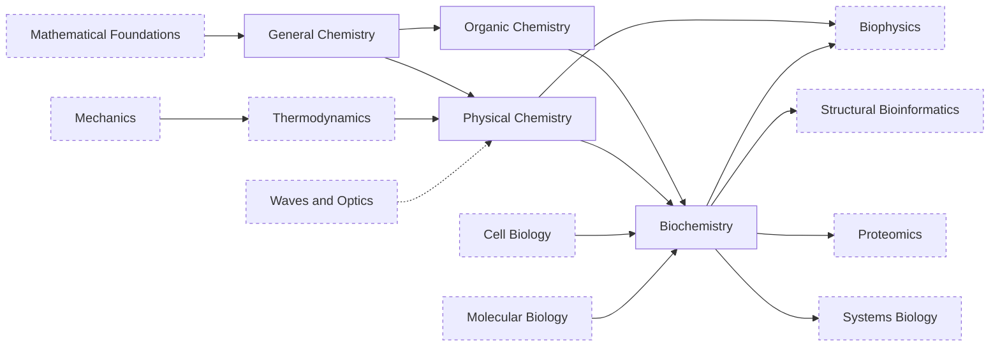

---
aliases:
  - Chimie
tags:
  - type/moc
  - domain/chemistry
  - domain/biology
  - level/L1
  - level/L2
  - level/L3
prerequisites:
  - "[[Mathematical Foundations]]"
projects:
  - "[[02-sequence-translation]]"
  - "[[06-mutation-lab]]"
  - "[[bio-core]]"
sources:
  - "[[MIT 5.111SC - Principles of Chemical Science]]"
  - "[[MIT 5.12 - Organic Chemistry I]]"
  - "[[MIT 5.07SC - Biological Chemistry I]]"
  - "[[Chemistry 2e (OpenStax)]]"
  - "[[Organic Chemistry (OpenStax)]]"
  - "[[Lehninger Principles of Biochemistry (Nelson)]]"
  - "[[Biochemistry (Berg)]]"
  - "[[MIT - Course 7 Biology]]"
  - "[[MIT - Course 6-7 Computer Science and Molecular Biology]]"
  - "[[ETH Zurich - BSc Biology]]"
  - "[[Carnegie Mellon University - BS Computational Biology]]"
  - "[[UC San Diego - BS Bioinformatics]]"
  - "[[Tsinghua University - BS Biological Sciences]]"
---

# Chemistry

> [!abstract]
> The chemistry needed to read biological molecules as physical objects: atoms, bonds and solutions (general chemistry), functional groups and stereochemistry of biomolecules (organic chemistry), energy, equilibrium and rates (physical chemistry), converging on proteins, enzymes and metabolism (biochemistry).

## Why it matters for bioinformatics

- **Sequences are molecules.** A protein folds because of [[Hydrogen Bond|hydrogen bonds]], the [[Hydrophobic Effect]] and the chemistry of each [[Amino Acid]] side chain. A missense variant matters when it changes that chemistry.
- **Structure and drug design compute energies.** Docking, affinity prediction and molecular dynamics estimate [[Gibbs Free Energy|free energies]] and forces between atoms.
- **Proteomics weighs molecules.** Peptide masses depend on [[Isotope|isotopes]], charge states and [[Post-Translational Modification|modifications]].
- **Systems biology is quantitative biochemistry.** Metabolic models are [[Stoichiometry]] written as a matrix ([[Flux Balance Analysis]]); dynamic models use [[Michaelis-Menten Kinetics]] and [[Chemical Equilibrium|equilibrium]] constants.
- **Wet-lab data carry chemical assumptions.** [[pH]] and [[Buffer Solution|buffers]], [[Beer-Lambert Law|absorbance]] ratios (A260/A280), [[Fluorescence]] readouts and melting temperatures all come from this domain.

## Target level and weight

Target: **L2** for [[General Chemistry]], [[Organic Chemistry]] and [[Physical Chemistry]]; **L3** for [[Biochemistry]], which is the heaviest subdomain (34 of the domain's 112 concepts). Chemistry is the second life-science domain after [[Biology]] and weighs more than [[Physics]].

The weight follows the programs in the benchmark. General chemistry is taken early everywhere (MIT's science core, ETH year 1, UC San Diego's lower division) and biochemistry is a core requirement at MIT, Carnegie Mellon, UC San Diego, Tsinghua and ETH.[^mit7][^cmu][^ucsd][^thu][^eth] Organic chemistry is required by both MIT majors and by UC San Diego.[^mit7][^mit67][^ucsd] Physical chemistry (thermodynamics and kinetics) is a separate MIT requirement.[^mit7][^mit67] ETH gives first-year chemistry more than twice the credits of physics.[^eth]

## Subdomains

| Subdomain | Stage | Target | Scope |
|---|---|---|---|
| [[General Chemistry]] | 1 | L1-L2 | Atoms, bonds, molecular shape, intermolecular forces, amounts and concentrations, acid-base and redox reactions |
| [[Organic Chemistry]] | 2 | L1-L2 | Structures, functional groups, stereochemistry and the reaction types of metabolism, read on biomolecules |
| [[Physical Chemistry]] | 2 (its Stage 1, before Biochemistry) and 3 | L1-L2 | Enthalpy and free energy, equilibrium, pH and buffers, kinetics, electrochemistry, spectroscopy basics |
| [[Biochemistry]] | 2 (L1-L2) and 3 (L3) | L3 | Protein structure levels and folding, binding, enzymes and kinetics, metabolism and bioenergetics |

> [!tip] Order of study
> Stage 1: General Chemistry. Stage 2: [[Thermodynamics]] Stage 1, then Physical Chemistry Stage 1, then Organic Chemistry and Biochemistry in parallel. Stage 3: Physical Chemistry Stage 2 (read [[Steady-State Approximation]] just before [[Michaelis-Menten Kinetics]]) and Biochemistry Stage 3.

## Dependencies

Dashed boxes are MOCs of other domains. The dotted arrow is a partial dependency: only spectroscopy needs optics.

## Cross-domain prerequisites

- [[Mathematical Foundations]]: [[Exponential Function]] and [[Logarithm]] (pH, first-order decay, equilibrium constants).
- [[Calculus]]: [[Derivative]] and [[Integral]] (rate laws).
- [[Thermodynamics]] ([[Physics]]): [[Laws of Thermodynamics]] and [[Thermodynamic Entropy]] before [[Gibbs Free Energy]].
- [[Waves and Optics]] ([[Physics]]): [[Photon]] and [[Electromagnetic Spectrum]] before [[Spectroscopy]].
- [[Cell Biology]] and [[Molecular Biology]] (Stage 1): [[Cell]], [[Cell Membrane]], [[Nucleotide]], [[Central Dogma]] before Biochemistry.
- Leads to: [[Biophysics]], [[Structural Bioinformatics]], [[Proteomics]], [[Systems Biology]], [[Drug Discovery]].

## Reference courses

| Course | Institution | Level | Covers |
|---|---|---|---|
| [[MIT 5.111SC - Principles of Chemical Science]] | MIT | L1 | General chemistry taught with biological molecules: structure, thermodynamics, equilibria, kinetics[^5111] |
| [[MIT 5.12 - Organic Chemistry I]] | MIT | L2 | Conformations, functional groups, aromaticity, carbonyl chemistry[^512] |
| [[MIT 5.07SC - Biological Chemistry I]] | MIT | L2 | Protein structure, catalysis and cofactors, core metabolic pathways and their regulation[^507] |

## Reference books

- [[Chemistry 2e (OpenStax)]]: general chemistry and the physical chemistry of Stage 1 (thermochemistry, kinetics, equilibria, acid-base).[^chem2e]
- [[Organic Chemistry (OpenStax)]]: stereochemistry, then the biomolecule and metabolic-pathway chapters.[^mcmurry]
- [[Lehninger Principles of Biochemistry (Nelson)]]: the current standard biochemistry text.[^lehninger]
- [[Biochemistry (Berg)]]: free 5th edition, structure-first.[^berg]

## Lab projects

- [[02-sequence-translation]]: translates codons into [[Amino Acid|amino acids]].
- [[06-mutation-lab]]: shows how a substitution reaches the [[Protein]]; side-chain chemistry decides whether a missense change is conservative.
- [[bio-core]]: models [[Protein]] as a typed domain object.

## References

[^mit7]: [[MIT - Course 7 Biology]]: GIR chemistry (5.111, 5.112 or 3.091) taken first; 5.12 Organic Chemistry I; 5.601 and 5.602 Thermodynamics I, Thermodynamics II and Kinetics; 7.05 General Biochemistry or 5.07.
[^mit67]: [[MIT - Course 6-7 Computer Science and Molecular Biology]]: chemistry block with 5.12 Organic Chemistry I and 5.601 Thermodynamics I; 7.05 (or 5.07) in the biology foundation.
[^eth]: [[ETH Zurich - BSc Biology]]: chemistry 13 ECTS and physics 6 ECTS in year 1; chemistry 3 ECTS and biochemistry 5 ECTS in year 2.
[^cmu]: [[Carnegie Mellon University - BS Computational Biology]]: 09-105 Introduction to Modern Chemistry I (general science core); 03-232 Biochemistry I (biological core).
[^ucsd]: [[UC San Diego - BS Bioinformatics]]: CHEM 6A-6B and CHEM 40A-40B in the lower division; BIBC 100 Structural Biochemistry or BIBC 102 Metabolic Biochemistry in the upper division.
[^thu]: [[Tsinghua University - BS Biological Sciences]]: university chemistry and organic chemistry among the natural-science foundations; Biochemistry (1) and (2) and a biochemistry laboratory in the major.
[^5111]: [[MIT 5.111SC - Principles of Chemical Science]], course description.
[^512]: [[MIT 5.12 - Organic Chemistry I]], lecture handout titles.
[^507]: [[MIT 5.07SC - Biological Chemistry I]], course modules.
[^chem2e]: [[Chemistry 2e (OpenStax)]], ch. 5 "Thermochemistry", ch. 12 "Kinetics", ch. 13 "Fundamental Equilibrium Concepts", ch. 14 "Acid-Base Equilibria".
[^mcmurry]: [[Organic Chemistry (OpenStax)]], ch. 5 "Stereochemistry at Tetrahedral Centers", ch. 26 "Biomolecules: Amino Acids, Peptides, and Proteins", ch. 29 "The Organic Chemistry of Metabolic Pathways".
[^lehninger]: [[Lehninger Principles of Biochemistry (Nelson)]], 8th ed., parts on structure and catalysis and on bioenergetics and metabolism.
[^berg]: [[Biochemistry (Berg)]], 5th ed., parts on the molecular design of life, enzymes and metabolism.
