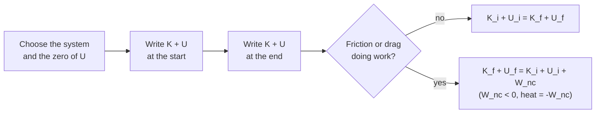

---
aliases:
  - Energy Conservation
  - Conservation of Mechanical Energy
  - Conservation de l'énergie
tags:
  - type/concept
  - domain/physics
  - domain/computer-science
  - level/L1
  - level/L2
  - level/L3
mastery: 0
prerequisites:
  - "[[Work (Physics)]]"
  - "[[Kinetic Energy]]"
  - "[[Potential Energy]]"
related:
  - "[[Harmonic Oscillator]]"
  - "[[Momentum]]"
  - "[[Heat]]"
  - "[[Internal Energy]]"
  - "[[Laws of Thermodynamics]]"
  - "[[Euler Method]]"
  - "[[Molecular Dynamics Simulation]]"
projects: []
sources:
  - "[[University Physics (OpenStax)]]"
  - "[[MIT 8.01SC - Classical Mechanics]]"
  - "[[MIT 18.03SC - Differential Equations]]"
  - "[[NIST Reference on Constants, Units, and Uncertainty]]"
---

# Conservation of Energy

> [!abstract]
> Energy changes form but is never created or destroyed: kinetic and potential energy trade with each other, and what friction seems to remove reappears as heat.

## Definition

The **mechanical energy** of a system is $E = K + U$, kinetic plus potential. If only conservative forces do work, $E$ is constant. If nonconservative forces such as friction or drag do work $W_{nc}$, then $\Delta E = W_{nc}$, and the mechanical energy they remove becomes thermal energy, so the total energy, thermal included, is conserved.[^up8][^801][^up155]

## Why it matters

- **Problems without forces or time.** Speeds, heights, turning points and escape conditions follow from comparing energies at two instants, without integrating the motion ([[Potential Energy]]).
- **A test for simulations.** An isolated system simulated with Newton's equations must keep its total energy; a drift reveals a too-large time step or an unsuitable integrator (L3 below, [[Molecular Dynamics Simulation]]).
- **Bookkeeping with heat.** Molecules and cells live in water, where friction is never absent. Tracking where work goes (stored as potential energy, or dissipated as [[Heat]]) is the first law of thermodynamics ([[Laws of Thermodynamics]]), and the language of motors and pumps ([[Molecular Motor]]).

## Core (L1)

**Derivation.** The work-energy theorem says the net work equals the change of kinetic energy, $W_{net} = \Delta K$ ([[Kinetic Energy]]). Split the work into conservative and nonconservative parts, $W_{net} = W_c + W_{nc}$, and use $W_c = -\Delta U$ ([[Potential Energy]]):

$$\Delta K + \Delta U = W_{nc}.$$

With $W_{nc} = 0$: $K_i + U_i = K_f + U_f$.

**Example.** A body falling from rest through a height $h$, without air resistance: $0 + mgh = \tfrac{1}{2} m v^2 + 0$, so $v = \sqrt{2gh}$, independent of the mass.



**Energy flows between forms.** In an oscillating spring, energy passes from potential (at the turning points, $K = 0$) to kinetic (at equilibrium, $U$ minimal) and back ([[Harmonic Oscillator]]); a curve $U(x)$ and a line $E$ show where motion is possible.[^up8]

## Deeper (L2)

**Dissipation as heat.** Friction and drag oppose the motion, so $W_{nc} < 0$ and the mechanical energy decreases. The missing energy is not lost: it becomes thermal energy of the body and its surroundings.[^up155] For the whole isolated system,

$$\Delta K + \Delta U + \Delta E_{th} = 0, \qquad \Delta E_{th} = -W_{nc} \ge 0.$$

**Rate form.** Differentiating $E = \tfrac12 m v^2 + U(x)$ along a trajectory and using $ma = F_c + F_{nc}$ with $F_c = -U'(x)$:

$$\frac{dE}{dt} = mva + U'(x)\,v = v\,(ma - F_c) = F_{nc}\,v.$$

For linear drag $F_{nc} = -bv$ (b in kg/s), $dE/dt = -bv^2 \le 0$: the dissipated power is $bv^2$ watts. A force perpendicular to the velocity does no work and leaves $E$ unchanged.

**Beyond mechanics.** Including thermal and chemical energy as [[Internal Energy]] turns this statement into the first law, $\Delta U_{int} = Q + W$ ([[Laws of Thermodynamics]]), the starting point of [[Thermodynamics]].

## Advanced (L3)

**Energy conservation as a test of an integrator.** Exact dynamics of an isolated system conserve $E$; numerical schemes only approximate it. For the oscillator $\ddot x = -\omega^2 x$ (mass and stiffness 1, so $\omega = 1$), the explicit [[Euler Method]][^1803] updates $x' = x + v\,\Delta t$, $v' = v - x\,\Delta t$, and

$$x'^2 + v'^2 = (x^2 + v^2)(1 + \Delta t^2):$$

the energy is multiplied by $1 + \Delta t^2$ at every step and grows without bound. Updating the velocity first (semi-implicit, or symplectic, Euler) or using velocity Verlet keeps the energy error bounded: it oscillates instead of drifting. The code measures all three. Two practical rules follow: monitor the relative energy error of any long simulation without a thermostat, and halve the step to check that the error falls as expected (by 4 for a second-order method, Exercise 3). Energy conservation is necessary, not sufficient: a trajectory can conserve energy and still be out of phase with the true one.

## Mathematical representation

- $E = K + U = \tfrac{1}{2} m v^2 + U(\mathbf r)$ (J), $m$ mass (kg), $v$ speed (m/s); $\Delta E = W_{nc}$ and $dE/dt = \mathbf F_{nc} \cdot \mathbf v$.
- Isolated system with linear drag: $E(t) + E_{th}(t) = E(0) + E_{th}(0)$, with $E_{th}(t) - E_{th}(0) = \int_0^t b\,v^2\,dt'$.

## Computational representation

Three integrators for $\ddot x = -x$ (reduced units, period $2\pi$), then a damped run where heat is accumulated as $\sum b v^2 \Delta t$ to close the energy budget.

```python
def accel(x: float, v: float, k: float = 1.0, m: float = 1.0, b: float = 0.0) -> float:
    """Acceleration of a mass on a spring with optional drag -b v (reduced units)."""
    return (-k * x - b * v) / m


def energy(x: float, v: float, k: float = 1.0, m: float = 1.0) -> float:
    """Mechanical energy K + U."""
    return 0.5 * m * v * v + 0.5 * k * x * x


def euler(x, v, dt):
    return x + v * dt, v + accel(x, v) * dt


def symplectic_euler(x, v, dt):
    v = v + accel(x, v) * dt
    return x + v * dt, v


def velocity_verlet(x, v, dt):
    a = accel(x, v)
    x = x + v * dt + 0.5 * a * dt * dt
    return x, v + 0.5 * (a + accel(x, v)) * dt


E0 = energy(1.0, 0.0)
for step in (euler, symplectic_euler, velocity_verlet):
    x, v, worst = 1.0, 0.0, 0.0
    for _ in range(1000):                       # 1000 steps of dt = 0.1, about 16 periods
        x, v = step(x, v, 0.1)
        worst = max(worst, abs(energy(x, v) - E0) / E0)
    print(f"{step.__name__:17s} E_final/E0 = {energy(x, v) / E0:11.4f}   max |E - E0|/E0 = {worst:.1e}")

# With drag: the mechanical energy decreases, but E + heat stays equal to E0.
b, dt, x, v, heat = 0.2, 1e-3, 1.0, 0.0, 0.0
for i in range(1, 20001):                       # t = 0 to 20
    v_new = v + accel(x, v, b=b) * dt
    heat += b * v_new * v_new * dt              # power dissipated by drag: b v^2
    x, v = x + v_new * dt, v_new
    if i % 5000 == 0:
        print(f"t = {i * dt:4.0f}  E = {energy(x, v):.4f}  heat = {heat:.4f}  E + heat = {energy(x, v) + heat:.4f}")
```

```text
euler             E_final/E0 =  20959.1556   max |E - E0|/E0 = 2.1e+04
symplectic_euler  E_final/E0 =      1.0426   max |E - E0|/E0 = 5.3e-02
velocity_verlet   E_final/E0 =      0.9994   max |E - E0|/E0 = 2.5e-03
t =    5  E = 0.1782  heat = 0.3219  E + heat = 0.5001
t =   10  E = 0.0739  heat = 0.4261  E + heat = 0.5000
t =   15  E = 0.0226  heat = 0.4774  E + heat = 0.5000
t =   20  E = 0.0101  heat = 0.4899  E + heat = 0.5000
```

Explicit Euler multiplies the energy by $1.01^{1000} \approx 2.1 \times 10^4$, exactly as derived; the two other schemes stay within a few percent or better. With drag, the budget closes to $10^{-4}$: the energy is transferred, not lost.

## Worked example

> [!example] A bouncing ball (numbers invented)
> A 0.200 kg ball is dropped from rest at 2.00 m, hits the floor and rises to 1.50 m. Take $g = 9.80665$ m/s² (standard gravity[^nist]) and neglect air drag.
>
> 1. **Before impact.** $U_i = mgh = 0.200 \times 9.80665 \times 2.00 = 3.92$ J, all converted to kinetic energy: $v = \sqrt{2gh} = 6.26$ m/s.
> 2. **After impact.** Reaching 1.50 m requires $mgh' = 2.94$ J, so the ball left the floor at $\sqrt{2gh'} = 5.42$ m/s.
> 3. **Budget.** $3.92 - 2.94 = 0.98$ J, a quarter of the energy, was transferred during the impact, mostly to thermal energy of the ball and floor. The speeds do not depend on the mass; the dissipated energy does.

## Common misconceptions

> [!warning] "Friction destroys energy"
> Friction converts mechanical energy into thermal energy; the total is unchanged. "Lost" always means "moved somewhere you are not counting".

> [!warning] "An integrator that conserves energy is accurate"
> Bounded energy error is necessary for a long simulation, not sufficient: positions can still drift in phase. Check convergence with the time step too.

## Exercises

> [!question] Exercise 1 (L1)
> A spring of stiffness 400 N/m, compressed by 5.0 cm, launches a 10 g bead straight up. Neglecting friction and the bead's rise during the release, find its launch speed and the height it reaches.

> [!success]- Solution
> $\tfrac12 k x^2 = \tfrac12 \times 400 \times 0.05^2 = 0.50$ J. Launch speed: $v = x\sqrt{k/m} = 0.05 \times \sqrt{400/0.010} = 10$ m/s. Height: $h = 0.50 / (0.010 \times 9.81) = 5.1$ m. Units: N/m × m² = J; J / (kg × m/s²) = m.

> [!question] Exercise 2 (L2)
> A 0.5 kg block on a horizontal spring ($k = 200$ N/m) is released from $x = 0.10$ m and, after a few oscillations damped by friction, stops at $x = 0.02$ m. How much heat was produced?

> [!success]- Solution
> Kinetic energy is zero at the start and at the end, so the heat is the drop in potential energy: $Q = \tfrac12 k (0.10^2 - 0.02^2) = \tfrac12 \times 200 \times 0.0096 = 0.96$ J. The mass does not enter.

> [!question] Exercise 3 (L3, Python)
> Using `velocity_verlet` and `energy` from the code above: (a) check that $(1 + \Delta t^2)^{1000}$ reproduces the explicit Euler energy ratio; (b) run velocity Verlet up to $t = 100$ with $\Delta t = 0.1$ and $0.05$, and find how the maximum relative energy error scales with the step.

> [!success]- Solution
> ```python
> print(round((1 + 0.1**2) ** 1000, 1))          # 20959.2, the Euler ratio of the code
> for dt in (0.1, 0.05):
>     x, v, worst = 1.0, 0.0, 0.0
>     for _ in range(int(100 / dt)):              # same total time t = 100
>         x, v = velocity_verlet(x, v, dt)
>         worst = max(worst, abs(energy(x, v) - 0.5) / 0.5)
>     print(f"dt = {dt}: max |E - E0|/E0 = {worst:.2e}")
> # dt = 0.1: max |E - E0|/E0 = 2.50e-03
> # dt = 0.05: max |E - E0|/E0 = 6.25e-04
> ```
>
> Halving the step divides the error by 4: the energy error of velocity Verlet scales as $\Delta t^2$, and it does not grow with simulation length, unlike Euler's.

## Mastery checklist

- [ ] 1 Recognized: I can state that $K + U$ is constant when only conservative forces work, and that friction turns mechanical energy into heat.
- [ ] 2 Understood: I can derive $\Delta K + \Delta U = W_{nc}$ from the work-energy theorem and $dE/dt = \mathbf F_{nc} \cdot \mathbf v$.
- [ ] 3 Practiced: I can solve speed, height and heat problems by energy, and measure the energy drift of integrators in Python.
- [ ] 4 Applied: I check energy conservation (or a closed energy budget) in every simulation I write or run.
- [ ] 5 Explained: I can teach why explicit Euler gains energy, why bounded energy error is not accuracy, and how mechanical energy accounting becomes the first law.

## References

[^up8]: [[University Physics (OpenStax)]], Volume 1, ch. 8 "Potential Energy and Conservation of Energy" (conservative and nonconservative forces, conservation of mechanical energy, potential energy diagrams).
[^up155]: [[University Physics (OpenStax)]], Volume 1, §15.5 "Damped Oscillations" (a nonconservative damping force removes energy, usually as thermal energy).
[^801]: [[MIT 8.01SC - Classical Mechanics]], energy part of the course (conservation of energy).
[^1803]: [[MIT 18.03SC - Differential Equations]], Unit I "First Order Differential Equations" (Euler's method).
[^nist]: [[NIST Reference on Constants, Units, and Uncertainty]]: standard acceleration of gravity $g_n = 9.80665$ m/s² (exact, conventional value).
