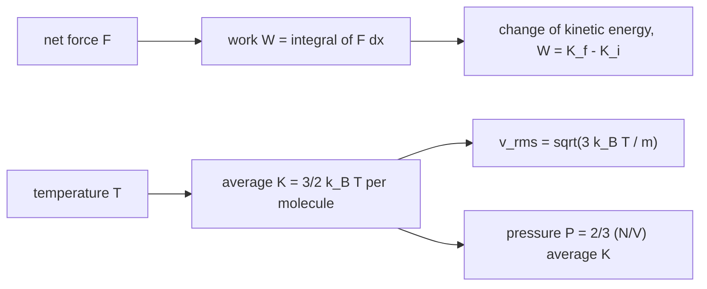

---
aliases:
  - KE
  - Translational Kinetic Energy
  - Work-Energy Theorem
  - Énergie cinétique
tags:
  - type/concept
  - domain/physics
  - domain/chemistry
  - level/L1
  - level/L2
mastery: 0
prerequisites:
  - "[[Work (Physics)]]"
  - "[[Newton's Laws of Motion]]"
related:
  - "[[Momentum]]"
  - "[[Potential Energy]]"
  - "[[Conservation of Energy]]"
  - "[[Temperature]]"
  - "[[Equipartition Theorem]]"
  - "[[Boltzmann Distribution]]"
  - "[[Ideal Gas Law]]"
  - "[[Molecular Dynamics Simulation]]"
projects: []
sources:
  - "[[University Physics (OpenStax)]]"
  - "[[MIT 8.01SC - Classical Mechanics]]"
  - "[[NIST Reference on Constants, Units, and Uncertainty]]"
  - "[[Chemistry 2e (OpenStax)]]"
---

# Kinetic Energy

> [!abstract]
> Kinetic energy, $\frac{1}{2}mv^2$, is the energy an object has because it moves; the net work done on an object equals the change of its kinetic energy, and temperature is a measure of the average kinetic energy of molecules.

## Definition

The **kinetic energy** of a body of mass $m$ moving at speed $v$ is $K = \frac{1}{2}mv^2$, in joules. The **work-energy theorem** states that the net work done on the body by all forces equals the change of its kinetic energy: $W_{\text{net}} = K_f - K_i$.[^up7][^801] For an ideal gas, the average translational kinetic energy of a molecule is proportional to the absolute temperature, $\langle K \rangle = \frac{3}{2}k_BT$.[^up2]

## Why it matters

- **Temperature in simulations.** A [[Molecular Dynamics Simulation]] has no thermometer: its temperature is computed from the atoms' kinetic energies, and thermostats rescale or perturb velocities to hold it ([[Equipartition Theorem]]).
- **Thermal energy as the yardstick.** $\langle K \rangle = \frac{3}{2}k_BT$ is why $k_BT$ measures how much energy thermal motion has available to cross barriers, break weak bonds or populate states ([[Boltzmann Distribution]], [[Temperature]]).
- **Energy bookkeeping.** With [[Potential Energy]], kinetic energy is one of the two terms of mechanical energy whose conservation, or dissipation as heat, solves problems that forces alone make hard ([[Conservation of Energy]]).

## Core (L1)

**Quadratic in speed.** Doubling the speed multiplies $K$ by four. $K$ is a scalar, never negative, and independent of the direction of motion.[^up7]

**Work-energy theorem.** With $F = m\,dv/dt$ and $dx = v\,dt$ ([[Kinematics]]), the net work along a straight path is

$$W_{\text{net}} = \int_{x_i}^{x_f} F\,dx = \int m\frac{dv}{dt}\,v\,dt = \int_{v_i}^{v_f} m v\,dv = \tfrac{1}{2}mv_f^2 - \tfrac{1}{2}mv_i^2.$$

Positive net work speeds an object up, negative net work slows it down, and a force perpendicular to the motion changes only the direction ([[Work (Physics)]]).[^up7] A stopping distance follows without solving for the motion: $d = K_i / F$ for a constant braking force.

**Relation to momentum.** $K = \frac{p^2}{2m}$ with $p = mv$ ([[Momentum]]). In a collision momentum is always conserved, kinetic energy only if the collision is elastic.[^up9]

**Temperature and molecular motion.** Kinetic theory compares the pressure produced by molecular impacts, $PV = \frac{2}{3}N\langle K\rangle$ ([[Momentum#Core (L1)]]), with the ideal gas law $PV = Nk_BT$ ([[Ideal Gas Law]]), giving[^up2]

$$\langle K \rangle = \tfrac{1}{2}m\langle v^2 \rangle = \tfrac{3}{2}k_BT, \qquad v_{\text{rms}} = \sqrt{\langle v^2\rangle} = \sqrt{\frac{3k_BT}{m}} = \sqrt{\frac{3RT}{M}},$$

with $M$ the molar mass in kg/mol. The average depends on temperature only: at the same $T$, a water molecule and a protein have the same mean kinetic energy, and the heavier one moves more slowly.



## Deeper (L2)

**The distribution of molecular speeds.** In equilibrium, each velocity component of a molecule is normally distributed with mean 0 and variance $k_BT/m$; the speed then follows the Maxwell-Boltzmann distribution, with most probable speed $\sqrt{2k_BT/m}$ and rms speed $\sqrt{3k_BT/m}$.[^up2] This is the [[Boltzmann Distribution]] applied to kinetic energy ([[Normal Distribution]]).

**Equipartition.** Each of the three components contributes $\frac{1}{2}k_BT$ on average, because $K = \frac{1}{2}m(v_x^2 + v_y^2 + v_z^2)$ is a sum of three quadratic terms. The [[Equipartition Theorem]] generalizes this: every quadratic degree of freedom (including the $\frac{1}{2}kx^2$ of a [[Harmonic Oscillator]]) carries $\frac{1}{2}k_BT$ on average.

**Kinetic temperature.** Inverting $\langle K \rangle = \frac{3}{2}k_BT$ for a system of $N$ atoms gives an instantaneous estimate $T_{\text{kin}} = \frac{2\sum_i K_i}{3Nk_B}$; this is how a simulation reports its temperature (with $3N$ replaced by the number of unconstrained degrees of freedom). Because $\sum_i K_i$ is a sum of $3N$ independent squared Gaussians, $T_{\text{kin}}$ fluctuates with relative standard deviation $\sqrt{2/(3N)}$: large for a small system, negligible for a mole (Exercise 5).

**Frame dependence.** $K$ depends on the observer: a molecule's kinetic energy measured in the lab and in the frame of a moving container differ. Temperature uses velocities relative to the center of mass of the sample, so a flowing gas is not hotter because it flows.

## Mathematical representation

For a particle, $K = \frac{1}{2}m\,\vec v \cdot \vec v$; for a system, $K = \sum_i \frac{1}{2}m_i v_i^2$. Along a trajectory $\vec r(t)$ under net force $\vec F$, $\frac{dK}{dt} = m\vec v \cdot \frac{d\vec v}{dt} = \vec F \cdot \vec v$ (the power), so $K(t_2) - K(t_1) = \int_{t_1}^{t_2}\vec F \cdot \vec v\,dt = \int_C \vec F \cdot d\vec r$, the work-energy theorem in three dimensions. With velocity components $v_x, v_y, v_z \sim \mathcal{N}(0, k_BT/m)$ independent, $\mathbb{E}[v^2] = 3k_BT/m$ and $\mathbb{E}[K] = \frac{3}{2}k_BT$.

## Computational representation

The script computes rms speeds at 300 K from exact constants,[^nist] then samples Maxwell-Boltzmann velocities for water-mass molecules and recovers the temperature from their mean kinetic energy, as a simulation would.

```python
import math
import random

K_B = 1.380649e-23        # J/K, exact (SI 2019)
N_A = 6.02214076e23       # 1/mol, exact (SI 2019)
T = 300.0                 # K

molar_mass = {"N2": 28.014e-3, "water": 18.015e-3, "50 kDa protein": 50.0}   # kg/mol

for name, M in molar_mass.items():
    m = M / N_A                                   # kg per molecule
    v_rms = math.sqrt(3 * K_B * T / m)            # from <K> = (3/2) k_B T
    print(f"{name:15s} m = {m:.3e} kg   v_rms = {v_rms:7.1f} m/s")

# Maxwell-Boltzmann: each velocity component ~ Normal(0, k_B T / m)
random.seed(4)
m = molar_mass["water"] / N_A
sigma = math.sqrt(K_B * T / m)
n = 100_000
mean_K = sum(0.5 * m * sum(random.gauss(0, sigma) ** 2 for _ in range(3)) for _ in range(n)) / n
print(f"<K> / (k_B T) = {mean_K / (K_B * T):.3f}; temperature from <K>: {2 * mean_K / (3 * K_B):.1f} K")
```

```text
N2              m = 4.652e-26 kg   v_rms =   516.8 m/s
water           m = 2.991e-26 kg   v_rms =   644.5 m/s
50 kDa protein  m = 8.303e-23 kg   v_rms =    12.2 m/s
<K> / (k_B T) = 1.493; temperature from <K>: 298.6 K
```

Molar masses: $\mathrm{N_2}$ from N = 14.007 u, water 18.015 g/mol.[^chem] The sampled 298.6 K differs from 300 K by sampling noise, whose standard deviation is $300\sqrt{2/(3 \times 10^5)} \approx 0.8$ K (Exercise 5).

## Worked example

> [!example] Same energy, different speeds
> At 300 K, compare a water molecule (18.015 g/mol) with a 50 kDa protein.
> 1. **Mean kinetic energy.** Both have $\langle K \rangle = \frac{3}{2}k_BT = 1.5 \times 1.380649 \times 10^{-23} \times 300 = 6.21 \times 10^{-21}$ J $= 6.21$ pN·nm.
> 2. **Masses.** $m = M/N_A$: $2.99 \times 10^{-26}$ kg and $8.30 \times 10^{-23}$ kg, a ratio of about 2800.
> 3. **Speeds.** $v_{\text{rms}} = \sqrt{2\langle K\rangle/m}$: 645 m/s and 12.2 m/s. The ratio is $\sqrt{2800} \approx 53$, the square root of the mass ratio.
> 4. **Interpretation.** A protein's thermal velocity is not small (12 m/s), but in water it is randomized by collisions almost at once, so the protein diffuses instead of travelling ballistically ([[Momentum#Deeper (L2)]], [[Brownian Motion]]). Its kinetic energy still averages $\frac{3}{2}k_BT$.

## Common misconceptions

> [!warning] "Kinetic energy is proportional to speed"
> It is proportional to the square of speed. A car at 100 km/h has four times the kinetic energy of the same car at 50 km/h, and needs four times the braking distance for the same braking force.

> [!warning] "Heavier molecules have more kinetic energy at the same temperature"
> In equilibrium every molecule has the same average translational kinetic energy, $\frac{3}{2}k_BT$, whatever its mass. Heavier molecules move more slowly to compensate.

> [!warning] "Temperature is the kinetic energy of a molecule"
> Temperature relates to the **average** over many molecules. Individual molecules have widely distributed energies; the fast tail of that distribution is what crosses activation barriers ([[Boltzmann Distribution]]).

> [!warning] "Work changes kinetic energy, so any force on a moving body speeds it up or slows it down"
> Only the net work counts, and a force perpendicular to the motion does no work: a body in uniform circular motion keeps its kinetic energy while its velocity turns.

## Exercises

> [!question] Exercise 1 (L1)
> A 0.15 kg ball moves at 20 m/s. What is its kinetic energy? At what speed would it have twice as much?

> [!success]- Solution
> $K = \frac{1}{2} \times 0.15 \times 20^2 = 30$ J. Twice as much needs $v = 20\sqrt 2 = 28.3$ m/s, not 40 m/s (which gives four times as much).

> [!question] Exercise 2 (L1)
> A 1000 kg car at 20 m/s brakes with a constant 8000 N force. Use the work-energy theorem to find its stopping distance, and the distance from 40 m/s.

> [!success]- Solution
> $K_i = \frac{1}{2} \times 1000 \times 400 = 2 \times 10^5$ J. $-Fd = 0 - K_i$, so $d = 2 \times 10^5 / 8000 = 25$ m. From 40 m/s, $K_i$ is four times larger: 100 m.

> [!question] Exercise 3 (L2)
> Compute $v_{\text{rms}}$ of $\mathrm{O_2}$ at 300 K (O = 15.999 u) and its ratio to that of $\mathrm{N_2}$ (516.8 m/s).

> [!success]- Solution
> $M = 31.998 \times 10^{-3}$ kg/mol: $v_{\text{rms}} = \sqrt{3 \times 8.314 \times 300 / 0.031998} = 483.6$ m/s. Ratio $\sqrt{28.014/31.998} = 0.936$: speeds scale as $1/\sqrt{M}$ at equal temperature.

> [!question] Exercise 4 (L2)
> Show that an ideal gas's total translational kinetic energy per unit volume equals $\frac{3}{2}P$, and evaluate it for air at 1 atm (101 325 Pa).

> [!success]- Solution
> $P = \frac{2}{3}\frac{N}{V}\langle K\rangle$, so $\frac{N\langle K\rangle}{V} = \frac{3}{2}P = 1.52 \times 10^5$ J/m³, about 152 J per litre of air, whatever the gas.

> [!question] Exercise 5 (L2, Python)
> Using `sigma`, `m`, `K_B` and `T` from the script, estimate the kinetic temperature of systems of 10, 100 and 10,000 molecules, 100 times each, and compare the standard deviation with $T\sqrt{2/(3N)}$. What does this imply for small simulations?

> [!success]- Solution
> ```python
> def kinetic_temperature(n_molecules):
>     total = sum(0.5 * m * sum(random.gauss(0, sigma) ** 2 for _ in range(3))
>                 for _ in range(n_molecules))
>     return 2 * total / (3 * n_molecules * K_B)
>
>
> random.seed(5)
> for n_mol in (10, 100, 10_000):
>     temps = [kinetic_temperature(n_mol) for _ in range(100)]
>     mean = sum(temps) / len(temps)
>     sd = math.sqrt(sum((x - mean) ** 2 for x in temps) / (len(temps) - 1))
>     print(n_mol, round(mean, 1), round(sd, 1), round(T * math.sqrt(2 / (3 * n_mol)), 1))
> ```
>
> ```text
> 10 288.4 83.8 77.5
> 100 302.2 24.2 24.5
> 10000 299.9 2.1 2.4
> ```
>
> Columns: $N$, mean, standard deviation, prediction. The fluctuation follows $T\sqrt{2/(3N)}$: about 80 K for ten molecules, 25 K for a hundred, 2 K for ten thousand. The instantaneous temperature of a small simulation fluctuates strongly even when it is perfectly equilibrated; only its average is the thermodynamic temperature.

## Mastery checklist

- [ ] 1 Recognized: I can write $K = \frac{1}{2}mv^2$ and state the work-energy theorem.
- [ ] 2 Understood: I can derive the work-energy theorem from $F = ma$ and explain why mean kinetic energy, not speed, is set by temperature.
- [ ] 3 Practiced: I compute stopping distances, rms speeds and kinetic temperatures, analytically and in Python.
- [ ] 4 Applied: I computed the kinetic temperature of a simulation trajectory or of sampled velocities and checked it against the target.
- [ ] 5 Explained: I can derive $\langle K\rangle = \frac{3}{2}k_BT$ from molecular impacts and explain temperature fluctuations in small systems.

## References

[^up7]: [[University Physics (OpenStax)]], Volume 1, ch. 7 "Work and Kinetic Energy".
[^up9]: [[University Physics (OpenStax)]], Volume 1, ch. 9 "Linear Momentum and Collisions".
[^up2]: [[University Physics (OpenStax)]], Volume 2, ch. 2 "The Kinetic Theory of Gases" (pressure, temperature and rms speed; distribution of molecular speeds).
[^801]: [[MIT 8.01SC - Classical Mechanics]]: energy.
[^nist]: [[NIST Reference on Constants, Units, and Uncertainty]]: Boltzmann and Avogadro constants, exact since 2019.
[^chem]: [[Chemistry 2e (OpenStax)]]: atomic masses (N 14.007 u, O 15.999 u) and the molar mass of water (18.015 g/mol).
