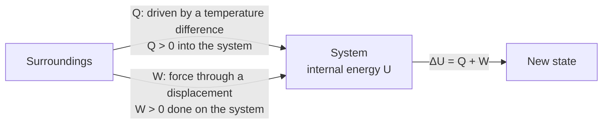

---
aliases:
  - Heat Transfer
  - Heat Flow
  - Q
  - Calorie
  - Chaleur
tags:
  - type/concept
  - domain/physics
  - domain/chemistry
  - level/L1
  - level/L2
mastery: 0
prerequisites:
  - "[[Thermodynamic System]]"
  - "[[Temperature]]"
  - "[[Work (Physics)]]"
related:
  - "[[Heat Capacity]]"
  - "[[Internal Energy]]"
  - "[[Laws of Thermodynamics]]"
  - "[[Enthalpy]]"
  - "[[Calorimetry]]"
  - "[[Thermodynamic Entropy]]"
  - "[[Phase Transition]]"
  - "[[Water]]"
projects: []
sources:
  - "[[University Physics (OpenStax)]]"
  - "[[Chemistry 2e (OpenStax)]]"
---

# Heat

> [!abstract]
> Heat is energy on the move, transferred from a hotter body to a colder one because their temperatures differ; temperature describes a state, heat describes a transfer, and confusing the two is the first trap of thermodynamics.

## Definition

**Heat** $Q$ is energy transferred between a system and its surroundings because of a temperature difference between them.[^up1][^chem5] It is measured in joules; the older **calorie** is defined as 4.184 J, and the nutritional Calorie is a kilocalorie.[^chem5] Sign convention: $Q > 0$ when the system **absorbs** heat, $Q < 0$ when it releases heat.[^chem5][^up3]

## Why it matters

- **Calorimetry measures heat.** Isothermal titration and differential scanning calorimeters record the heat absorbed or released by a binding or unfolding event; at constant pressure that heat is the [[Enthalpy|enthalpy]] change ([[Calorimetry]]).
- **The energy of food is reported as heat**: the heat released by its oxidation, in Calories.[^chem5] [[Metabolism]] releases the same energy in steps, part as work and part as heat.
- **Thermocycling.** PCR cycles depend on moving heat in and out of small volumes fast; the amount needed is set by the [[Heat Capacity|heat capacity]] of the sample ([[Polymerase Chain Reaction]]).
- **Entropy is defined through heat**: $dS = \delta Q_{\text{rev}}/T$ ([[Thermodynamic Entropy]]).

## Core (L1)

**Heat versus temperature.** [[Temperature]] is a state variable: a property the system has at each instant. Heat is not a property: a system does not "contain" heat, it contains [[Internal Energy|internal energy]], and heat is one way that energy crosses its boundary.[^up3] Two differences make this concrete:

| | Temperature $T$ | Heat $Q$ |
|---|---|---|
| Kind of quantity | state variable (intensive) | energy transfer during a process |
| Unit | K | J |
| Depends on the path? | no | yes |
| Doubling the system | unchanged | doubles (for the same change of state) |

**Heat versus work.** Both are energy transfers across the boundary. [[Work (Physics)|Work]] is transfer by a force acting through a displacement (a piston, a motor pulling on a filament); heat is transfer driven by a temperature difference, through random molecular collisions at the boundary. The first law adds them: $\Delta U = Q + W$ ([[Laws of Thermodynamics]]).



**Direction.** Heat flows spontaneously from the hotter body to the colder one and stops at thermal equilibrium ([[Temperature#Deeper (L2)]] derives this from the second law).

**Heat without temperature change.** During a phase change heat is absorbed at constant temperature: melting ice at 0 °C absorbs $\Delta H_{\text{fus}} = 6.01$ kJ/mol while staying at 0 °C.[^chem] Melting 30 g of ice (1.665 mol, with $M = 18.015$ g/mol from the atomic weights[^chemaw]) takes 10.0 kJ, as much heat as warming the same 30 g of liquid water from 0 to 80 °C (code below). Heat is not a measure of temperature.

**Heat with temperature change.** Without phase change, the heat needed for a temperature change is $Q = m c \Delta T$, with $c$ the specific heat; for liquid water $c = 4.184$ J g⁻¹ K⁻¹ ([[Heat Capacity]]).[^chem5]

## Deeper (L2)

**Heat depends on the path.** Between the same two states, the heat absorbed differs with the process: compressing then heating a gas exchanges a different $Q$ than heating then compressing it, although $\Delta U$ is the same ([[Internal Energy]] computes both paths).[^up3] Two special paths give heat a state-function value:

- at constant volume no expansion work is done, so $Q_V = \Delta U$;
- at constant pressure with only expansion work, $Q_P = \Delta H$, the enthalpy change, which is why calorimeters open to the atmosphere measure enthalpies.[^chem5]

**Adiabatic and isothermal.** A process with $Q = 0$ is **adiabatic** (fast, or well insulated). An **isothermal** process keeps $T$ constant, which in general requires heat exchange with a reservoir: an ideal gas expanding isothermally absorbs exactly the heat it spends as work.

**Dissipation.** Friction, viscous drag and electrical resistance turn work into internal energy that leaves as heat ([[Conservation of Energy]]). The reverse, converting heat entirely into work in a cycle, is forbidden by the second law ([[Laws of Thermodynamics]]).

**Heat and entropy.** Only reversible heat defines entropy: $dS = \delta Q_{\text{rev}}/T$. A given amount of heat carries more entropy at low temperature than at high temperature ([[Thermodynamic Entropy]]).

## Mathematical representation

- Sign: $Q > 0$ absorbed by the system. Infinitesimal heat $\delta Q$ is an inexact differential: $Q = \int_{\text{path}} \delta Q$.
- Sensible heat (no phase change): $Q = \int_{T_1}^{T_2} C(T)\, dT \approx C\,\Delta T = m c\,\Delta T = n C_m \Delta T$.
- Latent heat at the transition temperature (constant $P$): $Q = n\,\Delta H_{\text{trans}}$.
- Heat balance in an insulated container: $\sum_i Q_i = 0$ over all parts, since no heat leaves the container.

## Computational representation

```python
C_WATER = 4.184          # J/(g K), specific heat of liquid water
DH_FUS = 6.01e3          # J/mol, enthalpy of fusion of ice at 0 C
M_WATER = 2 * 1.008 + 15.999   # g/mol


def heat_to_warm(mass_g: float, t1: float, t2: float, c: float = C_WATER) -> float:
    """Heat (J) absorbed by the sample when it goes from t1 to t2 without phase change."""
    return mass_g * c * (t2 - t1)


def heat_to_melt(mass_g: float) -> float:
    """Heat (J) absorbed by ice melting at 0 C."""
    return mass_g / M_WATER * DH_FUS


def final_temperature(m_hot: float, t_hot: float, m_ice: float) -> float:
    """Hot water plus ice at 0 C in an insulated cup; assumes all the ice melts."""
    # heat lost by hot water = heat to melt ice + heat to warm meltwater from 0 C
    return (m_hot * C_WATER * t_hot - heat_to_melt(m_ice)) / (C_WATER * (m_hot + m_ice))


print(f"warm 1 L of water 20 -> 37 C: {heat_to_warm(1000, 20, 37) / 1e3:.1f} kJ")
print(f"melt 30 g of ice:            {heat_to_melt(30) / 1e3:.2f} kJ")
print(f"warm 30 g of water 0 -> 80 C: {heat_to_warm(30, 0, 80) / 1e3:.2f} kJ")
t_f = final_temperature(250, 80, 30)
print(f"250 g tea at 80 C + 30 g ice: final {t_f:.1f} C")
print(f"check: Q_tea = {heat_to_warm(250, 80, t_f):.0f} J, Q_ice = {heat_to_melt(30) + heat_to_warm(30, 0, t_f):.0f} J")
```

```text
warm 1 L of water 20 -> 37 C: 71.1 kJ
melt 30 g of ice:            10.01 kJ
warm 30 g of water 0 -> 80 C: 10.04 kJ
250 g tea at 80 C + 30 g ice: final 62.9 C
check: Q_tea = -17902 J, Q_ice = 17902 J
```

The signs carry the bookkeeping: the tea's $Q$ is negative (it releases heat), the ice's is positive, and they sum to zero. 1 L of water is taken as 1000 g (density about 1.0 g/mL).[^chemrho]

## Worked example

> [!example] Ice in tea (invented quantities)
> 250 g of tea (treated as water) at 80 °C, 30 g of ice at 0 °C, insulated cup.
> 1. **Melting.** $n = 30/18.015 = 1.665$ mol; $Q_{\text{melt}} = 1.665 \times 6.01 = 10.0$ kJ, absorbed at 0 °C.
> 2. **Balance.** Heat released by the tea equals heat absorbed by the ice: $250 \times 4.184\,(80 - T_f) = 10{,}008 + 30 \times 4.184\,(T_f - 0)$.
> 3. **Solve.** $T_f = (83{,}680 - 10{,}008)/(4.184 \times 280) = 62.9$ °C.
> 4. **Reading.** Without the phase change (30 g of water at 0 °C) the mix would end at $250 \times 80/280 = 71.4$ °C. The extra 8.5 °C drop pays for the latent heat: the ice absorbed 10 kJ without warming at all.

## Common misconceptions

> [!warning] "A hot body contains a lot of heat"
> It contains internal energy. Heat is defined only for a transfer; "the heat of a body" has no meaning in thermodynamics.[^up3]

> [!warning] "Adding heat always raises the temperature"
> During melting or boiling, heat is absorbed at constant temperature. In the example, 10 kJ go into ice that stays at 0 °C.

> [!warning] "Cold flows into a body"
> Only energy flows. A cold drink cools your hand because heat leaves your hand ($Q < 0$ for the hand), not because cold enters it.

## Exercises

> [!question] Exercise 1 (L1)
> State whether each is a temperature or a heat: (a) 37 °C; (b) 418 kJ released by burning a biscuit; (c) the reading of an ITC instrument after one injection; (d) the melting temperature of a primer.

> [!success]- Solution
> (a) Temperature. (b) Heat (an energy transferred, in J). (c) Heat: a calorimeter measures energy exchanged per injection ([[Calorimetry]]). (d) Temperature: a property of the state at which half the duplexes are melted.

> [!question] Exercise 2 (L1)
> A snack provides 100 kcal (nutritional Calories). Convert to kJ. If all of it were released as heat into 70 kg of water, by how much would the temperature rise?

> [!success]- Solution
> $100 \times 4.184 = 418.4$ kJ. $\Delta T = Q/(mc) = 418{,}400/(70{,}000 \times 4.184) = 1.43$ K. A body is not pure water and loses heat continuously, but the order of magnitude shows why metabolic heat must be evacuated.

> [!question] Exercise 3 (L2)
> One mole of ideal gas goes from state A to state B by two different paths. Can $Q_{A\to B}$ differ between the paths? Can $\Delta U$? Give the special conditions under which $Q$ equals a change of a state function.

> [!success]- Solution
> $Q$ can differ (it is a path quantity); $\Delta U$ cannot (state function). If the volume is constant, $Q = \Delta U$; if the pressure is constant with only expansion work, $Q = \Delta H$.

> [!question] Exercise 4 (L2, Python)
> With `final_temperature`, find the largest mass of ice at 0 °C that 250 g of tea at 80 °C can melt completely. Why does the function become invalid beyond it?

> [!success]- Solution
> All the ice melts as long as $T_f \geq 0$, i.e. $250 \times 4.184 \times 80 \geq m/18.015 \times 6010$: $m \leq 83{,}680 \times 18.015/6010 = 250.8$ g. Beyond that, the formula returns $T_f < 0$, which is impossible for liquid water: some ice remains and the mixture stays at 0 °C. A model must check its own assumptions ([[Defensive Programming]]).

## Mastery checklist

- [ ] 1 Recognized: I can define heat as energy transferred because of a temperature difference, with its sign convention.
- [ ] 2 Understood: I can explain why heat is not a state function and why heat and temperature are different quantities.
- [ ] 3 Practiced: I solve heat-balance problems with and without phase changes.
- [ ] 4 Applied: I interpret a calorimetry trace as heat exchanged per event and relate it to $\Delta H$.
- [ ] 5 Explained: I can teach when heat equals $\Delta U$ or $\Delta H$, and why heat at low temperature carries more entropy.

## References

[^up1]: [[University Physics (OpenStax)]], Volume 2, ch. 1 (heat as energy transferred because of a temperature difference).
[^up3]: [[University Physics (OpenStax)]], Volume 2, ch. 3 "The First Law of Thermodynamics" (heat and work as energy transfers that depend on the path, sign of $Q$).
[^chem5]: [[Chemistry 2e (OpenStax)]], ch. 5 "Thermochemistry" (heat, calorie and nutritional Calorie, specific heat of water 4.184 J g⁻¹ °C⁻¹, sign of $q$, enthalpy as heat at constant pressure).
[^chem]: [[Chemistry 2e (OpenStax)]] (enthalpy of fusion of water, 6.01 kJ/mol).
[^chemaw]: [[Chemistry 2e (OpenStax)]], standard atomic weights (H 1.008, O 15.999).
[^chemrho]: [[Chemistry 2e (OpenStax)]], treatment of density (water, about 1.0 g/mL).
