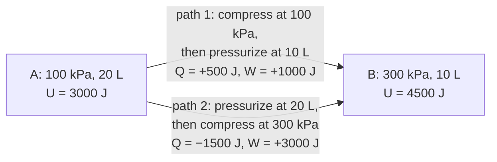

---
aliases:
  - U
  - Thermal Energy of a System
  - E_int
  - Énergie interne
tags:
  - type/concept
  - domain/physics
  - domain/chemistry
  - level/L1
  - level/L2
  - level/L3
mastery: 0
prerequisites:
  - "[[Thermodynamic System]]"
  - "[[Heat]]"
  - "[[Work (Physics)]]"
  - "[[Kinetic Energy]]"
  - "[[Potential Energy]]"
related:
  - "[[Laws of Thermodynamics]]"
  - "[[Enthalpy]]"
  - "[[Heat Capacity]]"
  - "[[Ideal Gas Law]]"
  - "[[Equipartition Theorem]]"
  - "[[Helmholtz Free Energy]]"
  - "[[Partition Function]]"
  - "[[Force Field]]"
projects: []
sources:
  - "[[University Physics (OpenStax)]]"
  - "[[Chemistry 2e (OpenStax)]]"
---

# Internal Energy

> [!abstract]
> The internal energy U of a system is the total energy of its molecules, a property of its state; heat and work are the two ways that energy crosses the boundary, and only their sum, ΔU = Q + W, is independent of the path.

## Definition

The **internal energy** $U$ of a system is the sum of the kinetic energies of its molecules (in their random motion) and of the potential energies of their interactions, excluding the kinetic and potential energy of the system as a whole.[^up3] It is a **state function**: it depends only on the state of the system ($T$, $V$, $n$, composition), not on its history. Only changes $\Delta U$ are measured; the zero of $U$ is a convention.[^up3]

## Why it matters

- **Enthalpy and the free energies are built from it**: $H = U + PV$ ([[Enthalpy]]), $F = U - TS$ ([[Helmholtz Free Energy]]), $G = H - TS$ ([[Gibbs Free Energy]]). For reactions in solution, $\Delta H \approx \Delta U$.
- **Simulations compute it.** In a [[Molecular Dynamics Simulation|molecular dynamics simulation]], the potential energy given by a [[Force Field|force field]] plus the kinetic energy of the atoms is the internal energy of the simulated system; with no thermostat it stays constant ([[Conservation of Energy]]).

## Core (L1)

**A property versus two transfers.** Internal energy belongs to the system; heat and work belong to processes.

| | Internal energy $U$ | Heat $Q$ | Work $W$ |
|---|---|---|---|
| What it is | energy stored in the system | energy transferred because of a temperature difference | energy transferred by a force through a displacement |
| State function? | yes | no | no |
| Sign (this vault) | | $> 0$ into the system | $> 0$ done on the system |

The first law ties them: $\Delta U = Q + W$.[^chem5] Heat and work are like deposits by cheque or by cash into an account: the balance ($U$) does not record which way the money came in.

> [!warning] Sign convention for work
> This vault, chemistry texts and the [[Thermodynamics]] MOC count $W$ as work done **on** the system: $\Delta U = Q + W$.[^chem5] Many physics texts, including University Physics, count work done **by** the system: $\Delta U = Q - W$.[^up33] Same physics, opposite sign of $W$; check the convention before using any formula.

**Microscopic content.** For a monatomic ideal gas the only internal energy is translational kinetic energy, $U = \frac{3}{2} n R T$: it depends on temperature alone ([[Ideal Gas Law]], [[Equipartition Theorem]]).[^up2] In a liquid or a protein, $U$ also contains rotational and vibrational energy and the potential energy of bonds and of noncovalent interactions ([[Potential Energy]], [[Intermolecular Force]]).

**Special processes.**

| Process | Condition | First law gives |
|---|---|---|
| Constant volume | $W = 0$ (no expansion work) | $\Delta U = Q_V$ |
| Adiabatic | $Q = 0$ | $\Delta U = W$ |
| Isothermal, ideal gas | $\Delta U = 0$ | $Q = -W$ |

**Path independence, computed.** Take 1 mol of monatomic ideal gas from A (100 kPa, 20 L) to B (300 kPa, 10 L) along two paths made of an isobar and an isochore; $Q$ and $W$ differ (even in sign for $Q$), $\Delta U = 1500$ J does not (code below):



## Deeper (L2)

**The fundamental relation.** For a reversible change of a closed system with only expansion work, $\delta W = -P\,dV$ and $\delta Q = T\,dS$ ([[Thermodynamic Entropy]]), so the first law becomes

$$dU = T\,dS - P\,dV.$$

$U$ is therefore naturally a function of $S$ and $V$, with $T = (\partial U/\partial S)_V$ and $P = -(\partial U/\partial V)_S$. Although derived along a reversible path, the relation links state functions only, so it holds for any change between equilibrium states. Subtracting $TS$ (a Legendre transform) gives $F = U - TS$, whose natural variables $T$ and $V$ are the ones a laboratory controls ([[Helmholtz Free Energy]]).

**$U$ versus $H$.** At constant pressure, $\Delta H = \Delta U + P\Delta V$. For condensed phases $P\Delta V$ is tiny, so biochemistry rarely distinguishes the two; for reactions that make or consume gas it matters ([[Enthalpy]]). A bomb calorimeter burns a sample at constant volume, so the heat it measures is $\Delta U$; a coffee-cup or titration calorimeter works at constant pressure and measures $\Delta H$ ([[Calorimetry]]).[^chem5]

## Advanced (L3)

- **Statistical meaning.** In [[Statistical Physics]], $U$ is the average energy over the accessible microstates, $U = \sum_i p_i E_i$, with the probabilities $p_i$ of the [[Boltzmann Distribution]]; the [[Partition Function]] gives it as a derivative. Thermodynamics needs only the existence of $U$; statistical physics computes it.
- **Energy is not stability.** Even when the folded state of a protein has the lower energy (more favorable contacts), folding is decided by the free energy, which also counts the entropy of chain and solvent ([[Gibbs Free Energy]], [[Hydrophobic Effect]], [[Protein Folding]]). Minimizing a force-field energy alone ignores that entropy.

## Mathematical representation

- State function: $\Delta U = U(B) - U(A)$ for every path; $\oint dU = 0$.
- First law (work on the system positive): $dU = \delta Q + \delta W$, with $\delta Q$ and $\delta W$ inexact.
- Expansion work: $\delta W = -P_{\text{ext}}\, dV$; reversible: $\delta W = -P\,dV$ ([[Work (Physics)]], [[Pressure]]).
- Monatomic ideal gas: $U = \frac{3}{2} n R T = \frac{3}{2} P V$; $C_V = (\partial U/\partial T)_V = \frac{3}{2} n R$ ([[Heat Capacity]]).

## Computational representation

```python
def internal_energy(P: float, V: float) -> float:
    """U (J) of a monatomic ideal gas: U = 3/2 n R T = 3/2 P V (zero of energy at T = 0)."""
    return 1.5 * P * V


def leg(state1, state2):
    """Work done ON the gas and heat absorbed along an isobaric or isochoric leg (P in Pa, V in m^3)."""
    (p1, v1), (p2, v2) = state1, state2
    w = -p1 * (v2 - v1) if p1 == p2 else 0.0      # W = -P dV on an isobar, 0 on an isochore
    du = internal_energy(p2, v2) - internal_energy(p1, v1)
    return w, du - w                                # first law: Q = dU - W


def bookkeeping(path):
    W = Q = 0.0
    for s1, s2 in zip(path, path[1:]):
        w, q = leg(s1, s2)
        W, Q = W + w, Q + q
    return Q, W, Q + W


A, B = (100e3, 0.020), (300e3, 0.010)            # (Pa, m^3); with n = 1 mol, T_A = 240.5 K, T_B = 360.8 K
paths = {"compress, then pressurize": [A, (100e3, 0.010), B],
         "pressurize, then compress": [A, (300e3, 0.020), B]}
for name, path in paths.items():
    Q, W, dU = bookkeeping(path)
    print(f"{name:26}: Q = {Q:7.0f} J, W = {W:6.0f} J, dU = Q + W = {dU:5.0f} J")
cycle = [A, (100e3, 0.010), B, (300e3, 0.020), A]
print("cycle A -> B -> A: Q = {:.0f} J, W = {:.0f} J, dU = {:.0f} J".format(*bookkeeping(cycle)))
```

```text
compress, then pressurize : Q =     500 J, W =   1000 J, dU = Q + W =  1500 J
pressurize, then compress : Q =   -1500 J, W =   3000 J, dU = Q + W =  1500 J
cycle A -> B -> A: Q = 2000 J, W = -2000 J, dU = 0 J
```

## Worked example

> [!example] The cycle in the last line
> Go from A to B by path 1 and back by path 2 reversed.
> 1. **Internal energy.** Back to A, so $\Delta U = 0$ whatever happened.
> 2. **Work.** On the way out the surroundings do 1000 J on the gas; on the way back the gas expands at 300 kPa and does 3000 J on the surroundings. Net $W = 1000 - 3000 = -2000$ J: the gas did net work, equal to the area enclosed by the cycle in the $P$-$V$ plane, $(300 - 100)\text{ kPa} \times 10\text{ L} = 2000$ J.
> 3. **Heat.** $Q = \Delta U - W = +2000$ J: the gas absorbed net heat and turned it into work. A cycle that does this is a heat engine; the second law limits how much of the absorbed heat can become work ([[Laws of Thermodynamics]]).

## Common misconceptions

> [!warning] "Internal energy is the same thing as heat"
> A system stores internal energy; heat is one way of changing it. The same $\Delta U$ can be reached with heat alone, work alone, or any mix (the two paths above).

> [!warning] "If the temperature does not change, the internal energy does not change"
> True only when $U$ depends on $T$ alone, as for an ideal gas. Melting ice at 0 °C absorbs heat and raises $U$ at constant temperature: the potential energy of the molecules increases ([[Heat]]).


## Exercises

> [!question] Exercise 1 (L1)
> A gas absorbs 250 J of heat while the surroundings do 100 J of work on it. Find $\Delta U$ in this vault's convention, then write the same calculation in the convention of University Physics.

> [!success]- Solution
> $\Delta U = Q + W = 250 + 100 = +350$ J. With $W_{\text{by}} = -100$ J (the gas does negative work), $\Delta U = Q - W_{\text{by}} = 250 - (-100) = +350$ J. Same answer, opposite sign of the work term.

> [!question] Exercise 2 (L1)
> In an isothermal expansion, 1 mol of ideal gas does 1.7 kJ of work on its surroundings. Give $\Delta U$, $W$ and $Q$.

> [!success]- Solution
> Ideal gas at constant $T$: $\Delta U = 0$. Work done on the gas $W = -1.7$ kJ. First law: $Q = \Delta U - W = +1.7$ kJ: the gas absorbs exactly the heat it spends as work.

> [!question] Exercise 3 (L2, Python)
> Extend the code with a third path from A to B: an isochore at 20 L up to 150 kPa, an isobar at 150 kPa down to 10 L, then an isochore up to 300 kPa. Predict $\Delta U$ before running it, then give $Q$ and $W$.

> [!success]- Solution
> ```python
> path3 = [A, (150e3, 0.020), (150e3, 0.010), B]
> print(bookkeeping(path3))   # (0.0, 1500.0, 1500.0)
> ```
> $\Delta U = 1500$ J, as on every path. $W = -150 \times 10^3 \times (-0.010) = +1500$ J, so $Q = 0$ overall: heat in and out of the legs cancels. A net $Q = 0$ does not make the path adiabatic; each leg still exchanges heat.

## Mastery checklist

- [ ] 1 Recognized: I can define internal energy and say that it is a state function.
- [ ] 2 Understood: I can explain the difference between $U$, $Q$ and $W$, and state both sign conventions of the first law.
- [ ] 3 Practiced: I compute $Q$, $W$ and $\Delta U$ along different paths and around cycles.
- [ ] 4 Applied: I read the energy terms of a simulation or a calorimetry experiment as $\Delta U$ or $\Delta H$, knowing which one is measured.
- [ ] 5 Explained: I can teach the fundamental relation $dU = T\,dS - P\,dV$ and why lower energy alone does not decide stability.

## References

[^up3]: [[University Physics (OpenStax)]], Volume 2, ch. 3 "The First Law of Thermodynamics" (internal energy as the sum of the molecular kinetic and potential energies, a state function; heat and work depend on the path).
[^up33]: [[University Physics (OpenStax)]], Volume 2, ch. 3, §3.3 "First Law of Thermodynamics" (first law written with $W$ the work done by the system).
[^up2]: [[University Physics (OpenStax)]], Volume 2, ch. 2 (kinetic theory: internal energy of a monatomic ideal gas, $\frac{3}{2}nRT$).
[^chem5]: [[Chemistry 2e (OpenStax)]], ch. 5 "Thermochemistry" (internal energy, $\Delta U = q + w$ with $w$ the work done on the system, constant-volume bomb calorimetry and constant-pressure calorimetry).
