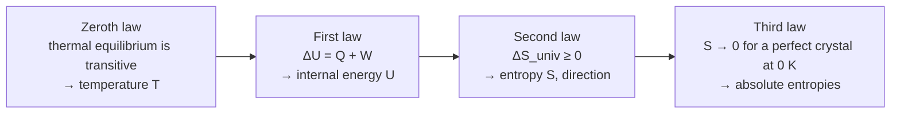

---
aliases:
  - First Law of Thermodynamics
  - Second Law of Thermodynamics
  - Third Law of Thermodynamics
  - Energy Conservation in Thermodynamics
  - Principes de la thermodynamique
tags:
  - type/concept
  - domain/physics
  - domain/chemistry
  - domain/biology
  - level/L1
  - level/L2
  - level/L3
mastery: 0
prerequisites:
  - "[[Thermodynamic System]]"
  - "[[Temperature]]"
  - "[[Heat]]"
  - "[[Internal Energy]]"
  - "[[Work (Physics)]]"
  - "[[Conservation of Energy]]"
related:
  - "[[Thermodynamic Entropy]]"
  - "[[Enthalpy]]"
  - "[[Gibbs Free Energy]]"
  - "[[Reversible Process]]"
  - "[[Nonequilibrium Steady State]]"
  - "[[Boltzmann Entropy]]"
  - "[[ATP]]"
  - "[[Binding Free Energy]]"
projects: []
sources:
  - "[[University Physics (OpenStax)]]"
  - "[[Chemistry 2e (OpenStax)]]"
  - "[[Biology 2e (OpenStax)]]"
---

# Laws of Thermodynamics

> [!abstract]
> Four laws organize all of thermodynamics: the zeroth defines temperature, the first says energy is conserved (ΔU = Q + W), the second says the entropy of the universe never decreases, which gives every spontaneous process its direction, and the third fixes the zero of entropy.

## Definition

- **Zeroth law.** If two systems are each in thermal equilibrium with a third, they are in thermal equilibrium with each other.[^up11]
- **First law.** The change in internal energy of a system equals the heat it absorbs plus the work done on it: $\Delta U = Q + W$.[^chem5] Energy can be transferred or transformed, never created or destroyed.[^bio63]
- **Second law.** Heat does not flow spontaneously from a colder body to a hotter one (Clausius), and no cyclic process can convert heat entirely into work (Kelvin).[^up4] Equivalently, the entropy of the universe increases in every spontaneous process and stays constant in a reversible one: $\Delta S_{\text{univ}} \geq 0$.[^up46][^chem16]
- **Third law.** The entropy of a pure, perfect crystal at absolute zero is zero.[^chem16]

## Why it matters

- **Energy bookkeeping.** Every calorimetric, metabolic or simulated energy balance is the first law; the sign convention decides whether a number is right ([[Internal Energy]], [[Calorimetry]]).
- **Direction of processes.** Whether a reaction runs, a protein folds or a ligand binds is a second-law question, answered at constant $T$ and $P$ by $\Delta G < 0$ ([[Gibbs Free Energy]]).
- **Closing cycles.** Because $U$, $H$, $S$ and $G$ are state functions, free energies around a closed cycle sum to zero. Mutation effects on binding or stability ($\Delta\Delta G$) are computed and checked this way ([[Binding Free Energy]]).
- **Life and order.** Cells build ordered structures while obeying the second law, by consuming free energy and exporting heat and entropy ([[ATP]], [[Metabolism]], [[Nonequilibrium Steady State]]).

## Core (L1)



### Zeroth law

It makes thermometers possible: a system put in contact with A and then with B tells whether A and B are at the same temperature without bringing them together ([[Temperature]]).[^up11]

### First law

$$\Delta U = Q + W,$$

with $Q > 0$ for heat absorbed by the system and $W > 0$ for work done **on** the system.[^chem5] For expansion against an external pressure, the work done on the system is $W = -\int P_{\text{ext}}\, dV$ ([[Work (Physics)]], [[Pressure]]): a gas that expands ($dV > 0$) does work on its surroundings and $W < 0$. For an isolated system $Q = W = 0$, so $\Delta U = 0$: the energy of the universe is constant.[^bio63] The first law is the [[Conservation of Energy]] of mechanics, extended to include heat.

> [!warning] Two sign conventions for work
> This vault, chemistry texts and the [[Thermodynamics]] MOC write $\Delta U = Q + W$, with $W$ the work done **on** the system.[^chem5] University Physics and many physics and engineering texts write $\Delta U = Q - W$, with $W$ the work done **by** the system.[^up33] The heat sign is the same in both. Before using a formula, find which $W$ it means; the code below implements both explicitly.

**Bio: energy accounting of an organism.** A cyclist (invented numbers) releases 400 kJ of heat and does 100 kJ of work on the pedals. With the body as the system, $Q = -400$ kJ and $W = -100$ kJ (the body does work on the surroundings), so $\Delta U = -500$ kJ: the energy comes from the body's stored fuels, as food oxidation releases it ([[Metabolism]]).

### Second law

Three equivalent faces:

1. **Clausius.** Heat flows spontaneously only from hot to cold.[^up4]
2. **Kelvin.** No engine working in a cycle turns all the heat it absorbs into work; some heat must be rejected to a colder body.[^up4]
3. **Entropy.** For any process, $\Delta S_{\text{univ}} = \Delta S_{\text{sys}} + \Delta S_{\text{surr}} \geq 0$; $> 0$ for spontaneous (irreversible) processes, $= 0$ for reversible ones.[^chem16]

The link between 1 and 3: 1 kJ of heat leaving a body at 310.15 K for a room at 298.15 K changes the entropy of the universe by $-1000/310.15 + 1000/298.15 = +0.130$ J/K, allowed; the reverse flow would give $-0.130$ J/K, forbidden (code below). The definition of entropy changes, $dS = \delta Q_{\text{rev}}/T$, is developed in [[Thermodynamic Entropy]].

**Bio: order without violating the second law.** Living things are highly ordered and need a constant input of energy to stay so.[^bio63] A cell is an open system ([[Thermodynamic System]]): it can lower its own entropy (assembling proteins, membranes, gradients) as long as it raises the entropy of its surroundings more, by releasing heat and small, disordered molecules such as CO₂ and water.

### Third law

Entropy has an absolute zero: a perfect crystal at 0 K has $S = 0$.[^chem16] Absolute (third-law) entropies can therefore be tabulated, such as the standard molar entropies $S^\circ$ used to compute reaction entropies from tables.[^chemappg]

## Deeper (L2)

**From the second law to free energy.** At constant $T$ and $P$, the surroundings receive the heat $-Q = -\Delta H_{\text{sys}}$ at temperature $T$, so $\Delta S_{\text{surr}} = -\Delta H_{\text{sys}}/T$ ([[Enthalpy]]). Then

$$\Delta S_{\text{univ}} = \Delta S_{\text{sys}} - \frac{\Delta H_{\text{sys}}}{T} = -\frac{\Delta H_{\text{sys}} - T\Delta S_{\text{sys}}}{T} = -\frac{\Delta G_{\text{sys}}}{T}.$$

$\Delta S_{\text{univ}} > 0$ is the same statement as $\Delta G_{\text{sys}} < 0$: the Gibbs free energy is the second law rewritten with system variables only ([[Gibbs Free Energy]]).

**Clausius inequality.** For any process, $dS \geq \delta Q/T$, with equality for reversible processes. In an isolated system ($\delta Q = 0$) entropy can only grow; equilibrium is reached at maximum entropy ([[Reversible Process]]).

**First law in differential form.** $dU = \delta Q + \delta W$; for reversible changes with expansion work only, $\delta Q = T\,dS$ and $\delta W = -P\,dV$, giving the fundamental relation $dU = T\,dS - P\,dV$ ([[Internal Energy#Deeper (L2)]]).

**Coupling.** The second law forbids a process with $\Delta G > 0$ alone, not as part of a larger process. Coupling an unfavorable reaction to ATP hydrolysis makes the total $\Delta G$ negative ([[ATP]], [[Gibbs Free Energy]]).

## Advanced (L3)

- **Thermodynamic cycles.** Since $G$ is a state function, the free energies around any closed loop of states sum to zero (the free-energy version of Hess's law for enthalpies[^chem5]). For a protein P, a mutant P′ and a ligand L, the loop P + L → PL → P′L → P′ + L → P + L gives
$$\Delta\Delta G_{\text{bind}} = \Delta G_{\text{bind}}(\mathrm{P'}) - \Delta G_{\text{bind}}(\mathrm{P}) = \Delta G_{\mathrm{P \to P'}}(\text{bound}) - \Delta G_{\mathrm{P \to P'}}(\text{free}).$$
The "vertical" legs (mutating the protein, free or bound) need not be physically realizable: any route between the same states gives the same $\Delta G$, which is what lets computational methods replace a binding process by an artificial transformation ([[Binding Free Energy]]).
- **Life as a nonequilibrium steady state.** A cell is not at a free-energy minimum: it is held away from equilibrium by a continuous flux of free energy and continuously produces entropy ([[Nonequilibrium Steady State]]). Equilibrium thermodynamics applies to its fast subsystems ([[Thermodynamic System#Deeper (L2)]]).
- **Microscopic meaning.** The second law is statistical: a macrostate realized by overwhelmingly more microstates is overwhelmingly more probable. [[Statistical Physics]] develops this view ([[Microstate]], [[Boltzmann Entropy]]).

## Mathematical representation

- Zeroth: $A \sim C \wedge B \sim C \Rightarrow A \sim B$.
- First (work on the system positive): $\Delta U = Q + W$; differential form $dU = \delta Q + \delta W$; expansion work $\delta W = -P_{\text{ext}}\, dV$; cycle $\oint dU = 0 \Rightarrow Q_{\text{cycle}} = -W_{\text{cycle}}$.
- Second: $dS \geq \delta Q / T$ (Clausius inequality); isolated system $\Delta S \geq 0$; constant $T$, $P$: $\Delta S_{\text{univ}} = -\Delta G_{\text{sys}}/T$, so $\Delta G_{\text{sys}} \leq 0$.
- Third: $\lim_{T \to 0} S = 0$ for a perfect crystal; then $S(T) = \int_0^T \frac{C_P(T')}{T'}\, dT'$ plus the entropies of any phase transitions ([[Heat Capacity]]).
- Cycle closure for any state function $X$: $\sum_{\text{loop}} \Delta X_i = 0$.

## Computational representation

Make the sign convention an explicit parameter, never an implicit habit:

```python
def delta_u(q: float, w: float, work_on_system: bool = True) -> float:
    """First law. Default: w is the work done ON the system (dU = Q + W).
    With work_on_system=False, w is the work done BY the system (dU = Q - W)."""
    return q + w if work_on_system else q - w


def entropy_change_universe(q: float, t_from: float, t_to: float) -> float:
    """Entropy change (J/K) when heat q (J) leaves a reservoir at t_from (K) for one at t_to (K)."""
    return -q / t_from + q / t_to


# First law, one process in both conventions (invented numbers, kJ):
# a cyclist releases 400 kJ of heat and does 100 kJ of work on the bicycle
print("dU (work on system) =", delta_u(-400, -100), "kJ")
print("dU (work by system) =", delta_u(-400, +100, work_on_system=False), "kJ")

# Second law: 1 kJ of heat between a body at 37 C and a room at 25 C
for t_from, t_to in ((310.15, 298.15), (298.15, 310.15)):
    ds = entropy_change_universe(1000.0, t_from, t_to)
    print(f"{t_from} K -> {t_to} K: dS_universe = {ds:+.3f} J/K ->", "allowed" if ds > 0 else "forbidden")

# State function: a thermodynamic cycle for a mutation's effect on binding (invented, kJ/mol)
dg_bind_wt, dg_bind_mut = -40.0, -34.5      # P + L -> PL, P' + L -> P'L
dg_mut_free, dg_mut_bound = 12.0, 17.5      # P -> P', PL -> P'L
around = dg_bind_wt + dg_mut_bound - dg_bind_mut - dg_mut_free
print(f"sum around the cycle = {around:.1f} kJ/mol")
print(f"ddG_bind = {dg_bind_mut - dg_bind_wt:.1f} = {dg_mut_bound - dg_mut_free:.1f} kJ/mol")
```

```text
dU (work on system) = -500 kJ
dU (work by system) = -500 kJ
310.15 K -> 298.15 K: dS_universe = +0.130 J/K -> allowed
298.15 K -> 310.15 K: dS_universe = -0.130 J/K -> forbidden
sum around the cycle = 0.0 kJ/mol
ddG_bind = 5.5 = 5.5 kJ/mol
```

The same physical work enters as −100 kJ in one convention and +100 kJ in the other; $\Delta U$ agrees only because the function is told which one it receives.

## Worked example

> [!example] Compressing a gas in a syringe (invented numbers)
> You push a syringe plunger and do 50 J of work on the trapped air; meanwhile 20 J of heat leaks out through the walls.
> 1. **System**: the air. $W = +50$ J (on the system), $Q = -20$ J (released).
> 2. **First law**: $\Delta U = Q + W = -20 + 50 = +30$ J: the air warms.
> 3. **Other convention**: work done by the air is $-50$ J, so $\Delta U = Q - W_{\text{by}} = -20 - (-50) = +30$ J. Same answer.
> 4. **Second law check**: the leaking heat flows from the warmed air to the cooler room, the direction Clausius allows. Releasing the plunger slowly, the air pushes back and returns work; the heat that leaked cannot spontaneously come back.

## Common misconceptions

> [!warning] "$\Delta U = Q + W$ and $\Delta U = Q - W$: one of them is wrong"
> Both are right with their own definition of $W$ (on or by the system). The error is mixing a formula from one book with a sign from another.

> [!warning] "Living organisms violate the second law because they create order"
> The second law constrains the entropy of the universe, not of one open system. A cell lowers its own entropy while exporting more entropy as heat and waste.[^bio63]

> [!warning] "The second law says entropy always increases"
> The entropy of a *system* can decrease (water freezing in a freezer, a protein folding). It is the total, system plus surroundings, that cannot decrease ([[Thermodynamic Entropy]]).

> [!warning] "Energy is conserved, so there is no energy crisis in a cell"
> Energy is conserved, but its ability to do work is not: free energy is consumed and degraded into heat. Cells need a supply of free energy, not of energy ([[Gibbs Free Energy]]).

## Exercises

> [!question] Exercise 1 (L1)
> Name the law used in each statement: (a) a perpetual-motion machine producing work from nothing is impossible; (b) a refrigerator needs a power supply; (c) two samples that each read 37 °C on the same thermometer are at the same temperature; (d) tables list absolute molar entropies $S^\circ$, not just differences.

> [!success]- Solution
> (a) First law: work cannot come from nothing. (b) Second law (Clausius): moving heat from cold to hot requires work. (c) Zeroth law. (d) Third law: it fixes $S = 0$ for a perfect crystal at 0 K.

> [!question] Exercise 2 (L1)
> A gas expands against a constant external pressure of 100 kPa from 1.0 L to 3.0 L while absorbing 350 J of heat. Find $W$ and $\Delta U$ in this vault's convention.

> [!success]- Solution
> $W = -P_{\text{ext}}\Delta V = -100 \times 10^3 \text{ Pa} \times 2.0 \times 10^{-3} \text{ m}^3 = -200$ J (the gas does 200 J of work). $\Delta U = Q + W = 350 - 200 = +150$ J.

> [!question] Exercise 3 (L2)
> Starting from $\Delta S_{\text{univ}} \geq 0$, derive the criterion $\Delta G \leq 0$ at constant temperature and pressure. Which assumption makes $\Delta S_{\text{surr}} = -\Delta H_{\text{sys}}/T$?

> [!success]- Solution
> See Deeper (L2). The surroundings are a large reservoir at constant $T$ that receives the heat $-\Delta H_{\text{sys}}$ (the system's heat at constant pressure) reversibly from its own point of view, so $\Delta S_{\text{surr}} = -\Delta H_{\text{sys}}/T$. Then $\Delta S_{\text{univ}} = -\Delta G_{\text{sys}}/T \geq 0 \iff \Delta G_{\text{sys}} \leq 0$.

> [!question] Exercise 4 (L2)
> In one cycle of a molecular machine, ATP hydrolysis provides about 12 $k_B T$ of free energy ([[Temperature]]). The machine does 5 $k_B T$ of mechanical work. Where do the other 7 $k_B T$ go, and could the machine run in reverse, producing ATP from work, with only 5 $k_B T$ of work input?

> [!success]- Solution
> They are dissipated as heat into the surroundings, increasing their entropy: that dissipation is what makes the cycle run forward. In reverse, synthesizing ATP needs at least the 12 $k_B T$ that hydrolysis releases; 5 $k_B T$ of work is not enough, by the second law (it would require $\Delta G_{\text{total}} > 0$).

> [!question] Exercise 5 (L3, Python)
> In the thermodynamic cycle of the code, suppose a lab measured $\Delta G_{\text{bind}}(\mathrm{P}) = -40.0$ and $\Delta G_{\text{bind}}(\mathrm{P'}) = -36.0$ kJ/mol, and a simulation computed $\Delta G_{\mathrm{P\to P'}}(\text{free}) = 12.0$ and $\Delta G_{\mathrm{P\to P'}}(\text{bound}) = 17.5$ kJ/mol. Compute the closure error. What does a nonzero value mean?

> [!success]- Solution
> ```python
> dg_bind_wt, dg_bind_mut, dg_mut_free, dg_mut_bound = -40.0, -36.0, 12.0, 17.5
> print(dg_bind_wt + dg_mut_bound - dg_bind_mut - dg_mut_free)   # 1.5
> ```
> The sum around the loop is 1.5 kJ/mol instead of 0. Thermodynamics guarantees closure, so a nonzero sum measures the combined error of the experiment and the simulation (sampling, force field, experimental uncertainty). It is a built-in consistency check: the experimental $\Delta\Delta G_{\text{bind}} = 4.0$ kJ/mol versus the computed 5.5 kJ/mol.

## Mastery checklist

- [ ] 1 Recognized: I can state the zeroth, first, second and third laws.
- [ ] 2 Understood: I can explain both sign conventions of the first law and the three faces of the second law.
- [ ] 3 Practiced: I compute $\Delta U$, $W$ and $Q$ with explicit signs, the entropy change of the universe for heat flow, and close thermodynamic cycles.
- [ ] 4 Applied: I check the convention of every energy dataset and use cycle closure to validate $\Delta\Delta G$ values.
- [ ] 5 Explained: I can teach how $\Delta G \leq 0$ follows from $\Delta S_{\text{univ}} \geq 0$ and why life does not violate the second law.

## References

[^up11]: [[University Physics (OpenStax)]], Volume 2, ch. 1, §1.1 "Temperature and Thermal Equilibrium" (zeroth law).
[^up33]: [[University Physics (OpenStax)]], Volume 2, ch. 3, §3.3 "First Law of Thermodynamics" (first law written with $W$ the work done by the system).
[^up4]: [[University Physics (OpenStax)]], Volume 2, ch. 4 (second law: Clausius and Kelvin statements).
[^up46]: [[University Physics (OpenStax)]], Volume 2, ch. 4, §4.6 "Entropy" (entropy change of the universe in reversible and irreversible processes).
[^chem5]: [[Chemistry 2e (OpenStax)]], ch. 5 "Thermochemistry" ($\Delta U = q + w$ with $w$ the work done on the system; Hess's law).
[^chem16]: [[Chemistry 2e (OpenStax)]], ch. 16 "Thermodynamics" (second law as $\Delta S_{\text{univ}} > 0$ for spontaneous processes; third law, entropy of a perfect crystal at 0 K).
[^chemappg]: [[Chemistry 2e (OpenStax)]], Appendix G "Standard Thermodynamic Properties for Selected Substances" (standard molar entropies).
[^bio63]: [[Biology 2e (OpenStax)]], ch. 6 "Metabolism", §6.3 "The Laws of Thermodynamics" (first law, organisms as open systems, living things highly ordered and requiring energy input).
