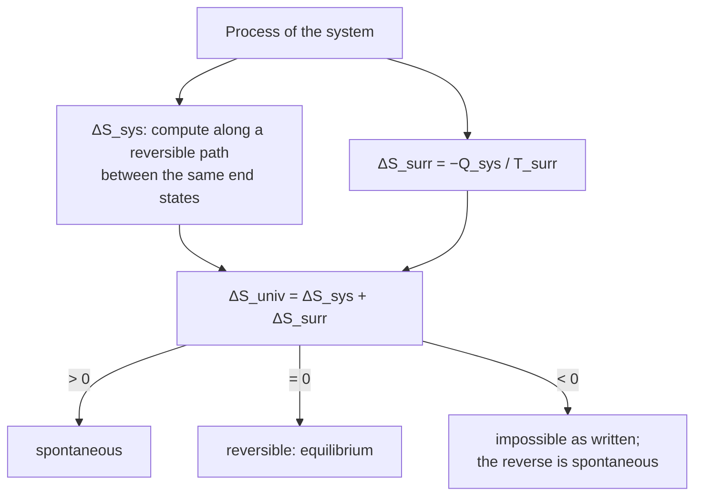

---
aliases:
  - Entropy
  - Clausius Entropy
  - Entropy Change
  - Second Law Entropy
  - Entropie
tags:
  - type/concept
  - domain/physics
  - domain/chemistry
  - domain/biology
  - level/L1
  - level/L2
  - level/L3
mastery: 0
prerequisites:
  - "[[Heat]]"
  - "[[Temperature]]"
  - "[[Laws of Thermodynamics]]"
  - "[[Ideal Gas Law]]"
  - "[[Integral]]"
related:
  - "[[Boltzmann Entropy]]"
  - "[[Microstate]]"
  - "[[Shannon Entropy]]"
  - "[[Gibbs Free Energy]]"
  - "[[Hydrophobic Effect]]"
  - "[[Protein Folding]]"
  - "[[Reversible Process]]"
  - "[[Heat Capacity]]"
projects: []
sources:
  - "[[University Physics (OpenStax)]]"
  - "[[Chemistry 2e (OpenStax)]]"
  - "[[Lehninger Principles of Biochemistry (Nelson)]]"
  - "[[Biochemistry (Berg)]]"
---

# Thermodynamic Entropy

> [!abstract]
> Entropy is the state function whose change is the heat exchanged reversibly divided by the temperature, ΔS = ∫δQ_rev/T; the second law says the entropy of the universe never decreases, which is the test that decides whether a process, from ice melting to a protein folding, can happen by itself.

## Definition

The **entropy** $S$ of a system is a state function whose change between two equilibrium states is

$$\Delta S = \int_{A}^{B} \frac{\delta Q_{\text{rev}}}{T},$$

the heat absorbed along a **reversible** path from A to B, each increment divided by the absolute temperature at which it is absorbed.[^up46] Units: J K⁻¹, or J mol⁻¹ K⁻¹ per mole. The **second law** states that the entropy of the universe increases in every spontaneous process and is unchanged in a reversible one: $\Delta S_{\text{univ}} = \Delta S_{\text{sys}} + \Delta S_{\text{surr}} \geq 0$.[^up46][^chem16]

## Why it matters

- **Spontaneity.** Whether a process can run by itself is decided by $\Delta S_{\text{univ}}$; at constant $T$ and $P$ this becomes $\Delta G < 0$ ([[Gibbs Free Energy]], [[Laws of Thermodynamics]]).
- **Biomolecular entropy stories.** The [[Hydrophobic Effect]] is driven mainly by the entropy of water,[^lehninger][^berg] and [[Protein Folding]], binding and duplex formation all trade a loss of conformational entropy against gains elsewhere.
- **Data that report entropy.** Calorimetry gives $\Delta H$ and, with $\Delta G$ from an equilibrium constant, $T\Delta S = \Delta H - \Delta G$: the enthalpy-entropy decomposition reported for binding and folding ([[Calorimetry]], [[Binding Free Energy]]).
- **One logarithm, three entropies.** The entropy of mixing has the form $-\sum x\ln x$, the same as [[Shannon Entropy]], and statistical physics writes $S = k_B\ln W$ ([[Boltzmann Entropy]]).

## Core (L1)

**Why a reversible path.** Heat depends on the path, but $\int \delta Q_{\text{rev}}/T$ does not: dividing by $T$ turns an inexact quantity into the change of a state function.[^up46] To get $\Delta S$ for a real, irreversible process, imagine *any* reversible path between the same end states and compute along it.

**Three standard calculations** (derivations; numbers from the code below):

1. **Phase change at the transition temperature** (reversible, $T$ constant): $\Delta S = \Delta H_{\text{trans}}/T_{\text{trans}}$. Ice melting, $\Delta H_{\text{fus}} = 6.01$ kJ/mol at 273.15 K:[^chem] $\Delta S_{\text{fus}} = +22.0$ J mol⁻¹ K⁻¹.
2. **Heating at constant pressure** (no phase change): $\delta Q_{\text{rev}} = C_P\, dT$, so $\Delta S = \int C_P\, dT/T = C_P\ln(T_2/T_1)$ for constant $C_P$ ([[Heat Capacity]]). Water from 25 to 37 °C: $75.4 \ln(310.15/298.15) = +2.98$ J mol⁻¹ K⁻¹.
3. **Isothermal expansion of an ideal gas**: $\Delta U = 0$, so $Q_{\text{rev}} = nRT\ln(V_2/V_1)$ ([[Ideal Gas Law#Deeper (L2)]]) and $\Delta S = nR\ln(V_2/V_1)$. Doubling the volume: $R\ln 2 = 5.76$ J K⁻¹ per mole.

**The second law decides.** For each process, add the entropy change of the system and of the surroundings. The surroundings act as a large reservoir at temperature $T_{\text{surr}}$ that receives the heat $-Q_{\text{sys}}$: $\Delta S_{\text{surr}} = -Q_{\text{sys}}/T_{\text{surr}}$.[^chem16]



**Worked case: ice and a room.** Melting 1 mol of ice takes 6.01 kJ from the surroundings (taking $\Delta H$ and $\Delta S$ at 0 °C):

| Room temperature | $\Delta S_{\text{sys}}$ | $\Delta S_{\text{surr}} = -6010/T$ | $\Delta S_{\text{univ}}$ | Verdict |
|---|---:|---:|---:|---|
| −10 °C | +22.00 | −22.84 | −0.84 | ice stays (water freezes) |
| 0 °C | +22.00 | −22.00 | 0.00 | equilibrium |
| +25 °C | +22.00 | −20.16 | +1.84 | ice melts |

(J mol⁻¹ K⁻¹.) The system's entropy rises in all three rows; only the total decides. The same heat costs the surroundings more entropy when they are cold. [[Gibbs Free Energy]] reaches the same verdict with $\Delta G = -T\Delta S_{\text{univ}}$.

**Bio: the hydrophobic effect and folding are entropy stories.**

- **Hydrophobic effect.** Water molecules next to a nonpolar surface are restricted to orientations that preserve their hydrogen bonds; when nonpolar groups cluster, this ordered water is released and the entropy of water rises, which makes clustering spontaneous at room temperature.[^lehninger][^berg] The details, including why large surfaces behave differently, are in [[Hydrophobic Effect]].
- **Folding.** A folded chain has far fewer conformations than an unfolded one, so folding *lowers* the chain's entropy, an unfavorable term. Burying nonpolar side chains away from water, the hydrophobic effect, is a major term that pays for it ([[Protein Folding]]).[^lehninger][^berg] A protein folds because the entropy of the universe, mostly of the water, increases.

## Deeper (L2)

**Irreversible processes: free expansion.** One mole of ideal gas expands into an equal evacuated volume through an opened valve, in an insulated container. Nothing pushes back, so $W = 0$; the container is insulated, so $Q = 0$; hence $\Delta U = 0$ and $T$ is unchanged. Yet the gas is not in the same state: to find $\Delta S$, use the reversible isothermal expansion between the same end states, $\Delta S = R\ln 2 = +5.76$ J K⁻¹. With $Q = 0$, $\Delta S > Q/T$: this is the **Clausius inequality**, $dS \geq \delta Q/T$, with equality only for reversible processes ([[Reversible Process]]). The surroundings did not change, so $\Delta S_{\text{univ}} > 0$: free expansion is spontaneous and never reverses by itself.

**Entropy of mixing.** Two ideal gases at the same $T$ and $P$ mixed by removing a partition: each gas expands isothermally from its own volume $V_i = x_i V$ to $V$, so

$$\Delta S_{\text{mix}} = \sum_i n_i R\ln\frac{V}{V_i} = -nR\sum_i x_i\ln x_i > 0.$$

Per mole of an equimolar binary mixture it is $R\ln 2 = 5.76$ J mol⁻¹ K⁻¹. The sum $-\sum_i x_i \ln x_i$ is the [[Shannon Entropy]] of the composition in nats: $\Delta S_{\text{mix}}/(nR\ln 2)$ is the same quantity in bits (code below). Ideal dilute solutions follow the same law, which is the origin of the $RT\ln c$ term in the [[Chemical Potential]].

**From $\Delta S_{\text{univ}}$ to $\Delta G$.** At constant $T$ and $P$, $\Delta S_{\text{surr}} = -\Delta H/T$, so $\Delta S_{\text{univ}} = -\Delta G/T$: the derivation is in [[Laws of Thermodynamics#Deeper (L2)]], and its use is the subject of [[Gibbs Free Energy]].

**Absolute entropies.** The third law fixes $S = 0$ for a perfect crystal at 0 K, so $S(T) = \int_0^T C_P\,dT'/T'$ plus $\Delta H_{\text{trans}}/T_{\text{trans}}$ for each phase change: entropies can be tabulated as absolute values, unlike energies ([[Laws of Thermodynamics]]).[^chem16]

## Advanced (L3)

- **Counting states.** Statistical physics identifies thermodynamic entropy with $S = k_B\ln W$, $W$ the number of microstates compatible with the macrostate ([[Boltzmann Entropy]], [[Microstate]]); per mole this is $R\ln W$. Free expansion doubles the volume available to each molecule, multiplying $W$ by $2^{N_A}$ and giving $R\ln 2$, the same result as the heat-based calculation.
- **A toy estimate of conformational entropy** (invented model): if each of $N$ residues can adopt $w$ conformations in the unfolded chain and one in the folded protein, folding changes the chain entropy by $\Delta S = -NR\ln w$. For $N = 100$ and $w = 3$, $\Delta S = -913$ J mol⁻¹ K⁻¹ and $-T\Delta S = +272$ kJ/mol at 25 °C. The free-energy difference between folded and unfolded states of typical proteins is only about 20 to 65 kJ/mol,[^lehninger] so this huge cost is almost exactly balanced by solvent entropy and favorable contacts: stability is a small difference of large terms ([[Free Energy Landscape]]).
- **Entropy from calorimetry.** A scanning calorimeter gives $C_P(T)$, hence $\Delta S = \int \Delta C_P\,dT/T$ and, at the midpoint of a transition, $\Delta S_m = \Delta H_m/T_m$ ([[Calorimetry]]). Titration calorimetry gives $\Delta H$ and $K$, hence $T\Delta S = \Delta H + RT\ln K$ for a binding reaction ([[Binding Free Energy]]).
- **Entropy production in living systems.** A cell in a steady state keeps its own entropy constant while producing entropy continuously, exported as heat and waste: the signature of a [[Nonequilibrium Steady State]].

## Mathematical representation

- Definition: $dS = \delta Q_{\text{rev}}/T$; $\Delta S = \int_A^B \delta Q_{\text{rev}}/T$, independent of the path; $\oint dS = 0$.
- Clausius inequality: $dS \geq \delta Q/T$; isolated system: $\Delta S \geq 0$.
- Phase change: $\Delta S = \Delta H_{\text{trans}}/T_{\text{trans}}$. Heating: $\Delta S = \int_{T_1}^{T_2} C_P\, dT/T$. Ideal gas, isothermal: $\Delta S = nR\ln(V_2/V_1) = -nR\ln(P_2/P_1)$.
- Mixing (ideal): $\Delta S_{\text{mix}} = -nR\sum_i x_i\ln x_i$, with $\sum_i x_i = 1$.
- Second law at constant $T$, $P$: $\Delta S_{\text{univ}} = \Delta S_{\text{sys}} - \Delta H_{\text{sys}}/T = -\Delta G_{\text{sys}}/T$.

## Computational representation

```python
import math

R = 8.314462618  # J/(mol K)


def ds_phase_change(dh: float, T: float) -> float:
    """Entropy change (J/(mol K)) of a reversible phase change at its transition temperature."""
    return dh / T


def ds_heating(cp: float, T1: float, T2: float) -> float:
    """Entropy change (J/(mol K)) on heating at constant pressure with constant molar Cp."""
    return cp * math.log(T2 / T1)


def ds_isothermal_ideal_gas(n: float, V1: float, V2: float) -> float:
    """Entropy change (J/K) of n mol of ideal gas going from V1 to V2 at constant T, by any path."""
    return n * R * math.log(V2 / V1)


def ds_mixing(x: list[float]) -> float:
    """Ideal entropy of mixing per mole of mixture, J/(mol K): -R sum x ln x."""
    return -R * sum(xi * math.log(xi) for xi in x if xi > 0)


# Ice melting: system at the melting point, surroundings at T
DH_FUS, T_M = 6010.0, 273.15
ds_sys = ds_phase_change(DH_FUS, T_M)
for t_c in (-10, 0, 10, 25):
    T = t_c + 273.15
    ds_surr = -DH_FUS / T          # the surroundings supply the heat at temperature T
    print(f"{t_c:+3d} C: dS_sys = {ds_sys:5.2f}, dS_surr = {ds_surr:6.2f}, dS_univ = {ds_sys + ds_surr:+5.2f} J/(mol K)")

print(f"water 25 -> 37 C: {ds_heating(75.4, 298.15, 310.15):.2f} J/(mol K)")
print(f"free expansion, 1 mol, V -> 2V: {ds_isothermal_ideal_gas(1, 1, 2):.2f} J/K (Q = 0, W = 0)")
for x in ([0.5, 0.5], [0.25] * 4, [0.79, 0.21]):
    H_bits = -sum(xi * math.log2(xi) for xi in x)
    print(f"x = {x}: dS_mix = {ds_mixing(x):5.2f} J/(mol K) = R ln2 x {H_bits:.3f} bits")
```

```text
-10 C: dS_sys = 22.00, dS_surr = -22.84, dS_univ = -0.84 J/(mol K)
 +0 C: dS_sys = 22.00, dS_surr = -22.00, dS_univ = +0.00 J/(mol K)
+10 C: dS_sys = 22.00, dS_surr = -21.23, dS_univ = +0.78 J/(mol K)
+25 C: dS_sys = 22.00, dS_surr = -20.16, dS_univ = +1.84 J/(mol K)
water 25 -> 37 C: 2.98 J/(mol K)
free expansion, 1 mol, V -> 2V: 5.76 J/K (Q = 0, W = 0)
x = [0.5, 0.5]: dS_mix =  5.76 J/(mol K) = R ln2 x 1.000 bits
x = [0.25, 0.25, 0.25, 0.25]: dS_mix = 11.53 J/(mol K) = R ln2 x 2.000 bits
x = [0.79, 0.21]: dS_mix =  4.27 J/(mol K) = R ln2 x 0.741 bits
```

The four-component equimolar mixture, like a random DNA sequence's four bases, carries 2 bits per particle: thermodynamic and information entropy differ by the factor $R\ln 2$ per mole (or $k_B\ln 2$ per particle). The ice rows ignore the heat-capacity correction to $\Delta H$ and $\Delta S$ away from 0 °C.

## Worked example

> [!example] A warm hand on a cold metal rail
> 1 kJ of heat flows from a hand at 34 °C (307.15 K) to a rail at 0 °C (273.15 K); both are large enough to keep their temperatures.
> 1. **Hand**: $\Delta S = -1000/307.15 = -3.256$ J/K.
> 2. **Rail**: $\Delta S = +1000/273.15 = +3.661$ J/K.
> 3. **Universe**: $+0.405$ J/K $> 0$: spontaneous, as expected.
> 4. **Reading**: the same 1 kJ is "worth" more entropy at low temperature. Heat flowing downhill in temperature always creates entropy; the larger the temperature gap, the more ([[Temperature#Deeper (L2)]]).

## Common misconceptions

> [!warning] "Entropy is disorder"
> A useful image, often misleading. Entropy counts the number of microstates, or equivalently heat over temperature; ordered-looking water around a nonpolar solute and a crystal that forms spontaneously on cooling show that visual order is a poor guide. Compute $\Delta S$, do not eyeball it.

> [!warning] "A process with $\Delta S_{\text{sys}} < 0$ cannot be spontaneous"
> Water freezes below 0 °C and proteins fold with $\Delta S_{\text{chain}} < 0$. What must increase is $\Delta S_{\text{univ}}$, which includes the heat released to the surroundings and the solvent.

> [!warning] "No heat exchanged means no entropy change"
> Only *reversible* heat measures entropy. In a free expansion $Q = 0$ but $\Delta S = R\ln 2$ per mole.

> [!warning] "Folding is driven by the protein becoming more ordered"
> Ordering the chain costs entropy. Folding is favorable largely because water gains entropy when nonpolar groups are buried ([[Hydrophobic Effect]]).[^lehninger]

## Exercises

> [!question] Exercise 1 (L1)
> Compute $\Delta S$ for melting 36.0 g of ice at 0 °C ($\Delta H_{\text{fus}} = 6.01$ kJ/mol, $M = 18.015$ g/mol). Is the entropy of the universe changed if the surroundings are also at 0 °C?

> [!success]- Solution
> $n = 36.0/18.015 = 1.998$ mol; $\Delta S = 1.998 \times 6010/273.15 = +44.0$ J/K. With surroundings at 0 °C, $\Delta S_{\text{surr}} = -44.0$ J/K and $\Delta S_{\text{univ}} = 0$: a reversible process at equilibrium.

> [!question] Exercise 2 (L1)
> Which of these increase the entropy of the system: (a) heating a buffer from 4 to 37 °C; (b) compressing a gas isothermally; (c) dissolving a salt into ions; (d) a duplex forming from two DNA strands?

> [!success]- Solution
> (a) Increases: $C_P\ln(T_2/T_1) > 0$. (b) Decreases: $nR\ln(V_2/V_1) < 0$. (c) Usually increases (more particles, free to mix), but the solvent's contribution can go either way: compute, do not guess. (d) Decreases for the strands: two molecules become one and lose conformational freedom, so a duplex that forms spontaneously must pay for it with a favorable enthalpy (stacking and pairing, see [[DNA]]).

> [!question] Exercise 3 (L2)
> Derive $\Delta S_{\text{mix}} = -nR\sum x_i\ln x_i$ for ideal gases, and show that it is maximal at equal mole fractions for two components.

> [!success]- Solution
> See Deeper (L2) for the derivation. For two components, $f(x) = -x\ln x - (1-x)\ln(1-x)$; $f'(x) = \ln\frac{1-x}{x} = 0$ at $x = 1/2$, and $f''(x) = -\frac{1}{x(1-x)} < 0$: a maximum, $f(1/2) = \ln 2$.

> [!question] Exercise 4 (L2)
> A binding reaction at 25 °C has $K = 10^6$ (standard state 1 M) and a calorimetric $\Delta H = -20$ kJ/mol. Compute $\Delta G^\circ$ and $T\Delta S^\circ$. Is binding enthalpy- or entropy-driven?

> [!success]- Solution
> $\Delta G^\circ = -RT\ln K = -2.479 \times 13.82 = -34.2$ kJ/mol. $T\Delta S^\circ = \Delta H - \Delta G^\circ = -20 + 34.2 = +14.2$ kJ/mol. Both terms are favorable; the entropy term contributes about 40 %. Such decompositions are what titration calorimetry reports ([[Calorimetry]], [[Binding Free Energy]]).

> [!question] Exercise 5 (L3, Python)
> In the toy model of conformational entropy ($\Delta S = -NR\ln w$), compute $-T\Delta S$ at 25 °C for $N = 100$ residues and $w$ = 2, 3 and 4. What must the other contributions to $\Delta G_{\text{fold}}$ add up to for a net stability of $-30$ kJ/mol?

> [!success]- Solution
> ```python
> import math
> R, T, N = 8.314462618, 298.15, 100
> for w in (2, 3, 4):
>     cost = N * R * T * math.log(w) / 1e3          # -T dS_conf, kJ/mol
>     print(f"w = {w}: -T dS_conf = {cost:6.1f} kJ/mol, other terms must sum to {-30 - cost:7.1f} kJ/mol")
> ```
> Output: `w = 2: -T dS_conf =  171.8 kJ/mol, other terms must sum to  -201.8 kJ/mol`, `w = 3: ... 272.3 ... -302.3`, `w = 4: ... 343.7 ... -373.7`. The chain's entropy loss costs hundreds of kJ/mol; the hydrophobic effect and favorable contacts must supply slightly more. A modest change in either side (a mutation, a temperature shift) can therefore unfold a protein.

## Mastery checklist

- [ ] 1 Recognized: I can define $\Delta S = \int\delta Q_{\text{rev}}/T$ and state the second law as $\Delta S_{\text{univ}} \geq 0$.
- [ ] 2 Understood: I can explain why the reversible path is needed, why free expansion creates entropy, and why water's entropy drives the hydrophobic effect.
- [ ] 3 Practiced: I compute entropy changes for phase changes, heating, expansion and mixing, and decide spontaneity from $\Delta S_{\text{sys}} + \Delta S_{\text{surr}}$.
- [ ] 4 Applied: I decompose calorimetric binding or folding data into $\Delta H$ and $T\Delta S$ and interpret the signs.
- [ ] 5 Explained: I can teach the links between Clausius, Boltzmann and Shannon entropies, and why protein stability is a small difference of large entropy and enthalpy terms.

## References

[^up46]: [[University Physics (OpenStax)]], Volume 2, ch. 4, §4.6 "Entropy" (entropy change as reversible heat over temperature, state function, entropy of the universe in reversible and irreversible processes).
[^chem16]: [[Chemistry 2e (OpenStax)]], ch. 16 "Thermodynamics" (entropy, second law as $\Delta S_{\text{univ}} > 0$ for spontaneous processes, entropy change of the surroundings, third law and standard entropies).
[^chem]: [[Chemistry 2e (OpenStax)]] (enthalpy of fusion of water, 6.01 kJ/mol).
[^lehninger]: [[Lehninger Principles of Biochemistry (Nelson)]], 8th ed. (2021), treatment of water and hydrophobic interactions (ordered water around nonpolar solutes, entropy gain on its release) and of protein folding (stability of typical proteins, 20 to 65 kJ/mol between folded and unfolded states) (chapter numbers not verified).
[^berg]: [[Biochemistry (Berg)]], 5th ed. (2002), treatment of hydrophobic interactions and of protein folding (nonpolar side chains buried in the interior).
