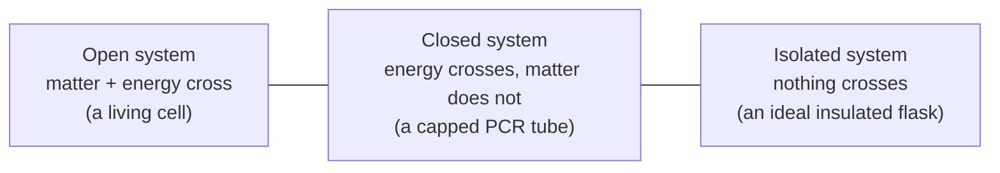

---
aliases:
  - System and Surroundings
  - Open System
  - Closed System
  - Isolated System
  - State Function
  - State Variable
  - Système thermodynamique
tags:
  - type/concept
  - domain/physics
  - domain/chemistry
  - domain/biology
  - level/L1
  - level/L2
  - level/L3
mastery: 0
prerequisites:
  - "[[Conservation of Energy]]"
  - "[[Pressure]]"
  - "[[Mole]]"
related:
  - "[[Temperature]]"
  - "[[Internal Energy]]"
  - "[[Laws of Thermodynamics]]"
  - "[[Cell]]"
  - "[[Cell Membrane]]"
  - "[[Nonequilibrium Steady State]]"
  - "[[Statistical Ensemble]]"
  - "[[Homeostasis]]"
projects: []
sources:
  - "[[University Physics (OpenStax)]]"
  - "[[Biology 2e (OpenStax)]]"
  - "[[Physical Biology of the Cell (Phillips)]]"
---

# Thermodynamic System

> [!abstract]
> Thermodynamics starts by drawing a boundary: the system is what is inside, the surroundings are everything else, and the type of system (open, closed, isolated) says what may cross the boundary, matter, energy or nothing.

## Definition

A **thermodynamic system** is the part of the universe whose thermodynamic properties are studied; it is embedded in its **surroundings** (environment) and exchanges heat and work with them through a **boundary**, real or imagined. Its macroscopic properties are averages over its many molecules.[^up31] A system is **open** if energy and matter can cross the boundary, **closed** if energy can cross but matter cannot,[^bio63] and **isolated** if neither can.[^up3]

## Why it matters

- Every thermodynamic statement is relative to a choice of system. "Entropy decreases when a protein folds" is true for the chain and false for chain plus water ([[Thermodynamic Entropy]], [[Hydrophobic Effect]]).
- The type of system selects the right free energy: [[Gibbs Free Energy]] for a closed system at constant temperature and pressure (a tube, a cuvette), [[Helmholtz Free Energy]] at constant volume.
- Biological data come from open systems: cells exchange matter and energy with their surroundings,[^bio63] so a metabolite level is a balance of fluxes, not an equilibrium value ([[Nonequilibrium Steady State]], [[Metabolism]]).
- Molecular simulations choose a system type explicitly: the ensemble labels NVE, NVT and NPT say which quantities are held fixed ([[Statistical Ensemble]]).

## Core (L1)

**Three kinds of boundary.**



**State variables.** The macroscopic state of a simple system at equilibrium is fixed by a few measurable quantities: pressure $P$, volume $V$, [[Temperature|temperature]] $T$ and amount $n$ ([[Mole]]). They are linked by an **equation of state**, such as the [[Ideal Gas Law]] $PV = nRT$, so only some of them are independent.[^up3] Doubling a system doubles $V$ and $n$ (**extensive** variables) but leaves $T$ and $P$ unchanged (**intensive** variables).

**State functions versus path quantities.** A **state function** depends only on the current state, not on how the system got there: $P$, $V$, $T$, and [[Internal Energy|internal energy]] $U$; later [[Enthalpy|enthalpy]], [[Thermodynamic Entropy|entropy]] and free energies. [[Heat]] and [[Work (Physics)|work]] are not properties of a state: they are energy transfers across the boundary during a process, and their values depend on the path.[^up3]

**Equilibrium.** Two systems in thermal contact reach **thermal equilibrium** when their temperatures are equal and no more heat flows.[^up11] A system is in **thermodynamic equilibrium** when its state variables are uniform and do not change in time and no net flow of heat, work or matter crosses its boundary. State variables such as $T$ and $P$ are only defined for (at least local) equilibrium states.

**Bio: a cell is an open system.** Organisms take in energy-rich molecules and release energy and matter to their environment: they are open systems.[^bio63] Nutrients, O₂ and CO₂ cross the [[Cell Membrane|membrane]], heat leaves it. The boundary is a choice: for a binding experiment the system may be one protein and its ligand in a closed tube, while for physiology it is the whole [[Cell]].

## Deeper (L2)

**Steady state is not equilibrium.** An open system can reach a **steady state**: its variables stop changing because inflow and outflow balance, while matter and energy keep flowing through it. At equilibrium, by contrast, every net flux is zero. The toy model in the Computational representation shows the difference: the same reaction $\mathrm{A} \rightleftharpoons \mathrm{B}$ reaches $[\mathrm{B}]/[\mathrm{A}] = K$ in a closed vessel, but is held far from it in an open compartment fed with A and drained of B. A living cell is of the second kind ([[Nonequilibrium Steady State]], [[Homeostasis]]).

**Local equilibrium.** Even in a cell, many subsystems (a binding reaction, a folding protein) relax much faster than their surroundings change, so they can be treated with equilibrium thermodynamics; this is the working assumption behind applying free energies and equilibrium constants to the living cell.[^pboc]

## Advanced (L3)

**System types and simulation ensembles.** A [[Molecular Dynamics Simulation|molecular dynamics simulation]] of $N$ atoms in a fixed box with no thermostat is an isolated system: Newton's equations conserve its total energy (NVE). Coupling it to a thermostat makes it a closed system exchanging heat with a bath at fixed $T$ (NVT); adding a barostat lets the volume exchange work with surroundings at fixed $P$ (NPT). The free energy that is minimized at equilibrium follows from that choice: Helmholtz for NVT, Gibbs for NPT ([[Statistical Ensemble]], [[Helmholtz Free Energy]]).

## Mathematical representation

- State space: the equilibrium states of a simple one-component system form a surface $f(P, V, T, n) = 0$ (equation of state); two variables plus $n$ fix the state.
- A quantity $X$ is a **state function** when its change depends only on the endpoints, $\Delta X = X(B) - X(A)$, for every path; equivalently its differential is exact and $\oint dX = 0$ around any cycle.
- Heat and work have **inexact** differentials, written $\delta Q$ and $\delta W$: $\int_A^B \delta W$ depends on the path, and $\oint \delta W \neq 0$ in general ([[Internal Energy]] computes both on two paths).
- Balance for an open system: $\dfrac{dn}{dt} = J_{\text{in}} - J_{\text{out}} + r$, with fluxes $J$ across the boundary and $r$ the net production inside. Steady state: $dn/dt = 0$. Equilibrium: every flux and net reaction rate is zero.

## Computational representation

A compartment is a set of state variables updated by fluxes. The toy model (invented rate constants) runs the reaction $\mathrm{A} \rightleftharpoons \mathrm{B}$ with $K = k_f/k_r = 1$ in a closed vessel and in an open one fed with A at rate $J$ and drained of B with rate constant $k_{\text{out}}$:

```python
def simulate(open_system: bool, t_end: float = 20.0, dt: float = 1e-3):
    """Toy compartment with A <-> B (k_f, k_r). Open: A enters at rate J, B leaves with rate constant k_out."""
    k_f, k_r = 1.0, 1.0          # 1/s, so K = k_f / k_r = 1 (invented)
    J, k_out = 1.0, 5.0          # mM/s and 1/s (invented)
    a, b = (1.0, 0.0) if not open_system else (0.0, 0.0)   # mM
    for _ in range(int(t_end / dt)):
        net = k_f * a - k_r * b                      # net A -> B rate
        da = (J if open_system else 0.0) - net
        db = net - (k_out * b if open_system else 0.0)
        a, b = a + da * dt, b + db * dt
    return a, b, k_f * a - k_r * b

for label, is_open in (("closed", False), ("open", True)):
    a, b, flux = simulate(is_open)
    print(f"{label:6}: A = {a:.3f} mM, B = {b:.3f} mM, B/A = {b / a:.3f}, net A->B flux = {flux:.3f} mM/s")
```

```text
closed: A = 0.500 mM, B = 0.500 mM, B/A = 1.000, net A->B flux = 0.000 mM/s
open  : A = 1.200 mM, B = 0.200 mM, B/A = 0.167, net A->B flux = 1.000 mM/s
```

Both compartments end with constant concentrations, but only the closed one is at equilibrium ($B/A = K$, zero net flux). The open one is a steady state with a permanent flux of 1 mM/s through the reaction.

## Worked example

> [!example] Choosing and classifying the system
> 1. **Capped PCR tube in a thermocycler.** Heat flows in and out at each cycle, no molecule leaves: **closed** ([[Polymerase Chain Reaction]]).
> 2. **Bacterium in a culture flask.** Glucose and O₂ enter, CO₂ and heat leave: **open**.[^bio63]
> 3. **Sample in a well-insulated flask, over a few minutes.** Neither heat nor matter crosses on that time scale: approximately **isolated**. Over hours heat leaks, so "isolated" is an idealization tied to a time scale.
> 4. **Same flask, new boundary.** Take flask plus room as the system: the heat leak is now internal, and the larger system is closer to isolated. Changing the boundary changes the bookkeeping, not the physics.

## Common misconceptions

> [!warning] "Closed means nothing gets in or out"
> A closed system exchanges energy (heat, work) but not matter. A system that exchanges neither is isolated.

> [!warning] "A cell whose concentrations are constant is at equilibrium"
> Constant concentrations with continuous inflow and outflow define a steady state. At equilibrium the net fluxes are zero; a cell at equilibrium is dead.

> [!warning] "A system contains heat and work"
> A system has an internal energy; heat and work exist only while energy crosses the boundary, and their amounts depend on the path.[^up3]

## Exercises

> [!question] Exercise 1 (L1)
> Classify as open, closed or isolated: (a) a sealed ampoule of enzyme in a 37 °C water bath; (b) a human; (c) the whole universe; (d) a dialysis bag in buffer.

> [!success]- Solution
> (a) Closed: heat crosses the glass, no matter. (b) Open: food, O₂, CO₂, water and heat cross. (c) Isolated by definition: nothing is outside it. (d) Open: water and small solutes cross the membrane (only large molecules are retained).

> [!question] Exercise 2 (L1)
> Which of these are state functions: temperature, heat absorbed, volume, work done, internal energy? Which are intensive?

> [!success]- Solution
> State functions: temperature, volume, internal energy. Heat absorbed and work done are path quantities. Temperature is intensive; volume and internal energy are extensive.

> [!question] Exercise 3 (L2)
> For the open compartment of the code, derive the steady-state concentrations analytically and check them against the simulation.

> [!success]- Solution
> Set both derivatives to zero. $dB/dt = k_f A - (k_r + k_{\text{out}})B = 0$ gives $B = k_f A/(k_r + k_{\text{out}}) = A/6$. $dA/dt = J - k_f A + k_r B = 0$ gives $J = A - A/6 = 5A/6$, so $A = 1.2$ mM and $B = 0.2$ mM, as simulated. The net flux $k_f A - k_r B = 1$ mM/s equals the supply $J$: everything that enters leaves as B.

> [!question] Exercise 4 (L3, Python)
> Rerun `simulate(True)` with `k_out` set to 0.01 instead of 5 (edit the constant). How close does $B/A$ get to $K$, and why? What does this say about when a pathway step can be treated as near equilibrium?

> [!success]- Solution
> The analytical steady state is $B/A = k_f/(k_r + k_{\text{out}}) = 1/1.01 \approx 0.990$, close to $K = 1$. The compartment now fills slowly: `simulate(True, t_end=t)` gives $B/A$ = 0.944, 0.987 and 0.990 for $t$ = 20, 200 and 2000 s, with A near 101 mM and B near 100 mM at the end. When removal is slow compared with the reverse reaction ($k_{\text{out}} \ll k_r$), the step relaxes to near equilibrium while matter still flows through it. Steps with fast exchange are near equilibrium in vivo; steps with slow reverse reactions are held far from it ([[Metabolism]]).

## Mastery checklist

- [ ] 1 Recognized: I can define system, surroundings and boundary, and name the three types of system.
- [ ] 2 Understood: I can explain why heat and work are not state functions and why a steady state is not an equilibrium.
- [ ] 3 Practiced: I can classify real setups, derive a steady state and simulate an open compartment.
- [ ] 4 Applied: I choose and state the system explicitly before interpreting a calorimetry, binding or simulation dataset.
- [ ] 5 Explained: I can teach how the choice of boundary and ensemble decides which free energy is minimized, and when local equilibrium applies in a cell.

## References

[^up31]: [[University Physics (OpenStax)]], Volume 2, ch. 3 "The First Law of Thermodynamics", §3.1 "Thermodynamic Systems" (system, environment, boundary; macroscopic properties as averages over molecules).
[^up3]: [[University Physics (OpenStax)]], Volume 2, ch. 3 "The First Law of Thermodynamics" (state variables and equation of state, isolated systems, path dependence of heat and work).
[^up11]: [[University Physics (OpenStax)]], Volume 2, ch. 1, §1.1 "Temperature and Thermal Equilibrium".
[^bio63]: [[Biology 2e (OpenStax)]], ch. 6 "Metabolism", §6.3 "The Laws of Thermodynamics" (system and surroundings, open and closed systems, biological organisms as open systems).
[^pboc]: [[Physical Biology of the Cell (Phillips)]], 2nd ed., ch. 5 "Mechanical and Chemical Equilibrium in the Living Cell".
