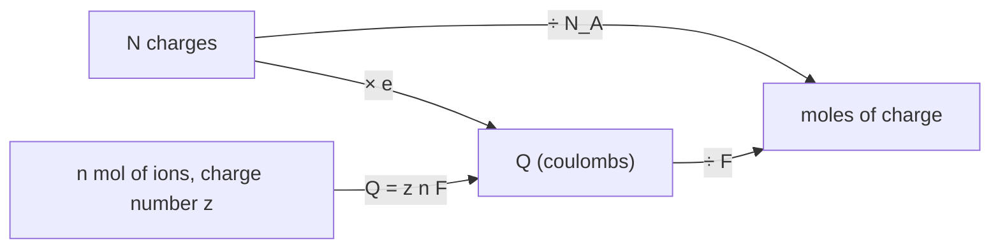

---
aliases:
  - Charge
  - Elementary Charge
  - Charge électrique
tags:
  - type/concept
  - domain/physics
  - domain/chemistry
  - domain/biology
  - level/L1
  - level/L2
mastery: 0
prerequisites:
  - "[[Atom]]"
  - "[[Mole]]"
related:
  - "[[Coulomb's Law]]"
  - "[[Electric Field]]"
  - "[[Electric Current]]"
  - "[[Ionic Bond]]"
  - "[[Amino Acid]]"
  - "[[Nucleic Acid]]"
  - "[[Isoelectric Point]]"
  - "[[Nernst Equation]]"
projects: []
sources:
  - "[[University Physics (OpenStax)]]"
  - "[[NIST Reference on Constants, Units, and Uncertainty]]"
  - "[[Chemistry 2e (OpenStax)]]"
  - "[[Biochemistry (Berg)]]"
  - "[[Molecular Biology of the Cell (Alberts)]]"
  - "[[Physical Biology of the Cell (Phillips)]]"
  - "[[Watson 1953 - Molecular Structure of Nucleic Acids]]"
  - "[[Blattner 1997 - The Complete Genome Sequence of Escherichia coli K-12]]"
  - "[[Lee 2012 - Agarose Gel Electrophoresis for the Separation of DNA Fragments]]"
---

# Electric Charge

> [!abstract]
> Electric charge is the property that makes particles push or pull on each other electrically: it comes in whole multiples of the elementary charge $e$, it is never created or destroyed, and the Faraday constant converts moles of ions into coulombs.

## Definition

**Electric charge** $q$ is a property of matter that comes in two kinds, positive and negative: like charges repel, unlike charges attract. Its SI unit is the **coulomb** (C = A s). Charge is **quantized**: a free charge is always an integer multiple of the **elementary charge** $e$, the charge of the proton ($+e$) and the opposite of the charge of the electron ($-e$). Charge is **conserved**: the net charge of an isolated system never changes.[^up5] Since the 2019 revision of the SI, $e = 1.602\,176\,634 \times 10^{-19}$ C exactly.[^nist]

## Why it matters

- **Molecules are sorted and counted by charge.** DNA carries one negative charge per backbone phosphate, which pulls it through a [[Gel Electrophoresis|gel]];[^lee] the net charge of a protein, summed from its sequence, gives its [[Isoelectric Point]].[^berg]
- **Mass spectra are read in charge units.** A mass spectrometer measures the mass-to-charge ratio $m/z$, where $z$ is the number of elementary charges carried by the ion ([[Mass Spectrometry]]).[^berg]
- **Electrochemistry counts moles of charge.** The Faraday constant $F$ appears in the [[Nernst Equation]] and in $\Delta G = -nF\Delta E$ for redox reactions ([[Reduction Potential]]);[^c2e17] it also converts an ionic [[Electric Current]] into moles of ions per second.

## Core (L1)

**Carriers.** Atoms are made of protons ($+e$), electrons ($-e$) and neutral neutrons; a neutral atom has as many electrons as protons ([[Atom]]). An object is charged when it has an excess or a deficit of electrons.[^up5] An **ion** carries a net charge $ze$, where the **charge number** $z$ is an integer.

**Quantization.** $q = Ne$ with $N$ an integer.[^up5] One coulomb is about $6.24 \times 10^{18}$ elementary charges, a huge amount at the molecular scale: chemistry and biology count charges, physics measures coulombs.

**Conservation.** Charge moves; it is never created. Rubbing transfers electrons from one object to another, and every balanced reaction has the same net charge on both sides.[^up5] Dissociation of phosphate: $\mathrm{H_2PO_4^- \rightleftharpoons HPO_4^{2-} + H^+}$, $-1 = -2 + 1$. A dissolved salt releases ions whose charges sum to zero, so a salt solution stays neutral overall.

**Bio: charges you meet in cells** (charge numbers at pH 7; they feed [[Coulomb's Law]] and the net-charge calculations of [[Amino Acid]] and [[Nucleic Acid]]):

| Species | $z$ | Source |
|---|---:|---|
| Na⁺, K⁺ | +1 | group 1 cations[^c2e2] |
| Mg²⁺, Ca²⁺ | +2 | group 2 cations[^c2e2] |
| Cl⁻ | −1 | group 17 anion[^c2e2] |
| HPO₄²⁻ (hydrogen phosphate) | −2 | polyatomic ion[^c2e2] |
| Lys, Arg side chains | +1 | protonated amine and guanidinium[^berg] |
| Asp, Glu side chains | −1 | carboxylates[^berg] |
| His side chain | 0 to +1 | pKa near 6, partly protonated[^berg] |
| Backbone of DNA or RNA | −1 per phosphate | phosphodiester linkage[^berg][^alberts] |

**Moles of charge: the Faraday constant.** One mole of elementary charges is
$$F = N_A\, e = 96\,485.332\,12\ldots\ \text{C mol}^{-1},$$
exact because the Avogadro constant $N_A$ and $e$ are both exact.[^nist] For $n$ moles of ions of charge number $z$, the charge is $Q = z\,n\,F$.



## Deeper (L2)

**Average charges are not integers.** One molecule always carries an integer number of charges, but a population of molecules titrates: at pH = pKa half of the groups are protonated ([[Acid-Base Equilibrium]]), so the *average* charge of a His side chain at pH 6 is about $+0.5$.[^berg] Net charges computed from a sequence ([[Amino Acid#Mathematical representation]]) are such population averages, which is why a protein can have a "charge of −2.3".

**Partial charges are not free charges.** In a polar bond the electrons are pulled toward the more electronegative atom, which carries a partial charge δ−, a fraction of $e$ ([[Electronegativity]]).[^c2e7] It describes how the electrons of a neutral molecule are distributed on average, not a separable fractional charge, so it does not contradict quantization.

**DNA as a line of charge.** B-DNA rises 3.4 Å per base pair[^watson] and has two phosphates per base pair, one per strand: one elementary charge every 1.7 Å along the axis, a linear charge density $\lambda = -e/0.17\ \text{nm} \approx -9.4 \times 10^{-10}$ C m⁻¹ (Exercise 4). In the nucleus this charge is partly neutralized by histones, proteins rich in positively charged residues ([[Chromatin]]);[^alberts] in solution a cloud of counterions screens it ([[Debye Length]]).[^pboc]

**Charge grows with length, and so does mass.** Every linear DNA fragment has about the same charge-to-mass ratio, so the separation by size in electrophoresis comes from the sieving gel, not from the charge.[^lee] The quantitative version is [[Electrophoretic Mobility]].

## Mathematical representation

- **Quantization**: $q = Ne$, $N \in \mathbb{Z}$, with $e$ the elementary charge (C).
- **Conservation**: for an isolated system, $\sum_i q_i^{\text{before}} = \sum_j q_j^{\text{after}}$.
- **Molar charge**: $Q = z\,n\,F$, with $z$ the charge number, $n$ the amount of ions (mol) and $F = N_A e$.
- **Net charge of a polymer**: $q = e \sum_g z_g$ over its ionizable groups $g$. For a population, $\langle q \rangle = e \sum_g z_g\, \theta_g$, where $\theta_g$ is the fraction of molecules in which group $g$ is charged.
- **Duplex DNA** of $L$ base pairs at neutral pH (one charge per internal phosphate, no terminal phosphate, as in [[Nucleic Acid#Mathematical representation]]): $q = -2(L-1)\,e$ if linear, $q = -2L\,e$ if circular.
- **Linear charge density**: $\lambda = q/\ell$ (C m⁻¹), for a charge $q$ spread over a length $\ell$.

## Computational representation

Charge numbers are integers: keep them as `int`, which is exact, and multiply by $e$ only when a value in coulombs is needed.

```python
E_CHARGE = 1.602176634e-19      # C, exact since the 2019 SI
N_A = 6.02214076e23             # mol^-1, exact
FARADAY = N_A * E_CHARGE        # C mol^-1, exact as a consequence


def charge(n_elementary: int) -> float:
    """Charge (C) of n elementary charges; n is an integer, negative for anions."""
    return n_elementary * E_CHARGE


def dsdna_charge_number(length_bp: int, circular: bool = False) -> int:
    """Net charge number of a dsDNA duplex at neutral pH: -1 per internal phosphate."""
    per_strand = length_bp if circular else length_bp - 1
    return -2 * per_strand


print(f"F = {FARADAY:.5f} C/mol")
print(f"1 C = {1 / E_CHARGE:.4e} elementary charges")
print(f"1 mmol of Ca2+ carries {2 * 1e-3 * FARADAY:.1f} C")
for length, circular in [(1000, False), (3000, True)]:
    z = dsdna_charge_number(length, circular)
    print(f"{length} bp {'circular' if circular else 'linear'}: z = {z}, q = {charge(z):.3e} C")
```

```text
F = 96485.33212 C/mol
1 C = 6.2415e+18 elementary charges
1 mmol of Ca2+ carries 193.0 C
1000 bp linear: z = -1998, q = -3.201e-16 C
3000 bp circular: z = -6000, q = -9.613e-16 C
```

## Worked example

> [!example] The charge carried by 1 µg of a 1 kb DNA fragment
> 1. **Amount of DNA.** With 617.9 g/mol per base pair (derived in [[Mole]]), one mole of a 1,000 bp duplex weighs 617,900 g, so 1 µg is $10^{-6}/617\,900 = 1.62 \times 10^{-12}$ mol, or $1.62 \times 10^{-12} \times N_A = 9.7 \times 10^{11}$ molecules.
> 2. **Charge per molecule.** Linear, no terminal phosphates: $z = -2(1000 - 1) = -1998$.
> 3. **Moles of charge.** $1998 \times 1.62 \times 10^{-12} = 3.23 \times 10^{-9}$ mol of elementary charges.
> 4. **Coulombs.** $Q = -3.23 \times 10^{-9} \times 96\,485 = -3.1 \times 10^{-4}$ C.
> 5. **Neutrality.** The tube is not charged: $3.23 \times 10^{-9}$ mol of cations (Na⁺ from the buffer, say) accompany the DNA, as conservation requires.

## Common misconceptions

> [!warning] "Ionizing or dissolving creates charge"
> It separates charges that were already there. NaCl → Na⁺ + Cl⁻ and $\mathrm{H_2PO_4^-} \to \mathrm{HPO_4^{2-} + H^+}$ conserve the net charge exactly.[^up5]

> [!warning] "A charge of −2.3 or a partial charge of −0.4 e breaks quantization"
> A non-integer *average* charge comes from a population in which different molecules carry different integer charges; a partial charge describes the electron distribution inside a neutral molecule. No isolated fraction of $e$ is involved.

> [!warning] "The Faraday constant is an independent measured constant"
> $F = N_A e$. Both factors are exact since 2019, so $F$ is exact too; converting moles of ions to coulombs adds no uncertainty.[^nist]

## Exercises

> [!question] Exercise 1 (L1)
> How many electrons must be removed from a neutral object to give it a charge of +1.0 nC?

> [!success]- Solution
> $N = q/e = 10^{-9}/(1.602 \times 10^{-19}) = 6.24 \times 10^{9}$ electrons. Even a nanocoulomb is billions of elementary charges.

> [!question] Exercise 2 (L1)
> How many coulombs are carried by 1.0 mmol of Ca²⁺? How many Ca²⁺ ions make up 1.0 pC?

> [!success]- Solution
> $Q = znF = 2 \times 10^{-3} \times 96\,485 = 193$ C. $N = q/(ze) = 10^{-12}/(2 \times 1.602 \times 10^{-19}) = 3.1 \times 10^{6}$ ions.

> [!question] Exercise 3 (L2)
> A protein has 12 Lys, 8 Arg, 15 Asp, 10 Glu and 4 His, plus a free N-terminus (+1) and C-terminus (−1). Estimate its net charge at pH 7, counting His as neutral. Why would a computed value usually not be an integer?

> [!success]- Solution
> $(+12 + 8 + 1) + (-15 - 10 - 1) = -5$. His (pKa near 6) is charged in a small fraction of molecules at pH 7, and each group's charged fraction depends on its pKa;[^berg] a program sums these fractions, giving a population average such as $-4.9$ ([[Isoelectric Point]]).

> [!question] Exercise 4 (L2, Python)
> Compute the linear charge density of B-DNA, then the charge of the circular *E. coli* K-12 chromosome (4,639,221 bp)[^blattner] in elementary charges and coulombs, and its contour length.

> [!success]- Solution
> ```python
> E_CHARGE = 1.602176634e-19
> RISE_NM = 0.34                      # B-DNA rise per base pair (Watson and Crick)
> spacing_nm = RISE_NM / 2            # two phosphates per base pair
> lam = -E_CHARGE / (spacing_nm * 1e-9)
> print(f"one charge every {spacing_nm:.2f} nm, lambda = {lam:.2e} C/m")
> genome_bp = 4_639_221               # E. coli K-12, circular
> print(f"E. coli chromosome: {2 * genome_bp:,} charges = {2 * genome_bp * E_CHARGE:.2e} C")
> print(f"length {genome_bp * RISE_NM / 1000:.0f} um")
> ```
> Output: `one charge every 0.17 nm, lambda = -9.42e-10 C/m`, then `E. coli chromosome: 9,278,442 charges = 1.49e-12 C` and `length 1577 um`. A circular duplex has $2L$ phosphates. About 9 million negative charges on a 1.6 mm molecule must be neutralized by counterions and DNA-binding proteins to fit inside a cell a few micrometres long.

## Mastery checklist

- [ ] 1 Recognized: I can state that charge is quantized in units of $e$ and conserved, and give $e$ and $F$ with their units.
- [ ] 2 Understood: I can explain why average and partial charges are not integers without contradicting quantization.
- [ ] 3 Practiced: I can convert between charge numbers, coulombs and moles of charge, and compute the charge of a DNA duplex or a peptide.
- [ ] 4 Applied: I computed the net charge of real proteins and DNA molecules from their sequences and used it to predict migration in a gel.
- [ ] 5 Explained: I can teach how charge connects electrophoresis, mass spectrometry ($m/z$) and electrochemistry ($F$), and why DNA separates by size only in a gel.

## References

[^up5]: [[University Physics (OpenStax)]], Volume 2, ch. 5 "Electric Charges and Fields" (two kinds of charge, carriers, quantization, conservation).
[^nist]: [[NIST Reference on Constants, Units, and Uncertainty]], CODATA 2022 values: elementary charge $e$ and Avogadro constant $N_A$, exact since the 2019 SI; Faraday constant $F = N_A e$.
[^c2e2]: [[Chemistry 2e (OpenStax)]], ch. 2 "Atoms, Molecules, and Ions" (charges of monatomic and polyatomic ions; section not verified).
[^c2e7]: [[Chemistry 2e (OpenStax)]], ch. 7 "Chemical Bonding and Molecular Geometry" (bond polarity and partial charges).
[^c2e17]: [[Chemistry 2e (OpenStax)]], treatment of electrochemistry (Nernst equation, $\Delta G = -nFE$).
[^berg]: [[Biochemistry (Berg)]], 5th ed. (2002), treatment of amino acids (charged side chains and typical pKa values), of nucleic acids (negatively charged backbone) and of mass spectrometry of proteins (mass-to-charge ratio).
[^alberts]: [[Molecular Biology of the Cell (Alberts)]], 4th ed. (2002), DNA structure and packaging (negatively charged backbone; histones rich in positively charged amino acids).
[^pboc]: [[Physical Biology of the Cell (Phillips)]], 2nd ed. (2012), treatment of electrostatics in salty solutions (counterion screening).
[^watson]: [[Watson 1953 - Molecular Structure of Nucleic Acids]], *Nature* (3.4 Å rise per residue).
[^blattner]: [[Blattner 1997 - The Complete Genome Sequence of Escherichia coli K-12]], *Science*.
[^lee]: [[Lee 2012 - Agarose Gel Electrophoresis for the Separation of DNA Fragments]], *Journal of Visualized Experiments*, abstract (negatively charged phosphate backbone, uniform mass-to-charge ratio, separation by size in the gel).
