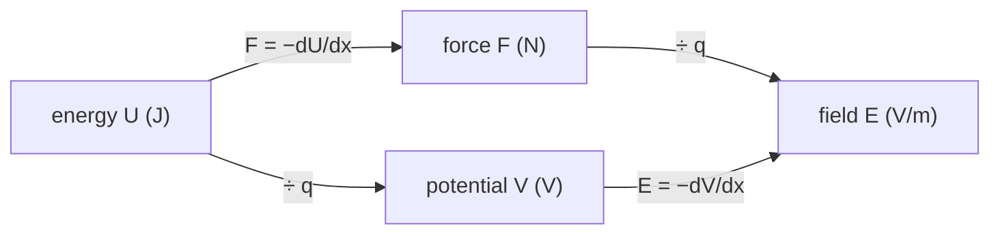

---
aliases:
  - Voltage
  - Potential Difference
  - Electronvolt
  - Thermal Voltage
  - Potentiel électrique
tags:
  - type/concept
  - domain/physics
  - domain/biology
  - domain/chemistry
  - level/L1
  - level/L2
mastery: 0
prerequisites:
  - "[[Electric Field]]"
  - "[[Potential Energy]]"
  - "[[Work (Physics)]]"
  - "[[Integral]]"
related:
  - "[[Coulomb's Law]]"
  - "[[Ohm's Law]]"
  - "[[Capacitance]]"
  - "[[Membrane Potential]]"
  - "[[Nernst Equation]]"
  - "[[Boltzmann Distribution]]"
  - "[[Gradient]]"
  - "[[Mass Spectrometry]]"
  - "[[Poisson-Boltzmann Equation]]"
projects: []
sources:
  - "[[University Physics (OpenStax)]]"
  - "[[NIST Reference on Constants, Units, and Uncertainty]]"
  - "[[Physical Biology of the Cell (Phillips)]]"
  - "[[Molecular Biology of the Cell (Alberts)]]"
  - "[[Biochemistry (Berg)]]"
---

# Electric Potential

> [!abstract]
> The electric potential is the potential energy per unit charge, measured in volts: a charge $q$ at potential $V$ has energy $qV$, the field points downhill in $V$, and at body temperature a membrane voltage is compared with the thermal voltage $k_B T/e \approx 27$ mV.

## Definition

The **electric potential** $V$ at a point is the electric potential energy $U$ of a test charge placed there divided by its charge: $V = U/q$. Its unit is the **volt** (1 V = 1 J/C). Only potential differences are physical:
$$\Delta V = V_B - V_A = -\int_A^B \vec E \cdot d\vec\ell .$$
With the reference $V = 0$ at infinity, a point charge $q$ creates $V = kq/r$, $k = 1/4\pi\varepsilon_0$.[^up7] The **electronvolt** is the energy gained by an elementary charge across 1 V: $1\ \text{eV} = 1.602\,176\,634 \times 10^{-19}$ J exactly.[^up7][^nist]

## Why it matters

- **Membrane potentials** of tens of millivolts drive ion flow through channels and carry nerve signals ([[Membrane Potential]], [[Action Potential]], [[Ion Channel]]).[^alberts]
- **The thermal voltage** $k_B T/e$ converts voltages into energies of thermal size; it is the scale factor of the [[Nernst Equation]] and of the [[Goldman-Hodgkin-Katz Equation]].[^pboc]
- **Mass spectrometry** gives every ion the same energy per charge, $zeV$, whatever its mass, so that its speed reveals $m/z$ ([[Mass Spectrometry]]).[^berg]
- **Electrostatic maps** of proteins and DNA show the potential computed around the molecule ([[Poisson-Boltzmann Equation]]): reading them requires this note.

## Core (L1)

**Energy and work.** A charge $q$ at potential $V$ has potential energy $U = qV$. Moving it from $A$ to $B$, the field does work $W = -q\,\Delta V$.[^up7] Left to themselves, positive charges move toward lower potential and negative charges toward higher potential, both lowering their energy.



Field and force are vectors; potential and energy are numbers. Dividing by the charge gives quantities that describe the place, not the particle.

**From field to potential.** In a uniform field $E$ along $x$, $\Delta V = -E\,\Delta x$: the potential drops steadily along the field.[^up7] Between two plates a distance $d$ apart, $|\Delta V| = Ed$, the relation used in [[Electric Field]]. In a gel run at 100 V across 20 cm (illustrative values), the potential changes by 5 V per centimetre of gel.

**Point charges add as numbers.** $V(\vec r) = \sum_i k q_i / |\vec r - \vec r_i|$, a scalar sum, simpler than adding field vectors.[^up7] In a medium, divide by $\varepsilon_r$ ([[Coulomb's Law#Deeper (L2)]]): 0.5 nm from a K⁺ ion in water, $V = ke/(80 \times 0.5\ \text{nm}) = 36$ mV.

**Equipotentials.** Surfaces of constant $V$ are perpendicular to the field lines, and the field points from high to low potential.[^up7] Between parallel plates they are planes parallel to the plates; around a point charge, spheres. No work is done moving a charge along an equipotential.

**Units at the molecular scale.**

| Quantity | Value |
|---|---|
| 1 eV | $1.602\,176\,634 \times 10^{-19}$ J (exact)[^nist] |
| 1 eV per particle, per mole | $F \times 1\ \text{V} = 96.485$ kJ/mol |
| 1 meV | $1.602 \times 10^{-22}$ J, about $0.04\ k_B T$ at 37 °C |

**Energy conservation.** An ion of charge $ze$ starting at rest and crossing a potential difference $\Delta V$ gains kinetic energy $\tfrac12 m v^2 = |z e \Delta V|$ ([[Kinetic Energy]], [[Conservation of Energy]]). In eV the result needs no arithmetic: a singly charged ion through 20 kV gains 20 keV, a doubly charged one 40 keV, whatever their masses. A time-of-flight spectrometer accelerates ions this way and then times their flight ([[Mass Spectrometry]]).[^berg]

**Bio: membrane potentials in millivolts.** The membrane potential is the potential inside the cell relative to outside, $V_m = V_\text{in} - V_\text{out}$; at rest it ranges from about −20 to −200 mV depending on the organism and cell type.[^alberts] Moving one Na⁺ from outside to inside at $V_m = -70$ mV changes its energy by $e \times (-0.070\ \text{V}) = -70$ meV $= -1.1 \times 10^{-20}$ J: about $-2.6\ k_B T$ at 37 °C, or −6.75 kJ/mol (computed below).

## Deeper (L2)

**Field from potential.** $\vec E = -\nabla V$ ([[Gradient]]); in one dimension $E_x = -dV/dx$. A map of $V$ contains the field: steep slopes are strong fields. Across a 5 nm membrane, 70 mV gives $1.4 \times 10^7$ V/m ([[Electric Field#Deeper (L2)]]).

**The thermal voltage.** The ratio
$$V_T = \frac{k_B T}{e} = \frac{RT}{F}$$
is 25.7 mV at 25 °C and 26.7 mV at 37 °C (computed below); physical biology rounds it to about 25 mV.[^pboc] The two forms are equal because $R = N_A k_B$ and $F = N_A e$.[^nist] A potential difference of one $V_T$ changes the energy of a unit charge by exactly $k_B T$, so a 70 mV membrane is "2.6 thermal units" deep for a monovalent ion and 5.2 for a divalent one.

**Potentials sort ions: Boltzmann and Nernst.** At equilibrium, ions are distributed between two regions according to the [[Boltzmann Distribution]] of their energy $zeV$:[^pboc]
$$\frac{c_\text{in}}{c_\text{out}} = \exp\!\left(-\frac{ze\,(V_\text{in} - V_\text{out})}{k_B T}\right).$$
Solved for the voltage, this is the [[Nernst Equation]], $V_\text{in} - V_\text{out} = \dfrac{k_B T}{ze} \ln\dfrac{c_\text{out}}{c_\text{in}}$,[^alberts] which gives −89 mV for K⁺ at 37 °C ([[Ionic Bond]]). Each tenfold concentration ratio is worth $V_T \ln 10$: 59.2 mV at 25 °C, 61.5 mV at 37 °C for $z = 1$.

**Electrochemical gradient.** An ion crossing a membrane feels both its concentration difference and the voltage; together they form the electrochemical gradient that drives it through open channels ([[Chemical Potential]], [[Ion Channel]]).[^alberts] The worked example adds the two terms for Na⁺.

## Mathematical representation

- **Definition**: $V(\vec r) = U(\vec r)/q$, in V = J/C; $U = qV$.
- **Line integral**: $V(B) - V(A) = -\int_A^B \vec E \cdot d\vec\ell$, independent of the path for electrostatic fields.
- **Inverse**: $\vec E = -\nabla V$.
- **Point charges in a medium**: $V(\vec r) = \dfrac{1}{4\pi\varepsilon_0\varepsilon_r}\displaystyle\sum_i \frac{q_i}{|\vec r - \vec r_i|}$.
- **Energy conservation** for a charge $q$ of mass $m$: $\tfrac12 m v_B^2 + qV_B = \tfrac12 m v_A^2 + qV_A$.
- **Thermal voltage and Boltzmann ratio**: $V_T = k_B T/e$; $c_1/c_2 = \exp[-z(V_1 - V_2)/V_T]$.

## Computational representation

Store voltages in volts and energies in joules; convert to mV, eV, $k_B T$ or kJ/mol only for display.

```python
import math

E_CHARGE = 1.602176634e-19      # C, exact
K_B = 1.380649e-23              # J K^-1, exact
N_A = 6.02214076e23             # mol^-1, exact
FARADAY = N_A * E_CHARGE        # C mol^-1


def thermal_voltage(T):
    """k_B T / e in volts."""
    return K_B * T / E_CHARGE


def energy_change(z, dV):
    """Change of potential energy (J) of an ion of charge number z moved through dV (V)."""
    return z * E_CHARGE * dV


for T in (298.15, 310.15):
    vt = thermal_voltage(T)
    print(f"T = {T} K: kBT/e = {vt * 1e3:.2f} mV, (kBT/e) ln 10 = {vt * math.log(10) * 1e3:.1f} mV")
print(f"1 eV = {E_CHARGE:.9e} J = {FARADAY / 1000:.3f} kJ/mol")

V_out, V_in = 0.0, -0.070               # V, outside taken as reference
dU = energy_change(+1, V_in - V_out)    # Na+ moved from outside to inside
print(f"Na+ inward: {dU:.3e} J = {dU / E_CHARGE * 1e3:.0f} meV = "
      f"{dU / (K_B * 310.15):.2f} kBT (37 C) = {dU * N_A / 1000:.2f} kJ/mol")
```

```text
T = 298.15 K: kBT/e = 25.69 mV, (kBT/e) ln 10 = 59.2 mV
T = 310.15 K: kBT/e = 26.73 mV, (kBT/e) ln 10 = 61.5 mV
1 eV = 1.602176634e-19 J = 96.485 kJ/mol
Na+ inward: -1.122e-20 J = -70 meV = -2.62 kBT (37 C) = -6.75 kJ/mol
```

## Worked example

> [!example] Why Na⁺ rushes into a cell
> A mammalian cell has about 145 mM Na⁺ outside and 5 to 15 mM inside;[^alberts] take 10 mM inside and $V_m = -70$ mV, at 37 °C ($k_B T = 4.28 \times 10^{-21}$ J).
> 1. **Electrical term.** $\Delta U_\text{el} = ze(V_\text{in} - V_\text{out}) = -70$ meV $= -0.070/0.02673\ k_B T = -2.62\ k_B T$.
> 2. **Concentration term.** Moving from 145 mM to 10 mM: $k_B T \ln(c_\text{in}/c_\text{out}) = \ln(10/145)\ k_B T = -2.67\ k_B T$ ([[Chemical Potential]]).
> 3. **Total.** About $-5.3\ k_B T$ per ion, or −13.6 kJ/mol: both terms push Na⁺ inward, so opening Na⁺ channels lets it in.
> 4. **Equilibrium check.** The voltage that would cancel the concentration term is $V_T \ln(145/10) = 26.73 \times 2.67 = +71$ mV, the Na⁺ Nernst potential for these concentrations; at −70 mV the cell is about 140 mV away from it.

## Common misconceptions

> [!warning] "Potential and potential energy are the same thing"
> $V$ belongs to the place, $U = qV$ to the particle. At the same negative $V_m$, a cation inside the cell has lower energy than outside and an anion higher: the same voltage attracts one and repels the other.

> [!warning] "A point has an absolute potential"
> Only differences are measured. The choice of zero (infinity, the ground, the extracellular bath) is a convention; $V_m$ is defined as inside minus outside,[^alberts] so its sign tells you which side is negative.

> [!warning] "The electronvolt is a unit of voltage"
> It is a unit of energy: the energy of one elementary charge across 1 V. A 20 kV accelerator gives a doubly charged ion 40 keV.

> [!warning] "Where the field is zero, the potential is zero"
> Halfway between two equal positive charges, $\vec E = 0$ but $V = 2kq/r > 0$. Zero field means the potential is flat there, not that it vanishes.

## Exercises

> [!question] Exercise 1 (L1)
> A Cl⁻ ion moves from outside to inside a cell at $V_m = -70$ mV. Give its energy change in eV, J and kJ/mol. Is the move electrically uphill or downhill?

> [!success]- Solution
> $\Delta U = (-e)(-0.070\ \text{V}) = +70$ meV $= 1.12 \times 10^{-20}$ J $= +6.75$ kJ/mol. Uphill: the negative interior repels the anion.

> [!question] Exercise 2 (L1)
> In a gel at 500 V/m, a 1,000 bp linear duplex ($z = -1998$) moves 1 cm toward the anode. Find the potential difference crossed and its energy change. Where does the energy go?

> [!success]- Solution
> Toward the anode the potential rises: $\Delta V = +Ed = +5$ V. $\Delta U = q\,\Delta V = -1998 \times 5$ eV $= -9990$ eV $= -1.6 \times 10^{-15}$ J. The molecule does not speed up: the energy is dissipated as heat by friction with the gel and buffer ([[Electrophoretic Mobility]]).

> [!question] Exercise 3 (L2)
> Show that $k_B T/e = RT/F$, and compute the potential that balances a tenfold K⁺ gradient at 37 °C.

> [!success]- Solution
> $RT/F = N_A k_B T/(N_A e) = k_B T/e$. At 310.15 K, $V_T = 26.73$ mV and $V_T \ln 10 = 61.5$ mV.

> [!question] Exercise 4 (L2, Python)
> At equilibrium with $V_m = -60$ mV and 37 °C, compute $c_\text{in}/c_\text{out}$ for ions with $z = +1$, $+2$ and $-1$.

> [!success]- Solution
> ```python
> vt = thermal_voltage(310.15)
> for z in (+1, +2, -1):
>     ratio = math.exp(-z * (-0.060) / vt)        # c_in / c_out at V_in - V_out = -60 mV
>     print(f"z = {z:+d}: c_in/c_out = {ratio:.3g}")
> ```
> Output: `9.44`, `89.1`, `0.106`. The exponent scales with $z$: a divalent cation is concentrated $9.44^2$ times, an anion depleted by the same factor that concentrates a monovalent cation.

> [!question] Exercise 5 (L2, Python)
> Ions start at rest, cross 20 kV and then fly through a 1 m field-free tube (an assumed instrument). Compute the kinetic energy, speed and flight time for (1000 Da, $z = 1$), (1001 Da, $z = 1$), (2000 Da, $z = 2$) and (5000 Da, $z = 1$).

> [!success]- Solution
> ```python
> V_ACC, L_DRIFT = 20e3, 1.0                     # 20 kV, 1 m (assumed instrument)
> for mass_da, z in [(1000, 1), (1001, 1), (2000, 2), (5000, 1)]:
>     m = mass_da * 1e-3 / N_A                   # kg
>     v = math.sqrt(2 * z * E_CHARGE * V_ACC / m)
>     print(f"{mass_da} Da, z = {z}: E_kin = {z * V_ACC / 1e3:.0f} keV, v = {v:.3e} m/s, t = {L_DRIFT / v * 1e6:.3f} us")
> ```
> ```text
> 1000 Da, z = 1: E_kin = 20 keV, v = 6.212e+04 m/s, t = 16.097 us
> 1001 Da, z = 1: E_kin = 20 keV, v = 6.209e+04 m/s, t = 16.105 us
> 2000 Da, z = 2: E_kin = 40 keV, v = 6.212e+04 m/s, t = 16.097 us
> 5000 Da, z = 1: E_kin = 20 keV, v = 2.778e+04 m/s, t = 35.994 us
> ```
> $t = L\sqrt{m/(2zeV)} \propto \sqrt{m/z}$. One dalton changes the flight time by 8 ns out of 16 µs, so the timing must resolve nanoseconds; the 2000 Da, $z = 2$ ion arrives with the 1000 Da, $z = 1$ ion.

## Mastery checklist

- [ ] 1 Recognized: I can define potential, volt and electronvolt, and state $U = qV$.
- [ ] 2 Understood: I can relate $V$ to $\vec E$ (integral and gradient), draw equipotentials, and explain why only differences matter.
- [ ] 3 Practiced: I can convert between mV, eV, J, $k_B T$ and kJ/mol, and compute ion energies across membranes and in spectrometers.
- [ ] 4 Applied: I computed equilibrium potentials and driving energies from real intra- and extracellular ion concentrations.
- [ ] 5 Explained: I can teach why $k_B T/e$ sets the scale of membrane voltages and how the Boltzmann distribution leads to the Nernst equation.

## References

[^up7]: [[University Physics (OpenStax)]], Volume 2, ch. 7 "Electric Potential" (potential and potential difference, electronvolt, point charges, equipotential surfaces, field from potential).
[^nist]: [[NIST Reference on Constants, Units, and Uncertainty]], CODATA 2022 values: elementary charge, electron volt, Avogadro and Boltzmann constants (exact since the 2019 SI).
[^pboc]: [[Physical Biology of the Cell (Phillips)]], 2nd ed. (2012), treatment of biological electricity and of the Boltzmann distribution ($k_B T/e \approx 25$ mV; ion distributions in a potential).
[^alberts]: [[Molecular Biology of the Cell (Alberts)]], 4th ed. (2002), section "Ion Channels and the Electrical Properties of Membranes" (resting potentials from about −20 to −200 mV, Nernst equation, electrochemical gradients) and the table of ion concentrations inside and outside a typical mammalian cell.
[^berg]: [[Biochemistry (Berg)]], 5th ed. (2002), treatment of mass spectrometry of proteins (ions accelerated by an electric field, time of flight, mass-to-charge ratio).
