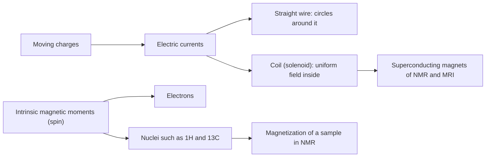

---
aliases:
  - B Field
  - Magnetic Flux Density
  - Tesla
  - Champ magnétique
tags:
  - type/concept
  - domain/physics
  - domain/biology
  - level/L1
  - level/L2
  - level/L3
mastery: 0
prerequisites:
  - "[[Electric Current]]"
  - "[[Electric Field]]"
  - "[[Vector]]"
related:
  - "[[Lorentz Force]]"
  - "[[Electromagnetic Induction]]"
  - "[[Nuclear Magnetic Resonance Spectroscopy]]"
  - "[[Spectroscopy]]"
  - "[[Ohm's Law]]"
  - "[[Dimensional Analysis]]"
projects: []
sources:
  - "[[University Physics (OpenStax)]]"
  - "[[NIST Reference on Constants, Units, and Uncertainty]]"
  - "[[Wikus 2022 - Commercial Gigahertz-Class NMR Magnets]]"
  - "[[Organic Chemistry (OpenStax)]]"
---

# Magnetic Field

> [!abstract]
> A magnetic field is the vector field, made by moving charges and by the spins of particles, that pushes sideways on moving charges; it is measured in tesla, from 0.00005 T at the Earth's surface to 28 T in the strongest NMR magnets.

## Definition

The **magnetic field** $\vec B$ is the vector field defined by the force it exerts on a charge $q$ moving with velocity $\vec v$: $\vec F = q\,\vec v \times \vec B$, of magnitude $qvB\sin\theta$ ([[Lorentz Force]]). Its SI unit is the **tesla**: $1\ \text{T} = 1\ \text{N}/(\text{A·m})$; the older gauss is $1\ \text{G} = 10^{-4}$ T.[^up11]

## Why it matters

- **NMR and MRI run in magnets.** Nuclear spins in a strong field resonate at a frequency proportional to the field, the signal of NMR spectroscopy ([[Nuclear Magnetic Resonance Spectroscopy]]).[^orgchem] NMR spectrometers and MRI scanners use superconducting magnets.[^up9][^wikus]
- **Mass spectrometers bend ions.** Magnetic fields curve the paths of ions by mass-to-charge ratio, the physics of magnetic-sector and ion-cyclotron analysers in [[Mass Spectrometry]] ([[Lorentz Force]]).
- **Reading instrument specifications.** NMR spectrometers are named by their ¹H frequency (600 MHz, 1.2 GHz):[^wikus] converting that to tesla, and knowing what field homogeneity it demands, is part of judging NMR data.

## Core (L1)

**What makes a magnetic field.** Two sources only:[^up][^up3][^orgchem]



**Field lines.** $\vec B$ is drawn as lines tangent to the field, denser where it is stronger. Unlike electric field lines, which start and end on charges ([[Electric Field]]), magnetic field lines form closed loops: no isolated magnetic pole (monopole) has been observed.[^up]

**Who feels it.** A magnetic field acts on moving charges, with a force perpendicular to both $\vec v$ and $\vec B$ (zero for a charge at rest or moving along $\vec B$), and on magnetic moments, which it tends to align ([[Lorentz Force]]).[^up11]

**Magnitudes.**

| Situation | Field (T) | Source |
|---|---:|---|
| Earth's surface | about $5 \times 10^{-5}$ | [^up11] |
| 10 A wire, 5 cm away | $4.0 \times 10^{-5}$ | computed below |
| Strongest permanent magnets | about 2 | [^up11] |
| Superconducting electromagnets | 10 or more | [^up11] |
| 1.0 GHz NMR magnet | 23.5 | [^wikus] |
| 1.2 GHz NMR magnet | 28.2 | [^wikus] |

A tesla is a large unit: the field of a 10 A current a few centimetres away is comparable to the Earth's field, and an NMR magnet is half a million times stronger.

## Deeper (L2)

**Fields of currents.** Fields from several sources add as vectors. A long straight wire carrying current $I$ makes field lines that are circles around it, with magnitude $B = \mu_0 I/(2\pi r)$ at distance $r$; the direction follows the right-hand rule (thumb along the current, fingers curl along $\vec B$). Inside a long solenoid with $n$ turns per metre, the field is uniform and parallel to the axis, $B = \mu_0 n I$.[^up] The vacuum permeability $\mu_0$ equals $4\pi \times 10^{-7}$ N A⁻² to better than one part in $10^9$.[^nist] (The full laws behind these results, Biot-Savart and Ampère, are outside this path; see [[Electromagnetism]].)

**Why NMR magnets are superconducting.** With $10^4$ turns per metre, 14.1 T requires $I = B/(\mu_0 n) \approx 1100$ A (computed below). In an ordinary wire, a current that large dissipates power $I^2 R$ continuously ([[Ohm's Law]]). A superconductor has zero resistance below a critical temperature,[^up9] so once the coil is closed on itself the current circulates without dissipation and without a power supply; what must be maintained is the cryogenic cooling. MRI scanners use such superconducting magnets.[^up9] Above 1 GHz, NMR magnets combine low-temperature superconducting coils with an insert made of a high-temperature superconductor.[^wikus]

**From frequency to tesla.** In a field $B$, a free proton resonates at $\nu = (\gamma_p/2\pi)\,B$, with $\gamma_p/2\pi \approx 42.577$ MHz T⁻¹ (proton gyromagnetic ratio).[^nist] A "600 MHz" spectrometer therefore has a 14.1 T magnet, and the 1.2 GHz magnets 28.2 T, in agreement with the published values.[^wikus] Each nucleus has its own gyromagnetic ratio, so ¹³C resonates at a different frequency in the same magnet.[^orgchem]

## Advanced (L3)

**Field quality, not only strength.** NMR measures differences between resonance frequencies of nuclei in different chemical environments, expressed in parts per million (ppm) of the spectrometer frequency ([[Spectroscopy]]).[^orgchem] Since $\nu \propto B$, a relative field variation $\Delta B/B$ across the sample shifts frequencies by the same relative amount and blurs the lines: at 600 MHz, 1 ppm is 600 Hz, so keeping the field-induced broadening below 1 Hz needs $\Delta B/B < 1.7 \times 10^{-9}$ (Exercise 5). Homogeneity and temporal drift are therefore design requirements of NMR magnets, together with the management of large forces and protection against quenches.[^wikus] A higher field spreads a given ppm difference over more hertz, which is the main motivation for gigahertz-class magnets. In the magnet, the small net alignment of nuclear spins forms a magnetization that precesses and induces the measured voltage in a coil ([[Electromagnetic Induction]], [[Nuclear Magnetic Resonance Spectroscopy]]).

## Mathematical representation

$$\vec F = q\,\vec v \times \vec B, \qquad B_\text{wire} = \frac{\mu_0 I}{2\pi r}, \qquad B_\text{solenoid} = \mu_0 n I, \qquad \nu_\text{H} = \frac{\gamma_p}{2\pi}\,B$$

$\vec B$: magnetic field (T); $q$: charge (C); $\vec v$: velocity (m/s); $I$: current (A); $r$: distance from the wire (m); $n$: turns per unit length (m⁻¹); $\mu_0$: vacuum permeability (N A⁻²); $\gamma_p$: proton gyromagnetic ratio (s⁻¹ T⁻¹); $\nu_\text{H}$: ¹H resonance frequency (Hz).

**Unit check.** From $F = qvB$: $[B] = \text{N}/(\text{C·m/s}) = \text{N}/(\text{A·m}) = \text{kg}\,\text{A}^{-1}\,\text{s}^{-2}$. And $\mu_0 I/r$ has units (N A⁻²)(A)/(m) = N/(A·m), as it must ([[Dimensional Analysis]]).

## Computational representation

```python
import math

MU0 = 4e-7 * math.pi        # N/A^2; the CODATA value agrees to better than 1 part in 1e9
GAMMA_P = 42.577e6          # Hz/T, proton gyromagnetic ratio divided by 2 pi (CODATA, rounded)


def b_wire(current: float, r: float) -> float:
    """Field (T) at distance r (m) from a long straight wire carrying `current` (A)."""
    return MU0 * current / (2 * math.pi * r)


def b_solenoid(turns_per_m: float, current: float) -> float:
    """Field (T) inside a long solenoid."""
    return MU0 * turns_per_m * current


def field_for_1h(freq_hz: float) -> float:
    """Field (T) in which free protons resonate at freq_hz."""
    return freq_hz / GAMMA_P


print(f"wire, 10 A at 5 cm: {b_wire(10, 0.05):.1e} T")
print(f"solenoid, 1e4 turns/m, 1 A: {b_solenoid(1e4, 1):.4f} T")
print(f"current for 14.1 T at 1e4 turns/m: {14.1 / (MU0 * 1e4):.0f} A")
for mhz in (400, 600, 800, 1000, 1200):
    print(f"{mhz:>5} MHz -> {field_for_1h(mhz * 1e6):5.2f} T")
```

```text
wire, 10 A at 5 cm: 4.0e-05 T
solenoid, 1e4 turns/m, 1 A: 0.0126 T
current for 14.1 T at 1e4 turns/m: 1122 A
  400 MHz ->  9.39 T
  600 MHz -> 14.09 T
  800 MHz -> 18.79 T
 1000 MHz -> 23.49 T
 1200 MHz -> 28.18 T
```

The last two lines reproduce the 23.5 T and 28.2 T of the published gigahertz magnets.[^wikus] Instrument metadata store the frequency, not the field: a converter like `field_for_1h` is how the two are compared.

## Worked example

> [!example] A wire next to a compass, and an NMR magnet
> 1. **Wire.** $B = \mu_0 I/(2\pi r) = (4\pi \times 10^{-7} \times 10)/(2\pi \times 0.05) = 4.0 \times 10^{-5}$ T: as strong as the Earth's field, so a compass 5 cm from a 10 A cable points wrong.
> 2. **Magnet.** A 600 MHz spectrometer: $B = 600 \times 10^6/42.577 \times 10^6 = 14.09$ T.
> 3. **Ratio.** $14.09/(5 \times 10^{-5}) \approx 2.8 \times 10^5$ times the Earth's field.
> 4. **Coil.** A solenoid wound at $10^4$ turns/m gives 0.0126 T per ampere, so 14.09 T needs about 1100 A: a current only a zero-resistance conductor can carry without dissipating power.

## Common misconceptions

> [!warning] "Field lines go from the north pole to the south pole and stop"
> Outside a magnet they run from north to south, but they continue inside it: magnetic field lines are closed loops, because no magnetic monopole has been observed.

> [!warning] "A magnetic field acts on any charge"
> Only on moving charges (and on magnetic moments). An ion at rest in an NMR magnet feels no magnetic force at all.

> [!warning] "A 600 MHz magnet has a field of 600 MHz"
> MHz is the ¹H resonance frequency; the field is 14.1 T. Other nuclei resonate at other frequencies in the same magnet.

> [!warning] "A superconducting magnet consumes electrical power while it runs"
> With zero resistance, a closed superconducting coil keeps its current without a supply. It consumes cooling, not electrical power for the field.

## Exercises

> [!question] Exercise 1 (L1)
> Express 1 T in SI base units. Convert the Earth's field ($5 \times 10^{-5}$ T) and a 14.1 T magnet to gauss.

> [!success]- Solution
> $1\ \text{T} = 1\ \text{N}/(\text{A·m}) = 1\ \text{kg}\,\text{A}^{-1}\,\text{s}^{-2}$ (since $1\ \text{N} = 1\ \text{kg·m/s}^2$). With $1\ \text{G} = 10^{-4}$ T: Earth $= 0.5$ G; magnet $= 1.41 \times 10^5$ G.

> [!question] Exercise 2 (L1)
> A vertical wire carries 10 A upward. Give the magnitude and direction of $\vec B$ 5 cm east of it.

> [!success]- Solution
> $B = \mu_0 I/(2\pi r) = 4.0 \times 10^{-5}$ T. Right-hand rule: thumb up, fingers curl counterclockwise seen from above; east of the wire this points north. Same order as the Earth's field.

> [!question] Exercise 3 (L2)
> A solenoid has $10^4$ turns per metre. What current gives 14.1 T? If the winding had a resistance of 0.1 Ω (invented value), what power would it dissipate, and what does a superconductor change?

> [!success]- Solution
> $I = B/(\mu_0 n) = 14.1/(1.2566 \times 10^{-6} \times 10^4) \approx 1120$ A. $P = I^2 R = 1120^2 \times 0.1 \approx 1.3 \times 10^5$ W, continuously, all turned into heat. With $R = 0$, $P = 0$: the current persists, and only the cryostat needs energy.

> [!question] Exercise 4 (L2)
> Using `field_for_1h`, find the field of an 800 MHz spectrometer and the ¹H frequency of a 9.4 T magnet.

> [!success]- Solution
> `field_for_1h(800e6)` gives 18.79 T. Inverting, $\nu = 42.577 \times 10^6 \times 9.4 = 4.00 \times 10^8$ Hz: a 400 MHz spectrometer.

> [!question] Exercise 5 (L3)
> Two ¹H signals are 0.02 ppm apart (invented). How many hertz separate them at 600 MHz and at 1.2 GHz? What relative homogeneity $\Delta B/B$ keeps field-induced broadening below 1 Hz at each frequency, and how many tesla is that at 600 MHz?

> [!success]- Solution
> Separation $= 0.02 \times 10^{-6} \times \nu$: 12 Hz at 600 MHz, 24 Hz at 1.2 GHz; doubling the field doubles the separation. Broadening $\nu\,\Delta B/B < 1$ Hz gives $\Delta B/B < 1/\nu$: $1.7 \times 10^{-9}$ at 600 MHz and $8.3 \times 10^{-10}$ at 1.2 GHz. At 14.1 T: $\Delta B < 14.1 \times 1.7 \times 10^{-9} \approx 2.4 \times 10^{-8}$ T, about two thousand times smaller than the Earth's field, across the whole sample.

## Mastery checklist

- [ ] 1 Recognized: I can name the sources of magnetic fields, the tesla and the order of magnitude of the Earth's field and of an NMR magnet.
- [ ] 2 Understood: I can explain field lines as closed loops, why a field acts only on moving charges and moments, and why NMR magnets are superconducting.
- [ ] 3 Practiced: I can compute fields of a wire and a solenoid and convert between ¹H frequency and tesla, by hand and in Python.
- [ ] 4 Applied: I read the spectrometer frequency in the metadata of a real NMR structure entry and converted it to a field.
- [ ] 5 Explained: I can teach why field homogeneity at the part-per-billion level, not just strength, decides NMR resolution.

## References

[^up11]: [[University Physics (OpenStax)]], Volume 2, ch. 11 "Magnetic Forces and Fields" (force on a moving charge, the tesla and the gauss, typical field magnitudes).
[^up]: [[University Physics (OpenStax)]], Volume 2, treatment of the sources of magnetic fields (field lines, fields of a straight wire and of a solenoid, superposition, absence of magnetic monopoles) (chapter number not verified).
[^up9]: [[University Physics (OpenStax)]], Volume 2, ch. 9 "Current and Resistance", §9.6 "Superconductors" (zero resistance below a critical temperature; superconducting magnets in MRI).
[^up3]: [[University Physics (OpenStax)]], Volume 3, Unit 2 "Modern Physics", treatment of atomic structure (electron spin and its magnetic moment).
[^nist]: [[NIST Reference on Constants, Units, and Uncertainty]], CODATA values of the vacuum magnetic permeability (no longer exactly $4\pi \times 10^{-7}$ N A⁻² since the 2019 SI, but within one part in $10^9$ of it) and of the proton gyromagnetic ratio ($\gamma_p/2\pi \approx 42.577$ MHz T⁻¹).
[^wikus]: [[Wikus 2022 - Commercial Gigahertz-Class NMR Magnets]], *Superconductor Science and Technology* 35:033001 (1.0 GHz at 23.5 T, 1.2 GHz at 28.2 T, LTS-HTS hybrid design, homogeneity, drift and quench requirements).
[^orgchem]: [[Organic Chemistry (OpenStax)]], treatment of nuclear magnetic resonance spectroscopy (nuclear spins as tiny magnets in an applied field, ¹H and ¹³C NMR, chemical shifts in ppm) (chapter numbers not verified).
