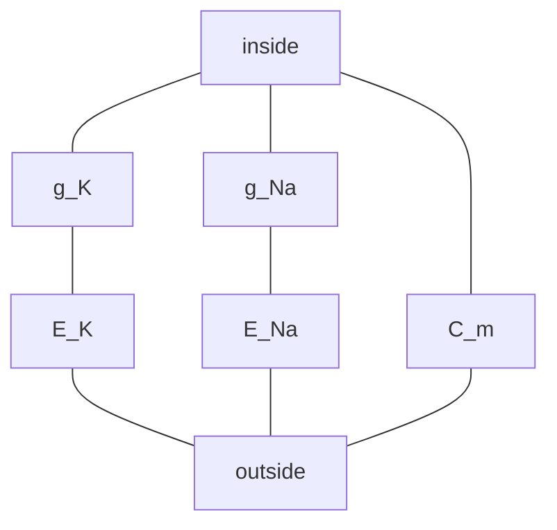

---
aliases:
  - Resistance
  - Conductance
  - Electrical Resistance
  - Single-Channel Conductance
  - Loi d'Ohm
tags:
  - type/concept
  - domain/physics
  - domain/biology
  - level/L1
  - level/L2
mastery: 0
prerequisites:
  - "[[Electric Current]]"
  - "[[Electric Potential]]"
related:
  - "[[Capacitance]]"
  - "[[RC Circuit]]"
  - "[[Ion Channel]]"
  - "[[Membrane Potential]]"
  - "[[Nernst Equation]]"
  - "[[Goldman-Hodgkin-Katz Equation]]"
  - "[[Hodgkin-Huxley Model]]"
  - "[[Linear Regression]]"
projects: []
sources:
  - "[[University Physics (OpenStax)]]"
  - "[[NIST Reference on Constants, Units, and Uncertainty]]"
  - "[[Physical Biology of the Cell (Phillips)]]"
  - "[[Molecular Biology of the Cell (Alberts)]]"
  - "[[Lee 2012 - Agarose Gel Electrophoresis for the Separation of DNA Fragments]]"
---

# Ohm's Law

> [!abstract]
> For many conductors the current is proportional to the voltage, $V = IR$: the resistance $R$, or its inverse the conductance $G$, summarizes how easily charge flows, and an open ion channel is a conductor of a few tens of picosiemens.

## Definition

**Ohm's law** states that for an **ohmic** conductor the current $I$ through it is proportional to the potential difference $V$ across it: $V = IR$, where the **resistance** $R$ does not depend on $V$ or $I$. Its unit is the ohm (1 Ω = 1 V/A). Many materials and devices are non-ohmic: their $I$-$V$ curve is not a straight line through the origin.[^up9] The **conductance** is $G = 1/R$, in siemens (1 S = 1 A/V), so that $I = GV$.[^nist]

## Why it matters

- **Ion channels are conductors.** A channel is characterized by its single-channel conductance, in picosiemens, obtained from patch-clamp currents ([[Ion Channel]]).[^alberts]
- **The membrane is a circuit.** Channels act as conductances in parallel with the membrane capacitance; resting potentials, [[RC Circuit|time constants]] and the [[Hodgkin-Huxley Model]] are circuit analysis.[^pboc]
- **Fitting $I$-$V$ data is regression.** Conductance and reversal potential are the slope and intercept of a line fitted to current-voltage measurements ([[Linear Regression]]).
- **Gels and power supplies.** Choosing voltage and current for an electrophoresis run is an Ohm's-law problem; the voltage changes how fragments migrate.[^lee]

## Core (L1)

**Ohm's law and its limit.** $V = IR$ is not a law of nature like charge conservation but an empirical property of ohmic materials, such as metals at constant temperature.[^up9] Plot $I$ against $V$: a straight line through the origin means ohmic behaviour, and its slope is $G$.

**Resistivity and geometry.** A uniform conductor of length $L$ and cross-section $A$ has $R = \rho L/A$, where the **resistivity** $\rho$ (Ω m) is a property of the material.[^up9] Longer means more resistance, wider means less: a narrow, long pore conducts poorly.

**Power.** A current through a resistance dissipates electrical energy as heat at the rate $P = IV = I^2R = V^2/R$.[^up9] A gel run at an illustrative 100 V and 50 mA has $R = 100/0.05 = 2$ kΩ and dissipates 5 W in the buffer and gel.

**Combining resistors.**[^upcirc]
- **Series** (same current through each): the voltages add, $V = I(R_1 + R_2 + \dots)$, so $R_\text{eq} = R_1 + R_2 + \dots$
- **Parallel** (same voltage across each): the currents add, $I = V(1/R_1 + 1/R_2 + \dots)$, so $1/R_\text{eq} = 1/R_1 + 1/R_2 + \dots$, or $G_\text{eq} = G_1 + G_2 + \dots$

The derivations use only charge conservation (currents add at a junction, [[Electric Current]]) and the fact that potential differences add around a path. Parallel resistance is always smaller than the smallest branch.

**Bio: single-channel conductance.** Up to about $10^8$ ions per second cross one open channel,[^alberts] a current of 16 pA ([[Electric Current]]). For a channel the current is driven not by the membrane potential $V$ itself but by its distance from the channel's reversal potential $E_\text{rev}$, where the current is zero:[^pboc]
$$i = \gamma\,(V - E_\text{rev}).$$
With an assumed driving force $V - E_\text{rev} = 100$ mV, 16 pA corresponds to $\gamma = 160$ pS, a resistance of 6.25 GΩ. Conductances of single channels are naturally expressed in picosiemens. The open channels of a membrane are in parallel, so their conductances add.

## Deeper (L2)

**The membrane as parallel conductances.** Each kind of channel is a conductance $g_k$ in series with a battery $E_k$, its reversal potential (for a perfectly selective channel, the [[Nernst Equation|Nernst potential]] of its ion); all branches are in parallel with the membrane capacitance.[^pboc]



At steady state no current charges the capacitor, so the ionic currents cancel: $\sum_k g_k (V - E_k) = 0$, hence
$$V_\text{rest} = \frac{\sum_k g_k E_k}{\sum_k g_k}.$$
The resting potential is a conductance-weighted average of the reversal potentials: it sits near $E_K$ when K⁺ conductance dominates, and swings toward $E_\text{Na}$ when Na⁺ channels open, which is the upstroke of an [[Action Potential]].[^alberts] The [[Goldman-Hodgkin-Katz Equation]] refines this with permeabilities instead of fixed conductances.

**Non-ohmic channels.** A channel's $I$-$V$ curve need not be straight, for instance when the ion concentrations differ on the two sides ([[Goldman-Hodgkin-Katz Equation]], [[Ion Channel]]). The form $i = \gamma(V - E_\text{rev})$ is then a local, linearized description, valid near the voltages where $\gamma$ was measured.

**Input resistance.** The total conductance $G$ of a cell sets how much its voltage moves for a given current, $\Delta V = I/G$. With 1 nS (Exercise 3), an input resistance of 1 GΩ, a 10 pA current shifts the voltage by 10 mV: picoampere events produce millivolt signals.

## Mathematical representation

- **Ohm's law**: $V = IR$, $I = GV$, $G = 1/R$; units Ω = V/A, S = A/V.
- **Resistance from geometry**: $R = \rho L / A$.
- **Power**: $P = IV = I^2 R = V^2/R$ (W).
- **Series**: $R_\text{eq} = \sum_k R_k$. **Parallel**: $G_\text{eq} = \sum_k G_k$.
- **Channel current**: $i = \gamma (V - E_\text{rev})$; population of $N$ channels open with probability $p_o$: $\langle G \rangle = N p_o \gamma$.
- **Chord-conductance equation**: $V_\text{rest} = \sum_k g_k E_k \big/ \sum_k g_k$.

## Computational representation

```python
def series(*resistances):
    """Equivalent resistance (ohm) of resistors in series: resistances add."""
    return sum(resistances)


def parallel(*resistances):
    """Equivalent resistance (ohm) of resistors in parallel: conductances add."""
    return 1 / sum(1 / r for r in resistances)


print(series(10, 20, 30), round(parallel(10, 20, 30), 3))

# One channel: 1e8 ions/s = 16 pA, at an assumed driving force of 100 mV
i, driving_force = 16e-12, 0.100
gamma = i / driving_force
print(f"gamma = {gamma * 1e12:.0f} pS, R = {1 / gamma / 1e9:.2f} GOhm")

# 1,000 identical channels in parallel, 5 % open on average
print(f"membrane conductance = {1000 * 0.05 * gamma * 1e9:.1f} nS")
```

```text
60 5.455
gamma = 160 pS, R = 6.25 GOhm
membrane conductance = 8.0 nS
```

## Worked example

> [!example] Reading conductance and reversal potential from an $I$-$V$ record
> A single channel is held at seven voltages and its open-channel current measured (invented data): $V$ = −80, −60, −40, −20, 0, 20, 40 mV; $i$ = −1.62, −1.18, −0.82, −0.38, 0.02, 0.41, 0.79 pA.
> 1. **Is it ohmic?** The points lie close to a straight line: the conductance is constant over this range.
> 2. **Slope.** The least-squares slope ([[Least Squares]]) is 0.0201 pA/mV $= 0.0201$ nS $= 20.1$ pS.
> 3. **Reversal potential.** The line crosses $i = 0$ at $E_\text{rev} = \bar V - \bar i/\gamma = -0.2$ mV, about 0 mV.
> 4. **Interpretation.** With identical solutions on both sides every ion's Nernst potential is 0 mV, so $E_\text{rev} \approx 0$ is expected whatever the selectivity; selectivity is measured by changing the solutions and watching $E_\text{rev}$ move.
>
> ```python
> V = [-80, -60, -40, -20, 0, 20, 40]
> I = [-1.62, -1.18, -0.82, -0.38, 0.02, 0.41, 0.79]
> n = len(V)
> mv, mi = sum(V) / n, sum(I) / n
> slope = sum((v - mv) * (c - mi) for v, c in zip(V, I)) / sum((v - mv) ** 2 for v in V)  # pA/mV = nS
> e_rev = mv - mi / slope                      # voltage where the fitted line crosses I = 0
> print(f"gamma = {slope * 1000:.1f} pS, E_rev = {e_rev:.1f} mV")
> ```
> Output: `gamma = 20.1 pS, E_rev = -0.2 mV`.

## Common misconceptions

> [!warning] "Ohm's law holds for every conductor"
> It holds for ohmic materials over some range. Non-ohmic devices such as diodes have curved $I$-$V$ relations,[^up9] and so can channels ([[Goldman-Hodgkin-Katz Equation]]); $R = V/I$ then depends on $V$.

> [!warning] "Adding a branch in parallel increases the resistance"
> It adds a path, so it decreases the resistance: conductances add. Opening more channels lowers the input resistance of a cell.

> [!warning] "The driving force on an ion is the membrane potential"
> It is $V - E_\text{rev}$. At $V = E_\text{rev}$ an open channel carries no net current, however large $V$ is.

> [!warning] "Resistance and resistivity are the same thing"
> Resistivity belongs to the material, resistance to an object: $R = \rho L / A$. The same buffer gives a higher resistance in a long, thin gel than in a short, wide one.

## Exercises

> [!question] Exercise 1 (L1)
> Compute the equivalent resistance of 100 Ω in series with (200 Ω parallel to 300 Ω), and of 100 Ω parallel to (200 Ω in series with 300 Ω).

> [!success]- Solution
> $200 \parallel 300 = 1/(1/200 + 1/300) = 120$ Ω, plus 100: 220 Ω. $100 \parallel 500 = 83.3$ Ω, below the smallest branch as it must be.

> [!question] Exercise 2 (L1)
> A channel carries 2.0 pA at a driving force of 100 mV. Give its conductance and resistance.

> [!success]- Solution
> $\gamma = i/(V - E_\text{rev}) = 2 \times 10^{-12}/0.1 = 2 \times 10^{-11}$ S $= 20$ pS; $R = 1/\gamma = 5 \times 10^{10}$ Ω $= 50$ GΩ.

> [!question] Exercise 3 (L2)
> A cell has 1,000 channels of 20 pS, each open 5 % of the time. Find the mean membrane conductance, the input resistance and the current at a 50 mV driving force. What voltage change does a 10 pA injected current produce?

> [!success]- Solution
> $\langle G \rangle = 1000 \times 0.05 \times 20$ pS $= 1$ nS, so $R = 1$ GΩ. $I = GV = 10^{-9} \times 0.05 = 50$ pA. $\Delta V = I/G = 10^{-11}/10^{-9} = 10$ mV: picoamperes matter.

> [!question] Exercise 4 (L2, Python)
> With `resting_potential` below and the illustrative values $E_K = -90$ mV and $E_\text{Na} = +60$ mV, compute $V_\text{rest}$ for $g_K/g_\text{Na}$ = 10, 1 and 0.1. Relate the result to the action potential.

> [!success]- Solution
> ```python
> def resting_potential(conductances, reversal_potentials):
>     """Steady-state V where the ionic currents g_k (V - E_k) sum to zero."""
>     return sum(g * e for g, e in zip(conductances, reversal_potentials)) / sum(conductances)
>
>
> E_K, E_NA = -90.0, 60.0                      # mV, illustrative values
> for ratio in (10, 1, 0.1):                   # g_K / g_Na
>     print(f"gK/gNa = {ratio:>4}: V = {resting_potential([ratio, 1], [E_K, E_NA]):6.1f} mV")
> ```
> Output: −76.4, −15.0 and +46.4 mV. At rest K⁺ conductance dominates and $V$ sits near $E_K$; opening Na⁺ channels reverses the ratio and drives $V$ toward $E_\text{Na}$, the depolarization of an [[Action Potential]].

## Mastery checklist

- [ ] 1 Recognized: I can state $V = IR$, define resistance, conductance and their units.
- [ ] 2 Understood: I can explain ohmic versus non-ohmic behaviour, resistivity, series and parallel combination, and the driving force $V - E_\text{rev}$.
- [ ] 3 Practiced: I can combine resistors, compute single-channel and membrane conductances, and fit $\gamma$ and $E_\text{rev}$ from $I$-$V$ data.
- [ ] 4 Applied: I extracted single-channel conductance and reversal potential from a published or real patch-clamp $I$-$V$ data set.
- [ ] 5 Explained: I can teach the membrane as parallel conductances and batteries, derive the chord-conductance equation and say where the ohmic picture breaks down.

## References

[^up9]: [[University Physics (OpenStax)]], Volume 2, ch. 9 "Current and Resistance" (resistivity and resistance, Ohm's law, ohmic and non-ohmic devices, electrical power).
[^upcirc]: [[University Physics (OpenStax)]], Volume 2, treatment of direct-current circuits (resistors in series and parallel, Kirchhoff's rules); chapter not verified.
[^nist]: [[NIST Reference on Constants, Units, and Uncertainty]], SI units (ohm, siemens).
[^pboc]: [[Physical Biology of the Cell (Phillips)]], 2nd ed. (2012), treatment of biological electricity (membrane as a circuit of conductances, batteries and capacitance; channel current proportional to the distance from the reversal potential).
[^alberts]: [[Molecular Biology of the Cell (Alberts)]], 4th ed. (2002), section "Ion Channels and the Electrical Properties of Membranes" (up to about 10⁸ ions per second through one open channel; action potentials driven by the opening of voltage-gated Na⁺ channels).
[^lee]: [[Lee 2012 - Agarose Gel Electrophoresis for the Separation of DNA Fragments]], *Journal of Visualized Experiments*, abstract (voltage among the factors of migration).
