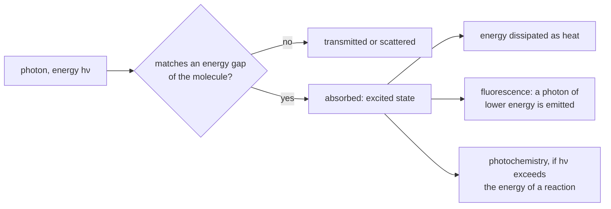

---
aliases:
  - Light Quantum
  - Planck-Einstein Relation
  - Wave-Particle Duality
  - Quantum of Light
tags:
  - type/concept
  - domain/physics
  - domain/chemistry
  - domain/biology
  - level/L1
  - level/L2
  - level/L3
mastery: 0
prerequisites:
  - "[[Electromagnetic Wave]]"
  - "[[Electromagnetic Spectrum]]"
  - "[[Chemical Bond]]"
  - "[[Mole]]"
related:
  - "[[Spectroscopy]]"
  - "[[Fluorescence]]"
  - "[[Shot Noise]]"
  - "[[Mutation]]"
  - "[[DNA Repair]]"
  - "[[Cryo-Electron Microscopy]]"
projects: []
sources:
  - "[[University Physics (OpenStax)]]"
  - "[[NIST Reference on Constants, Units, and Uncertainty]]"
  - "[[Chemistry 2e (OpenStax)]]"
  - "[[Molecular Biology of the Cell (Alberts)]]"
  - "[[Biochemistry (Berg)]]"
  - "[[FPbase]]"
  - "[[NobelPrize.org]]"
---

# Photon

> [!abstract]
> Light gives and takes energy in packets called photons, each carrying $E = h\nu = hc/\lambda$: the colour of light sets the size of the packet and its brightness only the number of packets, which is why ultraviolet light can damage DNA while much brighter red light cannot.

## Definition

A **photon** is the quantum of electromagnetic radiation. Light of frequency $\nu$ (wavelength $\lambda$) exchanges energy with matter only in units of[^up6][^nist]

$$E = h\nu = \frac{hc}{\lambda}, \qquad h = 6.626\,070\,15 \times 10^{-34} \text{ J s (exact)},$$

where $h$ is the Planck constant and $c$ the speed of light. A photon has no mass, travels at $c$ and carries momentum $p = h/\lambda$.[^up6]

## Why it matters

- **Energy per photon decides what light does to molecules.** It explains why UV light is mutagenic, why GFP is excited with blue light, and why infrared only warms a sample. The same logic chooses laser lines and filters for imaging ([[Fluorescence]]).
- **Detection is photon counting.** A detector registers discrete photon arrivals, so every intensity in an image or a fluorescence measurement is a count, with the counting noise of [[Shot Noise]] ([[Poisson Distribution]]).
- **It is the bridge between physics and chemistry units.** Electronvolts per photon convert to kJ per mole of photons, which can be compared directly with bond energies and with the thermal energy $RT$ ([[Chemical Bond]]).

## Core (L1)

**Evidence: the photoelectric effect.** Light falling on a metal surface can eject electrons. Below a threshold frequency no electron leaves, however intense the light; above it, electrons leave at once, and their maximum kinetic energy increases with the frequency, not with the intensity. Einstein explained this by single photons each giving all their energy to one electron:[^up62]

$$K_{\max} = h\nu - \phi,$$

where $\phi$ is the work function, the minimum energy needed to free an electron from that metal. Intensity sets how many photons arrive, and so how many electrons leave; frequency sets what each one can do.

**Photon energies in useful units.** With the exact SI constants,[^nist] $hc = 1239.84$ eV nm, so $E\,[\text{eV}] = 1239.84/\lambda\,[\text{nm}]$; one mole of photons carries $N_A E$. Compared with average bond energies[^c2e] and with $RT = 2.58$ kJ/mol at 37 °C (computed below):

| Light | $\lambda$ | eV per photon | kJ per mole of photons | Bonds it exceeds (C–C 345, C–O 350, H–H 436, C=C 611, C=O 741 kJ/mol) |
|---|---:|---:|---:|---|
| UV absorbed by DNA bases | 260 nm | 4.77 | 460 | C–C, C–O, H–H |
| avGFP excitation | 395 nm | 3.14 | 303 | none |
| EGFP excitation (blue) | 488 nm | 2.54 | 245 | none |
| EGFP emission (green) | 507 nm | 2.45 | 236 | none |
| red edge of visible | 700 nm | 1.77 | 171 | none |
| infrared | 10 µm | 0.124 | 12 | none |

A photon breaks a C–C bond only if $\lambda < 347$ nm: only ultraviolet photons are energetic enough.



### Bio: why UV light damages DNA

The bases of DNA absorb ultraviolet light near 260 nm.[^berg] Each absorbed 260 nm photon brings 4.77 eV (460 kJ per mole of photons), more than the energy of a C–C bond, so a single absorption can drive covalent chemistry. Ultraviolet light joins adjacent pyrimidines of the same strand into **pyrimidine dimers** (such as thymine dimers), lesions that must be repaired or become mutations ([[DNA Repair]], [[Mutation]]).[^alberts-rep] Visible photons, below about 300 kJ/mol, cannot do this one photon at a time, whatever the light intensity.

### Bio: why blue light excites GFP

Shimomura found in 1962 that the green fluorescent protein (GFP) of the jellyfish *Aequorea victoria* glows green under ultraviolet light.[^nobel] Wild-type GFP (avGFP) absorbs best at 395 nm, at the violet edge of the visible, and emits at 509 nm; the engineered variant EGFP absorbs best at 488 nm, in the blue, and emits at 507 nm.[^fpbase] The emitted photon always carries less energy than the absorbed one (2.45 eV out for 2.54 eV in for EGFP); the difference is dissipated as heat ([[Fluorescence]]). Energy conservation then forbids the reverse: a red photon of 1.94 eV (640 nm) cannot, on its own, produce a 2.45 eV green photon. Blue light both carries enough energy and falls in the absorption band.

## Deeper (L2)

**Wave-particle duality.** Light interferes and diffracts like a wave ([[Interference]], [[Diffraction]]), yet it is absorbed in whole photons. When a double-slit experiment is run with very weak light, the detector records single, localized hits; the interference pattern appears only as the hits accumulate.[^up66] The wave description gives the probability of detecting a photon at each place; the photon description gives what each detection delivers. Neither picture alone accounts for both behaviours.[^up66]

**Counting photons.** A beam of power $P$ carries a photon flux

$$\Phi = \frac{P}{h\nu} = \frac{P\lambda}{hc} \quad (\text{photons s}^{-1}).$$

1 mW at 488 nm is $2.46 \times 10^{15}$ photons per second (computed below). If photons arrive independently, the number $N$ recorded by a pixel during an exposure follows a [[Poisson Distribution]], with variance equal to the mean. The relative fluctuation is then $\sqrt{\bar N}/\bar N = 1/\sqrt{\bar N}$: 10 % for 100 photons, 1 % for 10 000. This is [[Shot Noise]], the floor below which no low-light image can be cleaned.

## Advanced (L3)

**Matter is also a wave.** De Broglie proposed that every particle of momentum $p$ has a wavelength $\lambda = h/p$, confirmed by electron diffraction.[^up6] Electrons accelerated through 100 kV have a wavelength of about 0.004 nm, a hundred thousand times shorter than visible light, which is what lets electron microscopes resolve far smaller structures than light microscopes ([[Microscopy]], [[Cryo-Electron Microscopy]]).[^alberts-mic]

**Same energy, different photons.** One joule of 260 nm light is $1.3 \times 10^{18}$ photons of 4.8 eV; one joule of 10 µm infrared is $5.0 \times 10^{19}$ photons of 0.12 eV. Deposited in a sample, both heat it by the same amount; only the first can break covalent bonds. The risk of photodamage in live imaging therefore depends on wavelength as well as on dose.

## Mathematical representation

- $E = h\nu = hc/\lambda = \hbar\omega$, with $\hbar = h/2\pi$, $\omega = 2\pi\nu$; momentum $p = h/\lambda = \hbar k$, so a fully absorbed beam receives the force $\Phi h/\lambda = P/c$, as in [[Electromagnetic Wave]]. Molar energy $E_m = N_A hc/\lambda$; threshold wavelength for an energy $D$ per mole: $\lambda_{\max} = N_A hc/D$.
- Photoelectric effect: $K_{\max} = h\nu - \phi$ for $h\nu > \phi$, no emission otherwise.
- Flux $\Phi = P\lambda/(hc)$; count in time $t$: $N \sim \text{Poisson}(\Phi\,\eta\, t)$, where $\eta \le 1$ is the detection efficiency (model assumption: independent arrivals).

## Computational representation

```python
H = 6.62607015e-34        # Planck constant, J s (exact)
C = 299_792_458           # speed of light, m/s (exact)
EV = 1.602176634e-19      # J per eV (exact)
N_A = 6.02214076e23       # 1/mol (exact)
R = 8.314462618           # molar gas constant, J/(mol K) (exact)

BONDS = {"C-C": 345, "C-O": 350, "H-H": 436, "C=C": 611, "C=O": 741}   # kJ/mol, Chemistry 2e averages


def photon(wavelength_nm: float) -> tuple[float, float]:
    """Energy of one photon in eV and of one mole of photons in kJ/mol."""
    joules = H * C / (wavelength_nm * 1e-9)
    return joules / EV, joules * N_A / 1e3


def threshold_nm(kj_per_mol: float) -> float:
    """Longest wavelength whose photons carry at least this energy per mole."""
    return H * C * N_A / (kj_per_mol * 1e3) * 1e9


print(f"RT at 37 C = {R * 310.15 / 1e3:.2f} kJ/mol")
for name, nm in (("UV absorbed by DNA", 260), ("avGFP excitation", 395), ("EGFP excitation", 488),
                 ("EGFP emission", 507), ("red edge of visible", 700), ("infrared 10 um", 10_000)):
    ev, kj = photon(nm)
    above = [b for b, e in BONDS.items() if kj > e]
    print(f"{name:20} {nm:6} nm {ev:6.3f} eV {kj:7.1f} kJ/mol  exceeds: {', '.join(above) or 'none'}")
print({b: round(threshold_nm(e)) for b, e in BONDS.items()})
print(f"photons per second in 1 mW at 488 nm: {1e-3 * 488e-9 / (H * C):.3g}")
```

```text
RT at 37 C = 2.58 kJ/mol
UV absorbed by DNA      260 nm  4.769 eV   460.1 kJ/mol  exceeds: C-C, C-O, H-H
avGFP excitation        395 nm  3.139 eV   302.9 kJ/mol  exceeds: none
EGFP excitation         488 nm  2.541 eV   245.1 kJ/mol  exceeds: none
EGFP emission           507 nm  2.445 eV   235.9 kJ/mol  exceeds: none
red edge of visible     700 nm  1.771 eV   170.9 kJ/mol  exceeds: none
infrared 10 um        10000 nm  0.124 eV    12.0 kJ/mol  exceeds: none
{'C-C': 347, 'C-O': 342, 'H-H': 274, 'C=C': 196, 'C=O': 161}
photons per second in 1 mW at 488 nm: 2.46e+15
```

## Worked example

> [!example] Can a 488 nm laser break a C–C bond?
> 1. Photon energy: $E = hc/\lambda = (6.626 \times 10^{-34} \times 2.998 \times 10^8)/(488 \times 10^{-9}) = 4.07 \times 10^{-19}$ J $= 2.54$ eV.
> 2. Per mole of photons: $\times N_A = 245$ kJ/mol.
> 3. Compare: C–C averages 345 kJ/mol;[^c2e] the photon falls 100 kJ/mol short. The longest wavelength that could break it is $N_A hc/(345 \text{ kJ/mol}) = 347$ nm.
> 4. Turning up the laser power multiplies the number of photons, not their energy: one-photon bond breaking stays impossible; absorbed energy ends up as heat or fluorescence. A 260 nm photon (460 kJ/mol) clears the bar, and DNA absorbs there: this is the physical side of UV mutagenesis.

## Common misconceptions

> [!warning] "Brighter light has more energetic photons"
> Intensity is the number of photons per second per area; the energy of each photon depends only on the frequency. In the photoelectric effect, more intense light ejects more electrons, not faster ones.[^up62]

> [!warning] "Enough light energy in total will break any bond"
> An ordinary absorption event involves one photon. A joule of infrared heats a sample as much as a joule of UV but breaks no covalent bond.

> [!warning] "A photon energetic enough to break a bond will break it"
> The photon must first be absorbed, which requires a matching transition; most absorbed energy is then dissipated as heat or re-emitted. Bond energies are averages,[^c2e] so the comparison is an order-of-magnitude test, not a prediction.

## Exercises

> [!question] Exercise 1 (L1)
> Compute the energy of a 405 nm (violet) photon in J, eV and kJ/mol.

> [!success]- Solution
> $E = hc/\lambda = 4.905 \times 10^{-19}$ J; $/e = 3.06$ eV; $\times N_A = 295$ kJ/mol. Still below C–C (345 kJ/mol).

> [!question] Exercise 2 (L1)
> What is the longest wavelength able to break a C=O bond (741 kJ/mol)? An H–H bond (436 kJ/mol)?[^c2e]

> [!success]- Solution
> $\lambda_{\max} = N_A hc/D$: 161 nm for C=O and 274 nm for H–H, both in the ultraviolet. Stronger bonds need shorter wavelengths.

> [!question] Exercise 3 (L2, Python)
> With `photon`, compute for avGFP (395 → 509 nm) and EGFP (488 → 507 nm) the energy absorbed, emitted and lost per photon, in eV and kJ/mol. Then explain why a 640 nm laser cannot make EGFP emit at 507 nm.[^fpbase]

> [!success]- Solution
> ```python
> for name, ex, em in (("avGFP", 395, 509), ("EGFP", 488, 507)):
>     (e1, k1), (e2, k2) = photon(ex), photon(em)
>     print(f"{name}: absorbed {e1:.3f} eV, emitted {e2:.3f} eV, lost {e1 - e2:.3f} eV = {k1 - k2:.1f} kJ/mol ({(e1 - e2) / e1:.1%})")
> print(f"640 nm: {photon(640)[0]:.3f} eV < 507 nm emission {photon(507)[0]:.3f} eV")
> # avGFP: absorbed 3.139 eV, emitted 2.436 eV, lost 0.703 eV = 67.8 kJ/mol (22.4%)
> # EGFP: absorbed 2.541 eV, emitted 2.445 eV, lost 0.095 eV = 9.2 kJ/mol (3.7%)
> # 640 nm: 1.937 eV < 507 nm emission 2.445 eV
> ```
>
> Each emitted photon carries less energy than the absorbed one (the Stokes shift, [[Fluorescence]]). A 640 nm photon has 0.5 eV too little: one-photon excitation by red light cannot give green emission. EGFP is also excited by less energetic light than avGFP (2.54 against 3.14 eV), and loses less energy per cycle.

> [!question] Exercise 4 (L3)
> A 10 mW laser at 405 nm delivers $\Phi = P\lambda/(hc) = 2.04 \times 10^{16}$ photons per second. Two pixels of an image record on average 100 and 10 000 photons. Assuming independent arrivals, give the standard deviation and relative noise of each count. How many photons give 1 % precision, and how much longer must one expose to go from 10 % to 1 %?

> [!success]- Solution
> Poisson: SD $= \sqrt{\bar N}$, so 10 photons (10 %) and 100 photons (1 %). 1 % needs $\bar N = 10^4$. Precision improves as $1/\sqrt{\bar N}$, so a tenfold gain in precision costs a hundredfold more photons: 100 times the exposure or the intensity, and more photodamage ([[Shot Noise]]).

## Mastery checklist

- [ ] 1 Recognized: I can state $E = h\nu = hc/\lambda$ and that light is absorbed one photon at a time.
- [ ] 2 Understood: I can explain the photoelectric effect, why intensity and photon energy are independent, and wave-particle duality.
- [ ] 3 Practiced: I can convert wavelengths into eV and kJ/mol, compare them with bond energies and compute photon fluxes, by hand and in Python.
- [ ] 4 Applied: I can justify the excitation wavelength of a fluorophore and the photodamage risk of a UV or laser protocol from photon energies.
- [ ] 5 Explained: I can teach why UV light is mutagenic and visible light is not, how photon counting creates shot noise, and how matter waves lead to electron microscopy.

## References

[^up6]: [[University Physics (OpenStax)]], Volume 3, ch. 6 "Photons and Matter Waves" (photon energy and momentum, the Compton effect, de Broglie's matter waves and electron diffraction).
[^up62]: [[University Physics (OpenStax)]], Volume 3, §6.2 "Photoelectric Effect" (threshold frequency, kinetic energy independent of intensity, Einstein's explanation, work function).
[^up66]: [[University Physics (OpenStax)]], Volume 3, §6.6 "Wave-Particle Duality" (double-slit experiments with single photons; probabilistic interpretation).
[^nist]: [[NIST Reference on Constants, Units, and Uncertainty]], CODATA 2022 values, exact in the SI: $h = 6.626\,070\,15 \times 10^{-34}$ J s, $c = 299\,792\,458$ m s⁻¹, $e = 1.602\,176\,634 \times 10^{-19}$ C, $N_A = 6.022\,140\,76 \times 10^{23}$ mol⁻¹, $R = 8.314\,462\,618$ J mol⁻¹ K⁻¹.
[^c2e]: [[Chemistry 2e (OpenStax)]], ch. 7, §7.5 "Strengths of Ionic and Covalent Bonds" (average bond energies as gas-phase averages: H–H 436, C–C 345, C=C 611, C–O 350, C=O 741 kJ/mol).
[^berg]: [[Biochemistry (Berg)]], 5th ed. (2002), treatment of nucleic acid structure (UV absorbance of the bases near 260 nm).
[^alberts-rep]: [[Molecular Biology of the Cell (Alberts)]], 4th ed. (2002), treatment of DNA repair (ultraviolet radiation joins adjacent pyrimidine bases into dimers, such as thymine dimers).
[^alberts-mic]: [[Molecular Biology of the Cell (Alberts)]], 4th ed. (2002), treatment of microscopy (electron wavelength of about 0.004 nm at 100 kV and the resolution of electron microscopes).
[^fpbase]: [[FPbase]], avGFP entry (excitation maximum 395 nm, emission maximum 509 nm) and EGFP entry (excitation 488 nm, emission 507 nm; mutations F64L, S65T among others).
[^nobel]: [[NobelPrize.org]], Nobel Prize in Chemistry 2008 (Shimomura, Chalfie and Tsien, "for the discovery and development of the green fluorescent protein, GFP"; Shimomura isolated GFP in 1962 and found that it glowed green under ultraviolet light).
