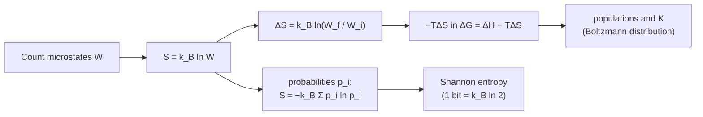

---
aliases:
  - Statistical Entropy
  - Boltzmann Entropy Formula
  - S = k ln W
  - Entropie de Boltzmann
  - Entropie statistique
tags:
  - type/concept
  - domain/physics
  - domain/chemistry
  - level/L1
  - level/L2
  - level/L3
mastery: 0
prerequisites:
  - "[[Microstate]]"
  - "[[Logarithm]]"
  - "[[Thermodynamic Entropy]]"
  - "[[Temperature]]"
related:
  - "[[Boltzmann Distribution]]"
  - "[[Shannon Entropy]]"
  - "[[Gibbs Free Energy]]"
  - "[[Chemical Equilibrium]]"
  - "[[Hydrophobic Effect]]"
  - "[[Protein Folding]]"
  - "[[Binding Free Energy]]"
  - "[[Freely Jointed Chain]]"
  - "[[Sequence Logo]]"
projects: []
sources:
  - "[[Physical Biology of the Cell (Phillips)]]"
  - "[[University Physics (OpenStax)]]"
  - "[[NIST Reference on Constants, Units, and Uncertainty]]"
  - "[[Zuker 1981 - Optimal Computer Folding of Large RNA Sequences]]"
---

# Boltzmann Entropy

> [!abstract]
> Entropy is the logarithm of a count: $S = k_B \ln W$, where $W$ is the number of microscopic arrangements that look the same from outside, so a folding protein or a binding ligand loses entropy exactly when it loses arrangements.

## Definition

The **Boltzmann entropy** of a macrostate is
$$S = k_B \ln W,$$
where $W$ is the multiplicity of the macrostate (the number of its [[Microstate|microstates]]) and $k_B$ is the Boltzmann constant, $1.380\,649 \times 10^{-23}$ J K⁻¹, exact since the 2019 revision of the SI.[^pboc6][^nist] It applies to an isolated system whose microstates are equally probable, and it coincides with the entropy of classical [[Thermodynamic Entropy|thermodynamics]].[^up]

## Why it matters

- **Folding and binding pay an entropy cost.** A chain that folds, or a ligand that docks, gives up most of its conformations; that loss enters $\Delta G = \Delta H - T\Delta S$ ([[Gibbs Free Energy]]) and must be paid by favorable interactions ([[Protein Folding]], [[Binding Free Energy]]).
- **Every $RT \ln c$ is a count.** The logarithmic dependence of free energies on concentration, behind $\Delta G = \Delta G^\circ + RT\ln Q$ and binding curves, is the entropy of placing molecules in a volume (L2; [[Chemical Equilibrium]]).
- **RNA loop penalties.** Nearest-neighbor RNA energy models give loops destabilizing free energies;[^zuker] closing a loop removes chain conformations, a cost of the form $-T\Delta S = k_BT \ln(W_{\text{open}}/W_{\text{loop}})$ ([[RNA Secondary Structure Prediction]]).
- **One formula, two sciences.** With probabilities instead of counts, $S$ becomes $-k_B\sum p_i \ln p_i$, the [[Shannon Entropy]] up to a constant: the information content of a binding site in a [[Sequence Logo]] is an entropy difference (Exercise 5).

## Core (L1)

### Why a logarithm

For two independent subsystems, multiplicities multiply, $W = W_A W_B$ ([[Microstate#Deeper (L2)]]); the logarithm turns the product into a sum, so entropy is additive (extensive): $S = S_A + S_B$. Only ratios of counts have meaning, and entropy differences inherit this:
$$\Delta S = S_f - S_i = k_B \ln \frac{W_f}{W_i}.$$
Per mole of independent units, $k_B$ becomes the molar gas constant $R = N_A k_B = 8.314\,462\,618$ J mol⁻¹ K⁻¹ (exact).[^nist] A system with a single microstate has $S = 0$: the statistical form of the third law for a perfect crystal at absolute zero.[^up]

### It is the thermodynamic entropy

A mole of ideal gas expands freely from $V$ to $2V$. **Counting**: each molecule has twice as many positional microstates, so $W_f/W_i = 2^{N_A}$ and $\Delta S = N_A k_B \ln 2 = R \ln 2 = 5.763$ J K⁻¹. **Thermodynamics**: entropy is a state function, so compute it along a reversible isothermal path between the same states, where the gas absorbs $Q_{\text{rev}} = RT\ln(V_f/V_i)$; then $\Delta S = Q_{\text{rev}}/T = R\ln 2$, the same number ([[Thermodynamic Entropy]]).[^up] The free expansion increases entropy because the larger volume offers more arrangements, and an isolated system evolves toward the macrostate of largest multiplicity: the statistical reading of the second law.[^up]



### Bio: the conformational entropy lost on folding or binding

Toy model (invented numbers): each of $N$ residues has $\nu$ backbone conformations in the unfolded chain and a single one in the native fold. Then $W_f/W_i = \nu^{-N}$ and
$$\Delta S_{\text{conf}} = -N k_B \ln \nu, \qquad -T\Delta S_{\text{conf}} = N\,RT\ln\nu \text{ per mole.}$$

| $N$ | $\nu$ | $\Delta S_{\text{conf}}$ (J mol⁻¹ K⁻¹) | $-T\Delta S$ at 37 °C (kJ/mol) |
|---:|---:|---:|---:|
| 10 | 3 | −91.3 | 28.3 |
| 100 | 3 | −913.4 | 283.3 |
| 100 | 5 | −1338.2 | 415.0 |

The cost grows linearly with chain length, because $\ln W$ does ([[Microstate#Advanced (L3)]]). A protein folds only if interactions and solvent effects ([[Hydrophobic Effect]]) pay this bill. Binding works the same way: a ligand that freezes $r$ rotatable bonds, each with 3 rotamers when free, pays $r\,RT\ln 3 = 2.83$ kJ/mol per bond at 37 °C, so a flexible ligand needs stronger contacts than a rigid one with the same interactions.

## Deeper (L2)

### Translational entropy: where $\ln c$ comes from

The lattice model of solutions:[^pboc] divide the solution into $\Omega$ cells of volume $v$ and place $L$ identical ligands, at most one per cell. $W = \binom{\Omega}{L}$ and, with Stirling's approximation and $x = L/\Omega$,
$$\frac{S}{k_B} \approx -\Omega\left[x\ln x + (1-x)\ln(1-x)\right] \approx L\left[\ln\frac{\Omega}{L} + 1\right] \quad (x \ll 1).$$
Adding one ligand raises $S$ by $\partial S/\partial L \approx k_B \ln(\Omega/L) = -k_B \ln(c/c_0)$, where $c = L/V$ is the concentration and $c_0 = 1/v$ a reference concentration set by the cell size. Removing a ligand from solution, as binding does, costs this translational entropy: the free energy of binding contains $+k_BT\ln(c_0/c)$, which is why binding depends on the logarithm of concentration and why $\Delta G^\circ$ refers to a standard concentration ([[Chemical Equilibrium]], [[Boltzmann Distribution]]). The code below checks the dilute formula against the exact count.

### From counts to probabilities

When microstates have probabilities $p_i$ (a system at fixed temperature rather than isolated), entropy generalizes to the Gibbs form[^pboc6]
$$S = -k_B \sum_i p_i \ln p_i,$$
which reduces to $k_B \ln W$ when $p_i = 1/W$ for $W$ states and is smaller for any non-uniform distribution. Up to the unit, it is the [[Shannon Entropy]] $H = -\sum_i p_i \log_2 p_i$: $S = (k_B \ln 2)\, H$, so one bit corresponds to $k_B \ln 2 = 9.57 \times 10^{-24}$ J K⁻¹.

### Temperature from entropy

Statistical mechanics defines temperature through the growth of entropy with energy, $1/T = (\partial S/\partial E)_{V,N}$.[^pboc] A system in contact with a large reservoir therefore finds its microstates weighted by how many reservoir states each one leaves: this is the derivation of the [[Boltzmann Distribution]].

## Advanced (L3)

- **Entropy of a coarse-grained state.** A "conformation" in a structural model (a rotamer, a basin of the energy surface) contains many finer microstates. Its free energy $G_i = E_i - TS_i$, with $S_i = k_B \ln W_i$, is what decides its population: coarse-graining turns hidden entropy into free energy ([[Free Energy Landscape]]).
- **Entropic forces.** The end-to-end distance of a flexible chain has a multiplicity that peaks at small extension; stretching lowers $S$, so holding the chain extended requires a force even when no bond is strained (Exercise 6, [[Freely Jointed Chain]]).
- **Information content of binding sites.** If a protein binds equally well $W_{\text{site}}$ of the $4^L$ sequences of length $L$, specifying a site takes $\log_2(4^L / W_{\text{site}}) = 2L - \log_2 W_{\text{site}}$ bits: the Boltzmann form with $\log_2$ in place of $k_B \ln$. Sequence logos plot this reduction position by position ([[Sequence Logo]], [[Position Weight Matrix]]).
- **Model dependence.** $W$ depends on how microstates are discretized, so absolute conformational entropies are model-dependent; differences between macrostates computed within one model are the robust quantities ([[Microstate#Common misconceptions]]).

## Mathematical representation

- $S = k_B \ln W$, with $W \ge 1$ the multiplicity and $k_B = 1.380\,649 \times 10^{-23}$ J K⁻¹; $\Delta S = k_B \ln (W_f / W_i)$.
- Additivity: $W = W_A W_B \Rightarrow S = S_A + S_B$.
- $N$ independent units with $w$ states each: $W = w^N$, $S = N k_B \ln w$; per mole, $S_m = R \ln w$ with $R = N_A k_B$.
- Gibbs form: $S = -k_B \sum_i p_i \ln p_i$, with $\sum_i p_i = 1$; maximal, equal to $k_B \ln W$, for the uniform distribution.
- Lattice solution: $S = k_B \ln \binom{\Omega}{L}$, $\partial S / \partial L \approx -k_B \ln(c/c_0)$ for $L \ll \Omega$.
- Temperature: $1/T = (\partial S/\partial E)_{V,N}$.

## Computational representation

Multiplicities are exact Python integers (`math.comb`), and `math.log` accepts integers of any size; for huge arguments use $\ln \binom{n}{k}$ through `math.lgamma`. Constants come from CODATA, in one place.

```python
from math import log

R = 1.380649e-23 * 6.02214076e23     # J/(mol K): k_B * N_A, both exact (CODATA)
T = 310.15                           # 37 degrees C, in K
RT = R * T / 1000                    # kJ/mol

# Toy folding: each of N residues has nu conformations unfolded, 1 folded (invented numbers)
for N, nu in ((10, 3), (100, 3), (100, 5)):
    dS = -N * R * log(nu)                         # J/(mol K)
    print(N, nu, round(dS, 1), "J/(mol K);  -T dS =", round(-T * dS / 1000, 1), "kJ/mol")

# Toy binding: a ligand freezes r rotatable bonds, each with 3 rotamers when free
for r in (1, 4, 8):
    print(r, round(r * RT * log(3), 2), "kJ/mol; affinity factor", f"{3.0 ** -r:.2e}")
```

```text
10 3 -91.3 J/(mol K);  -T dS = 28.3 kJ/mol
100 3 -913.4 J/(mol K);  -T dS = 283.3 kJ/mol
100 5 -1338.2 J/(mol K);  -T dS = 415.0 kJ/mol
1 2.83 kJ/mol; affinity factor 3.33e-01
4 11.33 kJ/mol; affinity factor 1.23e-02
8 22.66 kJ/mol; affinity factor 1.52e-04
```

The lattice solution: exact entropy, Stirling form, dilute form, and the entropy gained by adding one ligand compared with $-\ln x$:

```python
from math import lgamma, log


def ln_comb(n: int, k: int) -> float:
    """ln C(n, k) through log-gamma, safe for huge n."""
    return lgamma(n + 1) - lgamma(k + 1) - lgamma(n - k + 1)


OMEGA = 10**9                         # lattice sites (solution volume / site volume)
for L in (10**3, 10**5, 10**7):       # ligands placed on the lattice
    x = L / OMEGA
    exact = ln_comb(OMEGA, L)                                # S / k_B
    stirling = -OMEGA * (x * log(x) + (1 - x) * log(1 - x))
    dilute = L * (log(1 / x) + 1)
    gain = ln_comb(OMEGA, L + 1) - exact                     # S / k_B gained by one more ligand
    print(L, round(exact, 1), round(stirling, 1), round(dilute, 1), round(gain, 3), round(-log(x), 3))
```

```text
1000 14811.1 14815.5 14815.5 13.815 13.816
100000 1021022.4 1021029.0 1021034.0 9.21 9.21
10000000 56001525.4 56001534.4 56051701.9 4.595 4.605
```

The Gibbs form, in nats and in bits:

```python
from math import log


def gibbs_entropy(p: list[float], k: float = 1.0) -> float:
    """S = -k sum p_i ln p_i; k = 1 gives nats, k = 1/ln 2 gives bits, k = k_B gives J/K."""
    return -k * sum(pi * log(pi) for pi in p if pi > 0)


W = 8
print(round(gibbs_entropy([1 / W] * W), 4), round(log(W), 4))      # uniform: k ln W
print(round(gibbs_entropy([0.5, 0.2, 0.1, 0.1, 0.05, 0.05]), 4), round(log(6), 4))
print(round(gibbs_entropy([1 / 4] * 4, k=1 / log(2)), 4))          # 4 equal bases: 2 bits
```

```text
2.0794 2.0794
1.4286 1.7918
2.0
```

## Worked example

> [!example] A disordered peptide that becomes a helix when it binds (toy model, invented numbers)
> A 10-residue peptide has 3 backbone conformations per residue in solution and one (helical) when bound.
> 1. **Count**: $W_{\text{free}} = 3^{10} = 59{,}049$, $W_{\text{bound}} = 1$.
> 2. **Entropy change**: $\Delta S = k_B \ln(1/59{,}049) = -10\,k_B \ln 3$; per mole, $-10 R \ln 3 = -91.3$ J mol⁻¹ K⁻¹.
> 3. **Free-energy cost** at 37 °C ($RT = 2.579$ kJ/mol): $-T\Delta S = 28.3$ kJ/mol.
> 4. **Effect on affinity**: compared with a peptide already rigid in the helical shape and making the same contacts, the binding constant is multiplied by $e^{\Delta S/R} = 3^{-10} = 1.7 \times 10^{-5}$. The factor is a pure count: it does not depend on $T$, while its free-energy equivalent, $-T\Delta S$, grows with $T$.

## Common misconceptions

> [!warning] "Entropy is disorder"
> "Disorder" is a vague picture. Entropy is the logarithm of the number of microstates compatible with the macrostate, given what is counted. A state that looks ordered at one level (oil and water separated) can correspond to more microstates at another (the orientations of water molecules, see [[Hydrophobic Effect]]): always ask what $W$ counts.

> [!warning] "Boltzmann and Shannon entropy are the same thing"
> They share the form $-\sum p \ln p$, but Shannon entropy measures uncertainty over any distribution, in bits, while Boltzmann entropy counts physical microstates and carries units (J K⁻¹). Their bridge is the factor $k_B \ln 2$ per bit; a sequence logo is not a thermodynamic measurement.

> [!warning] "$k_B$ or $R$, it does not matter"
> $k_B$ is per molecule, $R$ per mole. $\Delta S = k_B \ln 2$ is $9.57 \times 10^{-24}$ J K⁻¹ for one molecule; $R \ln 2 = 5.763$ J K⁻¹ for a mole. Mixing them shifts results by $6 \times 10^{23}$.

## Exercises

> [!question] Exercise 1 (L1)
> A system of 20 independent two-state units: compute $S$ for the macrostate "10 up" and for "all up", in units of $k_B$ and in J K⁻¹.

> [!success]- Solution
> $W = \binom{20}{10} = 184{,}756$, so $S/k_B = \ln 184{,}756 = 12.127$ and $S = 1.674 \times 10^{-22}$ J K⁻¹. "All up" has $W = 1$, $S = 0$.

> [!question] Exercise 2 (L1)
> One mole of ideal gas expands isothermally from $V$ to $3V$. Compute $\Delta S$ by counting microstates, then with $Q_{\text{rev}}/T$.

> [!success]- Solution
> Counting: $W_f/W_i = 3^{N_A}$, $\Delta S = N_A k_B \ln 3 = R \ln 3 = 9.134$ J K⁻¹. Thermodynamics: $Q_{\text{rev}} = RT\ln 3$, so $\Delta S = R\ln 3$, identical.

> [!question] Exercise 3 (L2)
> Toy model: a drug-like ligand has 4 rotatable bonds, each with 3 rotamers in solution, all frozen in the bound pose. Compute $-T\Delta S$ at 37 °C and the factor by which this entropy loss multiplies the binding constant. Does the factor depend on temperature?

> [!success]- Solution
> $\Delta S = -4R\ln 3$; $-T\Delta S = 4 \times 2.579 \times \ln 3 = 11.33$ kJ/mol. The factor is $e^{\Delta S/R} = 3^{-4} = 1/81 = 0.0123$, independent of $T$: it is the ratio of counts. Its free-energy equivalent $-T\Delta S$ is proportional to $T$.

> [!question] Exercise 4 (L2)
> In the lattice model, compare the translational entropy a ligand loses on binding when it is at $c = 1$ µM with the loss at the reference $c_0 = 1$ M. Express the difference per mole and as $-T\Delta S$ at 37 °C.

> [!success]- Solution
> The difference is $\Delta S = R\ln(c/c_0) = R \ln 10^{-6} = -114.87$ J mol⁻¹ K⁻¹, so $-T\Delta S = 35.63$ kJ/mol, about $13.8\,RT$. Binding a dilute ligand costs this much more entropy: the binding energy must compensate it, which is where the midpoint $\Delta\varepsilon = k_BT \ln(c/c_0)$ of the binding curve in [[Boltzmann Distribution]] comes from.

> [!question] Exercise 5 (L3, Python)
> At one position of 20 aligned binding sites, the bases are A 2, C 1, G 15, T 2 (invented counts). Using `gibbs_entropy` from the code above, compute the entropy in bits and the information content $2 - H$. How many equally used bases would give the same entropy?

> [!success]- Solution
> ```python
> counts = {"A": 2, "C": 1, "G": 15, "T": 2}
> n = sum(counts.values())
> H = gibbs_entropy([c / n for c in counts.values()], k=1 / log(2))
> print(round(H, 3), "bits; information", round(2 - H, 3), "bits")
> print(round(2 ** H, 2), "equally used bases would give the same entropy")
> ```
> Output: `1.192 bits; information 0.808 bits`, then `2.28 equally used bases ...`. The effective multiplicity is $W_{\text{eff}} = 2^H = 2.28$ of 4 bases, so the position carries $\log_2(4/2.28) = 0.81$ bits, the height of its stack in a [[Sequence Logo]] (before small-sample corrections).

> [!question] Exercise 6 (L3, Python)
> A one-dimensional chain of $N = 100$ unit steps, each $+1$ or $-1$, has end-to-end distance $x$ with multiplicity $W(x) = \binom{N}{(N+x)/2}$. Compute $[S(x) - S(0)]/k_B$ for $x = 0, 10, 20, 30$, compare with $-x^2/(2N)$, and deduce the force needed to hold the chain at extension $x$.

> [!success]- Solution
> ```python
> from math import comb, log
> N = 100
> for x in (0, 10, 20, 30):
>     exact = log(comb(N, (N + x) // 2) / comb(N, N // 2))   # [S(x) - S(0)] / k_B
>     print(x, round(exact, 3), round(-x * x / (2 * N), 3))
> ```
> Output: `0 0.0 0.0`, `10 -0.496 -0.5`, `20 -1.993 -2.0`, `30 -4.523 -4.5`. So $S(x) \approx S(0) - k_B x^2/(2N)$. With no energy term, the free energy is $F = -TS$, and the force needed to hold the extension is $f = \partial F/\partial x = k_BT\,x/N$ (per unit step length): a spring whose stiffness is proportional to temperature, the entropic elasticity of the [[Freely Jointed Chain]].

## Mastery checklist

- [ ] 1 Recognized: I can write $S = k_B \ln W$, give the value and units of $k_B$, and say what $W$ counts.
- [ ] 2 Understood: I can explain why the logarithm makes entropy additive, and show that counting and $Q_{\text{rev}}/T$ give the same $\Delta S$ for an ideal-gas expansion.
- [ ] 3 Practiced: I can compute conformational, translational and Gibbs entropies in Python, with $k_B$ or $R$ as appropriate.
- [ ] 4 Applied: I can estimate the conformational entropy cost of folding or of freezing a ligand's rotatable bonds, and the information content of a binding-site position.
- [ ] 5 Explained: I can teach where $RT\ln c$ comes from, how Boltzmann and Shannon entropy relate, and why absolute conformational entropies depend on the model.

## References

[^pboc6]: [[Physical Biology of the Cell (Phillips)]], 2nd ed. (2012), ch. 6 "Entropy Rules!".
[^pboc]: [[Physical Biology of the Cell (Phillips)]], 2nd ed. (2012), treatment of statistical mechanics (lattice model of solutions, statistical definition of temperature).
[^up]: [[University Physics (OpenStax)]], Volume 2, ch. 4 "The Second Law of Thermodynamics", section 4.7 "Entropy on a Microscopic Scale" (statistical interpretation, free expansion, third law).
[^nist]: [[NIST Reference on Constants, Units, and Uncertainty]], CODATA recommended values: Boltzmann constant and Avogadro constant (exact since the 2019 SI revision), molar gas constant $R = N_A k$.
[^zuker]: [[Zuker 1981 - Optimal Computer Folding of Large RNA Sequences]], *Nucleic Acids Research* 9(1):133-148 (energy model with destabilizing loop energies).
