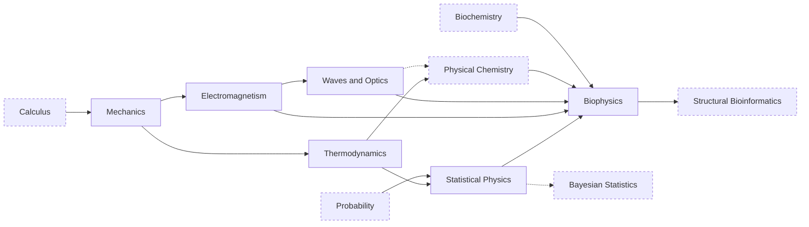

---
aliases:
  - Physique
tags:
  - type/moc
  - domain/physics
  - domain/biology
  - level/L1
  - level/L2
  - level/L3
prerequisites:
  - "[[Calculus]]"
projects: []
sources:
  - "[[MIT 8.01SC - Classical Mechanics]]"
  - "[[MIT 8.592J - Statistical Physics in Biology]]"
  - "[[University Physics (OpenStax)]]"
  - "[[Physical Biology of the Cell (Phillips)]]"
  - "[[ETH Zurich - BSc Biology]]"
  - "[[MIT - Course 7 Biology]]"
  - "[[Carnegie Mellon University - BS Computational Biology]]"
  - "[[UC San Diego - BS Bioinformatics]]"
  - "[[Tsinghua University - BS Biological Sciences]]"
  - "[[Université Paris-Saclay - Licence Double Diplôme Informatique Sciences de la Vie]]"
  - "[[RCSB Protein Data Bank]]"
---

# Physics

> [!abstract]
> The physics that explains living matter and the instruments that measure it: energy and forces, heat and entropy, charges and fields, light, statistical physics, and biophysics. Targeted L1-L2, with only Biophysics taken to L3.

## Why it matters for bioinformatics

- **Molecules obey statistical physics.** Protein folding, binding and molecular simulation rest on the [[Boltzmann Distribution]], [[Free Energy Landscape|free energy landscapes]] and Newton's equations, the physics under [[Molecular Dynamics Simulation]].
- **Membranes are circuits.** [[Membrane Potential]], [[Ion Channel|ion channels]] and [[Action Potential|action potentials]] are charges, [[Capacitance|capacitors]] and resistors.
- **Every omics measurement is a physical instrument.** Ions moving in fields in [[Mass Spectrometry]]; fluorescence imaging in sequencers and microscopes, limited by the [[Diffraction Limit]] and by [[Shot Noise]]; [[X-ray Crystallography]], [[Nuclear Magnetic Resonance Spectroscopy]] and [[Cryo-Electron Microscopy]] behind every structure in the PDB, whose experimental method and resolution should be read before trusting an entry.[^pdb]
- **Randomness has a physical face.** [[Brownian Motion]] and [[Diffusion]] are the physical versions of the [[Random Walk]] and [[Markov Chain]] models used across bioinformatics; [[Detailed Balance]] is the condition behind [[Markov Chain Monte Carlo]].
- **Estimation is a habit.** Order-of-magnitude reasoning about sizes, copy numbers and rates catches absurd results in any analysis.[^pboc]

## Target level and weight

Target: **L1-L2, targeted**, with [[Biophysics]] to **L3**. Physics is the lightest science domain of the vault (94 concepts): only what explains living systems or a measurement technique is kept.

The benchmark supports a small, early physics block: ETH gives physics 6 ECTS in year 1 against 13 for chemistry; MIT's science core includes 8.01 and 8.02; Carnegie Mellon requires one physics course (33-121 Physics I for Science Students); UC San Diego's bioinformatics major requires the PHYS 2A-2C sequence; the Paris-Saclay computer science and life sciences double licence has general physics in L1.[^eth][^mit7][^cmu][^ucsd][^saclay] Biophysics appears as a restricted elective (Tsinghua).[^thu]

> [!tip] What to skip compared with a full physics licence
> Analytical mechanics (Lagrangian and Hamiltonian formalisms), rigid-body rotation and gravitation, special relativity, the full vector-calculus treatment of Maxwell's equations, electronics and AC circuits, quantum mechanics beyond photons and quantized energy levels, solid-state, nuclear and particle physics, and the mathematical-physics courses (special functions, Green's functions, group theory). Each subdomain MOC lists its own skips.

## Subdomains

| Subdomain | Stage | Target | Scope |
|---|---|---|---|
| [[Mechanics]] | 1 | L1-L2 | Units and estimates, forces, energy, springs and oscillators, viscous drag, centrifugation |
| [[Thermodynamics]] | 2 | L1-L2 | Temperature, heat, internal energy, the laws, entropy, Helmholtz free energy, phase transitions, calorimetry |
| [[Electromagnetism]] | 2 | L1-L2 | Charges, fields and potentials, currents and RC circuits, dielectrics, magnetic fields and the Lorentz force |
| [[Waves and Optics]] | 2 (L1) and 3 (L2) | L1-L2 | Light as wave and photon, interference and diffraction, microscopy and its resolution limit, lasers, photon noise |
| [[Statistical Physics]] | 3 | L1-L2 | Microstates, Boltzmann distribution, partition function, two-state and Ising models, Brownian motion, detailed balance |
| [[Biophysics]] | 3 | L1-L3 | Diffusion, membranes and potentials, polymer mechanics, molecular motors, intermolecular potentials and binding energetics, structure determination |

The [[Curriculum]] places Thermodynamics (Stage 2) and Biophysics (Stage 3); the other stages are proposed here from the dependencies below.

## Dependencies

Dashed boxes are MOCs of other domains. Dotted arrows are partial dependencies (spectroscopy needs optics; MCMC reuses detailed balance).

## Cross-domain prerequisites

- [[Calculus]]: [[Derivative]], [[Integral]], [[Partial Derivative]], [[Gradient]] (a force is minus the gradient of a potential energy).
- [[Linear Algebra]]: [[Vector]].
- [[Probability]]: [[Probability Distribution]], [[Expected Value]], [[Variance]], [[Normal Distribution]] before [[Statistical Physics]].
- [[Differential Equations]]: [[Ordinary Differential Equation]] (oscillators, RC circuits, Hodgkin-Huxley).
- [[Stochastic Processes]]: [[Random Walk]] before [[Diffusion]] at L2.
- [[Physical Chemistry]] and [[Biochemistry]] before [[Biophysics]].

## Reference courses

| Course | Institution | Level | Covers |
|---|---|---|---|
| [[MIT 8.01SC - Classical Mechanics]] | MIT | L1 | Kinematics, forces, energy and momentum conservation; rotation can be light[^801] |
| [[MIT 8.592J - Statistical Physics in Biology]] | MIT | L3-M1 | Biopolymers (DNA, RNA, protein folding), motors and membranes, networks, with one statistical-physics toolkit[^8592] |

## Reference books

- [[University Physics (OpenStax)]]: Volume 1 (mechanics, oscillations, waves), Volume 2 (thermodynamics, electricity and magnetism), Volume 3 (optics, photons, atomic structure).[^up]
- [[Physical Biology of the Cell (Phillips)]]: physics organized around biological questions; the reference for [[Biophysics]].[^pboc]
- Molecular Driving Forces (Dill), planned source note: statistical thermodynamics for chemistry and biology, the bridge between [[Thermodynamics]] and [[Statistical Physics]].

## Lab projects

No Lab project implements physics directly. The stochastic simulation tools of [[bio-simulation]] ([[Markov Chain]], [[Random Number Generation]]) are the same ones a [[Brownian Motion]] or [[Diffusion]] simulation needs.

## References

[^eth]: [[ETH Zurich - BSc Biology]]: physics 6 ECTS and chemistry 13 ECTS in year 1.
[^mit7]: [[MIT - Course 7 Biology]]: GIR physics 8.01 and 8.02 in the science core taken first.
[^cmu]: [[Carnegie Mellon University - BS Computational Biology]]: 33-121 Physics I for Science Students (or 33-141) in the general science core.
[^ucsd]: [[UC San Diego - BS Bioinformatics]]: PHYS 2A, 2B, 2C in the lower division.
[^saclay]: [[Université Paris-Saclay - Licence Double Diplôme Informatique Sciences de la Vie]]: "General physics" among the L1 support disciplines.
[^thu]: [[Tsinghua University - BS Biological Sciences]]: Biophysics among the major restricted electives.
[^801]: [[MIT 8.01SC - Classical Mechanics]], course description and study advice (energy and momentum thoroughly, rigid-body rotation lighter).
[^8592]: [[MIT 8.592J - Statistical Physics in Biology]], course topics.
[^up]: [[University Physics (OpenStax)]], coverage by volume.
[^pboc]: [[Physical Biology of the Cell (Phillips)]], 2nd ed., ch. 1 "Why: Biology by the Numbers".
[^pdb]: [[RCSB Protein Data Bank]]: read the experimental method and the resolution of an entry before trusting its details.
