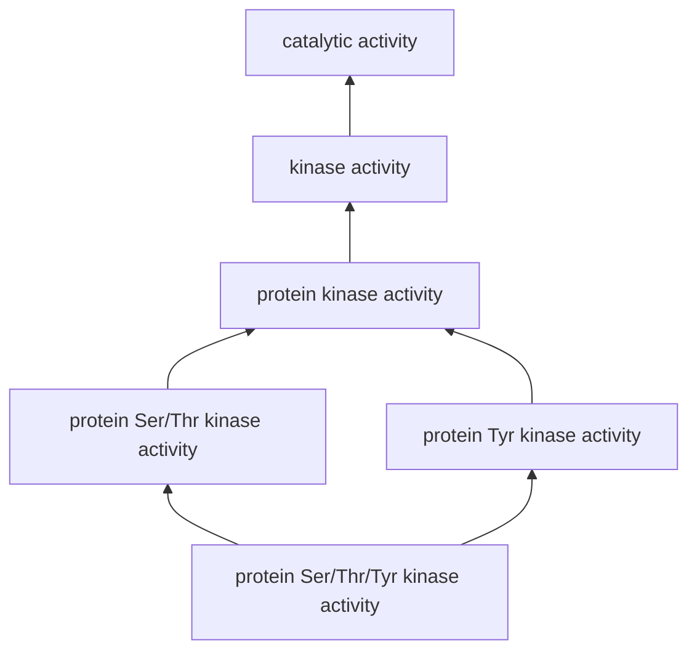
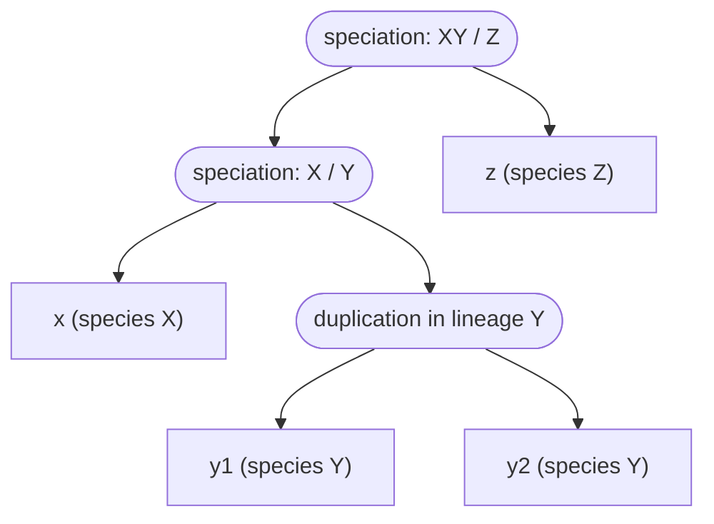

---
aliases:
  - Relation
  - Equivalence Relation
  - Equivalence Class
  - Partial Order
  - Relation binaire
tags:
  - type/concept
  - domain/mathematics
  - level/L1
  - level/L2
  - level/L3
mastery: 0
prerequisites:
  - "[[Set]]"
  - "[[Predicate Logic]]"
related:
  - "[[Function]]"
  - "[[Graph]]"
  - "[[Directed Acyclic Graph]]"
  - "[[Connected Component]]"
  - "[[Ortholog]]"
  - "[[Orthology Inference]]"
  - "[[Biological Ontology]]"
projects: []
sources:
  - "[[Mathematics for Computer Science (Lehman)]]"
  - "[[MIT 6.042J - Mathematics for Computer Science]]"
  - "[[Gene Ontology]]"
  - "[[Evolution (Futuyma)]]"
  - "[[Ensembl]]"
  - "[[Biology 2e (OpenStax)]]"
---

# Binary Relation

> [!abstract]
> A binary relation says which pairs of objects are linked; three properties (reflexive, symmetric, transitive) decide whether it sorts objects into classes, like orthology groups, or orders them, like Gene Ontology terms from specific to general.

## Definition

A **binary relation** $R$ from a set $A$ to a set $B$ is a subset of $A \times B$; $a \mathrel{R} b$ means $(a, b) \in R$. A relation **on** $A$ is a subset of $A \times A$, and it is:[^lehman][^mcs]

- **reflexive** if $a \mathrel{R} a$ for every $a$, **irreflexive** if for no $a$;
- **symmetric** if $a \mathrel{R} b \to b \mathrel{R} a$, **antisymmetric** if $(a \mathrel{R} b \land b \mathrel{R} a) \to a = b$;
- **transitive** if $(a \mathrel{R} b \land b \mathrel{R} c) \to a \mathrel{R} c$.

An **equivalence relation** is reflexive, symmetric and transitive. A **partial order** is reflexive, antisymmetric and transitive; a **strict partial order** is irreflexive and transitive.[^lehman]

## Why it matters

- **Grouping.** Every "same X as" relation (same species, same cluster, same orthology group) is an equivalence relation whose classes are the groups. Pairwise orthology is *not* one (Deeper).
- **Hierarchies.** The Gene Ontology is a directed acyclic graph in which a term may have several parents; `is_a` is transitive, so a gene annotated to a term is implicitly annotated to all its ancestors.[^go] Ordering terms by `is_a` gives a partial order ([[Biological Ontology]]).
- **Similarity is not equivalence.** "At most one mismatch apart" is not transitive, so grouping sequences through chains of similar pairs can merge very different ones ([[Hierarchical Clustering]]).
- **Data.** A relation is a table of pairs, a Boolean matrix or a graph ([[Graph]], [[Relational Database]]).

## Core (L1)

### Recognizing the properties

| Relation $x \mathrel{R} y$ on DNA strings | Refl. | Sym. | Antisym. | Trans. | Kind |
|---|:-:|:-:|:-:|:-:|---|
| same GC content | yes | yes | no | yes | equivalence |
| $x$ is a substring of $y$ | yes | no | yes | yes | partial order |
| $x$ is a proper prefix of $y$ | no | no | yes | yes | strict partial order |
| same length and [[Hamming Distance]] ≤ 1 | yes | yes | no | **no** | similarity |

`AAA` and `AAC` differ at one position, `AAC` and `ACC` too, but `AAA` and `ACC` differ at two: the last relation is not transitive.

### Equivalence classes partition the set

The **class** of $a$ under an equivalence relation $\sim$ is $[a] = \{x \in A : x \sim a\}$.

**Theorem.** The classes of an equivalence relation on $A$ form a **partition** of $A$: they are non-empty, they cover $A$, and two classes are either equal or disjoint. Conversely, every partition defines the equivalence relation "is in the same block as".[^lehman]

**Proof.** Reflexivity gives $a \in [a]$: classes are non-empty and cover $A$. If $c \in [a] \cap [b]$, then for any $x \in [a]$: $x \sim a$, $a \sim c$ (symmetry) and $c \sim b$, so $x \sim b$ by transitivity, used twice. Hence $[a] \subseteq [b]$, symmetrically $[b] \subseteq [a]$, and overlapping classes are equal. Conversely, "same block" is reflexive, symmetric and transitive because each element lies in exactly one block. $\square$

**Bio.** On the 64 codons, "encodes the same symbol as" is an equivalence relation whose 21 classes are the synonymous codon families of the 20 amino acids plus the stop codons ([[Genetic Code]]).[^os15] Likewise, when a pipeline assigns each gene to exactly one orthology group, "same group" is an equivalence relation whose classes are the groups.

### Partial orders and Hasse diagrams

A partial order allows **incomparable** elements, with neither $a \le b$ nor $b \le a$. Its **Hasse diagram** draws an edge from $a$ up to $b$ when $a < b$ with nothing in between; transitivity gives the rest. A simplified fragment modelled on GO molecular-function terms (intermediate terms omitted; check the current release for the real graph):



Let $s \le t$ when $t$ is $s$ or is reachable from $s$ by `is_a` edges. The relation is reflexive by definition, transitive because paths concatenate, and antisymmetric because the graph has no cycle: $s \le t \le s$ with $s \ne t$ would close one.[^go] The two middle terms are incomparable and the bottom term has two parents, so this is a partial order, not a tree. A gene annotated to the bottom term is implicitly annotated to the five terms above it.

## Deeper (L2)

### Orthology is not an equivalence relation

Two homologous genes are **orthologs** when they were separated by a speciation event and **paralogs** when they were separated by a gene duplication.[^futuyma] Ensembl applies this to gene trees reconciled with the species tree: genes whose most recent common ancestor node is a speciation are orthologues, typed 1-to-1, 1-to-many or many-to-many.[^ensembl] An invented gene tree, with a duplication in lineage Y after the X/Y split:



$y_1$ and $x$ are orthologs, $x$ and $y_2$ are orthologs, but $y_1$ and $y_2$ are paralogs, since their last common ancestor is the duplication. Orthology is symmetric but **not transitive**, and not reflexive (no event separates a gene from itself); $x$ is a 1-to-many ortholog of $\{y_1, y_2\}$. **Orthology groups** are therefore classes of a coarser relation: the smallest equivalence relation containing all ortholog pairs, whose classes are the [[Connected Component|connected components]] of the graph of ortholog pairs. Here that is one group, $\{x, y_1, y_2, z\}$, which contains the paralogs $y_1, y_2$ ([[Orthology Inference]]).

### Closures and representations

- **Closures.** Reflexive: $R \cup \{(a, a) : a \in A\}$; symmetric: $R \cup R^{-1}$; transitive: $R^+ = R \cup R^2 \cup R^3 \cup \dots$, where $R^2 = R \circ R$ holds the pairs joined by a two-step path. The classes of the equivalence closure are the connected components of the undirected graph of $R$, found by graph search or union-find ([[Disjoint-Set Data Structure]]). For "Hamming distance ≤ 1" on $\Sigma^k$ there is a single class (Exercise 2): chains of small steps join anything.
- **Matrices.** With $M_{ij} = 1$ iff $a_i \mathrel{R} a_j$: reflexive means a diagonal of ones, symmetric means $M = M^\top$, and transitive means that the Boolean product $M \odot M$ has no 1 where $M$ has a 0 ([[Adjacency Matrix]]).

## Advanced (L3)

- **DAGs and orders.** Reachability in a [[Directed Acyclic Graph]] is a partial order, and the Hasse diagram of a finite partial order is a DAG. Every finite partial order extends to a total order: repeatedly remove a **minimal** element (one exists, otherwise descending forever would revisit an element and contradict antisymmetry). This linear extension is a [[Topological Sort]]; taken children first, it is the order for propagating annotations up an ontology (Exercise 4).
- **Order-preserving maps.** After propagation, the gene set $G(t)$ of a term satisfies $s \le t \Rightarrow G(s) \subseteq G(t)$: the map $t \mapsto G(t)$ preserves order from $(\text{terms}, \le)$ to $(\mathcal{P}(\text{genes}), \subseteq)$. Statistics computed term by term are therefore nested and correlated along the graph, which matters when thousands of terms are tested at once ([[Gene Set Enrichment Analysis]], [[Multiple Testing Correction]]).

## Mathematical representation

- $R \subseteq A \times B$; inverse $R^{-1} = \{(b, a) : (a, b) \in R\}$; composition $S \circ R = \{(a, c) : \exists b,\ a \mathrel{R} b \land b \mathrel{S} c\}$. $R$ is transitive iff $R \circ R \subseteq R$.
- **Quotient.** $A/{\sim} = \{[a] : a \in A\}$ is the set of classes; $a \mapsto [a]$ is a surjective [[Function]] with $a \sim b \iff [a] = [b]$.
- **Kernel.** For any $f : A \to B$, "$f(a) = f(b)$" is an equivalence relation, and every equivalence relation arises this way (Exercise 5).
- A partial order is **total** (linear) when any two elements are comparable.

## Computational representation

A finite relation is a Python set of pairs, and each property is a quantified statement written with `all`:

```python
def is_reflexive(R, A):
    return all((a, a) in R for a in A)

def is_symmetric(R):
    return all((b, a) in R for a, b in R)

def is_antisymmetric(R):
    return all(a == b for a, b in R if (b, a) in R)

def is_transitive(R):
    return all((a, d) in R for a, b in R for c, d in R if b == c)

def classes(elements, pairs):
    """Classes of the smallest equivalence relation containing `pairs` (union-find)."""
    parent = {x: x for x in elements}
    def find(x):
        while parent[x] != x:
            x = parent[x]
        return x
    for a, b in pairs:
        parent[find(a)] = find(b)
    groups = {}
    for x in elements:
        groups.setdefault(find(x), set()).add(x)
    return sorted(sorted(g) for g in groups.values())

A = ["AAA", "AAC", "ACC", "CCC"]
R = {(u, v) for u in A for v in A if sum(x != y for x, y in zip(u, v)) <= 1}   # Hamming <= 1
print(is_reflexive(R, A), is_symmetric(R), is_transitive(R), classes(A, R))

genes = ["x", "y1", "y2", "z"]                     # invented gene tree of the Deeper section
orth = {("x", "y1"), ("x", "y2"), ("x", "z"), ("y1", "z"), ("y2", "z")}
orth |= {(b, a) for a, b in orth}                  # orthology is symmetric
print(is_symmetric(orth), is_transitive(orth), ("y1", "y2") in orth, classes(genes, orth))

is_a = {"Ser/Thr/Tyr kinase": ["Ser/Thr kinase", "Tyr kinase"],   # simplified GO-like fragment
        "Ser/Thr kinase": ["protein kinase"], "Tyr kinase": ["protein kinase"],
        "protein kinase": ["kinase"], "kinase": ["catalytic activity"], "catalytic activity": []}

def ancestors(t: str) -> set[str]:
    """t and every term reachable from it by is_a edges (reflexive-transitive closure)."""
    return {t}.union(*(ancestors(p) for p in is_a[t]))

leq = {(a, b) for a in is_a for b in ancestors(a)}  # a <= b: b is a or one of its ancestors
print(is_reflexive(leq, is_a), is_antisymmetric(leq), is_transitive(leq),
      ("Ser/Thr kinase", "Tyr kinase") in leq or ("Tyr kinase", "Ser/Thr kinase") in leq)
```

```text
True True False [['AAA', 'AAC', 'ACC', 'CCC']]
True False False [['x', 'y1', 'y2', 'z']]
True True True False
```

The Hamming relation chains `AAA` to `CCC` (three differences) into one class; the orthology closure merges two paralogs into the group; the `is_a` closure is a partial order in which the two middle kinase terms are incomparable.

## Worked example

> [!example] From ortholog pairs to an orthology group (gene tree of the Deeper section)
> 1. **Pairs.** Orthologous: $x$–$y_1$, $x$–$y_2$, $x$–$z$, $y_1$–$z$, $y_2$–$z$, since each last common ancestor is a speciation. $y_1$–$y_2$ is paralogous.
> 2. **Properties.** Symmetric: yes. Transitive: no, since $y_1 \sim x$ and $x \sim y_2$ but $y_1 \not\sim y_2$. "The orthologs of $x$" are therefore not a class of orthology itself.
> 3. **Close the relation.** Union-find on the pairs (second output line above) merges $x, y_1, y_2, z$ into one class.
> 4. **Read the result.** One group of four genes, two of which are paralogs from the same species: a class of the closure, not a set of pairwise orthologs.

## Common misconceptions

> [!warning] "Symmetric and transitive imply reflexive"
> The tempting proof picks $b$ with $a \mathrel{R} b$, then gets $b \mathrel{R} a$ and $a \mathrel{R} a$. It fails for an $a$ related to nothing: the empty relation on a non-empty set is symmetric and transitive but not reflexive.

> [!warning] "An orthology group is a set of pairwise orthologs"
> Orthology is not transitive. After a lineage-specific duplication, two genes of the same group are paralogs.

> [!warning] "An ontology is a tree"
> A GO term can have several parents: the terms form a DAG and a partial order with incomparable terms, not a tree with one path to the root.[^go]

## Exercises

> [!question] Exercise 1 (L1)
> Classify on non-empty DNA strings: (a) "has the same first base as"; (b) "is the reverse complement of"; (c) "is a suffix of"; (d) "has a GC content lower than or equal to that of".

> [!success]- Solution
> (a) Equivalence relation with 4 classes, one per first base. (b) Symmetric, since $y = \mathrm{rc}(x) \iff x = \mathrm{rc}(y)$ ([[Reverse Complement]]); not reflexive, as $x = \mathrm{rc}(x)$ only for reverse palindromes such as `GAATTC`; not transitive, since $x \mathrel{R} \mathrm{rc}(x)$ and $\mathrm{rc}(x) \mathrel{R} x$ would force $x \mathrel{R} x$. (c) Partial order. (d) Reflexive and transitive but not antisymmetric, since different strings can share a GC content: a **preorder**.

> [!question] Exercise 2 (L2)
> Prove that the equivalence closure of "Hamming distance ≤ 1" on $\Sigma^k$ has a single class.

> [!success]- Solution
> Let $u, v \in \Sigma^k$ differ at $d \le k$ positions. Change these positions of $u$ one at a time into those of $v$: consecutive words differ at one position, so they are related, and the chain reaches $v$ in $d$ steps. By transitivity of the closure, $u$ and $v$ lie in the same class.

> [!question] Exercise 3 (L2)
> Lineage X also duplicates after the X/Y split, giving $x_1, x_2$ instead of $x$. Classify the pairs between X and Y genes and give the Ensembl-style orthology type.

> [!success]- Solution
> $x_1$–$y_1$, $x_1$–$y_2$, $x_2$–$y_1$ and $x_2$–$y_2$ are orthologous, since each last common ancestor is the X/Y speciation: a **many-to-many** orthology.[^ensembl] $x_1$–$x_2$ and $y_1$–$y_2$ are paralogous.

> [!question] Exercise 4 (L2, Python)
> With `is_a` from the code above, compute a topological order with `graphlib` and propagate invented direct annotations up the graph. Why must a parent receive the **union** of its children's genes, not the sum of their counts?

> [!success]- Solution
> ```python
> from graphlib import TopologicalSorter
>
> order = list(TopologicalSorter(is_a).static_order())   # every term after its parents
> genes_of = {t: set() for t in is_a}
> genes_of.update({"Ser/Thr/Tyr kinase": {"gD"}, "Ser/Thr kinase": {"gS"}, "Tyr kinase": {"gY"}})
> for t in reversed(order):                               # children before parents
>     for parent in is_a[t]:
>         genes_of[parent] |= genes_of[t]
> print(order[0], {t: len(g) for t, g in genes_of.items()})
> ```
> Output: `catalytic activity {'Ser/Thr/Tyr kinase': 1, 'Ser/Thr kinase': 2, 'Tyr kinase': 2, 'protein kinase': 3, 'kinase': 3, 'catalytic activity': 3}`. Gene `gD` reaches "protein kinase" by two paths; adding the children's counts would give 4 and count it twice.

> [!question] Exercise 5 (L3)
> Prove that $\sim$ is an equivalence relation on $A$ iff some function $f$ on $A$ satisfies $a \sim b \iff f(a) = f(b)$.

> [!success]- Solution
> ($\Leftarrow$) Equality is reflexive, symmetric and transitive, and these properties carry over through $f$. ($\Rightarrow$) Take $f(a) = [a]$. If $a \sim b$, then $b \in [a] \cap [b]$, so $[a] = [b]$ by the partition theorem; if $[a] = [b]$, then $a \in [b]$, so $a \sim b$.

## Mastery checklist

- [ ] 1 Recognized: I can state the five properties and define equivalence relations and partial orders.
- [ ] 2 Understood: I can explain why equivalence classes partition a set and why orthology and similarity thresholds are not equivalence relations.
- [ ] 3 Practiced: I can test the properties of a finite relation, compute closures and classes, and draw a Hasse diagram.
- [ ] 4 Applied: I computed orthology groups or GO ancestor sets from real data and checked what the closure merged.
- [ ] 5 Explained: I can teach the partition theorem, the non-transitivity of orthology and why annotation counts must be propagated as unions along a DAG.

## References

[^lehman]: [[Mathematics for Computer Science (Lehman)]], 2017 revision, proofs part (sets, functions, binary relations).
[^mcs]: [[MIT 6.042J - Mathematics for Computer Science]], fundamental-concepts third of the course (sets, functions, relations).
[^go]: [[Gene Ontology]], GO documentation on the ontology structure: terms are nodes of a directed acyclic graph, a term can have more than one parent, `is_a` is transitive, and an annotation to a term holds for its ancestors.
[^futuyma]: [[Evolution (Futuyma)]], 5th ed. (2023), evolution of genes and genomes (orthologs and paralogs).
[^ensembl]: [[Ensembl]], Compara documentation on homology types: orthologues are genes whose most recent common ancestor node in the reconciled gene tree is a speciation; 1-to-1, 1-to-many and many-to-many orthologues.
[^os15]: [[Biology 2e (OpenStax)]], ch. 15 "Genes and Proteins" (the genetic code: 64 codons, 20 amino acids, 3 stop codons).
