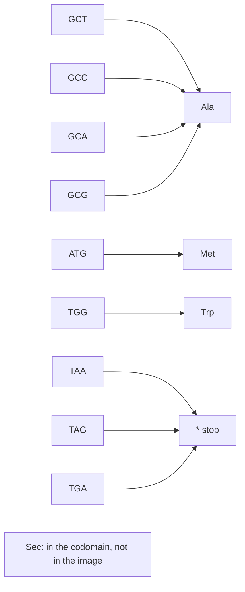

---
aliases:
  - Mapping
  - Injection
  - Surjection
  - Bijection
  - Inverse Function
  - Fonction
tags:
  - type/concept
  - domain/mathematics
  - level/L1
  - level/L2
  - level/L3
mastery: 0
prerequisites:
  - "[[Set]]"
  - "[[Binary Relation]]"
related:
  - "[[Genetic Code]]"
  - "[[Codon]]"
  - "[[Reverse Complement]]"
  - "[[K-mer]]"
  - "[[Hash Function]]"
  - "[[Pigeonhole Principle]]"
  - "[[Logarithm]]"
projects:
  - "[[02-sequence-translation]]"
  - "[[01-dna-engine]]"
sources:
  - "[[Mathematics for Computer Science (Lehman)]]"
  - "[[MIT 6.042J - Mathematics for Computer Science]]"
  - "[[Calculus (OpenStax)]]"
  - "[[Biology 2e (OpenStax)]]"
  - "[[NCBI Genetic Codes]]"
  - "[[Molecular Biology of the Cell (Alberts)]]"
  - "[[GA4GH hts-specs]]"
---

# Function

> [!abstract]
> A function assigns to every element of one set exactly one element of another; whether different inputs can share an output (injective) and whether every output is reached (surjective) decide whether information is lost, which is why a protein cannot be read back into its gene while a reverse complement can always be undone.

## Definition

A **function** $f : A \to B$ assigns to each element $a$ of its **domain** $A$ exactly one element $f(a)$ of its **codomain** $B$. Formally it is a relation $f \subseteq A \times B$ with $\forall a \in A\ \exists!\, b \in B,\ (a, b) \in f$ ([[Binary Relation]], [[Predicate Logic]]).[^lehman][^mcs][^calc] Its **image** is $f(A) = \{f(a) : a \in A\} \subseteq B$, and the **preimage** of $b$ is $f^{-1}(b) = \{a \in A : f(a) = b\}$. The function is:[^lehman]

- **injective** (one-to-one) if $f(a) = f(a') \to a = a'$: distinct inputs give distinct outputs;
- **surjective** (onto) if $\forall b \in B\ \exists a \in A,\ f(a) = b$: the image is the whole codomain;
- **bijective** if both: every $b$ has exactly one preimage.

## Why it matters

- **The genetic code** maps 64 codons to 20 amino acids plus a stop signal.[^os15] It is surjective but not injective (degenerate), so a protein does not determine its gene ([[Genetic Code]], [[02-sequence-translation]]).
- **The reverse complement** is a bijection of $\Sigma^n$ that is its own inverse, so switching strands never loses information ([[Reverse Complement]], [[01-dna-engine]]).
- **Encodings and hashes.** Writing each k-mer as an integer in $\{0, \dots, 4^k - 1\}$ is a bijection ([[K-mer]]); a [[Hash Function]] maps a huge domain into a small range, so it cannot be injective and collisions must be handled.
- **Inverse functions** undo each other: the Phred score $Q = -10 \log_{10} P$ is converted back to an error probability by $P = 10^{-Q/10}$,[^phred] the [[Exponential Function]] inverting the [[Logarithm]] ([[Phred Quality Score]]).

## Core (L1)

### Domain, codomain, image

The codomain is part of the function. Selenocysteine is built into some proteins when a UGA codon is recoded in a specific context,[^alberts] but the standard table maps UGA to stop. Give the rule "codon ↦ what the standard table says" the codomain $\mathcal{A} \cup \{*\}$ (20 amino acids and stop) and it is surjective; give it the codomain $\mathcal{A} \cup \{*, \mathrm{Sec}\}$ and it is not, although the rule and the image are unchanged.



### Injective, surjective, bijective

For finite sets, an injection $A \to B$ needs $|A| \le |B|$, a surjection needs $|A| \ge |B|$, a bijection $|A| = |B|$. With 64 codons and 21 symbols, **no** genetic code can be injective: by the [[Pigeonhole Principle]], some symbol receives at least $\lceil 64/21 \rceil = 4$ codons. Degeneracy is forced by counting before any biology. In the standard code, preimage sizes range from 1 (Met, Trp) to 6 (Leu, Ser, Arg) and sum to 64 (computed below from the NCBI table).[^ncbi]

### Bio: the reverse complement is an involution

The complement $c$ on $\Sigma = \{A, C, G, T\}$ swaps A↔T and C↔G, so $c(c(x)) = x$. The two DNA strands are complementary and antiparallel,[^os14] and the partner strand of $s = s_1 \dots s_n$, read 5' → 3', is $\mathrm{rc}(s)_i = c(s_{n+1-i})$. Then
$$\mathrm{rc}(\mathrm{rc}(s))_i = c\big(\mathrm{rc}(s)_{n+1-i}\big) = c\big(c(s_{n+1-(n+1-i)})\big) = c(c(s_i)) = s_i,$$
so $\mathrm{rc} \circ \mathrm{rc} = \mathrm{id}$: rc is an **involution**, hence a bijection whose inverse is itself (proof in Mathematical representation).

### Composition and inverse

$(g \circ f)(a) = g(f(a))$ requires the codomain of $f$ to lie in the domain of $g$. "Translate the minus strand" is $\mathrm{translate} \circ \mathrm{rc}$; the other order, rc of a protein, is meaningless. An **inverse** $f^{-1} : B \to A$, with $f^{-1} \circ f = \mathrm{id}_A$ and $f \circ f^{-1} = \mathrm{id}_B$, exists exactly when $f$ is bijective. Compositions of injections are injective and of surjections surjective, so compositions of bijections are bijections, with $(g \circ f)^{-1} = f^{-1} \circ g^{-1}$.

## Deeper (L2)

- **Back-translation is a preimage.** A protein $a_1 \dots a_k$ with its stop is encoded by every element of $g^{-1}(a_1) \times \dots \times g^{-1}(a_k) \times g^{-1}(*)$, a set of $3 \prod_{i} |g^{-1}(a_i)|$ coding sequences ([[Set]], [[Summation Notation]]). For `MAK`: $1 \times 4 \times 2 \times 3 = 24$.
- **One-sided inverses.** $g$ has no inverse, but it has **right inverses**: any table $s$ that picks one codon per symbol satisfies $g \circ s = \mathrm{id}$, for example the most frequent codon of an organism for each amino acid ([[Codon Usage Bias]]). In general, a function with a non-empty domain is injective iff it has a left inverse and surjective iff it has a right inverse.
- **Counting with functions.** There are $|B|^{|A|}$ functions $A \to B$: $21^{64} \approx 4.2 \times 10^{84}$ ways to assign 21 symbols to 64 codons ([[Combinatorics]]). Two finite sets have the same size iff a bijection joins them, which is how $|\mathcal{P}(A)| = 2^n$ is proved ([[Set#Mathematical representation]]).

## Advanced (L3)

- **Functions on classes.** Strand symmetry identifies a k-mer $w$ with $\mathrm{rc}(w)$. The pairs $\{w, \mathrm{rc}(w)\}$ are the classes of an equivalence relation on $\Sigma^k$ ([[Binary Relation]]), and $\mathrm{canon}(w) = \min(w, \mathrm{rc}(w))$ is constant on each class: it picks one representative, the canonical k-mer ([[K-mer]]). Each class has 2 elements except the fixed points $w = \mathrm{rc}(w)$ (reverse palindromes), which exist only for even $k$: the first $k/2$ letters determine the rest, so there are $4^{k/2}$. Hence the number of canonical k-mers is $(4^k + 4^{k/2})/2$ for even $k$ and $4^k/2$ for odd $k$: 32 for $k = 3$, 136 for $k = 4$ (Exercise 5).
- **Hashing is non-injective by design.** A hash function sends keys into $m$ slots; with more possible keys than slots, the pigeonhole principle guarantees collisions, so a [[Hash Table]] must resolve them. For small $k$, the bijective 2-bit encoding of k-mers is a collision-free array index ([[K-mer]]).

## Mathematical representation

- $f : A \to B$; for $S \subseteq A$ and $T \subseteq B$: $f(S) = \{f(a) : a \in S\}$ and $f^{-1}(T) = \{a \in A : f(a) \in T\}$. Preimages exist as **sets** even when $f$ has no inverse function.
- **Fibres partition the domain.** The non-empty preimages $f^{-1}(b)$ are the classes of the equivalence relation $f(a) = f(a')$, so $|A| = \sum_{b \in f(A)} |f^{-1}(b)|$. For the genetic code, $\sum_{a} d(a) = 64$ with $d(a) = |g^{-1}(a)|$ the degeneracy of $a$.
- **An involution is a bijection.** If $h \circ h = \mathrm{id}_A$: $h(a) = h(a')$ gives $a = h(h(a)) = h(h(a')) = a'$, so $h$ is injective; any $b$ equals $h(h(b))$, the image of $h(b)$, so $h$ is surjective.
- **Translation** in a frame applies $g$ codon by codon: $\Sigma^{3k} \to (\mathcal{A} \cup \{*\})^k$, surjective and, for $k \ge 1$, not injective.

## Computational representation

A finite function is a Python `dict` from its domain; injectivity and surjectivity compare the set of values with the domain and the codomain:

```python
from collections import Counter
from itertools import product

STANDARD = "FFLLSSSSYY**CC*WLLLLPPPPHHQQRRRRIIIMTTTTNNKKSSRRVVVVAAAADDEEGGGG"  # NCBI table 1
CODONS = ["".join(c) for c in product("TCAG", repeat=3)]                     # TCAG order
g = dict(zip(CODONS, STANDARD))                     # the genetic code as a finite function
AA20 = set("ACDEFGHIKLMNPQRSTVWY")

def is_injective(f: dict) -> bool:
    return len(set(f.values())) == len(f)

def is_surjective(f: dict, codomain: set) -> bool:
    return set(f.values()) == codomain

print(len(g), len(set(g.values())), is_injective(g))
print(is_surjective(g, AA20 | {"*"}), is_surjective(g, AA20 | {"*", "U"}))   # U = selenocysteine
degeneracy = Counter(g.values())                      # |g^-1(a)| for each symbol a
print(sorted(Counter(degeneracy.values()).items()))   # (preimage size, number of symbols)

COMP = str.maketrans("ACGT", "TGCA")

def rc(s: str) -> str:
    return s.translate(COMP)[::-1]

words = ["".join(p) for p in product("ACGT", repeat=3)]
print(all(rc(rc(w)) == w for w in words))           # rc o rc = identity on Sigma^3
print(sorted(map(rc, words)) == sorted(words))       # rc permutes Sigma^3: a bijection

def translate(dna: str) -> str:
    return "".join(g[dna[i:i + 3]] for i in range(0, len(dna) - 2, 3))

print(translate("TTAGCCATG"), translate(rc("TTAGCCATG")))   # translate, and translate o rc
```

```text
64 21 False
True False
[(1, 2), (2, 9), (3, 2), (4, 5), (6, 3)]
True
True
LAM HG*
```

Two symbols have 1 codon (Met, Trp), nine have 2, two have 3 (Ile and stop), five have 4 and three have 6: $2 + 18 + 6 + 20 + 18 = 64$. Counting preimages (Deeper section):

```python
from math import prod

def n_coding_sequences(protein: str) -> int:
    """Size of g^-1(a1) x ... x g^-1(ak) x g^-1(*): coding sequences, stop included."""
    return prod(degeneracy[a] for a in protein + "*")

print(n_coding_sequences("MAK"), f"{21 ** 64:.2e}")
```

```text
24 4.19e+84
```

## Worked example

> [!example] Five functions on DNA, classified
> | Function | Domain → codomain | Injective | Surjective |
> |---|---|:-:|:-:|
> | complement $c$ | $\Sigma \to \Sigma$ | yes | yes (an involution) |
> | length | $\Sigma^* \to \{0, 1, 2, \dots\}$ | no: `AC` and `GT` have length 2 | yes: the empty word has length 0 |
> | GC count | $\Sigma^2 \to \{0, 1, 2\}$ | no: 16 inputs, 3 outputs | yes: `AA` ↦ 0, `AC` ↦ 1, `CC` ↦ 2 |
> | standard code $g$ | $\Sigma^3 \to \mathcal{A} \cup \{*\}$ | no | yes |
> | $\mathrm{rc}$ | $\Sigma^n \to \Sigma^n$ | yes | yes |
>
> Only the bijections can be undone. Knowing that a dinucleotide has GC count 1 leaves 8 candidates: 2 choices of G or C, 2 choices of A or T, and 2 orders.

## Common misconceptions

> [!warning] "The genetic code is degenerate, so it is ambiguous"
> Degenerate means non-injective: several codons per amino acid. Each codon still has exactly one meaning in a given table,[^os15] which is precisely what makes the code a function.

> [!warning] "Surjectivity is a property of the rule"
> It depends on the codomain. The standard table is onto the 20 amino acids plus stop, not onto a set that also contains selenocysteine.

> [!warning] "The complement, or the reverse, undoes the reverse complement"
> rc is its own inverse. Complement and reverse are involutions too, but neither undoes rc: $c(\mathrm{rc}(s))$ is $s$ reversed, not $s$.

## Exercises

> [!question] Exercise 1 (L1)
> Give the domain, a codomain and the image of: (a) the length of DNA words of length at most 3; (b) the GC content of words of $\Sigma^4$; (c) the map from a codon to its first base. Which are surjective onto the codomain you chose?

> [!success]- Solution
> (a) Words of length 0 to 3, codomain $\{0, 1, 2, \dots\}$, image $\{0, 1, 2, 3\}$: not surjective onto that codomain, surjective onto $\{0, 1, 2, 3\}$. (b) $\Sigma^4 \to [0, 1]$, image $\{0, \frac14, \frac12, \frac34, 1\}$. (c) $\Sigma^3 \to \Sigma$, image $\Sigma$: surjective, not injective (16 codons per first base).

> [!question] Exercise 2 (L1)
> Is "codon ↦ amino acid" a function from the 64 codons to the 20 amino acids (no stop symbol)? If not, how can it be repaired?

> [!success]- Solution
> No: TAA, TAG and TGA have no value, and a function must be defined on its whole domain. Either restrict the domain to the 61 sense codons, or add a stop symbol $*$ to the codomain, as the NCBI tables do.[^ncbi]

> [!question] Exercise 3 (L2, Python)
> How many DNA sequences, stop codon included, encode the peptide `MWHK`? Explain why the answer is a product, then check it with `n_coding_sequences`.

> [!success]- Solution
> A coding sequence is an element of $g^{-1}(M) \times g^{-1}(W) \times g^{-1}(H) \times g^{-1}(K) \times g^{-1}(*)$, so the count is $1 \times 1 \times 2 \times 2 \times 3 = 12$; `n_coding_sequences("MWHK")` returns `12`. Met and Trp, with a single codon each, carry no choice.

> [!question] Exercise 4 (L2)
> Show that if $f : A \to B$ has a right inverse $s$ (with $f \circ s = \mathrm{id}_B$), then $f$ is surjective and $s$ is injective. What does this mean for a table choosing one codon per amino acid?

> [!success]- Solution
> For any $b$, $f(s(b)) = b$, so $b$ is in the image of $f$. If $s(b) = s(b')$, applying $f$ gives $b = b'$. A codon-choice table is therefore an injective map from 21 symbols into the codons: distinct amino acids always get distinct codons, as required for the protein to be recovered by translation.

> [!question] Exercise 5 (L3, Python)
> Count the canonical 2-mers and 4-mers with the class-counting formula, then check against a brute-force count using `rc` and `product` from the code above.

> [!success]- Solution
> The reverse-palindromic 2-mers are `AT`, `TA`, `CG`, `GC` ($4^1$), so there are $(16 + 4)/2 = 10$ canonical 2-mers; for $k = 4$, $(4^4 + 4^2)/2 = 136$.
> ```python
> def n_canonical(k: int) -> int:
>     return len({min(w, rc(w)) for w in ("".join(p) for p in product("ACGT", repeat=k))})
>
> print([(k, n_canonical(k), (4 ** k + (4 ** (k // 2) if k % 2 == 0 else 0)) // 2) for k in (2, 3, 4)])
> ```
> Output: `[(2, 10, 10), (3, 32, 32), (4, 136, 136)]`: brute force and formula agree.

## Mastery checklist

- [ ] 1 Recognized: I can name domain, codomain, image and preimage, and define injective, surjective and bijective.
- [ ] 2 Understood: I can explain why every genetic code is degenerate (pigeonhole), why surjectivity depends on the codomain, and why rc is a bijection.
- [ ] 3 Practiced: I can test these properties on finite functions in Python, compose functions and count preimages.
- [ ] 4 Applied: in [[02-sequence-translation]] and [[01-dna-engine]], I implemented translation and reverse complement and checked their properties on real sequences.
- [ ] 5 Explained: I can teach one-sided inverses (codon choice), functions on equivalence classes (canonical k-mers) and why hashing cannot be injective.

## References

[^lehman]: [[Mathematics for Computer Science (Lehman)]], 2017 revision, proofs part (sets, functions, relations).
[^mcs]: [[MIT 6.042J - Mathematics for Computer Science]], fundamental-concepts third of the course (sets, functions, relations).
[^calc]: [[Calculus (OpenStax)]], Volume 1 (functions).
[^os15]: [[Biology 2e (OpenStax)]], ch. 15 "Genes and Proteins" (the genetic code: 64 codons, 20 amino acids, 3 stop codons, degeneracy).
[^os14]: [[Biology 2e (OpenStax)]], ch. 14 "DNA Structure and Function".
[^ncbi]: [[NCBI Genetic Codes]], "The Genetic Codes" (NCBI Taxonomy), translation tables in TCAG codon order.
[^alberts]: [[Molecular Biology of the Cell (Alberts)]], 4th ed. (2002), treatment of the genetic code (selenocysteine).
[^phred]: [[GA4GH hts-specs]], `SAMv1` specification (Phred scale).
