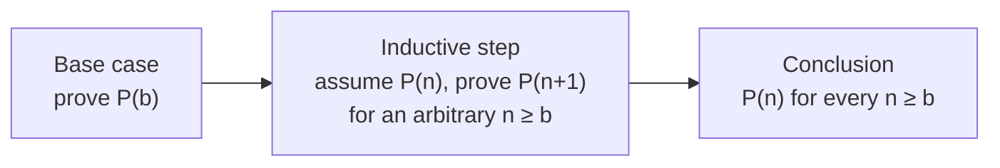

---
aliases:
  - Induction
  - Proof by Induction
  - Strong Induction
  - Structural Induction
  - Récurrence (démonstration)
tags:
  - type/concept
  - domain/mathematics
  - domain/computer-science
  - level/L1
  - level/L2
  - level/L3
mastery: 0
prerequisites:
  - "[[Mathematical Proof]]"
  - "[[Proof Techniques]]"
  - "[[Summation Notation]]"
related:
  - "[[Recursion]]"
  - "[[Loop Invariant]]"
  - "[[Recurrence Relation]]"
  - "[[Tree (Graph Theory)]]"
  - "[[Phylogenetic Tree]]"
  - "[[Phylogenetic Tree Search]]"
  - "[[Dynamic Programming]]"
projects:
  - "[[08-phylogenetic-engine]]"
sources:
  - "[[Mathematics for Computer Science (Lehman)]]"
  - "[[MIT 6.042J - Mathematics for Computer Science]]"
  - "[[Inferring Phylogenies (Felsenstein)]]"
---

# Mathematical Induction

> [!abstract]
> Induction proves a statement for every $n$ in two moves: show it for the first case, then show that each case implies the next; it is how recursive algorithms are proved correct and how we know that $n$ species can be related by $(2n-5)!!$ different unrooted trees.

## Definition

Let $P(n)$ be a statement about the natural number $n$ ([[Predicate Logic]]). The **principle of induction** says: if $P(0)$ is true (**base case**) and $P(n) \to P(n+1)$ for every $n \ge 0$ (**inductive step**), then $P(n)$ is true for every $n \ge 0$.[^lehman5][^mcs] In the step, the assumption $P(n)$ is the **induction hypothesis**. **Strong induction** allows the step to assume $P(0), P(1), \dots, P(n)$ together to prove $P(n+1)$; it proves exactly the same statements, and both are equivalent to the **well-ordering principle**, that every non-empty set of natural numbers has a least element.[^lehman5][^lehman2] The base can be any integer $b$, giving $P(n)$ for all $n \ge b$.

## Why it matters

- **Recursive algorithms.** A recursive function is correct if it is correct on base cases and correct on an input whenever its recursive calls are correct on smaller inputs: a strong induction on input size ([[Recursion]]). Loop invariants are inductions on the number of iterations ([[Loop Invariant]]), and dynamic-programming tables are filled in an order that makes each entry's proof rely only on earlier ones ([[Dynamic Programming]], [[Proof Techniques#Deeper (L2)]]).
- **Trees.** Phylogenies, Newick strings and suffix trees are recursive objects; their counts of edges and internal nodes are proved by induction ([[Tree (Graph Theory)]], [[Phylogenetic Tree]], [[08-phylogenetic-engine]]).
- **Tree space.** The number of unrooted binary tree topologies for $n$ labeled species is $(2n-5)!!$, proved by induction on $n$;[^felsenstein] it explains why tree building cannot try every tree ([[Phylogenetic Tree Search]]).
- **Closed forms.** Formulas for sums and recurrences are guessed from small cases and proved by induction ([[Summation Notation]], [[Recurrence Relation]]).

## Core (L1)

### The template



Like dominoes: the first falls (base), and each falling domino knocks over the next (step), so all fall. Write the four parts explicitly: the statement $P(n)$, the base case, the step with the hypothesis marked, the conclusion.[^lehman5]

### Example: copies made during PCR

In ideal PCR starting from one molecule, cycle $i + 1$ copies the $2^i$ molecules present, so the copies made in the first $n$ cycles total $\sum_{i=0}^{n-1} 2^i$ ([[Exponential Function]]).

**Theorem.** For every $n \ge 0$: $\sum_{i=0}^{n-1} 2^i = 2^n - 1$.
*Proof.* $P(n)$ is the equation. **Base**, $n = 0$: the empty sum is $0 = 2^0 - 1$. **Step**: assume $P(n)$. Then
$$\sum_{i=0}^{n} 2^i = \Big(\sum_{i=0}^{n-1} 2^i\Big) + 2^n = (2^n - 1) + 2^n = 2^{n+1} - 1,$$
using the hypothesis in the second equality; this is $P(n+1)$. **Conclusion**: $P(n)$ for all $n \ge 0$. ∎ After $n$ cycles there are $2^n$ molecules: the original plus $2^n - 1$ copies.

### Example: a tree with $n$ vertices has $n - 1$ edges

A **tree** is a connected graph without cycles; a **leaf** is a vertex of degree 1 ([[Tree (Graph Theory)]]).[^lehman-graphs]

**Lemma.** A tree with at least 2 vertices has a leaf. *Proof.* Take a longest path $v_0 \dots v_k$ ($k \ge 1$). If $v_k$ had a neighbor other than $v_{k-1}$, it would be either on the path (a cycle) or off it (a longer path), both impossible. So $v_k$ is a leaf. ∎

**Theorem.** Every tree with $n \ge 1$ vertices has $n - 1$ edges.[^lehman-graphs]
*Proof by induction on $n$.* **Base**, $n = 1$: one vertex, no edge. **Step**: let $T$ have $n + 1 \ge 2$ vertices. By the lemma it has a leaf $v$; removing $v$ and its single edge leaves a graph that is still connected (no path between two other vertices went through a leaf) and acyclic, so a tree with $n$ vertices. By the hypothesis it has $n - 1$ edges, so $T$ has $n$. ∎
A phylogeny with 10 tips and 8 internal nodes, being a tree on 18 vertices, has 17 branches.

### Strong induction: internal nodes of a rooted binary tree

In a **rooted binary tree** every internal node has exactly two children, as in a rooted phylogeny.

**Theorem.** A rooted binary tree with $n \ge 1$ leaves has $n - 1$ internal nodes.
*Proof by strong induction on $n$.* **Base**, $n = 1$: a single leaf, 0 internal nodes. **Step**: let $n \ge 2$ and assume the claim for every number of leaves smaller than $n$. The root is internal; its two subtrees have $a \ge 1$ and $b \ge 1$ leaves with $a + b = n$, so $a, b < n$. By the hypothesis they have $a - 1$ and $b - 1$ internal nodes, and the tree has $(a - 1) + (b - 1) + 1 = n - 1$. ∎
Ordinary induction would assume only the case $n - 1$, but the subtrees can have any sizes below $n$: that is when strong induction is needed. With the previous theorem, such a tree has $2n - 1$ vertices and $2n - 2$ edges.

## Deeper (L2)

**Proving a recursive algorithm.** Fast exponentiation computes $a^n$ from $a^{\lfloor n/2 \rfloor}$:

- `power(a, 0) = 1`;
- for $n \ge 1$: with `half = power(a, n // 2)`, return `half * half` if $n$ is even, `half * half * a` if $n$ is odd.

*Claim:* `power(a, n)` $= a^n$ for all $n \ge 0$. *Proof by strong induction.* Base $n = 0$: returns $1 = a^0$. Step, $n \ge 1$: $\lfloor n/2 \rfloor < n$, so by the hypothesis `half` $= a^{\lfloor n/2 \rfloor}$. If $n = 2m$, `half * half` $= a^{2m}$; if $n = 2m + 1$, `half * half * a` $= a^{2m+1}$. ∎ Termination follows because the argument strictly decreases to 0. The number of calls is $\lfloor \log_2 n \rfloor + 2$ for $n \ge 1$, also proved by strong induction (Exercise 4; [[Logarithm]]). [[Recursion]] applies the same pattern to k-mer enumeration.

**Strengthening the hypothesis.** Sometimes $P(n)$ is too weak to carry the step, and a stronger statement is easier to prove: the step then has more to work with. Loop invariants are often found this way ([[Loop Invariant]]).

**Classic errors.**

- No base case: "$n = n + 1$ implies $n + 1 = n + 2$" is a valid step, but there is no first true case.
- A step that silently needs $n \ge 2$: Exercise 2 "proves" that every DNA word is made of a single base.
- Assuming what is to be proved: the step must derive $P(n+1)$, not assume it.

## Advanced (L3)

### Counting unrooted binary trees

An **unrooted binary tree** on $n \ge 3$ labeled tips has internal nodes of degree 3; it is the usual shape of an inferred phylogeny before rooting. Let $B(n)$ be the number of such tree topologies.

**Lemma.** Such a tree has $n - 2$ internal nodes and $2n - 3$ edges (Exercise 3).

**Theorem.** $B(n) = (2n - 5)!! = 1 \times 3 \times 5 \times \dots \times (2n - 5)$ for $n \ge 3$.[^felsenstein]
*Proof by induction on $n$.* **Base**: $B(3) = 1 = 1!!$, the star with one internal node. **Step**: every tree on tips $1, \dots, n+1$ is obtained from exactly one tree on tips $1, \dots, n$ by inserting tip $n + 1$ in exactly one of its $2n - 3$ edges: deleting tip $n + 1$ and merging the two edges at its former attachment node recovers both the smaller tree and the edge, and distinct (tree, edge) pairs give distinct trees. Hence $B(n + 1) = (2n - 3)\, B(n) = (2n - 3)(2n - 5)!! = \big(2(n+1) - 5\big)!!$. ∎

| Tips $n$ | 4 | 5 | 6 | 10 | 20 | 50 |
|---|---:|---:|---:|---:|---:|---:|
| $B(n)$ | 3 | 15 | 105 | 2,027,025 | $2.22 \times 10^{20}$ | $2.84 \times 10^{74}$ |

Rooted binary trees on $n$ tips number $(2n - 3)!!$ (Exercise 6).[^felsenstein] Beyond about a dozen species, evaluating every topology is out of reach, so tree inference searches the space heuristically ([[Phylogenetic Tree Search]], [[Exhaustive Search]]).

### Structural induction and well-ordering

- **Structural induction** proves a property of recursively defined objects (strings, nested tuples, Newick trees): show it for the base objects, then show that each constructor preserves it.[^lehman] The proof for rooted binary trees above is a structural induction in disguise, and code that recurses on the same structure inherits its correctness argument ([[Recursion]]).
- **Well-ordering** gives the **minimal counterexample** style: if $P$ failed somewhere, there would be a least $n$ where it fails; derive a contradiction by finding a smaller failure.[^lehman2] It is induction read backwards.

## Mathematical representation

- **Ordinary induction**: $\big[P(b) \land \forall n \ge b\, (P(n) \to P(n+1))\big] \to \forall n \ge b\ P(n)$.
- **Strong induction**: $\big[\forall n \ge b\, \big((\forall k,\ b \le k < n \to P(k)) \to P(n)\big)\big] \to \forall n \ge b\ P(n)$; for $n = b$ the hypothesis is vacuous, so the base case is included in the step.
- **Strong from ordinary**: apply ordinary induction to $Q(n) = \forall k \in \{b, \dots, n\},\ P(k)$.[^lehman5]
- **From a recurrence to a product.** $B(3) = 1$ and $B(n+1) = (2n - 3)\,B(n)$ give, by induction,
$$B(n) = \prod_{k=3}^{n-1} (2k - 3) = 1 \cdot 3 \cdots (2n - 5) = (2n - 5)!!,$$
the empty product being 1 for $n = 3$ ([[Summation Notation]]).

## Computational representation

Code mirrors induction: a recursive function on trees follows the strong-induction proof, and small cases can be checked exhaustively.

```python
from math import log2, prod


def double_factorial(m: int) -> int:
    """m!! = m (m - 2) (m - 4) ... down to 1 or 2; the empty product (m <= 0) is 1."""
    return prod(range(m, 0, -2))


def n_unrooted_trees(n: int) -> int:
    """Unrooted binary tree topologies on n >= 3 labeled tips: (2n - 5)!!."""
    return double_factorial(2 * n - 5)


print([n_unrooted_trees(n) for n in range(3, 11)])
print(f"{n_unrooted_trees(20):.2e} {n_unrooted_trees(50):.2e}")


def count_leaves_and_internal(tree) -> tuple[int, int]:
    """A rooted binary tree as nested pairs: a leaf is a string, an internal node a 2-tuple."""
    if isinstance(tree, str):
        return 1, 0
    (l1, i1), (l2, i2) = map(count_leaves_and_internal, tree)
    return l1 + l2, i1 + i2 + 1


print(count_leaves_and_internal((("A", "B"), ("C", ("D", "E")))))


def power(a: int, n: int) -> int:
    """a ** n with about log2(n) recursive calls; correct by strong induction on n."""
    if n == 0:
        return 1
    half = power(a, n // 2)
    return half * half * (a if n % 2 else 1)


print(power(2, 30) == 2**30, power(3, 13), all(power(5, n) == 5**n for n in range(200)))
print(all(sum(2**i for i in range(n)) == 2**n - 1 for n in range(50)))
```

```text
[1, 3, 15, 105, 945, 10395, 135135, 2027025]
2.22e+20 2.84e+74
(5, 4)
True 1594323 True
True
```

The checks over 200 and 50 values are tests; the proofs above are what make the statements true for every $n$.

## Worked example

> [!example] The strong-induction proof, run on a tree
> Rooted tree (Newick-like): `((A,B),(C,(D,E)))`, 5 leaves.
> 1. **Split at the root** into `(A,B)` ($a = 2$ leaves) and `(C,(D,E))` ($b = 3$): both smaller than 5, so the hypothesis applies to both, though neither has $n - 1 = 4$ leaves.
> 2. **Recurse** on `(C,(D,E))`: split into `C` ($1$ leaf, base case, 0 internal) and `(D,E)` ($2$ leaves, which splits into two base cases: $0 + 0 + 1 = 1$ internal). So `(C,(D,E))` has $0 + 1 + 1 = 2 = 3 - 1$.
> 3. **Similarly** `(A,B)` has $0 + 0 + 1 = 1 = 2 - 1$.
> 4. **Combine at the root**: $1 + 2 + 1 = 4 = 5 - 1$ internal nodes, as `count_leaves_and_internal` returns `(5, 4)`.
>
> The proof's recursion and the function's recursion are the same tree walk: proving the theorem and writing the code are one act.

## Common misconceptions

> [!warning] "Checking many cases is induction"
> Induction needs the step $P(n) \to P(n+1)$ for an **arbitrary** $n$. Checking $n = 0, \dots, 1000$ is testing ([[Mathematical Proof#Core (L1)]]).

> [!warning] "The induction hypothesis assumes what we want to prove"
> The hypothesis assumes $P(n)$ for **one** $n$ in order to derive $P(n + 1)$; combined with the base, this chain reaches every $n$. Assuming "$P(n)$ for all $n$" would be circular.

> [!warning] "Strong induction proves more than ordinary induction"
> They prove exactly the same statements (each can be rewritten as the other); strong induction is just more convenient when the step needs cases other than $n$ itself, as with subtrees or $\lfloor n/2 \rfloor$.

> [!warning] "The base case is a formality"
> Without it nothing starts, and a step that only works from $n = 2$ needs a base at 2, or the whole proof collapses (Exercise 2).

## Exercises

> [!question] Exercise 1 (L1)
> Prove by induction that $1 + 3 + 5 + \dots + (2n - 1) = n^2$ for every $n \ge 1$.

> [!success]- Solution
> **Base** $n = 1$: $1 = 1^2$. **Step**: assume $\sum_{i=1}^{n} (2i - 1) = n^2$. Then $\sum_{i=1}^{n+1} (2i - 1) = n^2 + (2n + 1) = (n + 1)^2$. ∎ (Compare with the telescoping proof in [[Summation Notation#Exercises]].)

> [!question] Exercise 2 (L1)
> Find the flaw. "Claim: in every DNA word, all bases are identical. Induction on the length $n$. Base $n = 1$: one base. Step: take a word of length $n + 1$. Its first $n$ bases are identical by hypothesis, and so are its last $n$ bases; the two groups overlap, so all $n + 1$ bases are identical."

> [!success]- Solution
> The step fails from $n = 1$ to $n = 2$: for a word $xy$, the first $n$ bases are $x$ and the last $n$ are $y$, and these groups do **not** overlap, so nothing links $x$ to $y$ (`AC` is a counterexample). The step is valid only for $n \ge 2$, and the claim for $n = 2$ is false, so no base case can rescue it.

> [!question] Exercise 3 (L2)
> Prove by induction on $n \ge 3$ that an unrooted binary tree with $n$ tips has $n - 2$ internal nodes and $2n - 3$ edges. Check consistency with the tree theorem ($n$ vertices, $n - 1$ edges).

> [!success]- Solution
> **Base** $n = 3$: one internal node, 3 edges: $3 - 2 = 1$ and $2 \cdot 3 - 3 = 3$. **Step**: a tree on $n + 1$ tips comes from a tree on $n$ tips by inserting the new tip in an edge (Advanced section). This splits the edge into two through a new internal node and adds the pendant edge: internal nodes $+1$, edges $+2$, giving $(n + 1) - 2$ and $2(n + 1) - 3$. ∎ Consistency: $n + (n - 2) = 2n - 2$ vertices, and $2n - 3 = (2n - 2) - 1$ edges.

> [!question] Exercise 4 (L2, Python)
> Prove by strong induction that `power(a, n)` makes $\lfloor \log_2 n \rfloor + 2$ calls (counting the first) for $n \ge 1$, and check it for $n < 5000$.

> [!success]- Solution
> Let $C(0) = 1$ and $C(n) = 1 + C(\lfloor n/2 \rfloor)$. **Base** $n = 1$: $C(1) = 1 + C(0) = 2 = 0 + 2$. **Step** $n \ge 2$: $\lfloor n/2 \rfloor \ge 1$ and $\lfloor \log_2 \lfloor n/2 \rfloor \rfloor = \lfloor \log_2 n \rfloor - 1$, so $C(n) = 1 + \lfloor \log_2 n \rfloor - 1 + 2 = \lfloor \log_2 n \rfloor + 2$. ∎
> ```python
> def power_calls(n: int) -> int:
>     return 1 if n == 0 else 1 + power_calls(n // 2)
>
> print([(n, power_calls(n), int(log2(n)) + 2) for n in (1, 2, 30, 1000)])
> print(all(power_calls(n) == int(log2(n)) + 2 for n in range(1, 5000)))
> ```
> Output: `[(1, 2, 2), (2, 3, 3), (30, 6, 6), (1000, 11, 11)]`, then `True`. About 32 calls compute $a^n$ for $n$ near $3 \times 10^9$, instead of $3 \times 10^9$ multiplications.

> [!question] Exercise 5 (L3, Python)
> Build all unrooted binary trees on tips $1, \dots, n$ by inserting each new tip in every edge, as in the proof, and check for $n = 4$ to 7 that you get $(2n - 5)!!$ trees, all distinct and each with $2n - 3$ edges. Represent a tree by its set of splits (the bipartitions of the tips made by cutting each internal edge) to test distinctness.

> [!success]- Solution
> ```python
> def stepwise_trees(n: int) -> list[list[tuple]]:
>     """All unrooted binary trees on tips 1..n, built by adding tip k on every edge of each tree on k - 1 tips."""
>     trees = [[("u3", 1), ("u3", 2), ("u3", 3)]]                # the only tree on 3 tips
>     for k in range(4, n + 1):
>         new = []
>         for edges in trees:
>             for a, b in edges:
>                 rest = [e for e in edges if e != (a, b)]
>                 new.append(rest + [(a, f"u{k}"), (f"u{k}", b), (f"u{k}", k)])
>         trees = new
>     return trees
>
>
> def splits(edges, tips: frozenset) -> frozenset:
>     """The tree as its set of non-trivial bipartitions of the tips (side without tip 1)."""
>     adj = {}
>     for a, b in edges:
>         adj.setdefault(a, []).append(b)
>         adj.setdefault(b, []).append(a)
>     result = set()
>     for a, b in edges:
>         side, stack, seen = set(), [b], {a, b}
>         while stack:
>             x = stack.pop()
>             if x in tips:
>                 side.add(x)
>             for y in adj[x]:
>                 if y not in seen:
>                     seen.add(y)
>                     stack.append(y)
>         part = frozenset(side) if 1 not in side else tips - side
>         if 1 < len(part) < len(tips) - 1:
>             result.add(part)
>     return frozenset(result)
>
>
> for n in range(4, 8):
>     trees = stepwise_trees(n)
>     tips = frozenset(range(1, n + 1))
>     distinct = {splits(t, tips) for t in trees}
>     print(n, len(trees), len(distinct), n_unrooted_trees(n), {len(t) for t in trees})
> ```
> Output: `4 3 3 3 {5}`, `5 15 15 15 {7}`, `6 105 105 105 {9}`, `7 945 945 945 {11}`. The construction count equals the distinct count: no tree is produced twice, which is the "exactly one (tree, edge) pair" part of the proof. Splits identify an unrooted topology independently of how its internal nodes are named (see also [[Robinson-Foulds Distance]]).

> [!question] Exercise 6 (L3)
> Show that rooted binary trees on $n$ tips are in bijection with unrooted binary trees on $n + 1$ tips, and deduce their number. How many rooted trees are there for 4 species?

> [!success]- Solution
> Given a rooted tree, attach an extra tip $\rho$ to the root by a new edge: the root gets degree 3 and the tree becomes an unrooted binary tree on $n + 1$ tips. Conversely, removing $\rho$ from an unrooted tree on $n + 1$ tips leaves its neighbor with degree 2: make it the root. The two maps are inverse ([[Function]]), so the count is $B(n + 1) = (2(n + 1) - 5)!! = (2n - 3)!!$.[^felsenstein] For $n = 4$: $5!! = 15$, against $B(4) = 3$ unrooted trees: each unrooted tree with 5 edges can be rooted on any of them, and $3 \times 5 = 15$.

## Mastery checklist

- [ ] 1 Recognized: I can name the base case, induction hypothesis and inductive step, and state ordinary and strong induction.
- [ ] 2 Understood: I can explain why the step must hold for an arbitrary $n$, when strong induction is needed, and why the base case matters.
- [ ] 3 Practiced: I can prove closed forms, tree edge counts and the correctness of a recursive function by induction.
- [ ] 4 Applied: in [[08-phylogenetic-engine]], I justified the recursive tree code by induction and computed the size of the tree space for my data.
- [ ] 5 Explained: I can teach the $(2n - 5)!!$ proof, the link between structural induction and recursion, and the classic flawed proofs.

## References

[^lehman5]: [[Mathematics for Computer Science (Lehman)]], 2017 revision, ch. 5 "Induction" (sections "Ordinary Induction", "Strong Induction", "Strong Induction vs. Induction vs. Well Ordering").
[^lehman2]: [[Mathematics for Computer Science (Lehman)]], 2017 revision, ch. 2 "The Well Ordering Principle".
[^lehman-graphs]: [[Mathematics for Computer Science (Lehman)]], 2017 revision, graphs part (trees: definitions, leaves, number of edges).
[^lehman]: [[Mathematics for Computer Science (Lehman)]], 2017 revision (recursive data types and structural induction).
[^mcs]: [[MIT 6.042J - Mathematics for Computer Science]], fundamental-concepts third of the course (induction).
[^felsenstein]: [[Inferring Phylogenies (Felsenstein)]], ch. 3, on the number of possible trees (rooted $(2n-3)!!$ and unrooted $(2n-5)!!$ bifurcating topologies; Table 3.1).
