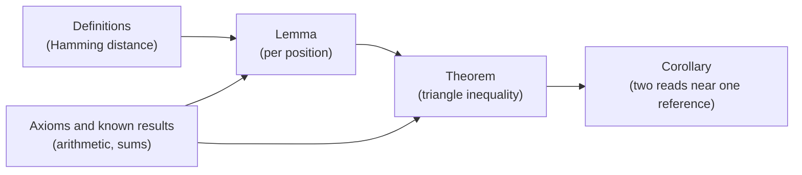

---
aliases:
  - Proof
  - Theorem
  - Lemma
  - Corollary
  - Axiom
  - Démonstration
tags:
  - type/concept
  - domain/mathematics
  - domain/computer-science
  - level/L1
  - level/L2
mastery: 0
prerequisites:
  - "[[Propositional Logic]]"
  - "[[Predicate Logic]]"
related:
  - "[[Proof Techniques]]"
  - "[[Mathematical Induction]]"
  - "[[Loop Invariant]]"
  - "[[Recursion]]"
  - "[[Function]]"
projects: []
sources:
  - "[[Mathematics for Computer Science (Lehman)]]"
  - "[[MIT 6.042J - Mathematics for Computer Science]]"
  - "[[Introduction to Algorithms (Cormen)]]"
---

# Mathematical Proof

> [!abstract]
> A proof is a chain of justified steps that makes a statement true for every case at once, which no number of tests can do; reading one means checking that each line follows from definitions, hypotheses and earlier results.

## Definition

A **proposition** is a statement that is either true or false. A **mathematical proof** of a proposition is a chain of logical deductions leading to the proposition from a base set of axioms.[^lehman][^mcs] Around proofs, mathematics uses a fixed vocabulary:[^lehman]

- an **axiom** is a proposition accepted as true without proof;
- a **theorem** is an important proposition that has been proved;
- a **lemma** is a preliminary proposition, proved to help prove later ones;
- a **corollary** is a proposition that follows from a theorem in a few logical steps;
- a **definition** gives a precise meaning to a term; it is a convention, neither true nor false, and is never proved;
- a **conjecture** is a proposition proposed as true but not yet proved.

## Why it matters

- **Algorithms come with theorems.** Textbooks state that an algorithm is correct, or runs in a given time, as a theorem with a proof, typically through a loop invariant or an induction ([[Loop Invariant]], [[Recursion]], [[Dynamic Programming]]).[^clrs] Reading [[Algorithms]] and [[Phylogenetics]] material means reading such proofs.
- **Tests are finite, proofs are not.** A test suite checks some inputs; a proof covers all of them. A property that holds on the first 40 cases can still fail on the 41st (Core).
- **Definitions decide what is computed.** Two tools that define an [[Open Reading Frame]] differently (with or without a start codon, with a minimum length) return different answers, and neither is "wrong": the definition must be stated before anything is proved or compared ([[Predicate Logic]]).
- **Models have consequences.** "Chargaff's parity rule is a theorem of the double-helix model" ([[DNA#Mathematical representation]]) is the kind of sentence a proof makes precise: which hypotheses imply which conclusion.

## Core (L1)

### Anatomy of a theory



The worked example below builds exactly this chain. A theorem is usually written **if $P$ then $Q$**, possibly with quantifiers: $P$ is the **hypothesis**, $Q$ the **conclusion**. The **converse** "if $Q$ then $P$" is a different statement; the **contrapositive** "if not $Q$ then not $P$" is equivalent to the original ([[Propositional Logic]]).

### Reading a proof line by line

Every line of a proof must be one of: a hypothesis, a definition unfolded, an axiom or previously proved result, or the consequence of earlier lines by a rule of logic.[^lehman] Reading a proof means labelling each line with its justification.

**Theorem.** The sum of two even integers is even.

| Line | Statement | Justification |
|---|---|---|
| 1 | Let $m$ and $n$ be even integers. | hypothesis |
| 2 | $m = 2a$ and $n = 2b$ for some integers $a, b$. | definition of even (line 1) |
| 3 | $m + n = 2a + 2b = 2(a + b)$. | substitution (line 2), distributivity |
| 4 | $a + b$ is an integer. | integers are closed under addition |
| 5 | $m + n$ is even. | definition of even (lines 3, 4) ∎ |

The symbol ∎ (or "QED") marks the end. Two checks catch most errors: each line has a justification, and every hypothesis is used somewhere.

### Examples are not proofs

Consider the conjecture "$n^2 + n + 41$ is prime for every natural number $n$". It holds for $n = 0, 1, \dots, 39$, then fails: $40^2 + 40 + 41 = 1681 = 41^2$ (computed below). Forty confirming cases prove nothing about the 41st. Conversely, **one counterexample disproves a universal statement**.

## Deeper (L2)

**How to read a proof.** Before the lines, read the statement and try it on small cases; identify the strategy, often announced in the first sentence (direct, contrapositive, contradiction, cases: [[Proof Techniques]]; induction: [[Mathematical Induction]]); then check the lines. If a hypothesis is never used, either it is unnecessary or the proof has a gap. Check edge cases the prose may skip: the empty sequence, $n = 0$, equal elements.

**Conventional phrases.**

| Phrase | Meaning |
|---|---|
| "without loss of generality" | the other cases are symmetric, by a stated relabelling |
| "it suffices to show $R$" | $R$ implies the goal; the rest of the proof establishes $R$ |
| "iff" | two proofs: $P \to Q$ and $Q \to P$ |
| "suppose for contradiction" | proof by contradiction follows |
| "fix an arbitrary $x$" | a universal statement is proved for a generic element |

**Proofs about programs.** A program's **specification** is a precondition on inputs and a postcondition on outputs. Correctness is a theorem: for every input satisfying the precondition, the program terminates with an output satisfying the postcondition. Partial correctness is usually proved with a loop invariant or by induction on recursive calls, termination by a separate argument ([[Loop Invariant]], [[Recursion]]).[^clrs]

**Writing proofs.** Lehman's guidelines include stating the game plan at the start, keeping a linear flow, structuring long proofs into lemmas, and being wary of "obvious" steps.[^lehman-good]

## Mathematical representation

- A proof of $\varphi$ from hypotheses $H$ is a finite sequence $S_1, \dots, S_m = \varphi$ in which each $S_j$ is an axiom, a hypothesis in $H$, a proved theorem, or follows from earlier $S_i$ by an inference rule.[^lehman]
- Common inference rules:[^lehman]

$$\frac{P \qquad P \to Q}{Q}\ (\text{modus ponens}) \qquad \frac{P \to Q \qquad Q \to R}{P \to R} \qquad \frac{\neg Q \to \neg P}{P \to Q}$$

  (premises above the line, conclusion below).
- **Quantifiers** ([[Predicate Logic]]): to prove $\forall x \in S,\ P(x)$, prove $P(x)$ for an arbitrary $x \in S$; to prove $\exists x \in S,\ P(x)$, exhibit a witness; to refute $\forall x,\ P(x)$, exhibit one $x$ with $\neg P(x)$.
- **Finite domains.** If $S$ is finite, checking $P(x)$ for every $x \in S$ is a valid proof of $\forall x \in S,\ P(x)$ (proof by exhaustion), but says nothing about a larger domain.

## Computational representation

A computer cannot replace a proof of a statement about infinitely many cases, but it does two useful things: search for counterexamples, and prove statements about finite domains by exhaustion.

```python
from itertools import product


def is_prime(n: int) -> bool:
    if n < 2:
        return False
    d = 2
    while d * d <= n:
        if n % d == 0:
            return False
        d += 1
    return True


# Conjecture: n^2 + n + 41 is prime for every natural number n.
print(all(is_prime(n * n + n + 41) for n in range(40)))
counterexample = next(n for n in range(1000) if not is_prime(n * n + n + 41))
print(counterexample, counterexample**2 + counterexample + 41, 41 * 41)


def hamming(u: str, v: str) -> int:
    return sum(a != b for a, b in zip(u, v))


# Theorem restricted to a finite domain: checking every case IS a proof there.
words = ["".join(p) for p in product("ACGT", repeat=3)]
print(len(words) ** 3,
      all(hamming(u, w) <= hamming(u, v) + hamming(v, w)
          for u in words for v in words for w in words))
```

```text
True
40 1681 1681
262144 True
```

The last line proves the triangle inequality for all $262{,}144$ triples of DNA words of length 3, and only for them; the worked example proves it for every length.

## Worked example

> [!example] The triangle inequality for Hamming distance, line by line
> **Definition.** For words $u, v$ of the same length $n$, the Hamming distance is $d(u, v) = \sum_{i=1}^{n} \mathbb{1}[u_i \ne v_i]$, the number of mismatched positions ([[Summation Notation]]).
>
> **Lemma.** For letters $x, y, z$: $\mathbb{1}[x \ne z] \le \mathbb{1}[x \ne y] + \mathbb{1}[y \ne z]$.
> *Proof.* If $x = z$ the left side is 0 and the inequality holds. If $x \ne z$, then $x = y$ and $y = z$ cannot both hold (they would give $x = z$), so the right side is at least 1. ∎
>
> **Theorem.** For words $u, v, w$ of length $n$: $d(u, w) \le d(u, v) + d(v, w)$.
>
> | Line | Statement | Justification |
> |---|---|---|
> | 1 | $d(u, w) = \sum_i \mathbb{1}[u_i \ne w_i]$ | definition |
> | 2 | $\mathbb{1}[u_i \ne w_i] \le \mathbb{1}[u_i \ne v_i] + \mathbb{1}[v_i \ne w_i]$ for each $i$ | lemma with $x, y, z = u_i, v_i, w_i$ |
> | 3 | $\sum_i \mathbb{1}[u_i \ne w_i] \le \sum_i \mathbb{1}[u_i \ne v_i] + \sum_i \mathbb{1}[v_i \ne w_i]$ | add line 2 over $i$; split the sum |
> | 4 | $d(u, w) \le d(u, v) + d(v, w)$ | definition, lines 1 and 3 ∎ |
>
> **Corollary.** Two reads that each differ from the same reference window by at most 2 mismatches differ from each other by at most 4. *Proof:* the theorem with $u, w$ the reads and $v$ the reference window. ∎
>
> The lemma isolates the only case analysis; the theorem is then pure bookkeeping; the corollary is the biological use.

## Common misconceptions

> [!warning] "It worked on a thousand examples, so it is proved"
> $n^2 + n + 41$ is prime for 40 consecutive values and then fails. Tests and simulations give evidence and find counterexamples; only a proof covers all cases, unless the domain is finite and every case was checked.

> [!warning] "A definition can be proved, or be false"
> Definitions are conventions. A definition can be useless, ambiguous or different from another tool's, but it is not true or false; theorems are what follow from it.

> [!warning] "Proving the converse is enough"
> "Every reverse palindrome has even length" is a theorem ([[DNA#Mathematical representation]]); its converse "every even-length word is a reverse palindrome" is false (`AA`). Only the contrapositive is equivalent.

> [!warning] "A lemma is a less certain result"
> A lemma is proved as rigorously as a theorem; the names describe a role in the exposition, not a level of truth.

## Exercises

> [!question] Exercise 1 (L1)
> Classify each statement as definition, theorem, lemma or corollary in a text on DNA words: (a) "A reverse palindrome is a word equal to its reverse complement." (b) "$\mathrm{rc}(\mathrm{rc}(s)) = s$ for every word $s$", stated in order to prove (c). (c) "rc is a bijection of $\Sigma^n$." (d) "Hence rc has an inverse, namely rc itself."

> [!success]- Solution
> (a) Definition: it names a concept. (b) Lemma: an auxiliary result used for (c). (c) Theorem. (d) Corollary: it follows from (b) and (c) in one step ([[Function#Mathematical representation]]).

> [!question] Exercise 2 (L1)
> For "if a word is a reverse palindrome, then its length is even", give the hypothesis, the conclusion, the converse and the contrapositive. Which of the four statements are true?

> [!success]- Solution
> Hypothesis: the word is a reverse palindrome; conclusion: its length is even. Converse: "if a word has even length, it is a reverse palindrome", false (`AA`). Contrapositive: "if a word has odd length, it is not a reverse palindrome", true, being equivalent to the theorem. The statement and its contrapositive are true; the converse is false.

> [!question] Exercise 3 (L2)
> Find the error: "Claim: the GC content of a concatenation $uv$ is the mean of the GC contents of $u$ and $v$. Proof: the G and C of $uv$ are those of $u$ plus those of $v$, so $\mathrm{GC}(uv) = (\mathrm{GC}(u) + \mathrm{GC}(v))/2$." Give a counterexample and the correct statement.

> [!success]- Solution
> The first sentence is right for **counts**, but GC content divides by the length, and $u$, $v$ have different lengths. Counterexample: $u$ = `G`, $v$ = `AA`: $\mathrm{GC}(uv) = 1/3$, the mean is $0.5$. Correct statement: $\mathrm{GC}(uv) = \frac{|u|\,\mathrm{GC}(u) + |v|\,\mathrm{GC}(v)}{|u| + |v|}$, a mean weighted by length, which equals the plain mean when $|u| = |v|$ or $\mathrm{GC}(u) = \mathrm{GC}(v)$.

> [!question] Exercise 4 (L2, Python)
> Check by exhaustion that $d(\mathrm{rc}(u), \mathrm{rc}(v)) = d(u, v)$ for all pairs of DNA words of length 4, then prove it for every length.

> [!success]- Solution
> ```python
> COMP = str.maketrans("ACGT", "TGCA")
>
>
> def rc(s):
>     return s.translate(COMP)[::-1]
>
>
> w4 = ["".join(p) for p in product("ACGT", repeat=4)]
> print(len(w4) ** 2, all(hamming(rc(a), rc(b)) == hamming(a, b) for a in w4 for b in w4))
> ```
> Output: `65536 True`, a proof for length 4 only. General proof: $\mathrm{rc}(u)_i = c(u_{n+1-i})$, and the complement $c$ is injective, so $c(x) \ne c(y)$ iff $x \ne y$. Hence $d(\mathrm{rc}(u), \mathrm{rc}(v)) = \sum_i \mathbb{1}[u_{n+1-i} \ne v_{n+1-i}]$, which is $d(u, v)$ with the terms in reverse order (a bijective change of index, [[Summation Notation#Mathematical representation]]). ∎

## Mastery checklist

- [ ] 1 Recognized: I can tell a definition, axiom, theorem, lemma, corollary and conjecture apart.
- [ ] 2 Understood: I can explain why examples do not prove a universal statement and why one counterexample refutes it.
- [ ] 3 Practiced: I can justify every line of a short proof and spot an unjustified step.
- [ ] 4 Applied: I read the correctness proof of an algorithm I implemented and matched each step to the code.
- [ ] 5 Explained: I can teach the difference between testing and proving, and when exhaustive checking is a proof.

## References

[^lehman]: [[Mathematics for Computer Science (Lehman)]], 2017 revision, ch. 1 "What is a Proof?" (propositions, the axiomatic method, logical deductions).
[^mcs]: [[MIT 6.042J - Mathematics for Computer Science]], fundamental-concepts third of the course (definitions and proofs).
[^lehman-good]: [[Mathematics for Computer Science (Lehman)]], 2017 revision, section 1.9 "Good Proofs in Practice".
[^clrs]: [[Introduction to Algorithms (Cormen)]], 4th ed. (correctness proofs of algorithms with loop invariants and induction).
