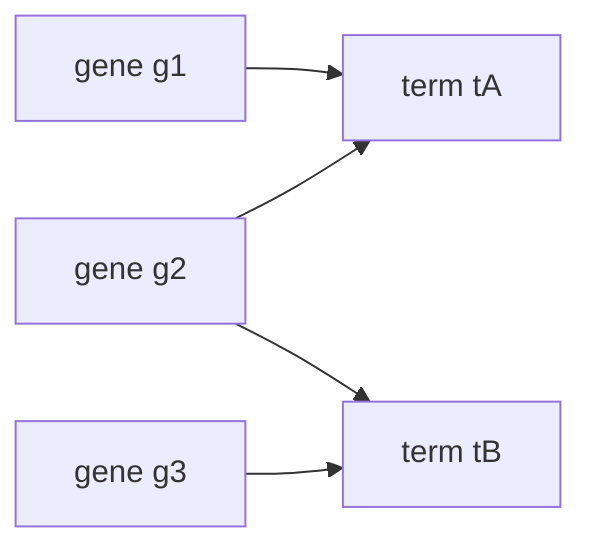

---
aliases:
  - First-Order Logic
  - Quantifier
  - Quantifiers
  - Predicate Calculus
  - Logique des prédicats
tags:
  - type/concept
  - domain/mathematics
  - domain/computer-science
  - level/L1
  - level/L2
mastery: 0
prerequisites:
  - "[[Propositional Logic]]"
related:
  - "[[Set]]"
  - "[[Proof Techniques]]"
  - "[[Open Reading Frame]]"
  - "[[K-mer]]"
  - "[[Big O Notation]]"
projects:
  - "[[02-sequence-translation]]"
sources:
  - "[[Mathematics for Computer Science (Lehman)]]"
  - "[[MIT 6.042J - Mathematics for Computer Science]]"
  - "[[Rosalind]]"
  - "[[GA4GH hts-specs]]"
  - "[[Biology 2e (OpenStax)]]"
  - "[[Calculus (OpenStax)]]"
---

# Predicate Logic

> [!abstract]
> Predicate logic adds variables and the quantifiers "for all" ($\forall$) and "there exists" ($\exists$) to propositional logic, so that one statement can speak about every codon, every read or every gene: it is the language of precise definitions, and of their negations.

## Definition

A **predicate** $P(x)$ is a statement whose truth depends on a variable $x$ ranging over a **domain** $D$; fixing $x$ turns it into a proposition.[^lehman] The **universal** statement $\forall x \in D,\ P(x)$ is true when $P(x)$ holds for every $x$ in $D$; the **existential** statement $\exists x \in D,\ P(x)$ is true when $P(x)$ holds for at least one $x$ in $D$.[^lehman][^mcs] Predicate logic combines predicates, quantifiers and the connectives of [[Propositional Logic]].

## Why it matters

- **Definitions are quantified statements.** An [[Open Reading Frame]] runs from a start codon to the first in-frame stop codon, with no stop in between:[^rosalind] "no stop in between" is a $\forall$ over the intermediate codons. Reading a definition means finding its quantifiers.
- **A negation describes the counterexample.** A segment fails to be an ORF when, among other possibilities, *there exists* an in-frame stop before its end; a program reports that stop as the **witness** ([[02-sequence-translation]]).
- **Quality flags.** The VCF `FILTER` value `PASS` asserts that a site passed all filters; any other value lists the filters that failed, the witnesses of the negation.[^vcf]
- **Code and proofs.** Python's `all()` and `any()` are $\forall$ and $\exists$ over a finite domain; "for every input, the output is sorted" is the statement a correctness proof must establish ([[Proof Techniques]]).

## Core (L1)

### Reading quantifiers

- **The domain is part of the statement.** "Every codon specifies an amino acid" is false over the 64 codons, three of which are stop codons, and true over the 61 sense codons.[^os15]
- **Bounded quantifiers** abbreviate: $\forall x \in D,\ P(x)$ means $\forall x\,(x \in D \to P(x))$, while $\exists x \in D,\ P(x)$ means $\exists x\,(x \in D \land P(x))$. The connective differs: $\to$ under $\forall$, $\land$ under $\exists$.
- **Finite domains.** For $D = \{d_1, \dots, d_n\}$, $\forall$ is a big AND and $\exists$ a big OR:
$$\forall x \in D,\ P(x) \equiv P(d_1) \land \dots \land P(d_n), \qquad \exists x \in D,\ P(x) \equiv P(d_1) \lor \dots \lor P(d_n).$$

### Negating quantified statements

$$\neg\,\forall x \in D,\ P(x) \;\equiv\; \exists x \in D,\ \neg P(x), \qquad \neg\,\exists x \in D,\ P(x) \;\equiv\; \forall x \in D,\ \neg P(x).$$

On a finite domain this is De Morgan's law applied to the big AND and the big OR; in general it is the definition read backwards: "$P$ holds everywhere" is false exactly when some $x$ fails $P$. **Recipe**: move $\neg$ inward, flip every quantifier it crosses ($\forall \leftrightarrow \exists$), keep the domains, finish with the propositional rules.

| Statement | Negation |
|---|---|
| every read is mapped | **some** read is unmapped (not "no read is mapped") |
| some sample has zero coverage | every sample has non-zero coverage |
| every exon is shorter than 10 kb | some exon is at least 10 kb long |

### Bio: the definition of an ORF

Fix a frame with codons $c_0, c_1, \dots$, start codons $S$ and stop codons $T$ ([[Open Reading Frame#Mathematical representation]]). The pair $(a, b)$ is an ORF iff
$$c_a \in S \;\land\; c_b \in T \;\land\; \forall k\,\big(a \le k < b \to c_k \notin T\big).$$
With the recipe, its negation is
$$c_a \notin S \;\lor\; c_b \notin T \;\lor\; \exists k\,\big(a \le k < b \land c_k \in T\big).$$
The implication under $\forall$ became an AND under $\exists$, as the bounded-quantifier rule predicts. In `ATG AAA TAG CCC TGA` (invented), $(0, 4)$ is not an ORF, with witness $k = 2$ (`TAG`); $(0, 2)$ is one.

## Deeper (L2)

### Nested quantifiers: order matters

Let $\mathrm{Ann}(g, t)$ mean "gene $g$ is annotated with term $t$". In the invented annotation below, every gene has a term, but no term annotates every gene:



- $\forall g\, \exists t\, \mathrm{Ann}(g, t)$, "every gene has at least one term", is true: $t$ may depend on $g$.
- $\exists t\, \forall g\, \mathrm{Ann}(g, t)$, "one term annotates every gene", is false.

$\exists t\, \forall g$ implies $\forall g\, \exists t$ (the same $t$ serves every $g$), but not conversely. Negation flips each quantifier: $\neg\,\forall g\, \exists t\, \mathrm{Ann}(g, t) \equiv \exists g\, \forall t\, \neg\mathrm{Ann}(g, t)$, "some gene has no annotation at all".

### Uniqueness and vacuous truth

- **Exactly one**: $\exists!\, x\, P(x) \equiv \exists x\,\big(P(x) \land \forall y\,(P(y) \to y = x)\big)$. A k-mer is unique in a sequence when exactly one position starts an occurrence of it ([[K-mer]], Exercise 3).
- **Empty domains**: $\forall x \in \varnothing,\ P(x)$ is true and $\exists x \in \varnothing,\ P(x)$ is false, whatever $P$. A check such as "all reads supporting the variant have MAPQ ≥ 30" passes when *no* read supports it; a meaningful check adds "and at least one read supports it".

### Alternating quantifiers

Later courses define their central notions with alternating quantifiers. $\lim_{x \to a} f(x) = L$ means $\forall \varepsilon > 0\ \exists \delta > 0\ \forall x\ \big(0 < |x - a| < \delta \to |f(x) - L| < \varepsilon\big)$ ([[Limit]]).[^calc] A running time $f$ is $O(g)$ when $\exists c > 0\ \exists n_0\ \forall n \ge n_0,\ f(n) \le c\, g(n)$ ([[Big O Notation]]).[^lehman-o] The recipe negates them mechanically: $f$ is not $O(g)$ iff $\forall c > 0\ \forall n_0\ \exists n \ge n_0,\ f(n) > c\, g(n)$.

## Mathematical representation

- **Syntax.** From predicates $P(x_1, \dots, x_k)$, connectives and quantifiers $\forall x\, \varphi$, $\exists x\, \varphi$. An occurrence of $x$ is **bound** inside a quantifier on $x$ and **free** otherwise; a formula without free variables is a proposition once the domain and the predicates are fixed. Renaming a bound variable changes nothing: $\forall x\, P(x) \equiv \forall y\, P(y)$.
- **Valid laws.** $\forall x\,(P \land Q) \equiv \forall x\, P \land \forall x\, Q$; $\exists x\,(P \lor Q) \equiv \exists x\, P \lor \exists x\, Q$; $\exists y\, \forall x\, R(x, y) \to \forall x\, \exists y\, R(x, y)$.
- **Invalid ones**, with counterexamples on the 64 codons:[^os15] $\forall x\,(P \lor Q) \not\equiv \forall x\, P \lor \forall x\, Q$, since every codon is a sense codon or a stop codon, but neither are all codons sense codons nor are all stops; $\exists x\,(P \land Q) \not\equiv \exists x\, P \land \exists x\, Q$, since `ATG` is a start codon and `TAA` a stop codon, but no codon is both.

## Computational representation

`all()` and `any()` over generators evaluate $\forall$ and $\exists$ lazily: `all` stops at the first counterexample, `any` at the first witness.

```python
STOPS = {"TAA", "TAG", "TGA"}

def codons(seq: str, frame: int = 0) -> list[str]:
    return [seq[i:i + 3] for i in range(frame, len(seq) - 2, 3)]

def is_orf(c: list[str], a: int, b: int) -> bool:
    """c[a] is ATG, c[b] is a stop, and for all k with a <= k < b, c[k] is not a stop."""
    return c[a] == "ATG" and c[b] in STOPS and all(c[k] not in STOPS for k in range(a, b))

def witness(c: list[str], a: int, b: int):
    """Some k with a <= k < b and c[k] a stop (a counterexample to the 'for all'), else None."""
    return next((k for k in range(a, b) if c[k] in STOPS), None)

c = codons("ATGAAATAGCCCTGA")          # invented: ATG AAA TAG CCC TGA
print(c)
print(is_orf(c, 0, 4), witness(c, 0, 4))
print(is_orf(c, 0, 2), witness(c, 0, 2))
print(all([]), any([]))                # empty domain: "for all" is True, "exists" is False

# Invented annotations: gene -> set of terms
ann = {"g1": {"tA"}, "g2": {"tA", "tB"}, "g3": {"tB"}}
terms = {"tA", "tB"}
print(all(any(t in ann[g] for t in terms) for g in ann),    # for all g, exists t
      any(all(t in ann[g] for g in ann) for t in terms))    # exists t, for all g
```

```text
['ATG', 'AAA', 'TAG', 'CCC', 'TGA']
False 2
True None
True False
True False
```

## Worked example

> [!example] Formalizing and negating a coverage requirement
> Requirement: "in every sample, some read covers the variant with base quality at least 20".
> 1. **Domains and predicates.** Samples $s \in \mathcal{S}$; reads $r \in R_s$ of sample $s$; $C(r)$: "$r$ covers the variant"; $q(r)$: the base quality of $r$ at the variant.
> 2. **Formalize.** $\forall s \in \mathcal{S}\ \exists r \in R_s\ \big(C(r) \land q(r) \ge 20\big)$.
> 3. **Negate, flipping each quantifier.** $\exists s \in \mathcal{S}\ \forall r \in R_s\ \neg\big(C(r) \land q(r) \ge 20\big)$.
> 4. **Finish with De Morgan.** $\exists s\ \forall r \in R_s\ \big(\neg C(r) \lor q(r) < 20\big)$: some sample in which every read misses the variant or has base quality below 20, including a sample with no reads at all (vacuous $\forall$). In code, `all(any(...) for s in samples)`; the samples where the inner `any` is false are the witnesses.

## Common misconceptions

> [!warning] "The negation of 'all reads are mapped' is 'no read is mapped'"
> It is "**some** read is unmapped". "No read is mapped", $\forall r\, \neg M(r)$, is far stronger and usually false when the original statement is false.

> [!warning] "The order of quantifiers is a matter of style"
> $\forall g\, \exists t$ (each gene has its own term) and $\exists t\, \forall g$ (one term for all genes) are different claims; only the second implies the first.

> [!warning] "$\exists x \in D,\ P(x)$ is $\exists x\,(x \in D \to P(x))$"
> With an implication, any $x$ outside $D$ makes the formula true. Under $\exists$ the bound is joined with AND, under $\forall$ with IMPLIES.

## Exercises

> [!question] Exercise 1 (L1)
> Write with quantifiers, then negate: (a) "every codon before the final one is a sense codon", for a coding sequence with codons $c_0, \dots, c_{m-1}$; (b) "some read in the file has MAPQ 0".

> [!success]- Solution
> (a) $\forall k\,(0 \le k < m - 1 \to c_k \notin T)$; negation $\exists k\,(0 \le k < m - 1 \land c_k \in T)$: there is a premature stop codon. (b) $\exists r \in R,\ \mathrm{MAPQ}(r) = 0$; negation $\forall r \in R,\ \mathrm{MAPQ}(r) \ne 0$.

> [!question] Exercise 2 (L1)
> Over the 64 codons of the standard code, with stop codons TAA, TAG and TGA, true or false? (a) $\forall c\,(c \in T \to c \text{ starts with T})$; (b) $\forall c\,(c \text{ starts with T} \to c \in T)$; (c) $\exists c\,(c = \mathtt{ATG} \land c \in T)$.

> [!success]- Solution
> (a) True: all three stops start with T.[^os15] (b) False, witness `TTT` (phenylalanine). (c) False. Statements (a) and (b) are converses of each other: one true, one false.

> [!question] Exercise 3 (L2)
> Write "the k-mer $w$ occurs exactly once in $s$" with quantifiers over start positions, then negate it.

> [!success]- Solution
> With $O(i)$: "$s[i..i+k-1] = w$": $\exists i\,\big(O(i) \land \forall j\,(O(j) \to j = i)\big)$. Negation: $\forall i\,\big(\neg O(i) \lor \exists j\,(O(j) \land j \ne i)\big)$: every position either does not start $w$ or another position also does, that is, $w$ is absent or occurs at least twice.

> [!question] Exercise 4 (L2, Python)
> Write `unique_kmers(seq, k)` returning the k-mers that occur exactly once, and run it on the invented sequence `ACGTACGTTACG` for $k = 3$ and $k = 4$.

> [!success]- Solution
> ```python
> from collections import Counter
>
> def unique_kmers(seq: str, k: int) -> list[str]:
>     """k-mers w such that exactly one position starts an occurrence of w."""
>     counts = Counter(seq[i:i + k] for i in range(len(seq) - k + 1))
>     return sorted(w for w, n in counts.items() if n == 1)
>
> s = "ACGTACGTTACG"
> print(unique_kmers(s, 3))
> print(unique_kmers(s, 4))
> ```
> Output: `['GTA', 'GTT', 'TTA']`, then `['CGTA', 'CGTT', 'GTAC', 'GTTA', 'TTAC']`. Counting replaces the nested quantifier: "exactly one" is "count equal to 1". Longer words are unique more often, which is why uniqueness is a property of $k$ as much as of the sequence ([[K-mer]]).

## Mastery checklist

- [ ] 1 Recognized: I can read $\forall$ and $\exists$ and identify the domain of a quantified statement.
- [ ] 2 Understood: I can explain why negation flips quantifiers, why their order matters and why a statement about an empty set is true.
- [ ] 3 Practiced: I formalize and negate definitions (ORF, uniqueness, limits) correctly and implement them with `all` and `any`.
- [ ] 4 Applied: in [[02-sequence-translation]], my ORF finder follows the quantified definition and reports witnesses when a candidate fails.
- [ ] 5 Explained: I can teach the recipe for negation, the bounded-quantifier connectives and the pitfalls of vacuous truth in quality checks.

## References

[^lehman]: [[Mathematics for Computer Science (Lehman)]], 2017 revision, Part I "Proofs", chapter "What is a Proof?" (propositions, predicates).
[^mcs]: [[MIT 6.042J - Mathematics for Computer Science]], fundamental-concepts third of the course (definitions, proofs and their logical language).
[^rosalind]: [[Rosalind]], problem "Open Reading Frames" (ORF): definition of an ORF as start codon to stop codon without intervening stop.
[^vcf]: [[GA4GH hts-specs]], VCF specification (v4.x), definition of the `FILTER` column: `PASS` if the site passed all filters, otherwise the codes of the filters that failed.
[^os15]: [[Biology 2e (OpenStax)]], ch. 15 "Genes and Proteins" (the genetic code: 64 codons, start codon AUG, stop codons UAA, UAG, UGA).
[^calc]: [[Calculus (OpenStax)]], Volume 1 (limits).
[^lehman-o]: [[Mathematics for Computer Science (Lehman)]], 2017 revision (asymptotic notation).
