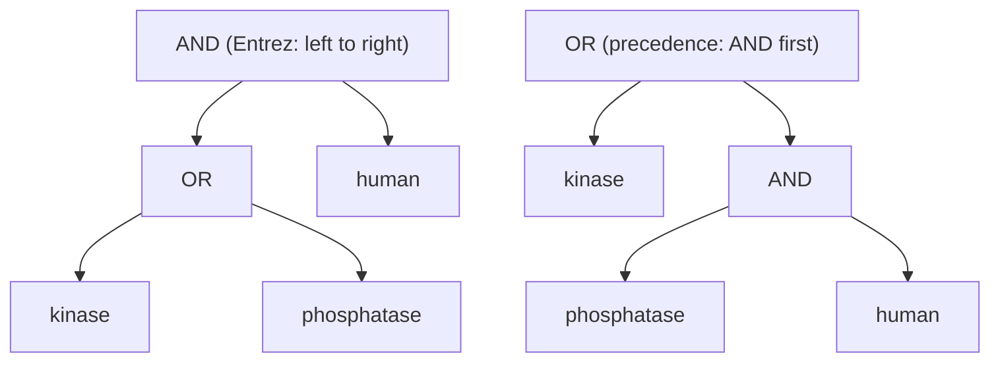

---
aliases:
  - Propositional Calculus
  - Sentential Logic
  - Truth Table
  - Logique propositionnelle
tags:
  - type/concept
  - domain/mathematics
  - domain/computer-science
  - level/L1
  - level/L2
  - level/L3
mastery: 0
prerequisites: []
related:
  - "[[Predicate Logic]]"
  - "[[Set]]"
  - "[[Boolean Algebra]]"
  - "[[Mathematical Proof]]"
  - "[[Proof Techniques]]"
  - "[[Variant Filtering]]"
  - "[[Programmatic Database Access]]"
  - "[[Boolean Network]]"
projects:
  - "[[10-genomic-pipeline]]"
sources:
  - "[[Mathematics for Computer Science (Lehman)]]"
  - "[[MIT 6.042J - Mathematics for Computer Science]]"
  - "[[NCBI Bookshelf]]"
  - "[[GA4GH hts-specs]]"
---

# Propositional Logic

> [!abstract]
> Propositional logic computes the truth of compound statements built with *not*, *and*, *or*, *implies* and *if and only if* from the truth of their parts: it is the grammar of every database query, every filter, every `if` statement and every proof.

## Definition

A **proposition** is a statement that is either true or false. Propositional logic builds compound propositions from atomic ones with **connectives**, NOT ($\neg$), AND ($\land$), OR ($\lor$), IMPLIES ($\to$) and IFF ($\leftrightarrow$, "if and only if"), and fixes the truth value of a compound from the truth values of its parts by a **truth table**.[^lehman][^mcs] Two formulas are **equivalent** ($\equiv$) when they take the same truth value under every assignment of truth values to their atoms.

## Why it matters

- **Database queries.** Entrez, NCBI's search system (PubMed, Nucleotide, Protein and the other databases), combines search terms with the operators `AND`, `OR` and `NOT`, written in uppercase.[^entrez] A query is a formula; its result is the set of records that make it true ([[Set]], [[Programmatic Database Access]]).
- **Variant filters.** A hard filter is a formula over per-variant values such as call quality and read depth; the discarded variants are exactly those satisfying its negation ([[Variant Filtering]], [[10-genomic-pipeline]]). The VCF `FILTER` column holds `PASS` when a site passed all filters, otherwise the codes of the filters it failed.[^vcf]
- **Code.** Every `if` condition is a formula. Negating one wrongly (`not (a and b)` rewritten as `not a and not b`) is a classic silent bug.
- **Proofs.** Implication, contrapositive and equivalence are the moves of every argument ([[Mathematical Proof]], [[Proof Techniques]]).

## Core (L1)

### Connectives and truth tables

| $p$ | $q$ | $\neg p$ | $p \land q$ | $p \lor q$ | $p \to q$ | $p \leftrightarrow q$ |
|:-:|:-:|:-:|:-:|:-:|:-:|:-:|
| T | T | F | T | T | T | T |
| T | F | F | F | T | F | F |
| F | T | T | F | T | T | F |
| F | F | T | F | F | T | T |

- **OR is inclusive**: $p \lor q$ is true when both are. "Exactly one" is the exclusive or, $p \oplus q \equiv \neg(p \leftrightarrow q)$.
- **IMPLIES is false in one row only**, $p$ true and $q$ false. When $p$ is false, $p \to q$ is true whatever $q$ is (**vacuously true**). $p \to q$ reads "if $p$ then $q$", "$p$ only if $q$", "$p$ is sufficient for $q$", "$q$ is necessary for $p$".

### Equivalences to know by heart

| Law | Equivalence |
|---|---|
| Double negation | $\neg\neg p \equiv p$ |
| De Morgan | $\neg(p \land q) \equiv \neg p \lor \neg q$ and $\neg(p \lor q) \equiv \neg p \land \neg q$ |
| Implication as OR | $p \to q \equiv \neg p \lor q$ |
| Negated implication | $\neg(p \to q) \equiv p \land \neg q$ |
| Contrapositive | $p \to q \equiv \neg q \to \neg p$ |
| Biconditional | $p \leftrightarrow q \equiv (p \to q) \land (q \to p)$ |
| Distributivity | $p \land (q \lor r) \equiv (p \land q) \lor (p \land r)$, and with $\land$ and $\lor$ swapped |

The **converse** $q \to p$ is *not* equivalent to $p \to q$: they differ in the row $p$ = F, $q$ = T.

**Proof of De Morgan's first law.** $\neg(p \land q)$ is false exactly when $p \land q$ is true, that is only in the row $p = q =$ T. $\neg p \lor \neg q$ is false exactly when $\neg p$ and $\neg q$ are both false, again only in the row $p = q =$ T. Two formulas that are false in exactly the same rows agree in every row. $\square$ The second law follows by applying the first to $\neg p$ and $\neg q$ and negating both sides.

**Negating a statement correctly.** Push $\neg$ inward: AND becomes OR, OR becomes AND, an implication becomes "premise and not conclusion".

| Statement | Correct negation |
|---|---|
| the read is mapped **and** its MAPQ is ≥ 30 | the read is unmapped **or** its MAPQ is < 30 |
| the gene is up-regulated **or** down-regulated | the gene is neither up- nor down-regulated |
| **if** the site is in an exon, **then** it is covered | the site is in an exon **and** it is not covered |

### Bio: Boolean queries in Entrez

In Entrez, `A AND B` returns the records matching both terms (intersection), `A OR B` those matching at least one (union), and `A NOT B` those matching A but not B ($A \land \neg B$, a difference). Without parentheses, Entrez processes the operators **from left to right**; parentheses change the order.[^entrez] Python, like the usual convention of logic, instead binds NOT tighter than AND and AND tighter than OR. The same query then has two readings:



`kinase OR phosphatase AND human` is $(k \lor p) \land h$ for Entrez but $k \lor (p \land h)$ under precedence, which also returns non-human kinase records. Write the parentheses yourself and the query means the same thing to every reader and every engine.

### Bio: a variant filter and its negation

A hard filter (thresholds invented) keeps a variant when $(Q \ge 30) \land (D \ge 10) \land \neg L$, with $Q$ the call quality, $D$ the read depth and $L$ "lies in a low-complexity region". By De Morgan, the discarded variants satisfy $(Q < 30) \lor (D < 10) \lor L$: one failed condition is enough. The `FILTER` column follows the same logic: `PASS` when every filter passed, otherwise the list of the filters that failed.[^vcf]

## Deeper (L2)

- **Normal forms.** Every formula is equivalent to a **disjunctive normal form**, an OR of ANDs: one AND-term per true row of its truth table. Dually, a **conjunctive normal form** (an AND of ORs) has one clause per false row. Hence $\{\neg, \land, \lor\}$ expresses every truth table, and [[Boolean Algebra]] simplifies such forms with algebraic laws.
- **Tautologies and counting.** A formula is a tautology if true in every row, satisfiable if true in at least one, a contradiction if true in none; $\varphi \equiv \psi$ exactly when $\varphi \leftrightarrow \psi$ is a tautology. $n$ atoms give $2^n$ rows and $2^{2^n}$ distinct truth tables (16 for $n = 2$): checking row by row is easy for a filter with 5 conditions, hopeless for 100.
- **Contrapositive, algebraically.** $\neg q \to \neg p \equiv \neg\neg q \lor \neg p \equiv q \lor \neg p \equiv p \to q$, which is what makes a proof by contrapositive valid ([[Proof Techniques]]).
- **Evaluation order in code.** Python's `and` and `or` evaluate left to right and stop once the result is known (short-circuit), so `dp is not None and dp >= 10` never compares a missing depth. Logically $p \land q \equiv q \land p$; operationally the left operand is a guard.

## Advanced (L3)

**Missing values break two-valued logic.** A VCF value can be missing. If every comparison with a missing depth is declared false (one possible convention, used in the code below), then $D \ge 10$ and $D < 10$ are *both* false, $\neg(D \ge 10) \equiv (D < 10)$ fails, and "keep if $Q \ge 30 \land D \ge 10$" no longer agrees with "discard if $Q < 30 \lor D < 10$": a variant of unknown depth is dropped by the first rule and kept by the second. A principled fix is a **three-valued logic**: order F < U < T (U for unknown), take AND as the minimum, OR as the maximum and $\neg U = U$, so that F ∧ U = F but T ∧ U = U. A result U forces an explicit, documented decision (unknown counts as fail, or as pass) instead of an accident of the code. De Morgan's laws survive; the excluded middle $p \lor \neg p$ does not (Exercise 5). Stage 2 reuses these connectives to model gene regulation ([[Boolean Algebra]], [[Boolean Network]]).

## Mathematical representation

- **Syntax.** Atoms $p, q, r, \dots$ are formulas; if $\varphi$ and $\psi$ are formulas, so are $\neg\varphi$, $(\varphi \land \psi)$, $(\varphi \lor \psi)$, $(\varphi \to \psi)$ and $(\varphi \leftrightarrow \psi)$.
- **Semantics.** An assignment $v$ gives each atom a value in $\{0, 1\}$ (F, T) and extends to all formulas:
$$v(\neg\varphi) = 1 - v(\varphi), \quad v(\varphi \land \psi) = \min\big(v(\varphi), v(\psi)\big), \quad v(\varphi \lor \psi) = \max\big(v(\varphi), v(\psi)\big),$$
$$v(\varphi \to \psi) = \max\big(1 - v(\varphi), v(\psi)\big), \qquad v(\varphi \leftrightarrow \psi) = 1 - |v(\varphi) - v(\psi)|.$$
- **Equivalence.** $\varphi \equiv \psi$ iff $v(\varphi) = v(\psi)$ for all $2^n$ assignments of the $n$ atoms.
- **Link with sets.** If each atom $p$ stands for the set $P$ of records where it holds, inside a universe $U$, then $\land$, $\lor$ and $\neg$ become $\cap$, $\cup$ and the complement $U \setminus P$, and "$p \to q$ for every record" means $P \subseteq Q$ ([[Set]]). This is how the result set of a Boolean query is defined.

## Computational representation

Equivalence by brute force over all $2^n$ assignments, Python's precedence and short-circuit, Entrez-style evaluation on invented record sets, and the missing-value trap:

```python
from itertools import product

def implies(p: bool, q: bool) -> bool:
    return (not p) or q

def equivalent(f, g, n: int) -> bool:
    """True if two n-ary formulas agree on all 2**n assignments."""
    return all(f(*v) == g(*v) for v in product([False, True], repeat=n))

print(equivalent(lambda p, q: not (p and q), lambda p, q: (not p) or (not q), 2),  # De Morgan
      equivalent(implies, lambda p, q: implies(not q, not p), 2),                  # contrapositive
      equivalent(implies, lambda p, q: implies(q, p), 2))                          # converse
dp = None
print(True or True and False, dp is not None and dp >= 10)  # precedence; short-circuit guard

# Invented record IDs returned by three single-term searches
hits = {"kinase": {1, 2, 3, 4}, "phosphatase": {5, 6}, "human": {2, 4, 6, 8}}
OPS = {"AND": set.intersection, "OR": set.union, "NOT": set.difference}

def left_to_right(query: str) -> set:
    """Evaluate 'term OP term OP term ...' strictly from left to right."""
    tokens = query.split()
    result = hits[tokens[0]]
    for op, term in zip(tokens[1::2], tokens[2::2]):
        result = OPS[op](result, hits[term])
    return result

print(sorted(left_to_right("kinase OR phosphatase AND human")))         # (k OR p) AND h
print(sorted(hits["kinase"] | (hits["phosphatase"] & hits["human"])))  # k OR (p AND h)

# Invented variant records: (id, QUAL, DP); None = value missing in the file
variants = [("v1", 50.0, 25), ("v2", 12.0, 40), ("v3", 80.0, 6), ("v4", 45.0, None)]

def ge(x, t):  # convention chosen here: any comparison with a missing value is False
    return x is not None and x >= t

def lt(x, t):
    return x is not None and x < t

keep = [v for v, q, d in variants if ge(q, 30) and ge(d, 10)]
not_discarded = [v for v, q, d in variants if not (lt(q, 30) or lt(d, 10))]
print(keep, not_discarded)
```

```text
True True False
True False
[2, 4, 6]
[1, 2, 3, 4, 6]
['v1'] ['v1', 'v4']
```

## Worked example

> [!example] Writing a query that means what you intend
> Goal: human records about BRCA1 or BRCA2, excluding reviews (all four words used as plain search terms).
> 1. **Formalize.** With atoms $b_1, b_2, h, r$: $(b_1 \lor b_2) \land h \land \neg r$.
> 2. **Translate.** `(BRCA1 OR BRCA2) AND human NOT review`. Left to right: the parenthesis first, then AND, then NOT, giving $((b_1 \lor b_2) \land h) \land \neg r$, as intended.
> 3. **The tempting version** `human AND BRCA1 OR BRCA2 NOT review` is read $((h \land b_1) \lor b_2) \land \neg r$: it returns BRCA2 records from every organism.
> 4. **Check the complement.** A record is excluded by the intended query iff $\neg(b_1 \lor b_2) \lor \neg h \lor r$ (De Morgan): it mentions neither gene, or is not about humans, or is a review.

## Common misconceptions

> [!warning] "The negation of 'A and B' is 'not A and not B'"
> It is "not A **or** not B". A read fails "mapped and MAPQ ≥ 30" when it fails either condition; requiring both failures lets bad reads through the opposite filter.

> [!warning] "An implication is false when its premise is false, and it is the same as its converse"
> $p \to q$ is true when $p$ is false. "Every nonsense mutation creates a stop codon" is true; its converse, "every new stop codon comes from a nonsense mutation", is false, since a [[Frameshift Mutation]] also brings stops into frame.

> [!warning] "A search engine applies the precedence of logic"
> Entrez processes Boolean operators from left to right unless parentheses say otherwise.[^entrez] Always parenthesize queries that mix AND and OR.

## Exercises

> [!question] Exercise 1 (L1)
> Build the truth table of $(p \to q) \land (q \to p)$ and show that it is equivalent to $p \leftrightarrow q$.

> [!success]- Solution
> For $(p, q)$ = TT, TF, FT, FF: $p \to q$ = T, F, T, T and $q \to p$ = T, T, F, T, so their AND is T, F, F, T, exactly the column of $p \leftrightarrow q$.

> [!question] Exercise 2 (L1)
> Negate in words and in symbols: (a) "the variant is a SNV and it lies in a coding exon"; (b) "if the gene is expressed, then its promoter is unmethylated".

> [!success]- Solution
> (a) $\neg(s \land e) \equiv \neg s \lor \neg e$: the variant is not a SNV, or it does not lie in a coding exon. (b) $\neg(x \to u) \equiv x \land \neg u$: the gene is expressed and its promoter is methylated. The negation of an implication is a conjunction, never another implication.

> [!question] Exercise 3 (L2)
> With the invented record sets kinase = {1, 2, 3, 4}, phosphatase = {5, 6}, human = {2, 4, 6, 8}, what does Entrez return for `human AND kinase OR phosphatase`? Is it "human records about kinases or phosphatases"? Fix the query.

> [!success]- Solution
> Left to right: $(h \land k) \lor p$ = {2, 4} ∪ {5, 6} = {2, 4, 5, 6}, and `left_to_right("human AND kinase OR phosphatase")` agrees. Record 5 is a non-human phosphatase record. The intended query is `human AND (kinase OR phosphatase)`, which gives {2, 4, 6}.

> [!question] Exercise 4 (L2, Python)
> Using `product`, `implies` and `equivalent` from the code above, write `is_tautology(f, n)`. Check that $(p \to q) \lor (q \to p)$ is a tautology, that $p \to (q \to r) \equiv (p \land q) \to r$, and whether $(p \to q) \to r \equiv p \to (q \to r)$.

> [!success]- Solution
> ```python
> def is_tautology(f, n: int) -> bool:
>     return all(f(*v) for v in product([False, True], repeat=n))
>
> print(is_tautology(lambda p, q: implies(p, q) or implies(q, p), 2))
> print(equivalent(lambda p, q, r: implies(p, implies(q, r)), lambda p, q, r: implies(p and q, r), 3))
> print(equivalent(lambda p, q, r: implies(implies(p, q), r), lambda p, q, r: implies(p, implies(q, r)), 3))
> ```
> Output: `True`, `True`, `False`. A chain of conditions is a conjunction of premises. Implication is not associative: with $p = q = r =$ F, $(p \to q) \to r$ is F but $p \to (q \to r)$ is T, so the parentheses matter.

> [!question] Exercise 5 (L3, Python)
> Encode F, U, T as 0, 0.5, 1 with AND = min, OR = max, NOT = $1 - x$. Check De Morgan's law on all 9 pairs of values, show that $p \lor \neg p$ is not a tautology, and re-evaluate the keep rule on `variants` from the code above.

> [!success]- Solution
> ```python
> F, U, T = 0.0, 0.5, 1.0
> vals = (F, U, T)
> print(all(1 - min(p, q) == max(1 - p, 1 - q) for p in vals for q in vals))
> print([max(p, 1 - p) for p in vals])
>
> def ge3(x, t):
>     return U if x is None else (T if x >= t else F)
>
> print([(v, min(ge3(q, 30), ge3(d, 10))) for v, q, d in variants])
> ```
> Output: `True`, then `[1.0, 0.5, 1.0]`, then `[('v1', 1.0), ('v2', 0.0), ('v3', 0.0), ('v4', 0.5)]`. Variant `v4` is now explicitly unknown instead of silently dropped or kept. The pipeline states once what U means (for example "unknown fails") and applies that policy to the keep formula, so there is a single source of truth.

## Mastery checklist

- [ ] 1 Recognized: I can name the five connectives and write the truth table of each.
- [ ] 2 Understood: I can explain inclusive OR, vacuous truth, why an implication differs from its converse, and why Entrez queries need parentheses.
- [ ] 3 Practiced: I negate compound statements with De Morgan's laws without error and check equivalences by truth table or in Python.
- [ ] 4 Applied: I wrote a real Entrez query with explicit parentheses, and a variant filter in [[10-genomic-pipeline]] whose keep and discard rules agree, missing values included.
- [ ] 5 Explained: I can teach normal forms, the left-to-right pitfall of search engines and why missing data call for a three-valued logic.

## References

[^lehman]: [[Mathematics for Computer Science (Lehman)]], 2017 revision, Part I "Proofs", chapter "What is a Proof?" (propositions).
[^mcs]: [[MIT 6.042J - Mathematics for Computer Science]], fundamental-concepts third of the course (definitions, proofs and their logical language).
[^entrez]: [[NCBI Bookshelf]], NCBI help documentation on Entrez Boolean searching: operators `AND`, `OR` and `NOT` entered in uppercase, processed from left to right, parentheses to change the order; applies to PubMed and the sequence databases.
[^vcf]: [[GA4GH hts-specs]], VCF specification (v4.x), definition of the `FILTER` column: `PASS` if the site passed all filters, otherwise a semicolon-separated list of the codes of the filters that failed.
