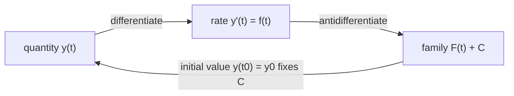

---
aliases:
  - Indefinite Integral
  - Primitive Function
  - Primitive
tags:
  - type/concept
  - domain/mathematics
  - level/L1
  - level/L2
mastery: 0
prerequisites:
  - "[[Derivative]]"
  - "[[Differentiation Rules]]"
  - "[[Exponential Function]]"
  - "[[Logarithm]]"
related:
  - "[[Integral]]"
  - "[[Fundamental Theorem of Calculus]]"
  - "[[Integration by Substitution]]"
  - "[[Integration by Parts]]"
  - "[[Ordinary Differential Equation]]"
  - "[[Euler Method]]"
  - "[[Normal Distribution]]"
projects: []
sources:
  - "[[Calculus (OpenStax)]]"
  - "[[MIT 18.01SC - Single Variable Calculus]]"
  - "[[Introduction to Probability (Blitzstein)]]"
---

# Antiderivative

> [!abstract]
> An antiderivative undoes differentiation: if you know the rate at which a quantity changes, its antiderivatives are the possible quantities, and one measured starting value picks the right one.

## Definition

A function $F$ is an **antiderivative** of $f$ on an interval $I$ if $F'(x) = f(x)$ for every $x \in I$. If $F$ is one antiderivative, every other one has the form $F + C$ for a constant $C$, and the family is written as the **indefinite integral** $\int f(x)\,dx = F(x) + C$.[^os1][^mit]

## Why it matters

- **Quantities from rates.** Instruments and models often give a rate (molecules produced per minute, reads per hour, drug absorbed per hour); the total is an antiderivative of that rate, fixed by its starting value.
- **The simplest differential equation.** Solving $y' = f(t)$ is the first step towards the models of [[Ordinary Differential Equation|differential equations]], where the rate also depends on $y$.
- **Closed-form probabilities.** A [[Cumulative Distribution Function]] is an antiderivative of its density ([[Fundamental Theorem of Calculus]]); when the antiderivative has a formula, probabilities do too.
- **Knowing when there is no formula.** The normal density has no elementary antiderivative, which is why $\Phi$ is computed numerically by every statistics library.[^blitz5]

## Core (L1)

**Reverse the derivative.** Since $\frac{d}{dt} t^3 = 3t^2$, the function $t^3$ is an antiderivative of $3t^2$; so are $t^3 + 5$ and $t^3 - 2$. On an interval, two antiderivatives of the same function differ by a constant: if $F' = G'$ then $(F - G)' = 0$, and a function with zero derivative on an interval is constant (a consequence of the mean value theorem).[^os1]

**Basic table.** Each line is checked by differentiating the right-hand side ([[Differentiation Rules]]).

| $f(x)$ | $\int f(x)\,dx$ | Condition |
|---|---|---|
| $x^n$ | $\dfrac{x^{n+1}}{n+1} + C$ | $n \neq -1$ |
| $\dfrac{1}{x}$ | $\ln\lvert x \rvert + C$ | on $x > 0$ or on $x < 0$ |
| $e^{ax}$ | $\dfrac{e^{ax}}{a} + C$ | $a \neq 0$ |
| $\cos x$, $\sin x$ | $\sin x + C$, $-\cos x + C$ | |

**Linearity.** $\int (a f + b g) = a \int f + b \int g$, because differentiation is linear. There is no product rule in reverse: $\int f g \neq \int f \cdot \int g$ ([[Integration by Parts]] handles products, [[Integration by Substitution]] handles chain-rule patterns).[^os1]

**Solving $y' = f(t)$.** The rate determines $y$ only up to $C$; one initial value $y(t_0) = y_0$ fixes it:

$$y(t) = F(t) - F(t_0) + y_0 .$$



**Bio: recovering production from its rate.** After a gene is switched off, its mRNA decays and the protein it encodes is still made, at a falling rate $r(t) = k e^{-\lambda t}$. Ignoring protein degradation, the amount of protein satisfies $P'(t) = r(t)$, so $P$ is an antiderivative of $r$ (Worked example).

## Deeper (L2)

**Checking is easy, finding is hard.** Differentiation follows mechanical rules; antidifferentiation needs techniques and sometimes fails. $e^{-x^2/2}$ has no antiderivative built from elementary functions, so the standard normal CDF is *defined* as $\Phi(x) = \int_{-\infty}^{x} \frac{1}{\sqrt{2\pi}} e^{-t^2/2}\,dt$ and evaluated numerically, for example through the error function $\Phi(x) = \tfrac12\big(1 + \operatorname{erf}(x/\sqrt2)\big)$ (Exercise 5).[^blitz5][^os2] An antiderivative always exists for a continuous function; what may be missing is a formula.

**Numerical antiderivatives.** Without a formula, accumulate the rate over small steps: $y(t + h) \approx y(t) + h\,f(t)$. For $y' = f(t)$ this is exactly a left Riemann sum ([[Integral]]), and it is the [[Euler Method]] applied to the simplest equation. Its error shrinks in proportion to $h$ (Exercise 4).

**Constants live on intervals.** On $\mathbb{R} \setminus \{0\}$, the function equal to $\ln x + 1$ for $x > 0$ and $\ln(-x) - 7$ for $x < 0$ is also an antiderivative of $1/x$: one constant per interval. The "unique up to one constant" rule needs a connected domain.

**When the rate depends on the quantity.** With degradation, $P' = r(t) - \gamma P$: the right-hand side involves $P$ itself and a plain antiderivative no longer suffices. Separable and linear equations are solved by reducing them to antiderivatives ([[Separable Differential Equation]], [[Linear Differential Equation]]).

## Mathematical representation

- $F$ is an antiderivative of $f$ on $I$ iff $F'(x) = f(x)$ for all $x \in I$.
- If $F$ and $G$ are antiderivatives of $f$ on an interval $I$, there is $C \in \mathbb{R}$ with $G = F + C$ on $I$.[^os1]
- The initial value problem $y' = f(t)$, $y(t_0) = y_0$ with $f$ continuous has the unique solution $y(t) = y_0 + \int_{t_0}^{t} f(s)\,ds$, which links antiderivatives to definite integrals ([[Fundamental Theorem of Calculus]]).

## Computational representation

Symbolic antiderivatives come from computer algebra (SymPy); numerically, a candidate $F$ is checked by comparing a central difference $\frac{F(t+h) - F(t-h)}{2h}$ with $f(t)$, and $y$ is reconstructed by accumulating $f$.

```python
import math

k, lam, P0 = 120.0, 0.1, 0.0       # invented: molecules/min, 1/min, molecules at t = 0

def rate(t: float) -> float:
    """Production rate r(t) = k e^{-lam t}."""
    return k * math.exp(-lam * t)

def P_exact(t: float) -> float:
    """Antiderivative of rate, fixed by P(0) = P0."""
    return P0 + (k / lam) * (1 - math.exp(-lam * t))

def max_derivative_gap(F, f, ts, h=1e-5):
    """Largest gap between a central-difference derivative of F and f on the points ts."""
    return max(abs((F(t + h) - F(t - h)) / (2 * h) - f(t)) for t in ts)

def accumulate(f, y0: float, t_end: float, n: int) -> float:
    """Euler for y' = f(t): add f(t_i) * dt over n steps (a left Riemann sum)."""
    dt, y = t_end / n, y0
    for i in range(n):
        y += f(i * dt) * dt
    return y

print(f"max |P' - r| = {max_derivative_gap(P_exact, rate, [0, 5, 10, 30]):.1e}")
print("exact P(30) =", round(P_exact(30), 2))
for n in (10, 100, 1000):
    print(n, round(accumulate(rate, P0, 30, n), 2))
```

Output:

```text
max |P' - r| = 6.8e-09
exact P(30) = 1140.26
10 1319.83
100 1157.44
1000 1141.97
```

## Worked example

> [!example] Protein made from a decaying mRNA (invented numbers)
> Rate $r(t) = 120\, e^{-0.1 t}$ molecules/min after the gene is switched off at $t = 0$, with $P(0) = 0$ new molecules.
>
> 1. **Antiderivative.** $\frac{d}{dt}\left(-\frac{120}{0.1} e^{-0.1t}\right) = 120 e^{-0.1t}$, so $P(t) = -1200\, e^{-0.1 t} + C$.
> 2. **Initial value.** $P(0) = -1200 + C = 0$ gives $C = 1200$, hence $P(t) = 1200\,(1 - e^{-0.1 t})$.
> 3. **Read it.** After 30 min, $P(30) = 1200(1 - e^{-3}) \approx 1140$ molecules. As $t \to \infty$, $P \to k/\lambda = 1200$: a decaying rate gives a finite total.
> 4. **Time to 90 % of the total.** $1 - e^{-0.1 t} = 0.9$ gives $t = \ln 10 / 0.1 \approx 23$ min.
> 5. **Check.** The code above confirms $P' = r$ numerically and shows that accumulating the rate in 1000 steps gives 1142, close to 1140.

## Common misconceptions

> [!warning] "The antiderivative of $f$"
> There is a whole family $F + C$. Dropping $C$ is harmless for a definite integral but wrong for an initial value problem: here it would make the protein amount negative at $t = 0$.

> [!warning] "$\int \frac{1}{x}\,dx = \ln x$"
> $\ln x$ is defined only for $x > 0$. The antiderivative is $\ln\lvert x \rvert$, with an independent constant on each side of 0.

> [!warning] "Every function has a formula for its antiderivative"
> Continuous functions always have antiderivatives, but some, such as $e^{-x^2/2}$, have none in elementary terms. Software then evaluates special functions ($\operatorname{erf}$, $\Phi$) or integrates numerically ([[Numerical Integration]]).

## Exercises

> [!question] Exercise 1 (L1)
> Find $\int \left(4x^3 - \frac{2}{x} + e^{3x}\right) dx$ and check your answer by differentiating.

> [!success]- Solution
> Term by term: $x^4 - 2\ln\lvert x \rvert + \frac{e^{3x}}{3} + C$. Differentiating gives $4x^3 - \frac{2}{x} + e^{3x}$.

> [!question] Exercise 2 (L1)
> Solve $y' = 6t^2 - 4$ with $y(1) = 3$.

> [!success]- Solution
> $y = 2t^3 - 4t + C$. At $t = 1$: $2 - 4 + C = 3$, so $C = 5$ and $y(t) = 2t^3 - 4t + 5$.

> [!question] Exercise 3 (L2)
> A culture's population is measured once, $N(2\,\text{h}) = 5 \times 10^5$ cells, and its growth rate is known to be $N'(t) = 10^5\, t$ cells/h. Find $N(t)$ and $N(0)$. Why is one measurement necessary?

> [!success]- Solution
> $N(t) = 5 \times 10^4\, t^2 + C$. From $N(2) = 2 \times 10^5 + C = 5 \times 10^5$, $C = 3 \times 10^5$, so $N(0) = 3 \times 10^5$ cells. The rate fixes only changes in $N$; without one absolute value every vertical shift of the curve is equally compatible with the data.

> [!question] Exercise 4 (L2, Python)
> Using `accumulate`, `rate` and `P_exact` from the code above, compute the error of the accumulated $P(30)$ for $n = 100, 200, 400$ steps. How does the error change when the step is halved?

> [!success]- Solution
> ```python
> errs = [abs(accumulate(rate, P0, 30, n) - P_exact(30)) for n in (100, 200, 400)]
> print([round(e, 3) for e in errs], [round(errs[i] / errs[i + 1], 3) for i in range(2)])
> # [17.189, 8.573, 4.281] [2.005, 2.002]
> ```
>
> Halving the step halves the error: the left sum is a first-order method. The rate decreases, so left endpoints overestimate it and the accumulated value is too high.

> [!question] Exercise 5 (L2, Python)
> Check numerically that $F(x) = \tfrac12\big(1 + \operatorname{erf}(x/\sqrt2)\big)$ is an antiderivative of the standard normal density $\varphi(x) = e^{-x^2/2}/\sqrt{2\pi}$, then compute $F(1.96) - F(-1.96)$.

> [!success]- Solution
> ```python
> Phi = lambda x: 0.5 * (1 + math.erf(x / math.sqrt(2)))
> phi = lambda x: math.exp(-x * x / 2) / math.sqrt(2 * math.pi)
> print(f"{max_derivative_gap(Phi, phi, [-3, -1, 0, 0.5, 2]):.1e}")   # 6.6e-12
> print(round(Phi(1.96) - Phi(-1.96), 4))                             # 0.95
> ```
>
> The derivative matches $\varphi$ to rounding error, so $F = \Phi$ up to a constant, and $F(-\infty) = 0$ fixes the constant. The difference is the probability that a standard normal falls within $\pm 1.96$, the 95 % used for confidence intervals ([[Normal Distribution]]).

## Mastery checklist

- [ ] 1 Recognized: I can state what an antiderivative is and why "+ C" appears.
- [ ] 2 Understood: I can explain why antiderivatives on an interval differ by a constant, and how an initial value selects one.
- [ ] 3 Practiced: I can antidifferentiate powers, $1/x$ and exponentials, solve $y' = f(t)$ with an initial value, and check a candidate numerically in Python.
- [ ] 4 Applied: I can reconstruct a cumulative quantity (protein made, reads produced, drug absorbed) from a measured or modeled rate.
- [ ] 5 Explained: I can teach why some antiderivatives have no formula ($\Phi$), how numerical accumulation relates to Riemann sums and the Euler method, and why constants are per interval.

## References

[^os1]: [[Calculus (OpenStax)]], Volume 1, antiderivatives and indefinite integrals (with the mean value theorem corollary that functions with equal derivatives differ by a constant).
[^os2]: [[Calculus (OpenStax)]], Volume 2, integrals without elementary antiderivatives (evaluated with power series or numerically).
[^mit]: [[MIT 18.01SC - Single Variable Calculus]], integration part (antiderivatives and differential equations of the form $y' = f(t)$).
[^blitz5]: [[Introduction to Probability (Blitzstein)]], 2nd ed., ch. 5 "Continuous Random Variables" (the standard normal CDF $\Phi$ is defined as an integral and has no closed form in elementary functions).
