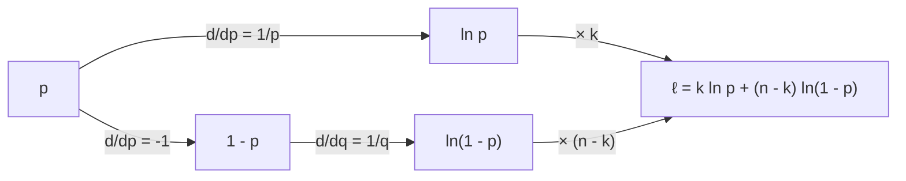

---
aliases:
  - Derivative Rules
  - Product Rule
  - Quotient Rule
  - Chain Rule
  - Power Rule
  - Règles de dérivation
tags:
  - type/concept
  - domain/mathematics
  - domain/statistics
  - level/L1
  - level/L2
  - level/L3
mastery: 0
prerequisites:
  - "[[Derivative]]"
  - "[[Exponential Function]]"
  - "[[Logarithm]]"
related:
  - "[[Extremum]]"
  - "[[Linear Approximation]]"
  - "[[Likelihood Function]]"
  - "[[Maximum Likelihood Estimation]]"
  - "[[Multivariable Chain Rule]]"
  - "[[Michaelis-Menten Kinetics]]"
  - "[[Logistic Growth]]"
  - "[[Logistic Regression]]"
projects: []
sources:
  - "[[Calculus (OpenStax)]]"
  - "[[MIT 18.01SC - Single Variable Calculus]]"
  - "[[Biochemistry (Berg)]]"
  - "[[Modern Statistics for Modern Biology (Holmes)]]"
  - "[[Mathematical Biology (Murray)]]"
  - "[[An Introduction to Statistical Learning (James)]]"
---

# Differentiation Rules

> [!abstract]
> A handful of rules (sum, product, quotient, chain, and the derivatives of powers, $e^x$ and $\ln x$) differentiate any formula built from elementary functions without going back to limits.

## Definition

The differentiation rules express the derivative of a combination of functions through the derivatives of its parts. For $f$ and $g$ differentiable and a constant $c$:[^calc1][^1801]

| Rule | Statement |
|---|---|
| constant, constant multiple | $(c)' = 0$, $\ (cf)' = cf'$ |
| sum | $(f + g)' = f' + g'$ |
| power | $(x^r)' = r\,x^{r-1}$ for real $r$ (on $x > 0$ when $r$ is not an integer) |
| product | $(fg)' = f'g + fg'$ |
| quotient | $\left(\frac{f}{g}\right)' = \frac{f'g - fg'}{g^2}$ where $g \neq 0$ |
| chain | $(f \circ g)'(x) = f'(g(x))\,g'(x)$; in Leibniz form $\frac{dy}{dx} = \frac{dy}{du}\frac{du}{dx}$ |
| exponential | $(e^x)' = e^x$, $\ (a^x)' = a^x \ln a$ |
| logarithm | $(\ln x)' = \frac1x$ for $x > 0$, $\ (\log_a x)' = \frac{1}{x \ln a}$ |

## Why it matters

- **Likelihoods.** Deriving a maximum likelihood estimate by hand is a chain rule on logarithms ([[Likelihood Function]], [[Maximum Likelihood Estimation]]); the same derivatives feed numerical optimizers.
- **Model sensitivity.** The quotient rule gives the sensitivity of Michaelis-Menten velocity to substrate; the chain rule turns the closed form of logistic growth into its differential equation.
- **Transformations.** Derivatives of $\log_2$, $\sqrt{\ }$ or the logit tell how errors and parameters behave on a new scale ([[Linear Approximation]], [[Integration by Substitution]]).
- **Learning algorithms.** Backpropagation in a [[Neural Network]] is the chain rule applied layer by layer ([[Multivariable Chain Rule]]); automatic differentiation is these rules executed by a program (Advanced).

## Core (L1)

**Linearity.** The sum and constant-multiple rules make differentiation linear, so polynomials are differentiated term by term: $(3x^4 - 2x + 7)' = 12x^3 - 2$.

**Powers.** $\sqrt x = x^{1/2}$ gives $\frac{1}{2}x^{-1/2} = \frac{1}{2\sqrt x}$, and $\frac1x = x^{-1}$ gives $-x^{-2}$: the results obtained from the definition in [[Derivative]].

**Why the product rule has two terms.** Add and subtract $f(x + h)g(x)$:

$$\frac{f(x+h)g(x+h) - f(x)g(x)}{h} = f(x + h)\,\frac{g(x + h) - g(x)}{h} + \frac{f(x + h) - f(x)}{h}\,g(x) \;\to\; f(x)g'(x) + f'(x)g(x),$$

using $f(x + h) \to f(x)$ (a differentiable function is continuous). Each factor changes while the other is held fixed, and both contributions add.

**Quotient rule: Michaelis-Menten sensitivity.** The Michaelis-Menten equation gives the velocity of an enzyme reaction as $v(S) = \frac{V_{max} S}{K_M + S}$.[^berg] With $f = V_{max}S$ and $g = K_M + S$:

$$v'(S) = \frac{V_{max}(K_M + S) - V_{max}S}{(K_M + S)^2} = \frac{V_{max}K_M}{(K_M + S)^2}.$$

The sensitivity is $V_{max}/K_M$ at $S = 0$, $V_{max}/(4K_M)$ at $S = K_M$, and decays like $1/S^2$ at saturation: adding substrate to a saturated enzyme barely changes its velocity ([[Michaelis-Menten Kinetics]]).

**Chain rule: outside derivative times inside derivative.** $\frac{d}{dt}e^{-kt} = e^{-kt}\cdot(-k)$; $\frac{d}{dp}\ln(1 - p) = \frac{1}{1 - p}\cdot(-1)$; $\frac{d}{dx}(1 + x^2)^{-1} = -(1 + x^2)^{-2}\cdot 2x$.

**$e^x$ and $\ln x$.** From the definition, $\frac{e^{x + h} - e^x}{h} = e^x\,\frac{e^h - 1}{h} \to e^x$, using $\frac{e^h - 1}{h} \to 1$ ([[Limit]]). Then differentiate $e^{\ln x} = x$ with the chain rule: $e^{\ln x}\,(\ln x)' = 1$, so $(\ln x)' = \frac{1}{x}$. Other bases follow: $a^x = e^{x\ln a}$ gives $a^x \ln a$, and $\log_2 x = \frac{\ln x}{\ln 2}$ gives $\frac{1}{x \ln 2}$.

**Bio: differentiating a log-likelihood.** A DNA sequence of $n$ bases contains $k$ G or C. Modeling the bases as independent, each G or C with probability $p$, the count is binomial ([[Binomial Distribution]]) and the likelihood of $p$ is $L(p) = \binom{n}{k}p^k(1 - p)^{n - k}$. Its logarithm turns the product into a sum ([[Logarithm]]):

$$\ell(p) = \ln\binom{n}{k} + k\ln p + (n - k)\ln(1 - p), \qquad \ell'(p) = \frac{k}{p} - \frac{n - k}{1 - p}.$$

Three rules did the work: the constant $\ln\binom{n}{k}$ has derivative 0, the constant multiple $k\ln p$ gives $k/p$, and the chain rule on $\ln(1 - p)$ supplies the minus sign. Where $\ell' > 0$ the data favour a larger $p$; $\ell'$ vanishes at $p = k/n$, the maximum likelihood estimate derived in [[Extremum]].[^holmes][^durbin]

## Deeper (L2)

**Why statisticians differentiate the log.** For independent observations $x_1, \dots, x_n$ the likelihood is a product $L(\theta) = \prod_i f(x_i; \theta)$. The product rule on $n$ factors gives $n$ terms of $n$ factors each; the logarithm gives $\ell(\theta) = \sum_i \ln f(x_i;\theta)$ and

$$\ell'(\theta) = \sum_{i=1}^n \frac{f'(x_i;\theta)}{f(x_i;\theta)},$$

a sum of simple terms (logarithmic differentiation).[^calc1] Since $\ln$ is increasing, $L$ and $\ell$ are maximized at the same $\theta$ ([[Extremum]]); numerically, products of many probabilities underflow while sums of logs do not ([[Log-Space Arithmetic]]).

**Inverse functions.** If $y = f(x)$ has an inverse, $(f^{-1})'(y) = \frac{1}{f'(x)}$: the slope of the mirrored graph is the reciprocal slope.[^calc1] Example: the doubling time $T = \ln 2 / r$ of exponential growth has $\frac{dT}{dr} = -\frac{\ln 2}{r^2}$, so an error on a small growth rate becomes a large error on the doubling time.

**Implicit differentiation: how a steady state moves.** The steady state $x^*$ of the self-repression model $\frac{dx}{dt} = \frac{\beta}{1 + x^2} - \gamma x$ ([[Continuity]]) satisfies $\frac{\beta}{1 + x^{*2}} = \gamma x^*$, with no convenient formula for $x^*(\beta)$. Differentiate both sides with respect to $\beta$, treating $x^*$ as a function of $\beta$:[^calc1]

$$\frac{1}{1 + x^{*2}} - \frac{2\beta x^*}{(1 + x^{*2})^2}\frac{dx^*}{d\beta} = \gamma\frac{dx^*}{d\beta} \quad\Rightarrow\quad \frac{dx^*}{d\beta} = \frac{1/(1 + x^{*2})}{\gamma + 2\beta x^*/(1 + x^{*2})^2} > 0.$$

Stronger production raises the steady state, as expected; with $\beta = 2$, $\gamma = 1$, $x^* = 1$, the sensitivity is $\frac{1/2}{1 + 1} = 0.25$.

**Second derivatives.** $\ell''(p) = -\frac{k}{p^2} - \frac{n - k}{(1 - p)^2} < 0$ on $(0, 1)$: the binomial log-likelihood is concave, so its critical point is a maximum ([[Extremum]]). The size of $-\ell''$ at the maximum measures how sharply the data pin down $p$ ([[Fisher Information]]).

## Advanced (L3)

**Automatic differentiation.** A program that computes $f$ is a composition of elementary operations. Applying the sum, product, quotient and chain rules to each operation as it runs gives the exact derivative (up to rounding), with no step size to tune, unlike [[Finite Difference|finite differences]]. Forward mode can be built from **dual numbers** $a + b\varepsilon$ with $\varepsilon^2 = 0$: since $f(a + \varepsilon) = f(a) + f'(a)\,\varepsilon$ (the linear-remainder form of the [[Derivative]]), carrying the pair (value, derivative) through every operation propagates the derivative (code below). Reverse mode applies the same chain rule from the output back to the inputs; layer by layer, this is backpropagation ([[Multivariable Chain Rule]], [[Neural Network]]).



*The chain rule multiplies local derivatives along each path from $p$ to $\ell$ and adds the paths: $\ell'(p) = k\cdot\frac1p + (n - k)\cdot\frac{1}{1 - p}\cdot(-1)$.*

**Reparametrization.** Optimizers prefer parameters that live on the whole real line. The logit $\theta = \ln\frac{p}{1 - p}$, the log odds used by [[Logistic Regression]],[^james] has inverse $p = \frac{1}{1 + e^{-\theta}}$ and $\frac{dp}{d\theta} = p(1 - p)$. By the chain rule,

$$\frac{d\ell}{d\theta} = \frac{d\ell}{dp}\frac{dp}{d\theta} = \left(\frac{k}{p} - \frac{n - k}{1 - p}\right)p(1 - p) = k - np:$$

observed minus expected count. The same chain-rule step links any model fitted on the log-odds scale back to probabilities ([[Generalized Linear Model]]).

## Mathematical representation

Let $f, g$ be differentiable at $x$ (for the chain rule: $g$ at $x$ and $f$ at $g(x)$).

- Linearity: $(af + bg)' = af' + bg'$ for constants $a, b$.
- Product and quotient: $(fg)' = f'g + fg'$; $(f/g)' = (f'g - fg')/g^2$ if $g(x) \neq 0$.
- Chain: $(f\circ g)'(x) = f'(g(x))\,g'(x)$.
- Inverse: if $f$ is invertible near $x$ with $f'(x) \neq 0$, $(f^{-1})'(f(x)) = 1/f'(x)$.
- Logarithmic derivative: $(\ln |f|)' = f'/f$ where $f \neq 0$.
- Elementary derivatives: $(x^r)' = rx^{r-1}$, $(e^{x})' = e^x$, $(a^x)' = a^x\ln a$, $(\ln x)' = 1/x$, $(\log_a x)' = 1/(x\ln a)$.
- Binomial log-likelihood: $\ell'(p) = \frac{k}{p} - \frac{n-k}{1-p}$, $\ \ell''(p) = -\frac{k}{p^2} - \frac{n-k}{(1-p)^2}$.

## Computational representation

Check each hand-derived derivative against a central difference, then let dual numbers apply the rules automatically.

```python
import math

def central(f, x, h=1e-6):
    return (f(x + h) - f(x - h)) / (2 * h)

# Binomial log-likelihood of a GC count: k = 26 G or C among n = 40 bases (invented)
k, n = 26, 40
loglik = lambda p: math.log(math.comb(n, k)) + k * math.log(p) + (n - k) * math.log(1 - p)
dloglik = lambda p: k / p - (n - k) / (1 - p)                # chain rule on ln(1 - p)

# Michaelis-Menten velocity (invented Vmax = 10 uM/s, Km = 2 uM)
Vmax, Km = 10.0, 2.0
v = lambda S: Vmax * S / (Km + S)
dv = lambda S: Vmax * Km / (Km + S) ** 2                     # quotient rule

for p in (0.3, 0.5, 0.65):
    print(f"p = {p}: rule {dloglik(p):8.4f}  numeric {central(loglik, p):8.4f}")
for S in (0.5, 2.0, 20.0):
    print(f"S = {S}: rule {dv(S):.4f}  numeric {central(v, S):.4f}")

class Dual:
    """a + b*eps with eps^2 = 0: carries a value and its derivative through arithmetic."""
    def __init__(self, val: float, der: float = 0.0):
        self.val, self.der = val, der
    def __add__(self, o):                                    # sum rule
        o = o if isinstance(o, Dual) else Dual(o)
        return Dual(self.val + o.val, self.der + o.der)
    def __neg__(self):
        return Dual(-self.val, -self.der)
    def __sub__(self, o):
        return self + (-o)
    def __rsub__(self, o):
        return -self + o
    def __mul__(self, o):                                    # product rule
        o = o if isinstance(o, Dual) else Dual(o)
        return Dual(self.val * o.val, self.der * o.val + self.val * o.der)
    def __truediv__(self, o):                                # quotient rule
        o = o if isinstance(o, Dual) else Dual(o)
        return Dual(self.val / o.val, (self.der * o.val - self.val * o.der) / o.val ** 2)
    def __rtruediv__(self, o):
        return Dual(o) / self
    __radd__, __rmul__ = __add__, __mul__

def log(x: Dual) -> Dual:
    return Dual(math.log(x.val), x.der / x.val)               # chain rule with (ln u)' = 1/u

def exp(x: Dual) -> Dual:
    return Dual(math.exp(x.val), math.exp(x.val) * x.der)     # chain rule with (e^u)' = e^u

p = Dual(0.5, 1.0)                                           # seed dp/dp = 1
ll = k * log(p) + (n - k) * log(1 - p)
print(ll.val, ll.der)
S = Dual(2.0, 1.0)
print((Vmax * S / (Km + S)).der)
```

```text
p = 0.3: rule  66.6667  numeric  66.6667
p = 0.5: rule  24.0000  numeric  24.0000
p = 0.65: rule   0.0000  numeric  -0.0000
S = 0.5: rule 3.2000  numeric 3.2000
S = 2.0: rule 1.2500  numeric 1.2500
S = 20.0: rule 0.0413  numeric 0.0413
-27.72588722239781 24.0
1.25
```

The dual-number value $-27.73$ omits the constant $\ln\binom{40}{26}$, which does not affect the derivative.

## Worked example

> [!example] Where does the GC log-likelihood increase? (invented counts)
> A 40-base sequence has $k = 26$ G or C. With $\ell(p) = \ln\binom{40}{26} + 26\ln p + 14\ln(1 - p)$:
>
> 1. **Constant.** $\frac{d}{dp}\ln\binom{40}{26} = 0$: the binomial coefficient never matters for estimation.
> 2. **Constant multiple and $\ln$.** $\frac{d}{dp}\,26\ln p = \frac{26}{p}$.
> 3. **Chain rule.** $\frac{d}{dp}\,14\ln(1 - p) = 14\cdot\frac{1}{1 - p}\cdot(-1) = -\frac{14}{1 - p}$.
> 4. **Sum.** $\ell'(p) = \frac{26}{p} - \frac{14}{1 - p}$.
> 5. **Evaluate.** $\ell'(0.3) = 86.67 - 20 = 66.67$; $\ell'(0.5) = 52 - 28 = 24$; $\ell'(0.65) = 40 - 40 = 0$ (code above: the rule and central differences agree, and the dual numbers return 24.0 at $p = 0.5$).
> 6. **Interpretation.** The likelihood rises up to $p = 0.65 = 26/40$ and falls after it (for $p > 0.65$, $\frac{26}{p} < 40 < \frac{14}{1 - p}$). The best-supported GC fraction is the observed one; [[Extremum]] makes this a theorem.

## Common misconceptions

> [!warning] "The derivative of a product is the product of the derivatives"
> $(x \cdot x)' = 2x$, but $x' \cdot x' = 1$. Both factors vary, so two terms appear.

> [!warning] "$\frac{d}{dp}\ln(1 - p) = \frac{1}{1 - p}$"
> The inner function $1 - p$ has derivative $-1$. Forgetting the inner derivative flips the sign of half of the binomial score and moves the "maximum" to the wrong place.

> [!warning] "$(2^x)' = x\,2^{x - 1}$"
> The power rule needs a constant exponent. $2^x$ has a variable exponent: $(2^x)' = 2^x\ln 2$. A PCR product that doubles each cycle grows at a rate proportional to its current amount, not like a power of the cycle number.

> [!warning] "Constants in the likelihood change the estimate"
> Additive constants in $\ell$ (binomial coefficients, $\ln x_i!$) vanish on differentiation. This is why likelihoods are often written "up to a constant".

## Exercises

> [!question] Exercise 1 (L1)
> Differentiate (a) $4x^3 - \frac{5}{x} + \sqrt x$, (b) $x^2e^x$, (c) $50\,e^{-0.2t}$, (d) $\ln(1 + x^2)$, (e) $\frac{x}{1 + x}$.

> [!success]- Solution
> (a) $12x^2 + \frac{5}{x^2} + \frac{1}{2\sqrt x}$. (b) Product: $2xe^x + x^2e^x = xe^x(x + 2)$. (c) Chain: $-10\,e^{-0.2t}$. (d) Chain: $\frac{2x}{1 + x^2}$. (e) Quotient: $\frac{(1 + x) - x}{(1 + x)^2} = \frac{1}{(1 + x)^2}$.

> [!question] Exercise 2 (L1)
> For Michaelis-Menten kinetics, compare the sensitivity $v'(S)$ at $S = K_M$ and at $S = 10K_M$. How many times smaller is it at the higher concentration?

> [!success]- Solution
> $v'(K_M) = \frac{V_{max}K_M}{(2K_M)^2} = \frac{V_{max}}{4K_M}$ and $v'(10K_M) = \frac{V_{max}K_M}{(11K_M)^2} = \frac{V_{max}}{121K_M}$: about 30 times smaller. Near saturation, velocity is almost insensitive to substrate.

> [!question] Exercise 3 (L2)
> Counts $x_1, \dots, x_n$ are modeled as independent $\mathrm{Pois}(\lambda)$ ([[Poisson Distribution]]). Write the log-likelihood, differentiate it, and find where the derivative vanishes.

> [!success]- Solution
> $\ell(\lambda) = \sum_i \big(x_i\ln\lambda - \lambda - \ln x_i!\big)$, so $\ell'(\lambda) = \frac{\sum_i x_i}{\lambda} - n$, which vanishes at $\lambda = \bar x$, the sample mean. $\ell''(\lambda) = -\sum_i x_i/\lambda^2 < 0$ (if some $x_i > 0$), so it is a maximum ([[Extremum]]).

> [!question] Exercise 4 (L2, Python)
> The logistic curve $N(t) = \frac{K}{1 + Ae^{-rt}}$ solves the logistic growth equation.[^murray] Show with the chain rule that $N'(t) = rN\left(1 - \frac{N}{K}\right)$, and check numerically with $K = 1$, $A = 9$, $r = 0.8$ (invented).

> [!success]- Solution
> $N = K(1 + Ae^{-rt})^{-1}$, so $N' = -K(1 + Ae^{-rt})^{-2}\cdot(-rAe^{-rt}) = \frac{rKAe^{-rt}}{(1 + Ae^{-rt})^2}$. And $rN(1 - N/K) = r\frac{K}{1 + Ae^{-rt}}\cdot\frac{Ae^{-rt}}{1 + Ae^{-rt}}$, the same expression.
>
> ```python
> K, A, r = 1.0, 9.0, 0.8                                       # invented logistic parameters
> Nt = lambda t: K / (1 + A * math.exp(-r * t))
> for t in (0.0, 2.0, 5.0):
>     print(t, round(central(Nt, t), 6), round(r * Nt(t) * (1 - Nt(t) / K), 6))
> # 0.0 0.072 0.072
> # 2.0 0.183175 0.183175
> # 5.0 0.09719 0.09719
> ```

> [!question] Exercise 5 (L2)
> For the self-repression model with $\beta = 2$, $\gamma = 1$ (steady state $x^* = 1$), use the implicit-differentiation formula to estimate the new steady state when $\beta$ rises to 2.1.

> [!success]- Solution
> $\frac{dx^*}{d\beta} = 0.25$, so $x^*(2.1) \approx 1 + 0.25 \times 0.1 = 1.025$ ([[Linear Approximation]]). Check: $\frac{2.1}{1 + 1.025^2} - 1.025 \approx -0.0009$, close to 0 (the exact steady state is slightly below 1.025).

> [!question] Exercise 6 (L3, Python)
> Verify $\frac{d\ell}{d\theta} = k - np$ for the logit parametrization at $p = 0.3$ ($k = 26$, $n = 40$) with the `Dual` class, and explain why the sign of $k - np$ tells which way to move $\theta$.

> [!success]- Solution
> ```python
> theta = Dual(math.log(0.3 / 0.7), 1.0)                       # logit of p = 0.3
> p_of_theta = 1 / (1 + exp(-theta))
> ll_theta = k * log(p_of_theta) + (n - k) * log(1 - p_of_theta)
> print(round(ll_theta.der, 10), k - n * 0.3)
> # 14.0 14.0
> ```
>
> At $p = 0.3$ the model expects $np = 12$ G or C and the sequence has 26: the derivative is positive, so increasing $\theta$ (hence $p$) raises the likelihood. It is zero exactly when expected equals observed, $p = k/n$, and the logit itself is unconstrained, which suits [[Gradient Descent]].

## Mastery checklist

- [ ] 1 Recognized: I can state the sum, product, quotient and chain rules and the derivatives of $x^r$, $e^x$ and $\ln x$.
- [ ] 2 Understood: I can explain why the product rule has two terms, why $(\ln x)' = 1/x$ follows from $(e^x)' = e^x$, and why the log-likelihood is differentiated instead of the likelihood.
- [ ] 3 Practiced: I differentiate binomial and Poisson log-likelihoods, Michaelis-Menten and logistic formulas, and check them with central differences in Python.
- [ ] 4 Applied: I derive the derivative of a model I fit to real data (kinetics, growth, a likelihood) and use it in an optimizer or a sensitivity analysis.
- [ ] 5 Explained: I can teach implicit differentiation of a steady state, the chain rule as automatic differentiation, and reparametrization by the logit.

## References

[^calc1]: [[Calculus (OpenStax)]], Volume 1 (differentiation rules: power, sum, constant multiple, product and quotient rules, the chain rule, derivatives of inverse functions, implicit differentiation, derivatives of exponential and logarithmic functions and logarithmic differentiation).
[^1801]: [[MIT 18.01SC - Single Variable Calculus]], differentiation part (rules of differentiation).
[^berg]: [[Biochemistry (Berg)]], 5th ed. (2002), treatment of enzyme kinetics (the Michaelis-Menten equation).
[^holmes]: [[Modern Statistics for Modern Biology (Holmes)]], treatment of statistical modeling (likelihood and maximum likelihood estimation of a binomial proportion).
[^durbin]: [[Biological Sequence Analysis (Durbin)]], ch. 1 "Introduction" (probabilistic models of sequences, likelihood and maximum likelihood estimation).
[^murray]: [[Mathematical Biology (Murray)]], Volume I, continuous population models (logistic growth).
[^james]: [[An Introduction to Statistical Learning (James)]], classification chapter (logistic regression and the log odds).
