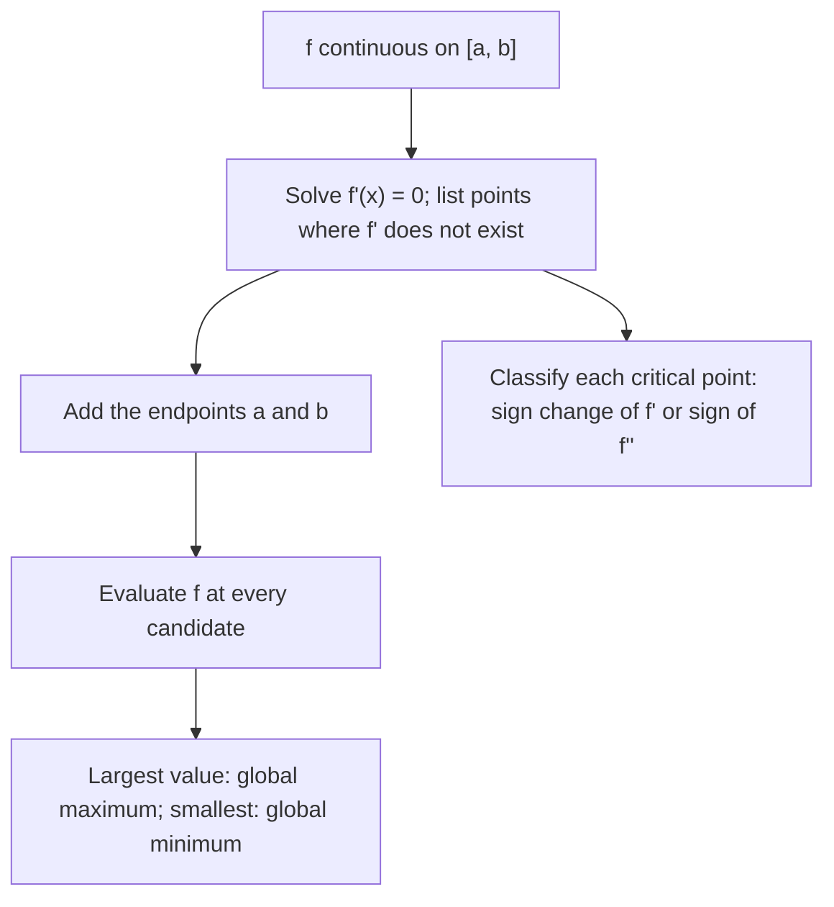

---
aliases:
  - Extrema
  - Maximum
  - Minimum
  - Maxima and Minima
  - Critical Point
  - Stationary Point
  - Extrémum
tags:
  - type/concept
  - domain/mathematics
  - domain/statistics
  - level/L1
  - level/L2
  - level/L3
mastery: 0
prerequisites:
  - "[[Derivative]]"
  - "[[Differentiation Rules]]"
  - "[[Continuity]]"
related:
  - "[[Maximum Likelihood Estimation]]"
  - "[[Likelihood Function]]"
  - "[[Optimization Problem]]"
  - "[[Convex Function]]"
  - "[[Newton's Method]]"
  - "[[Hessian Matrix]]"
  - "[[Fisher Information]]"
  - "[[GC Content]]"
  - "[[Allele Frequency]]"
projects: []
sources:
  - "[[Calculus (OpenStax)]]"
  - "[[MIT 18.01SC - Single Variable Calculus]]"
  - "[[Modern Statistics for Modern Biology (Holmes)]]"
  - "[[Biological Sequence Analysis (Durbin)]]"
  - "[[Introduction to Probability (Blitzstein)]]"
---

# Extremum

> [!abstract]
> An extremum is a largest (maximum) or smallest (minimum) value of a function, over its whole domain (global) or near a point (local); calculus finds the candidates, where the derivative is zero or undefined and at the endpoints, then tests them.

## Definition

Let $f$ be defined on a set $D$. $f$ has a **global (absolute) maximum** at $c \in D$ if $f(c) \ge f(x)$ for all $x \in D$, and a **local (relative) maximum** at $c$ if $f(c) \ge f(x)$ for all $x$ in some open interval containing $c$; minima are defined with $\le$. An **extremum** is a maximum or a minimum. A **critical point** is an interior point $c$ of the domain where $f'(c) = 0$ or $f'(c)$ does not exist.[^calc1][^1801]

## Why it matters

- **Estimation is optimization.** A maximum likelihood estimate maximizes a likelihood; least squares minimizes a sum of squared errors ([[Maximum Likelihood Estimation]], [[Linear Regression]]).
- **The obvious estimators, justified.** The GC fraction of a sequence and the allele frequency of a sample are the maxima of binomial likelihoods; deriving them makes their assumptions explicit ([[GC Content]], [[Allele Frequency]]).
- **Curvature is precision.** How sharply the log-likelihood peaks at its maximum gives the standard error of the estimate ([[Fisher Information]], [[Hessian Matrix]]).
- **Trusting an optimizer.** Numerical methods ([[Newton's Method]], [[Gradient Descent]]) return points where the derivative vanishes; the theory tells when such a point is the global answer ([[Optimization Problem]], [[Convex Function]]).

## Core (L1)

**Where extrema can be.** Three results narrow the search:[^calc1]

1. **Extreme value theorem.** A function continuous on a closed bounded interval $[a, b]$ has a global maximum and a global minimum there ([[Continuity]]).
2. **Fermat's theorem.** If $f$ has a local extremum at an interior point $c$ and $f'(c)$ exists, then $f'(c) = 0$.
3. **Closed interval method.** Hence the global extrema of a continuous $f$ on $[a, b]$ are among the critical points and the endpoints: evaluate $f$ at all of them and compare.



**Classifying a critical point.**[^calc1]

- **First derivative test.** If $f'$ changes from $+$ to $-$ at $c$, $f(c)$ is a local maximum; from $-$ to $+$, a local minimum; no sign change, neither.
- **Second derivative test.** If $f'(c) = 0$ and $f''(c) < 0$, local maximum; $f''(c) > 0$, local minimum; $f''(c) = 0$, no conclusion.

Example: $f(x) = x^3 - 3x$ on $[-2, 3]$. $f'(x) = 3x^2 - 3 = 0$ at $x = \pm 1$, and $f''(x) = 6x$. $f''(-1) = -6$: local maximum $f(-1) = 2$; $f''(1) = 6$: local minimum $f(1) = -2$. Endpoints: $f(-2) = -2$, $f(3) = 18$. The global maximum, 18, is at the endpoint $x = 3$, which is not a critical point; the global minimum, $-2$, is reached at $x = -2$ and $x = 1$.

**Bio: the maximum likelihood estimate of a proportion.** Observe $k$ "successes" in $n$ independent trials with unknown probability $p$: $k$ G or C among the $n$ bases of a sequence, or $k$ copies of an allele among $n$ sampled allele copies. The log-likelihood, dropping the constant $\ln\binom{n}{k}$, is

$$\ell(p) = k\ln p + (n - k)\ln(1 - p), \qquad \ell'(p) = \frac{k}{p} - \frac{n - k}{1 - p} = \frac{k - np}{p(1 - p)}$$

([[Differentiation Rules]]). For $0 < k < n$:

1. **Critical point.** $\ell'(p) = 0 \iff k - np = 0 \iff p = k/n$.
2. **First derivative test.** $\ell'(p)$ has the sign of $k - np$: positive for $p < k/n$, negative for $p > k/n$. So $\ell$ increases, then decreases: $p = k/n$ is the global maximum on $(0, 1)$.
3. **Endpoints.** $\ell(p) \to -\infty$ as $p \to 0$ or $p \to 1$, so they do not compete.

Hence $\hat p = k/n$: the maximum likelihood estimate of a binomial proportion is the observed proportion, the GC fraction of the sequence or the allele frequency of the sample.[^holmes][^durbin1]

**Why maximize the log?** $\ln$ is strictly increasing, so $L(p_1) < L(p_2) \iff \ln L(p_1) < \ln L(p_2)$: $L$ and $\ell = \ln L$ have the same maximizer. Taking logs changes the work (sums instead of products), not the answer.

## Deeper (L2)

**Concavity makes a critical point global.** If $f'' < 0$ on an interval, $f'$ is strictly decreasing, so it vanishes at most once and changes sign from $+$ to $-$ there: a critical point is the unique global maximum on that interval. The binomial log-likelihood has $\ell''(p) = -\frac{k}{p^2} - \frac{n - k}{(1 - p)^2} < 0$, so $\hat p$ is unique without any further check. In several variables, this is the guarantee that [[Convex Function|convexity]] provides to optimizers.

**Maxima at the boundary.** If $k = 0$ (no G or C, or an allele not seen in the sample), $\ell(p) = n\ln(1 - p)$ is strictly decreasing on $[0, 1]$ and the maximum is at the endpoint $p = 0$, where $\ell'(0) = -n \neq 0$: a maximum that is not a critical point. $\hat p = 0$ declares the event impossible, which breaks any later computation that takes its logarithm. Models that estimate probabilities from counts therefore often add pseudocounts to the observed counts so that unseen events keep a small probability.[^durbin3] Pseudocounts can be read as prior information ([[Bayesian Statistics]]).

**Inconclusive cases.** $x^3$ has $f'(0) = 0$ and no extremum (an inflection point). $x^4$ and $-x^4$ both have $f'(0) = f''(0) = 0$, yet the first has a minimum and the second a maximum: when the second derivative test fails, return to the sign of $f'$.

**Curvature measures precision.** At the maximum, $\ell''(\hat p) = -\frac{n}{\hat p(1 - \hat p)}$, so

$$-\frac{1}{\ell''(\hat p)} = \frac{\hat p(1 - \hat p)}{n},$$

which is the variance of the estimator $k/n$, $\frac{np(1 - p)}{n^2}$ ([[Binomial Distribution]]),[^blitz4] evaluated at $\hat p$. A sharply peaked log-likelihood (large $n$) pins $p$ down; a flat one does not. The general version of this link is [[Fisher Information]].

## Advanced (L3)

**No closed form: solve $\ell' = 0$ numerically.** Most likelihoods are maximized by a numerical method applied to the derivative: bisection on $\ell'$ when it changes sign ([[Continuity]]), Newton's method $\theta \leftarrow \theta - \ell'(\theta)/\ell''(\theta)$, which converges in a few steps near a maximum with $\ell'' < 0$ ([[Newton's Method]]), or gradient ascent in many dimensions ([[Gradient Descent]]). Example: a count recorded only when positive (say, the number of reads supporting each molecule seen at least once) follows a zero-truncated Poisson law $P(X = x \mid X \ge 1) = \frac{e^{-\lambda}\lambda^x}{x!\,(1 - e^{-\lambda})}$. Setting the derivative of its log-likelihood to zero gives $\frac{\lambda}{1 - e^{-\lambda}} = \bar x$, which has no closed-form solution (Exercise 6).

**Local is not global.** A numerical optimizer certifies only local conditions at the point it returns ($\ell' = 0$, $\ell'' < 0$). Global optimality needs an argument: concavity, as for the binomial; or a comparison of several local maxima, found from several starting points, when the log-likelihood is not concave (mixtures, tree searches: [[Mixture Model]], [[Maximum Likelihood Phylogenetics]], [[Local Search]]).

**Several parameters.** With a parameter vector, critical points satisfy $\nabla \ell = 0$ and are classified by the [[Hessian Matrix]] ([[Gradient]]). With a constraint, such as four nucleotide frequencies summing to 1, a [[Lagrange Multiplier]] handles it; the answer is again the observed proportions, the multinomial version of $\hat p = k/n$.[^durbin1]

## Mathematical representation

- Global maximum: $\forall x \in D: f(c) \ge f(x)$. Local maximum: $\exists \delta > 0\ \forall x \in D: |x - c| < \delta \Rightarrow f(c) \ge f(x)$.
- $\operatorname{argmax}_{x \in D} f(x)$ is the set of maximizers; the estimate is $\hat p = \operatorname{argmax}_{p \in [0, 1]} L(p) = \operatorname{argmax}_{p \in [0, 1]} \ell(p)$.
- Invariance: if $g$ is strictly increasing, $\operatorname{argmax} g \circ f = \operatorname{argmax} f$.
- Fermat: $c$ interior local extremum and $f'(c)$ exists $\Rightarrow f'(c) = 0$.
- Second derivative test: $f'(c) = 0$, $f''(c) < 0 \Rightarrow$ strict local maximum.
- Concavity: $f'' < 0$ on an interval $I$ and $f'(c) = 0$, $c \in I$ $\Rightarrow$ $c$ is the unique maximizer on $I$.
- Binomial MLE: $\hat p = k/n$, $\ \ell''(\hat p) = -\frac{n}{\hat p(1 - \hat p)}$.

## Computational representation

A grid search confirms the analytic maximum; Newton's method on $\ell'$ reaches it in a few steps; the boundary case $k = 0$ shows a maximum at an endpoint.

```python
import math

def loglik(p: float, k: int, n: int) -> float:
    """Binomial log-likelihood up to the constant ln C(n, k); endpoints handled as limits."""
    if p in (0.0, 1.0):
        bad = (p == 0.0 and k > 0) or (p == 1.0 and k < n)
        return -math.inf if bad else 0.0
    return k * math.log(p) + (n - k) * math.log(1 - p)

seq = "ATGCGCGTATTAGCGCCGATGCAAGTCGCGGCTAGCTAAG"   # invented 40-bp sequence
k, n = sum(b in "GC" for b in seq), len(seq)
grid = [i / 1000 for i in range(1001)]
best = max(grid, key=lambda p: loglik(p, k, n))
print(f"k = {k}, n = {n}, k/n = {k / n}, grid argmax = {best}")

# Newton's method on the derivative: p <- p - l'(p) / l''(p)
d1 = lambda p: k / p - (n - k) / (1 - p)
d2 = lambda p: -k / p**2 - (n - k) / (1 - p) ** 2
p = 0.5
for _ in range(5):
    p -= d1(p) / d2(p)
print(f"Newton: p = {p:.10f}, l''(p) = {d2(p):.1f}, -1/l''(p) = {-1 / d2(p):.6f}, p(1-p)/n = {p * (1 - p) / n:.6f}")

# Boundary case: no G or C at all
print([round(loglik(q, 0, 40), 3) for q in (0.0, 0.01, 0.1)])
```

```text
k = 23, n = 40, k/n = 0.575, grid argmax = 0.575
Newton: p = 0.5750000000, l''(p) = -163.7, -1/l''(p) = 0.006109, p(1-p)/n = 0.006109
[0.0, -0.402, -4.214]
```

The grid can only be as precise as its spacing and costs one evaluation per point; Newton needs derivatives but converges fast. With $k = 0$ the log-likelihood is largest at $p = 0$ and decreases from there.

## Worked example

> [!example] Allele frequency from genotype counts (invented data)
> A sample of 50 individuals has genotypes AA: 30, Aa: 15, aa: 5. Estimate the frequency $p$ of allele a, treating the $2 \times 50 = 100$ allele copies as independent draws (the assumption behind [[Hardy-Weinberg Equilibrium]] proportions).
>
> 1. **Count.** Each Aa carries one a, each aa two: $k = 15 + 2 \times 5 = 25$ copies of a among $n = 100$.
> 2. **Log-likelihood.** $\ell(p) = 25\ln p + 75\ln(1 - p)$ on $(0, 1)$.
> 3. **Critical point.** $\ell'(p) = \frac{25}{p} - \frac{75}{1 - p} = 0 \iff 25(1 - p) = 75p \iff p = 0.25$.
> 4. **Classify.** $\ell''(0.25) = -\frac{25}{0.0625} - \frac{75}{0.5625} = -533.3 < 0$: a maximum; $\ell'' < 0$ everywhere, so it is the unique global maximum, and $\ell \to -\infty$ at both ends.
> 5. **Precision.** $-1/\ell''(\hat p) = 0.001875$, a standard error of $\sqrt{0.001875} = 0.043$.
> ```python
> AA, Aa, aa = 30, 15, 5                     # invented genotype counts, N = 50 individuals
> k_a, n_alleles = Aa + 2 * aa, 2 * (AA + Aa + aa)
> print(k_a, n_alleles, k_a / n_alleles)
> # 25 100 0.25
> ```
> 6. **Interpretation.** $\hat p = 0.25 \pm 0.04$: allele counting is the maximum likelihood estimate under independent sampling of allele copies. If that assumption fails (related individuals, population structure), the likelihood changes and so does the honest uncertainty.

## Common misconceptions

> [!warning] "$f'(c) = 0$ means a maximum or a minimum"
> $x^3$ has $f'(0) = 0$ and neither. A zero derivative only makes $c$ a candidate; classify it.

> [!warning] "The global maximum is where the derivative is zero"
> It can be at an endpoint ($x^3 - 3x$ on $[-2, 3]$; the binomial with $k = 0$) or where $f'$ does not exist ($-|x|$ at 0). Always check endpoints and non-differentiable points.

> [!warning] "Maximizing the log-likelihood gives a different estimate"
> The logarithm is strictly increasing, so the maximizer is the same. Only the curvature numbers change scale, and they are always computed on $\ell$.

> [!warning] "The optimizer converged, so this is the MLE"
> Convergence means a local condition holds. Without concavity, compare several starting points before calling a local maximum the estimate.

## Exercises

> [!question] Exercise 1 (L1)
> Find and classify the extrema of $f(x) = 2x^3 - 9x^2 + 12x$ on $[0, 3]$.

> [!success]- Solution
> $f'(x) = 6x^2 - 18x + 12 = 6(x - 1)(x - 2)$: critical points 1 and 2. $f''(x) = 12x - 18$: $f''(1) = -6$ (local maximum $f(1) = 5$), $f''(2) = 6$ (local minimum $f(2) = 4$). Endpoints: $f(0) = 0$, $f(3) = 9$. Global maximum 9 at $x = 3$, global minimum 0 at $x = 0$: both at endpoints.

> [!question] Exercise 2 (L1)
> A 40-base sequence contains 23 G or C. Give the maximum likelihood estimate of the GC probability and check the sign of $\ell'$ at 0.5 and 0.6.

> [!success]- Solution
> $\hat p = 23/40 = 0.575$. $\ell'(0.5) = 46 - 34 = 12 > 0$ (the likelihood still increases) and $\ell'(0.6) = 38.33 - 42.5 = -4.17 < 0$ (it decreases): the maximum lies between, at 0.575, as the grid search found.

> [!question] Exercise 3 (L2)
> For independent counts $x_1, \dots, x_n \sim \mathrm{Pois}(\lambda)$, show that $\hat\lambda = \bar x$ is the global maximum of the log-likelihood on $\lambda > 0$ when some $x_i > 0$. What happens if all counts are 0?

> [!success]- Solution
> $\ell'(\lambda) = \frac{\sum x_i}{\lambda} - n$ vanishes only at $\bar x$, and $\ell''(\lambda) = -\frac{\sum x_i}{\lambda^2} < 0$: $\ell$ is concave, so $\bar x$ is the unique global maximum ([[Differentiation Rules]], Exercise 3). If all $x_i = 0$, $\ell(\lambda) = -n\lambda$ decreases on $(0, \infty)$ and has no maximum there; the supremum is approached as $\lambda \to 0$, the boundary case of a rate estimated from zero events.

> [!question] Exercise 4 (L2)
> A concentration follows $C(t) = e^{-0.2t} - e^{-t}$ (arbitrary units, invented) for $t \ge 0$. Find the time of the peak and the peak value, and justify that it is the global maximum.

> [!success]- Solution
> $C'(t) = -0.2e^{-0.2t} + e^{-t} = 0 \iff e^{-0.8t} = 0.2 \iff t^* = \frac{\ln 5}{0.8} \approx 2.01$. $C(t^*) = e^{-0.402} - e^{-2.012} \approx 0.669 - 0.134 = 0.535$. $C' > 0$ before $t^*$ and $C' < 0$ after (the term $e^{-t}$ decays faster), and $C(0) = 0$, $C(t) \to 0$ as $t \to \infty$: the single critical point is the global maximum. In general $e^{-bt} - e^{-at}$ ($a > b > 0$) peaks at $t^* = \frac{\ln(a/b)}{a - b}$.

> [!question] Exercise 5 (L3)
> Prove that $\hat p = k/n$ maximizes $\ell(p) = k\ln p + (n - k)\ln(1 - p)$ on $[0, 1]$ for every $k \in \{0, \dots, n\}$, using the conventions $0 \cdot \ln 0 = 0$.

> [!success]- Solution
> If $0 < k < n$: Core argument (unique critical point, $\ell \to -\infty$ at the ends). If $k = 0$: $\ell(p) = n\ln(1 - p)$ is strictly decreasing, so the maximum is at $p = 0 = k/n$. If $k = n$: $\ell(p) = n\ln p$ is strictly increasing, so the maximum is at $p = 1 = k/n$. In all cases $\hat p = k/n$, but in the last two it is an endpoint maximum where $\ell' \neq 0$, which is why software that only solves $\ell' = 0$ can fail on monomorphic sites or sequences without G or C.

> [!question] Exercise 6 (L3, Python)
> Invented counts recorded only when positive: 1, 1, 2, 1, 3, 2, 1, 4, 2, 1. Show that the zero-truncated Poisson MLE solves $\frac{\lambda}{1 - e^{-\lambda}} = \bar x$, solve it numerically, and compare with the naive estimate $\bar x$.

> [!success]- Solution
> $\ell(\lambda) = \sum_i (x_i\ln\lambda - \lambda - \ln x_i!) - n\ln(1 - e^{-\lambda})$, so $\ell'(\lambda) = \frac{n\bar x}{\lambda} - n - \frac{n e^{-\lambda}}{1 - e^{-\lambda}} = \frac{n\bar x}{\lambda} - \frac{n}{1 - e^{-\lambda}}$, which is zero exactly when $\frac{\lambda}{1 - e^{-\lambda}} = \bar x$.
>
> ```python
> counts = [1, 1, 2, 1, 3, 2, 1, 4, 2, 1]    # invented, zeros not observable
> xbar = sum(counts) / len(counts)
> eq = lambda lam: lam / (1 - math.exp(-lam)) - xbar   # derivative of the log-likelihood = 0
> lo, hi = 1e-6, 10.0
> for _ in range(60):                         # bisection: eq(lo) < 0 < eq(hi)
>     mid = (lo + hi) / 2
>     lo, hi = (mid, hi) if eq(mid) < 0 else (lo, mid)
> print(f"mean of observed counts {xbar}, zero-truncated MLE lambda = {lo:.4f}, naive mean = {xbar}")
> # mean of observed counts 1.8, zero-truncated MLE lambda = 1.3184, naive mean = 1.8
> ```
>
> $\frac{\lambda}{1 - e^{-\lambda}}$ increases from 1 (as $\lambda \to 0$) to $\infty$, so there is exactly one solution, $\hat\lambda \approx 1.32$. The naive mean, 1.8, overestimates $\lambda$ because the zeros it should average in were never recorded.

## Mastery checklist

- [ ] 1 Recognized: I can define local and global extrema and critical points, and state the extreme value and Fermat theorems.
- [ ] 2 Understood: I can explain why global extrema on $[a, b]$ are among critical points and endpoints, and why maximizing $\ln L$ gives the same estimate as maximizing $L$.
- [ ] 3 Practiced: I find and classify extrema with the first and second derivative tests, and derive $\hat p = k/n$ and $\hat\lambda = \bar x$ by hand and in Python.
- [ ] 4 Applied: I estimate GC fractions or allele frequencies from real sequences or genotype files, with the standard error from the curvature, and handle the $k = 0$ case explicitly.
- [ ] 5 Explained: I can teach why concavity makes a critical point global, why optimizers only certify local optima, and when a maximum sits on the boundary.

## References

[^calc1]: [[Calculus (OpenStax)]], Volume 1 (maxima and minima: absolute and local extrema, the extreme value theorem, Fermat's theorem, critical points, the closed interval method; the first and second derivative tests and concavity).
[^1801]: [[MIT 18.01SC - Single Variable Calculus]], differentiation part (applications: maxima and minima).
[^holmes]: [[Modern Statistics for Modern Biology (Holmes)]], treatment of statistical modeling (likelihood and maximum likelihood estimation of a binomial proportion).
[^durbin1]: [[Biological Sequence Analysis (Durbin)]], ch. 1 "Introduction" (maximum likelihood estimates of probabilities are the observed frequencies).
[^durbin3]: [[Biological Sequence Analysis (Durbin)]], ch. 3 "Markov chains and hidden Markov models" (parameter estimation from counts, with pseudocounts to avoid zero probabilities).
[^blitz4]: [[Introduction to Probability (Blitzstein)]], 2nd ed., ch. 4 "Expectation" (mean and variance of the binomial).
