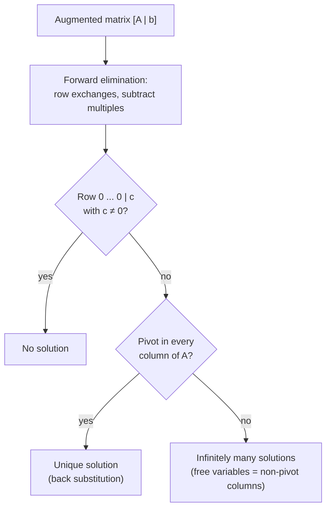

---
aliases:
  - Row Reduction
  - Gauss-Jordan Elimination
  - Row Echelon Form
  - Reduced Row Echelon Form
  - RREF
  - Partial Pivoting
  - Back Substitution
  - Élimination de Gauss
  - Pivot de Gauss
tags:
  - type/algorithm
  - domain/mathematics
  - domain/computer-science
  - level/L1
  - level/L2
  - level/L3
mastery: 0
prerequisites:
  - "[[System of Linear Equations]]"
  - "[[Matrix]]"
  - "[[Matrix Multiplication]]"
  - "[[Big O Notation]]"
related:
  - "[[Inverse Matrix]]"
  - "[[LU Decomposition]]"
  - "[[Matrix Rank]]"
  - "[[Determinant]]"
  - "[[Fundamental Theorem of Linear Algebra]]"
  - "[[Floating-Point Arithmetic]]"
  - "[[Numerical Linear Algebra]]"
  - "[[Stoichiometric Matrix]]"
projects: []
sources:
  - "[[Introduction to Linear Algebra (Strang)]]"
  - "[[MIT 18.06SC - Linear Algebra]]"
  - "[[Orth 2010 - What Is Flux Balance Analysis]]"
---

# Gaussian Elimination

> [!abstract]
> Gaussian elimination solves $Ax = b$ by subtracting multiples of equations from one another until the system is triangular, then solving from the bottom up; along the way it reveals whether there are no solutions, one, or infinitely many.

## Problem

- **Input**: an $m \times n$ matrix $A$ and a right-hand side $b \in \mathbb{R}^m$, stored together as the augmented matrix $[A \mid b]$.
- **Output**: an echelon form of $[A \mid b]$ and its pivot columns; from them, the verdict (no solution, a unique solution, infinitely many), one solution when it exists, and the free variables that parametrize all of them.[^strang][^1806]
- **Biological use**: any linear system of the previous note. Reducing a stoichiometric matrix $S$ shows which fluxes are free in the steady-state equations $Sv = 0$[^orth] (Exercise 3); the normal equations of regression and of expression deconvolution are small square systems solved this way ([[System of Linear Equations]], [[Inverse Matrix]]).

## Intuition

Use the first equation to remove $x_1$ from all the others, the new second equation to remove $x_2$ from those below, and so on: each step leaves a smaller system with one unknown fewer. At the end the last equation has one unknown, the one above it two, and back substitution climbs up. The moves used (swap two equations, scale one, subtract a multiple of one from another) can all be undone, so they never change the set of solutions.[^strang] If at some point an equation reads $0 = 5$, there is no solution; if an unknown never gets a pivot, it stays free.

## Mathematical formulation

**Row operations.** (i) exchange two rows; (ii) multiply a row by $c \ne 0$; (iii) replace row $i$ by row $i$ minus $\ell$ times row $k$. Each is multiplication on the left by an invertible elementary matrix $E$, and $Ax = b \iff EAx = Eb$, so solution sets are preserved.[^strang]

**Elimination step.** With pivot $a_{kk} \ne 0$ in column $k$, for each row $i > k$ the **multiplier** is
$$\ell_{ik} = \frac{a_{ik}}{a_{kk}}, \qquad \text{row}_i \leftarrow \text{row}_i - \ell_{ik}\,\text{row}_k,$$
which puts a zero at $(i, k)$. A zero pivot calls for a row exchange with a lower row that has a nonzero entry in that column; if there is none, the column has no pivot.[^strang]

**Echelon form.** The result $U$ has a staircase shape: each row's first nonzero entry (its **pivot**) lies to the right of the pivot above it, and zero rows are at the bottom. In **reduced** row echelon form (RREF) every pivot is 1 and is the only nonzero entry of its column.[^strang]

**Reading the verdict.** Let $r$ be the number of pivots in the $A$ part ([[Matrix Rank]]). A row $[\,0 \;\cdots\; 0 \mid c\,]$ with $c \ne 0$ means $0 = c$: **no solution**. Otherwise, $r = n$ (a pivot in every column) gives a **unique solution** by back substitution, and $r < n$ gives **infinitely many**: the $n - r$ non-pivot columns are free variables, and each choice of their values gives one solution.



## Algorithm

```text
ELIMINATE([A | b]):                      # m rows, n unknowns
    r ← 0;  pivots ← []
    for c in 0 .. n-1:
        if r = m: stop
        p ← row index ≥ r with largest |entry| in column c     # partial pivoting
        if entry (p, c) is zero (within tolerance): continue    # free column
        swap rows r and p
        for i in r+1 .. m-1:
            ℓ ← entry(i, c) / entry(r, c)
            row_i ← row_i − ℓ · row_r
        append c to pivots;  r ← r + 1
    return echelon matrix, pivots

SOLVE:
    if a row below the last pivot has a nonzero right-hand side: return "none"
    free variables ← 0;  back-substitute pivot rows from the bottom up:
        x[c_i] ← (b_i − Σ_{j > c_i} u_ij x_j) / u_{i c_i}
    return ("unique" if no free column else "infinite"), x, free columns
```

## Complexity

Eliminating below pivot $k$ of an $n \times n$ system updates $(n - k)$ rows of $(n - k + 1)$ entries (including $b$); the total is $\sum_{k=1}^{n} (n - k)(n - k + 1) = \sum_{j=0}^{n-1} (j^2 + j) = \frac{(n-1)n(2n-1)}{6} + \frac{(n-1)n}{2} = \frac{n^3 - n}{3}$ multiply-subtract pairs, about $n^3/3$ ([[Summation Notation]]). Back substitution costs about $n^2/2$.[^strang]

| | Time | Space |
|---|---|---|
| Gaussian elimination, dense $n \times n$, one $b$ | $\approx n^3/3$ multiply-subtracts: $\Theta(n^3)$ | $\Theta(n^2)$, in place |
| Back substitution | $\approx n^2/2$: $\Theta(n^2)$ | $\Theta(n)$ extra |
| LU factorization, then $k$ right-hand sides | $\Theta(n^3) + k\,\Theta(n^2)$ | $\Theta(n^2)$ |

Doubling $n$ multiplies the work by 8, tripling it by 27: $(n^3 - n)/3$ = 330, 333,300 and 333,333,000 steps for $n$ = 10, 100, 1000.

## Implementation

Exact arithmetic with `fractions.Fraction` makes the zero tests exact and the hand computations reproducible; the same code runs in floating point with a tolerance.

```python
from fractions import Fraction


def row_echelon(M, tol=0):
    """Forward elimination with partial pivoting on an augmented matrix [A | b].

    Returns the echelon form and the list of pivot columns. M is not modified.
    """
    R = [row[:] for row in M]
    m, n = len(R), len(R[0]) - 1          # n unknowns; last column is b
    pivots, r = [], 0
    for c in range(n):
        if r == m:
            break
        p = max(range(r, m), key=lambda i: abs(R[i][c]))   # largest candidate pivot
        if abs(R[p][c]) <= tol:
            continue                                         # no pivot: free column
        R[r], R[p] = R[p], R[r]
        for i in range(r + 1, m):
            f = R[i][c] / R[r][c]                            # multiplier l_ic
            R[i] = [a - f * b for a, b in zip(R[i], R[r])]
        pivots.append(c)
        r += 1
    return R, pivots


def solve(A, b, exact=True):
    """Classify Ax = b and return (kind, x, free_columns); free variables are set to 0."""
    num = Fraction if exact else float
    tol = 0 if exact else 1e-12
    M = [[num(a) for a in row] + [num(bi)] for row, bi in zip(A, b)]
    R, pivots = row_echelon(M, tol)
    n = len(A[0])
    for row in R[len(pivots):]:                 # rows below the last pivot: 0 = rhs
        if abs(row[-1]) > tol:
            return "none", None, None
    x = [num(0)] * n
    for i in reversed(range(len(pivots))):      # back substitution
        c = pivots[i]
        s = R[i][-1] - sum(R[i][j] * x[j] for j in range(c + 1, n))
        x[c] = s / R[i][c]
    free = [c for c in range(n) if c not in pivots]
    return ("unique" if not free else "infinite"), x, free


show = lambda x: None if x is None else [str(v) for v in x]
cases = {
    "unique":   ([[2, 1, -1], [-3, -1, 2], [-2, 1, 2]], [8, -11, -3]),
    "none":     ([[1, 1], [2, 2]], [1, 3]),
    "infinite": ([[1, 2, 1], [2, 4, 3]], [4, 9]),
}
for name, (A, b) in cases.items():
    kind, x, free = solve(A, b)
    print(name, kind, show(x), free)

import numpy as np
print(np.linalg.solve(np.array(cases["unique"][0], float), np.array(cases["unique"][1], float)))
try:
    np.linalg.solve(np.array([[1.0, 1.0], [2.0, 2.0]]), np.array([1.0, 3.0]))
except np.linalg.LinAlgError as e:
    print("LinAlgError:", e)
```

```text
unique unique ['2', '3', '-1'] []
none none None None
infinite infinite ['3', '0', '1'] [1]
[ 2.  3. -1.]
LinAlgError: Singular matrix
```

For the infinite case, the free variable $x_2$ was set to 0, giving the particular solution $(3, 0, 1)$; all solutions are $(3 - 2t, t, 1)$. `np.linalg.solve` only accepts square, invertible systems: it raises an error instead of classifying.

## Worked example

> [!example] Elimination by hand, without row exchanges
> $2x + y - z = 8$, $\;-3x - y + 2z = -11$, $\;-2x + y + 2z = -3$.
> ```text
> [  2   1  -1 |   8 ]      R2 ← R2 + (3/2) R1      [ 2   1    -1  |  8 ]
> [ -3  -1   2 | -11 ]      R3 ← R3 + 1 · R1        [ 0  1/2  1/2  |  1 ]
> [ -2   1   2 |  -3 ]                              [ 0   2     1  |  5 ]
>
>                           R3 ← R3 − 4 · R2        [ 2   1    -1  |  8 ]
>                                                   [ 0  1/2  1/2  |  1 ]
>                                                   [ 0   0    -1  |  1 ]
> ```
> 1. **Multipliers**: column 1 has pivot 2, $\ell_{21} = -3/2$, $\ell_{31} = -1$; column 2 has pivot $1/2$, $\ell_{32} = 2/(1/2) = 4$.
> 2. **Pivots** $2, \tfrac12, -1$: three pivots for three unknowns, so a unique solution.
> 3. **Back substitution**: $-z = 1 \Rightarrow z = -1$; $\tfrac12 y + \tfrac12(-1) = 1 \Rightarrow y = 3$; $2x + 3 + 1 = 8 \Rightarrow x = 2$.
> 4. **Check**: $-3(2) - 3 + 2(-1) = -11$ and $-2(2) + 3 + 2(-1) = -3$. The code above, which exchanges rows to use the largest pivot, reaches a different echelon form (pivots $-3, \tfrac53, \tfrac15$) and the same solution $(2, 3, -1)$. The product of the pivots, $2 \cdot \tfrac12 \cdot (-1) = -1$, is the [[Determinant]] of $A$ (up to sign when rows are exchanged).[^strang]

## Limitations

> [!warning] Small pivots in floating point
> In exact arithmetic any nonzero pivot works. In floating point a tiny pivot creates huge multipliers that wipe out the other information ([[Floating-Point Arithmetic]]). For $10^{-20}x + y = 1$, $x + y = 2$ (solution very close to $(1, 1)$):
> ```python
> def naive_float_solve_2(A, b):
>     """Elimination WITHOUT row exchange, in floats (for comparison)."""
>     l = A[1][0] / A[0][0]
>     a22 = A[1][1] - l * A[0][1]
>     b2 = b[1] - l * b[0]
>     x2 = b2 / a22
>     return [(b[0] - A[0][1] * x2) / A[0][0], x2]
>
> A, b = [[1e-20, 1], [1, 1]], [1, 2]
> print(naive_float_solve_2(A, b), solve(A, b, exact=False)[1])
> ```
> ```text
> [0.0, 1.0] [1.0, 1.0]
> ```
> Without exchange, $x = 0$: completely wrong. Partial pivoting (taking the largest entry of the column as pivot) fixes this case and is what standard solvers do.[^strang]

> [!warning] Zero tests and rank are fragile in floats
> Deciding that an entry is "zero" needs a tolerance, so the verdict "no solution" versus "infinitely many" can flip with rounding. For nearly singular matrices, even a pivoted solve loses accuracy in proportion to the condition number ([[Inverse Matrix]]); rank is better judged with the [[Singular Value Decomposition]].

> [!warning] Cost and fill-in
> $\Theta(n^3)$ time makes dense elimination impractical for very large $n$. On sparse matrices (genome-scale stoichiometric matrices, graphs), elimination creates nonzeros where there were zeros (fill-in), destroying the sparsity that made the problem tractable; iterative methods that only multiply by $A$ (such as conjugate gradients) avoid this ([[Sparse Matrix]], [[Numerical Linear Algebra]]).

## Variants and successors

- **Gauss-Jordan elimination** (L2): continue upward to reach the RREF; applied to $[A \mid I]$ it produces $A^{-1}$ ([[Inverse Matrix]]).
- **[[LU Decomposition]]** (L2): store the multipliers in a lower triangular $L$ to factor $PA = LU$ ($P$ records the row exchanges, $U$ is the echelon form) once, then solve each new right-hand side in $\Theta(n^2)$.[^strang]
- **Other factorizations**: Cholesky, $A = LL^\top$, for symmetric positive definite matrices such as covariance matrices (L3, [[Positive Definite Matrix]]); QR, an orthogonal factorization and the stable route to [[Least Squares]] (L2-L3, [[QR Decomposition]]).

## Exercises

> [!question] Exercise 1 (L1)
> Solve by elimination and back substitution: $x + y + z = 6$, $2y + 5z = -4$, $2x + 5y - z = 27$.

> [!success]- Solution
> $R_3 \leftarrow R_3 - 2R_1$: $3y - 3z = 15$. $R_3 \leftarrow R_3 - \tfrac32 R_2$: $-3z - \tfrac{15}{2}z = 15 + 6$, i.e. $-\tfrac{21}{2}z = 21$, $z = -2$. Then $2y - 10 = -4 \Rightarrow y = 3$, and $x = 6 - 3 + 2 = 5$. `solve` returns `['5', '3', '-2']`.

> [!question] Exercise 2 (L1)
> Classify $x + y + z = 6$, $x + 2y + 3z = 14$, $2x + 3y + 4z = c$ for $c = 20$ and $c = 21$.

> [!success]- Solution
> Row 3 minus rows 1 and 2 gives $0 = c - 20$. For $c = 20$, two pivots and one free variable: infinitely many solutions; `solve` returns `'infinite'`, the particular solution $(-2, 8, 0)$ and free column `[2]`, so all solutions are $(-2 + t, 8 - 2t, t)$. For $c = 21$, the row $0 = 1$ appears: no solution.

> [!question] Exercise 3 (L2)
> Reduce the stoichiometric matrix of the toy network of [[System of Linear Equations]], $S = \begin{pmatrix} 1 & -1 & 0 & -1 \\ 0 & 1 & -1 & 0 \end{pmatrix}$, to RREF and read off a basis of the solutions of $Sv = 0$ (the steady-state flux directions).

> [!success]- Solution
> One operation, $R_1 \leftarrow R_1 + R_2$, gives the RREF $\begin{pmatrix} 1 & 0 & -1 & -1 \\ 0 & 1 & -1 & 0 \end{pmatrix}$: pivots in columns 1 and 2, free variables $v_3, v_4$. The rows read $v_1 = v_3 + v_4$ and $v_2 = v_3$. Setting $(v_3, v_4) = (1, 0)$ and then $(0, 1)$ gives the basis $(1, 1, 1, 0)$ (uptake, conversion to $B$, secretion of $B$) and $(1, 0, 0, 1)$ (uptake and direct secretion of $A$): the two routes through the network. `solve(S, [0, 0])` finds the pivots $[0, 1]$ and free columns `[2, 3]`, the same split. Every steady state is a combination of the two routes ([[Fundamental Theorem of Linear Algebra]]).

> [!question] Exercise 4 (L3)
> Explain, with numbers, why the naive solve of $10^{-20}x + y = 1$, $x + y = 2$ returns $x = 0$, and why exchanging the rows fixes it.

> [!success]- Solution
> The multiplier is $\ell = 10^{20}$. The new second row is $(1 - 10^{20})y = 2 - 10^{20}$; in double precision both sides round to $-10^{20}$, so $y = 1$ exactly. Back substitution then computes $x = (1 - y)/10^{-20} = 0$: the information about $x$ was lost in the rounding. With rows exchanged, the pivot is 1, the multiplier $10^{-20}$, the second row becomes $(1 - 10^{-20})y = 1 - 2 \cdot 10^{-20}$, which rounds to $y = 1$, and $x = 2 - y = 1$, correct to machine precision.

## Mastery checklist

- [ ] 1 Recognized: I can state what elimination does and name the three row operations.
- [ ] 2 Understood: I can reduce a system to echelon form by hand and read off whether it has 0, 1 or infinitely many solutions.
- [ ] 3 Practiced: I implemented elimination with partial pivoting, back substitution and RREF in pure Python, tested on all three cases, and matched NumPy.
- [ ] 4 Applied: I reduced the stoichiometric matrix of a real pathway and interpreted its free fluxes, or solved real normal equations and checked residuals.
- [ ] 5 Explained: I can explain the $n^3/3$ cost, why pivoting is needed in floating point, and when LU, QR or iterative methods should replace plain elimination.

## References

[^strang]: [[Introduction to Linear Algebra (Strang)]], 6th ed. (2023).
[^1806]: [[MIT 18.06SC - Linear Algebra]], Unit I "Ax = b and the Four Subspaces" (systems and elimination).
[^orth]: [[Orth 2010 - What Is Flux Balance Analysis]], *Nature Biotechnology*.
