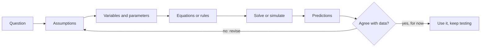

---
aliases:
  - Model (Mathematics)
  - Deterministic Model
  - Stochastic Model
  - Mechanistic Model
  - Modèle mathématique
tags:
  - type/concept
  - domain/mathematics
  - domain/biology
  - level/L1
  - level/L2
  - level/L3
mastery: 0
prerequisites:
  - "[[Function]]"
  - "[[Exponential Function]]"
  - "[[Derivative]]"
related:
  - "[[Exponential Growth]]"
  - "[[Scientific Model]]"
  - "[[Statistical Model]]"
  - "[[Ordinary Differential Equation]]"
  - "[[Discrete-Time Model]]"
  - "[[Stochastic Process]]"
  - "[[Euler Method]]"
  - "[[Model Calibration]]"
  - "[[Sensitivity Analysis]]"
  - "[[Parameter Identifiability]]"
  - "[[Model Selection]]"
  - "[[Falsifiability]]"
projects:
  - "[[07-evolution-simulator]]"
sources:
  - "[[Mathematical Biology (Murray)]]"
  - "[[Nonlinear Dynamics and Chaos (Strogatz)]]"
  - "[[MIT 18.03SC - Differential Equations]]"
  - "[[MIT 8.591J - Systems Biology]]"
  - "[[Principles of Population Genetics (Hartl)]]"
  - "[[The Logic of Scientific Discovery (Popper)]]"
  - "[[Platt 1964 - Strong Inference]]"
---

# Mathematical Model

> [!abstract]
> A mathematical model turns a question about a system into explicit assumptions, variables and equations, whose solutions are predictions that data can contradict; deciding whether it should be deterministic or stochastic, discrete or continuous is part of building it.

## Definition

A **mathematical model** of a system is a set of **variables** and of **relations** between them (equations or update rules), derived from explicit **assumptions** about how the system works, with **parameters** that are fixed within one situation; solving or simulating it yields **predictions** that can be compared with observations.[^murray][^1803] A model is **deterministic** when the same parameters and initial state always give the same outcome, and **stochastic** when the outcome is a probability distribution; it is **discrete** or **continuous** in time according to whether it advances by steps or through a derivative.[^murray][^strogatz]

## Why it matters

- **Every analysis assumes a model.** A doubling time assumes [[Exponential Growth]]; a qPCR fold change assumes a constant amplification efficiency; a phylogeny assumes a [[Nucleotide Substitution Model]]; a differential-expression test assumes a count distribution ([[Negative Binomial Distribution]]). Writing the model down tells you what can go wrong.
- **Parameters are the results.** Half-lives, rate constants, growth rates and the reproduction number of an epidemic are parameters of models fitted to data ([[Model Calibration]]).
- **Simulations are model runs.** A simulator is a stochastic model executed many times; [[07-evolution-simulator]] compares a stochastic population model with its deterministic counterpart, and systems biology asks when molecular noise changes cell behavior.[^8591]

## Core (L1)

### From question to prediction



The assumptions are the model; everything after them is mathematics. A model is judged by whether it answers its question, not by how much biology it contains.

| Term | Meaning | Example: an mRNA after transcription stops |
|---|---|---|
| Independent variable | what the state depends on, usually time | $t$, hours since the stop |
| State variable | what the model predicts | $M(t)$, number of molecules |
| Parameter | constant in one experiment, estimated from data | decay constant $k$ (h⁻¹) |
| Initial condition | the state at the start | $M(0) = M_0$ |
| Equation | how the state changes | $dM/dt = -kM$ |
| Prediction | a consequence that data can contradict | $\ln M$ falls linearly in $t$; half-life $\ln 2 / k$ |

### Four choices

| Choice | One side | Other side |
|---|---|---|
| Randomness | **deterministic**: one outcome | **stochastic**: a distribution of outcomes |
| Time | **discrete**: steps (generations, PCR cycles) | **continuous**: derivatives, any $t$ |
| State | continuous (concentrations) | discrete (counts of molecules or individuals) |
| Origin | **mechanistic**: derived from how the system works | **phenomenological**: a curve chosen to describe data |

Crossing the first two choices gives four families, all used in biology:

| | Discrete time | Continuous time |
|---|---|---|
| **Deterministic** | PCR copies $N_{n+1} = (1 + E) N_n$; allele frequencies under selection ([[Discrete-Time Model]]) | $dN/dt = rN$ ([[Exponential Growth]]); enzyme kinetics ([[Ordinary Differential Equation]]) |
| **Stochastic** | genetic drift as random sampling of each generation ([[Wright-Fisher Model]])[^hartl] | random births, deaths and reactions in continuous time ([[Stochastic Process]], [[Gillespie Algorithm]]); stochastic gene expression[^8591] |

### When randomness matters

Deterministic models describe averages over many molecules or cells. With few of them, chance dominates: in the simulation below, after two half-lives 20 starting mRNAs leave $5 \pm 2$ molecules (relative spread about 40 %), whereas 2000 leave $500 \pm 19$ (4 %). For independent events the relative spread shrinks like $1/\sqrt{N}$ (Mathematical representation), so the deterministic model is a good summary only when the numbers are large.

## Deeper (L2)

**Units first.** Every term of an equation must have the same units, and the argument of an exponential or a logarithm must be dimensionless: $e^{t}$ with $t$ in hours is meaningless, $e^{-kt}$ with $k$ in h⁻¹ is not. A dimensional check catches most errors in a new model ([[Dimensional Analysis]], [[Nondimensionalization]]).

**Solving.** Linear models often have closed-form solutions; most others are solved numerically. **Euler's method** replaces the derivative by a finite difference, $x_{k+1} = x_k + h f(x_k)$, which is itself a discrete-time model whose error shrinks as the step $h$ shrinks ([[Euler Method]]).[^1803] In the simulation below, Euler with $h = 1$ h underestimates the decay result by 17 %, with $h = 0.01$ h by 0.2 %.

**Discrete and continuous descriptions of the same process.** A per-step factor $R$ over steps of length $\Delta t$ and a rate $r$ agree when $r = \ln R / \Delta t$ ([[Exponential Function#Deeper (L2)]]). Which one to use follows the biology: PCR has cycles, a culture with overlapping generations does not.

**Mechanistic or phenomenological.** A mechanistic model has parameters with a physical meaning (a rate constant, a binding affinity) and can be extrapolated to new conditions; a phenomenological curve can describe data well and still say nothing about a new condition. Many useful models mix both.

**Calibration.** Parameters are estimated by making the model's predictions match data, usually by least squares or likelihood ([[Model Calibration]], [[Least Squares]]); the log-scale fit of [[Exponential Growth]] is the simplest case.

## Advanced (L3)

**Testing, not confirming.** A scientific claim must be open to refutation by observation ([[Falsifiability]]),[^popper] and a good fit does not prove the assumptions: over a short time window, a single exponential decay and a mixture of a fast and a slow mRNA population can fit the same points. Strong inference asks for alternative hypotheses and an experiment whose outcome excludes some of them;[^platt] here, sampling at late times, where the two models diverge. Formal comparison of fitted models, with a penalty for extra parameters, is [[Model Selection]].

**Identifiability.** In the birth-death model (each individual divides at rate $b$ and dies at rate $d$), the mean population is $N_0 e^{(b-d)t}$ (Mathematical representation): counts of the mean determine $b - d$ but not $b$ and $d$ separately. The parameters are **not identifiable** from such data ([[Parameter Identifiability]]). Fluctuations carry the missing information: two populations with the same $b - d$ but larger $b + d$ have the same mean and a wider spread (Exercise 6).

**Sensitivity.** How much a prediction moves when a parameter moves is measured by the relative sensitivity $\partial \ln y / \partial \ln \theta$. For the half-life $T_{1/2} = \ln 2 / k$, it is $-1$: a 10 % error in $k$ gives a 10 % error in the half-life ([[Sensitivity Analysis]]).

## Mathematical representation

- **Deterministic, continuous time**: state $x(t) \in \mathbb{R}^n$, parameters $\theta \in \mathbb{R}^p$, $\dfrac{dx}{dt} = f(x, \theta)$, $x(0) = x_0$.
- **Deterministic, discrete time**: $x_{t+1} = F(x_t, \theta)$, $t = 0, 1, 2, \dots$
- **Stochastic**: the state $X_t$ is a random variable with transition probabilities $P(X_{t + \Delta t} = y \mid X_t = x)$ ([[Stochastic Process]]).
- **Observation model**: data $y_i = h(x(t_i; \theta)) + \varepsilon_i$ are noisy measurements of the state; calibration estimates $\theta$ from the $y_i$.
- **Mean of a birth-death process.** In a short interval $\Delta t$, each of the $N$ individuals divides with probability $b\,\Delta t$ and dies with probability $d\,\Delta t$, so $E[N(t + \Delta t) - N(t) \mid N(t)] = (b - d) N(t)\, \Delta t$. Taking expectations and letting $\Delta t \to 0$: $\dfrac{d}{dt} E[N] = (b - d)\, E[N]$, hence $E[N(t)] = N_0 e^{(b-d)t}$. The deterministic model is the mean of the stochastic one.
- **Extinction.** Let $q$ be the probability that the descendants of one individual eventually die out. Its first event is a death with probability $d/(b+d)$, or a division with probability $b/(b+d)$, after which both daughter lineages must die out: $q = \frac{d}{b+d} + \frac{b}{b+d} q^2$, whose roots are $1$ and $d/b$. For $b > d$, $q = d/b$, and $N_0$ independent lineages all die out with probability $(d/b)^{N_0}$.
- **Relative spread.** If each of $M_0$ molecules survives independently with probability $p$, the survivors are $\mathrm{Binomial}(M_0, p)$, with coefficient of variation $\sqrt{(1 - p)/(M_0 p)}$, proportional to $1/\sqrt{M_0}$ ([[Binomial Distribution]]).

## Computational representation

One assumption set, three implementations: the exact solution, Euler's discrete approximation, and a stochastic simulation of individual molecules.

```python
import math
import random
from statistics import mean, pstdev

K = math.log(2) / 3.0           # first-order decay constant for a 3 h half-life (invented)
T_END = 6.0                     # hours after transcription is stopped


def exact(m0: float, t: float) -> float:
    """Continuous, deterministic: dM/dt = -K M  =>  M(t) = M0 exp(-K t)."""
    return m0 * math.exp(-K * t)


def euler(m0: float, t_end: float, h: float) -> float:
    """Discrete-time approximation of the same ODE: M <- M + h * (-K M)."""
    m = m0
    for _ in range(round(t_end / h)):
        m += h * (-K * m)
    return m


def stochastic(m0: int, t_end: float, rng: random.Random) -> int:
    """Discrete molecules, stochastic: each survives independently with probability exp(-K t)."""
    p = math.exp(-K * t_end)
    return sum(rng.random() < p for _ in range(m0))


print(f"exact      M(6 h) = {exact(2000, T_END):.1f}")
for h in (1.0, 0.1, 0.01):
    print(f"Euler h={h:<4} M(6 h) = {euler(2000, T_END, h):.1f}")

rng = random.Random(1)
p = math.exp(-K * T_END)
for m0 in (20, 2000):
    runs = [stochastic(m0, T_END, rng) for _ in range(2000)]
    cv = pstdev(runs) / mean(runs)
    print(f"M0 = {m0:4d}: mean {mean(runs):7.2f}, CV {cv:.3f} (binomial CV {math.sqrt((1 - p) / (m0 * p)):.3f})")
```

```text
exact      M(6 h) = 500.0
Euler h=1.0  M(6 h) = 413.4
Euler h=0.1  M(6 h) = 491.9
Euler h=0.01 M(6 h) = 499.2
M0 =   20: mean    5.06, CV 0.394 (binomial CV 0.387)
M0 = 2000: mean  500.99, CV 0.038 (binomial CV 0.039)
```

The stochastic means agree with the deterministic prediction ($M_0/4$ after two half-lives); the spread is the information the deterministic model throws away.

## Worked example

> [!example] Modeling the decay of an mRNA (invented data)
> 1. **Question**: how stable is the mRNA of gene X?
> 2. **Assumptions**: transcription is stopped at $t = 0$; each molecule is degraded independently at a constant rate $k$; there are many molecules; the measured level is proportional to the number of molecules.
> 3. **Model**: $dM/dt = -kM$, $M(0) = M_0$, so $M(t) = M_0 e^{-kt}$. **Prediction**: $\ln M$ is a straight line of slope $-k$, and the half-life $\ln 2 / k$ does not depend on $M_0$.
> 4. **Data**: relative levels 1.00, 0.80, 0.62, 0.40, 0.16 at 0, 1, 2, 4 and 8 h; logarithms 0, −0.223, −0.478, −0.916, −1.833. The least-squares slope is $-0.229$ h⁻¹, so $T_{1/2} = 0.693 / 0.229 \approx 3.0$ h.
> 5. **Test**: the points lie close to the line. Had they bent (fast early, slow late), the assumption of one population with one $k$ would be refuted, and a two-population model would be the next candidate, to be tested with later time points.

## Common misconceptions

> [!warning] "A model that fits the data is true"
> Fitting is necessary, not sufficient: other models may fit as well. A model gains credibility from predictions that could have failed and did not.[^popper]

> [!warning] "More detail makes a better model"
> Every added mechanism adds parameters that data must determine; unidentifiable parameters make predictions less reliable, not more. The right level of detail is set by the question.

> [!warning] "Stochastic models are for noisy data"
> Measurement noise belongs to the observation model. A stochastic model describes randomness in the system itself, such as which molecule degrades next, which matters when numbers are small.

> [!warning] "The ODE solution and the numerical output are the same thing"
> A numerical scheme is a discrete approximation with its own error, which depends on the step size (Exercise 4).

## Exercises

> [!question] Exercise 1 (L1)
> Classify as deterministic or stochastic, discrete or continuous in time: (a) $N_{n+1} = 1.9\,N_n$ for PCR; (b) $dC/dt = -kC$ for a drug in plasma; (c) a simulation where each of 100 cells divides with probability 0.3 per hour; (d) the Wright-Fisher model; (e) an event-by-event simulation of a gene with 5 mRNA copies.

> [!success]- Solution
> (a) deterministic, discrete; (b) deterministic, continuous; (c) stochastic, discrete (hourly steps); (d) stochastic, discrete (generations); (e) stochastic, continuous time (events at random times, [[Gillespie Algorithm]]).

> [!question] Exercise 2 (L1)
> A protein is made from its mRNA and degraded: $dP/dt = k_s M - k_d P$, with $M$ and $P$ in molecules per cell and $t$ in hours. Name the independent variable, the state variable(s), the parameters, and give the units of each parameter.

> [!success]- Solution
> Independent: $t$. State: $P$ (and $M$ if it also changes; here it is an input). Parameters: $k_s$ in proteins per mRNA per hour, $k_d$ in h⁻¹. Check: $k_s M$ and $k_d P$ are both molecules per hour, like $dP/dt$.

> [!question] Exercise 3 (L2)
> A student proposes $N(t) = N_0 e^{t}$ for a culture, with $t$ in hours, and later $dN/dt = rN + K$. What is wrong with the first formula, and what are the units of $K$?

> [!success]- Solution
> The exponent must be dimensionless: $e^{t}$ silently fixes the rate at 1 h⁻¹ and changes meaning if $t$ is in minutes; write $e^{rt}$. In the second, $K$ must have the units of $dN/dt$, cells per hour: a constant inflow of cells (immigration, or an inoculation pump), a new assumption that must be justified.

> [!question] Exercise 4 (L2, Python)
> Apply Euler's method to $dN/dt = N$, $N(0) = 1$, up to $t = 1$, with $h = 0.5$, 0.1, 0.01 and 0.001. How does the error at $t = 1$ scale with $h$?

> [!success]- Solution
> ```python
> for h in (0.5, 0.1, 0.01, 0.001):
>     n = 1.0
>     for _ in range(round(1 / h)):
>         n += h * n
>     print(h, round(n, 5), round(math.e - n, 5), round((math.e - n) / h, 3))
> # 0.5 2.25 0.46828 0.937
> # 0.1 2.59374 0.12454 1.245
> # 0.01 2.70481 0.01347 1.347
> # 0.001 2.71692 0.00136 1.358
> ```
> Euler computes $(1 + h)^{1/h}$, which tends to $e$. The error divided by $h$ settles near $e/2 \approx 1.359$: the error is proportional to $h$ (a first-order method), so ten times more steps buys one more correct digit.

> [!question] Exercise 5 (L3)
> A cell line is counted every day and grows as $N_0 e^{0.5 t}$ (t in days). Can you tell whether cells divide at rate 1.0 and die at 0.5 per day, or divide at 2.0 and die at 1.5? Which measurements would decide?

> [!success]- Solution
> Not from mean counts: both give $b - d = 0.5$ per day, so $b$ and $d$ are not identifiable from them. Deciding requires data that depend on $b$ or $d$ separately: counts of dead cells, single-cell lineage tracking (divisions observed directly), a division marker, or the variability between small replicate populations, which grows with $b + d$ (Exercise 6).

> [!question] Exercise 6 (L3, Python)
> Simulate the birth-death process from $N_0 = 10$ up to $t = 4$ for $(b, d) = (1.0, 0.5)$ and $(2.0, 1.5)$, 2000 runs each. Compare mean, standard deviation and fraction extinct with the deterministic mean and with $(d/b)^{N_0}$.

> [!success]- Solution
> ```python
> def birth_death(n0: int, b: float, d: float, t_end: float, rng: random.Random) -> int:
>     n, t = n0, 0.0
>     while n > 0:
>         t += rng.expovariate((b + d) * n)          # waiting time to the next event
>         if t > t_end:
>             break
>         n += 1 if rng.random() < b / (b + d) else -1
>     return n
>
> rng = random.Random(7)
> for b, d in ((1.0, 0.5), (2.0, 1.5)):
>     runs = [birth_death(10, b, d, 4.0, rng) for _ in range(2000)]
>     print(f"b={b}, d={d}: mean {mean(runs):6.1f} (ODE {10 * math.exp((b - d) * 4):.1f}), "
>           f"SD {pstdev(runs):5.1f}, extinct {sum(r == 0 for r in runs) / len(runs):.3f} "
>           f"((d/b)^10 = {(d / b) ** 10:.3f})")
> # b=1.0, d=0.5: mean   73.9 (ODE 73.9), SD  37.7, extinct 0.000 ((d/b)^10 = 0.001)
> # b=2.0, d=1.5: mean   74.3 (ODE 73.9), SD  59.8, extinct 0.042 ((d/b)^10 = 0.056)
> ```
> Both means match the ODE, as derived. The faster turnover gives a 60 % wider spread and visible extinctions, approaching the eventual-extinction probability $(0.75)^{10} \approx 0.056$; some lineages still small at $t = 4$ have not yet died out. The waiting time between events is exponential with rate $(b + d)N$, the event-by-event logic of the [[Gillespie Algorithm]].

## Mastery checklist

- [ ] 1 Recognized: I can name the parts of a model (assumptions, variables, parameters, equations, predictions) and the deterministic/stochastic and discrete/continuous distinctions.
- [ ] 2 Understood: I can explain why the assumptions are the model, when randomness matters, and why a good fit does not prove a model.
- [ ] 3 Practiced: I can write a small model from a question, check its units, and implement it exactly, with Euler's method and stochastically in Python.
- [ ] 4 Applied: I built and tested a model against real data, or ran the stochastic and deterministic versions in [[07-evolution-simulator]].
- [ ] 5 Explained: I can teach identifiability, sensitivity and model testing with an example, including how a deterministic model arises as the mean of a stochastic one.

## References

[^murray]: [[Mathematical Biology (Murray)]], 3rd ed. (2002), Volume I: models built from biological questions, mainly with ordinary differential equations, continuous and discrete population models.
[^strogatz]: [[Nonlinear Dynamics and Chaos (Strogatz)]], 3rd ed. (2024): flows (continuous time) and iterated maps (discrete time) with biological examples.
[^1803]: [[MIT 18.03SC - Differential Equations]], Unit I "First Order Differential Equations" (modeling physical systems; Euler's method).
[^8591]: [[MIT 8.591J - Systems Biology]], lecture "Causes and Consequences of Stochastic Gene Expression".
[^hartl]: [[Principles of Population Genetics (Hartl)]], treatment of random genetic drift.
[^popper]: [[The Logic of Scientific Discovery (Popper)]], falsifiability as the criterion of empirical science.
[^platt]: [[Platt 1964 - Strong Inference]], *Science*: alternative hypotheses and crucial experiments that exclude some of them.
