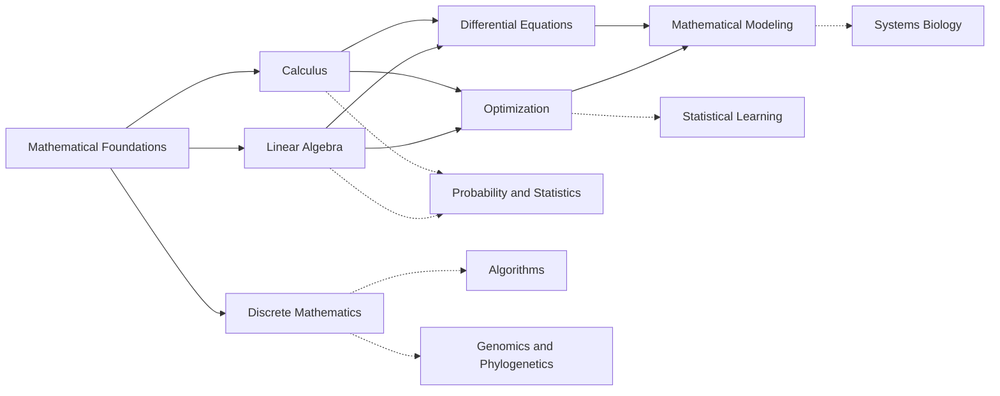

---
aliases:
  - Math
  - Mathématiques
tags:
  - type/moc
  - domain/mathematics
  - level/L1
  - level/L2
  - level/L3
  - level/M1
prerequisites: []
projects:
  - "[[01-dna-engine]]"
  - "[[02-sequence-translation]]"
  - "[[04-alignment-engine]]"
  - "[[05-sequence-search]]"
  - "[[07-evolution-simulator]]"
  - "[[08-phylogenetic-engine]]"
  - "[[10-genomic-pipeline]]"
sources:
  - "[[MIT 18.01SC - Single Variable Calculus]]"
  - "[[MIT 18.02SC - Multivariable Calculus]]"
  - "[[MIT 18.06SC - Linear Algebra]]"
  - "[[MIT 6.042J - Mathematics for Computer Science]]"
  - "[[MIT 18.03SC - Differential Equations]]"
  - "[[Introduction to Linear Algebra (Strang)]]"
  - "[[Mathematics for Computer Science (Lehman)]]"
  - "[[Nonlinear Dynamics and Chaos (Strogatz)]]"
  - "[[Calculus (OpenStax)]]"
  - "[[Carnegie Mellon University - BS Computational Biology]]"
  - "[[Tsinghua University - BS Biological Sciences]]"
  - "[[University of Cambridge - Natural Sciences Tripos]]"
  - "[[Stanford University - BS Biomedical Computation]]"
---

# Mathematics

> [!abstract]
> The mathematics a bioinformatician actually uses, taught just in time: logic and proofs, calculus to multivariable, linear algebra and discrete mathematics in depth, then differential equations, optimization and modeling.

## Why it matters for bioinformatics

- **Linear algebra** is the language of omics data: an expression dataset is a matrix, PCA is an eigen-decomposition, regression is a projection.
- **Discrete mathematics** is the language of sequences and structures: k-mers are counted, phylogenies are trees, assembly is a path in a graph, alignment is a recurrence.
- **Calculus, differential equations and optimization** fit and simulate models: likelihoods are maximized, kinetic and epidemic models are integrated, neural networks are trained by gradients.
- It is also the prerequisite of the whole quantitative track: [[Probability and Statistics]] needs integrals and matrices, [[Algorithms]] needs proofs, counting and graphs.

## Target level and weight

**Target: L2/L3, targeted.** Mathematics is studied to the depth bioinformatics needs, not as a mathematics degree ([[Curriculum]], design principles 1 and 3). Each subdomain MOC attaches its main concepts to the biological problem that uses them ("Bio:" in every learning-path item).

| Weight | Subdomains | Why |
|---|---|---|
| Heavy (20-30 concepts, to L3) | [[Linear Algebra]], [[Discrete Mathematics]] | Matrices and graphs are the two data models of the field |
| Complete to L2 | [[Calculus]] (to gradient, Jacobian, Hessian), [[Mathematical Foundations]] (logic, proofs) | Needed by every other quantitative subject |
| Targeted L2/L3 | [[Differential Equations]], [[Optimization]], [[Mathematical Modeling]] | Needed for systems biology, model fitting and machine learning |

## Subdomains

| MOC | Curriculum stage | Target level | Scope |
|---|---|---|---|
| [[Mathematical Foundations]] | 1 | L1-L2 | Logic, sets, relations, functions, exponential and logarithm, proofs and induction |
| [[Calculus]] | 1 (single variable), 2 (multivariable) | L1-L2 | Limits, derivatives, integrals, series; partial derivatives, gradient, Jacobian, Hessian, multiple integrals |
| [[Linear Algebra]] | 2 (SVD and beyond early in 3) | L1-L3 | Vectors and matrices, elimination, subspaces, least squares, eigenvalues, SVD, matrix exponential |
| [[Discrete Mathematics]] | 1 (counting), 2 (graphs) | L1-L3 | Counting, modular arithmetic, recurrences, graphs, trees, Eulerian paths, state machines |
| [[Differential Equations]] | 3 | L2-M1 | First-order ODEs, numerical solution, fixed points and stability, phase portraits, limit cycles, bifurcations |
| [[Optimization]] | 3 | L2-L3 | Gradient and Newton methods, Lagrange multipliers, convexity, linear and integer programming, heuristics |
| [[Mathematical Modeling]] | 1 (first models), 3 | L1-M1 | Growth, interaction, compartmental and epidemic models; calibration, sensitivity, identifiability |

Solid arrows are dependencies inside the domain; dashed arrows point to the main consumers in other domains.

## Cross-domain prerequisites

- **Before**: secondary-school algebra only. [[Programming]] in Python from Stage 1 is strongly recommended, to check every computation numerically.
- **After** (what this domain unlocks): [[Probability]] (integrals, series, combinatorics), [[Multivariate Analysis]] and [[Linear Models]] (linear algebra), [[Algorithms]] and [[String Algorithms]] (proofs, counting, graphs), [[Physical Chemistry]] and [[Biophysics]] (differential equations), [[Systems Biology]] (modeling, linear programming), [[Statistical Learning]] (optimization), [[Genomics]] and [[Phylogenetics]] (graphs and trees).

## Reference courses and books

| Resource | Kind | Use it for |
|---|---|---|
| [[MIT 18.01SC - Single Variable Calculus]] and [[MIT 18.02SC - Multivariable Calculus]] | Course | [[Calculus]] |
| [[MIT 18.06SC - Linear Algebra]] with [[Introduction to Linear Algebra (Strang)]] | Course and book | [[Linear Algebra]] |
| [[MIT 6.042J - Mathematics for Computer Science]] with [[Mathematics for Computer Science (Lehman)]] | Course and free book | [[Mathematical Foundations]], [[Discrete Mathematics]] |
| [[MIT 18.03SC - Differential Equations]] | Course | [[Differential Equations]] |
| [[Nonlinear Dynamics and Chaos (Strogatz)]] | Book | [[Differential Equations]], [[Mathematical Modeling]] |
| [[Calculus (OpenStax)]] | Free book | Exercises for [[Calculus]] |

## Lab projects

| Project | Mathematics used |
|---|---|
| [[01-dna-engine]] | Counting over the alphabet $\{A, C, G, T\}$ ([[Discrete Mathematics]]) |
| [[02-sequence-translation]] | The codon table as a [[Function]]; frames modulo 3 ([[Modular Arithmetic]]) |
| [[04-alignment-engine]] | Alignment as a longest path in a DAG; optimization by [[Dynamic Programming]] |
| [[05-sequence-search]] | k-mer counting and the [[Pigeonhole Principle]] behind seeds |
| [[07-evolution-simulator]] | Transition matrices ([[Linear Algebra]]) and population models ([[Mathematical Modeling]]) |
| [[08-phylogenetic-engine]] | Trees ([[Tree (Graph Theory)]]), distance matrices, $e^{Qt}$, tree search ([[Optimization]]) |
| [[10-genomic-pipeline]] | Logarithmic quality scores ([[Logarithm]]) |

## References

Weights and order follow the [[Curriculum Benchmark]]. Calculus is required wherever course titles were verified; typical biology degrees require two semesters of calculus plus linear algebra and probability (Tsinghua),[^thu] computational degrees add discrete mathematics (Stanford Biomedical Computation)[^stanford] and include differential equations in the calculus sequence (CMU).[^cmu] First-year mathematics for biologists at Cambridge covers algebra, linear and non-linear differential equations, modeling and matrix algebra.[^cam] The course sequence follows MIT OCW: 18.01SC then 18.02SC,[^1801] 18.06SC in three units,[^1806] 6.042J from proofs to structures,[^6042] 18.03SC after calculus and eigenvalues.[^1803]

[^thu]: [[Tsinghua University - BS Biological Sciences]], mathematics block (16 credits).
[^stanford]: [[Stanford University - BS Biomedical Computation]], mathematics block.
[^cmu]: [[Carnegie Mellon University - BS Computational Biology]], mathematics and statistics core.
[^cam]: [[University of Cambridge - Natural Sciences Tripos]], Part IA Mathematical Biology.
[^1801]: [[MIT 18.01SC - Single Variable Calculus]]; [[MIT 18.02SC - Multivariable Calculus]].
[^1806]: [[MIT 18.06SC - Linear Algebra]].
[^6042]: [[MIT 6.042J - Mathematics for Computer Science]].
[^1803]: [[MIT 18.03SC - Differential Equations]].
