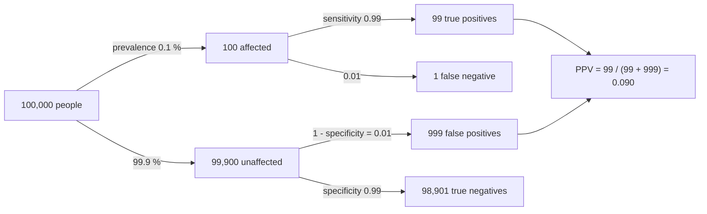

---
aliases:
  - Bayes' Rule
  - Bayes' Formula
  - Bayes Theorem
  - Inverse Probability
  - Théorème de Bayes
  - Formule de Bayes
tags:
  - type/concept
  - domain/statistics
  - domain/mathematics
  - domain/bioinformatics
  - level/L1
  - level/L2
  - level/L3
mastery: 0
prerequisites:
  - "[[Conditional Probability]]"
  - "[[Law of Total Probability]]"
  - "[[Independence (Probability)]]"
related:
  - "[[Sensitivity and Specificity]]"
  - "[[Genotype Likelihood]]"
  - "[[Variant Calling]]"
  - "[[Phred Quality Score]]"
  - "[[Hardy-Weinberg Equilibrium]]"
  - "[[Bayesian Inference]]"
  - "[[Prior Distribution]]"
  - "[[Posterior Distribution]]"
  - "[[Likelihood Function]]"
  - "[[P-Value]]"
  - "[[False Discovery Rate]]"
  - "[[Naive Bayes Classifier]]"
projects:
  - "[[10-genomic-pipeline]]"
sources:
  - "[[Introduction to Probability (Blitzstein)]]"
  - "[[Harvard Stat 110 - Probability]]"
  - "[[MIT 18.05 - Introduction to Probability and Statistics]]"
  - "[[Nielsen 2011 - Genotype and SNP Calling from Next-Generation Sequencing Data]]"
  - "[[Principles of Population Genetics (Hartl)]]"
  - "[[Cock 2010 - The Sanger FASTQ File Format]]"
  - "[[Ioannidis 2005 - Why Most Published Research Findings Are False]]"
  - "[[Benjamini 1995 - Controlling the False Discovery Rate]]"
---

# Bayes' Theorem

> [!abstract]
> Bayes' theorem turns $P(\text{evidence} \mid \text{hypothesis})$, which an assay or an error model supplies, into $P(\text{hypothesis} \mid \text{evidence})$, which is what we want to know. The answer depends on how common the hypothesis was beforehand (the base rate) as much as on the evidence: a 99 % accurate test for a rare condition is wrong about most of its positives.

## Definition

For events $A$ and $B$ with $P(A) > 0$ and $P(B) > 0$,

$$P(A \mid B) = \frac{P(B \mid A)\, P(A)}{P(B)}.$$

$P(A)$ is the **prior** probability of $A$, $P(A \mid B)$ its **posterior** probability once $B$ is observed, and $P(B \mid A)$, the probability of the evidence under the hypothesis, is the **likelihood**.[^blitz2][^1805-bayes] When the hypotheses $A_1, \dots, A_n$ form a partition, the denominator comes from the [[Law of Total Probability]]:

$$P(A_j \mid B) = \frac{P(B \mid A_j)\, P(A_j)}{\sum_{i=1}^{n} P(B \mid A_i)\, P(A_i)}.$$

This is Bayes' rule, used to invert conditional probabilities.[^blitz2][^1805-3]

## Why it matters

- **Genotype calling.** An error model gives $P(\text{reads} \mid \text{genotype})$, the [[Genotype Likelihood]]; a caller must report $P(\text{genotype} \mid \text{reads})$. Probabilistic callers combine likelihoods computed from base qualities with a prior on genotypes and report the most probable genotype with a measure of its confidence; fixed read-count thresholds are unreliable, especially at low depth.[^nielsen] This is the core of [[Variant Calling]] in [[10-genomic-pipeline]].
- **Screening and diagnostic tests.** Sensitivity and specificity describe the test; the probability that a person who tests positive is affected also depends on how common the condition is in the tested population ([[Sensitivity and Specificity]], [[Newborn Screening]], [[Genetic Testing]]).
- **Genome-wide screens.** Among thousands of "significant" genes, variants or peaks, the fraction that are real depends on the proportion of true effects among the tests, the threshold and the power: Ioannidis framed it as the positive predictive value of a research finding.[^ioannidis] See [[False Discovery Rate]] and [[Multiple Testing Correction]].
- **Bayesian statistics** applies the same theorem to parameters, trees and models: [[Bayesian Inference]], [[Bayesian Phylogenetics]], [[Naive Bayes Classifier]].

## Core (L1)

### Inverting a conditional probability

The multiplication rule writes one joint probability in two ways, $P(A \cap B) = P(A)\,P(B \mid A) = P(B)\,P(A \mid B)$ ([[Conditional Probability]]). Dividing by $P(B)$ gives the theorem: it is the multiplication rule read in the other direction, and the tool for obtaining $P(A \mid B)$ when $P(B \mid A)$ is the number available.[^blitz2][^1805-3]

### The recipe: prior, likelihood, multiply, add, divide

1. List the hypotheses, which must form a partition, with their priors.
2. Compute the likelihood of the observed evidence under each hypothesis.
3. Multiply prior by likelihood: the products are the joint probabilities $P(A_i \cap B)$.
4. Add the products: the sum is $P(B)$.
5. Divide each product by the sum: these are the posteriors, and they add up to 1.

Probability trees and tables organize exactly this computation.[^1805-3]

### Bio: positive predictive value of a screening test

Let $D$ be "the person has the condition" and $+$ "the test is positive". The test is described by its **sensitivity** $P(+ \mid D)$ and **specificity** $P(- \mid D^c)$,[^blitz2] the population by the **prevalence** $P(D)$. The **positive predictive value** is the posterior $\mathrm{PPV} = P(D \mid +)$; the same name and formula serve for the probability that a "positive" research finding is true:[^ioannidis]

$$\mathrm{PPV} = \frac{P(+ \mid D)\,P(D)}{P(+ \mid D)\,P(D) + \big(1 - P(- \mid D^c)\big)\big(1 - P(D)\big)}.$$

Invented figures: sensitivity = specificity = 0.99, prevalence 1 in 1,000. In natural frequencies, out of 100,000 people:



Only 9 % of positives are affected: the 1 % false-positive rate applies to a group 999 times larger than the affected one. Answering 0.99 means ignoring the prior, the **base rate fallacy**.[^1805-3] The negative predictive value $P(D^c \mid -) = 98{,}901/98{,}902$ is close to 1, so the same test is excellent for ruling the condition out.

### Bio: posterior probability of a genotype given reads

Take the model of [[Law of Total Probability#Core (L1)]]: a diploid site with reference C and alternative T, Hardy-Weinberg priors $(1-q)^2$, $2q(1-q)$, $q^2$ for CC, CT, TT,[^hartl] each read sampling one chromosome copy at random, and a per-base error probability $e$, each wrong base equally likely ($e = 0.01$ is Phred quality 20).[^cock] Reads are assumed **independent given the genotype**, so the likelihood of a pileup is a product over reads:

$$P(\text{reads} \mid g) = \prod_{i} P(b_i \mid g), \qquad P(T \mid CC) = \tfrac{e}{3}, \quad P(T \mid CT) = \tfrac12 - \tfrac{e}{3}, \quad P(T \mid TT) = 1 - e.$$

For a single read showing T, with $q = 0.1$ and $e = 0.01$, the law of total probability gave $P(T) = 0.1020$, hence

$$P(CT \mid T) = \frac{0.4967 \times 0.18}{0.1020} = 0.876, \qquad P(TT \mid T) = \frac{0.99 \times 0.01}{0.1020} = 0.097, \qquad P(CC \mid T) = \frac{0.00333 \times 0.81}{0.1020} = 0.026.$$

One alternative read makes heterozygosity likely but not certain; the [[#Worked example]] adds reads and changes the prior.

## Deeper (L2)

### Odds form: prior odds times likelihood ratio

Writing the theorem for $A$ and for $A^c$ and dividing cancels $P(B)$:[^blitz2]

$$\underbrace{\frac{P(A \mid B)}{P(A^c \mid B)}}_{\text{posterior odds}} = \underbrace{\frac{P(B \mid A)}{P(B \mid A^c)}}_{\text{likelihood ratio}} \times \underbrace{\frac{P(A)}{P(A^c)}}_{\text{prior odds}}.$$

For the screening test: prior odds $1/999$, likelihood ratio of a positive $0.99/0.01 = 99$, posterior odds $99/999 = 0.099$, probability $0.099/1.099 = 0.090$. The likelihood ratio summarizes the test, the prior odds the population. On a log scale the update is a sum, log posterior odds = log prior odds + log likelihood ratio, which is why evidence is often scored in log-odds.

### Updating in steps

The posterior after one piece of evidence is the prior for the next. If $B$ and $C$ are [[Independence (Probability)|conditionally independent]] given each hypothesis, updating with $B$ and then $C$ gives the same result as updating with both at once (proof in [[#Mathematical representation]]).[^blitz2] A second positive from an independent test multiplies the odds by 99 again: $0.099 \times 99 = 9.8$, probability 0.91. The condition matters: repeating the same assay on the same sample repeats its errors, and the second result carries much less information than the formula pretends.

### Many hypotheses: work up to a constant

The denominator is the same for every hypothesis, so $P(A_j \mid B) \propto P(B \mid A_j)\,P(A_j)$ and normalization comes last. Any factor shared by all likelihoods cancels, such as the binomial coefficient of a read count or the order in which reads are listed. Bayesian updating tables list, for each hypothesis, its prior, its likelihood, their product and the posterior.[^1805-bayes]

### Prosecutors and p-values

$P(\text{evidence} \mid \text{innocent})$ can be tiny while $P(\text{innocent} \mid \text{evidence})$ is not; confusing them is the **prosecutor's fallacy**.[^blitz2] Its statistical twin reads a p-value, a tail probability computed assuming the null hypothesis ([[P-Value]]), as the probability that the null hypothesis is true. Converting one into the other always requires a prior and the probability of the data under the alternatives.

## Advanced (L3)

- **Genotype callers.** Callers compute an error probability for each read from its base quality, multiply the per-read terms in log space and combine them with a genotype prior to report posterior probabilities.[^nielsen] The product assumes reads independent given the genotype; PCR duplicates and errors that recur at the same position violate it and manufacture confidence (Exercise 5). At low depth the prior decides the call, so the same reads can give different genotypes under different priors ([[#Worked example]]).
- **From events to densities.** For a continuous parameter $\theta$ (an allele frequency, a substitution rate), the theorem becomes $\pi(\theta \mid x) = f(x \mid \theta)\,\pi(\theta) \big/ \int f(x \mid t)\,\pi(t)\,dt$, the denominator being the law of total probability with an integral ([[Prior Distribution]], [[Posterior Distribution]], [[Likelihood Function]], [[Bayesian Inference]]). When the integral has no closed form, the posterior is approximated by sampling ([[Markov Chain Monte Carlo]]).
- **Predictive value of discoveries.** With pre-study odds $R$ that a tested relationship is real, power $1 - \beta$ and significance level $\alpha$, Ioannidis's model gives $\mathrm{PPV} = (1-\beta)R \,/\, \big((1-\beta)R + \alpha\big)$:[^ioannidis] Bayes' theorem in odds form, with likelihood ratio $(1-\beta)/\alpha$ for a significant result. When most tested genes are null, $R$ is small and a 0.05 threshold yields mostly false discoveries (Exercise 6). The false discovery rate, the expected proportion of false rejections among all rejections,[^bh] is the frequentist counterpart of $1 - \mathrm{PPV}$: if a fraction $\pi_0$ of tests are null and null p-values are uniform ([[Uniform Distribution]]), then $P(\text{null} \mid p \le t) = \pi_0\, t / P(p \le t)$.
- **Conditional independence as a modelling device.** A [[Naive Bayes Classifier]] applies the theorem with features assumed independent given the class, as genotype likelihoods do with reads; both approximations overstate certainty when the assumption fails.

## Mathematical representation

**Statement and proof.** On $(\Omega, \mathcal{F}, P)$ let $A, B \in \mathcal{F}$ with $P(A), P(B) > 0$. By definition $P(A \mid B) = P(A \cap B)/P(B)$, and by the multiplication rule $P(A \cap B) = P(B \mid A)\,P(A)$; substitute. $\square$

**Odds form.** With odds $O(A) = P(A)/P(A^c)$ and likelihood ratio $\Lambda(B) = P(B \mid A)/P(B \mid A^c)$: $O(A \mid B) = \Lambda(B)\, O(A)$, and $P = O/(1 + O)$.

**Sequential updating.** Let the hypotheses $H_1, H_2, \dots$ form a partition. If $P(C \mid H_i \cap B) = P(C \mid H_i)$ for every $i$ (conditional independence of $B$ and $C$ given each hypothesis), then

$$P(H_j \mid B \cap C) = \frac{P(C \mid H_j)\, P(H_j \mid B)}{\sum_i P(C \mid H_i)\, P(H_i \mid B)}.$$

*Proof.* $P(\cdot \mid B)$ is a probability ([[Conditional Probability]]); apply the partition form of the [[#Definition]] inside it, where the likelihood is $P(C \mid H_j \cap B)$, then use conditional independence.

**Screening.** With prevalence $\pi$, sensitivity $s_e$ and specificity $s_p$: $\mathrm{PPV} = \frac{s_e\,\pi}{s_e\,\pi + (1 - s_p)(1 - \pi)}$, $\mathrm{NPV} = \frac{s_p (1 - \pi)}{s_p (1 - \pi) + (1 - s_e)\,\pi}$ and $\Lambda_+ = \frac{s_e}{1 - s_p}$.

**Genotype posterior.** Genotypes $g$ with prior $\pi_g$; reads $b_1, \dots, b_n$ with error probabilities $e_i = 10^{-Q_i/10}$ from their Phred qualities $Q_i$:

$$P(g \mid b_{1:n}) = \frac{\pi_g \prod_{i=1}^{n} P(b_i \mid g, e_i)}{\sum_h \pi_h \prod_{i=1}^{n} P(b_i \mid h, e_i)}, \qquad P(b \mid g, e) = \frac12 \sum_{a \in g} \Big[(1 - e)\,\mathbb{1}(b = a) + \frac{e}{3}\,\mathbb{1}(b \ne a)\Big],$$

where $a$ runs over the two alleles of $g$. With $\ell_g = \log \pi_g + \sum_i \log P(b_i \mid g, e_i)$, the posterior is $\exp\big(\ell_g - \log \sum_h e^{\ell_h}\big)$, computed with the log-sum-exp trick so that long products do not underflow ([[Log-Space Arithmetic]]).

## Computational representation

A posterior over finitely many hypotheses is a dictionary: multiply, add, divide. The seeded simulations draw the hypothesis first and the evidence second, then keep only the cases that match the observed evidence; the fraction of each hypothesis among them estimates its posterior, which is what conditioning means.

```python
import math
import random

def posterior(prior: dict, likelihood: dict) -> dict:
    """Bayes' theorem on a finite set of hypotheses: prior times likelihood, normalized."""
    joint = {h: prior[h] * likelihood[h] for h in prior}
    evidence = sum(joint.values())                   # law of total probability
    return {h: joint[h] / evidence for h in joint}

# 1. Screening test (invented numbers): prevalence 0.1 %, sensitivity = specificity = 0.99
prev, sens, spec = 0.001, 0.99, 0.99
ppv = posterior({"D": prev, "healthy": 1 - prev}, {"D": sens, "healthy": 1 - spec})["D"]
print(f"PPV = P(D | +) = {ppv:.4f}")

rng = random.Random(1)
positives = true_positives = 0
for _ in range(3_000_000):
    d = rng.random() < prev
    if rng.random() < (sens if d else 1 - spec):
        positives += 1
        true_positives += d
print(f"simulated: {true_positives} affected among {positives} positives = {true_positives / positives:.4f}")

# 2. Genotype posterior at a site with reference C and alternative T
def p_read(base: str, genotype: str, e: float) -> float:
    """P(read shows base | genotype): one allele at random, then an error turns it
    into one of the 3 other bases with probability e."""
    return sum((1 - e) if allele == base else e / 3 for allele in genotype) / 2

def genotype_posterior(reads: str, q: float, e: float = 0.01) -> dict:
    """Hardy-Weinberg prior (alt frequency q); reads independent given the genotype."""
    prior = {"CC": (1 - q) ** 2, "CT": 2 * q * (1 - q), "TT": q ** 2}
    likelihood = {g: math.prod(p_read(b, g, e) for b in reads) for g in prior}
    return posterior(prior, likelihood)

for q in (0.1, 0.001):
    post = genotype_posterior("TCCC", q)
    print(f"q = {q}: " + "  ".join(f"P({g} | TCCC) = {p:.4f}" for g, p in post.items()))
deep = genotype_posterior("T" * 10 + "C" * 10, q=0.001)
print(f"q = 0.001, 10 T + 10 C: P(CC) = {deep['CC']:.1e}, P(CT) = {deep['CT']:.4f}")

# 3. Check by simulation: draw a genotype, then 4 reads; keep the sites showing 1 T and 3 C
for q, n_sites in ((0.1, 300_000), (0.001, 1_000_000)):
    prior = {"CC": (1 - q) ** 2, "CT": 2 * q * (1 - q), "TT": q ** 2}
    kept = {g: 0 for g in prior}
    for g in rng.choices(list(prior), weights=list(prior.values()), k=n_sites):
        reads = ""
        for _ in range(4):
            base = rng.choice(g)                         # one chromosome copy at random
            if rng.random() < 0.01:                      # sequencing error
                base = rng.choice([b for b in "ACGT" if b != base])
            reads += base
        if reads.count("T") == 1 and reads.count("C") == 3:
            kept[g] += 1
    total = sum(kept.values())
    print(f"q = {q}: {total} matching sites, fraction CT = {kept['CT'] / total:.4f}")
```

```text
PPV = P(D | +) = 0.0902
simulated: 2989 affected among 32828 positives = 0.0911
q = 0.1: P(CC | TCCC) = 0.1930  P(CT | TCCC) = 0.8070  P(TT | TCCC) = 0.0000
q = 0.001: P(CC | TCCC) = 0.9637  P(CT | TCCC) = 0.0363  P(TT | TCCC) = 0.0000
q = 0.001, 10 T + 10 C: P(CC) = 9.2e-17, P(CT) = 1.0000
q = 0.1: 16438 matching sites, fraction CT = 0.8064
q = 0.001: 13386 matching sites, fraction CT = 0.0338
```

The simulated fractions agree with the exact posteriors within sampling error (standard errors about 0.0016 for the PPV and for the rare-variant fraction). Simulating and discarding is wasteful when the evidence is rare: with $q = 0.001$ only 1.3 % of the simulated sites match, which is why posteriors are computed, not simulated, in practice.

## Worked example

> [!example] Calling a genotype from four reads under two priors
> Reads at a site with reference C: `T C C C` (one alternative read), $e = 0.01$, reads independent given the genotype.
>
> | Genotype | Likelihood $P(TCCC \mid g)$ | Prior, $q = 0.1$ | Prior × likelihood | Posterior |
> |---|---|---:|---:|---:|
> | CC | $\frac{e}{3}(1-e)^3 = 3.234 \times 10^{-3}$ | 0.81 | $2.620 \times 10^{-3}$ | 0.193 |
> | CT | $(\frac12 - \frac{e}{3})^4 = 6.085 \times 10^{-2}$ | 0.18 | $1.095 \times 10^{-2}$ | 0.807 |
> | TT | $(1-e)(\frac{e}{3})^3 = 3.7 \times 10^{-8}$ | 0.01 | $3.7 \times 10^{-10}$ | $2.7 \times 10^{-8}$ |
> | sum | | 1 | $1.357 \times 10^{-2}$ | 1 |
>
> 1. **Likelihood ratio.** The reads are $0.06085/0.003234 = 18.8$ times more probable under CT than under CC; TT is excluded by the three C reads.
> 2. **Common variant ($q = 0.1$).** Prior odds CT:CC $= 0.18/0.81 = 0.222$; posterior odds $18.8 \times 0.222 = 4.18$, so $P(CT \mid \text{reads}) = 4.18/5.18 = 0.807$: call heterozygous, with a 19 % chance of being wrong.
> 3. **Rare variant ($q = 0.001$).** Prior odds drop to $0.001998/0.998 = 0.0020$; the likelihood ratio is unchanged; posterior odds $0.038$, so $P(CT \mid \text{reads}) = 0.036$. The same reads now call CC.
> 4. **More data overrides the prior.** With 20 reads, 10 of them T, the likelihood ratio CT:CC is $5.4 \times 10^{18}$, and even under $q = 0.001$ the posterior of CC is $9 \times 10^{-17}$ (code above).
> 5. **Interpretation.** At low depth the prior decides; at high depth the reads do. A caller that reports the posterior (or the likelihoods) rather than a bare genotype lets downstream analyses see which situation they are in. The seeded simulation reproduces 0.807 and 0.036 (0.806 and 0.034).

## Common misconceptions

> [!warning] "A 99 % accurate test means a positive result is 99 % likely to be right"
> 0.99 is $P(+ \mid D)$; the question is $P(D \mid +)$, which at a prevalence of 1 in 1,000 is 0.09. The same test used in a high-risk group with prevalence 1 in 10 has a PPV of 0.92: the test did not change, the prior did.

> [!warning] "A small p-value means the null hypothesis is probably false"
> A p-value is computed assuming the null hypothesis; $P(H_0 \mid \text{data})$ also needs a prior and the probability of the data under the alternatives. When true effects are rare among the tests, most results with $p < 0.05$ can be null (Exercise 6).

> [!warning] "Every read adds independent evidence"
> Only reads that are independent given the genotype do. Four PCR duplicates of one molecule carrying an error are one observation; counting them four times turns a 2 % heterozygote posterior into near certainty (Exercise 5).

> [!warning] "Bayes' theorem is only for Bayesians"
> It follows from the definition of conditional probability and holds for any events. In screening and genotype calling the prior is a frequency (a prevalence, an allele frequency) that can be estimated from data. What Bayesian and frequentist statistics disagree about is whether fixed unknown parameters may be given probability distributions.[^1805-bayes]

## Exercises

> [!question] Exercise 1 (L1)
> A screening test (invented figures) has sensitivity 0.95 and specificity 0.98; the condition has prevalence 2 % in the tested population. Using natural frequencies for 10,000 people, compute the PPV and the NPV.

> [!success]- Solution
> Affected: 200, of whom $0.95 \times 200 = 190$ test positive and 10 negative. Unaffected: 9,800, of whom $0.02 \times 9{,}800 = 196$ test positive and 9,604 negative. $\mathrm{PPV} = 190/(190 + 196) = 0.492$ and $\mathrm{NPV} = 9{,}604/(9{,}604 + 10) = 0.999$. Half of the positives are false although both error rates are at most 5 %, because unaffected people are 49 times more numerous.

> [!question] Exercise 2 (L1)
> In the genotype model of the Core section ($q = 0.1$, $e = 0.01$), one read shows the reference base C, and $P(C) = 0.8913$ ([[Law of Total Probability]], Exercise 2). Compute the three posteriors. Why does a reference read lower $P(CT)$ so little?

> [!success]- Solution
> $P(CC \mid C) = 0.99 \times 0.81 / 0.8913 = 0.900$; $P(CT \mid C) = 0.4967 \times 0.18 / 0.8913 = 0.100$; $P(TT \mid C) = 0.00333 \times 0.01 / 0.8913 = 0.00004$. A heterozygote produces a C read half of the time, so the likelihood ratio CT:CC is $0.4967/0.99 \approx 1/2$: each reference read only halves the odds of heterozygosity, from $0.18/0.81 = 0.222$ to $0.111$.

> [!question] Exercise 3 (L2)
> After the positive result of Exercise 1, a second test, conditionally independent of the first given the true status, has sensitivity 0.90 and specificity 0.95. Use the odds form to compute the probability of the condition if the second result is positive, and if it is negative.

> [!success]- Solution
> Odds after the first positive: $190/196 = 0.969$. Second positive: $\Lambda_+ = 0.90/0.05 = 18$, odds $17.4$, probability $17.4/18.4 = 0.946$. Second negative: $\Lambda_- = P(- \mid D)/P(- \mid D^c) = 0.10/0.95 = 0.105$, odds $0.102$, probability $0.093$. Multiplying the odds is valid only because the tests are conditionally independent; repeating the first test on the same sample would not justify it.

> [!question] Exercise 4 (L2)
> With $e = 0.01$, how many reads, all showing the reference base, are needed before $P(CT \mid \text{reads}) < 0.01$, for $q = 0.1$ and for $q = 0.4$? Use the odds form. What does this imply at low coverage?

> [!success]- Solution
> TT becomes negligible after a few C reads, so follow the odds CT:CC. Each C read multiplies them by $\Lambda = 0.4967/0.99 = 0.5017$ (Exercise 2), and $P(CT) < 0.01$ means odds below $0.01/0.99 = 0.0101$. From prior odds $O_0$, we need $O_0 \Lambda^n < 0.0101$, i.e. $n > \ln(0.0101/O_0)/\ln 0.5017$. For $q = 0.1$, $O_0 = 0.18/0.81 = 0.222$ and $n > 4.5$: 5 reads. For $q = 0.4$, $O_0 = 0.48/0.36 = 1.33$ and $n > 7.1$: 8 reads (an exact computation including TT gives the same answers). The more common the variant, the more reads are needed to exclude it. Conversely, a true heterozygote shows only reference reads with probability $0.4967^n$, 6 % at depth 4: at low coverage heterozygotes are easily missed, which is why low-depth data call for probabilistic calling rather than read-count thresholds.[^nielsen]

> [!question] Exercise 5 (L3, Python)
> Write a log-space genotype posterior that takes each read's error probability from its Sanger FASTQ quality character ($Q$ = ASCII code − 33). With prior $q = 0.001$, compare: one T read and seven C reads, all Q30 (`?`); the same with the T read at Q10 (`+`); the T read duplicated four times; 2 T among 200 Q30 reads. Explain each result.

> [!success]- Solution
> ```python
> import math
>
> def genotype_posterior(bases: str, quals: str, q: float) -> dict:
>     """Per-read error 10^(-Q/10) from Sanger FASTQ qualities (ASCII - 33);
>     log-space sums, normalized with log-sum-exp."""
>     prior = {"CC": (1 - q) ** 2, "CT": 2 * q * (1 - q), "TT": q ** 2}
>     log_joint = {}
>     for g in prior:
>         log_joint[g] = math.log(prior[g])
>         for b, c in zip(bases, quals):
>             e = 10 ** (-(ord(c) - 33) / 10)
>             log_joint[g] += math.log(sum((1 - e) if a == b else e / 3 for a in g) / 2)
>     m = max(log_joint.values())
>     log_evidence = m + math.log(sum(math.exp(v - m) for v in log_joint.values()))
>     return {g: math.exp(v - log_evidence) for g, v in log_joint.items()}
>
> q = 0.001                                           # rare variant prior
> for name, bases, quals in (("1 T (Q30) + 7 C", "TCCCCCCC", "????????"),
>                            ("1 T (Q10) + 7 C", "TCCCCCCC", "+???????"),
>                            ("T read duplicated x4", "TTTTCCCCCCC", "?" * 11),
>                            ("200 reads, 2 T", "TT" + "C" * 198, "?" * 200)):
>     post = genotype_posterior(bases, quals, q)
>     print(f"{name:22s}" + "  ".join(f"{g} {p:.4f}" for g, p in post.items()))
> ```
>
> ```text
> 1 T (Q30) + 7 C       CC 0.9770  CT 0.0230  TT 0.0000
> 1 T (Q10) + 7 C       CC 0.9998  CT 0.0002  TT 0.0000
> T read duplicated x4  CC 0.0000  CT 1.0000  TT 0.0000
> 200 reads, 2 T        CC 1.0000  CT 0.0000  TT 0.0000
> ```
>
> - A Q30 T read has likelihood ratio CT:CC $= 0.49967/0.00033 \approx 1{,}500$, each Q30 C read about $1/2$, the prior odds are 0.002: posterior odds $0.002 \times 1{,}500 \times 2^{-7} = 0.023$.
> - At Q10 the T read's ratio falls to $0.467/0.033 = 14$: a low-quality mismatch is easily an error and carries a hundred times less evidence.
> - Four copies of one molecule raise the ratio to $1{,}500^4$ and the posterior to 1.0000. The data contain one observation; the certainty is an artefact of violated independence, so duplicates must be identified before likelihoods are computed.
> - With 200 reads, a heterozygote would show about 100 T. Two T reads are overwhelming evidence against CT, yet more than errors alone usually produce at this depth (0.07 expected). The posterior only ranks the hypotheses in the model; a low-fraction somatic variant or a contamination is not among them ([[Somatic Variant Calling]]).

> [!question] Exercise 6 (L3)
> A differential-expression screen tests 20,000 genes, of which 2 % are truly differentially expressed (invented). (a) With power 0.8 at $\alpha = 0.05$, compute the expected numbers of true and false positives and the PPV of a "significant" gene, and check Ioannidis's formula. (b) Repeat with $\alpha = 0.001$, assuming the power drops to 0.5.

> [!success]- Solution
> (a) 400 real effects give $0.8 \times 400 = 320$ true positives; 19,600 null genes give $0.05 \times 19{,}600 = 980$ false positives. PPV $= 320/1{,}300 = 0.246$. With $R = 400/19{,}600 = 0.0204$: $(1-\beta)R/((1-\beta)R + \alpha) = 0.0163/(0.0163 + 0.05) = 0.246$, the same. Three significant genes in four are false. (b) 200 true positives, 19.6 false positives, PPV $= 200/219.6 = 0.911$. The stricter threshold loses power but makes each discovery far more reliable; procedures that control the false discovery rate choose the threshold from the data ([[Multiple Testing Correction]], [[False Discovery Rate]]).

## Mastery checklist

- [ ] 1 Recognized: I can state Bayes' theorem, name prior, likelihood and posterior, and say why $P(D \mid +) \ne P(+ \mid D)$.
- [ ] 2 Understood: I can derive the theorem from the multiplication rule, explain the base rate fallacy with natural frequencies and use the odds form.
- [ ] 3 Practiced: I can compute PPV, NPV and genotype posteriors by hand and in log space in Python, and confirm them with a seeded simulation.
- [ ] 4 Applied: in [[10-genomic-pipeline]], I compute genotype posteriors from real pileups and base qualities, and compare the calls under different priors and depths.
- [ ] 5 Explained: I can teach when sequential updating is valid, why duplicates and correlated errors inflate posteriors, and how the theorem links p-values, predictive values and the false discovery rate.

## References

[^blitz2]: [[Introduction to Probability (Blitzstein)]], 2nd ed., ch. 2 "Conditional Probability" (Bayes' rule and the law of total probability, the odds form, diagnostic testing, updating on several pieces of evidence, the prosecutor's fallacy); see also [[Harvard Stat 110 - Probability]], foundations part.
[^1805-3]: [[MIT 18.05 - Introduction to Probability and Statistics]], Reading 3 "Conditional Probability, Independence and Bayes' Theorem" (inverting conditional probabilities, trees and tables, the base rate fallacy).
[^1805-bayes]: [[MIT 18.05 - Introduction to Probability and Statistics]], Bayesian statistics part (prior, likelihood and posterior in Bayesian updating; comparison with frequentist inference).
[^nielsen]: [[Nielsen 2011 - Genotype and SNP Calling from Next-Generation Sequencing Data]], Nielsen R et al., *Nature Reviews Genetics* 12(6):443-451: genotype likelihoods from base qualities, priors and probabilistic calling, and the unreliability of count thresholds at low depth.
[^hartl]: [[Principles of Population Genetics (Hartl)]], Hardy-Weinberg genotype frequencies.
[^cock]: [[Cock 2010 - The Sanger FASTQ File Format]], Cock PJA et al., *Nucleic Acids Research* 38(6):1767-1771: Phred error probabilities and the Sanger quality offset of 33.
[^ioannidis]: [[Ioannidis 2005 - Why Most Published Research Findings Are False]], Ioannidis JPA, *PLoS Medicine* 2(8):e124: positive predictive value of a claimed finding from pre-study odds, power and significance level.
[^bh]: [[Benjamini 1995 - Controlling the False Discovery Rate]], Benjamini Y, Hochberg Y, *Journal of the Royal Statistical Society B* 57(1):289-300: definition of the false discovery rate.
